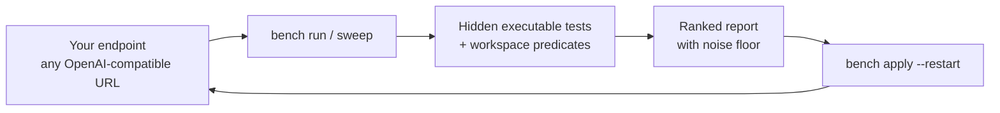
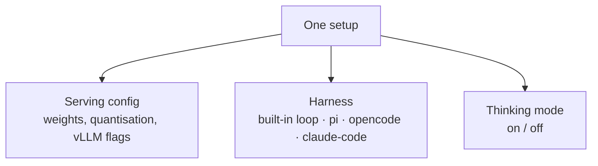

<p></p>

# Find the best LLM setup for your own machine

Public leaderboards rank models on hardware you don't have, at settings you won't use,
through an agent that isn't yours. This benchmarks the whole stack — serving config,
thinking mode, and the coding agent you actually run — and ends in a config you serve.

[**Best recipe &rarr;**](#best-recipe-right-now) · [**Your harness &rarr;**](#your-harness-is-part-of-the-setup) · [**Quick start &rarr;**](#quick-start) · [**Findings &rarr;**](#what-the-campaigns-found)

## Best recipe right now

**Qwen3.6-35B-A3B-NVFP4 on vLLM, thinking off.** Won the 2026-08-20 round and tops every
suite it has been run on.

```bash
./bench apply qwen3.6-35b-a3b-nvfp4 --restart   # serving host only; restarts vllm-qwen
```

| | |
|---|---|
| Weights | `unsloth/Qwen3.6-35B-A3B-NVFP4` — MoE, ~3B active |
| Serving | vLLM TP1, 262k ctx, fp8 KV cache, MTP speculative decoding (k=2), prefix caching |
| Memory | `--gpu-memory-utilization 0.62` — ~74 GB of the 119 GB unified pool |
| Recipe | [`configs/qwen3.6-35b-a3b-nvfp4.sh`](configs/qwen3.6-35b-a3b-nvfp4.sh) |
| `core16` + `hard12` | **82.1 %** pass@1 thinking-on · 80.4 % thinking-off ([report](results/2026-08-20-ornith-vs-qwen3.6/REPORT.md)) |
| `agentic` | **100 %** solved · 95–97 % valid tool calls ([report](results/2026-08-20-agentic-baseline/REPORT.md)) |
| `agentic-hard` | **agent score 54.6** thinking-on · 50.1 thinking-off ([report](results/2026-08-20-agentic-hard/REPORT.md)) |
| Throughput | ~35–48 tok/s per stream · ~122–187 tok/s aggregate at concurrency 4 |

**Run it with thinking off.** On one-shot suites reasoning costs ~13x the output tokens
for +1.7 points, and blows the budget outright at low caps.

**Except for tool loops.** There thinking cuts turns by a quarter at no accuracy cost. If
your workload is mostly agentic, add:

```
--default-chat-template-kwargs '{"enable_thinking":true,"preserve_thinking":true}'
```

Runner-up: `ornith-1.5-35b-a3b-nvfp4` — same accuracy at its best setting, 38 % fewer
output tokens, but collapses without its reasoning block and stalls more often.

## How it works



A setup is three things at once, and they interact — the same weights score 60.7 % or
80.4 % depending on one chat-template kwarg:



| Principle | What it means here |
|---|---|
| Measured where it runs | Any OpenAI-compatible endpoint, your hardware, your flags |
| Both thinking modes, always | Separate rows — they are separate products |
| Cost next to accuracy | Output tokens, wall-clock, turns, truncation all reported |
| Two workload shapes | One-shot code generation and multi-turn tool calling disagree |
| Your agent counts too | `bench setup` benchmarks your daily editor config — skills, MCP, extensions included |
| The winner is installable | `bench apply <config> --restart` and you are serving it |
| Nothing scored on vibes | Hidden unit tests, each proven passable by a reference solution |

## Quick start

Install:

```bash
pip install -e .
```

Point it at your endpoint:

```bash
export BENCH_BASE_URL=http://localhost:8001/v1 BENCH_MODEL=my-model
```

Prove the tests are passable before trusting any score:

```bash
./bench validate
```

Run a suite:

```bash
./bench run --suite all --thinking --max-tokens 16000 --label "my-model think-ON"
```

Build the report:

```bash
./bench report results/*/my-model-think-*.json --title "My model" --verdict "..."
```

`validate` must print `28/28` (and `--suite agentic-all` must print `16/16`). If it does
not, the test is broken and no model score means anything.

## Your harness is part of the setup

Half of what you run is not the model. It is the coding agent around it — its system
prompt, tool schemas, how much context it resends. Same weights, tasks and hardware,
four agents ([campaign](results/2026-08-20-pi-harness/REPORT-hard.md)):

| Harness | Agent score (`agentic-hard`) | Input tokens per task |
|---|---:|---:|
| claude-code | **68.2** | ~16k |
| opencode | 60.3 | ~179k |
| pi | 55.0 | ~119k |
| benchkit built-in loop | 44.9 | — |

Two ways to measure yours:

| Mode | Command | What varies |
|---|---|---|
| Isolated | `./bench harness run --harness opencode -m <provider>/<model> --suite agentic-hard` | The model alone — extensions, skills and MCP stripped |
| Live | `./bench setup --harness pi --suite agentic-hard` | Your daily setup, exactly as you experience it |

A live run writes `REPORT-live.md`, ending in a Suggestions section that ties numbers to
causes: context bloat traced to installed skills and MCP servers, turn-limit hits to
missing tools, low valid-call rates to schema mismatches. One rule — components inside a
live setup may call other models, so a live score measures the whole setup. Never quote it
as a model number.

[Adapter details, `--endpoint` injection, per-harness caveats &rarr;](docs/HARNESSES.md)

## What the campaigns found

| Campaign | Question | Answer |
|---|---|---|
| [2026-08-17](results/2026-08-17-thinking-mode/) | Does thinking mode help a coding agent? | **No.** Thinking off: same or better pass@1, ~13x fewer output tokens, ~32x lower wall-clock |
| [2026-08-18](results/2026-08-18-vllm-vs-ollama/) | vLLM vs ollama vs llama.cpp | vLLM wins from 3 concurrent clients up; prefix caching is off by default |
| [2026-08-20](results/2026-08-20-ornith-vs-qwen3.6/) | Should Ornith-1.5-35B-A3B replace Qwen3.6-35B-A3B? | **No.** Ties at its best config, −20 points at the config we deploy |
| [2026-08-20](results/2026-08-20-agentic-baseline/) | Can the winner drive a tool loop? | **Yes**, 16/16 in both modes. Thinking cuts turns 6.8 &rarr; 5.2 at no accuracy cost |
| [2026-08-20](results/2026-08-20-agentic-hard/) | Can a harder suite separate configs that both look perfect? | **Yes**, 54.6 vs 50.1 — efficiency against oracle par is what separates them |
| [2026-08-20](results/2026-08-20-pi-harness/REPORT.md) | Does the harness around the model change the answer? | **Yes, by as much as a model swap.** Same model, same tasks: 67.4 built-in loop, 76.7 `claude-code`, 77.4 `pi`, 79.3 `opencode` |
| [2026-08-20](results/2026-08-20-pi-harness/REPORT-hard.md) | On tasks that can still be failed, does the harness change the ranking? | **Yes.** `claude-code` 68.2, `opencode` 60.3, `pi` 55.0, built-in 44.9 — prefill spans ~16k to ~179k input tokens per task |
| [2026-08-21](results/2026-08-21/) | Can a free stealth cloud model drive a real tool loop? | **Yes.** 74.8 agent score, 96.9 % solve via opencode — every failure was a generation that never reasoned ([report](results/2026-08-21/REPORT.md)) |
| [2026-08-26](results/2026-08-26/) | Benchmarks harness: muse-spark-1.2 vs mimo-v2.5-free (opencode) | **mimo-v2.5-free wins.** Live: 56.7 vs 44.1 agent score; isolated: 71.0 vs 56.2. Both models scored better stripped of idle skills. Mimo's calls/par ratio (6.5/5.9) was nearly optimal; Muse Spark's was 2× par ([reports](results/2026-08-26/)) |
| [2026-09-04](results/2026-09-04/REPORT-flash-next-analysis.md) | Should Qwen3.8-Flash-Next replace Qwen3.6-35B-A3B for local hosting? | **No.** Wins only think-OFF (+7pp, noise); loses think-ON 58.9 vs 78.6 (21 truncated) and both agentic modes at 2–17× wall time. Solo tenant (~100 GB), shipped KV default fails this box's safety check |
| [2026-09-05](results/2026-09-05/REPORT-flash-next-v2-analysis.md) | Does updated Flash-Next HEAD change the verdict? | **No.** All deltas vs 09-04 within noise (85.7 / 53.6 / 87.5 / 81.2). Reliability fixed (ships bootable defaults, zero watchdog events) — accuracy did not move |
| [2026-09-14](results/2026-09-14/REPORT-minicpm5-2b-mlx-dspark-cap7.md) | Is MiniCPM5-2B via mlx-dspark good for agentic workflows on an M1 Max? | **Usable, but not strong.** Thinking OFF scored 36.6 vs 37.7 ON while using 3.5× fewer output tokens and 3.1× less wall time; the 6.2-point solve-rate delta is within noise |

The recurring lesson: benchmark both thinking modes on the workload you actually run,
through the agent you actually run it. Reasoning-trained models collapse without their
thinking block; non-reasoning models burn thousands of tokens with it. The right answer
flips between one-shot generation and tool loops, and swapping only the harness moved
identical weights by up to 23 points.

## The suites

| Suite | Tasks | What it covers |
|---|---|---|
| `core16` | 16 | Algorithms, data structures, parsing, Python idiom. **Saturated** — current models score 100 % |
| `hard12` | 12 | Regex-matching DP, relaxed-JSON parser, Vixie-cron `next_run`, bigint long division, nestable transactions, tiny SQL evaluator, weighted interval scheduling, first-order unification. Models land at 45–75 % |
| `all` | 28 | `core16` + `hard12` |
| `agentic` | 8 | Multi-turn tool calling over a sandboxed workspace — 7 tools, scored by a predicate over the final state |
| `agentic-hard` | 8 | **Ranking tasks.** Hidden tests, decoys, cascading bugs, perf budgets, cases where the correct move is to change nothing. Scored on agent score = solve rate x efficiency vs oracle par |
| `agentic-all` | 16 | `agentic` + `agentic-hard` |

## Commands

| Command | What it does |
|---|---|
| `./bench suites [-v]` | List suites and their tasks |
| `./bench validate` | Prove every task's hidden tests are passable |
| `./bench run` | Run a suite against an endpoint, write a result JSON |
| `./bench report *.json` | Build a Markdown report with mermaid charts |
| `./bench harness list` | Which coding harnesses are installed here |
| `./bench harness models` | Which models each can reach, from **your** config |
| `./bench harness run --harness opencode -m <p>/<m>` | Run a suite through a real coding agent |
| `./bench setup --harness pi` | Benchmark your live daily setup, with suggestions about it |
| `./bench configs` | List serving recipes, and which are sweepable |
| `./bench apply <name> [--restart]` | Install one as your live server config (serving host) |
| `./bench compare <model>...` | DGX box only: swap, run, restore, report |
| `./bench sweep --setup ...` | DGX box only: rank whole setups, not just models |

[Full walkthrough](docs/REPRODUCING.md) · [Agent runbook](AGENTS.md) · [Harnesses](docs/HARNESSES.md) · [Roadmap](ROADMAP.md)

## Sweeping setups, not just models

`bench compare` sweeps the model. `bench sweep` takes an explicit matrix of setups and
ranks them:

```bash
./bench sweep --suite agentic-hard --title "27B dense vs 35B MoE" \
  --setup config=qwen3.6-35b-a3b-nvfp4,thinking=both \
  --setup config=qwen3.8-27b-nvfp4-dspark,thinking=both \
  --setup config=qwen3.6-35b-a3b-nvfp4,harness=opencode,model=montimage-dgx-spark \
  --dry-run
```

| Behaviour | Detail |
|---|---|
| Explicit matrix | Each `--setup` is one real combination; only `thinking=both` expands |
| One restart per config | Setups are grouped, so six setups over two configs restart twice |
| Every restart is gated | Refuses without `--yes-restart-endpoint`, and refuses outright when it cannot ask |
| Launcher restored | On success and on failure; a failing restore is reported, never buried |
| Ranked within a block | One harness, one thinking mode — a cross-harness winner would be reporting the harness |

Drop `config=` from every setup to sweep the harness and thinking axes against whatever is
already serving, without touching the launcher.

<details>
<summary>Why the ranking never crosses harnesses, and how noise is handled</summary>

The same weights score 67.4 through the built-in loop and 79.3 through opencode here, so a
single cross-harness "winner" would be reporting the harness rather than the setup. Each
block names its own winner and says whether the margin clears the noise floor for the
sample count used — about 8 points at `--samples 2`, scaled by 1/sqrt(n) above that.

The ranking is rebuildable from the result files alone:

```bash
./bench report <dir>/*.json --setups
```

A sweep that finished but tripped over its report is not lost.

There is deliberately no "swap but do not restart" mode: it would measure the previous
config and file the result under the new one's name.

Not every recipe in `configs/` can be swept. `bench configs` marks the ones that cannot and
says why — a llama.cpp script, a standalone tunable server, and a secondary backend on its
own systemd unit are all fine recipes, just not drivable by the `vllm-qwen` machinery.

</details>

<details>
<summary>Why the tests are trustworthy</summary>

Every task ships a **reference solution**. `./bench validate` runs all 28 of them against
the same hidden tests the model will face. If it does not print `28/28`, the test is broken
and no model score means anything. Run it first, every time.

Scoring is pass@1 over executable tests, not string matching and not an LLM judge: the
model's largest fenced code block is extracted, the hidden tests are appended, and the
program runs in a subprocess. It passes or it does not.

The agentic suites are scored by a predicate over the final workspace state, never by what
the model claims it did.

When `hard12` saturates too, write the next one — see
[adding tasks](docs/REPRODUCING.md#adding-tasks-and-suites).

</details>

<details>
<summary>Why machine-local benchmarking, in full</summary>

Public benchmarks rank *models* on hardware you don't have, at settings you won't use.
This one answers a narrower and more useful question: of the things you could actually
serve on this box, which exact configuration should you run every day?

The answer is machine-local, and that is the point. The best setup for user A is routinely
the wrong one for user B — different GPU, different memory ceiling, different quantisation
available, different concurrency, different work. A published score cannot know any of
that. Running the suite on your own endpoint can.

A configuration is more than a model name — it's the model, the quantisation, the serving
flags, and the thinking mode, together. Those interact: the same weights score 60.7 % or
80.4 % on the same suite depending on one chat-template kwarg, and the right answer flips
between one-shot coding and tool loops.

The same model scores 12 points apart through four different tool loops, so the suites also
run through the coding agent you actually use (`pi`, `opencode`, `claude-code`). A model
your editor does not know about is reachable with `--endpoint <url>` on any of the three
harnesses. Nothing is written to your editor's configuration either way. And `bench setup`
drops the isolation instead: it measures your daily configuration as-is — extensions,
skills, MCP servers — and reports suggestions about that setup beside the score.

Built and used on an **NVIDIA DGX Spark (GB10)**, but the harness itself only needs a URL.

</details>

<details>
<summary>Serving configs you can adopt</summary>

[`configs/`](configs/) holds complete, benchmarked `vllm serve` recipes. Install one and
you have a server:

```bash
./bench apply qwen3.6-35b-a3b-nvfp4 --restart   # serving host only; restarts vllm-qwen
```

Each recipe is listed with its measured pass@1 and throughput, and the reasons its flags
are the way they are — MoE backends, MTP weight requirements, how the memory fraction is
computed. Architecture, ports and rollback: [SERVING.md](SERVING.md).

</details>

<details>
<summary>Repository layout</summary>

```
bench                  CLI entry point
benchkit/              the harness
  suites/              task definitions (core16, hard12) and the suite registry
  agentic/             the tool-calling suite: sandboxed workspace, tool schemas, agent loop
  harness/             adapters that run the same tasks through a real coding agent (pi, ...)
  references.py        a working solution for every task — the validation floor
  runner.py            generation, sandboxed test execution, scoring
  report.py            Markdown + mermaid report generator
  serving.py           optional: swap and restart the local vLLM service
  sweep.py             the setup matrix: grouping, approval gate, launcher restore
configs/               benchmarked, ready-to-run serving recipes
results/               one dated directory per campaign: raw JSON, logs, REPORT.md
AGENTS.md              runbook for an AI agent driving the whole thing
ROADMAP.md             what is planned, and what is deliberately not
docs/REPRODUCING.md    how to reproduce or extend any of it
SERVING.md             the serving stack on the reference hardware
start-qwen.sh          the active launcher (systemd runs this; `bench apply` writes it)
router.py              OpenAI-compatible router fronting multiple vLLM backends
```

Results directories are append-only: a superseded campaign stays next to the one that
replaced it. Model weights and torch-compile caches are gitignored.

</details>

## Get started

```bash
pip install -e .
```

```bash
./bench validate
```

[**Reproduce a campaign &rarr;**](docs/REPRODUCING.md) · [**Benchmark your own setup &rarr;**](docs/HARNESSES.md) · [MIT licensed](LICENSE)
