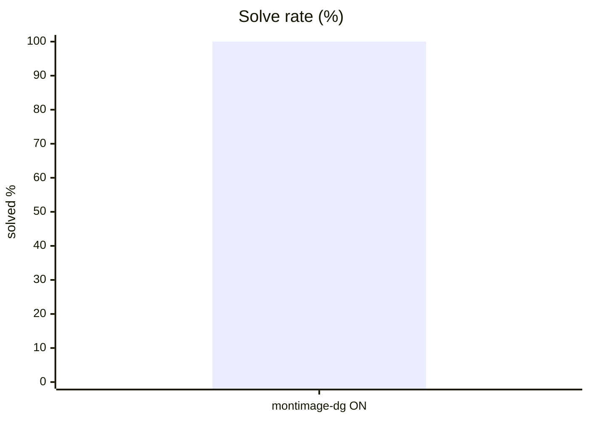
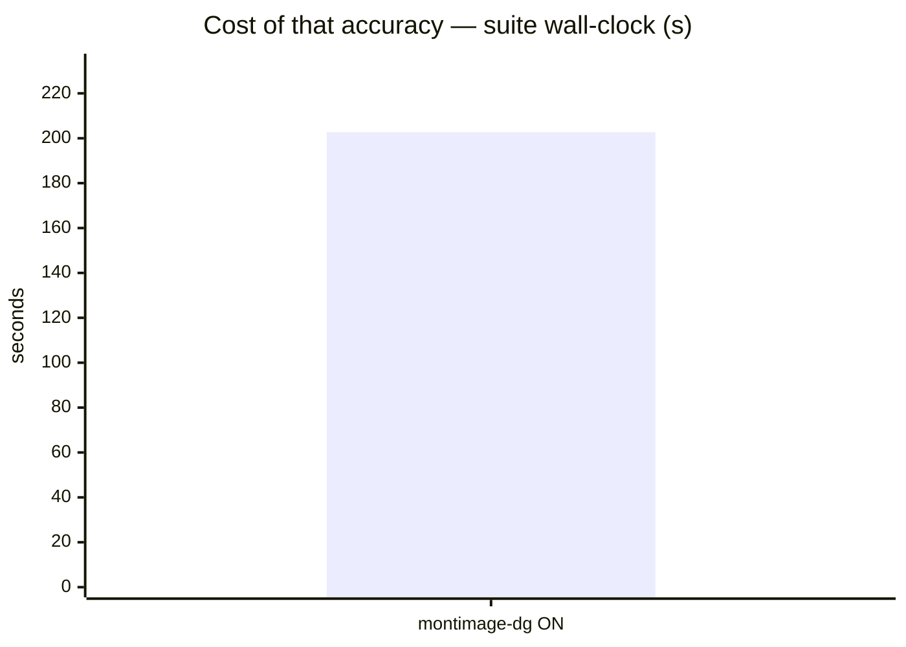
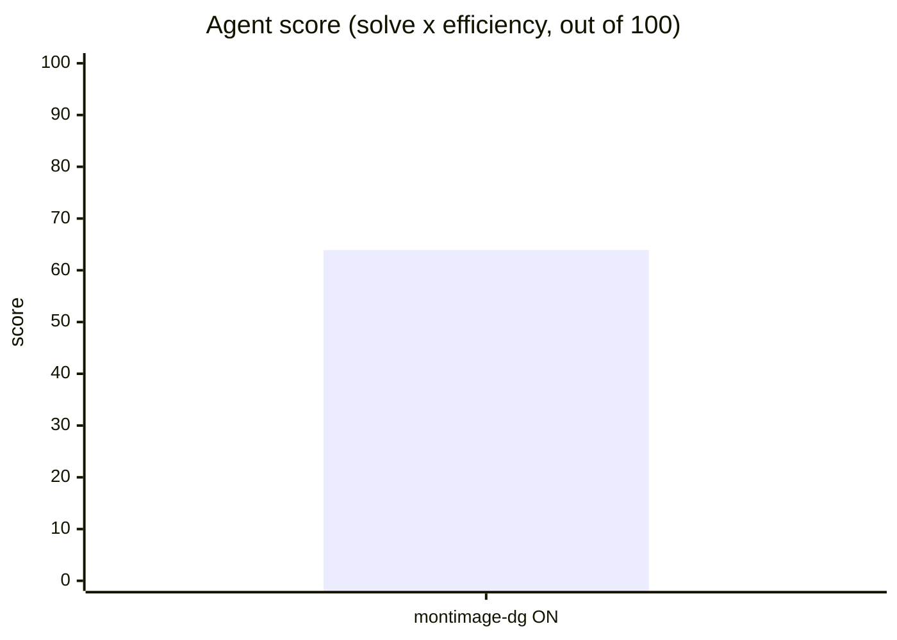
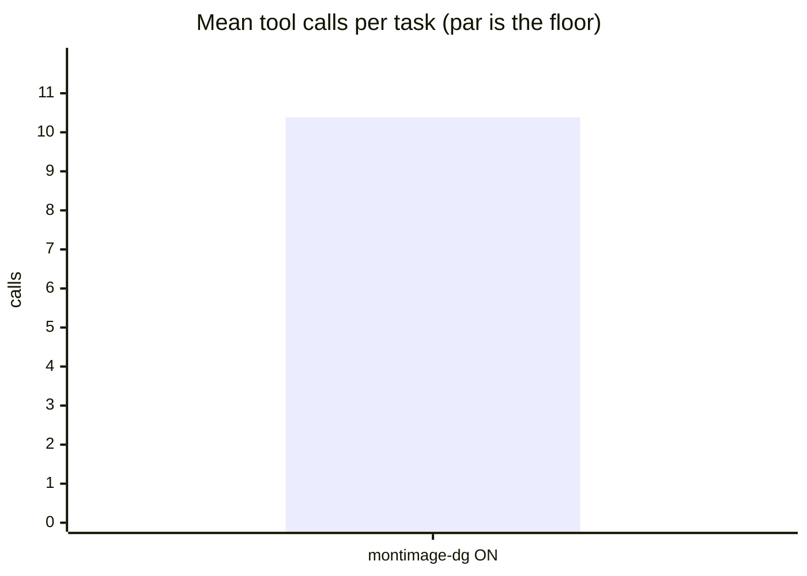
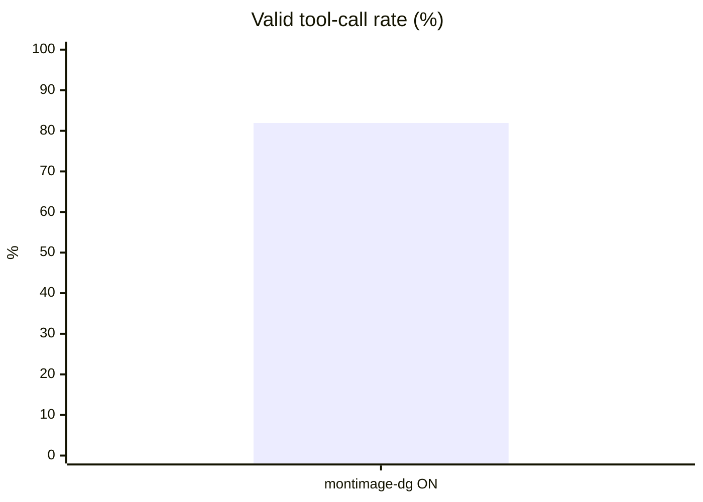
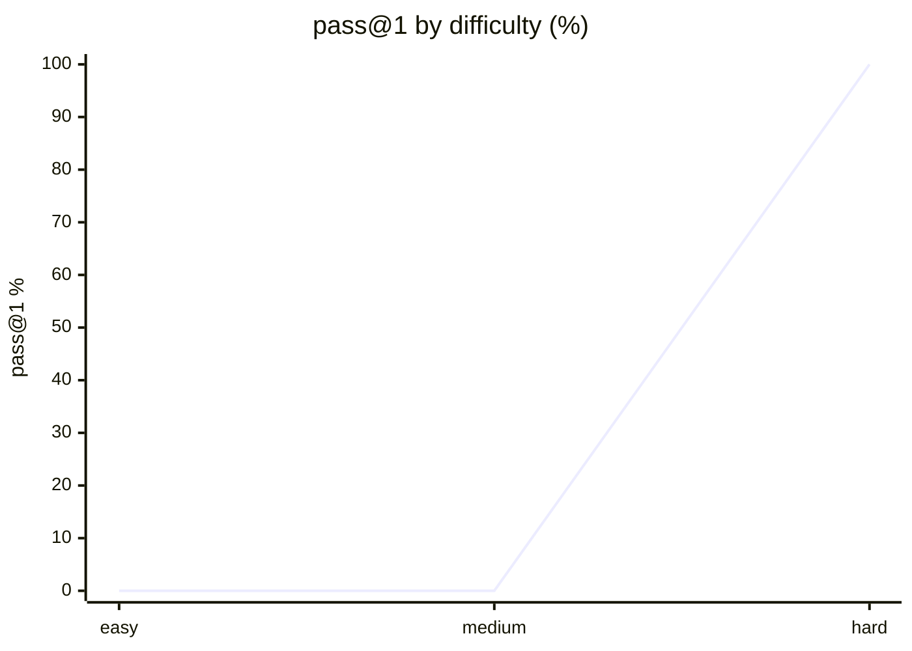

# Live setup: pi

**Question.** Is pi's current setup any good, and what should improve?

## Setup

| | |
|---|---|
| Endpoint | not recorded |
| Tasks | 8 |
| Samples per task | 1 (⇒ 8 generations per run) |
| Concurrency | 2 |
| Metric | pass@1 over hidden executable unit tests |

## Results

| Run | Agent score | Solved | Efficiency | Mean calls | Par | Valid calls | Turn-limit | Wall |
|---|---|---|---|---|---|---|---|---|
| **pi live dgx-spark-montimage-dgx-spark think-ON** | **63.9** | 100.0 % | 63.9 % | 10.4 | 5.9 | 81.9 % | 0 | 203 s |

**Agent score** = solve rate x efficiency, out of 100 — solving is the price of entry, efficiency breaks the ties solve rate cannot. *Efficiency* = par tool calls / calls actually used, capped at 1 and counted only on solved tasks. *Par* is measured by running each task's oracle, so it does not depend on the model. *Valid calls* = calls that did not error. *Turn-limit* = runs abandoned without finishing.

Line 1 = pi live dgx-spark-montimage-dgx-spark think-ON

## Suggestions — pi live dgx-spark-montimage-dgx-spark think-ON

- Valid tool-call rate is **81.9 %** — many calls error. Check the harness's tool-call parser / schema wiring against the model's expected format before blaming the model.
- Tasks use **10.4 tool calls against a par of 5.9**. In a live setup, verbose skills or an over-eager MCP server can push the agent into exploratory calls; trimming instructions usually recovers most of the gap.
- This was a **live-mode** run of your daily setup: extensions, skills and MCP servers were enabled. Any component that can call another model contaminates these numbers — see the caveats section.

## Caveats

- 1 samples per task. Differences under ~8 points are noise, not signal.
- Multi-turn agentic tool use against a sandboxed workspace. One-shot code generation is not exercised here.
- Success is decided by a predicate over the final workspace, never by what the model claims. Every task's oracle is verified to solve it first.
- A task abandoned at the turn limit counts as failed; raise `--max-turns` before concluding the model cannot do it.

## Raw data

- `pi-live-dgx-spark-montimage-dgx-spark-think-on.json` — pi live dgx-spark-montimage-dgx-spark think-ON
## Run context

_Collected at 2026-08-28 21:20 UTC — the conditions this result must be read against._

### Machine

| Field | Value |
|---|---|
| host | M1 |
| os | macOS 26.6.2 25.6.0 (arm64) |
| cpu | Apple M1 Max — 10 threads |
| memory | 32 GiB |
| disk | 382Gi free on 5.6M |
| load avg | 9.92 9.39 9.69 |

### GPU

No `nvidia-smi` — GPU unknown. On a hosted model this is expected and harmless;
on a local endpoint it means the serving device was not recorded.

### Serving endpoint

| Field | Value |
|---|---|
| base url | http://localhost:8001/v1 |
| serves | not reachable (hosted model, or nothing local is serving) |
| unit | unknown |

### Harness setup

A live run measures this surface, not the model alone. Every skill, MCP server and
extension below is part of the result.

| Field | Value |
|---|---|
| harness | pi |
| model | 9router/mi-dspark/unsloth/Qwen3.6-35B-A3B-NVFP4 |
| thinking | on |
| version | 0.84.3 |
| agent dir | /Users/montimage/.pi/agent |
| extensions | npm:@tintinweb/pi-subagents, npm:grok-pi, ../../buildspace/luongnv89/pi-extensions/extensions/claude-code-pi, npm:claude-code-pi, ../../buildspace/luongnv89/pi-extensions/extensions/agy-pi, ../../buildspace/luongnv89/pi-extensions/extensions/hermes-pi, ../../buildspace/luongnv89/pi-extensions/extensions/timestamp-pi, ../../buildspace/luongnv89/pi-extensions/extensions/cache-warm, ../../buildspace/luongnv89/pi-extensions/extensions/cache-warm/dist, /Users/montimage/.pi/agent/extensions/9router-pi, /Users/montimage/.pi/agent/extensions/advisor-pi, /Users/montimage/.pi/agent/extensions/agy-pi, /Users/montimage/.pi/agent/extensions/cache-warm, /Users/montimage/.pi/agent/extensions/claude-code-pi, /Users/montimage/.pi/agent/extensions/grok-pi, /Users/montimage/.pi/agent/extensions/model-debugger, /Users/montimage/.pi/agent/extensions/opencode-pi, /Users/montimage/.pi/agent/extensions/statusline-pi, /Users/montimage/.pi/agent/extensions/subagents-pi, /Users/montimage/.pi/agent/extensions/timestamp-pi |
| catalogue | 9 provider(s) |
| project context | CLAUDE.md AGENTS.md  |
