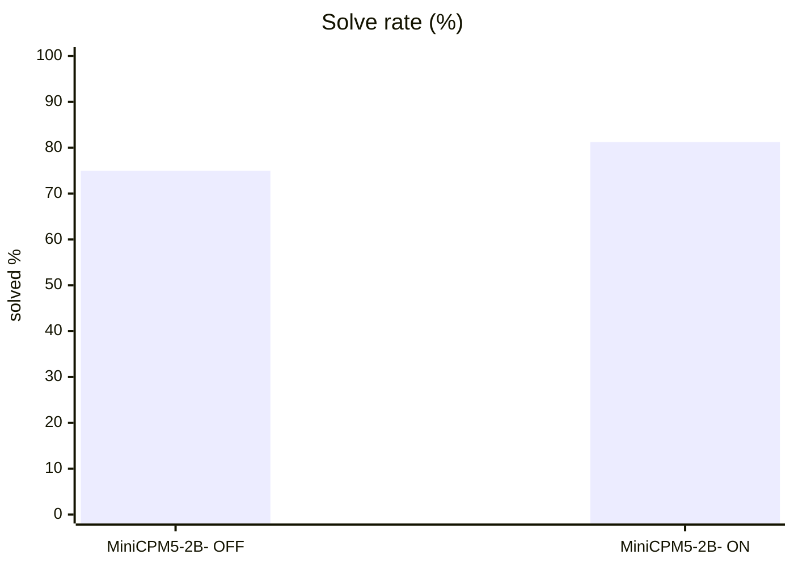
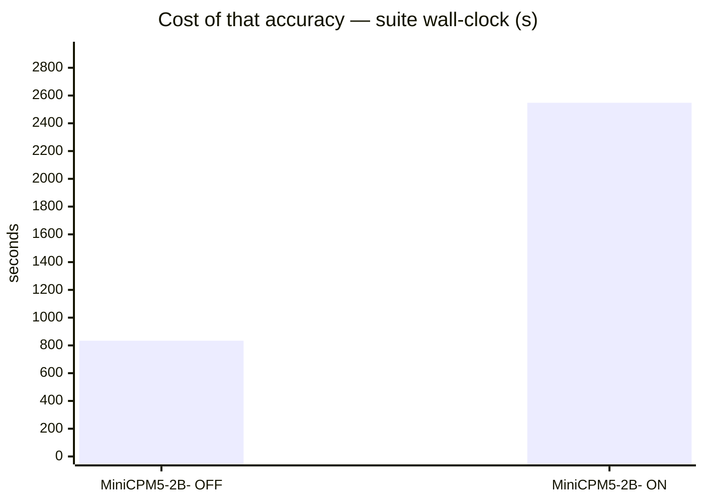
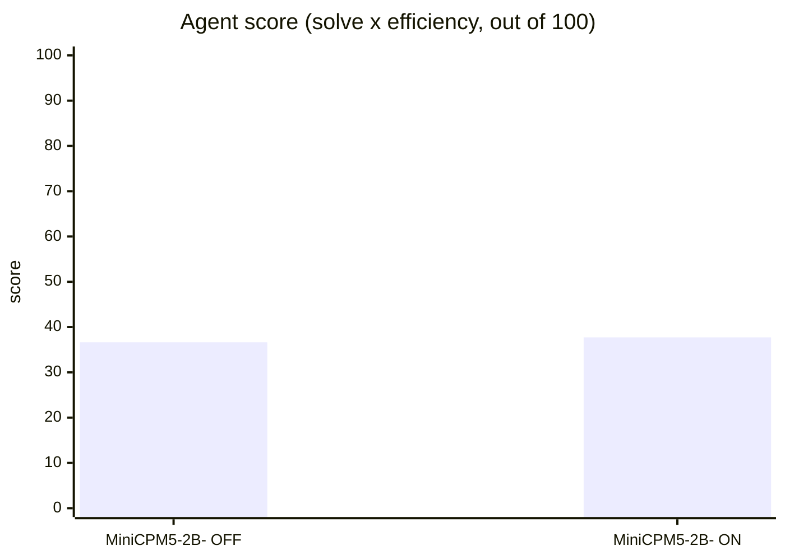
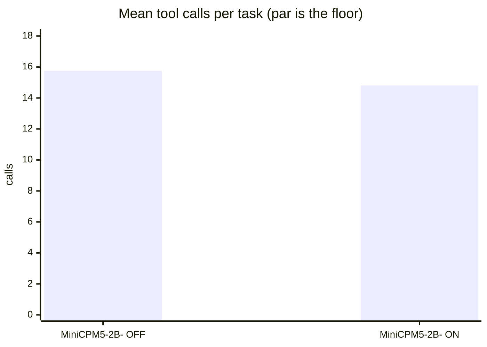
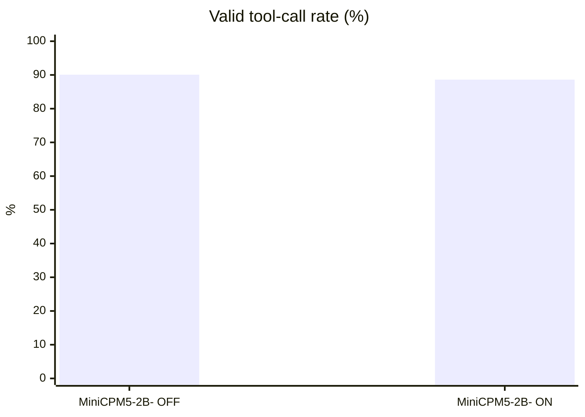
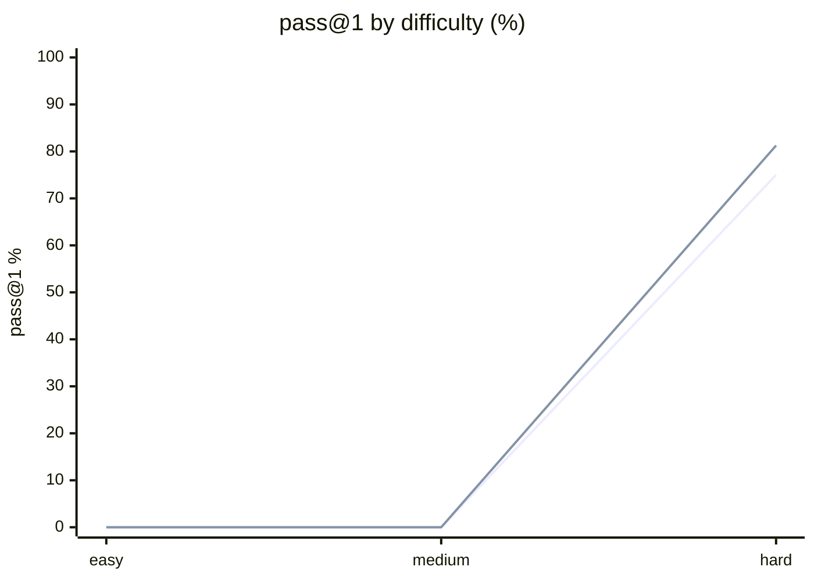

# MiniCPM5-2B via mlx-dspark on M1 Max

**Question.** Is MiniCPM5-2B good for agentic workflows on this machine?

**Verdict.** Usable but not strong: choose thinking OFF by default; thinking ON costs about 3.5x more output and 3.1x wall time without a statistically meaningful quality or agent-score gain.

## Setup

| | |
|---|---|
| Endpoint | `http://127.0.0.1:8080` |
| Tasks | 8 |
| Samples per task | 2 (⇒ 16 generations per run) |
| Concurrency | 4 |
| Metric | pass@1 over hidden executable unit tests |

## Results

| Run | Agent score | Solved | Efficiency | Mean calls | Par | Valid calls | Turn-limit | Wall |
|---|---|---|---|---|---|---|---|---|
| MiniCPM5-2B mlx-dspark-cap7 agentic-OFF | 36.6 | 75.0 % | 48.8 % | 15.8 | 5.9 | 90.1 % | 3 | 834 s |
| **MiniCPM5-2B mlx-dspark-cap7 agentic-ON** | **37.7** | 81.2 % | 46.4 % | 14.8 | 5.9 | 88.6 % | 1 | 2,548 s |

**Agent score** = solve rate x efficiency, out of 100 — solving is the price of entry, efficiency breaks the ties solve rate cannot. *Efficiency* = par tool calls / calls actually used, capped at 1 and counted only on solved tasks. *Par* is measured by running each task's oracle, so it does not depend on the model. *Valid calls* = calls that did not error. *Turn-limit* = runs abandoned without finishing.

Line 1 = MiniCPM5-2B mlx-dspark-cap7 agentic-OFF · Line 2 = MiniCPM5-2B mlx-dspark-cap7 agentic-ON

## Where they disagree — MiniCPM5-2B mlx-dspark-cap7 agentic-ON vs MiniCPM5-2B mlx-dspark-cap7 agentic-OFF

| Task | MiniCPM5-2B mlx-dspark-cap7 agentic-ON | MiniCPM5-2B mlx-dspark-cap7 agentic-OFF | Winner |
|---|---|---|---|
| `api_migration` | 100 % | 50 % | MiniCPM5-2B mlx-dspark-cap7 agentic-ON |
| `generalise_migration` | 50 % | 100 % | MiniCPM5-2B mlx-dspark-cap7 agentic-OFF |
| `wrong_test_not_code` | 100 % | 50 % | MiniCPM5-2B mlx-dspark-cap7 agentic-ON |

## Reading the numbers

## Local setup

- Machine: Apple M1 Max, 32-core GPU, 32 GB unified memory.
- Server: mlx-dspark 0.19.0, MLX 0.32.2.
- Target: `mlx-community/MiniCPM5-2B-bf16`.
- Drafter: `openbmb/MiniCPM5-2B-DSpark`.
- Serving mode: DSpark with fixed draft cap 7.
- Benchmark path: benchkit built-in agentic tool loop, `agentic-hard`, 2 samples per task.

## Interpretation

Thinking ON improved pass@1 from 75.0% to 81.2%, but the 6.2-point difference is below this repository's approximate 8-point noise threshold at two samples. It also increased mean output from 1,764 to 6,207 tokens and wall time from 834 to 2,548 seconds. Agent score was nearly unchanged (36.6 vs 37.7), so the extra reasoning cost did not produce a decisive practical gain.

Both modes were inefficient relative to oracle paths: 14.8–15.8 calls versus 5.9 par, with stalled or turn-limit runs. Thinking OFF is therefore the better default for agentic use on this machine. Thinking ON should be reserved for difficult retries rather than enabled globally.

## Caveats

- 2 samples per task. Differences under ~8 points are noise, not signal.
- Multi-turn agentic tool use against a sandboxed workspace. One-shot code generation is not exercised here.
- Success is decided by a predicate over the final workspace, never by what the model claims. Every task's oracle is verified to solve it first.
- A task abandoned at the turn limit counts as failed; raise `--max-turns` before concluding the model cannot do it.

## Raw data

- `minicpm5-2b-mlx-dspark-cap7-agentic-off.json` — MiniCPM5-2B mlx-dspark-cap7 agentic-OFF
- `minicpm5-2b-mlx-dspark-cap7-agentic-on.json` — MiniCPM5-2B mlx-dspark-cap7 agentic-ON
