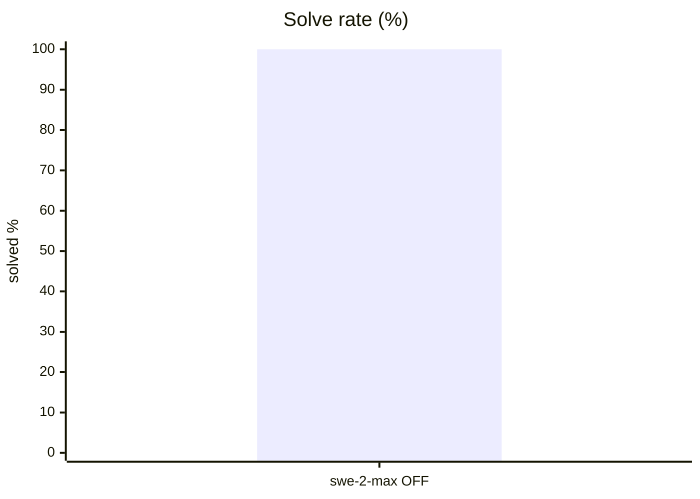
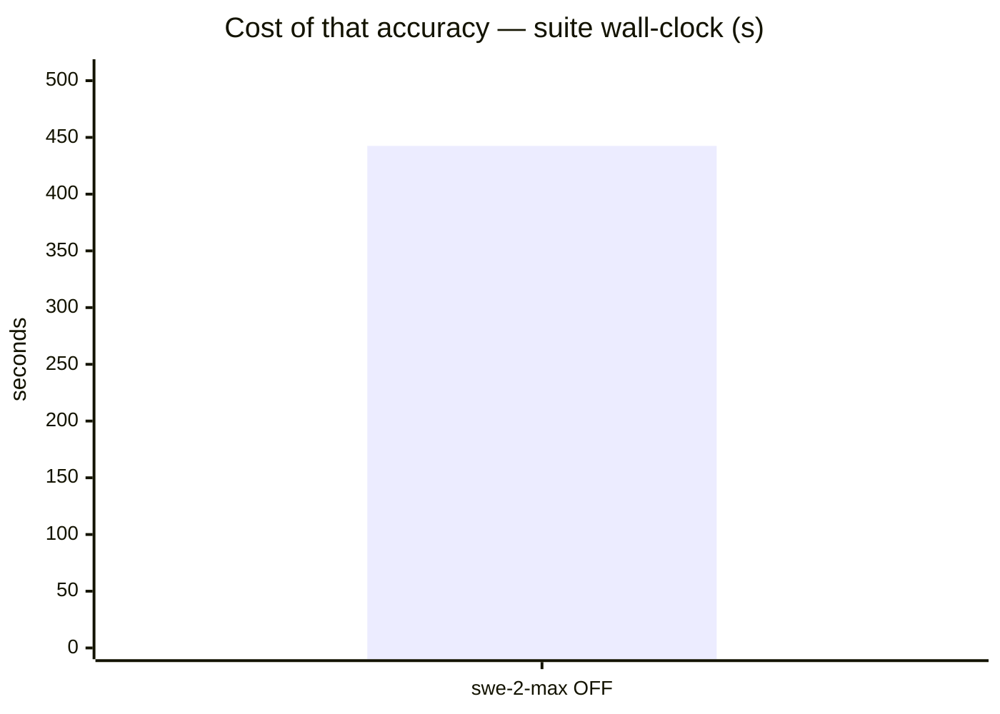
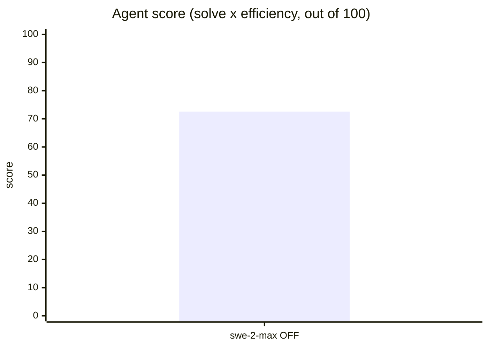
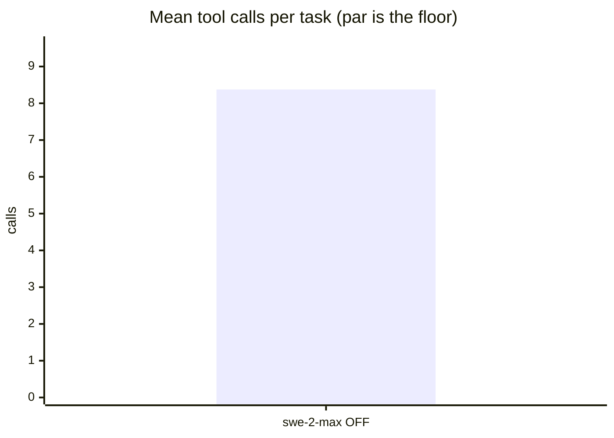
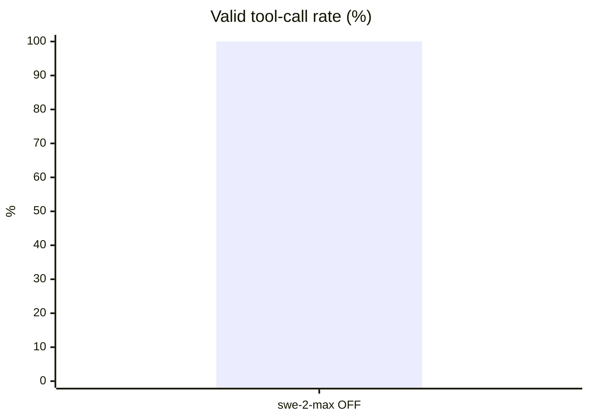
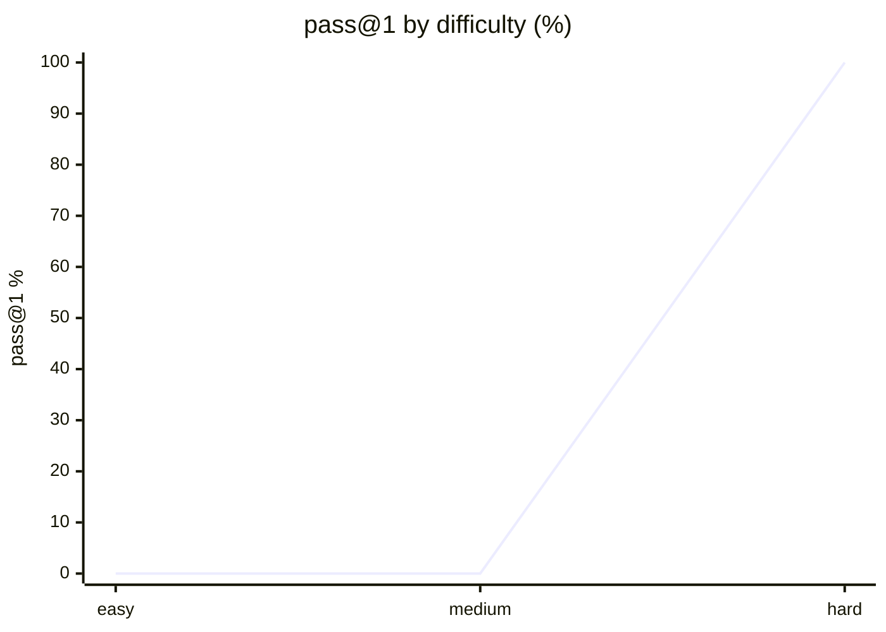

# Live setup: devin

**Question.** Is devin's current setup any good, and what should improve?

## Setup

| | |
|---|---|
| Endpoint | not recorded |
| Tasks | 8 |
| Samples per task | 1 (⇒ 8 generations per run) |
| Concurrency | 2 |
| Metric | pass@1 over hidden executable unit tests |

## Results

| Run | Agent score | Solved | Efficiency | Mean calls | Par | Valid calls | Turn-limit | Wall |
|---|---|---|---|---|---|---|---|---|
| **devin live swe-2-swe-2-max think-OFF** | **72.6** | 100.0 % | 72.6 % | 8.4 | 5.9 | 100.0 % | 0 | 443 s |

**Agent score** = solve rate x efficiency, out of 100 — solving is the price of entry, efficiency breaks the ties solve rate cannot. *Efficiency* = par tool calls / calls actually used, capped at 1 and counted only on solved tasks. *Par* is measured by running each task's oracle, so it does not depend on the model. *Valid calls* = calls that did not error. *Turn-limit* = runs abandoned without finishing.

Line 1 = devin live swe-2-swe-2-max think-OFF

## Suggestions — devin live swe-2-swe-2-max think-OFF

- Mean input tokens is **124,371 per task** — context is being resent every turn. In a live setup, audit installed **skills and MCP servers**: each one's prompt/schema rides along on every call even when unused. Disable what this work does not need.
- This was a **live-mode** run of your daily setup: extensions, skills and MCP servers were enabled. Any component that can call another model contaminates these numbers — see the caveats section.

## Caveats

- 1 samples per task. Differences under ~8 points are noise, not signal.
- Multi-turn agentic tool use against a sandboxed workspace. One-shot code generation is not exercised here.
- Success is decided by a predicate over the final workspace, never by what the model claims. Every task's oracle is verified to solve it first.
- A task abandoned at the turn limit counts as failed; raise `--max-turns` before concluding the model cannot do it.

## Raw data

- `devin-live-swe-2-swe-2-max-think-off.json` — devin live swe-2-swe-2-max think-OFF
## Run context

_Collected at 2026-09-14 22:05 UTC — the conditions this result must be read against._

### Machine

| Field | Value |
|---|---|
| host | M1 |
| os | macOS 26.6.2 25.6.0 (arm64) |
| cpu | Apple M1 Max — 10 threads |
| memory | 32 GiB |
| disk | 334Gi free on 6.4M |
| load avg | 106.77 97.35 53.55 |

### GPU

No `nvidia-smi` — GPU unknown. On a hosted model this is expected and harmless;
on a local endpoint it means the serving device was not recorded.

### Serving endpoint

| Field | Value |
|---|---|
| base url | http://localhost:8001/v1 |
| serves | not reachable (hosted model, or nothing local is serving) |
| unit | unknown |

### Harness setup

A live run measures this surface, not the model alone. Every skill, MCP server and
extension below is part of the result.

| Field | Value |
|---|---|
| harness | devin |
| model | swe-2-max |
| thinking | n/a |
| version | devin 3000.10.21 (611c1cba) |
| config | /Users/montimage/.config/devin/config.json |
| skills | 86 listed (devin skills list) |
| mcp | 1 configured |
| plugins | 1 listed |
| project context | CLAUDE.md AGENTS.md  |
## Surface usage

_67 tool calls, classified. Built-ins identified from the static table for `devin`; unrecognised names are reported as unattributed, not as skills._

| Kind | What | Calls |
|---|---|---|
| builtin | `read` | 33 |
| builtin | `exec` | 20 |
| builtin | `edit` | 8 |
| builtin | `write` | 4 |
| builtin | `grep` | 1 |
| skill | `(name not recorded)` | 1 |

Installed vs called:

- **skills installed**: 86 listed (devin skills list)
- **mcp installed**: 1 configured
- **plugins installed**: 1 listed

**1 of 67 calls came from the surface.** By task:

- `perf_budget` — `skill` x1

Skill invocations are counted but not named: benchkit records the tool name only, and the skill's identity lives in the tool-call input it discards. See `references/surface-ab.md`.
## Surface usage

_67 tool calls, classified. Built-ins identified from the isolated arm._

| Kind | What | Calls |
|---|---|---|
| builtin | `read` | 33 |
| builtin | `exec` | 20 |
| builtin | `edit` | 8 |
| builtin | `write` | 4 |
| builtin | `grep` | 1 |
| skill | `(name not recorded)` | 1 |

Installed vs called:

- **skills installed**: 86 listed (devin skills list)
- **mcp installed**: 1 configured
- **plugins installed**: 1 listed

**1 of 67 calls came from the surface.** By task:

- `perf_budget` — `skill` x1

Skill invocations are counted but not named: benchkit records the tool name only, and the skill's identity lives in the tool-call input it discards. See `references/surface-ab.md`.

## Surface A/B — live vs isolated

Same model, same suite, same samples. The live arm runs your daily surface; the isolated arm strips skills, MCP servers, plugins and settings.

| Metric | live | isolated | delta |
|---|---|---|---|
| agent score | 72.6 | 71.3 | +1.2 ✓ |
| solve rate % | 100.0 | 100.0 | +0.0 |
| efficiency % | 72.6 | 71.3 | +1.2 ✓ |
| calls / task | 8.4 | 8.9 | -0.5 ✓ |
| turns / task | 5.5 | 5.9 | -0.4 ✓ |
| input tok / task | 124371 | 138845 | -14474 ✓ |
| output tok / task | 4993 | 5110 | -117 ✓ |
| wall (s) | 443 | 560 | -117 ✓ |

**Not a result.** The arms differ by 1.2 points at 1 sample(s); anything under 8 is noise in this benchmark. Re-run both arms at `--samples 4` before concluding the surface helps or hurts.

Caveat: on claude-code the isolated arm also pins the built-in tool set (no Task/WebSearch/WebFetch), so its arm differs by more than the surface alone. `references/surface-ab.md` lists what each harness strips.
