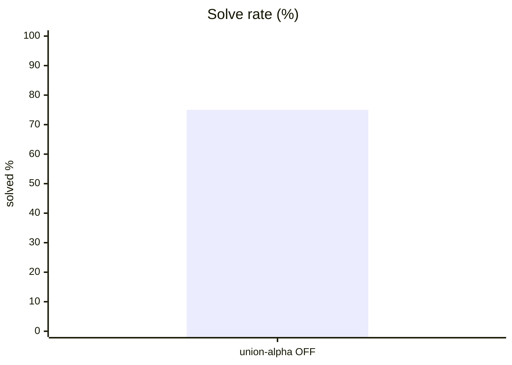
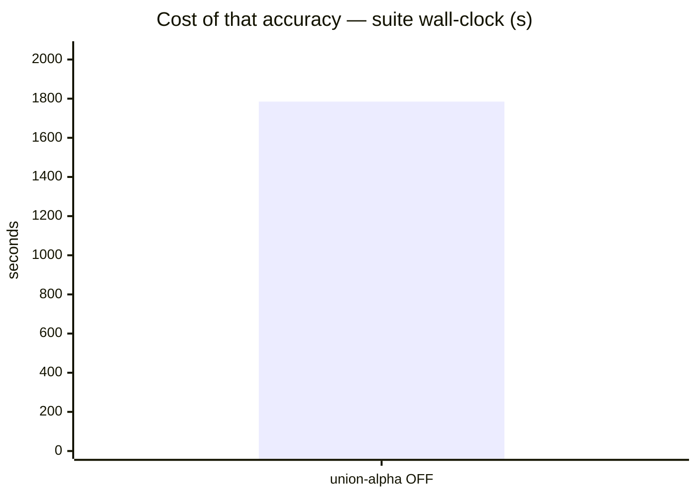
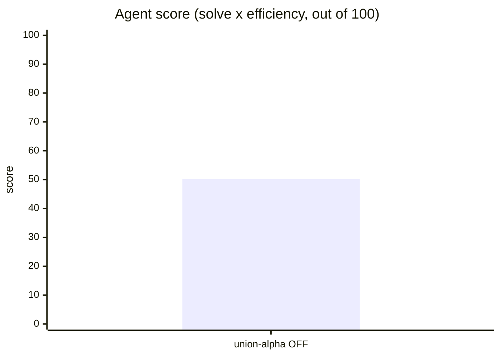
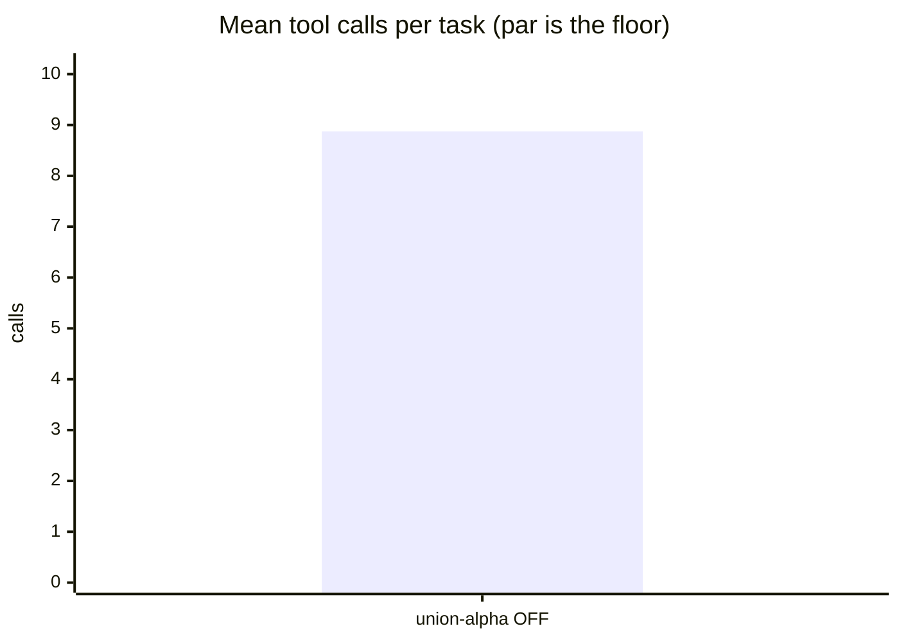
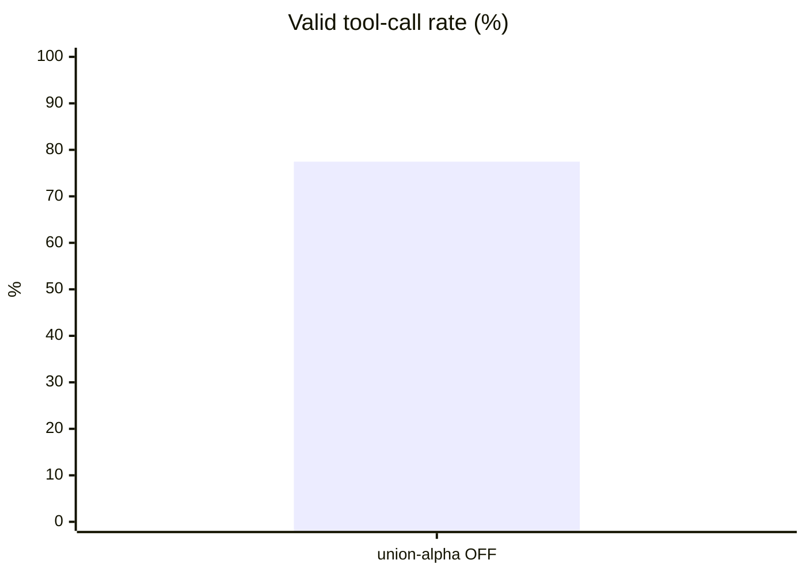
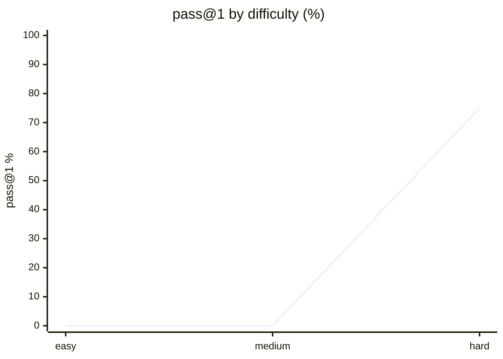

# Live setup: opencode

**Question.** Is opencode's current setup any good, and what should improve?

## Setup

| | |
|---|---|
| Endpoint | not recorded |
| Tasks | 8 |
| Samples per task | 1 (⇒ 8 generations per run) |
| Concurrency | 2 |
| Metric | pass@1 over hidden executable unit tests |

## Results

| Run | Agent score | Solved | Efficiency | Mean calls | Par | Valid calls | Turn-limit | Wall |
|---|---|---|---|---|---|---|---|---|
| **opencode live opencode-union-alpha think-OFF** | **50.2** | 75.0 % | 66.9 % | 8.9 | 5.9 | 77.5 % | 0 | 1,785 s |

**Agent score** = solve rate x efficiency, out of 100 — solving is the price of entry, efficiency breaks the ties solve rate cannot. *Efficiency* = par tool calls / calls actually used, capped at 1 and counted only on solved tasks. *Par* is measured by running each task's oracle, so it does not depend on the model. *Valid calls* = calls that did not error. *Turn-limit* = runs abandoned without finishing.

Line 1 = opencode live opencode-union-alpha think-OFF

## Suggestions — opencode live opencode-union-alpha think-OFF

- Valid tool-call rate is **77.5 %** — many calls error. Check the harness's tool-call parser / schema wiring against the model's expected format before blaming the model.
- Tasks use **8.9 tool calls against a par of 5.9**. In a live setup, verbose skills or an over-eager MCP server can push the agent into exploratory calls; trimming instructions usually recovers most of the gap.
- This was a **live-mode** run of your daily setup: extensions, skills and MCP servers were enabled. Any component that can call another model contaminates these numbers — see the caveats section.

## Caveats

- 1 samples per task. Differences under ~8 points are noise, not signal.
- Multi-turn agentic tool use against a sandboxed workspace. One-shot code generation is not exercised here.
- Success is decided by a predicate over the final workspace, never by what the model claims. Every task's oracle is verified to solve it first.
- A task abandoned at the turn limit counts as failed; raise `--max-turns` before concluding the model cannot do it.

## Raw data

- `opencode-live-opencode-union-alpha-think-off.1.json` — opencode live opencode-union-alpha think-OFF
## Run context

Collected before retry at 2026-09-16 19:32 UTC.

- Host: M1; Apple M1 Max, 10 logical CPUs, 32 GiB RAM; macOS 26.6.2 arm64.
- Load averages: 3.61 / 5.01 / 5.15; available disk: 314 GiB.
- Harness: OpenCode 1.18.31; model: opencode/union-alpha (Union Alpha Free).
- Mode: live; thinking n/a (the adapter ignores the flag).
- Suite: agentic-hard, 8 tasks, 1 sample, concurrency 2, timeout 900 seconds per task.
- Provider: hosted opencode; actual serving URL and remote GPU contention unknown. The collector's unreachable localhost:8001 default is not this model's endpoint.
- Config previously verified at ~/.config/opencode/opencode.jsonc. The collector only probes ~/.config/opencode/skills and ~/.config/opencode/plugins, not the full effective setup; installed skills, MCP and plugin totals are unknown. Skills are present in the parent session.
- Repo context: CLAUDE.md and AGENTS.md; oracles passed 16/16; repo synchronized without changing source or task tests.
- Runtime difference: this retry uses the existing .venv-mlx-dspark Python 3.12 environment; the earlier benchmark process used system Python 3.14. This is a potential comparison confound despite identical benchmark arguments.
- Timeout caveat: this checkout discards partial timeout metrics and traces. Recorded zeros in timed-out rows do not prove inactivity; aggregate usage may be incomplete.
## Surface usage

_71 tool calls, classified. Built-ins identified from the static table for `opencode`; unrecognised names are reported as unattributed, not as skills._

| Kind | What | Calls |
|---|---|---|
| builtin | `read` | 31 |
| builtin | `bash` | 23 |
| builtin | `edit` | 6 |
| builtin | `write` | 5 |
| builtin | `grep` | 4 |
| builtin | `glob` | 2 |

**The surface was idle.** Every call in this run was a built-in: no skill, MCP server or plugin was invoked. Whatever this run scored, the surface did not earn it — and anything it adds to the system prompt was paid for on every task for nothing.

## Comparison with the earlier run today

| Metric | First run (15:15 UTC) | Retry (19:32 UTC) |
|---|---|---|
| Agent score | 55.6 | 50.2 |
| Solved | 6/8 | 6/8 |
| Efficiency | 74.1 % | 66.9 % |
| Valid calls | 100.0 % | 77.5 % |
| Mean calls vs par | 6.6 / 5.9 | 8.9 / 5.9 |
| Mean turns | 4.0 | 8.2 |
| Wall | 984 s | 1,785 s |
| Timeouts | 2 | 2 (same tasks) |

Both runs solved the same six tasks and timed out on the same two (`hidden_spec_compliance`, `perf_budget`). The 5.4-point score gap is within the ~8-point noise band at 1 sample and is not a result; the valid-call-rate gap (100 % → 77.5 %) is larger than that band and mostly reflects `api_migration` (11 failed calls) and `cascading_failures` (4). No code, task or test changes were made between runs, and both results remain append-only in this directory.
