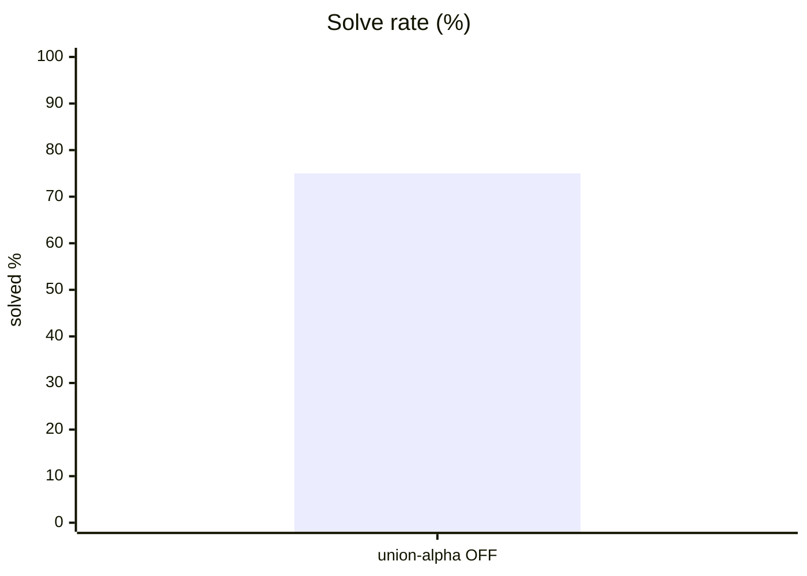
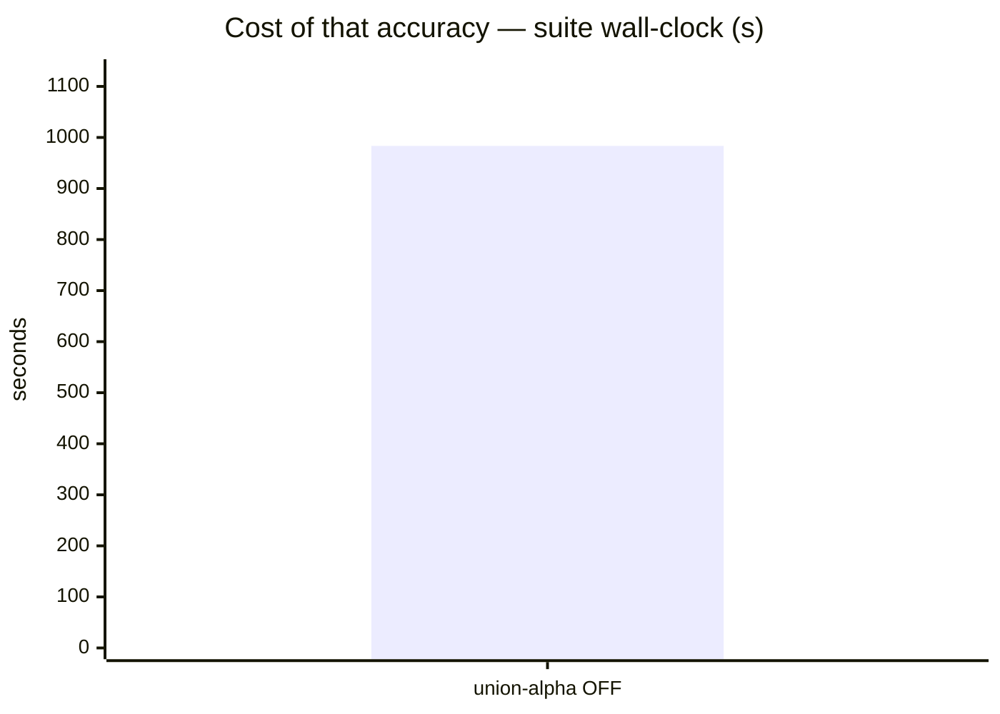
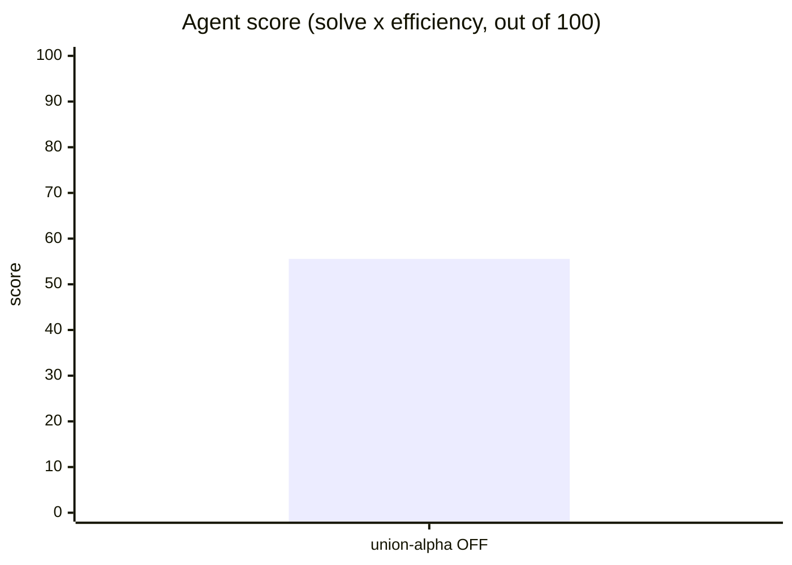
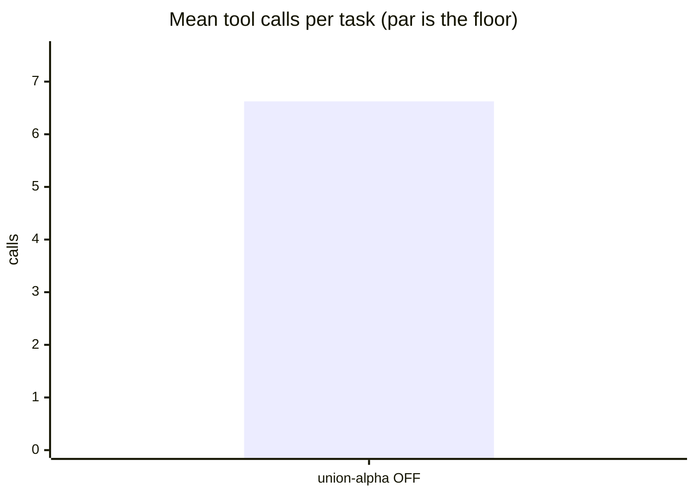
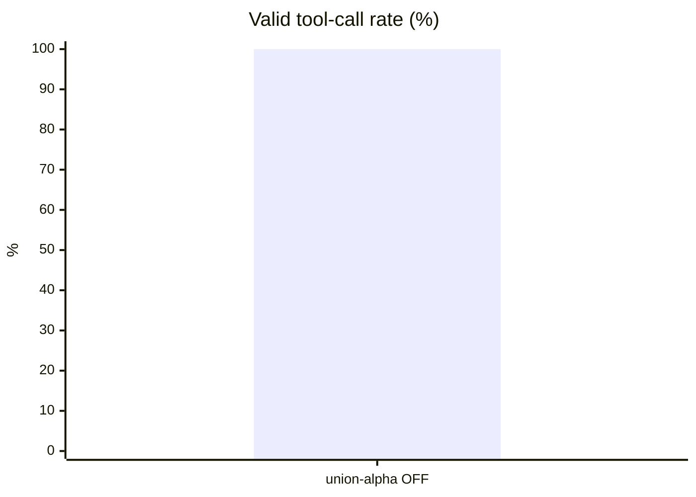
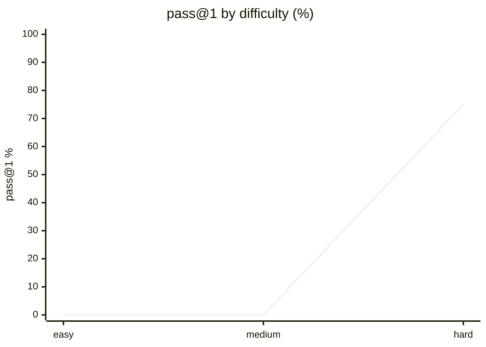

# Live setup: opencode

**Question.** Is opencode's current setup any good, and what should improve?

## Setup

| | |
|---|---|
| Endpoint | not recorded |
| Tasks | 8 |
| Samples per task | 1 (⇒ 8 generations per run) |
| Concurrency | 2 |
| Metric | pass@1 over hidden executable unit tests |

## Results

| Run | Agent score | Solved | Efficiency | Mean calls | Par | Valid calls | Turn-limit | Wall |
|---|---|---|---|---|---|---|---|---|
| **opencode live opencode-union-alpha think-OFF** | **55.6** | 75.0 % | 74.1 % | 6.6 | 5.9 | 100.0 % | 0 | 984 s |

**Agent score** = solve rate x efficiency, out of 100 — solving is the price of entry, efficiency breaks the ties solve rate cannot. *Efficiency* = par tool calls / calls actually used, capped at 1 and counted only on solved tasks. *Par* is measured by running each task's oracle, so it does not depend on the model. *Valid calls* = calls that did not error. *Turn-limit* = runs abandoned without finishing.

Line 1 = opencode live opencode-union-alpha think-OFF

## Suggestions — opencode live opencode-union-alpha think-OFF

- This was a **live-mode** run of your daily setup: extensions, skills and MCP servers were enabled. Any component that can call another model contaminates these numbers — see the caveats section.

## Caveats

- 1 samples per task. Differences under ~8 points are noise, not signal.
- Multi-turn agentic tool use against a sandboxed workspace. One-shot code generation is not exercised here.
- Success is decided by a predicate over the final workspace, never by what the model claims. Every task's oracle is verified to solve it first.
- A task abandoned at the turn limit counts as failed; raise `--max-turns` before concluding the model cannot do it.

## Raw data

- `opencode-live-opencode-union-alpha-think-off.json` — opencode live opencode-union-alpha think-OFF
## Run context

_Collected at 2026-09-16 15:15 UTC — the conditions this result must be read against._

### Machine

| Field | Value |
|---|---|
| host | M1 |
| os | macOS 26.6.2 25.6.0 (arm64) |
| cpu | Apple M1 Max — 10 threads |
| memory | 32 GiB |
| disk | 317Gi free on 6.7M |
| load avg | 4.47 4.87 5.98 |

### GPU

No `nvidia-smi` — GPU unknown. On a hosted model this is expected and harmless;
on a local endpoint it means the serving device was not recorded.

### Serving endpoint

| Field | Value |
|---|---|
| base url | http://localhost:8001/v1 |
| serves | not reachable (hosted model, or nothing local is serving) |
| unit | unknown |

### Harness setup

A live run measures this surface, not the model alone. Every skill, MCP server and
extension below is part of the result.

| Field | Value |
|---|---|
| harness | opencode |
| model | opencode/union-alpha |
| thinking | n/a |
| version | 1.18.31 |
| config | /Users/montimage/.config/opencode/opencode.jsonc |
| plugins | 0 in ~/.config/opencode/plugins; effective total unknown |
| skills | Present in this session; effective child-session count unknown (collector only checks ~/.config/opencode/skills) |
| MCP servers | Effective count unknown |
| project context | CLAUDE.md AGENTS.md  |

The selected model is hosted through the opencode provider, not the collector's default localhost endpoint. Remote GPU utilisation and serving URL were not captured. Model selection comes from the user's Union Alpha Free request, this session's model ID, and the installed catalogue entry `opencode/union-alpha`. No inference request has been made during preflight.
## Surface usage

_53 tool calls, classified. Built-ins identified from the static table for `opencode`; unrecognised names are reported as unattributed, not as skills._

| Kind | What | Calls |
|---|---|---|
| builtin | `read` | 27 |
| builtin | `bash` | 14 |
| builtin | `edit` | 5 |
| builtin | `write` | 5 |
| builtin | `glob` | 2 |

Installed vs called:

- **skills installed**: Present in this session; effective child-session count unknown (collector only checks ~/.config/opencode/skills)
- **plugins installed**: 0 in ~/.config/opencode/plugins; effective total unknown

**The retained surface trace was idle:** all 53 recorded calls were built-ins, with no recorded skill, MCP or plugin invocations. This establishes no benefit from the extra surface on the six completed tasks. Usage on the two timed-out tasks is unknown because their partial traces were discarded; a run-wide claim of no surface use is not supported.

### Timeout and measurement caveats

- `hidden_spec_compliance` and `perf_budget` each exceeded 900 seconds. The reported score remains 55.6 (75.0% solve rate × 74.1% efficiency); neither failure has been reclassified or rerun.
- `benchkit/harness/stream.py:142-143` raises on timeout without returning the partial metrics; `benchkit/harness/opencode.py:247-249` returns a fresh empty result. Thus zero turns/tokens/calls in these timeout rows do not establish zero activity. The reported mean tokens, calls and turns omit any work done in those sessions and are not complete usage totals.
- A separate bounded diagnostic using the adapter's flags, piped stdout and a tool-free OK prompt exited successfully in 5 seconds with three JSON events. A general piped-stdout startup hang was not reproduced. This diagnostic is not part of the benchmark score and does not explain the task-specific timeouts.
- Thinking is n/a for this adapter; the generated think-OFF label does not establish that reasoning was disabled.
- Priority follow-up: preserve partial metrics and bounded diagnostic output on timeout while keeping timed-out tasks failed. Then investigate the two long-running sessions before interpreting this as model capability or increasing timeout limits. A separate concurrency-1 campaign could test contention; it has not been run.
- Installed skill/MCP/plugin totals remain incompletely captured. Repair the collector before attributing prompt cost, and use a separately approved live/isolated A/B run to assess whether reducing the surface helps. No skill benefit was demonstrated by retained traces.
- This is one sample per task, not a model ranking. Treat gaps under roughly eight points as inconclusive; use four samples for a stronger comparison. No source code or benchmark task tests were changed.
