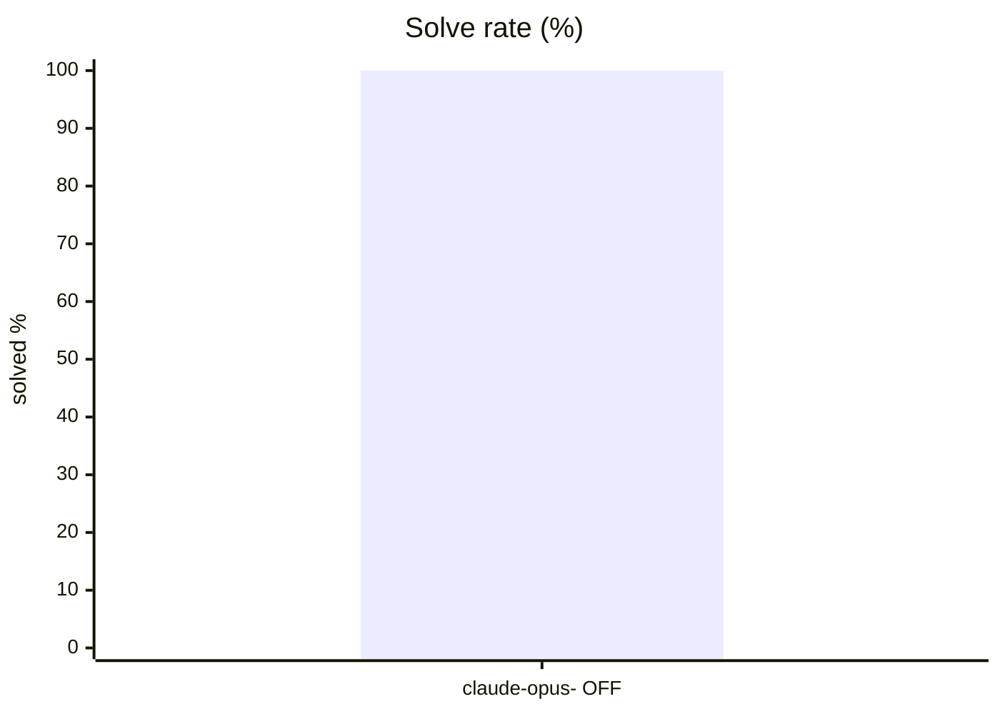
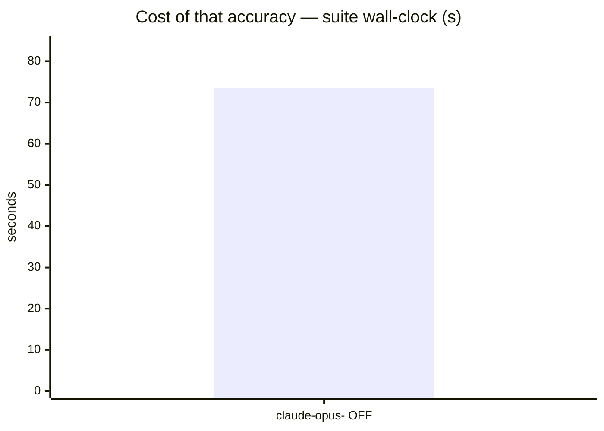
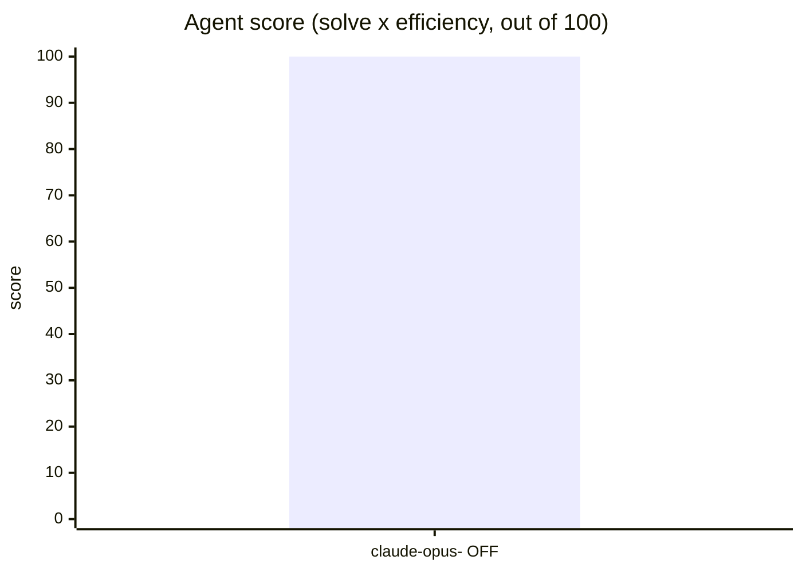
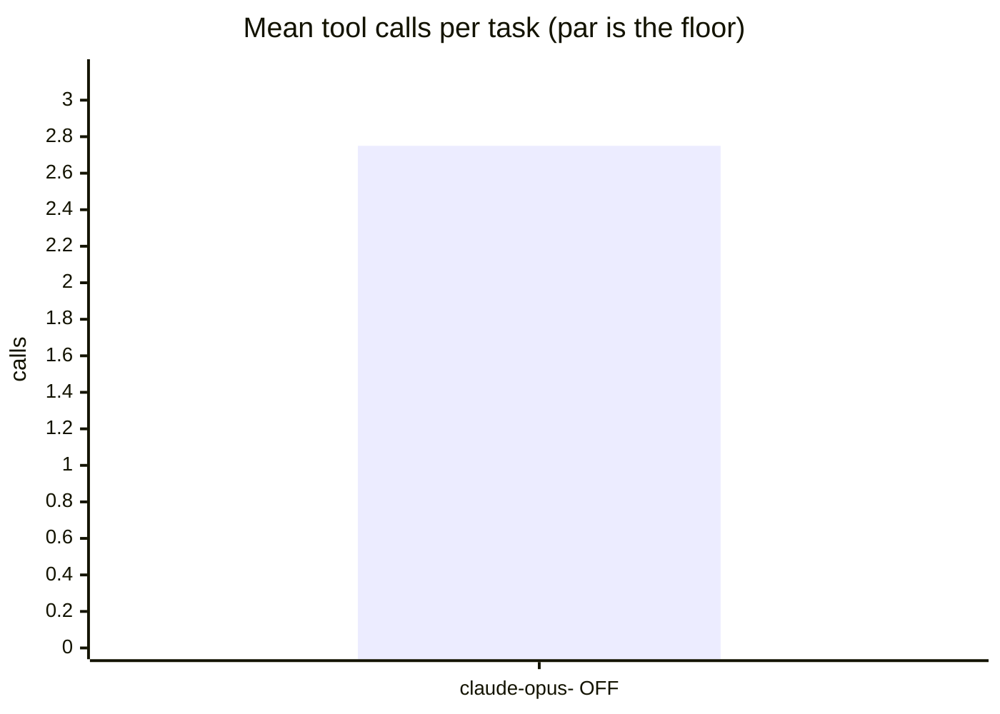
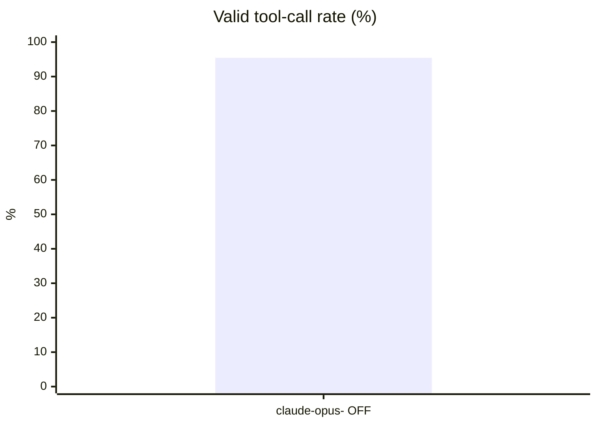
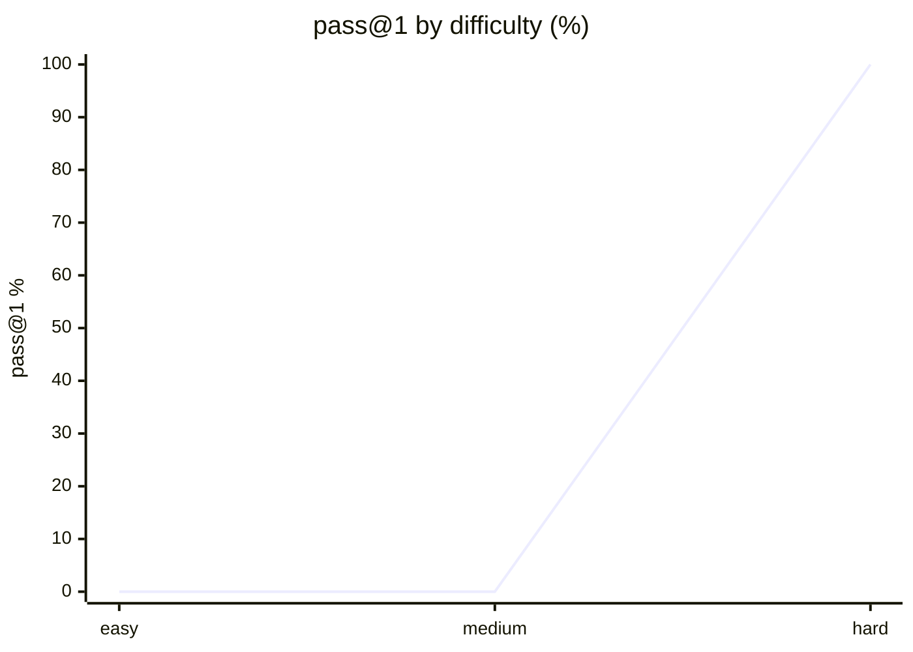

# Live setup: claude-code

**Question.** Is claude-code's current setup any good, and what should improve?

## Setup

| | |
|---|---|
| Endpoint | not recorded |
| Tasks | 8 |
| Samples per task | 1 (⇒ 8 generations per run) |
| Concurrency | 2 |
| Metric | pass@1 over hidden executable unit tests |

## Results

| Run | Agent score | Solved | Efficiency | Mean calls | Par | Valid calls | Turn-limit | Wall |
|---|---|---|---|---|---|---|---|---|
| **claude-code-live-opus-5-5-1m-effort-medium** | **100.0** | 100.0 % | 100.0 % | 2.8 | 5.9 | 95.5 % | 0 | 74 s |

**Agent score** = solve rate x efficiency, out of 100 — solving is the price of entry, efficiency breaks the ties solve rate cannot. *Efficiency* = par tool calls / calls actually used, capped at 1 and counted only on solved tasks. *Par* is measured by running each task's oracle, so it does not depend on the model. *Valid calls* = calls that did not error. *Turn-limit* = runs abandoned without finishing.

Line 1 = claude-code-live-opus-5-5-1m-effort-medium

## Suggestions — claude-code-live-opus-5-5-1m-effort-medium

- Mean input tokens is **108,348 per task** — context is being resent every turn. In a live setup, audit installed **skills and MCP servers**: each one's prompt/schema rides along on every call even when unused. Disable what this work does not need.
- This was a **live-mode** run of your daily setup: extensions, skills and MCP servers were enabled. Any component that can call another model contaminates these numbers — see the caveats section.

## Caveats

- 1 samples per task. Differences under ~8 points are noise, not signal.
- Multi-turn agentic tool use against a sandboxed workspace. One-shot code generation is not exercised here.
- Success is decided by a predicate over the final workspace, never by what the model claims. Every task's oracle is verified to solve it first.
- A task abandoned at the turn limit counts as failed; raise `--max-turns` before concluding the model cannot do it.

## Raw data

- `claude-code-live-opus-5-5-1m-effort-medium.json` — claude-code-live-opus-5-5-1m-effort-medium
## Run context

_Collected at 2026-09-22 19:19 UTC — the conditions this result must be read against._

### Machine

| Field | Value |
|---|---|
| host | M1 |
| os | macOS 26.6.2 25.6.0 (arm64) |
| cpu | Apple M1 Max — 10 threads |
| memory | 32 GiB |
| disk | 260Gi free on 7.9M |
| load avg | 12.52 7.90 6.55 |

### GPU

No `nvidia-smi` — GPU unknown. On a hosted model this is expected and harmless;
on a local endpoint it means the serving device was not recorded.

### Serving endpoint

| Field | Value |
|---|---|
| base url | http://localhost:8001/v1 |
| serves | not reachable (hosted model, or nothing local is serving) |
| unit | unknown |

### Harness setup

A live run measures this surface, not the model alone. Every skill, MCP server and
extension below is part of the result.

| Field | Value |
|---|---|
| harness | claude-code |
| model | claude-opus-5-5[1m] |
| thinking | n/a |
| version | 2.1.280 (Claude Code) |
| config | /Users/montimage/.claude |
| skills | 70 global, 1 project |
| mcp | gbrain |
| project context | CLAUDE.md AGENTS.md  |
## Surface usage

_22 tool calls, classified. Built-ins identified from the static table for `claude-code`; unrecognised names are reported as unattributed, not as skills._

| Kind | What | Calls |
|---|---|---|
| builtin | `Bash` | 19 |
| builtin | `Write` | 3 |

Installed vs called:

- **skills installed**: 70 global, 1 project
- **mcp installed**: gbrain

**The surface was idle.** Every call in this run was a built-in: no skill, MCP server or plugin was invoked. Whatever this run scored, the surface did not earn it — and anything it adds to the system prompt was paid for on every task for nothing.
