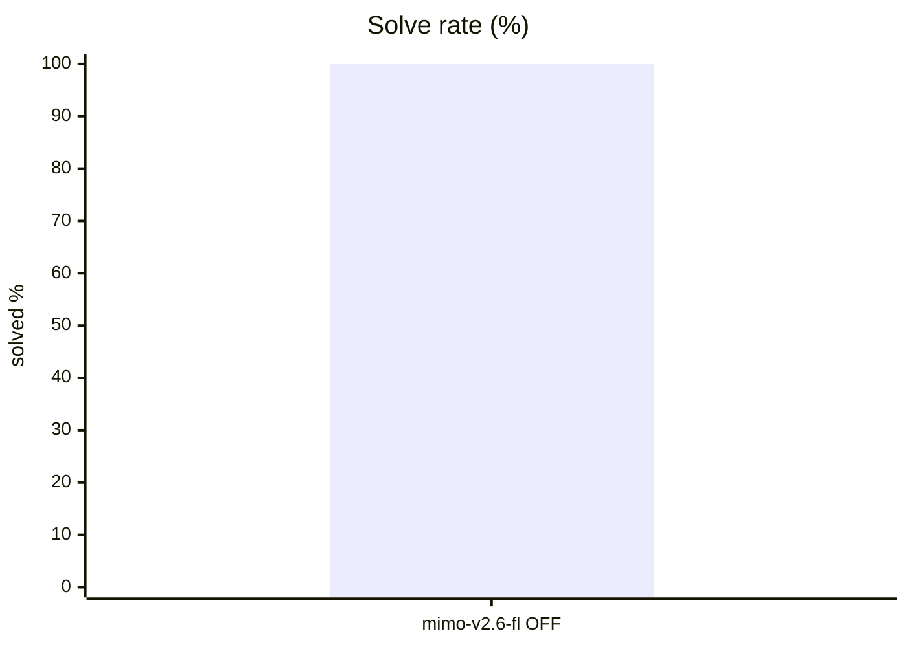
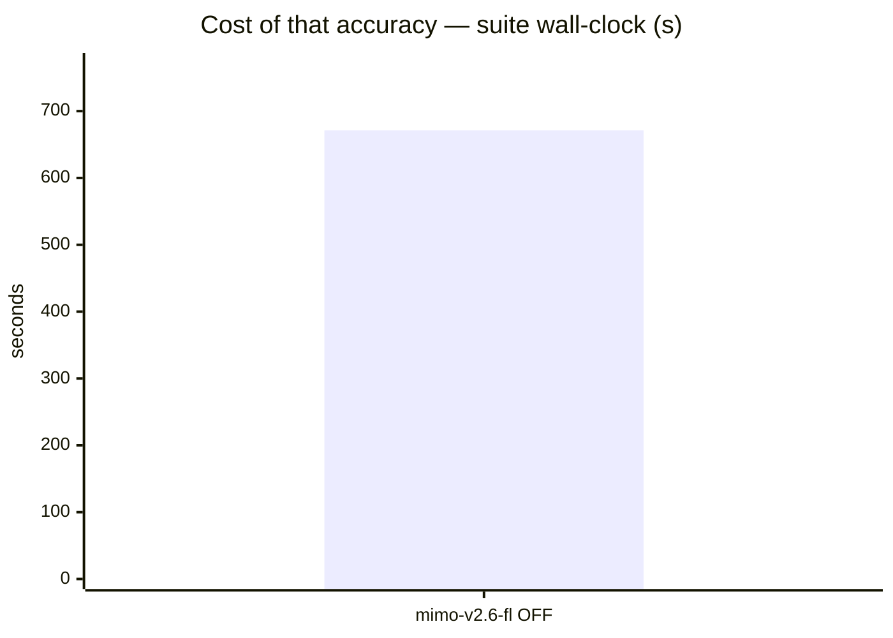
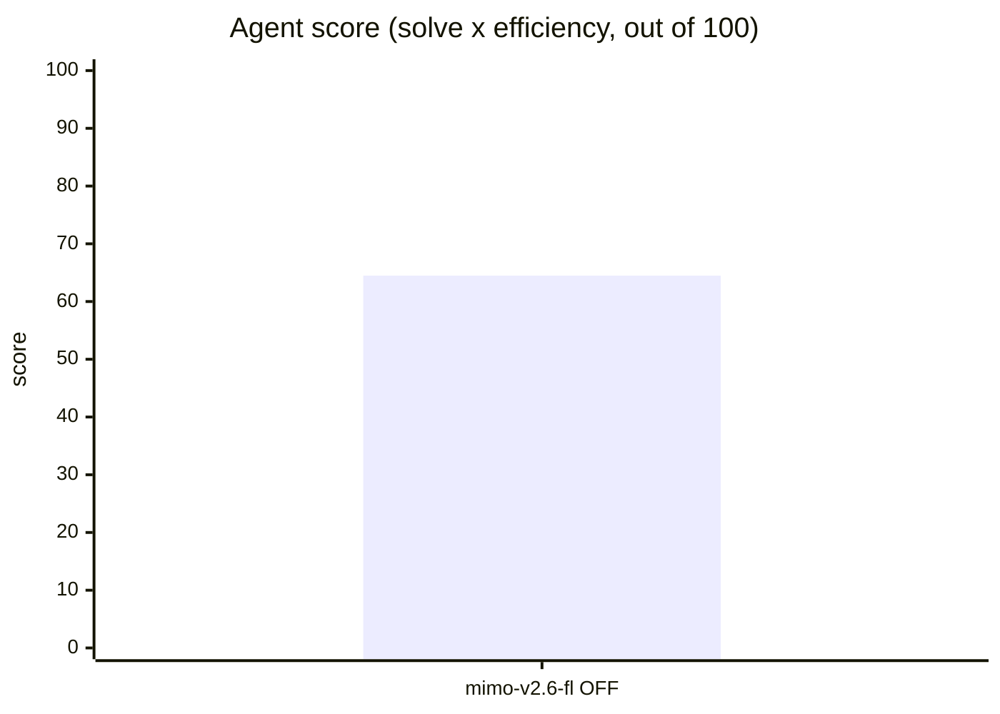
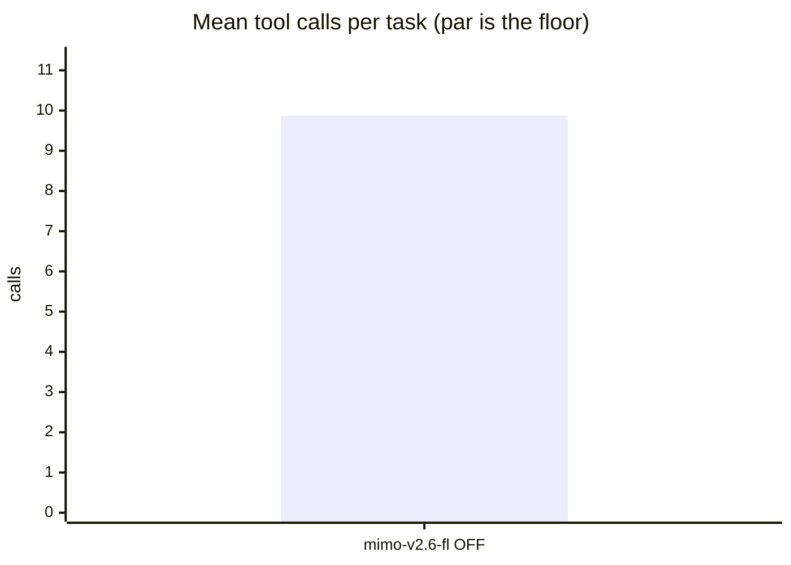
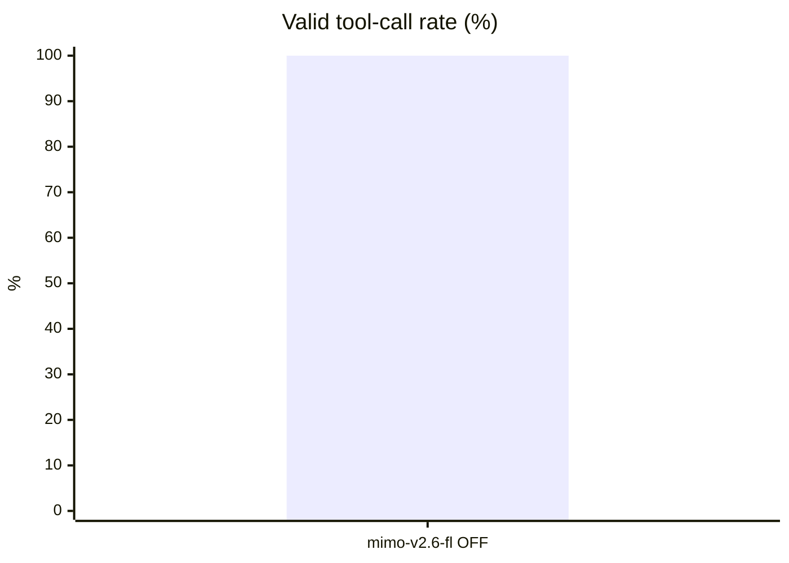
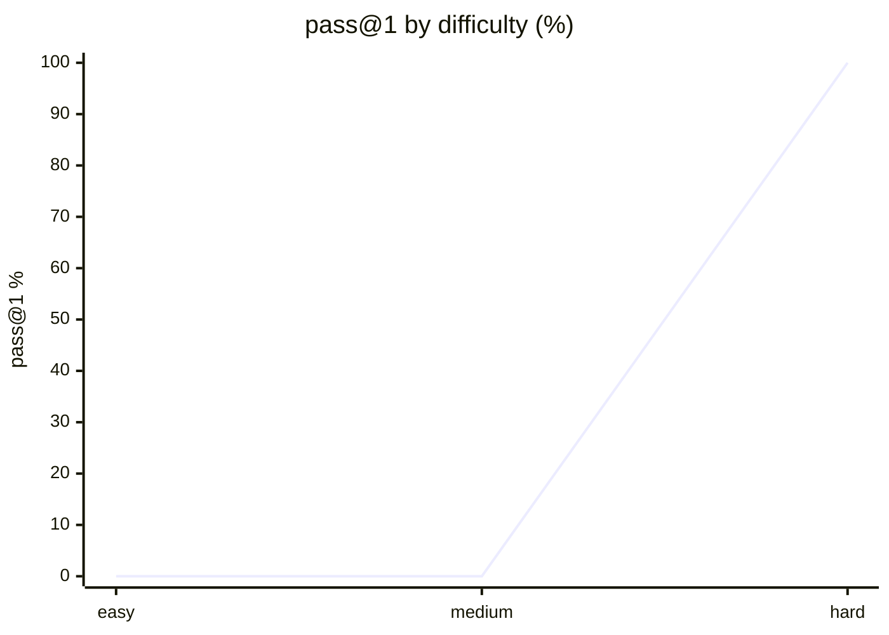

# Live setup: opencode

**Question.** Is opencode's current setup any good, and what should improve?

## Setup

| | |
|---|---|
| Endpoint | not recorded |
| Tasks | 8 |
| Samples per task | 1 (⇒ 8 generations per run) |
| Concurrency | 2 |
| Metric | pass@1 over hidden executable unit tests |

## Results

| Run | Agent score | Solved | Efficiency | Mean calls | Par | Valid calls | Turn-limit | Wall |
|---|---|---|---|---|---|---|---|---|
| **opencode live opencode-mimo-v2-6-flash-free think-OFF** | **64.5** | 100.0 % | 64.5 % | 9.9 | 5.9 | 100.0 % | 0 | 671 s |

**Agent score** = solve rate x efficiency, out of 100 — solving is the price of entry, efficiency breaks the ties solve rate cannot. *Efficiency* = par tool calls / calls actually used, capped at 1 and counted only on solved tasks. *Par* is measured by running each task's oracle, so it does not depend on the model. *Valid calls* = calls that did not error. *Turn-limit* = runs abandoned without finishing.

Line 1 = opencode live opencode-mimo-v2-6-flash-free think-OFF

## Suggestions — opencode live opencode-mimo-v2-6-flash-free think-OFF

- Tasks use **9.9 tool calls against a par of 5.9**. In a live setup, verbose skills or an over-eager MCP server can push the agent into exploratory calls; trimming instructions usually recovers most of the gap.
- This was a **live-mode** run of your daily setup: extensions, skills and MCP servers were enabled. Any component that can call another model contaminates these numbers — see the caveats section.

## Caveats

- 1 samples per task. Differences under ~8 points are noise, not signal.
- Multi-turn agentic tool use against a sandboxed workspace. One-shot code generation is not exercised here.
- Success is decided by a predicate over the final workspace, never by what the model claims. Every task's oracle is verified to solve it first.
- A task abandoned at the turn limit counts as failed; raise `--max-turns` before concluding the model cannot do it.

## Raw data

- `opencode-live-opencode-mimo-v2-6-flash-free-think-off.json` — opencode live opencode-mimo-v2-6-flash-free think-OFF
## Run context

_Collected at 2026-09-22 12:40 UTC — the conditions this result must be read against._

### Machine

| Field | Value |
|---|---|
| host | M1 |
| os | macOS 26.6.2 25.6.0 (arm64) |
| cpu | Apple M1 Max — 10 threads |
| memory | 32 GiB |
| disk | 264Gi free on 8.0M |
| load avg | 4.25 4.92 5.88 |

### GPU

No `nvidia-smi` — GPU unknown. On a hosted model this is expected and harmless;
on a local endpoint it means the serving device was not recorded.

### Serving endpoint

| Field | Value |
|---|---|
| base url | http://localhost:8001/v1 |
| serves | not reachable (hosted model, or nothing local is serving) |
| unit | unknown |

### Harness setup

A live run measures this surface, not the model alone. Every skill, MCP server and
extension below is part of the result.

| Field | Value |
|---|---|
| harness | opencode |
| model | unknown |
| thinking | n/a |
| version | 1.18.32 |
| config | /Users/montimage/.config/opencode/opencode.json |
| plugins | 1 in ~/.config/opencode/plugins |
| skills | 0 global |
| project context | CLAUDE.md AGENTS.md  |
## Surface usage

_79 tool calls, classified. Built-ins identified from the static table for `opencode`; unrecognised names are reported as unattributed, not as skills._

| Kind | What | Calls |
|---|---|---|
| builtin | `read` | 31 |
| builtin | `bash` | 19 |
| builtin | `glob` | 14 |
| builtin | `write` | 7 |
| builtin | `edit` | 5 |
| builtin | `grep` | 3 |

Installed vs called:

- **skills installed**: 0 global
- **plugins installed**: 1 in ~/.config/opencode/plugins

**The surface was idle.** Every call in this run was a built-in: no skill, MCP server or plugin was invoked. Whatever this run scored, the surface did not earn it — and anything it adds to the system prompt was paid for on every task for nothing.
