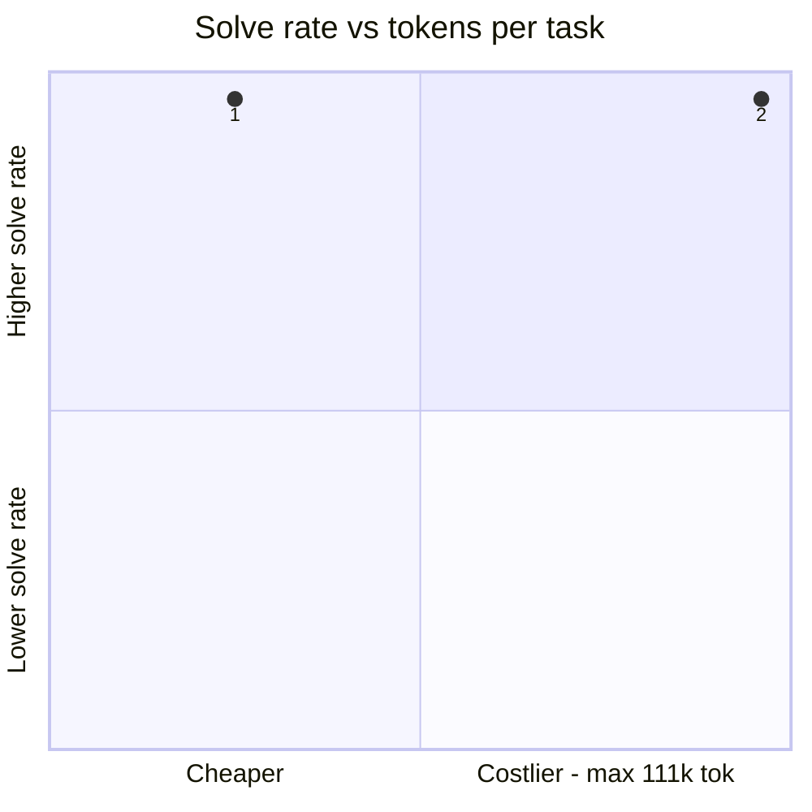
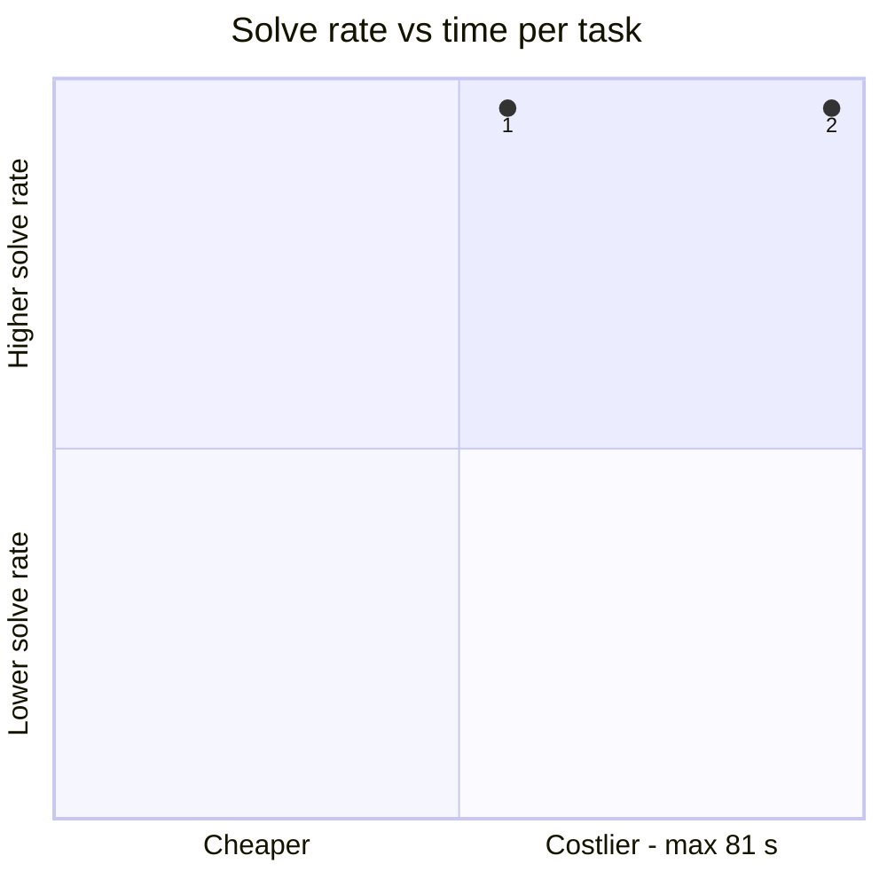
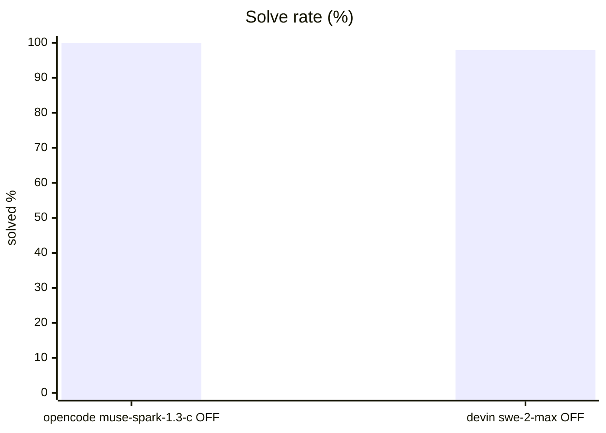
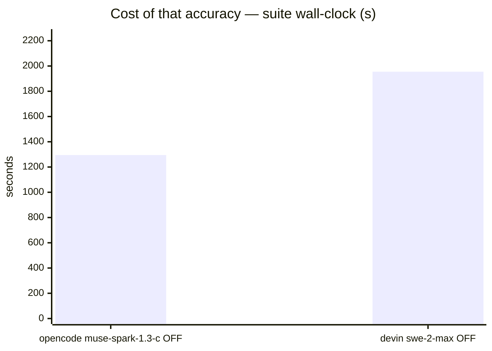
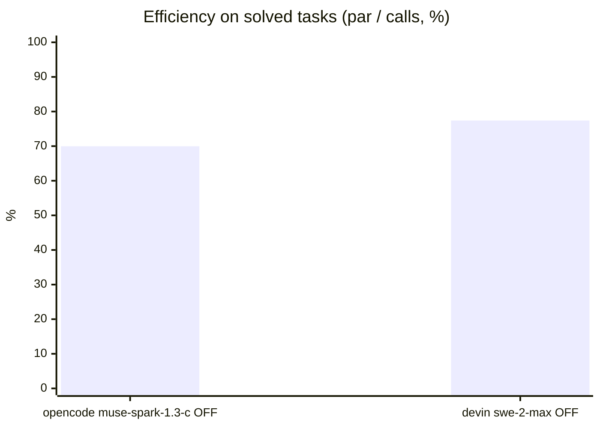
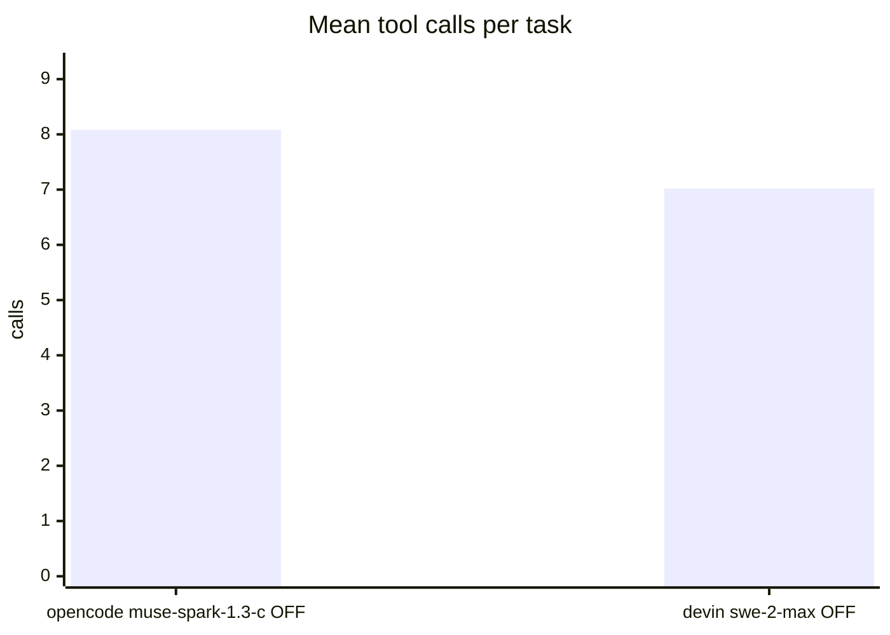
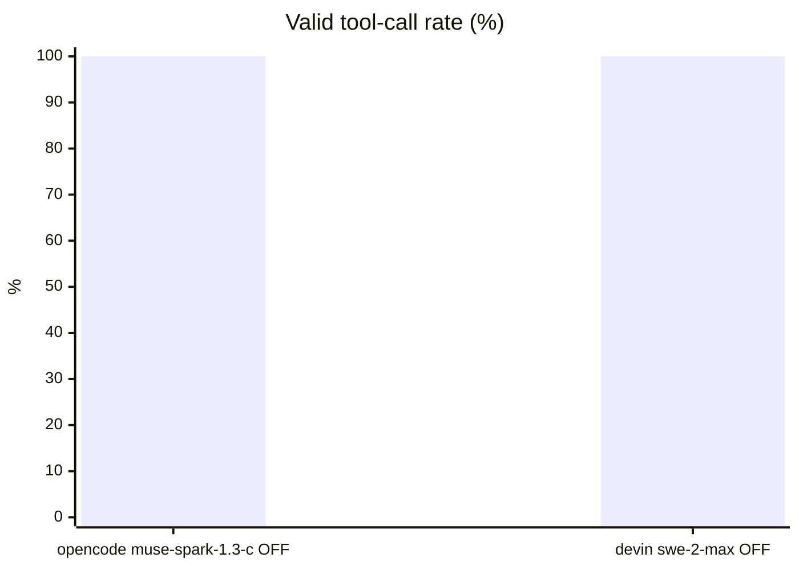

# Benchmark report

## Setup

| | |
|---|---|
| Endpoint | not recorded |
| Tasks | 16 |
| Samples per task | 3 (⇒ 48 generations per run) |
| Concurrency | 2 |
| Metric | solve rate (predicate over the final workspace), with a 95% Wilson interval; efficiency reported separately |

## Headline

| Run | Solve rate (95% CI) | Efficiency | Tokens per task | Time per task |
|---|---|---|---|---|
| opencode opencode-muse-spark-1-3-contributor-free think-OFF | 100.0 % (93–100) | 70.0 % | 26,536 in / 1,235 out | 45.7 s |
| devin swe-2-swe-2-max think-OFF | 97.9 % (89–100) | 77.4 % | 108,103 in / 2,613 out (47/48 reported) | 81.1 s |

<sub>The bracket is the 95% Wilson interval of the solve rate, in points. *Efficiency* = par tool calls / calls actually used, capped at 1, on solved tasks only. It is reported beside the solve rate and never multiplied into it: par comes from an oracle and harnesses count calls differently, so it measures style as much as skill. *Tokens* and *time* are the mean per task attempt (input and output tokens as the endpoint or harness reported them; wall-clock seconds).</sub>

## At a glance

| # | Run | Harness · thinking | Solve rate | Efficiency | Tokens / task | Time / task |
|---|---|---|---|---|---|---|
| 1 | opencode opencode-muse-spark-1-3-contributor-free think-OFF | opencode · OFF | `██████████` 100 % <sub>(93–100)</sub> | `███████░░░` 70 % | `██▌░░░░░░░` 28k | `█████▋░░░░` 46 s |
| 2 | devin swe-2-swe-2-max think-OFF | devin · OFF | `█████████▊` 98 % <sub>(89–100)</sub> | `███████▊░░` 77 % | `██████████` 111k | `██████████` 81 s |

<sub>Solve-rate bars run 0–100 %, bracket = 95% interval. Token and time bars are scaled to the costliest row — shorter is cheaper. Rows are sorted only **within** one harness and thinking mode; bars from different groups are side by side, not ranked.</sub>





<sub>Points are the `#` column above. Up is better, left is cheaper: the top-left corner is the most solved for the least spent. Cost is scaled to the costliest run.</sub>

## Results

| Run | Solved | Efficiency | easy | medium | hard | Mean turns | Mean calls | Par | Valid calls | Turn-limit | Wall | Agent score |
|---|---|---|---|---|---|---|---|---|---|---|---|---|
| **opencode opencode-muse-spark-1-3-contributor-free think-OFF** | **100.0 %** | 70.0 % | 100.0 % | 100.0 % | 100.0 % | 6.5 | 8.1 | 5.2 | 100.0 % | 0 | 1,295 s | 70.0 |
| devin swe-2-swe-2-max think-OFF | 97.9 % | 77.4 % | 100.0 % | 100.0 % | 97.0 % | 5.1 | 7.0 | 5.2 | 100.0 % | 0 | 1,955 s | 75.8 |

<sub>*Solved* ranks the runs; *Efficiency* is reported beside it and only breaks exact ties. *Par* is measured by running each task's oracle, so it does not depend on the model. *Valid calls* = calls that did not error. *Turn-limit* = runs abandoned without finishing. *Agent score* = solved x efficiency, out of 100 — kept for comparison with earlier reports; it no longer ranks.</sub>





```mermaid
xychart-beta
    title "Cost of that accuracy — tokens per task (in + out)"
    x-axis ["opencode muse-spark-1.3-c OFF", "devin swe-2-max OFF"]
    y-axis "tokens" 0 --> 1.273e+05
    bar [2.777e+04, 1.107e+05]
```







## By difficulty

| Run | easy | medium | hard |
|---|---|---|---|
| opencode opencode-muse-spark-1-3-contributor-free think-OFF | `████████` 100 % | `████████` 100 % | `████████` 100 % |
| devin swe-2-swe-2-max think-OFF | `████████` 100 % | `████████` 100 % | `███████▊` 97 % |

## Task by task

<sub>Per-task solve rate (%). Tasks the runs disagree on are listed first, widest gap on top.</sub>

| Task | opencode muse-spark-1.3-c OFF | devin swe-2-max OFF |
|---|---|---|
| `perf_budget` | 🟩 100 | 🟨 67 |

- 🟩 **every run solved** (15): `add_missing_function`, `api_migration`, `cascading_failures`, `conflicting_docs`, `decoy_bug`, `find_bug_by_search`, `fix_divide_bug`, `generalise_migration`, `hidden_spec_compliance`, `implement_from_spec`, `multi_step_pipeline`, `recover_from_bad_path`, `rename_across_files`, `verify_no_change_needed`, `wrong_test_not_code`

## Where they disagree — opencode opencode-muse-spark-1-3-contributor-free think-OFF vs devin swe-2-swe-2-max think-OFF

| Task | opencode opencode-muse-spark-1-3-contributor-free think-OFF | devin swe-2-swe-2-max think-OFF | Winner |
|---|---|---|---|
| `perf_budget` | 100 % | 67 % | opencode opencode-muse-spark-1-3-contributor-free think-OFF |

## Cost per task

<sub>Mean per attempt: input / output tokens, then wall-clock seconds. *not reported* = no usage reported for that task; *–* = the run has no cost record for it.</sub>

| Task | opencode opencode-muse-spark-1-3-contributor-free think-OFF | devin swe-2-swe-2-max think-OFF |
|---|---|---|
| `add_missing_function` | 21,411 / 715 · 19.3 s | 95,632 / 1,031 · 27.0 s |
| `api_migration` | 22,935 / 1,612 · 25.6 s | 114,578 / 1,657 · 36.4 s |
| `cascading_failures` | 22,222 / 1,200 · 17.8 s | 98,123 / 1,282 · 76.2 s |
| `conflicting_docs` | 22,892 / 1,283 · 21.6 s | 79,752 / 1,678 · 37.0 s |
| `decoy_bug` | 30,656 / 1,129 · 53.1 s | 113,358 / 1,899 · 41.5 s |
| `find_bug_by_search` | 28,752 / 1,120 · 20.3 s | 116,017 / 863 · 28.4 s |
| `fix_divide_bug` | 21,243 / 726 · 15.7 s | 108,695 / 713 · 33.8 s |
| `generalise_migration` | 28,702 / 1,049 · 24.5 s | 98,077 / 1,779 · 41.8 s |
| `hidden_spec_compliance` | 39,934 / 1,728 · 82.8 s | 108,250 / 6,502 · 121.4 s |
| `implement_from_spec` | 21,726 / 873 · 35.3 s | 98,301 / 2,481 · 70.0 s |
| `multi_step_pipeline` | 21,245 / 733 · 18.9 s | 81,688 / 652 · 22.4 s |
| `perf_budget` | 45,317 / 4,248 · 327.6 s | 267,274 / 24,335 · 642.1 s |
| `recover_from_bad_path` | 21,614 / 594 · 18.6 s | 94,456 / 655 · 23.1 s |
| `rename_across_files` | 22,129 / 1,315 · 18.3 s | 113,696 / 1,329 · 37.1 s |
| `verify_no_change_needed` | 34,025 / 443 · 14.2 s | 75,472 / 479 · 18.6 s |
| `wrong_test_not_code` | 19,778 / 987 · 16.7 s | 119,340 / 1,719 · 40.5 s |

## Caveats

- 3 samples per task. Every solve rate carries a 95% Wilson interval over the generations behind it, and a margin between two runs is only a result when the 95% Newcombe interval of the difference excludes zero. The intervals treat each generation as independent; samples of one task are correlated, so with few tasks the true uncertainty is if anything wider. Raise `--samples` before calling a close race.
- Multi-turn agentic tool use against a sandboxed workspace. One-shot code generation is not exercised here.
- Success is decided by a predicate over the final workspace, never by what the model claims. Every task's oracle is verified to solve it first.
- A task abandoned at the turn limit counts as failed; raise `--max-turns` before concluding the model cannot do it.

## Raw data

- `opencode-opencode-muse-spark-1-3-contributor-free-think-off.1.json` — opencode opencode-muse-spark-1-3-contributor-free think-OFF
- `devin-swe-2-swe-2-max-think-off.json` — devin swe-2-swe-2-max think-OFF
