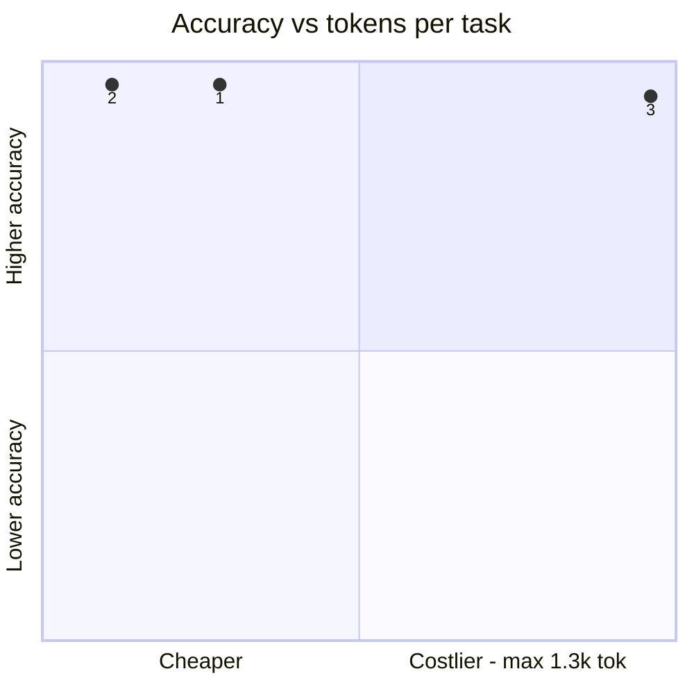
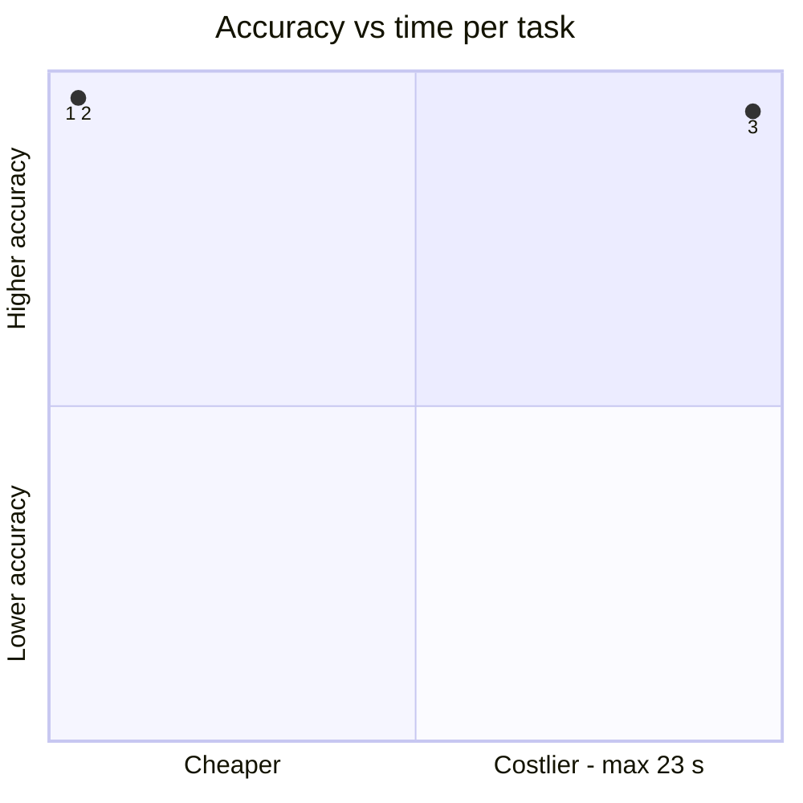
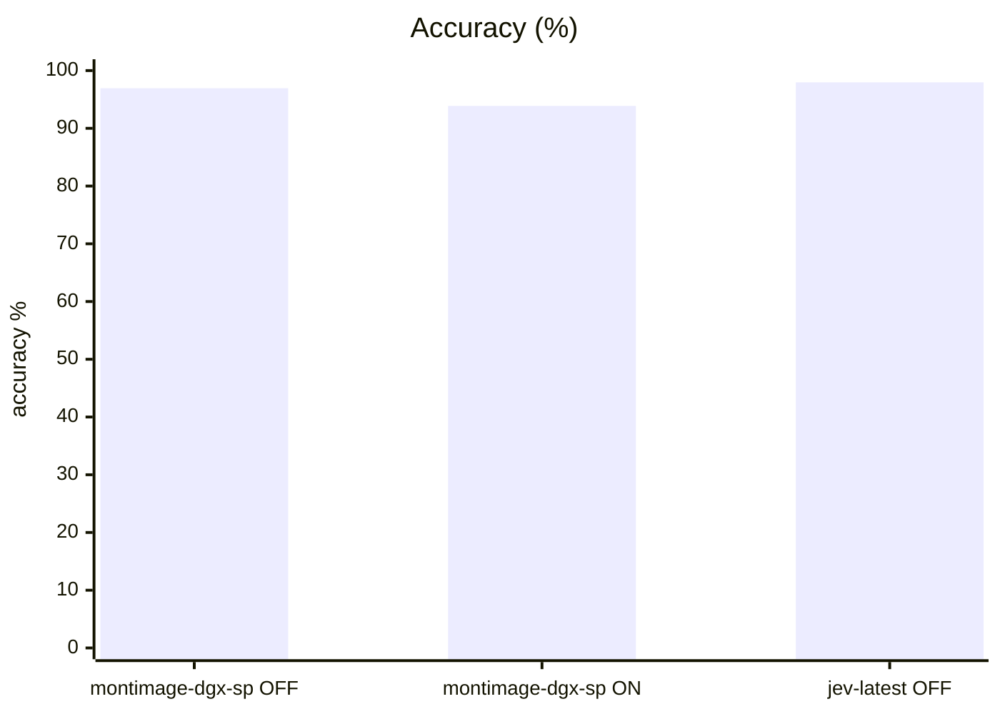
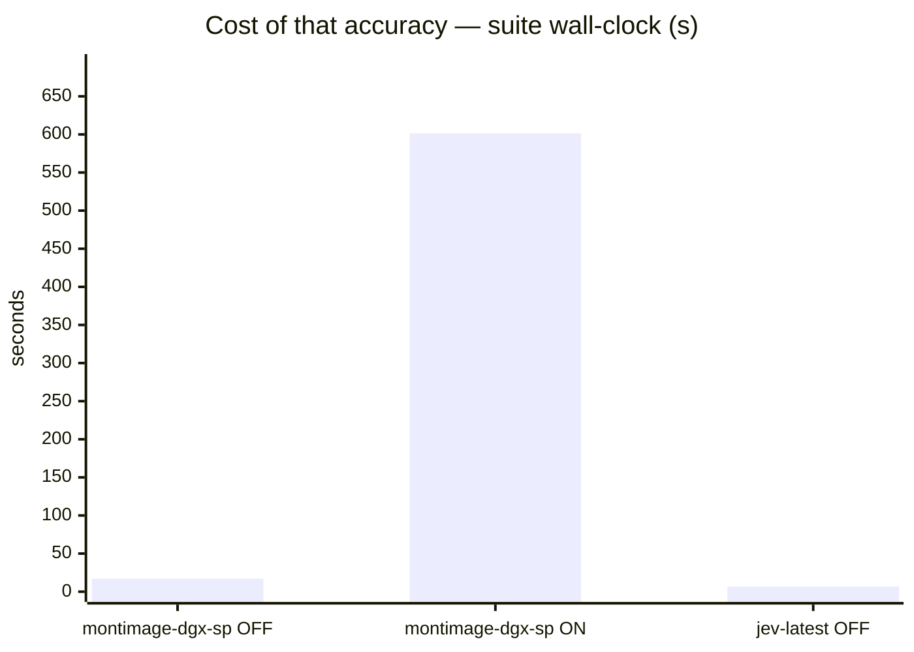
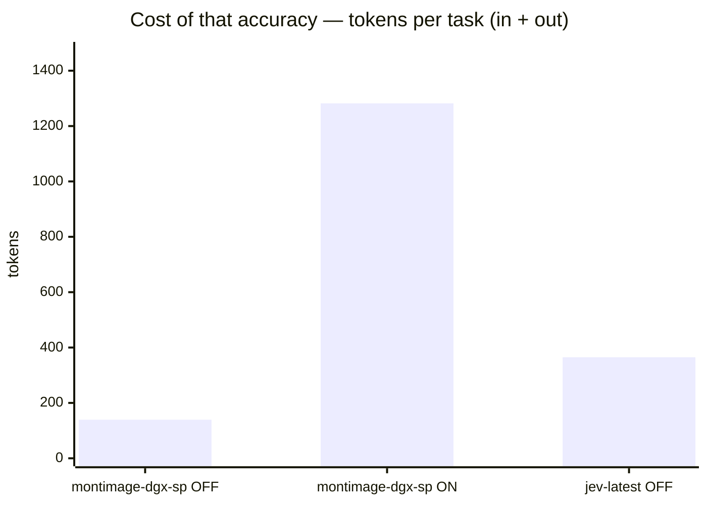
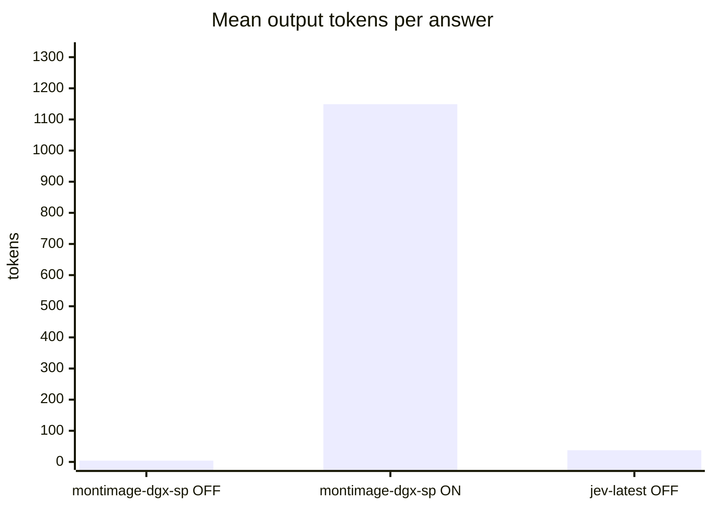

# TypeSafe Jev vs incumbent Qwen3.6 on system1

**Question.** Is TypeSafe's Jev (typed-decision endpoint behind an OpenAI shim) a better System One backend for this suite than the incumbent chat model, on accuracy and on speed/cost?

**Verdict.** Adopt Jev as the measured System One reference for decision tasks. At 98.0% it edges the incumbent's 96.9% (think-OFF) and 93.9% (think-ON), but the margin is inside the 95% intervals — call accuracy at-par, not a win. The decisive difference is cost: 0.3 s/question and 38 output tokens vs 0.7 s/4 tok (OFF) or 22.6 s/1,149 tok (ON), and zero malformed answers because output is typed. Jev is the better decision endpoint for this workload shape; the incumbent remains the general coding model — different products, different axes.

## Setup

| | |
|---|---|
| Endpoint | mixed — `http://localhost:8001` (montimage-dgx-sp OFF), `http://localhost:8001` (montimage-dgx-sp ON), `http://localhost:8123` (jev-latest OFF) |
| Tasks | 49 |
| Samples per task | 2 (⇒ 98 generations per run) |
| Concurrency | 4 |
| Metric | accuracy over exact-match answers on typed decision questions, with a 95% Wilson interval |

## Headline

| Run | Accuracy (95% CI) | Tokens per task | Time per task |
|---|---|---|---|---|
| incumbent-qwen3.6-s1-off | 96.9 % (91–99) | 135 in / 4 out | 0.7 s |
| incumbent-qwen3.6-s1-on | 93.9 % (87–97) | 133 in / 1,149 out | 22.6 s |
| typesafe jev-1.13 s1 | 98.0 % (93–99) | 327 in / 38 out | 0.3 s |

The bracket is the 95% Wilson interval of the solve rate, in points. *Tokens* and *time* are the mean per task attempt (input and output tokens as the endpoint or harness reported them; wall-clock seconds).

## At a glance

| # | Run | Harness · thinking | Accuracy | Tokens / task | Time / task |
|---|---|---|---|---|---|
| 1 | typesafe jev-1.13 s1 | built-in loop · OFF | `█████████▊` 98 % (93–99) | `██▉░░░░░░░` 365 | `▏░░░░░░░░░` 0 s |
| 2 | incumbent-qwen3.6-s1-off | built-in loop · OFF | `█████████▊` 97 % (91–99) | `█▏░░░░░░░░` 139 | `▎░░░░░░░░░` 1 s |
| 3 | incumbent-qwen3.6-s1-on | built-in loop · ON | `█████████▍` 94 % (87–97) | `██████████` 1.3k | `██████████` 23 s |

Solve-rate bars run 0–100 %, bracket = 95% interval. Token and time bars are scaled to the costliest row — shorter is cheaper. Rows are sorted only **within** one harness and thinking mode; bars from different groups are side by side, not ranked.

Points are the `#` column above. Up is better, left is cheaper: the top-left corner is the most solved for the least spent. Cost is scaled to the costliest run.

## Results

| Run | Accuracy | easy | medium | hard | Wall | Mean out tok | Truncated | tok/s |
|---|---|---|---|---|---|---|---|---|
| incumbent-qwen3.6-s1-off | 96.9 % | 97.7 % | 100.0 % | 88.9 % | 17 s | 4 | 0 | 8.8 |
| incumbent-qwen3.6-s1-on | 93.9 % | 100.0 % | 94.4 % | 77.8 % | 602 s | 1,149 | 4 | 46.1 |
| **typesafe jev-1.13 s1** | **98.0 %** | 100.0 % | 100.0 % | 88.9 % | 7 s | 38 | 0 | 150.8 |

## By difficulty

| Run | easy | medium | hard |
|---|---|---|---|
| incumbent-qwen3.6-s1-off | `███████▉` 98 % | `████████` 100 % | `███████▏` 89 % |
| incumbent-qwen3.6-s1-on | `████████` 100 % | `███████▌` 94 % | `██████▎░` 78 % |
| typesafe jev-1.13 s1 | `████████` 100 % | `████████` 100 % | `███████▏` 89 % |

## Task by task

Per-task solve rate (%). Tasks the runs disagree on are listed first, widest gap on top.

| Task | montimage-dgx-sp OFF | montimage-dgx-sp ON | jev-latest OFF |
|---|---|---|---|
| `budget_veto/q2` | 🟩 100 | 🟨 50 | 🟩 100 |
| `cafe_hours/q2` | 🟩 100 | 🟨 50 | 🟩 100 |
| `device_policy/q2` | 🟩 100 | 🟨 50 | 🟩 100 |
| `height_order/q1` | 🟩 100 | 🟨 50 | 🟩 100 |
| `ref_code/q2` | 🟨 50 | 🟩 100 | 🟩 100 |

- 🟩 **every run solved** (43): `bag_allowance/q1`, `bag_allowance/q2`, `borderline_comment/q1`, `borderline_comment/q2`, `budget_veto/q1`, `cafe_hours/q1`, `cafe_hours/q3`, `capital_japan/q1`, `capital_japan/q2`, `chat_resolved/q1`, `chat_resolved/q2`, `device_policy/q1`, `error_log/q2`, `error_log/q3`, `fruit_basket/q1`, `fruit_basket/q2`, `glowing_review/q1`, `glowing_review/q2`, `golden_retriever/q1`, `golden_retriever/q2`, `harsh_review/q1`, `harsh_review/q2`, `height_order/q2`, `json_order/q1`, `json_order/q2`, `language_french/q1`, `language_french/q2`, `museum_hours/q1`, `museum_hours/q2`, `product_spec/q1`, `product_spec/q2`, `ref_code/q1`, `refund_eligible/q1`, `refund_eligible/q2`, `sale_item_refund/q1`, `sale_item_refund/q2`, `sale_item_refund/q3`, `spam_email/q1`, `spam_email/q2`, `threat_comment/q1`, `threat_comment/q2`, `ticket_billing/q1`, `ticket_billing/q2`
- 🟥 **every run failed** (1): `error_log/q1`

## Where they disagree — typesafe jev-1.13 s1 vs incumbent-qwen3.6-s1-off

| Task | typesafe jev-1.13 s1 | incumbent-qwen3.6-s1-off | Winner |
|---|---|---|---|
| `ref_code/q2` | 100 % | 50 % | typesafe jev-1.13 s1 |

## Cost per task

Mean per attempt: input / output tokens, then wall-clock seconds. *not reported* = no usage reported for that task; *–* = the run has no cost record for it.

| Task | incumbent-qwen3.6-s1-off | incumbent-qwen3.6-s1-on | typesafe jev-1.13 s1 |
|---|---|---|---|
| `bag_allowance/q1` | 126 / 4 · 0.3 s | 124 / 558 · 12.3 s | 316 / 31 · 0.3 s |
| `bag_allowance/q2` | 130 / 4 · 0.4 s | 128 / 340 · 7.6 s | 320 / 31 · 0.2 s |
| `borderline_comment/q1` | 119 / 4 · 0.3 s | 117 / 724 · 16.1 s | 309 / 31 · 0.2 s |
| `borderline_comment/q2` | 118 / 4 · 0.3 s | 116 / 352 · 8.0 s | 308 / 31 · 0.3 s |
| `budget_veto/q1` | 123 / 4 · 0.4 s | 121 / 404 · 8.8 s | 313 / 31 · 0.5 s |
| `budget_veto/q2` | 124 / 4 · 0.3 s | 122 / 8,398 · 149.8 s | 314 / 31 · 0.3 s |
| `cafe_hours/q1` | 138 / 4 · 0.4 s | 136 / 107 · 2.4 s | 328 / 31 · 0.4 s |
| `cafe_hours/q2` | 140 / 4 · 0.5 s | 138 / 8,396 · 160.8 s | 330 / 31 · 0.2 s |
| `cafe_hours/q3` | 145 / 4 · 0.3 s | 143 / 1,136 · 24.6 s | 335 / 31 · 0.2 s |
| `capital_japan/q1` | 116 / 4 · 1.0 s | 114 / 700 · 14.8 s | 316 / 50 · 0.3 s |
| `capital_japan/q2` | 117 / 4 · 0.5 s | 115 / 768 · 16.7 s | 315 / 47 · 0.2 s |
| `chat_resolved/q1` | 151 / 4 · 0.4 s | 149 / 841 · 17.6 s | 345 / 51 · 0.3 s |
| `chat_resolved/q2` | 140 / 4 · 0.4 s | 138 / 440 · 9.8 s | 329 / 31 · 0.2 s |
| `device_policy/q1` | 127 / 4 · 0.5 s | 125 / 463 · 10.1 s | 317 / 31 · 0.2 s |
| `device_policy/q2` | 128 / 4 · 0.5 s | 126 / 8,100 · 138.6 s | 318 / 31 · 0.4 s |
| `error_log/q1` | 142 / 4 · 0.4 s | 140 / 272 · 6.2 s | 333 / 39 · 0.2 s |
| `error_log/q2` | 144 / 5 · 0.5 s | 142 / 548 · 11.8 s | 332 / 38 · 0.2 s |
| `error_log/q3` | 138 / 4 · 0.4 s | 136 / 535 · 11.7 s | 327 / 31 · 0.3 s |
| `fruit_basket/q1` | 125 / 5 · 0.9 s | 123 / 256 · 5.6 s | 315 / 45 · 0.2 s |
| `fruit_basket/q2` | 126 / 2 · 1.4 s | 124 / 446 · 9.5 s | 316 / 45 · 0.3 s |
| `glowing_review/q1` | 124 / 4 · 1.3 s | 122 / 894 · 18.9 s | 316 / 38 · 0.2 s |
| `glowing_review/q2` | 122 / 4 · 1.5 s | 120 / 178 · 4.4 s | 312 / 31 · 0.2 s |
| `golden_retriever/q1` | 121 / 3 · 0.5 s | 119 / 438 · 9.2 s | 316 / 45 · 0.2 s |
| `golden_retriever/q2` | 112 / 4 · 0.4 s | 110 / 573 · 12.2 s | 303 / 31 · 0.3 s |
| `harsh_review/q1` | 149 / 2 · 0.4 s | 147 / 430 · 9.3 s | 342 / 52 · 0.2 s |
| `harsh_review/q2` | 122 / 4 · 0.5 s | 120 / 778 · 17.0 s | 314 / 31 · 0.4 s |
| `height_order/q1` | 113 / 3 · 0.4 s | 111 / 8,085 · 152.8 s | 305 / 38 · 0.2 s |
| `height_order/q2` | 113 / 3 · 0.4 s | 111 / 230 · 5.0 s | 305 / 38 · 0.2 s |
| `json_order/q1` | 145 / 4 · 0.5 s | 143 / 398 · 8.7 s | 342 / 50 · 0.2 s |
| `json_order/q2` | 154 / 2 · 0.4 s | 152 / 470 · 10.0 s | 343 / 45 · 0.2 s |
| `language_french/q1` | 123 / 4 · 0.5 s | 121 / 314 · 6.9 s | 317 / 45 · 0.2 s |
| `language_french/q2` | 114 / 4 · 0.5 s | 112 / 385 · 8.4 s | 304 / 31 · 0.3 s |
| `museum_hours/q1` | 129 / 4 · 0.5 s | 127 / 224 · 4.9 s | 319 / 31 · 0.3 s |
| `museum_hours/q2` | 136 / 4 · 0.5 s | 134 / 324 · 7.3 s | 326 / 31 · 0.2 s |
| `product_spec/q1` | 123 / 4 · 0.3 s | 121 / 687 · 14.6 s | 315 / 31 · 0.2 s |
| `product_spec/q2` | 122 / 4 · 0.5 s | 120 / 810 · 17.4 s | 314 / 31 · 0.2 s |
| `ref_code/q1` | 118 / 8 · 0.5 s | 116 / 467 · 10.1 s | 355 / 80 · 0.2 s |
| `ref_code/q2` | 161 / 16 · 0.8 s | 159 / 273 · 5.8 s | 349 / 74 · 0.2 s |
| `refund_eligible/q1` | 152 / 4 · 0.4 s | 150 / 462 · 10.0 s | 342 / 31 · 0.2 s |
| `refund_eligible/q2` | 157 / 2 · 0.4 s | 155 / 904 · 19.3 s | 351 / 46 · 0.3 s |
| `sale_item_refund/q1` | 184 / 4 · 0.4 s | 182 / 286 · 6.6 s | 373 / 31 · 0.3 s |
| `sale_item_refund/q2` | 184 / 4 · 0.4 s | 182 / 483 · 10.8 s | 373 / 31 · 0.2 s |
| `sale_item_refund/q3` | 184 / 4 · 0.4 s | 182 / 516 · 11.3 s | 373 / 31 · 0.3 s |
| `spam_email/q1` | 166 / 4 · 4.9 s | 164 / 621 · 13.6 s | 357 / 31 · 0.4 s |
| `spam_email/q2` | 167 / 4 · 5.0 s | 165 / 810 · 18.2 s | 358 / 31 · 0.4 s |
| `threat_comment/q1` | 117 / 4 · 0.4 s | 115 / 594 · 13.0 s | 307 / 31 · 0.2 s |
| `threat_comment/q2` | 118 / 4 · 0.4 s | 116 / 544 · 11.8 s | 308 / 31 · 0.2 s |
| `ticket_billing/q1` | 142 / 3 · 0.5 s | 140 / 534 · 11.9 s | 335 / 46 · 0.2 s |
| `ticket_billing/q2` | 137 / 4 · 0.4 s | 135 / 810 · 17.4 s | 326 / 31 · 0.2 s |

## Reading the numbers

## Method notes — TypeSafe Jev on `system1`

Jev is not a chat model: `POST https://api.typesafe.ai/v1/systemone` takes a
`state` and a map of typed `questions` (choice / noul / score) and returns
structured answers. The `system1` suite speaks OpenAI chat completions, so the
run went through `configs/typesafe-jev-shim.py` — a local shim on `:8123` that
parses each rendered s1 prompt back into (state, question, options) and issues
one upstream call per generation.

Translation used:

- **Options listed** → one `choice` question, `criteria = {option: null}`.
  Answer returned = `answers.q.choice` (the option text verbatim). Applies to
  48 of 49 questions.
- **No options** (`ref_code/q1`, the suite's only open question) → Jev has no
  free-text primitive, so the shim plays the documented
  "select instead of generate" pattern: a `choice` over candidate values =
  the deduped whitespace-split tokens of the state. Candidate coverage is a
  shim-side decision — stated here, not hidden. Jev picked `ZX-4821-Q`
  correctly on both samples.
- **Yes/no questions** → still `choice` (not `noul`): the suite asks "which of
  the listed options", so the uniform literal mapping was used rather than
  introducing a shim-side 0.5 threshold. The `noul` primitive is unmeasured.
- `usage.input_tokens/output_tokens` → `prompt_tokens`/`completion_tokens`.

Scope caveats: one TypeSafe call per question generation (98 calls for
samples=2) — the suite's per-question fan-out design, not TypeSafe's batched
questions-map style. Latency is *hosted-service* latency (WAN round-trip to
api.typesafe.ai), not local inference — unlike the incumbent's numbers.
Thinking mode is N/A: Jev has no deliberation block, so this is a single arm.
Upstream model resolved as `jev-1.13.0` (request alias `jev-latest`).
API key sourced from a neighbouring project's `.env`; never committed.

## Caveats

- 2 samples per task. Every solve rate carries a 95% Wilson interval over the generations behind it, and a margin between two runs is only a result when the 95% Newcombe interval of the difference excludes zero. The intervals treat each generation as independent; samples of one task are correlated, so with few tasks the true uncertainty is if anything wider. Raise `--samples` before calling a close race.
- Single-turn decision questions over a state, scored by exact match against each question's answer key. Code generation and multi-turn tool use are not exercised here.
- Verbose, reasoned or empty replies count as failures — deliberating instead of deciding is the failure mode this suite measures.
- A truncated generation counts as a failure; a high `Truncated` column means runaway reasoning, which hangs real agents.

## Raw data

- `incumbent-qwen3-6-s1-off.json` — incumbent-qwen3.6-s1-off
- `incumbent-qwen3-6-s1-on.json` — incumbent-qwen3.6-s1-on
- `typesafe-jev-1-13-s1.json` — typesafe jev-1.13 s1
