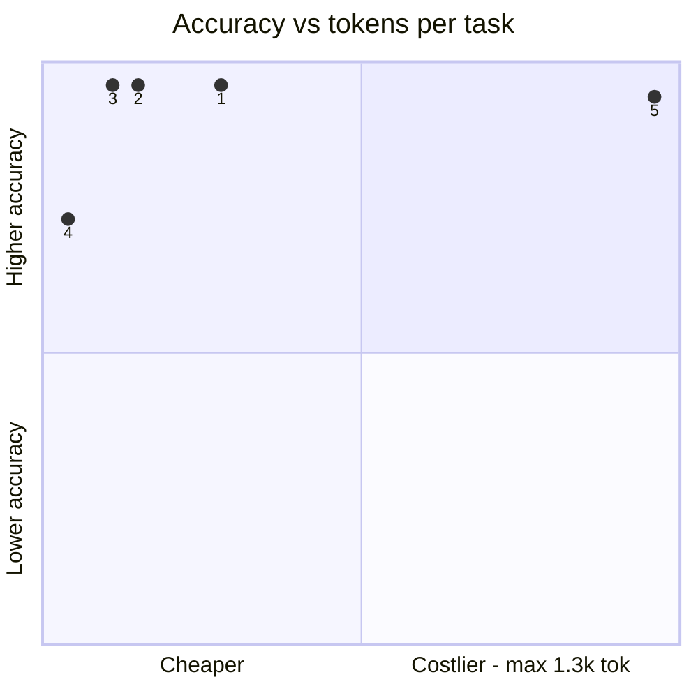
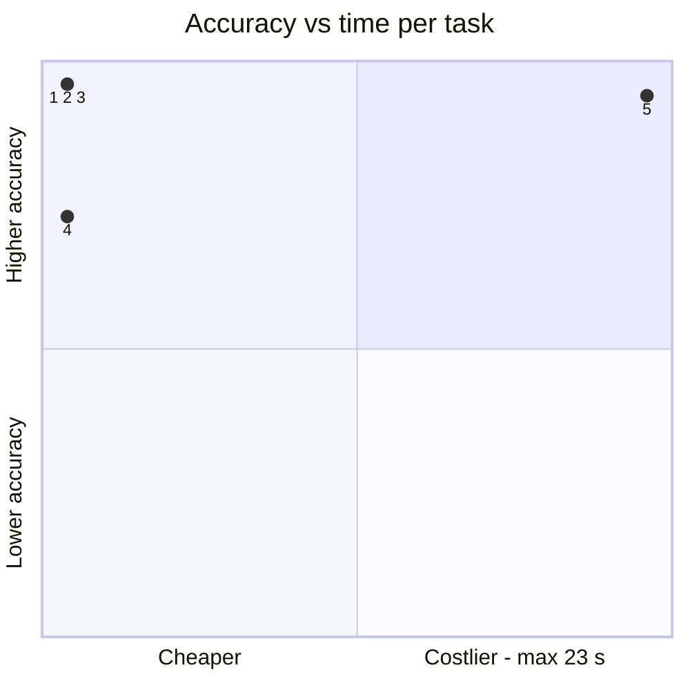
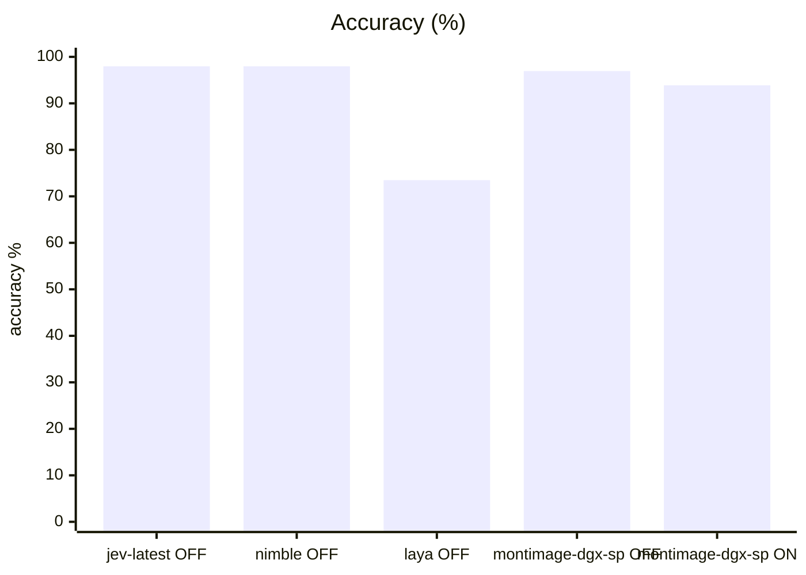
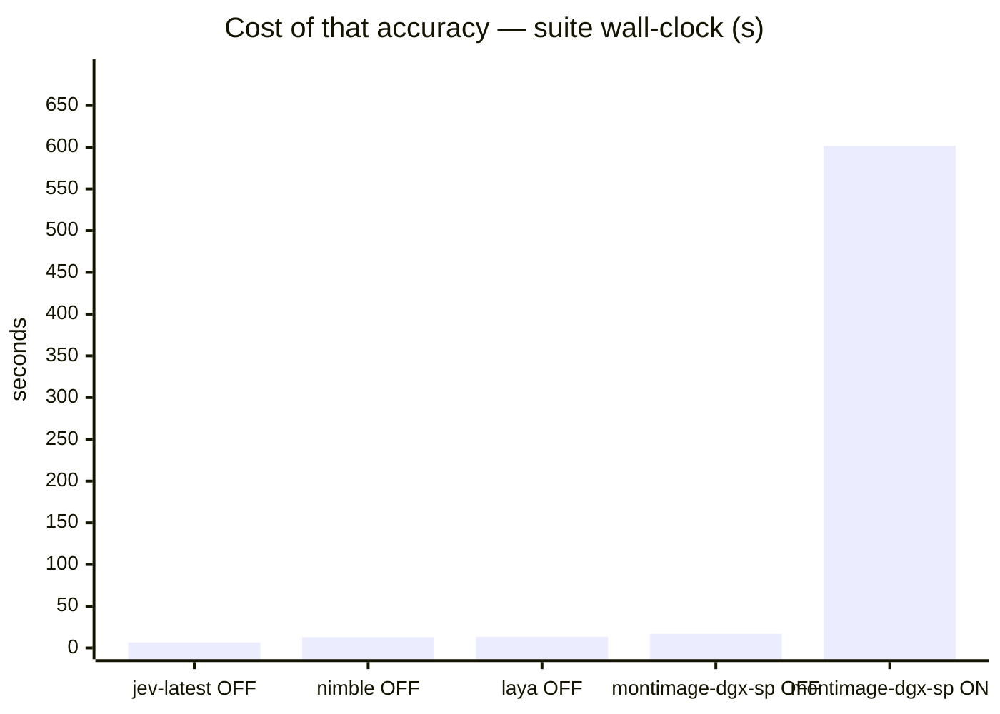
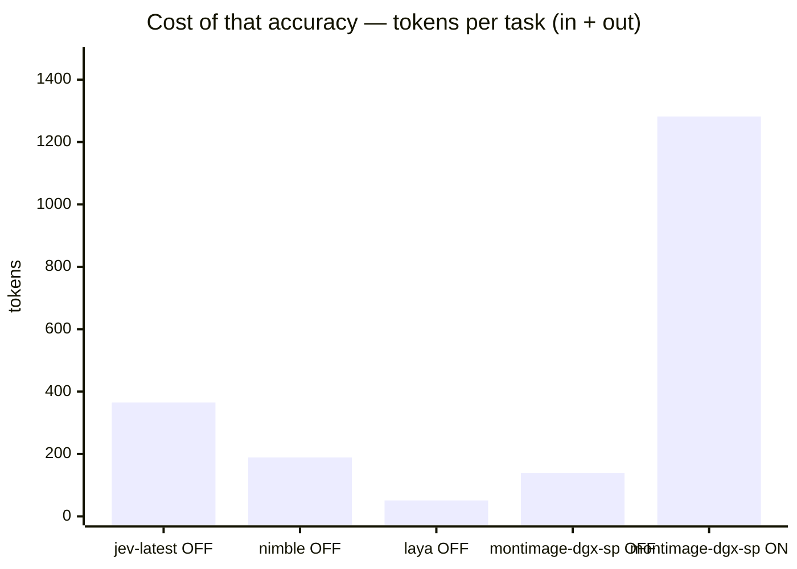
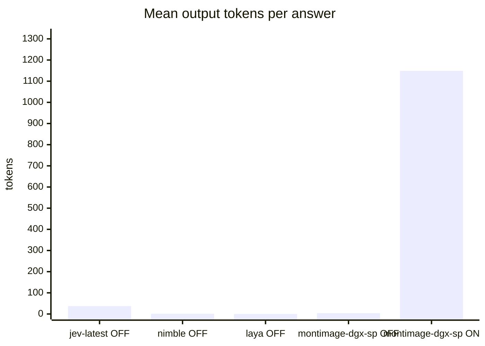

# System One candidates vs Jev baseline

**Question.** Can Nimble or Laya replace Jev behind the standard s1 endpoint?

**Verdict.** Nimble is a drop-in Jev replacement for this workload: identical 98.0% accuracy over the identical gateway transport, fully local (Ollama Q8_0, ~9.5 GiB), no API key, 0.5 s/question. Laya typed-decisions is not: 73.5% accuracy with failures spread across 12 tasks at every difficulty, CPU-bound on this box. Jev stays the baseline; Nimble is the first candidate proven contract-compatible and at-par.

## Setup

| | |
|---|---|
| Endpoint | mixed — `http://localhost:8123` (jev-latest OFF), `http://localhost:8123` (nimble OFF), `http://localhost:8123` (laya OFF), `http://localhost:8001` (montimage-dgx-sp OFF), `http://localhost:8001` (montimage-dgx-sp ON) |
| Tasks | 49 |
| Samples per task | 2 (⇒ 98 generations per run) |
| Concurrency | 4 |
| Metric | accuracy over exact-match answers on typed decision questions, with a 95% Wilson interval |

## Headline

| Run | Accuracy (95% CI) | Tokens per task | Time per task |
|---|---|---|---|---|
| typesafe jev-1.13 s1 | 98.0 % (93–99) | 327 in / 38 out | 0.3 s |
| bespoke-nimble-9b ollama s1 | 98.0 % (93–99) | 188 in / 1 out | 0.5 s |
| laya-typed-decisions inproc s1 | 73.5 % (64–81) | 51 in / 0 out | 0.5 s |
| incumbent-qwen3.6-s1-off | 96.9 % (91–99) | 135 in / 4 out | 0.7 s |
| incumbent-qwen3.6-s1-on | 93.9 % (87–97) | 133 in / 1,149 out | 22.6 s |

The bracket is the 95% Wilson interval of the solve rate, in points. *Tokens* and *time* are the mean per task attempt (input and output tokens as the endpoint or harness reported them; wall-clock seconds).

## At a glance

| # | Run | Harness · thinking | Accuracy | Tokens / task | Time / task |
|---|---|---|---|---|---|
| 1 | typesafe jev-1.13 s1 | built-in loop · OFF | `█████████▊` 98 % (93–99) | `██▉░░░░░░░` 365 | `▏░░░░░░░░░` 0 s |
| 2 | bespoke-nimble-9b ollama s1 | built-in loop · OFF | `█████████▊` 98 % (93–99) | `█▌░░░░░░░░` 189 | `▎░░░░░░░░░` 1 s |
| 3 | incumbent-qwen3.6-s1-off | built-in loop · OFF | `█████████▊` 97 % (91–99) | `█▏░░░░░░░░` 139 | `▎░░░░░░░░░` 1 s |
| 4 | laya-typed-decisions inproc s1 | built-in loop · OFF | `███████▍░░` 73 % (64–81) | `▍░░░░░░░░░` 51 | `▎░░░░░░░░░` 1 s |
| 5 | incumbent-qwen3.6-s1-on | built-in loop · ON | `█████████▍` 94 % (87–97) | `██████████` 1.3k | `██████████` 23 s |

Solve-rate bars run 0–100 %, bracket = 95% interval. Token and time bars are scaled to the costliest row — shorter is cheaper. Rows are sorted only **within** one harness and thinking mode; bars from different groups are side by side, not ranked.

Points are the `#` column above. Up is better, left is cheaper: the top-left corner is the most solved for the least spent. Cost is scaled to the costliest run.

## Results

| Run | Accuracy | easy | medium | hard | Wall | Mean out tok | Truncated | tok/s |
|---|---|---|---|---|---|---|---|---|
| **typesafe jev-1.13 s1** | **98.0 %** | 100.0 % | 100.0 % | 88.9 % | 7 s | 38 | 0 | 150.8 |
| bespoke-nimble-9b ollama s1 | 98.0 % | 100.0 % | 100.0 % | 88.9 % | 13 s | 1 | 0 | 2.0 |
| laya-typed-decisions inproc s1 | 73.5 % | 68.2 % | 83.3 % | 66.7 % | 13 s | — | 0 | — |
| incumbent-qwen3.6-s1-off | 96.9 % | 97.7 % | 100.0 % | 88.9 % | 17 s | 4 | 0 | 8.8 |
| incumbent-qwen3.6-s1-on | 93.9 % | 100.0 % | 94.4 % | 77.8 % | 602 s | 1,149 | 4 | 46.1 |

## By difficulty

| Run | easy | medium | hard |
|---|---|---|---|
| typesafe jev-1.13 s1 | `████████` 100 % | `████████` 100 % | `███████▏` 89 % |
| bespoke-nimble-9b ollama s1 | `████████` 100 % | `████████` 100 % | `███████▏` 89 % |
| laya-typed-decisions inproc s1 | `█████▌░░` 68 % | `██████▋░` 83 % | `█████▍░░` 67 % |
| incumbent-qwen3.6-s1-off | `███████▉` 98 % | `████████` 100 % | `███████▏` 89 % |
| incumbent-qwen3.6-s1-on | `████████` 100 % | `███████▌` 94 % | `██████▎░` 78 % |

## Task by task

Per-task solve rate (%). Tasks the runs disagree on are listed first, widest gap on top.

| Task | jev-latest OFF | nimble OFF | laya OFF | montimage-dgx-sp OFF | montimage-dgx-sp ON |
|---|---|---|---|---|---|
| `budget_veto/q2` | 🟩 100 | 🟩 100 | 🟥 0 | 🟩 100 | 🟨 50 |
| `cafe_hours/q2` | 🟩 100 | 🟩 100 | 🟥 0 | 🟩 100 | 🟨 50 |
| `capital_japan/q1` | 🟩 100 | 🟩 100 | 🟥 0 | 🟩 100 | 🟩 100 |
| `error_log/q3` | 🟩 100 | 🟩 100 | 🟥 0 | 🟩 100 | 🟩 100 |
| `fruit_basket/q2` | 🟩 100 | 🟩 100 | 🟥 0 | 🟩 100 | 🟩 100 |
| `height_order/q2` | 🟩 100 | 🟩 100 | 🟥 0 | 🟩 100 | 🟩 100 |
| `language_french/q1` | 🟩 100 | 🟩 100 | 🟥 0 | 🟩 100 | 🟩 100 |
| `museum_hours/q1` | 🟩 100 | 🟩 100 | 🟥 0 | 🟩 100 | 🟩 100 |
| `ref_code/q1` | 🟩 100 | 🟩 100 | 🟥 0 | 🟩 100 | 🟩 100 |
| `sale_item_refund/q2` | 🟩 100 | 🟩 100 | 🟥 0 | 🟩 100 | 🟩 100 |
| `spam_email/q2` | 🟩 100 | 🟩 100 | 🟥 0 | 🟩 100 | 🟩 100 |
| `threat_comment/q2` | 🟩 100 | 🟩 100 | 🟥 0 | 🟩 100 | 🟩 100 |
| `device_policy/q2` | 🟩 100 | 🟩 100 | 🟩 100 | 🟩 100 | 🟨 50 |
| `height_order/q1` | 🟩 100 | 🟩 100 | 🟩 100 | 🟩 100 | 🟨 50 |
| `ref_code/q2` | 🟩 100 | 🟩 100 | 🟩 100 | 🟨 50 | 🟩 100 |

- 🟩 **every run solved** (33): `bag_allowance/q1`, `bag_allowance/q2`, `borderline_comment/q1`, `borderline_comment/q2`, `budget_veto/q1`, `cafe_hours/q1`, `cafe_hours/q3`, `capital_japan/q2`, `chat_resolved/q1`, `chat_resolved/q2`, `device_policy/q1`, `error_log/q2`, `fruit_basket/q1`, `glowing_review/q1`, `glowing_review/q2`, `golden_retriever/q1`, `golden_retriever/q2`, `harsh_review/q1`, `harsh_review/q2`, `json_order/q1`, `json_order/q2`, `language_french/q2`, `museum_hours/q2`, `product_spec/q1`, `product_spec/q2`, `refund_eligible/q1`, `refund_eligible/q2`, `sale_item_refund/q1`, `sale_item_refund/q3`, `spam_email/q1`, `threat_comment/q1`, `ticket_billing/q1`, `ticket_billing/q2`
- 🟥 **every run failed** (1): `error_log/q1`

## Cost per task

Mean per attempt: input / output tokens, then wall-clock seconds. *not reported* = no usage reported for that task; *–* = the run has no cost record for it.

| Task | typesafe jev-1.13 s1 | bespoke-nimble-9b ollama s1 | laya-typed-decisions inproc s1 | incumbent-qwen3.6-s1-off | incumbent-qwen3.6-s1-on |
|---|---|---|---|---|---|
| `bag_allowance/q1` | 316 / 31 · 0.3 s | 171 / 1 · 0.5 s | 42 / 0 · 0.6 s | 126 / 4 · 0.3 s | 124 / 558 · 12.3 s |
| `bag_allowance/q2` | 320 / 31 · 0.2 s | 175 / 1 · 0.5 s | 46 / 0 · 0.5 s | 130 / 4 · 0.4 s | 128 / 340 · 7.6 s |
| `borderline_comment/q1` | 309 / 31 · 0.2 s | 164 / 1 · 0.6 s | 38 / 0 · 0.7 s | 119 / 4 · 0.3 s | 117 / 724 · 16.1 s |
| `borderline_comment/q2` | 308 / 31 · 0.3 s | 163 / 1 · 0.6 s | 37 / 0 · 0.5 s | 118 / 4 · 0.3 s | 116 / 352 · 8.0 s |
| `budget_veto/q1` | 313 / 31 · 0.5 s | 168 / 1 · 0.6 s | 43 / 0 · 0.9 s | 123 / 4 · 0.4 s | 121 / 404 · 8.8 s |
| `budget_veto/q2` | 314 / 31 · 0.3 s | 169 / 1 · 0.6 s | 44 / 0 · 1.1 s | 124 / 4 · 0.3 s | 122 / 8,398 · 149.8 s |
| `cafe_hours/q1` | 328 / 31 · 0.4 s | 183 / 1 · 0.5 s | 48 / 0 · 0.4 s | 138 / 4 · 0.4 s | 136 / 107 · 2.4 s |
| `cafe_hours/q2` | 330 / 31 · 0.2 s | 185 / 1 · 0.5 s | 50 / 0 · 0.4 s | 140 / 4 · 0.5 s | 138 / 8,396 · 160.8 s |
| `cafe_hours/q3` | 335 / 31 · 0.2 s | 190 / 1 · 0.5 s | 52 / 0 · 0.4 s | 145 / 4 · 0.3 s | 143 / 1,136 · 24.6 s |
| `capital_japan/q1` | 316 / 50 · 0.3 s | 184 / 1 · 0.5 s | 32 / 0 · 0.3 s | 116 / 4 · 1.0 s | 114 / 700 · 14.8 s |
| `capital_japan/q2` | 315 / 47 · 0.2 s | 183 / 1 · 0.5 s | 33 / 0 · 0.4 s | 117 / 4 · 0.5 s | 115 / 768 · 16.7 s |
| `chat_resolved/q1` | 345 / 51 · 0.3 s | 219 / 1 · 0.5 s | 64 / 0 · 0.4 s | 151 / 4 · 0.4 s | 149 / 841 · 17.6 s |
| `chat_resolved/q2` | 329 / 31 · 0.2 s | 186 / 1 · 0.5 s | 57 / 0 · 0.4 s | 140 / 4 · 0.4 s | 138 / 440 · 9.8 s |
| `device_policy/q1` | 317 / 31 · 0.2 s | 172 / 1 · 0.6 s | 46 / 0 · 1.3 s | 127 / 4 · 0.5 s | 125 / 463 · 10.1 s |
| `device_policy/q2` | 318 / 31 · 0.4 s | 173 / 1 · 0.5 s | 47 / 0 · 1.2 s | 128 / 4 · 0.5 s | 126 / 8,100 · 138.6 s |
| `error_log/q1` | 333 / 39 · 0.2 s | 196 / 1 · 0.5 s | 51 / 0 · 0.4 s | 142 / 4 · 0.4 s | 140 / 272 · 6.2 s |
| `error_log/q2` | 332 / 38 · 0.2 s | 194 / 1 · 0.5 s | 50 / 0 · 0.8 s | 144 / 5 · 0.5 s | 142 / 548 · 11.8 s |
| `error_log/q3` | 327 / 31 · 0.3 s | 183 / 1 · 0.5 s | 49 / 0 · 0.9 s | 138 / 4 · 0.4 s | 136 / 535 · 11.7 s |
| `fruit_basket/q1` | 315 / 45 · 0.2 s | 181 / 1 · 0.4 s | 35 / 0 · 0.4 s | 125 / 5 · 0.9 s | 123 / 256 · 5.6 s |
| `fruit_basket/q2` | 316 / 45 · 0.3 s | 182 / 1 · 0.4 s | 36 / 0 · 0.4 s | 126 / 2 · 1.4 s | 124 / 446 · 9.5 s |
| `glowing_review/q1` | 316 / 38 · 0.2 s | 177 / 1 · 0.5 s | 41 / 0 · 0.4 s | 124 / 4 · 1.3 s | 122 / 894 · 18.9 s |
| `glowing_review/q2` | 312 / 31 · 0.2 s | 167 / 1 · 0.5 s | 41 / 0 · 0.4 s | 122 / 4 · 1.5 s | 120 / 178 · 4.4 s |
| `golden_retriever/q1` | 316 / 45 · 0.2 s | 182 / 1 · 0.5 s | 39 / 0 · 0.5 s | 121 / 3 · 0.5 s | 119 / 438 · 9.2 s |
| `golden_retriever/q2` | 303 / 31 · 0.3 s | 157 / 1 · 0.5 s | 34 / 0 · 0.4 s | 112 / 4 · 0.4 s | 110 / 573 · 12.2 s |
| `harsh_review/q1` | 342 / 52 · 0.2 s | 213 / 1 · 0.6 s | 57 / 0 · 0.4 s | 149 / 2 · 0.4 s | 147 / 430 · 9.3 s |
| `harsh_review/q2` | 314 / 31 · 0.4 s | 167 / 1 · 0.6 s | 43 / 0 · 0.4 s | 122 / 4 · 0.5 s | 120 / 778 · 17.0 s |
| `height_order/q1` | 305 / 38 · 0.2 s | 165 / 1 · 0.5 s | 31 / 0 · 0.3 s | 113 / 3 · 0.4 s | 111 / 8,085 · 152.8 s |
| `height_order/q2` | 305 / 38 · 0.2 s | 165 / 1 · 0.5 s | 30 / 0 · 0.3 s | 113 / 3 · 0.4 s | 111 / 230 · 5.0 s |
| `json_order/q1` | 342 / 50 · 0.2 s | 212 / 1 · 0.6 s | 63 / 0 · 0.4 s | 145 / 4 · 0.5 s | 143 / 398 · 8.7 s |
| `json_order/q2` | 343 / 45 · 0.2 s | 213 / 1 · 0.6 s | 70 / 0 · 0.5 s | 154 / 2 · 0.4 s | 152 / 470 · 10.0 s |
| `language_french/q1` | 317 / 45 · 0.2 s | 184 / 1 · 0.5 s | 42 / 0 · 0.4 s | 123 / 4 · 0.5 s | 121 / 314 · 6.9 s |
| `language_french/q2` | 304 / 31 · 0.3 s | 159 / 1 · 0.5 s | 37 / 0 · 0.4 s | 114 / 4 · 0.5 s | 112 / 385 · 8.4 s |
| `museum_hours/q1` | 319 / 31 · 0.3 s | 174 / 1 · 0.5 s | 45 / 0 · 0.4 s | 129 / 4 · 0.5 s | 127 / 224 · 4.9 s |
| `museum_hours/q2` | 326 / 31 · 0.2 s | 181 / 1 · 0.5 s | 49 / 0 · 0.4 s | 136 / 4 · 0.5 s | 134 / 324 · 7.3 s |
| `product_spec/q1` | 315 / 31 · 0.2 s | 168 / 1 · 0.5 s | 38 / 0 · 0.4 s | 123 / 4 · 0.3 s | 121 / 687 · 14.6 s |
| `product_spec/q2` | 314 / 31 · 0.2 s | 167 / 1 · 0.5 s | 38 / 0 · 0.4 s | 122 / 4 · 0.5 s | 120 / 810 · 17.4 s |
| `ref_code/q1` | 355 / 80 · 0.2 s | 250 / 1 · 0.5 s | 64 / 0 · 0.4 s | 118 / 8 · 0.5 s | 116 / 467 · 10.1 s |
| `ref_code/q2` | 349 / 74 · 0.2 s | 238 / 1 · 0.5 s | 59 / 0 · 0.5 s | 161 / 16 · 0.8 s | 159 / 273 · 5.8 s |
| `refund_eligible/q1` | 342 / 31 · 0.2 s | 198 / 1 · 0.5 s | 68 / 0 · 0.7 s | 152 / 4 · 0.4 s | 150 / 462 · 10.0 s |
| `refund_eligible/q2` | 351 / 46 · 0.3 s | 220 / 1 · 0.6 s | 69 / 0 · 0.6 s | 157 / 2 · 0.4 s | 155 / 904 · 19.3 s |
| `sale_item_refund/q1` | 373 / 31 · 0.3 s | 230 / 1 · 0.7 s | 100 / 0 · 0.6 s | 184 / 4 · 0.4 s | 182 / 286 · 6.6 s |
| `sale_item_refund/q2` | 373 / 31 · 0.2 s | 230 / 1 · 0.7 s | 100 / 0 · 0.6 s | 184 / 4 · 0.4 s | 182 / 483 · 10.8 s |
| `sale_item_refund/q3` | 373 / 31 · 0.3 s | 230 / 1 · 0.5 s | 100 / 0 · 0.6 s | 184 / 4 · 0.4 s | 182 / 516 · 11.3 s |
| `spam_email/q1` | 357 / 31 · 0.4 s | 211 / 1 · 0.5 s | 79 / 0 · 1.2 s | 166 / 4 · 4.9 s | 164 / 621 · 13.6 s |
| `spam_email/q2` | 358 / 31 · 0.4 s | 212 / 1 · 0.5 s | 80 / 0 · 1.1 s | 167 / 4 · 5.0 s | 165 / 810 · 18.2 s |
| `threat_comment/q1` | 307 / 31 · 0.2 s | 162 / 1 · 0.5 s | 36 / 0 · 0.4 s | 117 / 4 · 0.4 s | 115 / 594 · 13.0 s |
| `threat_comment/q2` | 308 / 31 · 0.2 s | 163 / 1 · 0.5 s | 37 / 0 · 0.4 s | 118 / 4 · 0.4 s | 116 / 544 · 11.8 s |
| `ticket_billing/q1` | 335 / 46 · 0.2 s | 204 / 1 · 0.4 s | 55 / 0 · 0.4 s | 142 / 3 · 0.5 s | 140 / 534 · 11.9 s |
| `ticket_billing/q2` | 326 / 31 · 0.2 s | 182 / 1 · 0.4 s | 54 / 0 · 0.4 s | 137 / 4 · 0.4 s | 135 / 810 · 17.4 s |

## Reading the numbers

## Method notes — s1 candidate re-runs (issues #102, #104)

All three candidates were measured through the **same transport**: the standard
s1 gateway (`configs/s1_gateway.py`) on `http://localhost:8123/v1`, which parses
each rendered s1 prompt back into `(state, question, options)` and issues one
typed `choice` question per generation. Only `S1_BACKEND` changed between runs —
the benchmark client, suite, samples (2) and concurrency (4) were identical.

| Backend | Upstream | Serving |
|---|---|---|
| `typesafe` | `api.typesafe.ai/v1/systemone` | Hosted TypeSafe API (WAN) |
| `nimble` | Ollama 0.35.0 `localhost:11434/v1/systemone` | `bespokelabs/Bespoke-Nimble-9B`, merged Q8_0 (~9.5 GiB) on GB10 CUDA |
| `laya` | in-process `laya.predict` (thread executor) | `convaiinnovations/laya` `typed-decisions` checkpoint (~843 MB) |

- **Nimble** implements the Jev `/v1/systemone` contract natively in Ollama
  ≥0.35 — the gateway's translator is shared verbatim with the typesafe
  backend. Upstream `usage` (in/out tokens) is reported by Ollama. It answered
  the open extraction question (`ref_code/q1` → `ZX-4821-Q`) correctly via the
  same candidate-token Choice fallback Jev used.
- **Laya** is a non-autoregressive ModernBERT-style scorer; `usage` reports
  input tokens only (0 output by construction). It ran on **CPU** — the GB10's
  free memory was occupied by the incumbent vLLM service, which was not
  restarted (shared endpoint). Vendor estimates ~10–15× faster on GPU
  (~35 ms/question), so its 0.5 s/question is a floor, not a ceiling.
  Its root checkpoint is tuned for guardrails and scored near-chance in smoke
  tests; the **`typed-decisions` checkpoint** is the artifact measured here.
- **Jev** numbers are the earlier baseline run, re-listed for comparison; its
  latency is hosted WAN latency, not local inference.

Translation limitations, unchanged from the Jev baseline: open questions fall
back to Choice over state tokens; `noul`/`score` primitives unexercised
(uniform `choice`); one upstream call per question-generation.

**Verdict:** Nimble is a drop-in Jev replacement for this workload — identical
98.0 % accuracy on the identical transport, fully local, no API key, ~9.5 GiB
quantized. Laya typed-decisions (73.5 %) is not a replacement at this
checkpoint: it fails 12 distinct tasks across all difficulties. Neither margin
vs Jev needs a confidence argument — Nimble is tied to the point and Laya's
deficit (−24.5 pp) far exceeds the noise floor.

## Caveats

- 2 samples per task. Every solve rate carries a 95% Wilson interval over the generations behind it, and a margin between two runs is only a result when the 95% Newcombe interval of the difference excludes zero. The intervals treat each generation as independent; samples of one task are correlated, so with few tasks the true uncertainty is if anything wider. Raise `--samples` before calling a close race.
- Single-turn decision questions over a state, scored by exact match against each question's answer key. Code generation and multi-turn tool use are not exercised here.
- Verbose, reasoned or empty replies count as failures — deliberating instead of deciding is the failure mode this suite measures.
- A truncated generation counts as a failure; a high `Truncated` column means runaway reasoning, which hangs real agents.

## Raw data

- `typesafe-jev-1-13-s1.json` — typesafe jev-1.13 s1
- `bespoke-nimble-9b-ollama-s1.json` — bespoke-nimble-9b ollama s1
- `laya-typed-decisions-inproc-s1.json` — laya-typed-decisions inproc s1
- `incumbent-qwen3-6-s1-off.json` — incumbent-qwen3.6-s1-off
- `incumbent-qwen3-6-s1-on.json` — incumbent-qwen3.6-s1-on
