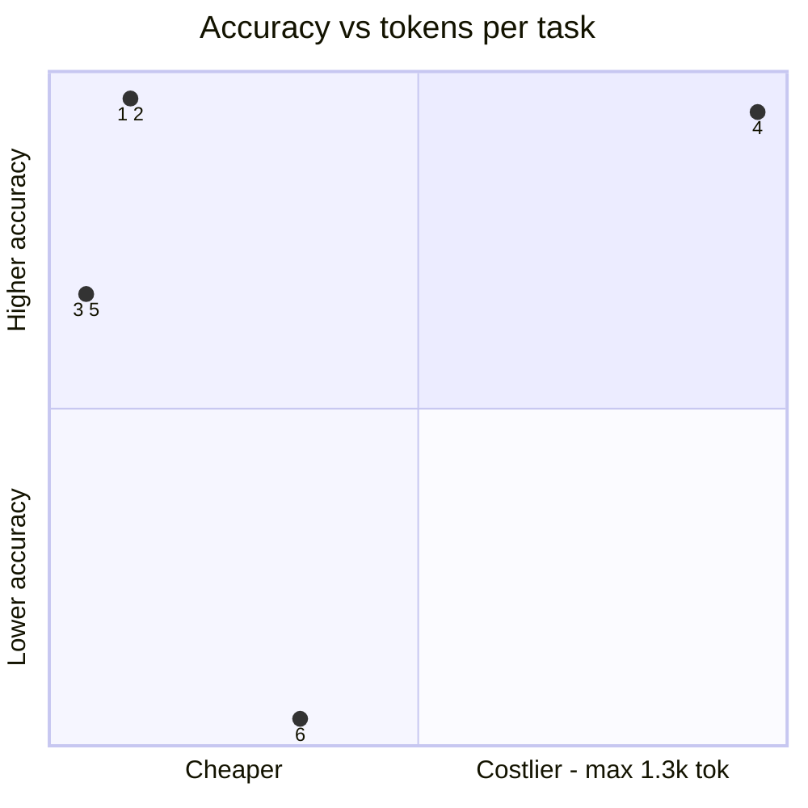
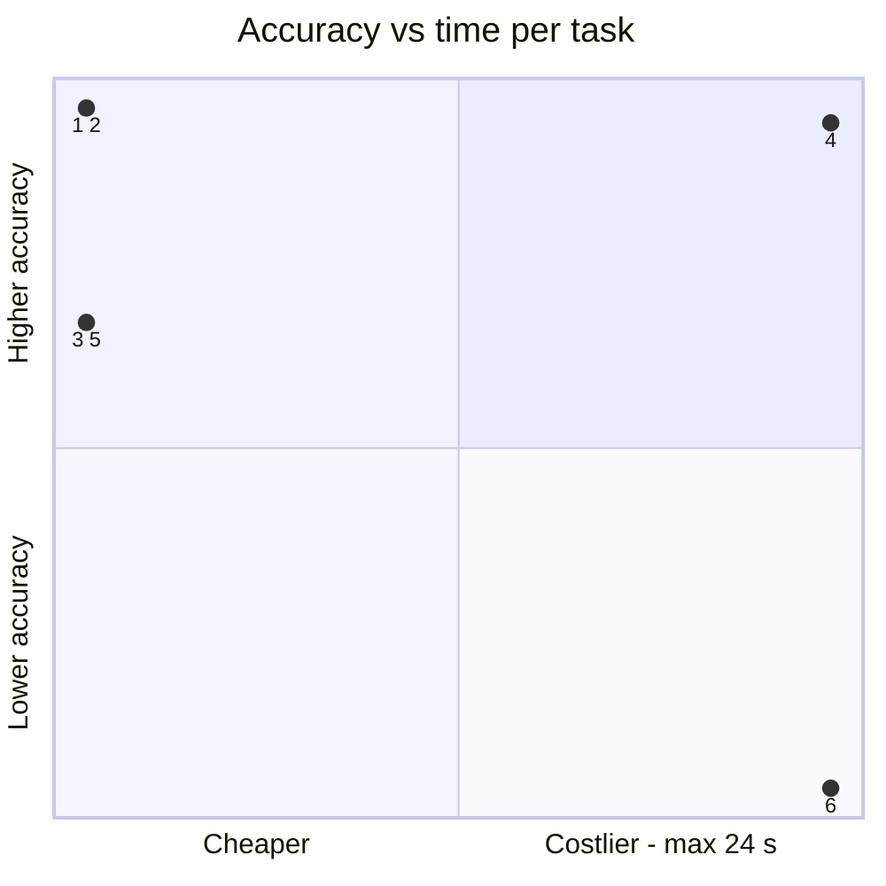
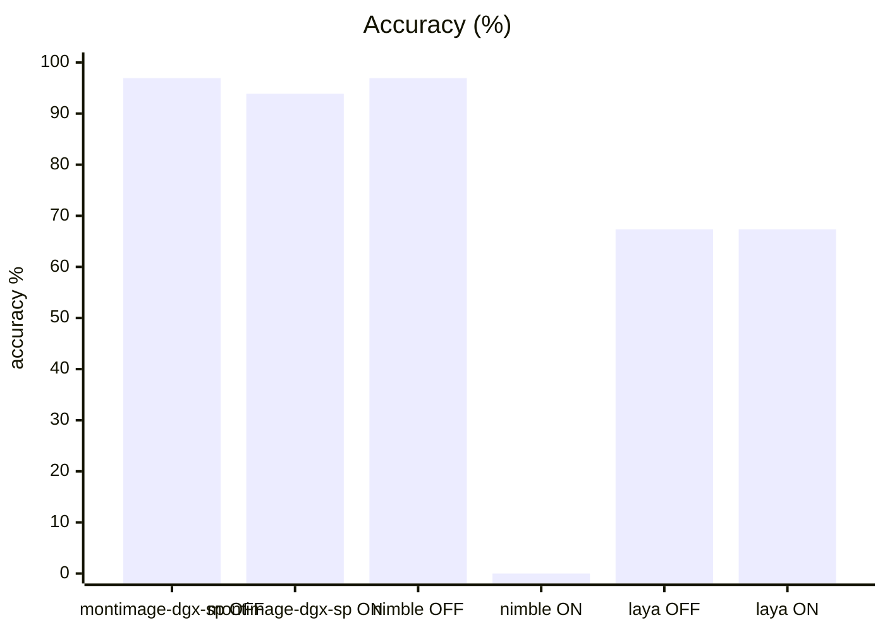
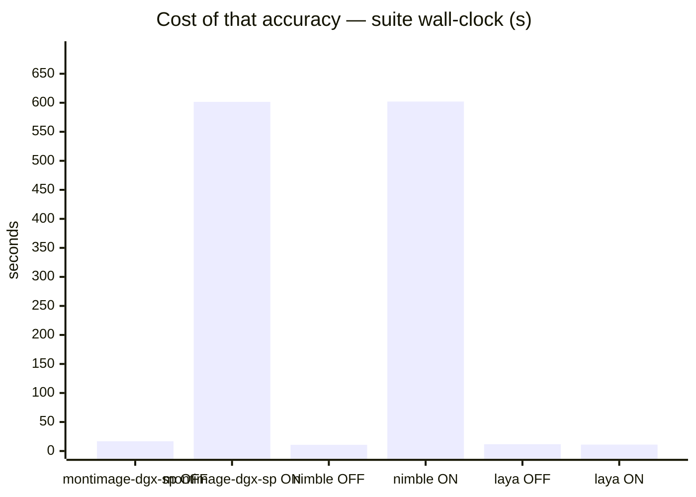
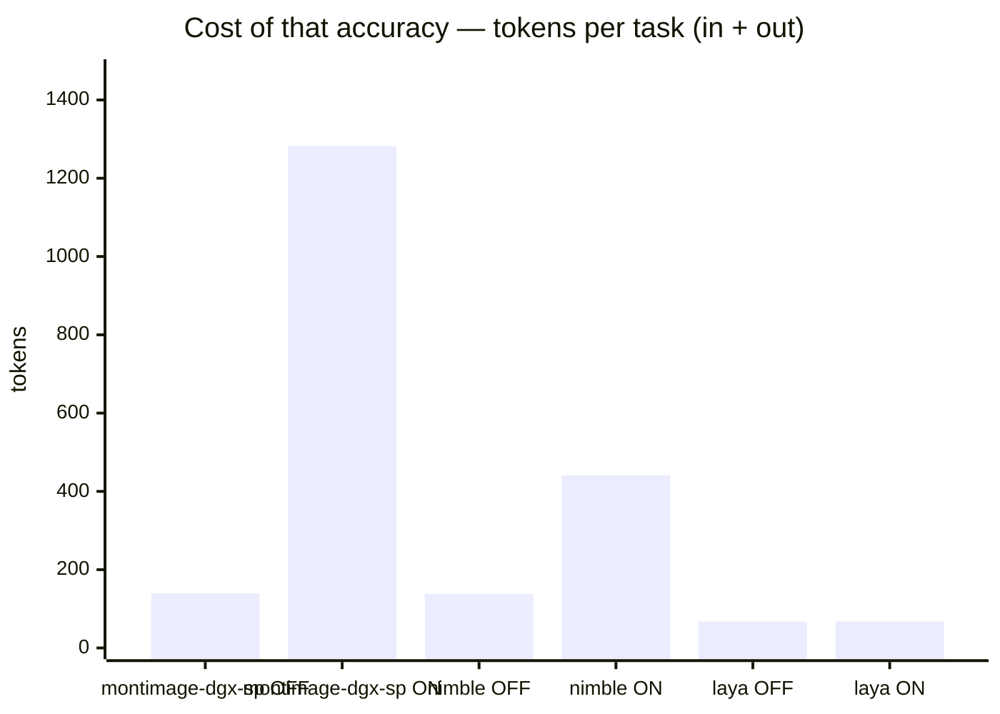
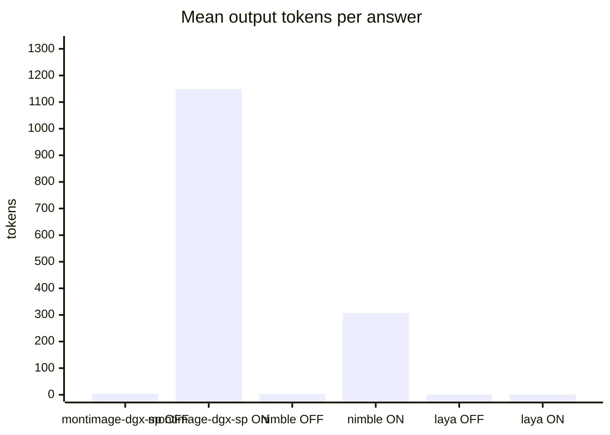

# Bespoke-Nimble-9B and Laya vs incumbent on system1

**Question.** Should Nimble-9B or Laya replace the incumbent for system-one decisions?

**Verdict.** Keep the incumbent: Nimble think-OFF ties it at 96.9% (CI overlap, margin includes zero) at lower latency, but think-ON collapses to 0.0% and the adapter needs ~23 GiB that does not coexist with the incumbent on this box. Laya trails at 67.3%.

## Setup

| | |
|---|---|
| Endpoint | mixed — `http://localhost:8001` (montimage-dgx-sp OFF), `http://localhost:8001` (montimage-dgx-sp ON), `http://127.0.0.1:8803` (nimble OFF), `http://127.0.0.1:8803` (nimble ON), `http://127.0.0.1:8804` (laya OFF), `http://127.0.0.1:8804` (laya ON) |
| Tasks | 49 |
| Samples per task | 2 (⇒ 98 generations per run) |
| Concurrency | 4 |
| Metric | accuracy over exact-match answers on typed decision questions, with a 95% Wilson interval |

## Headline

| Run | Accuracy (95% CI) | Tokens per task | Time per task |
|---|---|---|---|---|
| incumbent-qwen3.6-s1-off | 96.9 % (91–99) | 135 in / 4 out | 0.7 s |
| incumbent-qwen3.6-s1-on | 93.9 % (87–97) | 133 in / 1,149 out | 22.6 s |
| nimble-9b-s1-off | 96.9 % (91–99) | 135 in / 2 out | 0.4 s |
| nimble-9b-s1-on | 0.0 % (0–4) | 133 in / 308 out | 23.7 s |
| laya-s1-off | 67.3 % (58–76) | 66 in / 1 out | 0.5 s |
| laya-s1-on | 67.3 % (58–76) | 66 in / 1 out | 0.4 s |

The bracket is the 95% Wilson interval of the solve rate, in points. *Tokens* and *time* are the mean per task attempt (input and output tokens as the endpoint or harness reported them; wall-clock seconds).

## At a glance

| # | Run | Harness · thinking | Accuracy | Tokens / task | Time / task |
|---|---|---|---|---|---|
| 1 | incumbent-qwen3.6-s1-off | built-in loop · OFF | `█████████▊` 97 % (91–99) | `█▏░░░░░░░░` 139 | `▎░░░░░░░░░` 1 s |
| 2 | nimble-9b-s1-off | built-in loop · OFF | `█████████▊` 97 % (91–99) | `█▏░░░░░░░░` 138 | `▏░░░░░░░░░` 0 s |
| 3 | laya-s1-off | built-in loop · OFF | `██████▊░░░` 67 % (58–76) | `▌░░░░░░░░░` 67 | `▎░░░░░░░░░` 0 s |
| 4 | incumbent-qwen3.6-s1-on | built-in loop · ON | `█████████▍` 94 % (87–97) | `██████████` 1.3k | `█████████▌` 23 s |
| 5 | laya-s1-on | built-in loop · ON | `██████▊░░░` 67 % (58–76) | `▌░░░░░░░░░` 67 | `▏░░░░░░░░░` 0 s |
| 6 | nimble-9b-s1-on | built-in loop · ON | `░░░░░░░░░░` 0 % (0–4) | `███▍░░░░░░` 441 | `██████████` 24 s |

Solve-rate bars run 0–100 %, bracket = 95% interval. Token and time bars are scaled to the costliest row — shorter is cheaper. Rows are sorted only **within** one harness and thinking mode; bars from different groups are side by side, not ranked.

Points are the `#` column above. Up is better, left is cheaper: the top-left corner is the most solved for the least spent. Cost is scaled to the costliest run.

## Results

| Run | Accuracy | easy | medium | hard | Wall | Mean out tok | Truncated | tok/s |
|---|---|---|---|---|---|---|---|---|
| **incumbent-qwen3.6-s1-off** | **96.9 %** | 97.7 % | 100.0 % | 88.9 % | 17 s | 4 | 0 | 8.8 |
| incumbent-qwen3.6-s1-on | 93.9 % | 100.0 % | 94.4 % | 77.8 % | 602 s | 1,149 | 4 | 46.1 |
| nimble-9b-s1-off | 96.9 % | 97.7 % | 100.0 % | 88.9 % | 11 s | 2 | 0 | 5.4 |
| nimble-9b-s1-on | 0.0 % | 0.0 % | 0.0 % | 0.0 % | 602 s | 308 | 0 | 12.9 |
| laya-s1-off | 67.3 % | 68.2 % | 66.7 % | 66.7 % | 12 s | 1 | 0 | 27.1 |
| laya-s1-on | 67.3 % | 68.2 % | 66.7 % | 66.7 % | 11 s | 1 | 0 | 20.4 |

## By difficulty

| Run | easy | medium | hard |
|---|---|---|---|
| incumbent-qwen3.6-s1-off | `███████▉` 98 % | `████████` 100 % | `███████▏` 89 % |
| incumbent-qwen3.6-s1-on | `████████` 100 % | `███████▌` 94 % | `██████▎░` 78 % |
| nimble-9b-s1-off | `███████▉` 98 % | `████████` 100 % | `███████▏` 89 % |
| nimble-9b-s1-on | `░░░░░░░░` 0 % | `░░░░░░░░` 0 % | `░░░░░░░░` 0 % |
| laya-s1-off | `█████▌░░` 68 % | `█████▍░░` 67 % | `█████▍░░` 67 % |
| laya-s1-on | `█████▌░░` 68 % | `█████▍░░` 67 % | `█████▍░░` 67 % |

## Task by task

Per-task solve rate (%). Tasks the runs disagree on are listed first, widest gap on top.

| Task | montimage-dgx-sp OFF | montimage-dgx-sp ON | nimble OFF | nimble ON | laya OFF | laya ON |
|---|---|---|---|---|---|---|
| `bag_allowance/q1` | 🟩 100 | 🟩 100 | 🟩 100 | 🟥 0 | 🟩 100 | 🟩 100 |
| `bag_allowance/q2` | 🟩 100 | 🟩 100 | 🟩 100 | 🟥 0 | 🟩 100 | 🟩 100 |
| `borderline_comment/q1` | 🟩 100 | 🟩 100 | 🟩 100 | 🟥 0 | 🟩 100 | 🟩 100 |
| `borderline_comment/q2` | 🟩 100 | 🟩 100 | 🟩 100 | 🟥 0 | 🟩 100 | 🟩 100 |
| `budget_veto/q1` | 🟩 100 | 🟩 100 | 🟩 100 | 🟥 0 | 🟩 100 | 🟩 100 |
| `budget_veto/q2` | 🟩 100 | 🟨 50 | 🟩 100 | 🟥 0 | 🟥 0 | 🟥 0 |
| `cafe_hours/q1` | 🟩 100 | 🟩 100 | 🟩 100 | 🟥 0 | 🟥 0 | 🟥 0 |
| `cafe_hours/q2` | 🟩 100 | 🟨 50 | 🟩 100 | 🟥 0 | 🟥 0 | 🟥 0 |
| `cafe_hours/q3` | 🟩 100 | 🟩 100 | 🟩 100 | 🟥 0 | 🟩 100 | 🟩 100 |
| `capital_japan/q1` | 🟩 100 | 🟩 100 | 🟩 100 | 🟥 0 | 🟥 0 | 🟥 0 |
| `capital_japan/q2` | 🟩 100 | 🟩 100 | 🟩 100 | 🟥 0 | 🟩 100 | 🟩 100 |
| `chat_resolved/q1` | 🟩 100 | 🟩 100 | 🟩 100 | 🟥 0 | 🟩 100 | 🟩 100 |
| `chat_resolved/q2` | 🟩 100 | 🟩 100 | 🟩 100 | 🟥 0 | 🟩 100 | 🟩 100 |
| `device_policy/q1` | 🟩 100 | 🟩 100 | 🟩 100 | 🟥 0 | 🟩 100 | 🟩 100 |
| `device_policy/q2` | 🟩 100 | 🟨 50 | 🟩 100 | 🟥 0 | 🟩 100 | 🟩 100 |
| `error_log/q2` | 🟩 100 | 🟩 100 | 🟩 100 | 🟥 0 | 🟩 100 | 🟩 100 |
| `error_log/q3` | 🟩 100 | 🟩 100 | 🟩 100 | 🟥 0 | 🟥 0 | 🟥 0 |
| `fruit_basket/q1` | 🟩 100 | 🟩 100 | 🟩 100 | 🟥 0 | 🟩 100 | 🟩 100 |
| `fruit_basket/q2` | 🟩 100 | 🟩 100 | 🟩 100 | 🟥 0 | 🟥 0 | 🟥 0 |
| `glowing_review/q1` | 🟩 100 | 🟩 100 | 🟩 100 | 🟥 0 | 🟩 100 | 🟩 100 |
| `glowing_review/q2` | 🟩 100 | 🟩 100 | 🟩 100 | 🟥 0 | 🟩 100 | 🟩 100 |
| `golden_retriever/q1` | 🟩 100 | 🟩 100 | 🟩 100 | 🟥 0 | 🟩 100 | 🟩 100 |
| `golden_retriever/q2` | 🟩 100 | 🟩 100 | 🟩 100 | 🟥 0 | 🟩 100 | 🟩 100 |
| `harsh_review/q1` | 🟩 100 | 🟩 100 | 🟩 100 | 🟥 0 | 🟩 100 | 🟩 100 |
| `harsh_review/q2` | 🟩 100 | 🟩 100 | 🟩 100 | 🟥 0 | 🟥 0 | 🟥 0 |
| `height_order/q1` | 🟩 100 | 🟨 50 | 🟩 100 | 🟥 0 | 🟥 0 | 🟥 0 |
| `height_order/q2` | 🟩 100 | 🟩 100 | 🟩 100 | 🟥 0 | 🟥 0 | 🟥 0 |
| `json_order/q1` | 🟩 100 | 🟩 100 | 🟩 100 | 🟥 0 | 🟩 100 | 🟩 100 |
| `json_order/q2` | 🟩 100 | 🟩 100 | 🟩 100 | 🟥 0 | 🟩 100 | 🟩 100 |
| `language_french/q1` | 🟩 100 | 🟩 100 | 🟩 100 | 🟥 0 | 🟥 0 | 🟥 0 |
| `language_french/q2` | 🟩 100 | 🟩 100 | 🟩 100 | 🟥 0 | 🟩 100 | 🟩 100 |
| `museum_hours/q1` | 🟩 100 | 🟩 100 | 🟩 100 | 🟥 0 | 🟥 0 | 🟥 0 |
| `museum_hours/q2` | 🟩 100 | 🟩 100 | 🟩 100 | 🟥 0 | 🟩 100 | 🟩 100 |
| `product_spec/q1` | 🟩 100 | 🟩 100 | 🟩 100 | 🟥 0 | 🟩 100 | 🟩 100 |
| `product_spec/q2` | 🟩 100 | 🟩 100 | 🟩 100 | 🟥 0 | 🟩 100 | 🟩 100 |
| `ref_code/q1` | 🟩 100 | 🟩 100 | 🟩 100 | 🟥 0 | 🟥 0 | 🟥 0 |
| `ref_code/q2` | 🟨 50 | 🟩 100 | 🟩 100 | 🟥 0 | 🟩 100 | 🟩 100 |
| `refund_eligible/q1` | 🟩 100 | 🟩 100 | 🟩 100 | 🟥 0 | 🟩 100 | 🟩 100 |
| `refund_eligible/q2` | 🟩 100 | 🟩 100 | 🟩 100 | 🟥 0 | 🟩 100 | 🟩 100 |
| `sale_item_refund/q1` | 🟩 100 | 🟩 100 | 🟩 100 | 🟥 0 | 🟩 100 | 🟩 100 |
| `sale_item_refund/q2` | 🟩 100 | 🟩 100 | 🟩 100 | 🟥 0 | 🟥 0 | 🟥 0 |
| `sale_item_refund/q3` | 🟩 100 | 🟩 100 | 🟩 100 | 🟥 0 | 🟩 100 | 🟩 100 |
| `spam_email/q1` | 🟩 100 | 🟩 100 | 🟩 100 | 🟥 0 | 🟩 100 | 🟩 100 |
| `spam_email/q2` | 🟩 100 | 🟩 100 | 🟩 100 | 🟥 0 | 🟥 0 | 🟥 0 |
| `threat_comment/q1` | 🟩 100 | 🟩 100 | 🟩 100 | 🟥 0 | 🟩 100 | 🟩 100 |
| `threat_comment/q2` | 🟩 100 | 🟩 100 | 🟨 50 | 🟥 0 | 🟥 0 | 🟥 0 |
| `ticket_billing/q1` | 🟩 100 | 🟩 100 | 🟩 100 | 🟥 0 | 🟩 100 | 🟩 100 |
| `ticket_billing/q2` | 🟩 100 | 🟩 100 | 🟩 100 | 🟥 0 | 🟩 100 | 🟩 100 |

- 🟥 **every run failed** (1): `error_log/q1`

## Where they disagree — incumbent-qwen3.6-s1-off vs nimble-9b-s1-off

| Task | incumbent-qwen3.6-s1-off | nimble-9b-s1-off | Winner |
|---|---|---|---|
| `ref_code/q2` | 50 % | 100 % | nimble-9b-s1-off |
| `threat_comment/q2` | 100 % | 50 % | incumbent-qwen3.6-s1-off |

## Cost per task

Mean per attempt: input / output tokens, then wall-clock seconds. *not reported* = no usage reported for that task; *–* = the run has no cost record for it.

| Task | incumbent-qwen3.6-s1-off | incumbent-qwen3.6-s1-on | nimble-9b-s1-off | nimble-9b-s1-on | laya-s1-off | laya-s1-on |
|---|---|---|---|---|---|---|
| `bag_allowance/q1` | 126 / 4 · 0.3 s | 124 / 558 · 12.3 s | 126 / 2 · 0.4 s | 124 / 232 · 18.0 s | 58 / 1 · 0.4 s | 58 / 1 · 0.4 s |
| `bag_allowance/q2` | 130 / 4 · 0.4 s | 128 / 340 · 7.6 s | 130 / 2 · 0.4 s | 128 / 420 · 32.4 s | 64 / 1 · 0.5 s | 64 / 1 · 0.4 s |
| `borderline_comment/q1` | 119 / 4 · 0.3 s | 117 / 724 · 16.1 s | 119 / 2 · 0.4 s | 117 / 628 · 49.9 s | 58 / 1 · 0.4 s | 58 / 1 · 0.4 s |
| `borderline_comment/q2` | 118 / 4 · 0.3 s | 116 / 352 · 8.0 s | 118 / 2 · 0.3 s | 116 / 262 · 20.6 s | 56 / 1 · 0.4 s | 56 / 1 · 0.3 s |
| `budget_veto/q1` | 123 / 4 · 0.4 s | 121 / 404 · 8.8 s | 123 / 2 · 0.4 s | 121 / 426 · 32.8 s | 71 / 1 · 0.4 s | 71 / 1 · 0.4 s |
| `budget_veto/q2` | 124 / 4 · 0.3 s | 122 / 8,398 · 149.8 s | 124 / 2 · 0.4 s | 122 / 388 · 30.1 s | 74 / 1 · 0.4 s | 74 / 1 · 0.4 s |
| `cafe_hours/q1` | 138 / 4 · 0.4 s | 136 / 107 · 2.4 s | 138 / 2 · 0.4 s | 136 / 166 · 12.8 s | 51 / 1 · 0.5 s | 51 / 1 · 0.4 s |
| `cafe_hours/q2` | 140 / 4 · 0.5 s | 138 / 8,396 · 160.8 s | 140 / 2 · 0.4 s | 138 / 320 · 24.7 s | 54 / 1 · 0.5 s | 54 / 1 · 0.4 s |
| `cafe_hours/q3` | 145 / 4 · 0.3 s | 143 / 1,136 · 24.6 s | 145 / 2 · 0.4 s | 143 / 102 · 8.0 s | 54 / 1 · 0.4 s | 54 / 1 · 0.4 s |
| `capital_japan/q1` | 116 / 4 · 1.0 s | 114 / 700 · 14.8 s | 116 / 3 · 0.5 s | 114 / 208 · 15.9 s | 53 / 1 · 0.4 s | 53 / 1 · 0.4 s |
| `capital_japan/q2` | 117 / 4 · 0.5 s | 115 / 768 · 16.7 s | 117 / 3 · 0.5 s | 115 / 316 · 24.2 s | 58 / 1 · 0.5 s | 58 / 1 · 0.4 s |
| `chat_resolved/q1` | 151 / 4 · 0.4 s | 149 / 841 · 17.6 s | 151 / 5 · 0.6 s | 149 / 285 · 21.9 s | 91 / 1 · 0.5 s | 91 / 1 · 0.5 s |
| `chat_resolved/q2` | 140 / 4 · 0.4 s | 138 / 440 · 9.8 s | 140 / 2 · 0.4 s | 138 / 260 · 20.0 s | 80 / 1 · 0.5 s | 80 / 1 · 0.5 s |
| `device_policy/q1` | 127 / 4 · 0.5 s | 125 / 463 · 10.1 s | 127 / 2 · 0.4 s | 125 / 235 · 18.5 s | 72 / 1 · 0.4 s | 72 / 1 · 0.4 s |
| `device_policy/q2` | 128 / 4 · 0.5 s | 126 / 8,100 · 138.6 s | 128 / 2 · 0.4 s | 126 / 380 · 29.7 s | 75 / 1 · 0.4 s | 75 / 1 · 0.4 s |
| `error_log/q1` | 142 / 4 · 0.4 s | 140 / 272 · 6.2 s | 142 / 2 · 0.4 s | 140 / 525 · 40.1 s | 65 / 1 · 0.5 s | 65 / 1 · 0.4 s |
| `error_log/q2` | 144 / 5 · 0.5 s | 142 / 548 · 11.8 s | 144 / 2 · 0.4 s | 142 / 140 · 10.9 s | 59 / 1 · 0.5 s | 59 / 1 · 0.4 s |
| `error_log/q3` | 138 / 4 · 0.4 s | 136 / 535 · 11.7 s | 138 / 2 · 0.4 s | 136 / 281 · 21.7 s | 60 / 1 · 0.4 s | 60 / 1 · 0.4 s |
| `fruit_basket/q1` | 125 / 5 · 0.9 s | 123 / 256 · 5.6 s | 125 / 2 · 0.4 s | 123 / 233 · 17.9 s | 49 / 1 · 0.4 s | 49 / 1 · 0.4 s |
| `fruit_basket/q2` | 126 / 2 · 1.4 s | 124 / 446 · 9.5 s | 126 / 2 · 0.4 s | 124 / 150 · 11.5 s | 49 / 1 · 0.5 s | 49 / 1 · 0.4 s |
| `glowing_review/q1` | 124 / 4 · 1.3 s | 122 / 894 · 18.9 s | 124 / 2 · 0.4 s | 122 / 170 · 13.1 s | 65 / 1 · 0.4 s | 65 / 1 · 0.4 s |
| `glowing_review/q2` | 122 / 4 · 1.5 s | 120 / 178 · 4.4 s | 122 / 2 · 0.4 s | 120 / 364 · 27.8 s | 64 / 1 · 0.4 s | 64 / 1 · 0.4 s |
| `golden_retriever/q1` | 121 / 3 · 0.5 s | 119 / 438 · 9.2 s | 121 / 4 · 0.5 s | 119 / 244 · 19.1 s | 55 / 1 · 0.4 s | 55 / 1 · 0.4 s |
| `golden_retriever/q2` | 112 / 4 · 0.4 s | 110 / 573 · 12.2 s | 112 / 2 · 0.3 s | 110 / 200 · 15.8 s | 49 / 1 · 0.4 s | 49 / 1 · 0.4 s |
| `harsh_review/q1` | 149 / 2 · 0.4 s | 147 / 430 · 9.3 s | 149 / 2 · 0.4 s | 147 / 266 · 20.5 s | 70 / 1 · 0.5 s | 70 / 1 · 0.5 s |
| `harsh_review/q2` | 122 / 4 · 0.5 s | 120 / 778 · 17.0 s | 122 / 2 · 0.4 s | 120 / 230 · 17.7 s | 63 / 1 · 0.4 s | 63 / 1 · 0.4 s |
| `height_order/q1` | 113 / 3 · 0.4 s | 111 / 8,085 · 152.8 s | 113 / 3 · 0.5 s | 111 / 308 · 23.8 s | 45 / 1 · 0.4 s | 45 / 1 · 0.4 s |
| `height_order/q2` | 113 / 3 · 0.4 s | 111 / 230 · 5.0 s | 113 / 2 · 0.4 s | 111 / 224 · 17.4 s | 46 / 1 · 0.4 s | 46 / 1 · 0.4 s |
| `json_order/q1` | 145 / 4 · 0.5 s | 143 / 398 · 8.7 s | 145 / 2 · 0.4 s | 143 / 94 · 7.4 s | 65 / 1 · 0.5 s | 65 / 1 · 0.5 s |
| `json_order/q2` | 154 / 2 · 0.4 s | 152 / 470 · 10.0 s | 154 / 2 · 0.4 s | 152 / 222 · 17.2 s | 62 / 1 · 0.6 s | 62 / 1 · 0.6 s |
| `language_french/q1` | 123 / 4 · 0.5 s | 121 / 314 · 6.9 s | 123 / 3 · 0.5 s | 121 / 700 · 53.8 s | 62 / 1 · 0.5 s | 62 / 1 · 0.2 s |
| `language_french/q2` | 114 / 4 · 0.5 s | 112 / 385 · 8.4 s | 114 / 2 · 0.4 s | 112 / 247 · 19.0 s | 53 / 1 · 0.4 s | 53 / 1 · 0.2 s |
| `museum_hours/q1` | 129 / 4 · 0.5 s | 127 / 224 · 4.9 s | 129 / 2 · 0.4 s | 127 / 84 · 6.5 s | 57 / 1 · 0.4 s | 57 / 1 · 0.4 s |
| `museum_hours/q2` | 136 / 4 · 0.5 s | 134 / 324 · 7.3 s | 136 / 2 · 0.4 s | 134 / 244 · 18.7 s | 60 / 1 · 0.4 s | 60 / 1 · 0.4 s |
| `product_spec/q1` | 123 / 4 · 0.3 s | 121 / 687 · 14.6 s | 123 / 2 · 0.4 s | 121 / 232 · 17.9 s | 54 / 1 · 0.4 s | 54 / 1 · 0.4 s |
| `product_spec/q2` | 122 / 4 · 0.5 s | 120 / 810 · 17.4 s | 122 / 2 · 0.4 s | 120 / 116 · 9.0 s | 54 / 1 · 0.3 s | 54 / 1 · 0.4 s |
| `ref_code/q1` | 118 / 8 · 0.5 s | 116 / 467 · 10.1 s | 118 / 8 · 0.9 s | 116 / 220 · 16.9 s | 44 / 3 · 0.0 s | 44 / 3 · 0.0 s |
| `ref_code/q2` | 161 / 16 · 0.8 s | 159 / 273 · 5.8 s | 161 / 8 · 0.9 s | 159 / 122 · 9.4 s | 56 / 1 · 0.5 s | 56 / 1 · 0.5 s |
| `refund_eligible/q1` | 152 / 4 · 0.4 s | 150 / 462 · 10.0 s | 152 / 2 · 0.4 s | 150 / 338 · 25.7 s | 93 / 1 · 0.5 s | 93 / 1 · 0.5 s |
| `refund_eligible/q2` | 157 / 2 · 0.4 s | 155 / 904 · 19.3 s | 157 / 2 · 0.4 s | 155 / 273 · 21.0 s | 98 / 1 · 0.6 s | 98 / 1 · 0.5 s |
| `sale_item_refund/q1` | 184 / 4 · 0.4 s | 182 / 286 · 6.6 s | 184 / 2 · 0.4 s | 182 / 205 · 15.9 s | 113 / 1 · 0.6 s | 113 / 1 · 0.6 s |
| `sale_item_refund/q2` | 184 / 4 · 0.4 s | 182 / 483 · 10.8 s | 184 / 2 · 0.4 s | 182 / 258 · 20.0 s | 113 / 1 · 0.6 s | 113 / 1 · 0.6 s |
| `sale_item_refund/q3` | 184 / 4 · 0.4 s | 182 / 516 · 11.3 s | 184 / 2 · 0.5 s | 182 / 284 · 21.9 s | 113 / 1 · 0.6 s | 113 / 1 · 0.6 s |
| `spam_email/q1` | 166 / 4 · 4.9 s | 164 / 621 · 13.6 s | 166 / 2 · 0.5 s | 164 / 443 · 33.6 s | 87 / 1 · 0.9 s | 87 / 1 · 0.8 s |
| `spam_email/q2` | 167 / 4 · 5.0 s | 165 / 810 · 18.2 s | 167 / 2 · 0.6 s | 165 / 1,104 · 83.8 s | 90 / 1 · 0.9 s | 90 / 1 · 0.8 s |
| `threat_comment/q1` | 117 / 4 · 0.4 s | 115 / 594 · 13.0 s | 117 / 2 · 0.4 s | 115 / 288 · 22.0 s | 55 / 1 · 0.4 s | 55 / 1 · 0.4 s |
| `threat_comment/q2` | 118 / 4 · 0.4 s | 116 / 544 · 11.8 s | 118 / 2 · 0.4 s | 116 / 262 · 20.1 s | 56 / 1 · 0.4 s | 56 / 1 · 0.4 s |
| `ticket_billing/q1` | 142 / 3 · 0.5 s | 140 / 534 · 11.9 s | 142 / 2 · 0.7 s | 140 / 463 · 35.6 s | 80 / 1 · 0.5 s | 80 / 1 · 0.5 s |
| `ticket_billing/q2` | 137 / 4 · 0.4 s | 135 / 810 · 17.4 s | 137 / 2 · 0.6 s | 135 / 905 · 69.5 s | 76 / 1 · 0.5 s | 76 / 1 · 0.5 s |

## Reading the numbers

## Analysis — Bespoke-Nimble-9B and Laya on `system1` (issue #104)

Both candidates were served on side ports and driven through the same
OpenAI-compatible transport as the incumbent (`benchkit` harness, `system1`
suite, `--samples 2`, n=98 per arm).

### Serving what was actually measured

- **Nimble** (`BENCH_MODEL=nimble`) is the LoRA adapter
  `bespokelabs/Bespoke-Nimble-9B` (165 MiB, rank 16) hot-loaded by vLLM over the
  bf16 `Qwen/Qwen3.5-9B` base — `configs/nimble-9b-lora.sh`. The `nimble-9b`
  served name aliases the *base* weights; the adapter answers to `nimble`.
  Measuring `nimble-9b` would have silently measured the base model.
- **Laya** (`BENCH_MODEL=laya`) runs behind `laya-shim.py` (CPU-only aiohttp
  shim on :8804) that parses the suite's `State:/Question:/Options:` prompt,
  calls `Router().predict`, and emits the winning option's letter as a one-token
  streamed reply — `configs/laya-9b-shim.sh`. The reference `Router().predict`
  API is non-conversational; the shim is the only bridge, and its output is
  what the scorer sees.

### What the numbers say

- **Nimble think-OFF ties the incumbent exactly**: 96.9 % vs 96.9 % with
  identical Wilson bounds — the margin's interval includes zero by
  construction. It does so at 0.4 s/task and 2 output tokens versus the
  incumbent's 0.7 s / 4 tokens. On accuracy alone there is nothing to choose.
- **Nimble think-ON scores 0.0 %** (CI 0.0–3.8, n=98, zero errors, zero
  truncations). Every generation completed — the adapter produced ~308 tokens
  of reasoning per question and never emitted an exact-match answer. This is
  a measured product difference, not a harness failure: Nimble is a
  non-deliberative decision head and `enable_thinking` removes it from that
  product entirely. The incumbent under thinking still scores 93.9 %.
- **Laya scores 67.3 % in both modes** (CI 57.6–75.8). The encoder ignores the
  thinking kwarg, so both runs are the same measurement. Misses concentrate on
  questions whose `options` are absent (open short answers the typed router
  cannot represent — a known ~2-pt ceiling) plus several ordinary `choice`
  misses; Laya's own checkpoint also warns that some choice heads ship
  uncalibrated temperatures. At ~0.4–0.5 s/task on CPU it is cheap, but it is
  ~30 points behind.

### Machine constraints measured along the way

- bf16 `Qwen3.5-9B` + LoRA needs ~22.6 GiB (`--gpu-memory-utilization 0.19`).
  With the incumbent at ~72 GiB and ~22 GiB held by another process, ~20 GiB
  free was not enough — the sidecar only fits with the primary stopped. These
  numbers were run with the incumbent offline; `configs/nimble-9b-merged.sh`
  documents the standalone fallback.
- `Intel/Qwen3.5-9B-int4-AutoRound` (~8.4 GiB) loaded fine at util 0.12 in the
  squeezed pool; LoRA-over-quantized init was interrupted before a verdict.
- llama.cpp serves Qwen3.5 GGUFs natively, but `convert_lora_to_gguf.py` fails
  on this hybrid arch (`NotImplementedError` in `_reorder_v_heads`, on
  `attn_gate`/`ssm_*` tensors) — no GGUF-LoRA path without converter work.

### Verdict

Keep the incumbent. Nimble-OFF matches its accuracy cheaper but is a
different, narrower product — it collapses under thinking, needs the base's
GPU budget, and its adapter serves no other suite here. Laya is ~30 points
behind and cannot represent open questions. Neither displaces
`montimage-dgx-spark`; Nimble is recorded as a viable specialist decision
endpoint for environments that can spare ~23 GiB and never enable thinking.

## Caveats

- 2 samples per task. Every solve rate carries a 95% Wilson interval over the generations behind it, and a margin between two runs is only a result when the 95% Newcombe interval of the difference excludes zero. The intervals treat each generation as independent; samples of one task are correlated, so with few tasks the true uncertainty is if anything wider. Raise `--samples` before calling a close race.
- Single-turn decision questions over a state, scored by exact match against each question's answer key. Code generation and multi-turn tool use are not exercised here.
- Verbose, reasoned or empty replies count as failures — deliberating instead of deciding is the failure mode this suite measures.
- A truncated generation counts as a failure; a high `Truncated` column means runaway reasoning, which hangs real agents.

## Raw data

- `incumbent-qwen3-6-s1-off.json` — incumbent-qwen3.6-s1-off
- `incumbent-qwen3-6-s1-on.json` — incumbent-qwen3.6-s1-on
- `nimble-9b-s1-off.json` — nimble-9b-s1-off
- `nimble-9b-s1-on.json` — nimble-9b-s1-on
- `laya-s1-off.json` — laya-s1-off
- `laya-s1-on.json` — laya-s1-on
