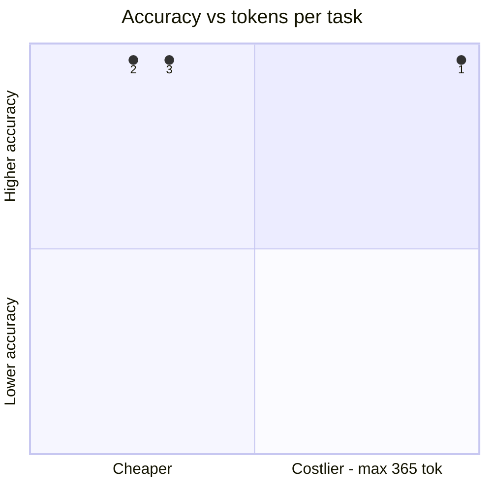
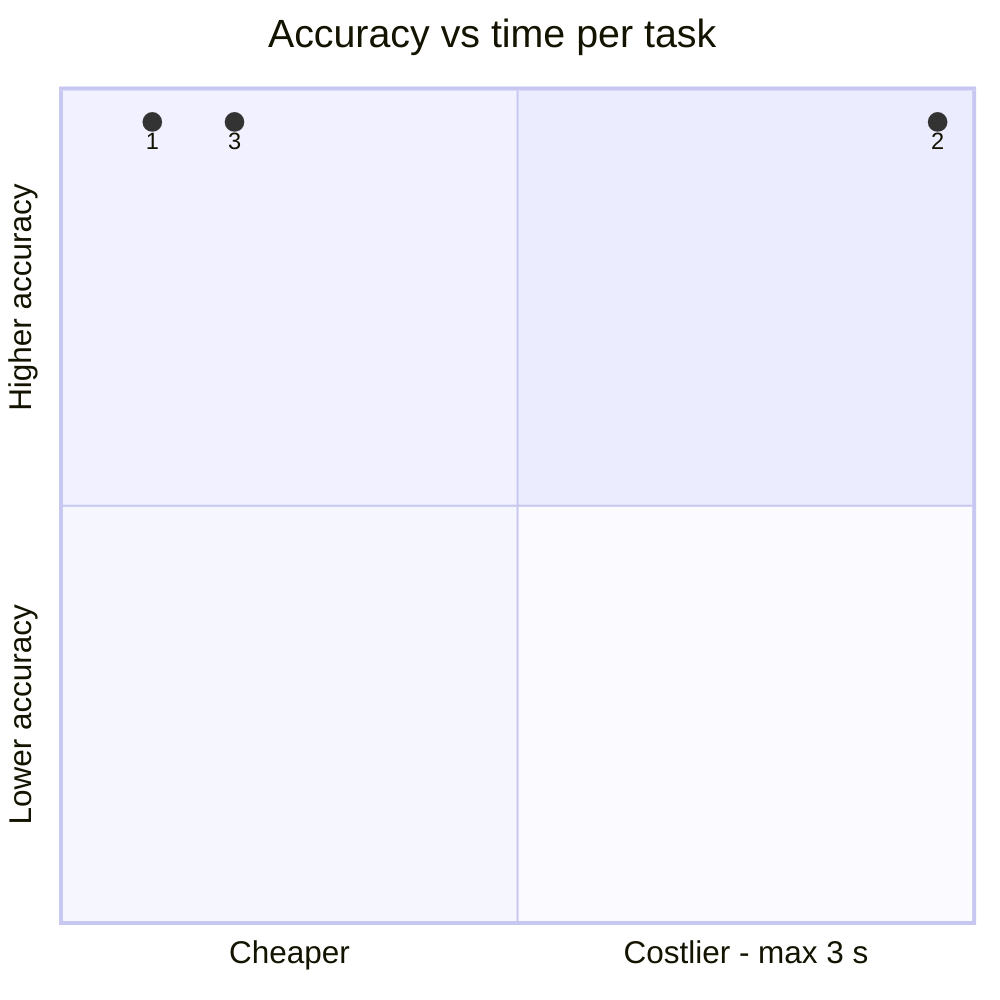
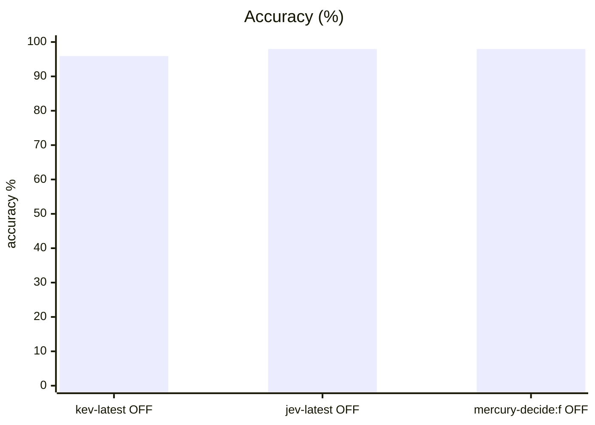
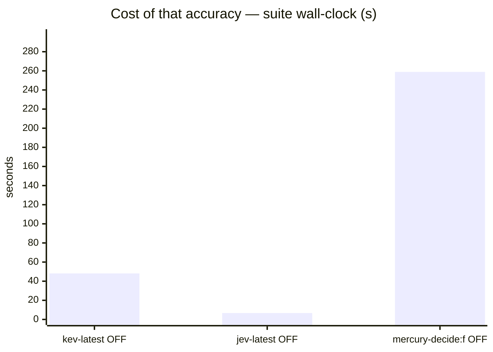
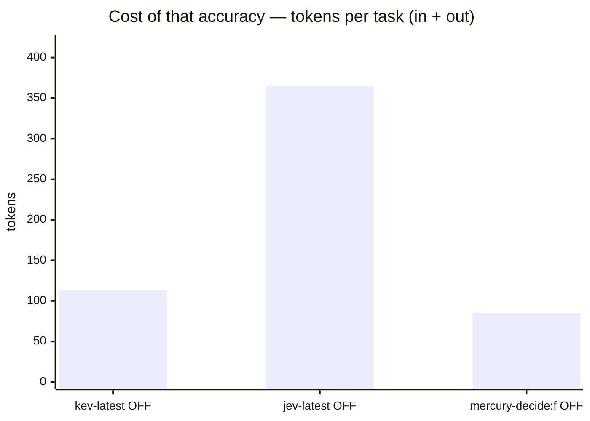
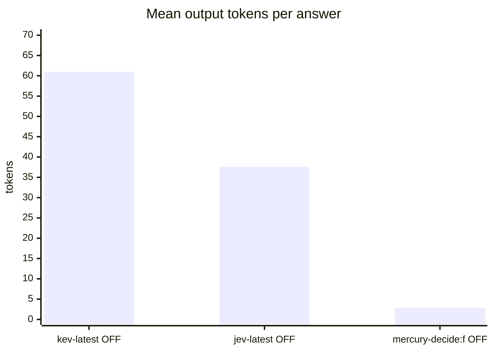

# Mercury Decide via OpenRouter — System One and phishing evaluation

**Question.** Should Mercury Decide replace the current System One backend?

**Verdict.** Support Mercury as an optional hosted backend, but keep the faster local incumbent as default. Mercury matches historical Jev at 98.0% system1 and solves 16/16 phishing emails through the existing pipeline; its 2.0-point margin over kev-latest is statistical noise, and free-tier quota waiting adds latency. Both datasets are saturated and need harder cases.

## Setup

| | |
|---|---|
| Endpoint | mixed — `http://localhost:8123` (kev-latest OFF), `http://localhost:8123` (jev-latest OFF), `http://localhost:8124` (mercury-decide:f OFF) |
| Tasks | 49 |
| Samples per task | 2 (⇒ 98 generations per run) |
| Concurrency | mixed — 1 (kev-latest OFF), 4 (jev-latest OFF), 1 (mercury-decide:f OFF) |
| Metric | accuracy over exact-match answers on typed decision questions, with a 95% Wilson interval |

<sub>The runs above were **not** all collected under the same settings. Solve rate and tool-call counts are unaffected, but wall-clock is not comparable across rows that differ in concurrency, and scores from different sample counts carry wider or narrower intervals.</sub>

## Headline

| Run | Accuracy (95% CI) | Tokens per task | Time per task |
|---|---|---|---|---|
| incumbent kev-latest s1 | 95.9 % (90–98) | 52 in / 61 out | 0.5 s |
| typesafe jev-1.13 s1 | 98.0 % (93–99) | 327 in / 38 out | 0.3 s |
| mercury-decide-free s1 rate-aware | 98.0 % (93–99) | 82 in / 3 out | 2.6 s |

<sub>The bracket is the 95% Wilson interval of the solve rate, in points. *Tokens* and *time* are the mean per task attempt (input and output tokens as the endpoint or harness reported them; wall-clock seconds).</sub>

## At a glance

| # | Run | Harness · thinking | Accuracy | Tokens / task | Time / task |
|---|---|---|---|---|---|
| 1 | typesafe jev-1.13 s1 | built-in loop · OFF | `█████████▊` 98 % <sub>(93–99)</sub> | `██████████` 365 | `█░░░░░░░░░` 0 s |
| 2 | mercury-decide-free s1 rate-aware | built-in loop · OFF | `█████████▊` 98 % <sub>(93–99)</sub> | `██▍░░░░░░░` 85 | `██████████` 3 s |
| 3 | incumbent kev-latest s1 | built-in loop · OFF | `█████████▋` 96 % <sub>(90–98)</sub> | `███▏░░░░░░` 113 | `█▉░░░░░░░░` 0 s |

<sub>Solve-rate bars run 0–100 %, bracket = 95% interval. Token and time bars are scaled to the costliest row — shorter is cheaper.</sub>





<sub>Points are the `#` column above. Up is better, left is cheaper: the top-left corner is the most solved for the least spent. Cost is scaled to the costliest run.</sub>

## Results

| Run | Accuracy | easy | medium | hard | Wall | Mean out tok | Truncated | tok/s |
|---|---|---|---|---|---|---|---|---|
| incumbent kev-latest s1 | 95.9 % | 95.5 % | 100.0 % | 88.9 % | 48 s | 61 | 0 | 178.6 |
| **typesafe jev-1.13 s1** | **98.0 %** | 100.0 % | 100.0 % | 88.9 % | 7 s | 38 | 0 | 150.8 |
| mercury-decide-free s1 rate-aware | 98.0 % | 100.0 % | 100.0 % | 88.9 % | 259 s | 3 | 0 | 6.2 |









## By difficulty

| Run | easy | medium | hard |
|---|---|---|---|
| incumbent kev-latest s1 | `███████▋` 95 % | `████████` 100 % | `███████▏` 89 % |
| typesafe jev-1.13 s1 | `████████` 100 % | `████████` 100 % | `███████▏` 89 % |
| mercury-decide-free s1 rate-aware | `████████` 100 % | `████████` 100 % | `███████▏` 89 % |

## Task by task

<sub>Per-task solve rate (%). Tasks the runs disagree on are listed first, widest gap on top.</sub>

| Task | kev-latest OFF | jev-latest OFF | mercury-decide:f OFF |
|---|---|---|---|
| `spam_email/q2` | 🟥 0 | 🟩 100 | 🟩 100 |

- 🟩 **every run solved** (47): `bag_allowance/q1`, `bag_allowance/q2`, `borderline_comment/q1`, `borderline_comment/q2`, `budget_veto/q1`, `budget_veto/q2`, `cafe_hours/q1`, `cafe_hours/q2`, `cafe_hours/q3`, `capital_japan/q1`, `capital_japan/q2`, `chat_resolved/q1`, `chat_resolved/q2`, `device_policy/q1`, `device_policy/q2`, `error_log/q2`, `error_log/q3`, `fruit_basket/q1`, `fruit_basket/q2`, `glowing_review/q1`, `glowing_review/q2`, `golden_retriever/q1`, `golden_retriever/q2`, `harsh_review/q1`, `harsh_review/q2`, `height_order/q1`, `height_order/q2`, `json_order/q1`, `json_order/q2`, `language_french/q1`, `language_french/q2`, `museum_hours/q1`, `museum_hours/q2`, `product_spec/q1`, `product_spec/q2`, `ref_code/q1`, `ref_code/q2`, `refund_eligible/q1`, `refund_eligible/q2`, `sale_item_refund/q1`, `sale_item_refund/q2`, `sale_item_refund/q3`, `spam_email/q1`, `threat_comment/q1`, `threat_comment/q2`, `ticket_billing/q1`, `ticket_billing/q2`
- 🟥 **every run failed** (1): `error_log/q1`

## Cost per task

<sub>Mean per attempt: input / output tokens, then wall-clock seconds. *not reported* = no usage reported for that task; *–* = the run has no cost record for it.</sub>

| Task | incumbent kev-latest s1 | typesafe jev-1.13 s1 | mercury-decide-free s1 rate-aware |
|---|---|---|---|
| `bag_allowance/q1` | 43 / 52 · 0.5 s | 316 / 31 · 0.3 s | 75 / 2 · 0.4 s |
| `bag_allowance/q2` | 47 / 51 · 0.5 s | 320 / 31 · 0.2 s | 80 / 2 · 0.5 s |
| `borderline_comment/q1` | 36 / 52 · 0.5 s | 309 / 31 · 0.2 s | 60 / 2 · 0.5 s |
| `borderline_comment/q2` | 35 / 52 · 0.5 s | 308 / 31 · 0.3 s | 68 / 3 · 0.4 s |
| `budget_veto/q1` | 40 / 52 · 0.6 s | 313 / 31 · 0.5 s | 73 / 2 · 0.5 s |
| `budget_veto/q2` | 41 / 52 · 0.5 s | 314 / 31 · 0.3 s | 64 / 3 · 0.4 s |
| `cafe_hours/q1` | 55 / 52 · 0.6 s | 328 / 31 · 0.4 s | 88 / 4 · 0.5 s |
| `cafe_hours/q2` | 57 / 52 · 0.3 s | 330 / 31 · 0.2 s | 80 / 2 · 0.4 s |
| `cafe_hours/q3` | 62 / 52 · 0.6 s | 335 / 31 · 0.2 s | 95 / 4 · 0.5 s |
| `capital_japan/q1` | 35 / 79 · 0.3 s | 316 / 50 · 0.3 s | 78 / 3 · 31.2 s |
| `capital_japan/q2` | 35 / 75 · 0.5 s | 315 / 47 · 0.2 s | 78 / 3 · 0.5 s |
| `chat_resolved/q1` | 67 / 80 · 0.6 s | 345 / 51 · 0.3 s | 90 / 4 · 0.4 s |
| `chat_resolved/q2` | 57 / 48 · 0.6 s | 329 / 31 · 0.2 s | 92 / 4 · 0.5 s |
| `device_policy/q1` | 44 / 52 · 0.5 s | 317 / 31 · 0.2 s | 66 / 3 · 0.4 s |
| `device_policy/q2` | 45 / 52 · 0.5 s | 318 / 31 · 0.4 s | 88 / 3 · 0.6 s |
| `error_log/q1` | 58 / 64 · 0.5 s | 333 / 39 · 0.2 s | 98 / 2 · 0.4 s |
| `error_log/q2` | 57 / 63 · 0.5 s | 332 / 38 · 0.2 s | 82 / 3 · 0.4 s |
| `error_log/q3` | 55 / 52 · 0.5 s | 327 / 31 · 0.3 s | 87 / 2 · 25.9 s |
| `fruit_basket/q1` | 36 / 74 · 0.5 s | 315 / 45 · 0.2 s | 64 / 4 · 0.5 s |
| `fruit_basket/q2` | 37 / 74 · 0.5 s | 316 / 45 · 0.3 s | 85 / 2 · 0.6 s |
| `glowing_review/q1` | 40 / 63 · 0.3 s | 316 / 38 · 0.2 s | 65 / 4 · 0.4 s |
| `glowing_review/q2` | 39 / 52 · 0.5 s | 312 / 31 · 0.2 s | 62 / 2 · 0.5 s |
| `golden_retriever/q1` | 36 / 74 · 0.5 s | 316 / 45 · 0.2 s | 82 / 2 · 0.5 s |
| `golden_retriever/q2` | 29 / 52 · 0.2 s | 303 / 31 · 0.3 s | 74 / 3 · 0.5 s |
| `harsh_review/q1` | 58 / 85 · 0.5 s | 342 / 52 · 0.2 s | 88 / 2 · 0.4 s |
| `harsh_review/q2` | 39 / 52 · 0.3 s | 314 / 31 · 0.4 s | 63 / 4 · 0.4 s |
| `height_order/q1` | 29 / 62 · 0.5 s | 305 / 38 · 0.2 s | 53 / 3 · 26.0 s |
| `height_order/q2` | 29 / 62 · 0.5 s | 305 / 38 · 0.2 s | 68 / 2 · 0.5 s |
| `json_order/q1` | 62 / 77 · 0.5 s | 342 / 50 · 0.2 s | 83 / 2 · 0.4 s |
| `json_order/q2` | 65 / 74 · 0.6 s | 343 / 45 · 0.2 s | 134 / 4 · 0.5 s |
| `language_french/q1` | 38 / 74 · 0.5 s | 317 / 45 · 0.2 s | 64 / 4 · 0.4 s |
| `language_french/q2` | 31 / 52 · 0.6 s | 304 / 31 · 0.3 s | 54 / 2 · 0.5 s |
| `museum_hours/q1` | 46 / 50 · 0.6 s | 319 / 31 · 0.3 s | 78 / 2 · 0.5 s |
| `museum_hours/q2` | 53 / 52 · 0.4 s | 326 / 31 · 0.2 s | 76 / 4 · 0.4 s |
| `product_spec/q1` | 40 / 52 · 0.5 s | 315 / 31 · 0.2 s | 63 / 4 · 0.4 s |
| `product_spec/q2` | 39 / 52 · 0.5 s | 314 / 31 · 0.2 s | 62 / 3 · 0.5 s |
| `ref_code/q1` | 71 / 115 · 0.5 s | 355 / 80 · 0.2 s | 97 / 3 · 0.4 s |
| `ref_code/q2` | 74 / 99 · 0.3 s | 349 / 74 · 0.2 s | 100 / 3 · 24.7 s |
| `refund_eligible/q1` | 69 / 49 · 0.5 s | 342 / 31 · 0.2 s | 90 / 2 · 0.4 s |
| `refund_eligible/q2` | 72 / 74 · 0.6 s | 351 / 46 · 0.3 s | 98 / 2 · 0.5 s |
| `sale_item_refund/q1` | 101 / 52 · 0.6 s | 373 / 31 · 0.3 s | 121 / 3 · 0.4 s |
| `sale_item_refund/q2` | 101 / 52 · 0.3 s | 373 / 31 · 0.2 s | 123 / 2 · 0.4 s |
| `sale_item_refund/q3` | 101 / 52 · 0.5 s | 373 / 31 · 0.3 s | 124 / 4 · 0.4 s |
| `spam_email/q1` | 83 / 52 · 0.7 s | 357 / 31 · 0.4 s | 104 / 2 · 1.2 s |
| `spam_email/q2` | 84 / 50 · 0.5 s | 358 / 31 · 0.4 s | 107 / 4 · 0.5 s |
| `threat_comment/q1` | 34 / 52 · 0.7 s | 307 / 31 · 0.2 s | 56 / 2 · 1.1 s |
| `threat_comment/q2` | 35 / 48 · 0.2 s | 308 / 31 · 0.2 s | 57 / 2 · 0.5 s |
| `ticket_billing/q1` | 57 / 75 · 0.6 s | 335 / 46 · 0.2 s | 104 / 4 · 0.4 s |
| `ticket_billing/q2` | 54 / 52 · 0.5 s | 326 / 31 · 0.2 s | 76 / 3 · 0.4 s |

## Reading the numbers

# Mercury Decide — completed endpoint and workload evaluation

## Decision

**Keep Mercury Decide as a supported, configuration-only hosted backend, but do
not replace the faster local incumbent by default.** It satisfies the native
System One contract and matches the historical Jev system1 result. Its small
accuracy advantage over today's `kev-latest` baseline is inside statistical
noise, while OpenRouter's free-tier throttling adds substantial latency.

## Headline — measured on this machine

| Dataset / harness | Model | Result | Mean measured latency |
|---|---|---|---|
| system1 / benchkit, standard s1 gateway | `inception/mercury-decide:free` | **96/98 correct, 98.0%**, Wilson 95% CI 92.9–99.4%; zero generation errors | **2.64 s/question**, includes upstream retries and quota waits |
| phishing corpus / anti-phishing service `typesafe_only` pipeline | `inception/mercury-decide:free` | **16/16 correct, F1 1.000**, precision 1.000, recall 1.000; zero analyzer failures | **2.93 s/email**, p95 **4.81 s** |
| system1 / benchkit, existing gateway (earlier today) | `kev-latest` | **94/98 correct, 95.9%**, zero generation errors | **0.49 s/question** |

The phishing confusion matrix is **TP=9, TN=7, FP=0, FN=0**. All 16 native
analyzer calls succeeded, with fallback disabled. This score belongs to Mercury
through the phishing service's existing parse/analyze/risk-score pipeline, **not**
to an independently scored raw noul probability. The risk calculator is part of
that harness, just as it was for earlier Jev/Kev comparisons.

The two system1 misses are both samples of `error_log/q1`: Mercury answered `no`,
where the expected answer is `cannot determine`. This is the same failure as
historical Jev; Mercury correctly answered `spam_email/q2`, which the current
`kev-latest` baseline missed.

**These suites are saturated at this capability level.** 98% on system1 and a
perfect result on only 16 phishing emails do not establish a perfect model or a
reliable generalization advantage. Harder decision and phishing cases are needed.
The two system1 samples repeat 49 questions; the sample count is not a count of
independent problem types. Historical Jev numbers in the generated comparison
are explicitly historical, not a fresh rerun of that hosted provider.

## Native API compatibility and configuration

Mercury is a decision model and rejects chat completions. The OpenRouter native
endpoint implements the same `state` / typed `questions` / `answers` schema as
TypeSafe System One. A smoke call resolved the requested free model to
`inception/mercury-decide-20260930` and returned real choice probabilities,
confidence, and usage with cost 0.

```text
S1_BACKEND=systemone
S1_DECISION_URL=https://openrouter.ai/api/alpha/decisions
S1_MODEL=inception/mercury-decide:free
S1_API_KEY=<updated OPENROUTER_API_KEY loaded securely from local .env>
S1_PORT=8124
```

The standard gateway ran on temporary **:8124**, not the shared :8123 endpoint,
to avoid an unapproved restart. Same implementation and prompts, different
listen port only. The shared Kev gateway remained running throughout. No serving
restart, model substitution, paid-model fallback, or external repository source
edit occurred. Keys are absent from result files and logs.

The chat-shaped system1 adapter uses the same option translation and documented
choice-over-state-tokens fallback for open questions as Jev. Native phishing
requests preserve all three question types (noul, choice, score), criteria,
calibrated probabilities and answers. No synthetic confidence is introduced.
Reasoning on/off flags are not applicable to this decision endpoint.

## Free-tier rate limiting and corrective rerun

The updated key authenticated successfully with `is_free_tier=false`. That did
**not** remove the free model's **20 requests/minute** limit.

The first run with the updated key is retained as `mercury-s1.json`. It finished
with 87/98 correct, but **9 generation failures were per-minute 429 throttling**,
not wrong decisions. Do not use its 88.8% end-to-end result as model accuracy or
pool it with the corrected run. The rate error explicitly reported
`limit_source=openrouter_free_tier_per_minute` and a millisecond reset timestamp.

The gateway was then corrected to respect numeric `Retry-After` and the reported
`X-RateLimit-Reset`, with each wait capped at 65 seconds and at most three total
attempts. Explicit daily quota exhaustion still fails without gateway retries;
SDK retries remain disabled for system1. A **fresh complete run**, not a patched
or selectively repaired result, produced `mercury-s1-rateaware.json`: 98 outcomes,
zero transport errors, zero truncation, wall time **258.87 seconds**.

All previous runs, including the earlier daily-quota interruption, remain
untouched. The successful phishing run does not require repeating: all 16 calls
completed without errors before the rate-aware system1 rerun.

## Latency and cost interpretation

- System1 mean upstream usage: **81.96 input / 2.91 output tokens** per question.
- System1 time includes quota waiting/retries; it is operational end-to-end
  latency, not unthrottled model inference time.
- Phishing mean pipeline latency **2.926 s**, median **3.199 s**, p95 **4.810 s**,
  total **46.809 s** for 16 emails.
- Phishing token totals in its artifact (**797 input / 4,128 output**) are the
  pipeline's **estimates**, not upstream native API usage. Do not directly compare
  them with system1's reported tokens or infer billing from them.
- OpenRouter's exact requested model is the `:free` variant; the smoke API reported
  cost 0. No paid Mercury model was selected. This campaign does not measure
  costs for a paid deployment.
- Mercury requires no local model weights/GPU memory, but depends on hosted
  availability, WAN latency, allowance, and throttling. Local Kev latency and
  hosted Mercury latency are different serving classes.

## Artifacts and reproducibility

- `mercury-s1-rateaware.json`: authoritative corrected system1 run.
- `system1-rateaware.log`: full corrected progress output.
- `mercury-phishing.json`: authoritative phishing evaluator run.
- `phishing.log`: evaluator log.
- `smoke.json`: real native response identifying the resolved model.
- `mercury-s1.json`, `system1.log`: retained throttled first rerun, excluded from
  the quality comparison.
- Incumbent: `../2026-10-01-mercury-decide/incumbent-s1.json`.
- Historical Jev: `../2026-09-30/typesafe-jev-1-13-s1.json`.

System1 fingerprint:
`79ff3d7d9b04330f6bae5fa8a723f8dbc93f0c229cb7a49b7df10ecf5fdb9fd0`.

Phishing source repo: `/home/montimage/workspace/anti-phishing-email-service`,
HEAD `1cf84d88284732364a0e3fd423d0a9d8ccd2494c`. Seed corpus path:
`tests/fixtures/corpus`; split `all` (16 adjudicated fixture emails, not mailbox
messages). SHA-256 over sorted relative paths plus file contents, separated by
NULs: `7db3b6afe296088b0b2f787ff9efb4a7f5c00728bd0c0615b4aa0a80d361179b`.

Bench checkout base commit: `3fb5a4e69ba95c5da2021129f7958e4eba296342`, with the
native gateway and rate-limit changes in the working tree.

```bash
# Temporary gateway configured as above; capture output to a new log.
./bench run --suite system1 --samples 2 --concurrency 1 \
  --base-url http://localhost:8124/v1 --model inception/mercury-decide:free \
  --label "mercury-decide-free s1 rate-aware" --keep-code \
  --out <fresh-path>/mercury-s1-rateaware.json

# cwd: anti-phishing-email-service
TYPESAFE_API_KEY=local TYPESAFE_BASE_URL=http://localhost:8124 \
TYPESAFE_DEFAULT_MODEL=inception/mercury-decide:free \
SEMANTIC_BACKEND_FALLBACK=false \
  .venv/bin/python scripts/performance_benchmark.py \
  --benchmarks variant_comparison --variants typesafe_only --split all \
  --output <fresh-absolute-path>/mercury-phishing.json
```

Validation before the campaign: 28/28 references, 16/16 agentic oracles,
23/23 system1 lint. Offline tests also cover quota/reset handling, retry bounds,
auth isolation, and typed-question preservation. Task tests and scoring were not
changed to obtain these results.

## Caveats

- 2 samples per task. Every solve rate carries a 95% Wilson interval over the generations behind it, and a margin between two runs is only a result when the 95% Newcombe interval of the difference excludes zero. The intervals treat each generation as independent; samples of one task are correlated, so with few tasks the true uncertainty is if anything wider. Raise `--samples` before calling a close race.
- Single-turn decision questions over a state, scored by exact match against each question's answer key. Code generation and multi-turn tool use are not exercised here.
- Verbose, reasoned or empty replies count as failures — deliberating instead of deciding is the failure mode this suite measures.
- A truncated generation counts as a failure; a high `Truncated` column means runaway reasoning, which hangs real agents.

## Raw data

- `incumbent-s1.json` — incumbent kev-latest s1
- `typesafe-jev-1-13-s1.json` — typesafe jev-1.13 s1
- `mercury-s1-rateaware.json` — mercury-decide-free s1 rate-aware
