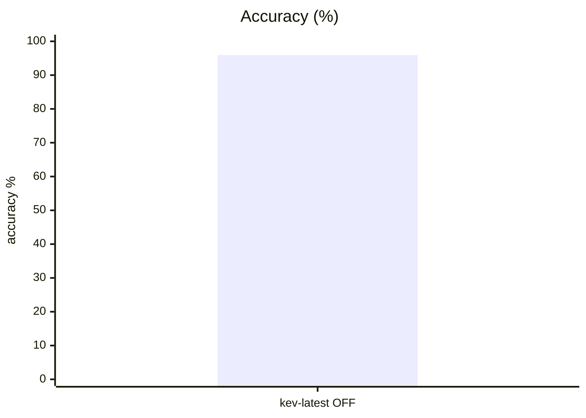
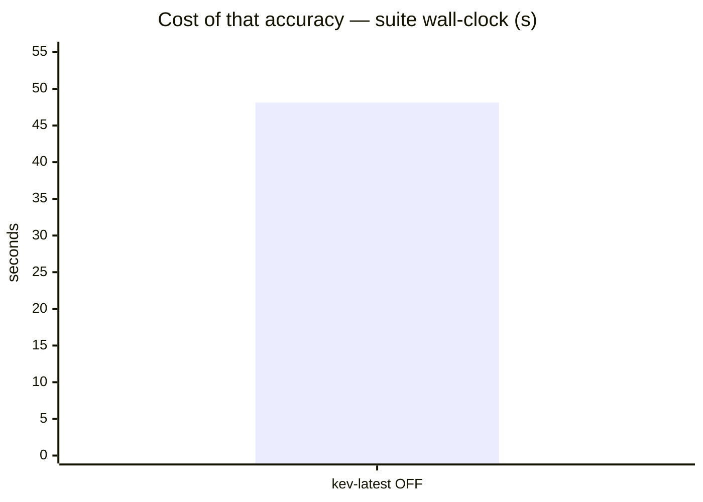
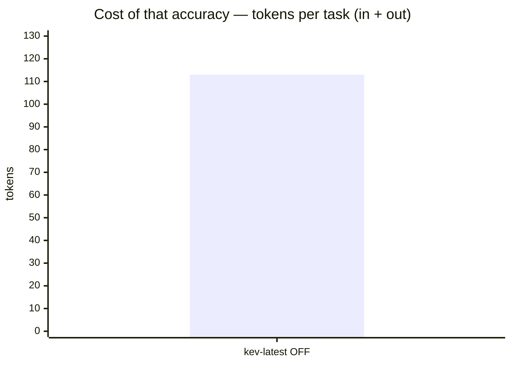
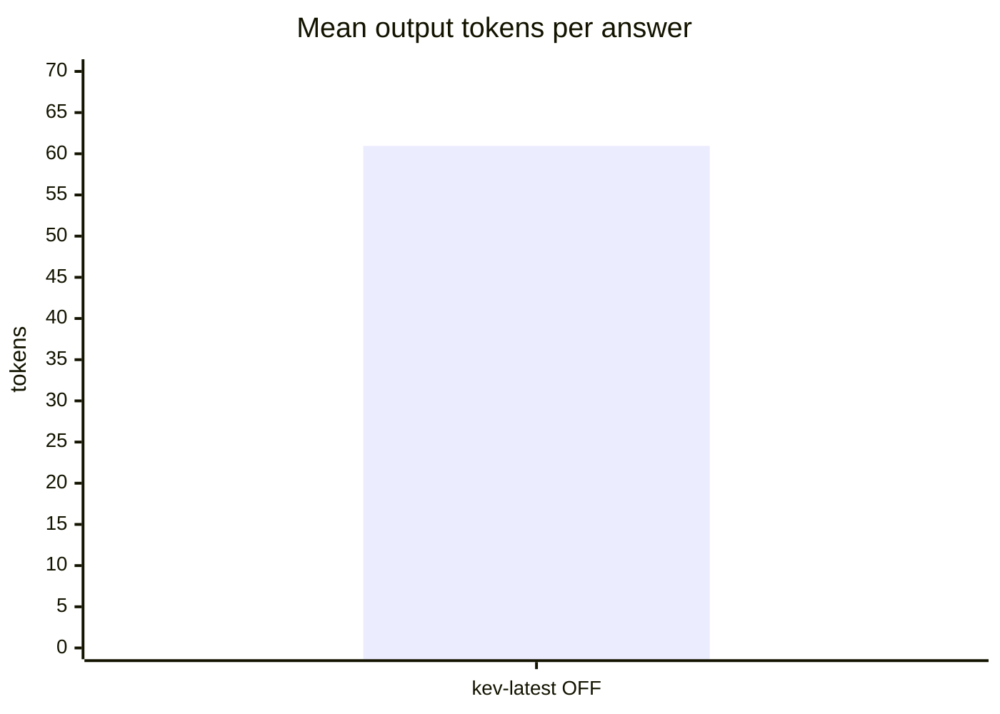

# System1 incumbent baseline — Mercury campaign incomplete

**Question.** Should OpenRouter Mercury Decide replace the current System One backend?

**Verdict.** Keep the incumbent for now: Mercury hit the OpenRouter daily free quota before completing system1; phishing was not started. No candidate aggregate score or statistical comparison is available. See REPORT.md for the incomplete campaign and recovery plan.

## Setup

| | |
|---|---|
| Endpoint | `http://localhost:8123` |
| Tasks | 49 |
| Samples per task | 2 (⇒ 98 generations per run) |
| Concurrency | 1 |
| Metric | accuracy over exact-match answers on typed decision questions, with a 95% Wilson interval |

## Headline

| Run | Accuracy (95% CI) | Tokens per task | Time per task |
|---|---|---|---|---|
| incumbent kev-latest s1 | 95.9 % (90–98) | 52 in / 61 out | 0.5 s |

The bracket is the 95% Wilson interval of the solve rate, in points. *Tokens* and *time* are the mean per task attempt (input and output tokens as the endpoint or harness reported them; wall-clock seconds).

## At a glance

| # | Run | Harness · thinking | Accuracy | Tokens / task | Time / task |
|---|---|---|---|---|---|
| 1 | incumbent kev-latest s1 | built-in loop · OFF | `█████████▋` 96 % (90–98) | `██████████` 113 | `██████████` 0 s |

Solve-rate bars run 0–100 %, bracket = 95% interval. Token and time bars are scaled to the costliest row — shorter is cheaper.

## Results

| Run | Accuracy | easy | medium | hard | Wall | Mean out tok | Truncated | tok/s |
|---|---|---|---|---|---|---|---|---|
| **incumbent kev-latest s1** | **95.9 %** | 95.5 % | 100.0 % | 88.9 % | 48 s | 61 | 0 | 178.6 |

## By difficulty

| Run | easy | medium | hard |
|---|---|---|---|
| incumbent kev-latest s1 | `███████▋` 95 % | `████████` 100 % | `███████▏` 89 % |

## Task by task

| Task | kev-latest OFF |
|---|---|
| `bag_allowance/q1` | 🟩 100 |
| `bag_allowance/q2` | 🟩 100 |
| `borderline_comment/q1` | 🟩 100 |
| `borderline_comment/q2` | 🟩 100 |
| `budget_veto/q1` | 🟩 100 |
| `budget_veto/q2` | 🟩 100 |
| `cafe_hours/q1` | 🟩 100 |
| `cafe_hours/q2` | 🟩 100 |
| `cafe_hours/q3` | 🟩 100 |
| `capital_japan/q1` | 🟩 100 |
| `capital_japan/q2` | 🟩 100 |
| `chat_resolved/q1` | 🟩 100 |
| `chat_resolved/q2` | 🟩 100 |
| `device_policy/q1` | 🟩 100 |
| `device_policy/q2` | 🟩 100 |
| `error_log/q1` | 🟥 0 |
| `error_log/q2` | 🟩 100 |
| `error_log/q3` | 🟩 100 |
| `fruit_basket/q1` | 🟩 100 |
| `fruit_basket/q2` | 🟩 100 |
| `glowing_review/q1` | 🟩 100 |
| `glowing_review/q2` | 🟩 100 |
| `golden_retriever/q1` | 🟩 100 |
| `golden_retriever/q2` | 🟩 100 |
| `harsh_review/q1` | 🟩 100 |
| `harsh_review/q2` | 🟩 100 |
| `height_order/q1` | 🟩 100 |
| `height_order/q2` | 🟩 100 |
| `json_order/q1` | 🟩 100 |
| `json_order/q2` | 🟩 100 |
| `language_french/q1` | 🟩 100 |
| `language_french/q2` | 🟩 100 |
| `museum_hours/q1` | 🟩 100 |
| `museum_hours/q2` | 🟩 100 |
| `product_spec/q1` | 🟩 100 |
| `product_spec/q2` | 🟩 100 |
| `ref_code/q1` | 🟩 100 |
| `ref_code/q2` | 🟩 100 |
| `refund_eligible/q1` | 🟩 100 |
| `refund_eligible/q2` | 🟩 100 |
| `sale_item_refund/q1` | 🟩 100 |
| `sale_item_refund/q2` | 🟩 100 |
| `sale_item_refund/q3` | 🟩 100 |
| `spam_email/q1` | 🟩 100 |
| `spam_email/q2` | 🟥 0 |
| `threat_comment/q1` | 🟩 100 |
| `threat_comment/q2` | 🟩 100 |
| `ticket_billing/q1` | 🟩 100 |
| `ticket_billing/q2` | 🟩 100 |

## Cost per task

Mean per attempt: input / output tokens, then wall-clock seconds. *not reported* = no usage reported for that task; *–* = the run has no cost record for it.

| Task | incumbent kev-latest s1 |
|---|---|
| `bag_allowance/q1` | 43 / 52 · 0.5 s |
| `bag_allowance/q2` | 47 / 51 · 0.5 s |
| `borderline_comment/q1` | 36 / 52 · 0.5 s |
| `borderline_comment/q2` | 35 / 52 · 0.5 s |
| `budget_veto/q1` | 40 / 52 · 0.6 s |
| `budget_veto/q2` | 41 / 52 · 0.5 s |
| `cafe_hours/q1` | 55 / 52 · 0.6 s |
| `cafe_hours/q2` | 57 / 52 · 0.3 s |
| `cafe_hours/q3` | 62 / 52 · 0.6 s |
| `capital_japan/q1` | 35 / 79 · 0.3 s |
| `capital_japan/q2` | 35 / 75 · 0.5 s |
| `chat_resolved/q1` | 67 / 80 · 0.6 s |
| `chat_resolved/q2` | 57 / 48 · 0.6 s |
| `device_policy/q1` | 44 / 52 · 0.5 s |
| `device_policy/q2` | 45 / 52 · 0.5 s |
| `error_log/q1` | 58 / 64 · 0.5 s |
| `error_log/q2` | 57 / 63 · 0.5 s |
| `error_log/q3` | 55 / 52 · 0.5 s |
| `fruit_basket/q1` | 36 / 74 · 0.5 s |
| `fruit_basket/q2` | 37 / 74 · 0.5 s |
| `glowing_review/q1` | 40 / 63 · 0.3 s |
| `glowing_review/q2` | 39 / 52 · 0.5 s |
| `golden_retriever/q1` | 36 / 74 · 0.5 s |
| `golden_retriever/q2` | 29 / 52 · 0.2 s |
| `harsh_review/q1` | 58 / 85 · 0.5 s |
| `harsh_review/q2` | 39 / 52 · 0.3 s |
| `height_order/q1` | 29 / 62 · 0.5 s |
| `height_order/q2` | 29 / 62 · 0.5 s |
| `json_order/q1` | 62 / 77 · 0.5 s |
| `json_order/q2` | 65 / 74 · 0.6 s |
| `language_french/q1` | 38 / 74 · 0.5 s |
| `language_french/q2` | 31 / 52 · 0.6 s |
| `museum_hours/q1` | 46 / 50 · 0.6 s |
| `museum_hours/q2` | 53 / 52 · 0.4 s |
| `product_spec/q1` | 40 / 52 · 0.5 s |
| `product_spec/q2` | 39 / 52 · 0.5 s |
| `ref_code/q1` | 71 / 115 · 0.5 s |
| `ref_code/q2` | 74 / 99 · 0.3 s |
| `refund_eligible/q1` | 69 / 49 · 0.5 s |
| `refund_eligible/q2` | 72 / 74 · 0.6 s |
| `sale_item_refund/q1` | 101 / 52 · 0.6 s |
| `sale_item_refund/q2` | 101 / 52 · 0.3 s |
| `sale_item_refund/q3` | 101 / 52 · 0.5 s |
| `spam_email/q1` | 83 / 52 · 0.7 s |
| `spam_email/q2` | 84 / 50 · 0.5 s |
| `threat_comment/q1` | 34 / 52 · 0.7 s |
| `threat_comment/q2` | 35 / 48 · 0.2 s |
| `ticket_billing/q1` | 57 / 75 · 0.6 s |
| `ticket_billing/q2` | 54 / 52 · 0.5 s |

## Caveats

- 2 samples per task. Every solve rate carries a 95% Wilson interval over the generations behind it, and a margin between two runs is only a result when the 95% Newcombe interval of the difference excludes zero. The intervals treat each generation as independent; samples of one task are correlated, so with few tasks the true uncertainty is if anything wider. Raise `--samples` before calling a close race.
- Single-turn decision questions over a state, scored by exact match against each question's answer key. Code generation and multi-turn tool use are not exercised here.
- Verbose, reasoned or empty replies count as failures — deliberating instead of deciding is the failure mode this suite measures.
- A truncated generation counts as a failure; a high `Truncated` column means runaway reasoning, which hangs real agents.

## Raw data

- `incumbent-s1.json` — incumbent kev-latest s1
