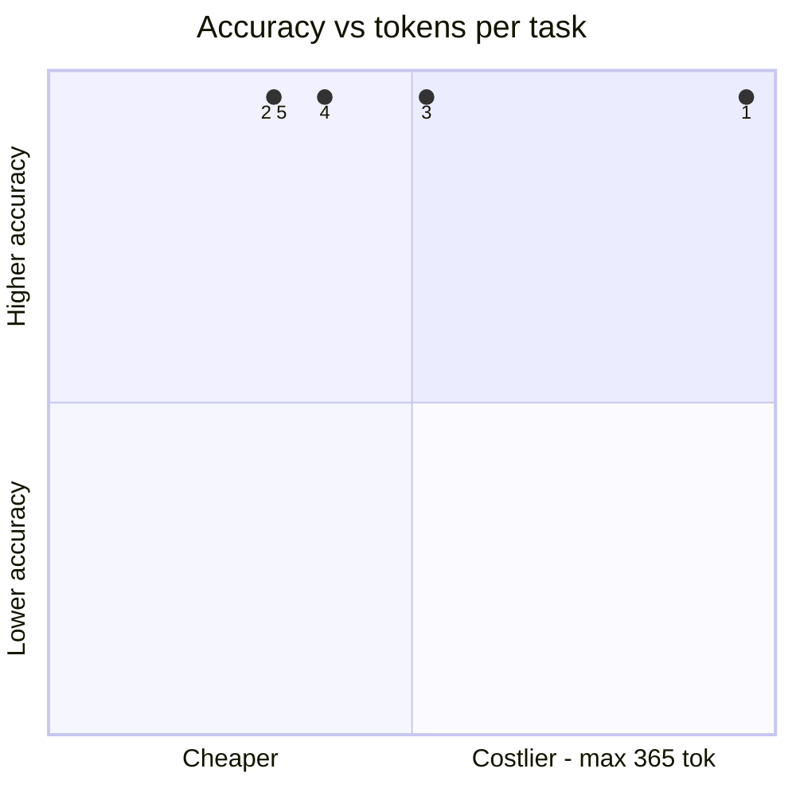
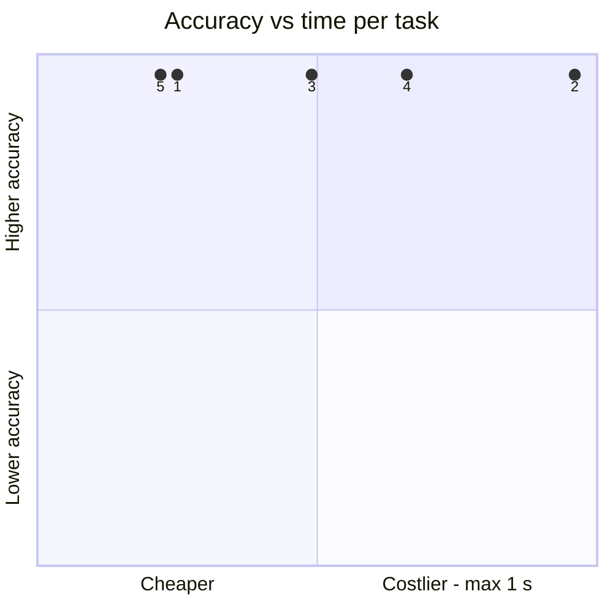
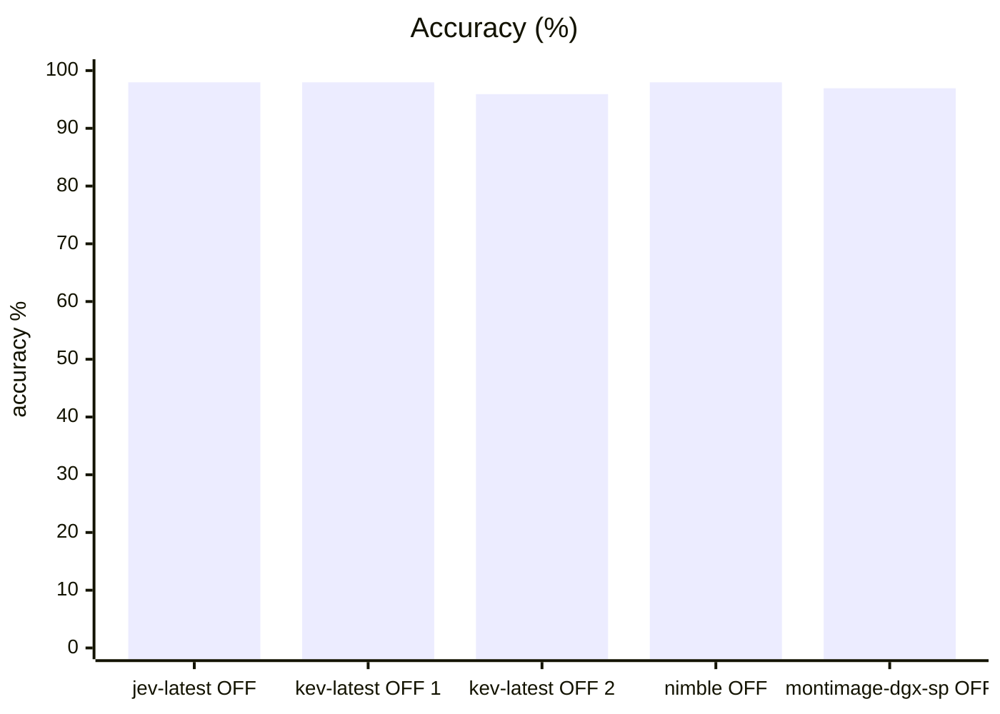
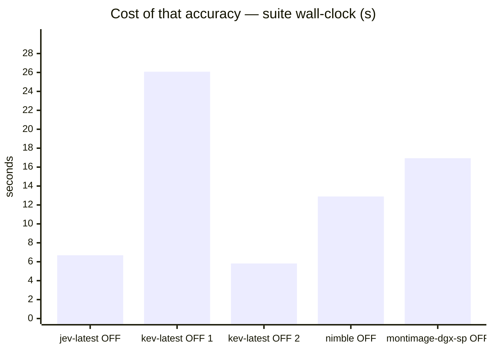
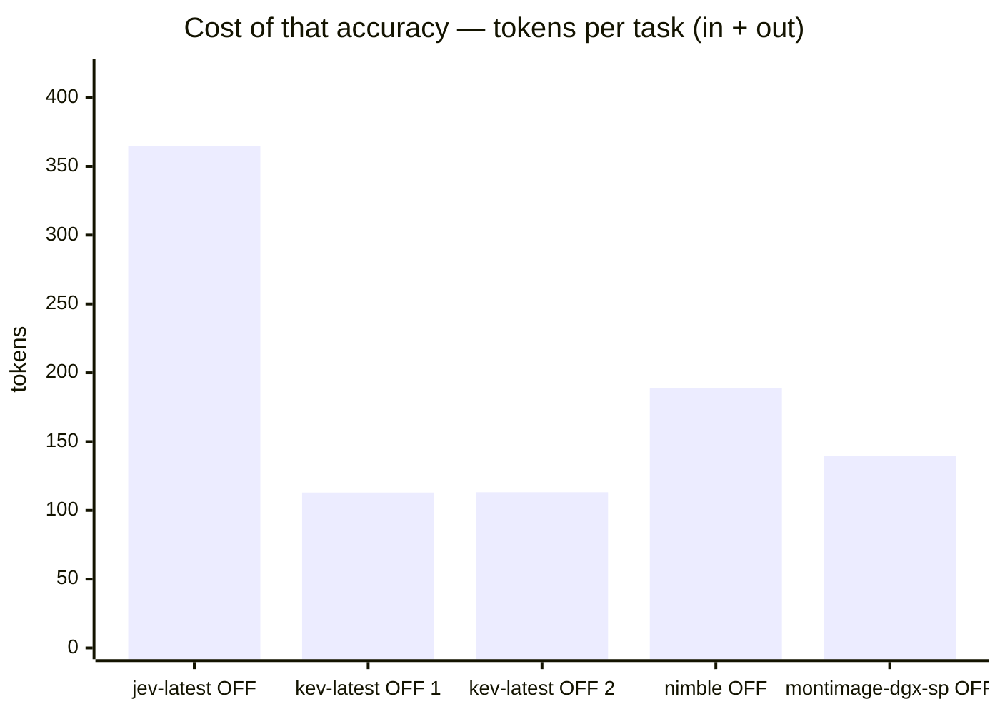
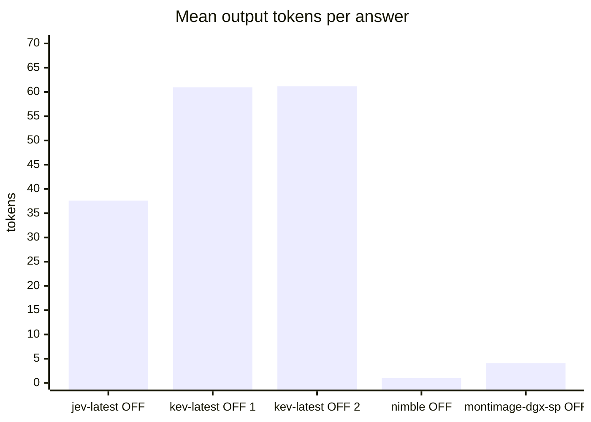

# Kev-27B vs Jev baseline on system1

**Question.** Should Kev-27B replace Jev behind the s1 endpoint?

**Verdict.** Exact tie with Jev on this suite (98.0% vs 98.0%, n=98) and now the strongest local s1 backend measured — its only miss is error_log/q1, the same abstention question that accounts for all of Jev's failures. It beats Kev-4B by 2.1pp (fixing spam_email/q2) at ~4.8x the latency (1.1s vs 0.23s/q). Hard constraint: at 62.9 GiB it cannot coexist with the incumbent vLLM endpoint (67.6 GiB) on this ~120 GiB box — benchmarking it required stopping the shared service. A valid Jev replacement only on a dedicated host; for the shared machine, Kev-4B (15 GiB, 95.9%) is the variant that fits alongside everything.

## Setup

| | |
|---|---|
| Endpoint | mixed — `http://localhost:8123` (jev-latest OFF), `http://localhost:8123` (kev-latest OFF 1), `http://localhost:8123` (kev-latest OFF 2), `http://localhost:8123` (nimble OFF), `http://localhost:8001` (montimage-dgx-sp OFF) |
| Tasks | 49 |
| Samples per task | 2 (⇒ 98 generations per run) |
| Concurrency | 4 |
| Metric | accuracy over exact-match answers on typed decision questions, with a 95% Wilson interval |

## Headline

| Run | Accuracy (95% CI) | Tokens per task | Time per task |
|---|---|---|---|---|
| typesafe jev-1.13 s1 | 98.0 % (93–99) | 327 in / 38 out | 0.3 s |
| kev-27b-s1 | 98.0 % (93–99) | 52 in / 61 out | 1.1 s |
| kev-4b s1 | 95.9 % (90–98) | 52 in / 61 out | 0.2 s |
| bespoke-nimble-9b ollama s1 | 98.0 % (93–99) | 188 in / 1 out | 0.5 s |
| incumbent-qwen3.6-s1-off | 96.9 % (91–99) | 135 in / 4 out | 0.7 s |

The bracket is the 95% Wilson interval of the solve rate, in points. *Tokens* and *time* are the mean per task attempt (input and output tokens as the endpoint or harness reported them; wall-clock seconds).

## At a glance

| # | Run | Harness · thinking | Accuracy | Tokens / task | Time / task |
|---|---|---|---|---|---|
| 1 | typesafe jev-1.13 s1 | built-in loop · OFF | `█████████▊` 98 % (93–99) | `██████████` 365 | `██▌░░░░░░░` 0 s |
| 2 | kev-27b-s1 | built-in loop · OFF | `█████████▊` 98 % (93–99) | `███▏░░░░░░` 113 | `██████████` 1 s |
| 3 | bespoke-nimble-9b ollama s1 | built-in loop · OFF | `█████████▊` 98 % (93–99) | `█████▏░░░░` 189 | `████▉░░░░░` 1 s |
| 4 | incumbent-qwen3.6-s1-off | built-in loop · OFF | `█████████▊` 97 % (91–99) | `███▉░░░░░░` 139 | `██████▌░░░` 1 s |
| 5 | kev-4b s1 | built-in loop · OFF | `█████████▋` 96 % (90–98) | `███▏░░░░░░` 113 | `██▎░░░░░░░` 0 s |

Solve-rate bars run 0–100 %, bracket = 95% interval. Token and time bars are scaled to the costliest row — shorter is cheaper.

Points are the `#` column above. Up is better, left is cheaper: the top-left corner is the most solved for the least spent. Cost is scaled to the costliest run.

## Results

| Run | Accuracy | easy | medium | hard | Wall | Mean out tok | Truncated | tok/s |
|---|---|---|---|---|---|---|---|---|
| **typesafe jev-1.13 s1** | **98.0 %** | 100.0 % | 100.0 % | 88.9 % | 7 s | 38 | 0 | 150.8 |
| kev-27b-s1 | 98.0 % | 100.0 % | 100.0 % | 88.9 % | 26 s | 61 | 0 | 63.2 |
| kev-4b s1 | 95.9 % | 95.5 % | 100.0 % | 88.9 % | 6 s | 61 | 0 | 297.9 |
| bespoke-nimble-9b ollama s1 | 98.0 % | 100.0 % | 100.0 % | 88.9 % | 13 s | 1 | 0 | 2.0 |
| incumbent-qwen3.6-s1-off | 96.9 % | 97.7 % | 100.0 % | 88.9 % | 17 s | 4 | 0 | 8.8 |

## By difficulty

| Run | easy | medium | hard |
|---|---|---|---|
| typesafe jev-1.13 s1 | `████████` 100 % | `████████` 100 % | `███████▏` 89 % |
| kev-27b-s1 | `████████` 100 % | `████████` 100 % | `███████▏` 89 % |
| kev-4b s1 | `███████▋` 95 % | `████████` 100 % | `███████▏` 89 % |
| bespoke-nimble-9b ollama s1 | `████████` 100 % | `████████` 100 % | `███████▏` 89 % |
| incumbent-qwen3.6-s1-off | `███████▉` 98 % | `████████` 100 % | `███████▏` 89 % |

## Task by task

Per-task solve rate (%). Tasks the runs disagree on are listed first, widest gap on top.

| Task | jev-latest OFF | kev-latest OFF 1 | kev-latest OFF 2 | nimble OFF | montimage-dgx-sp OFF |
|---|---|---|---|---|---|
| `spam_email/q2` | 🟩 100 | 🟩 100 | 🟥 0 | 🟩 100 | 🟩 100 |
| `ref_code/q2` | 🟩 100 | 🟩 100 | 🟩 100 | 🟩 100 | 🟨 50 |

- 🟩 **every run solved** (46): `bag_allowance/q1`, `bag_allowance/q2`, `borderline_comment/q1`, `borderline_comment/q2`, `budget_veto/q1`, `budget_veto/q2`, `cafe_hours/q1`, `cafe_hours/q2`, `cafe_hours/q3`, `capital_japan/q1`, `capital_japan/q2`, `chat_resolved/q1`, `chat_resolved/q2`, `device_policy/q1`, `device_policy/q2`, `error_log/q2`, `error_log/q3`, `fruit_basket/q1`, `fruit_basket/q2`, `glowing_review/q1`, `glowing_review/q2`, `golden_retriever/q1`, `golden_retriever/q2`, `harsh_review/q1`, `harsh_review/q2`, `height_order/q1`, `height_order/q2`, `json_order/q1`, `json_order/q2`, `language_french/q1`, `language_french/q2`, `museum_hours/q1`, `museum_hours/q2`, `product_spec/q1`, `product_spec/q2`, `ref_code/q1`, `refund_eligible/q1`, `refund_eligible/q2`, `sale_item_refund/q1`, `sale_item_refund/q2`, `sale_item_refund/q3`, `spam_email/q1`, `threat_comment/q1`, `threat_comment/q2`, `ticket_billing/q1`, `ticket_billing/q2`
- 🟥 **every run failed** (1): `error_log/q1`

## Cost per task

Mean per attempt: input / output tokens, then wall-clock seconds. *not reported* = no usage reported for that task; *–* = the run has no cost record for it.

| Task | typesafe jev-1.13 s1 | kev-27b-s1 | kev-4b s1 | bespoke-nimble-9b ollama s1 | incumbent-qwen3.6-s1-off |
|---|---|---|---|---|---|
| `bag_allowance/q1` | 316 / 31 · 0.3 s | 43 / 52 · 1.5 s | 43 / 52 · 0.3 s | 171 / 1 · 0.5 s | 126 / 4 · 0.3 s |
| `bag_allowance/q2` | 320 / 31 · 0.2 s | 47 / 52 · 1.2 s | 47 / 52 · 0.3 s | 175 / 1 · 0.5 s | 130 / 4 · 0.4 s |
| `borderline_comment/q1` | 309 / 31 · 0.2 s | 36 / 52 · 1.0 s | 36 / 52 · 0.2 s | 164 / 1 · 0.6 s | 119 / 4 · 0.3 s |
| `borderline_comment/q2` | 308 / 31 · 0.3 s | 35 / 52 · 0.6 s | 35 / 52 · 0.1 s | 163 / 1 · 0.6 s | 118 / 4 · 0.3 s |
| `budget_veto/q1` | 313 / 31 · 0.5 s | 40 / 52 · 1.1 s | 40 / 52 · 0.2 s | 168 / 1 · 0.6 s | 123 / 4 · 0.4 s |
| `budget_veto/q2` | 314 / 31 · 0.3 s | 41 / 49 · 0.6 s | 41 / 52 · 0.2 s | 169 / 1 · 0.6 s | 124 / 4 · 0.3 s |
| `cafe_hours/q1` | 328 / 31 · 0.4 s | 55 / 52 · 1.1 s | 55 / 52 · 0.3 s | 183 / 1 · 0.5 s | 138 / 4 · 0.4 s |
| `cafe_hours/q2` | 330 / 31 · 0.2 s | 57 / 52 · 0.9 s | 57 / 52 · 0.3 s | 185 / 1 · 0.5 s | 140 / 4 · 0.5 s |
| `cafe_hours/q3` | 335 / 31 · 0.2 s | 62 / 52 · 1.0 s | 62 / 52 · 0.2 s | 190 / 1 · 0.5 s | 145 / 4 · 0.3 s |
| `capital_japan/q1` | 316 / 50 · 0.3 s | 35 / 79 · 1.0 s | 35 / 79 · 0.2 s | 184 / 1 · 0.5 s | 116 / 4 · 1.0 s |
| `capital_japan/q2` | 315 / 47 · 0.2 s | 35 / 76 · 1.0 s | 35 / 77 · 0.2 s | 183 / 1 · 0.5 s | 117 / 4 · 0.5 s |
| `chat_resolved/q1` | 345 / 51 · 0.3 s | 67 / 80 · 1.4 s | 67 / 80 · 0.3 s | 219 / 1 · 0.5 s | 151 / 4 · 0.4 s |
| `chat_resolved/q2` | 329 / 31 · 0.2 s | 57 / 52 · 1.8 s | 57 / 52 · 0.4 s | 186 / 1 · 0.5 s | 140 / 4 · 0.4 s |
| `device_policy/q1` | 317 / 31 · 0.2 s | 44 / 50 · 1.0 s | 44 / 52 · 0.2 s | 172 / 1 · 0.6 s | 127 / 4 · 0.5 s |
| `device_policy/q2` | 318 / 31 · 0.4 s | 45 / 52 · 1.0 s | 45 / 52 · 0.2 s | 173 / 1 · 0.5 s | 128 / 4 · 0.5 s |
| `error_log/q1` | 333 / 39 · 0.2 s | 58 / 64 · 1.0 s | 58 / 63 · 0.3 s | 196 / 1 · 0.5 s | 142 / 4 · 0.4 s |
| `error_log/q2` | 332 / 38 · 0.2 s | 57 / 63 · 1.4 s | 57 / 62 · 0.4 s | 194 / 1 · 0.5 s | 144 / 5 · 0.5 s |
| `error_log/q3` | 327 / 31 · 0.3 s | 55 / 52 · 1.2 s | 55 / 52 · 0.3 s | 183 / 1 · 0.5 s | 138 / 4 · 0.4 s |
| `fruit_basket/q1` | 315 / 45 · 0.2 s | 36 / 65 · 1.0 s | 36 / 74 · 0.2 s | 181 / 1 · 0.4 s | 125 / 5 · 0.9 s |
| `fruit_basket/q2` | 316 / 45 · 0.3 s | 37 / 74 · 1.0 s | 37 / 74 · 0.3 s | 182 / 1 · 0.4 s | 126 / 2 · 1.4 s |
| `glowing_review/q1` | 316 / 38 · 0.2 s | 40 / 63 · 1.0 s | 40 / 63 · 0.2 s | 177 / 1 · 0.5 s | 124 / 4 · 1.3 s |
| `glowing_review/q2` | 312 / 31 · 0.2 s | 39 / 52 · 1.0 s | 39 / 52 · 0.2 s | 167 / 1 · 0.5 s | 122 / 4 · 1.5 s |
| `golden_retriever/q1` | 316 / 45 · 0.2 s | 36 / 74 · 1.2 s | 36 / 74 · 0.3 s | 182 / 1 · 0.5 s | 121 / 3 · 0.5 s |
| `golden_retriever/q2` | 303 / 31 · 0.3 s | 29 / 50 · 0.9 s | 29 / 52 · 0.2 s | 157 / 1 · 0.5 s | 112 / 4 · 0.4 s |
| `harsh_review/q1` | 342 / 52 · 0.2 s | 58 / 85 · 0.9 s | 58 / 85 · 0.2 s | 213 / 1 · 0.6 s | 149 / 2 · 0.4 s |
| `harsh_review/q2` | 314 / 31 · 0.4 s | 39 / 52 · 0.9 s | 39 / 52 · 0.2 s | 167 / 1 · 0.6 s | 122 / 4 · 0.5 s |
| `height_order/q1` | 305 / 38 · 0.2 s | 29 / 63 · 0.7 s | 29 / 62 · 0.2 s | 165 / 1 · 0.5 s | 113 / 3 · 0.4 s |
| `height_order/q2` | 305 / 38 · 0.2 s | 29 / 63 · 1.0 s | 29 / 62 · 0.1 s | 165 / 1 · 0.5 s | 113 / 3 · 0.4 s |
| `json_order/q1` | 342 / 50 · 0.2 s | 62 / 76 · 1.1 s | 62 / 77 · 0.2 s | 212 / 1 · 0.6 s | 145 / 4 · 0.5 s |
| `json_order/q2` | 343 / 45 · 0.2 s | 65 / 73 · 1.1 s | 65 / 74 · 0.2 s | 213 / 1 · 0.6 s | 154 / 2 · 0.4 s |
| `language_french/q1` | 317 / 45 · 0.2 s | 38 / 74 · 1.0 s | 38 / 74 · 0.2 s | 184 / 1 · 0.5 s | 123 / 4 · 0.5 s |
| `language_french/q2` | 304 / 31 · 0.3 s | 31 / 52 · 1.0 s | 31 / 52 · 0.2 s | 159 / 1 · 0.5 s | 114 / 4 · 0.5 s |
| `museum_hours/q1` | 319 / 31 · 0.3 s | 46 / 52 · 1.0 s | 46 / 51 · 0.2 s | 174 / 1 · 0.5 s | 129 / 4 · 0.5 s |
| `museum_hours/q2` | 326 / 31 · 0.2 s | 53 / 52 · 1.0 s | 53 / 52 · 0.2 s | 181 / 1 · 0.5 s | 136 / 4 · 0.5 s |
| `product_spec/q1` | 315 / 31 · 0.2 s | 40 / 52 · 1.3 s | 40 / 52 · 0.3 s | 168 / 1 · 0.5 s | 123 / 4 · 0.3 s |
| `product_spec/q2` | 314 / 31 · 0.2 s | 39 / 52 · 1.6 s | 39 / 52 · 0.4 s | 167 / 1 · 0.5 s | 122 / 4 · 0.5 s |
| `ref_code/q1` | 355 / 80 · 0.2 s | 71 / 117 · 1.3 s | 71 / 115 · 0.3 s | 250 / 1 · 0.5 s | 118 / 8 · 0.5 s |
| `ref_code/q2` | 349 / 74 · 0.2 s | 74 / 99 · 1.1 s | 74 / 99 · 0.2 s | 238 / 1 · 0.5 s | 161 / 16 · 0.8 s |
| `refund_eligible/q1` | 342 / 31 · 0.2 s | 69 / 52 · 1.1 s | 69 / 49 · 0.2 s | 198 / 1 · 0.5 s | 152 / 4 · 0.4 s |
| `refund_eligible/q2` | 351 / 46 · 0.3 s | 72 / 73 · 1.1 s | 72 / 74 · 0.2 s | 220 / 1 · 0.6 s | 157 / 2 · 0.4 s |
| `sale_item_refund/q1` | 373 / 31 · 0.3 s | 101 / 52 · 0.9 s | 101 / 52 · 0.3 s | 230 / 1 · 0.7 s | 184 / 4 · 0.4 s |
| `sale_item_refund/q2` | 373 / 31 · 0.2 s | 101 / 52 · 0.7 s | 101 / 50 · 0.2 s | 230 / 1 · 0.7 s | 184 / 4 · 0.4 s |
| `sale_item_refund/q3` | 373 / 31 · 0.3 s | 101 / 52 · 0.7 s | 101 / 52 · 0.1 s | 230 / 1 · 0.5 s | 184 / 4 · 0.4 s |
| `spam_email/q1` | 357 / 31 · 0.4 s | 83 / 52 · 1.3 s | 83 / 52 · 0.3 s | 211 / 1 · 0.5 s | 166 / 4 · 4.9 s |
| `spam_email/q2` | 358 / 31 · 0.4 s | 84 / 52 · 1.1 s | 84 / 52 · 0.4 s | 212 / 1 · 0.5 s | 167 / 4 · 5.0 s |
| `threat_comment/q1` | 307 / 31 · 0.2 s | 34 / 51 · 1.0 s | 34 / 52 · 0.2 s | 162 / 1 · 0.5 s | 117 / 4 · 0.4 s |
| `threat_comment/q2` | 308 / 31 · 0.2 s | 35 / 52 · 1.0 s | 35 / 52 · 0.2 s | 163 / 1 · 0.5 s | 118 / 4 · 0.4 s |
| `ticket_billing/q1` | 335 / 46 · 0.2 s | 57 / 75 · 1.1 s | 57 / 75 · 0.2 s | 204 / 1 · 0.4 s | 142 / 3 · 0.5 s |
| `ticket_billing/q2` | 326 / 31 · 0.2 s | 54 / 52 · 1.1 s | 54 / 52 · 0.2 s | 182 / 1 · 0.4 s | 137 / 4 · 0.4 s |

## Reading the numbers

## Method notes — Kev-27B on system1 (issue #104 follow-up)

Kev-27B (`jaredpalmer/kev-27b`, github.com/jaredpalmer/kev) was measured
through the **same transport** as every s1 candidate: the standard gateway
(`configs/s1_gateway.py`) on `http://localhost:8123/v1` with
`S1_BACKEND=kev`, which reuses `ask_systemone` verbatim against
`KEV_BASE_URL=http://localhost:8009/v1`, `KEV_MODEL=kev-latest`. Same suite,
same protocol as the Kev-4B run: `--suite system1 --samples 2`.

### Serving

- `uv run python -m kev.serve --run jaredpalmer/kev-27b --port 8009` in the
  same clone (`~/workspace/luongnv89/kev`), same `torch==2.8.0+cu129` venv —
  PTX JIT fallback on the sm_121 GB10, bf16, CUDA.
- No quantized kev-27b artifact exists on the Hub: full bf16 weights,
  ~51 GB over 11 safetensors shards, 62.9 GiB measured on the GPU
  (weights + context + prefix cache).
- **It does not coexist with the incumbent.** With vLLM (67.6 GiB) and the
  mon-image app (21.9 GiB) resident, only ~5.6 GiB was free. The benchmark
  required stopping `vllm-qwen.service` and Kev-4B first (human-approved),
  leaving ~90 GiB free; the mon-image app was left running throughout.
  vLLM was restored after the run.

### Measurement

- `./bench run --suite system1 --samples 2` → 98 generations, concurrency 4.
- Result: **98.0 %** (95 % CI 92.9–99.4), 1.1 s/question — an exact tie with
  Jev (98.0 %, CI 92.9–99.4) and Nimble-9B (98.0 %), and 2.1 pp above Kev-4B
  (95.9 %).
- Failed generations (2/98): `error_log/q1` twice (answered `no`, expected
  `cannot determine`) — the same epistemic-abstention question that accounts
  for **all** of Jev's and Kev-4B's failures. Kev-27B fixed `spam_email/q2`,
  Kev-4B's only other miss, so its failure set is now identical to Jev's.
- Latency is ~4.8× Kev-4B's (1.1 s vs 0.23 s per question) and ~4× Jev's
  hosted-WAN 0.27 s — the price of 6.75× the weights on the same GPU, still
  under 2 s/question. Usage accounting caveat from the Kev-4B run applies
  unchanged (~52 in / 61 out vs Jev's rendered-prompt numbers).

### Context vs other candidates

On accuracy evidence Kev-27B joins Jev and Nimble-9B at the top of the
suite; on this corpus it is the strongest *local* s1 backend measured. But
it cannot run next to the incumbent on this machine — 62.9 GiB + 67.6 GiB
vLLM + 21.9 GiB mon-image exceeds the ~120 GiB unified pool — so it is a
candidate only on a host where the shared endpoint is down or moved, or for
a dedicated-typed-decisions deployment. Kev-4B remains the only variant
that fits **alongside** everything (15 GiB).

## Caveats

- 2 samples per task. Every solve rate carries a 95% Wilson interval over the generations behind it, and a margin between two runs is only a result when the 95% Newcombe interval of the difference excludes zero. The intervals treat each generation as independent; samples of one task are correlated, so with few tasks the true uncertainty is if anything wider. Raise `--samples` before calling a close race.
- Single-turn decision questions over a state, scored by exact match against each question's answer key. Code generation and multi-turn tool use are not exercised here.
- Verbose, reasoned or empty replies count as failures — deliberating instead of deciding is the failure mode this suite measures.
- A truncated generation counts as a failure; a high `Truncated` column means runaway reasoning, which hangs real agents.

## Raw data

- `typesafe-jev-1-13-s1.json` — typesafe jev-1.13 s1
- `kev-27b-s1.json` — kev-27b-s1
- `kev-4b-s1.json` — kev-4b s1
- `bespoke-nimble-9b-ollama-s1.json` — bespoke-nimble-9b ollama s1
- `incumbent-qwen3-6-s1-off.json` — incumbent-qwen3.6-s1-off
