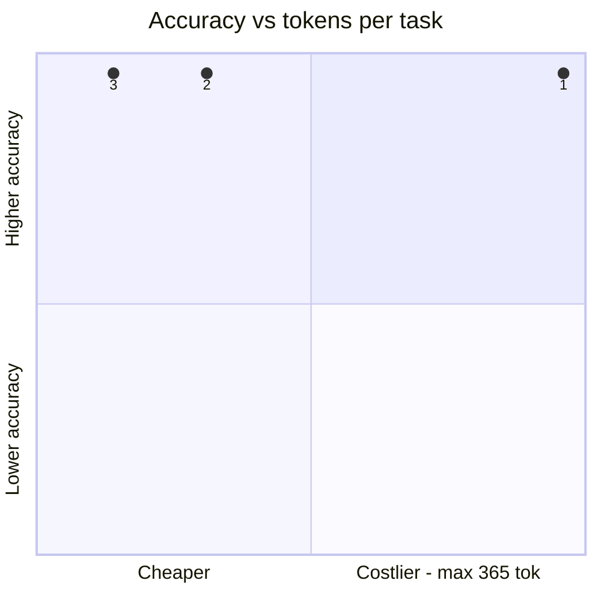
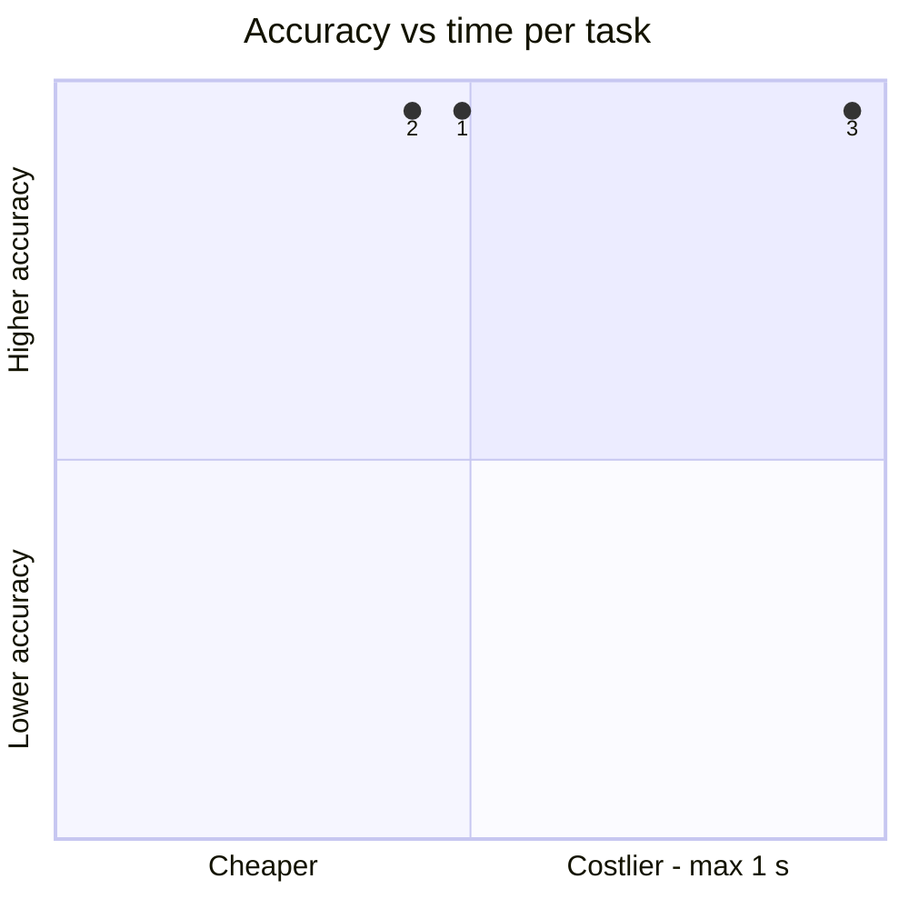
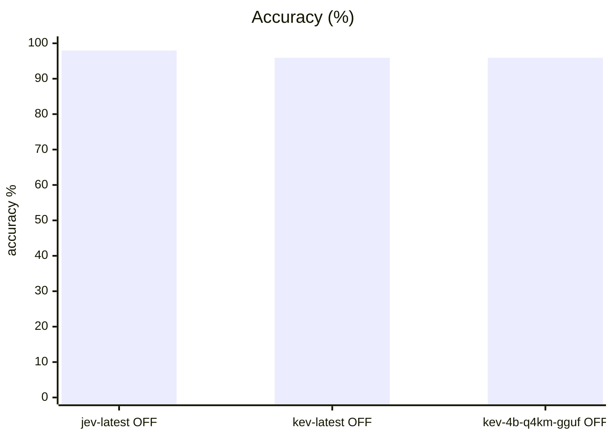
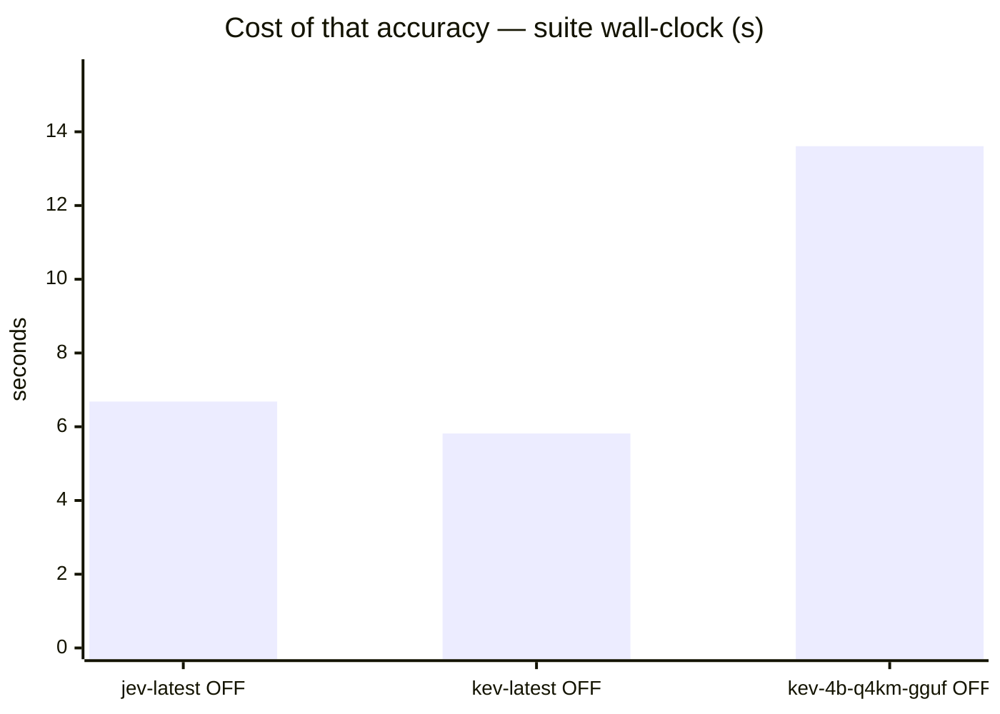
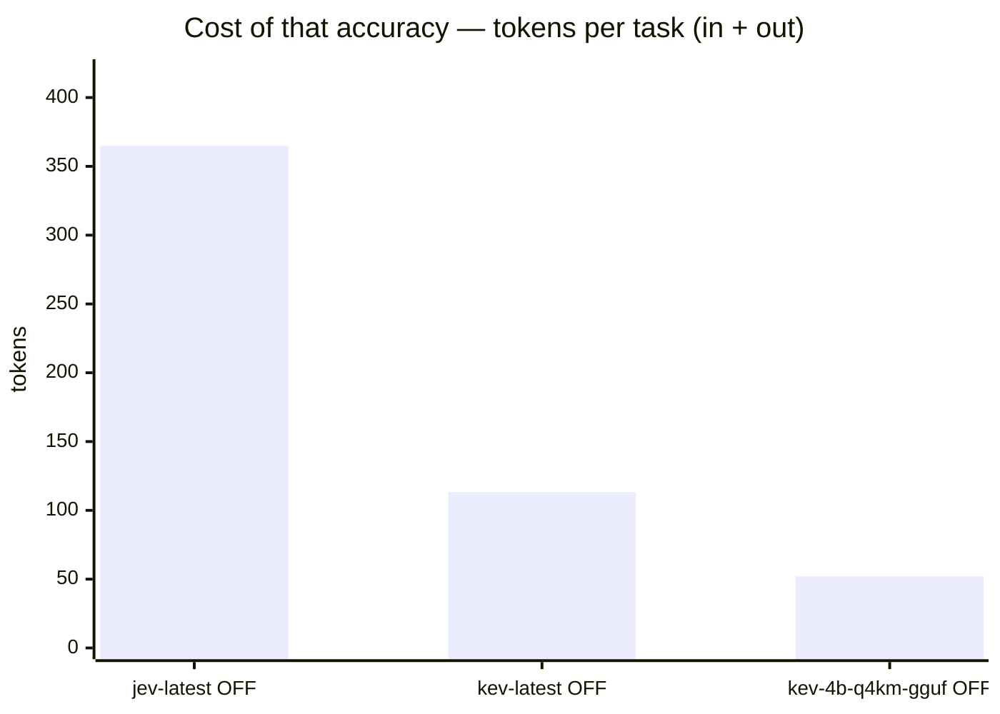
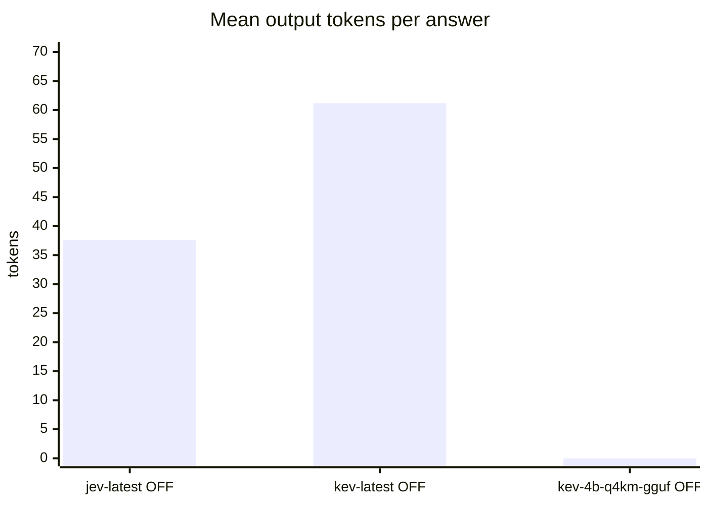

# Kev-4B Q4_K_M on llama.cpp /v1/systemone vs Jev baseline

**Question.** Does Kev-4B served by llama.cpp match the kev.serve path and the Jev baseline on system1?

**Verdict.** Keep Jev as the shared s1 default. Kev-4B via llama.cpp scores 95.9% — byte-for-byte identical miss profile to the bf16 kev.serve run (spam_email/q2 + error_log/q1 x2) and statistically at-par with Jev's 98.0% (margin inside noise at n=98). The llama.cpp path is a valid, much smaller local serving option (~3 GiB vs ~15 GiB), but it does not beat the baseline, and this suite is saturating — a harder decision set is needed to separate candidates.

## Setup

| | |
|---|---|
| Endpoint | `http://localhost:8123` |
| Tasks | 49 |
| Samples per task | 2 (⇒ 98 generations per run) |
| Concurrency | 4 |
| Metric | accuracy over exact-match answers on typed decision questions, with a 95% Wilson interval |

## Headline

| Run | Accuracy (95% CI) | Tokens per task | Time per task |
|---|---|---|---|---|
| typesafe jev-1.13 s1 | 98.0 % (93–99) | 327 in / 38 out | 0.3 s |
| kev-4b s1 | 95.9 % (90–98) | 52 in / 61 out | 0.2 s |
| kev-4b-llamacpp-q4km s1 | 95.9 % (90–98) | 52 in / 0 out | 0.6 s |

<sub>The bracket is the 95% Wilson interval of the solve rate, in points. *Tokens* and *time* are the mean per task attempt (input and output tokens as the endpoint or harness reported them; wall-clock seconds).</sub>

## At a glance

| # | Run | Harness · thinking | Accuracy | Tokens / task | Time / task |
|---|---|---|---|---|---|
| 1 | typesafe jev-1.13 s1 | built-in loop · OFF | `█████████▊` 98 % <sub>(93–99)</sub> | `██████████` 365 | `████▉░░░░░` 0 s |
| 2 | kev-4b s1 | built-in loop · OFF | `█████████▋` 96 % <sub>(90–98)</sub> | `███▏░░░░░░` 113 | `████▎░░░░░` 0 s |
| 3 | kev-4b-llamacpp-q4km s1 | built-in loop · OFF | `█████████▋` 96 % <sub>(90–98)</sub> | `█▍░░░░░░░░` 52 | `██████████` 1 s |

<sub>Solve-rate bars run 0–100 %, bracket = 95% interval. Token and time bars are scaled to the costliest row — shorter is cheaper.</sub>





<sub>Points are the `#` column above. Up is better, left is cheaper: the top-left corner is the most solved for the least spent. Cost is scaled to the costliest run.</sub>

## Results

| Run | Accuracy | easy | medium | hard | Wall | Mean out tok | Truncated | tok/s |
|---|---|---|---|---|---|---|---|---|
| **typesafe jev-1.13 s1** | **98.0 %** | 100.0 % | 100.0 % | 88.9 % | 7 s | 38 | 0 | 150.8 |
| kev-4b s1 | 95.9 % | 95.5 % | 100.0 % | 88.9 % | 6 s | 61 | 0 | 297.9 |
| kev-4b-llamacpp-q4km s1 | 95.9 % | 95.5 % | 100.0 % | 88.9 % | 14 s | — | 0 | — |









## By difficulty

| Run | easy | medium | hard |
|---|---|---|---|
| typesafe jev-1.13 s1 | `████████` 100 % | `████████` 100 % | `███████▏` 89 % |
| kev-4b s1 | `███████▋` 95 % | `████████` 100 % | `███████▏` 89 % |
| kev-4b-llamacpp-q4km s1 | `███████▋` 95 % | `████████` 100 % | `███████▏` 89 % |

## Task by task

<sub>Per-task solve rate (%). Tasks the runs disagree on are listed first, widest gap on top.</sub>

| Task | jev-latest OFF | kev-latest OFF | kev-4b-q4km-gguf OFF |
|---|---|---|---|
| `spam_email/q2` | 🟩 100 | 🟥 0 | 🟥 0 |

- 🟩 **every run solved** (47): `bag_allowance/q1`, `bag_allowance/q2`, `borderline_comment/q1`, `borderline_comment/q2`, `budget_veto/q1`, `budget_veto/q2`, `cafe_hours/q1`, `cafe_hours/q2`, `cafe_hours/q3`, `capital_japan/q1`, `capital_japan/q2`, `chat_resolved/q1`, `chat_resolved/q2`, `device_policy/q1`, `device_policy/q2`, `error_log/q2`, `error_log/q3`, `fruit_basket/q1`, `fruit_basket/q2`, `glowing_review/q1`, `glowing_review/q2`, `golden_retriever/q1`, `golden_retriever/q2`, `harsh_review/q1`, `harsh_review/q2`, `height_order/q1`, `height_order/q2`, `json_order/q1`, `json_order/q2`, `language_french/q1`, `language_french/q2`, `museum_hours/q1`, `museum_hours/q2`, `product_spec/q1`, `product_spec/q2`, `ref_code/q1`, `ref_code/q2`, `refund_eligible/q1`, `refund_eligible/q2`, `sale_item_refund/q1`, `sale_item_refund/q2`, `sale_item_refund/q3`, `spam_email/q1`, `threat_comment/q1`, `threat_comment/q2`, `ticket_billing/q1`, `ticket_billing/q2`
- 🟥 **every run failed** (1): `error_log/q1`

## Where they disagree — typesafe jev-1.13 s1 vs kev-4b s1

| Task | typesafe jev-1.13 s1 | kev-4b s1 | Winner |
|---|---|---|---|
| `spam_email/q2` | 100 % | 0 % | typesafe jev-1.13 s1 |

## Cost per task

<sub>Mean per attempt: input / output tokens, then wall-clock seconds. *not reported* = no usage reported for that task; *–* = the run has no cost record for it.</sub>

| Task | typesafe jev-1.13 s1 | kev-4b s1 | kev-4b-llamacpp-q4km s1 |
|---|---|---|---|
| `bag_allowance/q1` | 316 / 31 · 0.3 s | 43 / 52 · 0.3 s | 43 / 0 · 0.4 s |
| `bag_allowance/q2` | 320 / 31 · 0.2 s | 47 / 52 · 0.3 s | 47 / 0 · 0.5 s |
| `borderline_comment/q1` | 309 / 31 · 0.2 s | 36 / 52 · 0.2 s | 36 / 0 · 0.4 s |
| `borderline_comment/q2` | 308 / 31 · 0.3 s | 35 / 52 · 0.1 s | 35 / 0 · 0.2 s |
| `budget_veto/q1` | 313 / 31 · 0.5 s | 40 / 52 · 0.2 s | 40 / 0 · 0.5 s |
| `budget_veto/q2` | 314 / 31 · 0.3 s | 41 / 52 · 0.2 s | 41 / 0 · 0.5 s |
| `cafe_hours/q1` | 328 / 31 · 0.4 s | 55 / 52 · 0.3 s | 55 / 0 · 0.5 s |
| `cafe_hours/q2` | 330 / 31 · 0.2 s | 57 / 52 · 0.3 s | 57 / 0 · 0.5 s |
| `cafe_hours/q3` | 335 / 31 · 0.2 s | 62 / 52 · 0.2 s | 62 / 0 · 0.5 s |
| `capital_japan/q1` | 316 / 50 · 0.3 s | 35 / 79 · 0.2 s | 35 / 0 · 0.5 s |
| `capital_japan/q2` | 315 / 47 · 0.2 s | 35 / 77 · 0.2 s | 35 / 0 · 0.5 s |
| `chat_resolved/q1` | 345 / 51 · 0.3 s | 67 / 80 · 0.3 s | 67 / 0 · 0.6 s |
| `chat_resolved/q2` | 329 / 31 · 0.2 s | 57 / 52 · 0.4 s | 57 / 0 · 0.5 s |
| `device_policy/q1` | 317 / 31 · 0.2 s | 44 / 52 · 0.2 s | 44 / 0 · 0.5 s |
| `device_policy/q2` | 318 / 31 · 0.4 s | 45 / 52 · 0.2 s | 45 / 0 · 0.5 s |
| `error_log/q1` | 333 / 39 · 0.2 s | 58 / 63 · 0.3 s | 58 / 0 · 0.5 s |
| `error_log/q2` | 332 / 38 · 0.2 s | 57 / 62 · 0.4 s | 57 / 0 · 0.5 s |
| `error_log/q3` | 327 / 31 · 0.3 s | 55 / 52 · 0.3 s | 55 / 0 · 0.5 s |
| `fruit_basket/q1` | 315 / 45 · 0.2 s | 36 / 74 · 0.2 s | 36 / 0 · 0.5 s |
| `fruit_basket/q2` | 316 / 45 · 0.3 s | 37 / 74 · 0.3 s | 37 / 0 · 0.5 s |
| `glowing_review/q1` | 316 / 38 · 0.2 s | 40 / 63 · 0.2 s | 40 / 0 · 0.5 s |
| `glowing_review/q2` | 312 / 31 · 0.2 s | 39 / 52 · 0.2 s | 39 / 0 · 0.5 s |
| `golden_retriever/q1` | 316 / 45 · 0.2 s | 36 / 74 · 0.3 s | 36 / 0 · 0.4 s |
| `golden_retriever/q2` | 303 / 31 · 0.3 s | 29 / 52 · 0.2 s | 29 / 0 · 0.4 s |
| `harsh_review/q1` | 342 / 52 · 0.2 s | 58 / 85 · 0.2 s | 58 / 0 · 0.5 s |
| `harsh_review/q2` | 314 / 31 · 0.4 s | 39 / 52 · 0.2 s | 39 / 0 · 0.5 s |
| `height_order/q1` | 305 / 38 · 0.2 s | 29 / 62 · 0.2 s | 29 / 0 · 0.5 s |
| `height_order/q2` | 305 / 38 · 0.2 s | 29 / 62 · 0.1 s | 29 / 0 · 0.4 s |
| `json_order/q1` | 342 / 50 · 0.2 s | 62 / 77 · 0.2 s | 62 / 0 · 0.5 s |
| `json_order/q2` | 343 / 45 · 0.2 s | 65 / 74 · 0.2 s | 65 / 0 · 0.5 s |
| `language_french/q1` | 317 / 45 · 0.2 s | 38 / 74 · 0.2 s | 38 / 0 · 0.4 s |
| `language_french/q2` | 304 / 31 · 0.3 s | 31 / 52 · 0.2 s | 31 / 0 · 0.4 s |
| `museum_hours/q1` | 319 / 31 · 0.3 s | 46 / 51 · 0.2 s | 46 / 0 · 0.5 s |
| `museum_hours/q2` | 326 / 31 · 0.2 s | 53 / 52 · 0.2 s | 53 / 0 · 0.5 s |
| `product_spec/q1` | 315 / 31 · 0.2 s | 40 / 52 · 0.3 s | 40 / 0 · 0.5 s |
| `product_spec/q2` | 314 / 31 · 0.2 s | 39 / 52 · 0.4 s | 39 / 0 · 0.5 s |
| `ref_code/q1` | 355 / 80 · 0.2 s | 71 / 115 · 0.3 s | 71 / 0 · 0.6 s |
| `ref_code/q2` | 349 / 74 · 0.2 s | 74 / 99 · 0.2 s | 74 / 0 · 0.6 s |
| `refund_eligible/q1` | 342 / 31 · 0.2 s | 69 / 49 · 0.2 s | 69 / 0 · 0.8 s |
| `refund_eligible/q2` | 351 / 46 · 0.3 s | 72 / 74 · 0.2 s | 72 / 0 · 0.8 s |
| `sale_item_refund/q1` | 373 / 31 · 0.3 s | 101 / 52 · 0.3 s | 101 / 0 · 0.9 s |
| `sale_item_refund/q2` | 373 / 31 · 0.2 s | 101 / 50 · 0.2 s | 101 / 0 · 0.9 s |
| `sale_item_refund/q3` | 373 / 31 · 0.3 s | 101 / 52 · 0.1 s | 101 / 0 · 0.6 s |
| `spam_email/q1` | 357 / 31 · 0.4 s | 83 / 52 · 0.3 s | 83 / 0 · 1.7 s |
| `spam_email/q2` | 358 / 31 · 0.4 s | 84 / 52 · 0.4 s | 84 / 0 · 1.7 s |
| `threat_comment/q1` | 307 / 31 · 0.2 s | 34 / 52 · 0.2 s | 34 / 0 · 0.5 s |
| `threat_comment/q2` | 308 / 31 · 0.2 s | 35 / 52 · 0.2 s | 35 / 0 · 0.5 s |
| `ticket_billing/q1` | 335 / 46 · 0.2 s | 57 / 75 · 0.2 s | 57 / 0 · 0.6 s |
| `ticket_billing/q2` | 326 / 31 · 0.2 s | 54 / 52 · 0.2 s | 54 / 0 · 0.6 s |

## Reading the numbers

# Notes — Kev-4B GGUF via llama.cpp /v1/systemone

## Setup

Kev-4B was served as a Q4_K_M GGUF by llama.cpp's new native decision-model
endpoint (PR ggml-org/llama.cpp#29818, merged 2026-10-02):

```
bench system1 → :8123 s1_gateway (S1_BACKEND=kev) → llama-server :8080 /v1/systemone
```

The gateway parses each rendered s1 prompt into `(state, question, options)` and
posts one `choice` question to llama.cpp's `/v1/systemone` — the same adapter
path used for the earlier `kev.serve` bf16 measurement
(`results/2026-09-30/kev-4b-s1.json`). The only thing that changed is the serving
stack: PyTorch bf16 readout → llama.cpp Q4_K_M readout.

## llama.cpp build note

The GGUF is a *decision model* (`{arch}.decision.type` metadata, embedding
readout, no text generation). It cannot be loaded by llama.cpp builds that
predate the decision-model merge:

- brew `llama.cpp` 0.5.0 (b11146) and release b11351 both fail with
  `done_getting_tensors: wrong number of tensors; expected 428, got 426`.
- A source build of master (`bed0a85`) loads it and logs
  `init: decision model type: kev`. Server reports the model natively on
  `/v1/systemone` with calibrated per-option probabilities and a `confidence`
  field.
- Build wrinkle on master: `tools/ui` asset provisioning needs a real UI
  version. Fix used here: `HF_UI_VERSION=b11351 cmake -B build
  -DLLAMA_UI_GZIP=OFF` (prebuilt UI bundle exists for b11351; the gzip pass has
  a bug reading asset paths).

## Measurements

- Accuracy 95.9% (n=98, 2 samples/question), 0 truncated, 0 errored.
- ~0.6 s/question, 52 input tokens, 0 output tokens (prefill-only readout).
- Identical miss profile to the bf16 `kev.serve` run: `spam_email/q2` (both
  samples, answered "yes" on a no) and `error_log/q1` (both samples — the
  epistemic "cannot determine" case that Jev also misses).
- Memory footprint: ~3 GiB GGUF vs ~15 GiB bf16 for `kev.serve`.

## Caveats

- Q4_K_M vs bf16: quantization did not move the score on this suite (same 4/98
  misses, same questions), but the suite is saturating — a harder decision set
  could separate them.
- `output_tokens` is 0 by construction (pointer readout); token cost is not
  comparable to a generative backend.

## Caveats

- 2 samples per task. Every solve rate carries a 95% Wilson interval over the generations behind it, and a margin between two runs is only a result when the 95% Newcombe interval of the difference excludes zero. The intervals treat each generation as independent; samples of one task are correlated, so with few tasks the true uncertainty is if anything wider. Raise `--samples` before calling a close race.
- Single-turn decision questions over a state, scored by exact match against each question's answer key. Code generation and multi-turn tool use are not exercised here.
- Verbose, reasoned or empty replies count as failures — deliberating instead of deciding is the failure mode this suite measures.
- A truncated generation counts as a failure; a high `Truncated` column means runaway reasoning, which hangs real agents.

## Raw data

- `typesafe-jev-1-13-s1.json` — typesafe jev-1.13 s1
- `kev-4b-s1.json` — kev-4b s1
- `kev-4b-llamacpp-q4km-s1.json` — kev-4b-llamacpp-q4km s1
