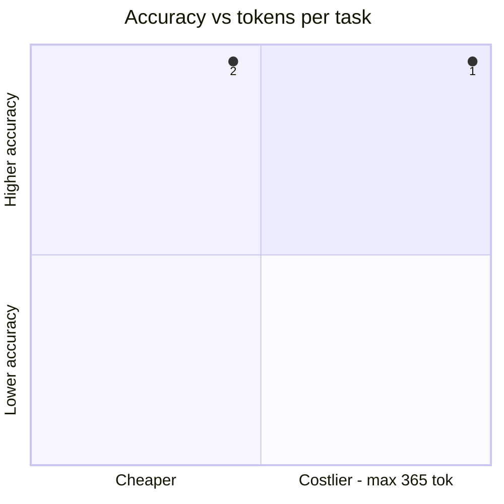
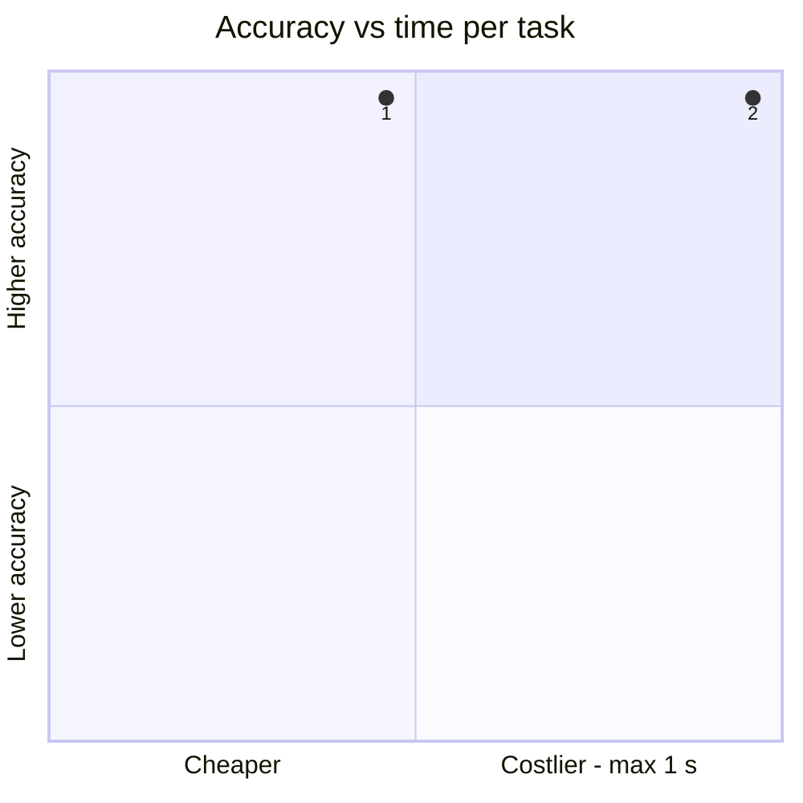
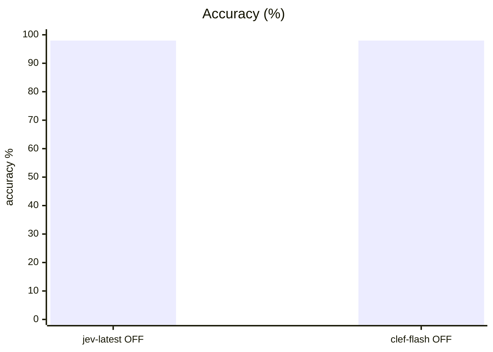
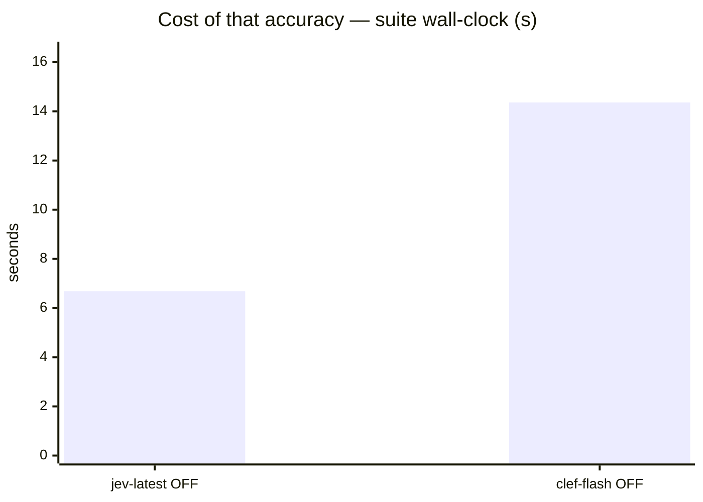
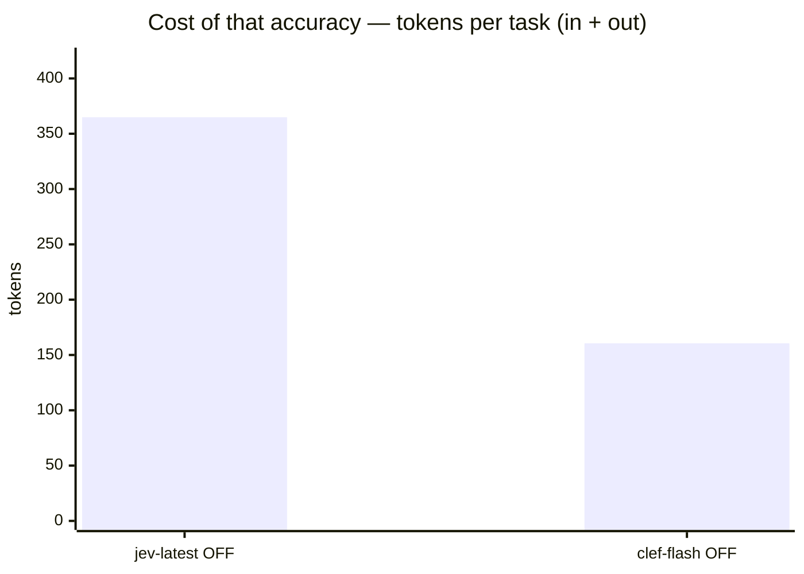
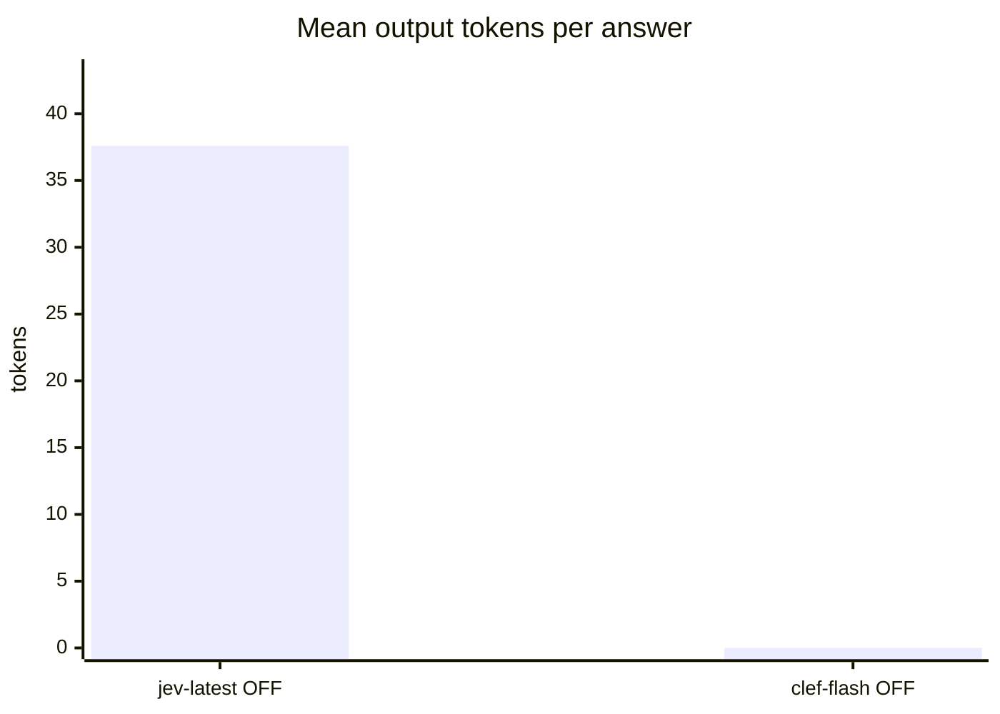

# Clef-Flash-9B vs Jev baseline on system1

**Question.** Should Cloudflare/clef-flash replace Jev behind the s1 endpoint?

**Verdict.** Clef-Flash-9B ties Jev on system1 (98.0%, identical failure set) and scores F1 1.000 on the phishing corpus at 0.47 s/email while fitting alongside the incumbent endpoint — it is a viable local drop-in. It does not beat Jev's 0.3 s latency, so the swap decision is hosting-cost vs WAN round-trip, not accuracy.

## Setup

| | |
|---|---|
| Endpoint | mixed — `http://localhost:8123` (jev-latest OFF), `http://localhost:8124` (clef-flash OFF) |
| Tasks | 49 |
| Samples per task | 2 (⇒ 98 generations per run) |
| Concurrency | 4 |
| Metric | accuracy over exact-match answers on typed decision questions, with a 95% Wilson interval |

## Headline

| Run | Accuracy (95% CI) | Tokens per task | Time per task |
|---|---|---|---|---|
| typesafe jev-1.13 s1 | 98.0 % (93–99) | 327 in / 38 out | 0.3 s |
| clef-flash-9b s1 | 98.0 % (93–99) | 160 in / 0 out | 0.6 s |

The bracket is the 95% Wilson interval of the solve rate, in points. *Tokens* and *time* are the mean per task attempt (input and output tokens as the endpoint or harness reported them; wall-clock seconds).

## At a glance

| # | Run | Harness · thinking | Accuracy | Tokens / task | Time / task |
|---|---|---|---|---|---|
| 1 | typesafe jev-1.13 s1 | built-in loop · OFF | `█████████▊` 98 % (93–99) | `██████████` 365 | `████▋░░░░░` 0 s |
| 2 | clef-flash-9b s1 | built-in loop · OFF | `█████████▊` 98 % (93–99) | `████▍░░░░░` 160 | `██████████` 1 s |

Solve-rate bars run 0–100 %, bracket = 95% interval. Token and time bars are scaled to the costliest row — shorter is cheaper.

Points are the `#` column above. Up is better, left is cheaper: the top-left corner is the most solved for the least spent. Cost is scaled to the costliest run.

## Results

| Run | Accuracy | easy | medium | hard | Wall | Mean out tok | Truncated | tok/s |
|---|---|---|---|---|---|---|---|---|
| **typesafe jev-1.13 s1** | **98.0 %** | 100.0 % | 100.0 % | 88.9 % | 7 s | 38 | 0 | 150.8 |
| clef-flash-9b s1 | 98.0 % | 100.0 % | 100.0 % | 88.9 % | 14 s | — | 0 | — |

## By difficulty

| Run | easy | medium | hard |
|---|---|---|---|
| typesafe jev-1.13 s1 | `████████` 100 % | `████████` 100 % | `███████▏` 89 % |
| clef-flash-9b s1 | `████████` 100 % | `████████` 100 % | `███████▏` 89 % |

## Task by task

Per-task solve rate (%). Tasks the runs disagree on are listed first, widest gap on top.

- 🟩 **every run solved** (48): `bag_allowance/q1`, `bag_allowance/q2`, `borderline_comment/q1`, `borderline_comment/q2`, `budget_veto/q1`, `budget_veto/q2`, `cafe_hours/q1`, `cafe_hours/q2`, `cafe_hours/q3`, `capital_japan/q1`, `capital_japan/q2`, `chat_resolved/q1`, `chat_resolved/q2`, `device_policy/q1`, `device_policy/q2`, `error_log/q2`, `error_log/q3`, `fruit_basket/q1`, `fruit_basket/q2`, `glowing_review/q1`, `glowing_review/q2`, `golden_retriever/q1`, `golden_retriever/q2`, `harsh_review/q1`, `harsh_review/q2`, `height_order/q1`, `height_order/q2`, `json_order/q1`, `json_order/q2`, `language_french/q1`, `language_french/q2`, `museum_hours/q1`, `museum_hours/q2`, `product_spec/q1`, `product_spec/q2`, `ref_code/q1`, `ref_code/q2`, `refund_eligible/q1`, `refund_eligible/q2`, `sale_item_refund/q1`, `sale_item_refund/q2`, `sale_item_refund/q3`, `spam_email/q1`, `spam_email/q2`, `threat_comment/q1`, `threat_comment/q2`, `ticket_billing/q1`, `ticket_billing/q2`
- 🟥 **every run failed** (1): `error_log/q1`

## Cost per task

Mean per attempt: input / output tokens, then wall-clock seconds. *not reported* = no usage reported for that task; *–* = the run has no cost record for it.

| Task | typesafe jev-1.13 s1 | clef-flash-9b s1 |
|---|---|---|
| `bag_allowance/q1` | 316 / 31 · 0.3 s | 145 / 0 · 0.6 s |
| `bag_allowance/q2` | 320 / 31 · 0.2 s | 149 / 0 · 0.6 s |
| `borderline_comment/q1` | 309 / 31 · 0.2 s | 138 / 0 · 0.5 s |
| `borderline_comment/q2` | 308 / 31 · 0.3 s | 137 / 0 · 0.4 s |
| `budget_veto/q1` | 313 / 31 · 0.5 s | 142 / 0 · 0.4 s |
| `budget_veto/q2` | 314 / 31 · 0.3 s | 143 / 0 · 0.6 s |
| `cafe_hours/q1` | 328 / 31 · 0.4 s | 157 / 0 · 0.5 s |
| `cafe_hours/q2` | 330 / 31 · 0.2 s | 159 / 0 · 0.7 s |
| `cafe_hours/q3` | 335 / 31 · 0.2 s | 164 / 0 · 0.6 s |
| `capital_japan/q1` | 316 / 50 · 0.3 s | 155 / 0 · 0.5 s |
| `capital_japan/q2` | 315 / 47 · 0.2 s | 155 / 0 · 0.5 s |
| `chat_resolved/q1` | 345 / 51 · 0.3 s | 187 / 0 · 0.6 s |
| `chat_resolved/q2` | 329 / 31 · 0.2 s | 159 / 0 · 0.6 s |
| `device_policy/q1` | 317 / 31 · 0.2 s | 146 / 0 · 0.6 s |
| `device_policy/q2` | 318 / 31 · 0.4 s | 147 / 0 · 0.7 s |
| `error_log/q1` | 333 / 39 · 0.2 s | 169 / 0 · 0.5 s |
| `error_log/q2` | 332 / 38 · 0.2 s | 168 / 0 · 0.6 s |
| `error_log/q3` | 327 / 31 · 0.3 s | 157 / 0 · 0.6 s |
| `fruit_basket/q1` | 315 / 45 · 0.2 s | 156 / 0 · 0.8 s |
| `fruit_basket/q2` | 316 / 45 · 0.3 s | 157 / 0 · 0.6 s |
| `glowing_review/q1` | 316 / 38 · 0.2 s | 151 / 0 · 0.4 s |
| `glowing_review/q2` | 312 / 31 · 0.2 s | 141 / 0 · 0.7 s |
| `golden_retriever/q1` | 316 / 45 · 0.2 s | 156 / 0 · 0.5 s |
| `golden_retriever/q2` | 303 / 31 · 0.3 s | 131 / 0 · 0.6 s |
| `harsh_review/q1` | 342 / 52 · 0.2 s | 187 / 0 · 0.5 s |
| `harsh_review/q2` | 314 / 31 · 0.4 s | 141 / 0 · 0.7 s |
| `height_order/q1` | 305 / 38 · 0.2 s | 140 / 0 · 0.5 s |
| `height_order/q2` | 305 / 38 · 0.2 s | 140 / 0 · 0.6 s |
| `json_order/q1` | 342 / 50 · 0.2 s | 182 / 0 · 0.6 s |
| `json_order/q2` | 343 / 45 · 0.2 s | 185 / 0 · 0.6 s |
| `language_french/q1` | 317 / 45 · 0.2 s | 158 / 0 · 0.5 s |
| `language_french/q2` | 304 / 31 · 0.3 s | 133 / 0 · 0.7 s |
| `museum_hours/q1` | 319 / 31 · 0.3 s | 148 / 0 · 0.5 s |
| `museum_hours/q2` | 326 / 31 · 0.2 s | 155 / 0 · 0.5 s |
| `product_spec/q1` | 315 / 31 · 0.2 s | 142 / 0 · 0.6 s |
| `product_spec/q2` | 314 / 31 · 0.2 s | 141 / 0 · 0.5 s |
| `ref_code/q1` | 355 / 80 · 0.2 s | 209 / 0 · 0.6 s |
| `ref_code/q2` | 349 / 74 · 0.2 s | 185 / 0 · 0.7 s |
| `refund_eligible/q1` | 342 / 31 · 0.2 s | 171 / 0 · 0.6 s |
| `refund_eligible/q2` | 351 / 46 · 0.3 s | 192 / 0 · 0.7 s |
| `sale_item_refund/q1` | 373 / 31 · 0.3 s | 203 / 0 · 0.6 s |
| `sale_item_refund/q2` | 373 / 31 · 0.2 s | 203 / 0 · 0.8 s |
| `sale_item_refund/q3` | 373 / 31 · 0.3 s | 203 / 0 · 0.5 s |
| `spam_email/q1` | 357 / 31 · 0.4 s | 185 / 0 · 0.8 s |
| `spam_email/q2` | 358 / 31 · 0.4 s | 186 / 0 · 0.8 s |
| `threat_comment/q1` | 307 / 31 · 0.2 s | 136 / 0 · 0.7 s |
| `threat_comment/q2` | 308 / 31 · 0.2 s | 137 / 0 · 0.5 s |
| `ticket_billing/q1` | 335 / 46 · 0.2 s | 177 / 0 · 0.6 s |
| `ticket_billing/q2` | 326 / 31 · 0.2 s | 156 / 0 · 0.5 s |

## Caveats

- 2 samples per task. Every solve rate carries a 95% Wilson interval over the generations behind it, and a margin between two runs is only a result when the 95% Newcombe interval of the difference excludes zero. The intervals treat each generation as independent; samples of one task are correlated, so with few tasks the true uncertainty is if anything wider. Raise `--samples` before calling a close race.
- Single-turn decision questions over a state, scored by exact match against each question's answer key. Code generation and multi-turn tool use are not exercised here.
- Verbose, reasoned or empty replies count as failures — deliberating instead of deciding is the failure mode this suite measures.
- A truncated generation counts as a failure; a high `Truncated` column means runaway reasoning, which hangs real agents.

## Raw data

- `typesafe-jev-1-13-s1.json` — typesafe jev-1.13 s1
- `clef-flash-9b-s1.json` — clef-flash-9b s1
