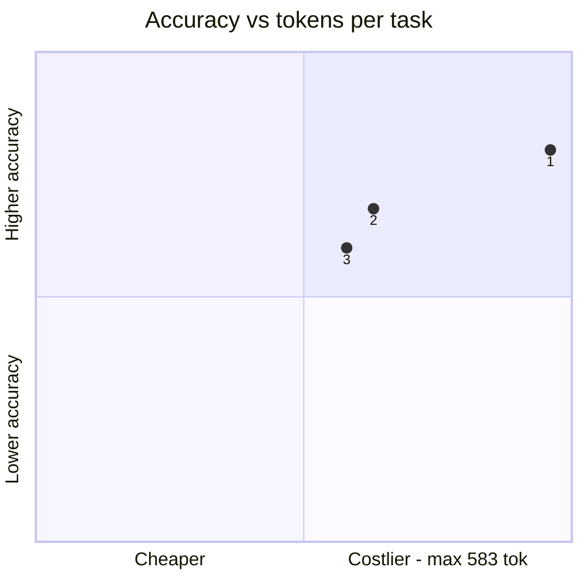
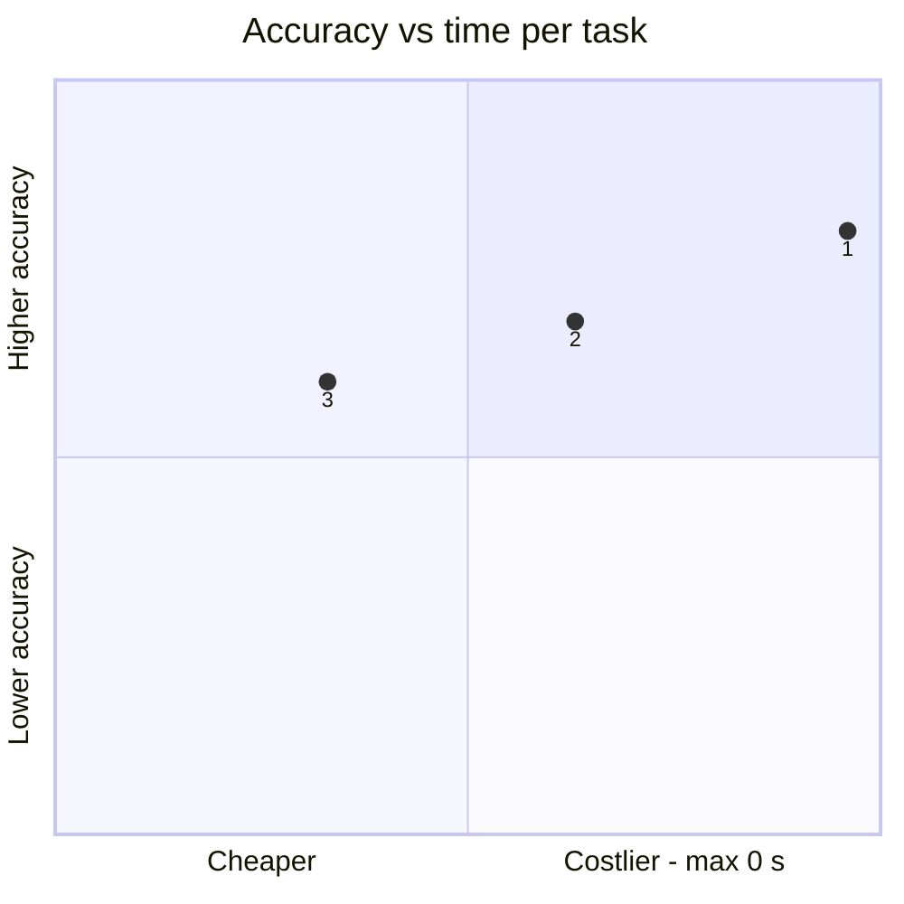
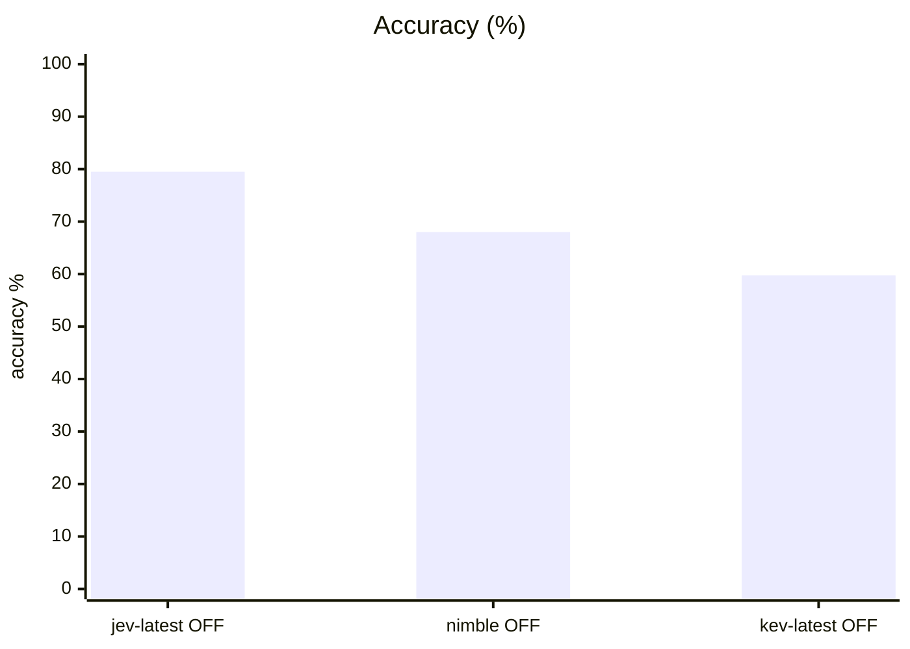
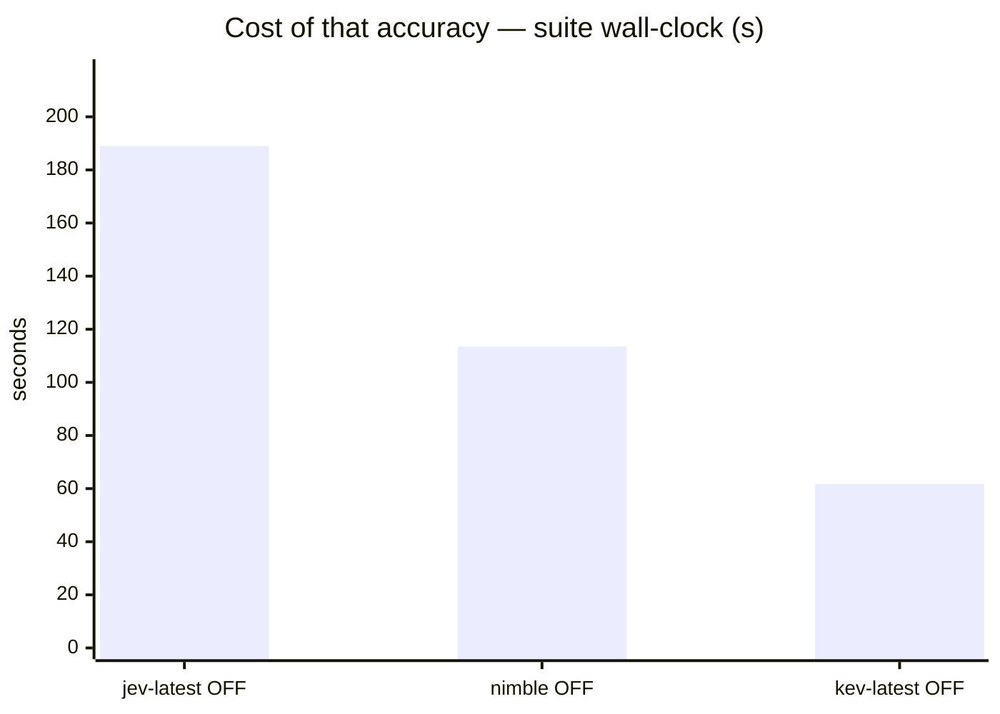
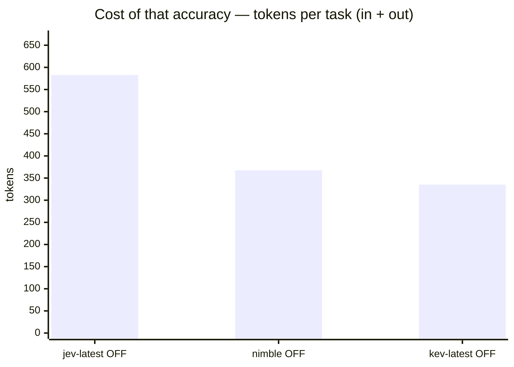
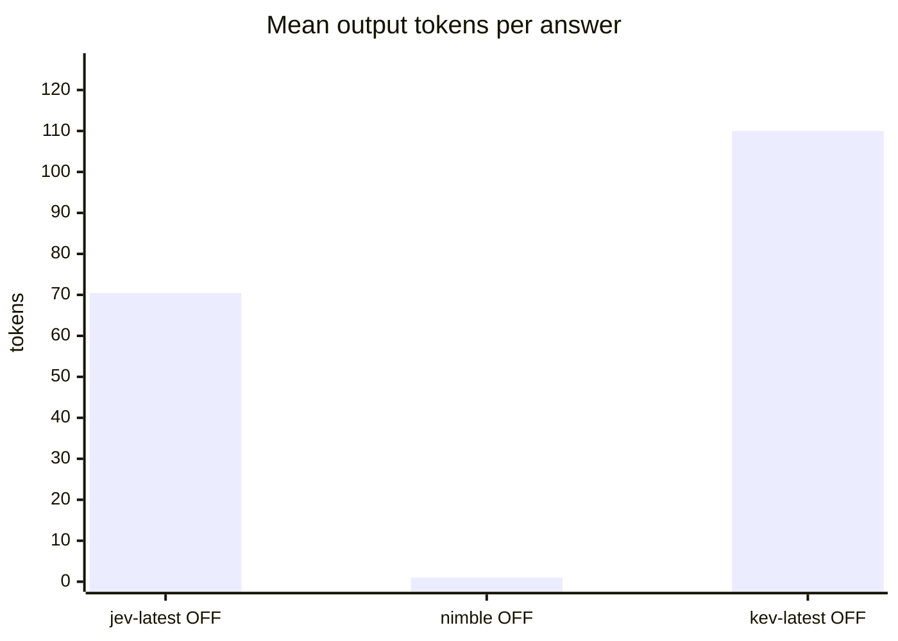

# Jev vs Nimble-9B vs Kev-4B on system1 v2 (three-way, standard s1 transport)

**Question.** Which decision model should serve the standard s1 endpoint on v2?

**Verdict.** Keep TypeSafe Jev-1.13.0. On the level 380-question optioned subset: Jev 81.6%, Nimble-9B Q8_0 71.6%, Kev-4B 62.4%. As-scored (n=800): 79.5% / 68.0% / 59.8% — but Nimble's number carries 40 transport-failed open-question generations (Ollama caps /v1/systemone criteria at 26; the gateway's 64-token fallback can't fit any v2 open answer), so 71.6% is its honest comparable score, not 68.0%. Nimble is the strongest measured local backend and beats Kev-4B in 8/10 families, even edging Jev on policy — but the legacy 98% parity is gone on v2. Ranking: Jev > Nimble > Kev-4B.

## Setup

| | |
|---|---|
| Endpoint | `http://localhost:8124` |
| Tasks | 400 |
| Samples per task | 2 (⇒ 800 generations per run) |
| Concurrency | 1 |
| Metric | accuracy over exact-match answers on typed decision questions, with a 95% Wilson interval |

## Headline

| Run | Accuracy (95% CI) | Tokens per task | Time per task |
|---|---|---|---|---|
| typesafe jev-1.13.0 api.typesafe.ai system1-v2 | 79.5 % (77–82) | 512 in / 70 out | 0.2 s |
| bespoke-nimble-9b ollama Q8_0 system1-v2 | 68.0 % (65–71) | 367 in / 1 out (760/800 reported) | 0.1 s |
| kev-4b jaredpalmer kev.serve bf16 system1-v2 | 59.8 % (56–63) | 225 in / 110 out | 0.1 s |

<sub>The bracket is the 95% Wilson interval of the solve rate, in points. *Tokens* and *time* are the mean per task attempt (input and output tokens as the endpoint or harness reported them; wall-clock seconds).</sub>

## At a glance

| # | Run | Harness · thinking | Accuracy | Tokens / task | Time / task |
|---|---|---|---|---|---|
| 1 | typesafe jev-1.13.0 api.typesafe.ai system1-v2 | built-in loop · OFF | `████████░░` 80 % <sub>(77–82)</sub> | `██████████` 583 | `██████████` 0 s |
| 2 | bespoke-nimble-9b ollama Q8_0 system1-v2 | built-in loop · OFF | `██████▊░░░` 68 % <sub>(65–71)</sub> ⚠ 40/800 errored | `██████▎░░░` 368 | `██████▍░░░` 0 s |
| 3 | kev-4b jaredpalmer kev.serve bf16 system1-v2 | built-in loop · OFF | `██████░░░░` 60 % <sub>(56–63)</sub> | `█████▊░░░░` 335 | `███▎░░░░░░` 0 s |

<sub>Solve-rate bars run 0–100 %, bracket = 95% interval. Token and time bars are scaled to the costliest row — shorter is cheaper.</sub>





<sub>Points are the `#` column above. Up is better, left is cheaper: the top-left corner is the most solved for the least spent. Cost is scaled to the costliest run.</sub>

## Results

| Run | Accuracy | easy | medium | hard | Wall | Mean out tok | Truncated | tok/s |
|---|---|---|---|---|---|---|---|---|
| **typesafe jev-1.13.0 api.typesafe.ai system1-v2** | **79.5 %** | — | 85.0 % | 78.1 % | 189 s | 70 | 0 | 305.9 |
| bespoke-nimble-9b ollama Q8_0 system1-v2 | 68.0 % | — | 76.2 % | 65.9 % | 114 s | 1 | 0 | 8.9 |
| kev-4b jaredpalmer kev.serve bf16 system1-v2 | 59.8 % | — | 65.0 % | 58.4 % | 62 s | 110 | 0 | 1,521.9 |









## By difficulty

| Run | easy | medium | hard |
|---|---|---|---|
| typesafe jev-1.13.0 api.typesafe.ai system1-v2 | — | `██████▊░` 85 % | `██████▎░` 78 % |
| bespoke-nimble-9b ollama Q8_0 system1-v2 | — | `██████▏░` 76 % | `█████▎░░` 66 % |
| kev-4b jaredpalmer kev.serve bf16 system1-v2 | — | `█████▎░░` 65 % | `████▋░░░` 58 % |

## Task by task

<sub>Per-task solve rate (%). Tasks the runs disagree on are listed first, widest gap on top.</sub>

| Task | jev-latest OFF | nimble OFF | kev-latest OFF |
|---|---|---|---|
| `access_01/q2` | 🟩 100 | 🟩 100 | 🟥 0 |
| `access_04/q2` | 🟩 100 | 🟩 100 | 🟥 0 |
| `access_05/q1` | 🟩 100 | 🟥 0 | 🟥 0 |
| `access_05/q2` | 🟩 100 | 🟥 0 | 🟩 100 |
| `access_08/q2` | 🟥 0 | 🟩 100 | 🟥 0 |
| `access_09/q1` | 🟩 100 | 🟥 0 | 🟥 0 |
| `access_10/q2` | 🟩 100 | 🟩 100 | 🟥 0 |
| `access_13/q1` | 🟩 100 | 🟥 0 | 🟩 100 |
| `access_13/q2` | 🟥 0 | 🟥 0 | 🟩 100 |
| `access_15/q1` | 🟩 100 | 🟥 0 | 🟥 0 |
| `access_15/q2` | 🟩 100 | 🟩 100 | 🟥 0 |
| `access_17/q2` | 🟩 100 | 🟩 100 | 🟥 0 |
| `access_20/q2` | 🟩 100 | 🟩 100 | 🟥 0 |
| `dependencies_02/q1` | 🟩 100 | 🟥 0 | 🟥 0 |
| `dependencies_02/q2` | 🟩 100 | 🟩 100 | 🟥 0 |
| `dependencies_03/q1` | 🟩 100 | 🟩 100 | 🟥 0 |
| `dependencies_03/q2` | 🟩 100 | 🟥 0 | 🟥 0 |
| `dependencies_04/q1` | 🟩 100 | 🟩 100 | 🟥 0 |
| `dependencies_06/q1` | 🟩 100 | 🟩 100 | 🟥 0 |
| `dependencies_06/q2` | 🟩 100 | 🟥 0 | 🟥 0 |
| `dependencies_08/q1` | 🟩 100 | 🟩 100 | 🟥 0 |
| `dependencies_09/q1` | 🟩 100 | 🟩 100 | 🟥 0 |
| `dependencies_09/q2` | 🟩 100 | 🟥 0 | 🟥 0 |
| `dependencies_10/q1` | 🟩 100 | 🟥 0 | 🟩 100 |
| `dependencies_11/q1` | 🟩 100 | 🟥 0 | 🟥 0 |
| `dependencies_13/q1` | 🟥 0 | 🟥 0 | 🟩 100 |
| `dependencies_14/q1` | 🟩 100 | 🟥 0 | 🟩 100 |
| `dependencies_16/q1` | 🟩 100 | 🟥 0 | 🟥 0 |
| `dependencies_19/q1` | 🟩 100 | 🟥 0 | 🟩 100 |
| `dependencies_19/q2` | 🟩 100 | 🟩 100 | 🟥 0 |
| `dependencies_20/q1` | 🟩 100 | 🟥 0 | 🟩 100 |
| `events_02/q2` | 🟩 100 | 🟩 100 | 🟥 0 |
| `events_03/q2` | 🟩 100 | 🟥 0 | 🟥 0 |
| `events_04/q1` | 🟥 0 | 🟩 100 | 🟩 100 |
| `events_05/q2` | 🟩 100 | 🟩 100 | 🟥 0 |
| `events_06/q1` | 🟩 100 | 🟥 0 | 🟩 100 |
| `events_06/q2` | 🟩 100 | 🟥 0 | 🟥 0 |
| `events_08/q1` | 🟥 0 | 🟥 0 | 🟩 100 |
| `events_08/q2` | 🟩 100 | 🟥 0 | 🟩 100 |
| `events_09/q2` | 🟩 100 | 🟩 100 | 🟥 0 |
| `events_10/q1` | 🟥 0 | 🟩 100 | 🟥 0 |
| `events_10/q2` | 🟩 100 | 🟥 0 | 🟥 0 |
| `events_11/q2` | 🟩 100 | 🟩 100 | 🟥 0 |
| `events_12/q2` | 🟩 100 | 🟩 100 | 🟥 0 |
| `events_14/q2` | 🟩 100 | 🟩 100 | 🟥 0 |
| `events_15/q1` | 🟩 100 | 🟩 100 | 🟥 0 |
| `events_15/q2` | 🟩 100 | 🟩 100 | 🟥 0 |
| `events_19/q1` | 🟩 100 | 🟥 0 | 🟥 0 |
| `events_19/q2` | 🟩 100 | 🟩 100 | 🟥 0 |
| `events_20/q2` | 🟩 100 | 🟩 100 | 🟥 0 |
| `evidence_02/q2` | 🟩 100 | 🟩 100 | 🟥 0 |
| `evidence_06/q1` | 🟩 100 | 🟩 100 | 🟥 0 |
| `evidence_08/q1` | 🟩 100 | 🟥 0 | 🟩 100 |
| `evidence_08/q2` | 🟩 100 | 🟩 100 | 🟥 0 |
| `evidence_10/q2` | 🟩 100 | 🟩 100 | 🟥 0 |
| `evidence_11/q1` | 🟩 100 | 🟩 100 | 🟥 0 |
| `evidence_15/q1` | 🟩 100 | 🟥 0 | 🟩 100 |
| `evidence_15/q2` | 🟩 100 | 🟥 0 | 🟥 0 |
| `evidence_18/q2` | 🟩 100 | 🟩 100 | 🟥 0 |
| `evidence_20/q2` | 🟩 100 | 🟩 100 | 🟥 0 |
| `inventory_01/q1` | 🟥 0 | 🟩 100 | 🟥 0 |
| `inventory_01/q2` | 🟩 100 | 🟩 100 | 🟥 0 |
| `inventory_02/q1` | 🟩 100 | 🟥 0 | 🟩 100 |
| `inventory_05/q1` | 🟥 0 | 🟩 100 | 🟥 0 |
| `inventory_06/q2` | 🟩 100 | 🟩 100 | 🟥 0 |
| `inventory_07/q1` | 🟩 100 | 🟩 100 | 🟥 0 |
| `inventory_11/q1` | 🟩 100 | 🟥 0 | 🟩 100 |
| `inventory_13/q1` | 🟨 50 | 🟩 100 | 🟥 0 |
| `inventory_13/q2` | 🟩 100 | 🟥 0 | 🟥 0 |
| `inventory_14/q1` | 🟩 100 | 🟥 0 | 🟥 0 |
| `inventory_14/q2` | 🟩 100 | 🟥 0 | 🟩 100 |
| `inventory_16/q1` | 🟩 100 | 🟥 0 | 🟥 0 |
| `inventory_16/q2` | 🟩 100 | 🟩 100 | 🟥 0 |
| `inventory_17/q1` | 🟥 0 | 🟩 100 | 🟥 0 |
| `inventory_18/q1` | 🟩 100 | 🟥 0 | 🟥 0 |
| `inventory_19/q2` | 🟩 100 | 🟩 100 | 🟥 0 |
| `inventory_20/q1` | 🟥 0 | 🟩 100 | 🟥 0 |
| `inventory_20/q2` | 🟩 100 | 🟩 100 | 🟥 0 |
| `money_01/q1` | 🟥 0 | 🟩 100 | 🟥 0 |
| `money_02/q2` | 🟩 100 | 🟥 0 | 🟩 100 |
| `money_03/q1` | 🟥 0 | 🟥 0 | 🟩 100 |
| `money_03/q2` | 🟩 100 | 🟥 0 | 🟩 100 |
| `money_04/q1` | 🟩 100 | 🟩 100 | 🟥 0 |
| `money_06/q2` | 🟩 100 | 🟥 0 | 🟥 0 |
| `money_07/q1` | 🟨 50 | 🟩 100 | 🟥 0 |
| `money_08/q1` | 🟥 0 | 🟥 0 | 🟩 100 |
| `money_08/q2` | 🟥 0 | 🟩 100 | 🟩 100 |
| `money_11/q1` | 🟥 0 | 🟩 100 | 🟥 0 |
| `money_13/q1` | 🟨 50 | 🟩 100 | 🟥 0 |
| `money_14/q1` | 🟥 0 | 🟥 0 | 🟩 100 |
| `money_15/q1` | 🟩 100 | 🟥 0 | 🟥 0 |
| `money_19/q2` | 🟩 100 | 🟥 0 | 🟥 0 |
| `money_20/q2` | 🟥 0 | 🟩 100 | 🟩 100 |
| `policy_02/q1` | 🟩 100 | 🟩 100 | 🟥 0 |
| `policy_02/q2` | 🟩 100 | 🟩 100 | 🟥 0 |
| `policy_03/q1` | 🟩 100 | 🟩 100 | 🟥 0 |
| `policy_03/q2` | 🟩 100 | 🟥 0 | 🟥 0 |
| `policy_04/q1` | 🟥 0 | 🟩 100 | 🟩 100 |
| `policy_04/q2` | 🟥 0 | 🟩 100 | 🟩 100 |
| `policy_06/q1` | 🟩 100 | 🟥 0 | 🟥 0 |
| `policy_06/q2` | 🟩 100 | 🟥 0 | 🟥 0 |
| `policy_07/q1` | 🟩 100 | 🟩 100 | 🟥 0 |
| `policy_07/q2` | 🟩 100 | 🟩 100 | 🟥 0 |
| `policy_10/q2` | 🟩 100 | 🟩 100 | 🟥 0 |
| `policy_11/q1` | 🟥 0 | 🟥 0 | 🟩 100 |
| `policy_13/q1` | 🟥 0 | 🟩 100 | 🟥 0 |
| `policy_13/q2` | 🟩 100 | 🟩 100 | 🟥 0 |
| `policy_14/q1` | 🟨 50 | 🟩 100 | 🟥 0 |
| `policy_14/q2` | 🟥 0 | 🟩 100 | 🟥 0 |
| `policy_15/q1` | 🟨 50 | 🟩 100 | 🟥 0 |
| `policy_15/q2` | 🟩 100 | 🟩 100 | 🟥 0 |
| `records_01/q1` | 🟩 100 | 🟥 0 | 🟥 0 |
| `records_02/q1` | 🟩 100 | 🟥 0 | 🟩 100 |
| `records_03/q1` | 🟩 100 | 🟥 0 | 🟩 100 |
| `records_04/q1` | 🟩 100 | 🟥 0 | 🟩 100 |
| `records_04/q2` | 🟩 100 | 🟥 0 | 🟩 100 |
| `records_05/q1` | 🟩 100 | 🟥 0 | 🟩 100 |
| `records_05/q2` | 🟩 100 | 🟥 0 | 🟩 100 |
| `records_06/q1` | 🟨 50 | 🟩 100 | 🟥 0 |
| `records_08/q1` | 🟨 50 | 🟩 100 | 🟥 0 |
| `records_09/q1` | 🟩 100 | 🟩 100 | 🟥 0 |
| `records_09/q2` | 🟩 100 | 🟥 0 | 🟥 0 |
| `records_11/q2` | 🟩 100 | 🟥 0 | 🟥 0 |
| `records_13/q1` | 🟩 100 | 🟥 0 | 🟥 0 |
| `records_14/q1` | 🟩 100 | 🟥 0 | 🟩 100 |
| `records_15/q1` | 🟩 100 | 🟥 0 | 🟩 100 |
| `records_16/q1` | 🟩 100 | 🟥 0 | 🟩 100 |
| `records_16/q2` | 🟩 100 | 🟥 0 | 🟥 0 |
| `records_18/q1` | 🟩 100 | 🟥 0 | 🟥 0 |
| `records_18/q2` | 🟩 100 | 🟥 0 | 🟥 0 |
| `records_19/q1` | 🟩 100 | 🟥 0 | 🟩 100 |
| `records_19/q2` | 🟩 100 | 🟥 0 | 🟥 0 |
| `records_20/q1` | 🟩 100 | 🟥 0 | 🟥 0 |
| `records_20/q2` | 🟩 100 | 🟥 0 | 🟥 0 |
| `time_02/q1` | 🟩 100 | 🟩 100 | 🟥 0 |
| `time_02/q2` | 🟩 100 | 🟩 100 | 🟥 0 |
| `triage_03/q1` | 🟩 100 | 🟩 100 | 🟥 0 |
| `triage_07/q1` | 🟩 100 | 🟥 0 | 🟩 100 |
| `triage_07/q2` | 🟩 100 | 🟥 0 | 🟩 100 |
| `triage_08/q1` | 🟥 0 | 🟩 100 | 🟩 100 |
| `triage_11/q2` | 🟩 100 | 🟩 100 | 🟥 0 |
| `triage_13/q1` | 🟩 100 | 🟥 0 | 🟥 0 |
| `triage_13/q2` | 🟩 100 | 🟥 0 | 🟥 0 |
| `triage_20/q1` | 🟩 100 | 🟥 0 | 🟥 0 |
| `triage_20/q2` | 🟩 100 | 🟥 0 | 🟥 0 |
| `access_14/q1` | 🟨 50 | 🟥 0 | 🟥 0 |
| `access_14/q2` | 🟨 50 | 🟥 0 | 🟥 0 |
| `events_13/q1` | 🟨 50 | 🟩 100 | 🟩 100 |
| `events_13/q2` | 🟨 50 | 🟩 100 | 🟩 100 |
| `money_07/q2` | 🟨 50 | 🟥 0 | 🟥 0 |
| `money_19/q1` | 🟨 50 | 🟥 0 | 🟥 0 |
| `policy_11/q2` | 🟨 50 | 🟩 100 | 🟩 100 |
| `records_11/q1` | 🟨 50 | 🟥 0 | 🟥 0 |
| `triage_08/q2` | 🟨 50 | 🟩 100 | 🟩 100 |

- 🟩 **every run solved** (195): `access_01/q1`, `access_02/q1`, `access_02/q2`, `access_03/q1`, `access_03/q2`, `access_04/q1`, `access_06/q1`, `access_06/q2`, `access_07/q1`, `access_07/q2`, `access_08/q1`, `access_10/q1`, `access_11/q1`, `access_11/q2`, `access_12/q1`, `access_12/q2`, `access_16/q1`, `access_16/q2`, `access_17/q1`, `access_18/q1`, `access_18/q2`, `access_19/q1`, `access_19/q2`, `access_20/q1`, `dependencies_01/q1`, `dependencies_01/q2`, `dependencies_04/q2`, `dependencies_05/q2`, `dependencies_08/q2`, `dependencies_10/q2`, `dependencies_11/q2`, `dependencies_12/q1`, `dependencies_12/q2`, `dependencies_13/q2`, `dependencies_14/q2`, `dependencies_15/q1`, `dependencies_15/q2`, `dependencies_17/q1`, `dependencies_17/q2`, `dependencies_18/q1`, `dependencies_18/q2`, `dependencies_20/q2`, `events_01/q1`, `events_01/q2`, `events_02/q1`, `events_03/q1`, `events_04/q2`, `events_05/q1`, `events_07/q1`, `events_07/q2`, `events_09/q1`, `events_11/q1`, `events_12/q1`, `events_14/q1`, `events_16/q1`, `events_16/q2`, `events_18/q1`, `events_18/q2`, `events_20/q1`, `evidence_01/q1`, `evidence_01/q2`, `evidence_02/q1`, `evidence_03/q1`, `evidence_03/q2`, `evidence_04/q1`, `evidence_04/q2`, `evidence_05/q1`, `evidence_05/q2`, `evidence_06/q2`, `evidence_07/q1`, `evidence_07/q2`, `evidence_09/q1`, `evidence_09/q2`, `evidence_10/q1`, `evidence_11/q2`, `evidence_12/q1`, `evidence_12/q2`, `evidence_13/q1`, `evidence_13/q2`, `evidence_14/q1`, `evidence_14/q2`, `evidence_16/q1`, `evidence_16/q2`, `evidence_17/q1`, `evidence_17/q2`, `evidence_18/q1`, `evidence_19/q1`, `evidence_19/q2`, `evidence_20/q1`, `inventory_02/q2`, `inventory_03/q1`, `inventory_03/q2`, `inventory_04/q2`, `inventory_05/q2`, `inventory_08/q1`, `inventory_08/q2`, `inventory_09/q1`, `inventory_09/q2`, `inventory_10/q1`, `inventory_10/q2`, `inventory_11/q2`, `inventory_12/q1`, `inventory_12/q2`, `inventory_15/q1`, `inventory_15/q2`, `inventory_17/q2`, `inventory_18/q2`, `money_01/q2`, `money_02/q1`, `money_04/q2`, `money_05/q1`, `money_05/q2`, `money_09/q1`, `money_09/q2`, `money_10/q1`, `money_10/q2`, `money_11/q2`, `money_12/q2`, `money_13/q2`, `money_14/q2`, `money_15/q2`, `money_16/q2`, `money_17/q2`, `money_18/q1`, `money_18/q2`, `policy_01/q1`, `policy_01/q2`, `policy_05/q1`, `policy_05/q2`, `policy_08/q1`, `policy_08/q2`, `policy_09/q1`, `policy_09/q2`, `policy_10/q1`, `policy_12/q1`, `policy_12/q2`, `policy_16/q1`, `policy_16/q2`, `policy_18/q1`, `policy_18/q2`, `policy_19/q1`, `policy_19/q2`, `policy_20/q1`, `policy_20/q2`, `records_10/q1`, `time_01/q1`, `time_01/q2`, `time_03/q1`, `time_03/q2`, `time_04/q1`, `time_04/q2`, `time_06/q1`, `time_06/q2`, `time_07/q1`, `time_07/q2`, `time_10/q1`, `time_12/q1`, `time_12/q2`, `time_13/q1`, `time_13/q2`, `time_15/q1`, `time_15/q2`, `time_16/q1`, `time_16/q2`, `time_17/q1`, `time_17/q2`, `time_18/q1`, `triage_02/q1`, `triage_02/q2`, `triage_03/q2`, `triage_04/q1`, `triage_04/q2`, `triage_05/q1`, `triage_05/q2`, `triage_06/q1`, `triage_06/q2`, `triage_09/q1`, `triage_09/q2`, `triage_10/q1`, `triage_10/q2`, `triage_11/q1`, `triage_12/q1`, `triage_12/q2`, `triage_14/q1`, `triage_14/q2`, `triage_15/q1`, `triage_15/q2`, `triage_16/q1`, `triage_16/q2`, `triage_17/q1`, `triage_17/q2`, `triage_18/q1`, `triage_18/q2`, `triage_19/q1`, `triage_19/q2`
- 🟥 **every run failed** (51): `access_09/q2`, `dependencies_05/q1`, `dependencies_07/q1`, `dependencies_07/q2`, `dependencies_16/q2`, `events_17/q1`, `events_17/q2`, `inventory_04/q1`, `inventory_06/q1`, `inventory_07/q2`, `inventory_19/q1`, `money_06/q1`, `money_12/q1`, `money_16/q1`, `money_17/q1`, `money_20/q1`, `policy_17/q1`, `policy_17/q2`, `records_01/q2`, `records_02/q2`, `records_03/q2`, `records_06/q2`, `records_07/q1`, `records_07/q2`, `records_08/q2`, `records_10/q2`, `records_12/q1`, `records_12/q2`, `records_13/q2`, `records_14/q2`, `records_15/q2`, `records_17/q1`, `records_17/q2`, `time_05/q1`, `time_05/q2`, `time_08/q1`, `time_08/q2`, `time_09/q1`, `time_09/q2`, `time_10/q2`, `time_11/q1`, `time_11/q2`, `time_14/q1`, `time_14/q2`, `time_18/q2`, `time_19/q1`, `time_19/q2`, `time_20/q1`, `time_20/q2`, `triage_01/q1`, `triage_01/q2`

## Where they disagree — typesafe jev-1.13.0 api.typesafe.ai system1-v2 vs bespoke-nimble-9b ollama Q8_0 system1-v2

| Task | typesafe jev-1.13.0 api.typesafe.ai system1-v2 | bespoke-nimble-9b ollama Q8_0 system1-v2 | Winner |
|---|---|---|---|
| `access_05/q1` | 100 % | 0 % | typesafe jev-1.13.0 api.typesafe.ai system1-v2 |
| `access_05/q2` | 100 % | 0 % | typesafe jev-1.13.0 api.typesafe.ai system1-v2 |
| `access_08/q2` | 0 % | 100 % | bespoke-nimble-9b ollama Q8_0 system1-v2 |
| `access_09/q1` | 100 % | 0 % | typesafe jev-1.13.0 api.typesafe.ai system1-v2 |
| `access_13/q1` | 100 % | 0 % | typesafe jev-1.13.0 api.typesafe.ai system1-v2 |
| `access_14/q1` | 50 % | 0 % | typesafe jev-1.13.0 api.typesafe.ai system1-v2 |
| `access_14/q2` | 50 % | 0 % | typesafe jev-1.13.0 api.typesafe.ai system1-v2 |
| `access_15/q1` | 100 % | 0 % | typesafe jev-1.13.0 api.typesafe.ai system1-v2 |
| `dependencies_02/q1` | 100 % | 0 % | typesafe jev-1.13.0 api.typesafe.ai system1-v2 |
| `dependencies_03/q2` | 100 % | 0 % | typesafe jev-1.13.0 api.typesafe.ai system1-v2 |
| `dependencies_06/q2` | 100 % | 0 % | typesafe jev-1.13.0 api.typesafe.ai system1-v2 |
| `dependencies_09/q2` | 100 % | 0 % | typesafe jev-1.13.0 api.typesafe.ai system1-v2 |
| `dependencies_10/q1` | 100 % | 0 % | typesafe jev-1.13.0 api.typesafe.ai system1-v2 |
| `dependencies_11/q1` | 100 % | 0 % | typesafe jev-1.13.0 api.typesafe.ai system1-v2 |
| `dependencies_14/q1` | 100 % | 0 % | typesafe jev-1.13.0 api.typesafe.ai system1-v2 |
| `dependencies_16/q1` | 100 % | 0 % | typesafe jev-1.13.0 api.typesafe.ai system1-v2 |
| `dependencies_19/q1` | 100 % | 0 % | typesafe jev-1.13.0 api.typesafe.ai system1-v2 |
| `dependencies_20/q1` | 100 % | 0 % | typesafe jev-1.13.0 api.typesafe.ai system1-v2 |
| `events_03/q2` | 100 % | 0 % | typesafe jev-1.13.0 api.typesafe.ai system1-v2 |
| `events_04/q1` | 0 % | 100 % | bespoke-nimble-9b ollama Q8_0 system1-v2 |
| `events_06/q1` | 100 % | 0 % | typesafe jev-1.13.0 api.typesafe.ai system1-v2 |
| `events_06/q2` | 100 % | 0 % | typesafe jev-1.13.0 api.typesafe.ai system1-v2 |
| `events_08/q2` | 100 % | 0 % | typesafe jev-1.13.0 api.typesafe.ai system1-v2 |
| `events_10/q1` | 0 % | 100 % | bespoke-nimble-9b ollama Q8_0 system1-v2 |
| `events_10/q2` | 100 % | 0 % | typesafe jev-1.13.0 api.typesafe.ai system1-v2 |
| `events_13/q1` | 50 % | 100 % | bespoke-nimble-9b ollama Q8_0 system1-v2 |
| `events_13/q2` | 50 % | 100 % | bespoke-nimble-9b ollama Q8_0 system1-v2 |
| `events_19/q1` | 100 % | 0 % | typesafe jev-1.13.0 api.typesafe.ai system1-v2 |
| `evidence_08/q1` | 100 % | 0 % | typesafe jev-1.13.0 api.typesafe.ai system1-v2 |
| `evidence_15/q1` | 100 % | 0 % | typesafe jev-1.13.0 api.typesafe.ai system1-v2 |
| `evidence_15/q2` | 100 % | 0 % | typesafe jev-1.13.0 api.typesafe.ai system1-v2 |
| `inventory_01/q1` | 0 % | 100 % | bespoke-nimble-9b ollama Q8_0 system1-v2 |
| `inventory_02/q1` | 100 % | 0 % | typesafe jev-1.13.0 api.typesafe.ai system1-v2 |
| `inventory_05/q1` | 0 % | 100 % | bespoke-nimble-9b ollama Q8_0 system1-v2 |
| `inventory_11/q1` | 100 % | 0 % | typesafe jev-1.13.0 api.typesafe.ai system1-v2 |
| `inventory_13/q1` | 50 % | 100 % | bespoke-nimble-9b ollama Q8_0 system1-v2 |
| `inventory_13/q2` | 100 % | 0 % | typesafe jev-1.13.0 api.typesafe.ai system1-v2 |
| `inventory_14/q1` | 100 % | 0 % | typesafe jev-1.13.0 api.typesafe.ai system1-v2 |
| `inventory_14/q2` | 100 % | 0 % | typesafe jev-1.13.0 api.typesafe.ai system1-v2 |
| `inventory_16/q1` | 100 % | 0 % | typesafe jev-1.13.0 api.typesafe.ai system1-v2 |
| `inventory_17/q1` | 0 % | 100 % | bespoke-nimble-9b ollama Q8_0 system1-v2 |
| `inventory_18/q1` | 100 % | 0 % | typesafe jev-1.13.0 api.typesafe.ai system1-v2 |
| `inventory_20/q1` | 0 % | 100 % | bespoke-nimble-9b ollama Q8_0 system1-v2 |
| `money_01/q1` | 0 % | 100 % | bespoke-nimble-9b ollama Q8_0 system1-v2 |
| `money_02/q2` | 100 % | 0 % | typesafe jev-1.13.0 api.typesafe.ai system1-v2 |
| `money_03/q2` | 100 % | 0 % | typesafe jev-1.13.0 api.typesafe.ai system1-v2 |
| `money_06/q2` | 100 % | 0 % | typesafe jev-1.13.0 api.typesafe.ai system1-v2 |
| `money_07/q1` | 50 % | 100 % | bespoke-nimble-9b ollama Q8_0 system1-v2 |
| `money_07/q2` | 50 % | 0 % | typesafe jev-1.13.0 api.typesafe.ai system1-v2 |
| `money_08/q2` | 0 % | 100 % | bespoke-nimble-9b ollama Q8_0 system1-v2 |
| `money_11/q1` | 0 % | 100 % | bespoke-nimble-9b ollama Q8_0 system1-v2 |
| `money_13/q1` | 50 % | 100 % | bespoke-nimble-9b ollama Q8_0 system1-v2 |
| `money_15/q1` | 100 % | 0 % | typesafe jev-1.13.0 api.typesafe.ai system1-v2 |
| `money_19/q1` | 50 % | 0 % | typesafe jev-1.13.0 api.typesafe.ai system1-v2 |
| `money_19/q2` | 100 % | 0 % | typesafe jev-1.13.0 api.typesafe.ai system1-v2 |
| `money_20/q2` | 0 % | 100 % | bespoke-nimble-9b ollama Q8_0 system1-v2 |
| `policy_03/q2` | 100 % | 0 % | typesafe jev-1.13.0 api.typesafe.ai system1-v2 |
| `policy_04/q1` | 0 % | 100 % | bespoke-nimble-9b ollama Q8_0 system1-v2 |
| `policy_04/q2` | 0 % | 100 % | bespoke-nimble-9b ollama Q8_0 system1-v2 |
| `policy_06/q1` | 100 % | 0 % | typesafe jev-1.13.0 api.typesafe.ai system1-v2 |
| `policy_06/q2` | 100 % | 0 % | typesafe jev-1.13.0 api.typesafe.ai system1-v2 |
| `policy_11/q2` | 50 % | 100 % | bespoke-nimble-9b ollama Q8_0 system1-v2 |
| `policy_13/q1` | 0 % | 100 % | bespoke-nimble-9b ollama Q8_0 system1-v2 |
| `policy_14/q1` | 50 % | 100 % | bespoke-nimble-9b ollama Q8_0 system1-v2 |
| `policy_14/q2` | 0 % | 100 % | bespoke-nimble-9b ollama Q8_0 system1-v2 |
| `policy_15/q1` | 50 % | 100 % | bespoke-nimble-9b ollama Q8_0 system1-v2 |
| `records_01/q1` | 100 % | 0 % | typesafe jev-1.13.0 api.typesafe.ai system1-v2 |
| `records_02/q1` | 100 % | 0 % | typesafe jev-1.13.0 api.typesafe.ai system1-v2 |
| `records_03/q1` | 100 % | 0 % | typesafe jev-1.13.0 api.typesafe.ai system1-v2 |
| `records_04/q1` | 100 % | 0 % | typesafe jev-1.13.0 api.typesafe.ai system1-v2 |
| `records_04/q2` | 100 % | 0 % | typesafe jev-1.13.0 api.typesafe.ai system1-v2 |
| `records_05/q1` | 100 % | 0 % | typesafe jev-1.13.0 api.typesafe.ai system1-v2 |
| `records_05/q2` | 100 % | 0 % | typesafe jev-1.13.0 api.typesafe.ai system1-v2 |
| `records_06/q1` | 50 % | 100 % | bespoke-nimble-9b ollama Q8_0 system1-v2 |
| `records_08/q1` | 50 % | 100 % | bespoke-nimble-9b ollama Q8_0 system1-v2 |
| `records_09/q2` | 100 % | 0 % | typesafe jev-1.13.0 api.typesafe.ai system1-v2 |
| `records_11/q1` | 50 % | 0 % | typesafe jev-1.13.0 api.typesafe.ai system1-v2 |
| `records_11/q2` | 100 % | 0 % | typesafe jev-1.13.0 api.typesafe.ai system1-v2 |
| `records_13/q1` | 100 % | 0 % | typesafe jev-1.13.0 api.typesafe.ai system1-v2 |
| `records_14/q1` | 100 % | 0 % | typesafe jev-1.13.0 api.typesafe.ai system1-v2 |
| `records_15/q1` | 100 % | 0 % | typesafe jev-1.13.0 api.typesafe.ai system1-v2 |
| `records_16/q1` | 100 % | 0 % | typesafe jev-1.13.0 api.typesafe.ai system1-v2 |
| `records_16/q2` | 100 % | 0 % | typesafe jev-1.13.0 api.typesafe.ai system1-v2 |
| `records_18/q1` | 100 % | 0 % | typesafe jev-1.13.0 api.typesafe.ai system1-v2 |
| `records_18/q2` | 100 % | 0 % | typesafe jev-1.13.0 api.typesafe.ai system1-v2 |
| `records_19/q1` | 100 % | 0 % | typesafe jev-1.13.0 api.typesafe.ai system1-v2 |
| `records_19/q2` | 100 % | 0 % | typesafe jev-1.13.0 api.typesafe.ai system1-v2 |
| `records_20/q1` | 100 % | 0 % | typesafe jev-1.13.0 api.typesafe.ai system1-v2 |
| `records_20/q2` | 100 % | 0 % | typesafe jev-1.13.0 api.typesafe.ai system1-v2 |
| `triage_07/q1` | 100 % | 0 % | typesafe jev-1.13.0 api.typesafe.ai system1-v2 |
| `triage_07/q2` | 100 % | 0 % | typesafe jev-1.13.0 api.typesafe.ai system1-v2 |
| `triage_08/q1` | 0 % | 100 % | bespoke-nimble-9b ollama Q8_0 system1-v2 |
| `triage_08/q2` | 50 % | 100 % | bespoke-nimble-9b ollama Q8_0 system1-v2 |
| `triage_13/q1` | 100 % | 0 % | typesafe jev-1.13.0 api.typesafe.ai system1-v2 |
| `triage_13/q2` | 100 % | 0 % | typesafe jev-1.13.0 api.typesafe.ai system1-v2 |
| `triage_20/q1` | 100 % | 0 % | typesafe jev-1.13.0 api.typesafe.ai system1-v2 |
| `triage_20/q2` | 100 % | 0 % | typesafe jev-1.13.0 api.typesafe.ai system1-v2 |

## Cost per task

<sub>Mean per attempt: input / output tokens, then wall-clock seconds. *not reported* = no usage reported for that task; *–* = the run has no cost record for it.</sub>

| Task | typesafe jev-1.13.0 api.typesafe.ai system1-v2 | bespoke-nimble-9b ollama Q8_0 system1-v2 | kev-4b jaredpalmer kev.serve bf16 system1-v2 |
|---|---|---|---|
| `access_01/q1` | 415 / 31 · 0.2 s | 278 / 1 · 0.1 s | 149 / 52 · 0.1 s |
| `access_01/q2` | 442 / 61 · 0.2 s | 330 / 1 · 0.1 s | 163 / 97 · 0.0 s |
| `access_02/q1` | 415 / 31 · 0.2 s | 278 / 1 · 0.1 s | 149 / 52 · 0.1 s |
| `access_02/q2` | 442 / 62 · 0.2 s | 330 / 1 · 0.1 s | 163 / 97 · 0.1 s |
| `access_03/q1` | 415 / 31 · 0.2 s | 278 / 1 · 0.1 s | 149 / 52 · 0.1 s |
| `access_03/q2` | 442 / 61 · 0.3 s | 330 / 1 · 0.1 s | 163 / 97 · 0.0 s |
| `access_04/q1` | 415 / 31 · 0.3 s | 278 / 1 · 0.2 s | 149 / 52 · 0.1 s |
| `access_04/q2` | 442 / 61 · 0.4 s | 330 / 1 · 0.2 s | 163 / 98 · 0.0 s |
| `access_05/q1` | 415 / 31 · 0.2 s | 278 / 1 · 0.2 s | 149 / 52 · 0.1 s |
| `access_05/q2` | 442 / 61 · 0.2 s | 330 / 1 · 0.1 s | 163 / 98 · 0.0 s |
| `access_06/q1` | 415 / 31 · 0.2 s | 278 / 1 · 0.1 s | 149 / 51 · 0.1 s |
| `access_06/q2` | 442 / 62 · 0.2 s | 330 / 1 · 0.1 s | 163 / 99 · 0.0 s |
| `access_07/q1` | 415 / 31 · 0.2 s | 278 / 1 · 0.1 s | 149 / 52 · 0.1 s |
| `access_07/q2` | 442 / 62 · 0.2 s | 330 / 1 · 0.1 s | 163 / 98 · 0.0 s |
| `access_08/q1` | 415 / 31 · 0.2 s | 278 / 1 · 0.1 s | 149 / 52 · 0.1 s |
| `access_08/q2` | 442 / 61 · 0.2 s | 330 / 1 · 0.1 s | 163 / 97 · 0.0 s |
| `access_09/q1` | 415 / 31 · 0.2 s | 278 / 1 · 0.1 s | 149 / 52 · 0.1 s |
| `access_09/q2` | 442 / 62 · 0.3 s | 330 / 1 · 0.1 s | 163 / 99 · 0.0 s |
| `access_10/q1` | 415 / 31 · 0.3 s | 278 / 1 · 0.1 s | 149 / 52 · 0.1 s |
| `access_10/q2` | 442 / 61 · 0.2 s | 330 / 1 · 0.1 s | 163 / 99 · 0.0 s |
| `access_11/q1` | 415 / 31 · 0.2 s | 278 / 1 · 0.1 s | 149 / 52 · 0.1 s |
| `access_11/q2` | 442 / 61 · 0.3 s | 330 / 1 · 0.1 s | 163 / 98 · 0.0 s |
| `access_12/q1` | 415 / 31 · 0.2 s | 278 / 1 · 0.1 s | 149 / 49 · 0.1 s |
| `access_12/q2` | 442 / 61 · 0.2 s | 330 / 1 · 0.1 s | 163 / 97 · 0.0 s |
| `access_13/q1` | 415 / 31 · 0.2 s | 278 / 1 · 0.1 s | 149 / 52 · 0.1 s |
| `access_13/q2` | 442 / 61 · 0.2 s | 330 / 1 · 0.1 s | 163 / 96 · 0.0 s |
| `access_14/q1` | 415 / 31 · 0.2 s | 278 / 1 · 0.1 s | 149 / 52 · 0.1 s |
| `access_14/q2` | 442 / 61 · 0.3 s | 330 / 1 · 0.1 s | 163 / 99 · 0.0 s |
| `access_15/q1` | 415 / 31 · 0.2 s | 278 / 1 · 0.1 s | 149 / 52 · 0.1 s |
| `access_15/q2` | 442 / 61 · 0.2 s | 330 / 1 · 0.1 s | 163 / 99 · 0.0 s |
| `access_16/q1` | 415 / 31 · 0.2 s | 278 / 1 · 0.1 s | 149 / 52 · 0.1 s |
| `access_16/q2` | 442 / 62 · 0.2 s | 330 / 1 · 0.1 s | 163 / 96 · 0.0 s |
| `access_17/q1` | 415 / 31 · 0.3 s | 278 / 1 · 0.1 s | 149 / 52 · 0.1 s |
| `access_17/q2` | 442 / 61 · 0.2 s | 330 / 1 · 0.1 s | 163 / 98 · 0.0 s |
| `access_18/q1` | 415 / 31 · 0.2 s | 278 / 1 · 0.1 s | 149 / 52 · 0.1 s |
| `access_18/q2` | 442 / 62 · 0.2 s | 330 / 1 · 0.1 s | 163 / 99 · 0.0 s |
| `access_19/q1` | 415 / 31 · 0.2 s | 278 / 1 · 0.1 s | 149 / 52 · 0.1 s |
| `access_19/q2` | 442 / 62 · 0.2 s | 330 / 1 · 0.1 s | 163 / 98 · 0.1 s |
| `access_20/q1` | 415 / 31 · 0.2 s | 278 / 1 · 0.1 s | 149 / 50 · 0.1 s |
| `access_20/q2` | 442 / 61 · 0.2 s | 330 / 1 · 0.1 s | 163 / 99 · 0.1 s |
| `dependencies_01/q1` | 533 / 45 · 0.2 s | 411 / 1 · 0.2 s | 253 / 74 · 0.1 s |
| `dependencies_01/q2` | 552 / 58 · 0.3 s | 438 / 1 · 0.2 s | 267 / 88 · 0.1 s |
| `dependencies_02/q1` | 533 / 45 · 0.2 s | 411 / 1 · 0.2 s | 253 / 74 · 0.1 s |
| `dependencies_02/q2` | 552 / 62 · 0.3 s | 438 / 1 · 0.2 s | 267 / 89 · 0.1 s |
| `dependencies_03/q1` | 533 / 45 · 0.3 s | 411 / 1 · 0.2 s | 253 / 74 · 0.1 s |
| `dependencies_03/q2` | 552 / 59 · 0.2 s | 438 / 1 · 0.2 s | 267 / 88 · 0.1 s |
| `dependencies_04/q1` | 533 / 45 · 0.2 s | 411 / 1 · 0.2 s | 253 / 74 · 0.1 s |
| `dependencies_04/q2` | 552 / 59 · 0.3 s | 438 / 1 · 0.2 s | 267 / 89 · 0.1 s |
| `dependencies_05/q1` | 534 / 45 · 0.3 s | 412 / 1 · 0.2 s | 254 / 74 · 0.1 s |
| `dependencies_05/q2` | 553 / 58 · 0.2 s | 439 / 1 · 0.2 s | 268 / 89 · 0.1 s |
| `dependencies_06/q1` | 533 / 45 · 0.2 s | 411 / 1 · 0.2 s | 253 / 74 · 0.1 s |
| `dependencies_06/q2` | 552 / 59 · 0.3 s | 438 / 1 · 0.2 s | 267 / 89 · 0.1 s |
| `dependencies_07/q1` | 534 / 45 · 0.2 s | 412 / 1 · 0.2 s | 254 / 74 · 0.1 s |
| `dependencies_07/q2` | 553 / 58 · 0.2 s | 439 / 1 · 0.2 s | 268 / 89 · 0.1 s |
| `dependencies_08/q1` | 533 / 45 · 0.2 s | 411 / 1 · 0.2 s | 253 / 74 · 0.1 s |
| `dependencies_08/q2` | 552 / 59 · 0.2 s | 438 / 1 · 0.2 s | 267 / 89 · 0.1 s |
| `dependencies_09/q1` | 533 / 45 · 0.3 s | 411 / 1 · 0.2 s | 253 / 74 · 0.1 s |
| `dependencies_09/q2` | 552 / 62 · 0.2 s | 438 / 1 · 0.2 s | 267 / 89 · 0.1 s |
| `dependencies_10/q1` | 533 / 45 · 0.2 s | 411 / 1 · 0.2 s | 253 / 74 · 0.1 s |
| `dependencies_10/q2` | 552 / 58 · 0.2 s | 438 / 1 · 0.2 s | 267 / 89 · 0.1 s |
| `dependencies_11/q1` | 533 / 45 · 0.2 s | 411 / 1 · 0.2 s | 253 / 74 · 0.1 s |
| `dependencies_11/q2` | 552 / 58 · 0.3 s | 438 / 1 · 0.2 s | 267 / 88 · 0.1 s |
| `dependencies_12/q1` | 533 / 45 · 0.2 s | 411 / 1 · 0.2 s | 253 / 73 · 0.1 s |
| `dependencies_12/q2` | 552 / 58 · 0.3 s | 438 / 1 · 0.2 s | 267 / 89 · 0.1 s |
| `dependencies_13/q1` | 533 / 45 · 0.4 s | 411 / 1 · 0.2 s | 253 / 74 · 0.1 s |
| `dependencies_13/q2` | 552 / 59 · 0.2 s | 438 / 1 · 0.2 s | 267 / 90 · 0.1 s |
| `dependencies_14/q1` | 533 / 45 · 0.2 s | 411 / 1 · 0.2 s | 253 / 74 · 0.1 s |
| `dependencies_14/q2` | 552 / 59 · 0.2 s | 438 / 1 · 0.2 s | 267 / 88 · 0.1 s |
| `dependencies_15/q1` | 533 / 45 · 0.2 s | 411 / 1 · 0.2 s | 253 / 72 · 0.1 s |
| `dependencies_15/q2` | 552 / 58 · 0.2 s | 438 / 1 · 0.2 s | 267 / 88 · 0.1 s |
| `dependencies_16/q1` | 534 / 45 · 0.2 s | 412 / 1 · 0.2 s | 254 / 73 · 0.1 s |
| `dependencies_16/q2` | 553 / 62 · 0.2 s | 439 / 1 · 0.2 s | 268 / 89 · 0.1 s |
| `dependencies_17/q1` | 533 / 45 · 0.2 s | 411 / 1 · 0.2 s | 253 / 72 · 0.1 s |
| `dependencies_17/q2` | 552 / 58 · 0.2 s | 438 / 1 · 0.2 s | 267 / 88 · 0.1 s |
| `dependencies_18/q1` | 533 / 45 · 0.3 s | 411 / 1 · 0.2 s | 253 / 74 · 0.1 s |
| `dependencies_18/q2` | 552 / 58 · 0.2 s | 438 / 1 · 0.2 s | 267 / 88 · 0.1 s |
| `dependencies_19/q1` | 533 / 45 · 0.2 s | 411 / 1 · 0.2 s | 253 / 72 · 0.1 s |
| `dependencies_19/q2` | 552 / 58 · 0.2 s | 438 / 1 · 0.2 s | 267 / 90 · 0.1 s |
| `dependencies_20/q1` | 533 / 45 · 0.2 s | 411 / 1 · 0.2 s | 253 / 74 · 0.1 s |
| `dependencies_20/q2` | 552 / 59 · 0.2 s | 438 / 1 · 0.2 s | 267 / 90 · 0.1 s |
| `events_01/q1` | 454 / 57 · 0.2 s | 356 / 1 · 0.2 s | 172 / 88 · 0.1 s |
| `events_01/q2` | 445 / 45 · 0.2 s | 341 / 1 · 0.1 s | 168 / 74 · 0.1 s |
| `events_02/q1` | 454 / 56 · 0.2 s | 356 / 1 · 0.1 s | 172 / 84 · 0.1 s |
| `events_02/q2` | 445 / 45 · 0.2 s | 341 / 1 · 0.1 s | 168 / 74 · 0.0 s |
| `events_03/q1` | 454 / 58 · 0.2 s | 356 / 1 · 0.1 s | 172 / 86 · 0.1 s |
| `events_03/q2` | 445 / 45 · 0.2 s | 341 / 1 · 0.1 s | 168 / 73 · 0.0 s |
| `events_04/q1` | 454 / 56 · 0.2 s | 356 / 1 · 0.2 s | 172 / 86 · 0.1 s |
| `events_04/q2` | 445 / 45 · 0.2 s | 341 / 1 · 0.2 s | 168 / 74 · 0.0 s |
| `events_05/q1` | 477 / 57 · 0.2 s | 381 / 1 · 0.2 s | 195 / 87 · 0.1 s |
| `events_05/q2` | 468 / 45 · 0.2 s | 366 / 1 · 0.1 s | 191 / 74 · 0.1 s |
| `events_06/q1` | 477 / 57 · 0.2 s | 381 / 1 · 0.1 s | 195 / 88 · 0.1 s |
| `events_06/q2` | 468 / 45 · 0.2 s | 366 / 1 · 0.1 s | 191 / 74 · 0.1 s |
| `events_07/q1` | 474 / 57 · 0.2 s | 378 / 1 · 0.1 s | 192 / 87 · 0.1 s |
| `events_07/q2` | 465 / 45 · 0.3 s | 363 / 1 · 0.1 s | 188 / 74 · 0.0 s |
| `events_08/q1` | 474 / 56 · 0.2 s | 378 / 1 · 0.1 s | 192 / 87 · 0.1 s |
| `events_08/q2` | 465 / 45 · 0.3 s | 363 / 1 · 0.1 s | 188 / 74 · 0.0 s |
| `events_09/q1` | 477 / 57 · 0.2 s | 381 / 1 · 0.1 s | 195 / 85 · 0.1 s |
| `events_09/q2` | 468 / 45 · 0.3 s | 366 / 1 · 0.1 s | 191 / 74 · 0.0 s |
| `events_10/q1` | 477 / 56 · 0.2 s | 381 / 1 · 0.1 s | 195 / 88 · 0.1 s |
| `events_10/q2` | 468 / 45 · 0.3 s | 366 / 1 · 0.1 s | 191 / 74 · 0.0 s |
| `events_11/q1` | 454 / 58 · 0.2 s | 356 / 1 · 0.1 s | 172 / 85 · 0.1 s |
| `events_11/q2` | 445 / 45 · 0.3 s | 341 / 1 · 0.1 s | 168 / 74 · 0.0 s |
| `events_12/q1` | 454 / 56 · 0.3 s | 356 / 1 · 0.1 s | 172 / 87 · 0.1 s |
| `events_12/q2` | 445 / 45 · 0.3 s | 341 / 1 · 0.1 s | 168 / 74 · 0.1 s |
| `events_13/q1` | 500 / 56 · 0.3 s | 406 / 1 · 0.2 s | 218 / 88 · 0.1 s |
| `events_13/q2` | 491 / 45 · 0.3 s | 391 / 1 · 0.2 s | 214 / 74 · 0.0 s |
| `events_14/q1` | 477 / 58 · 0.3 s | 381 / 1 · 0.1 s | 195 / 86 · 0.1 s |
| `events_14/q2` | 468 / 45 · 0.3 s | 366 / 1 · 0.1 s | 191 / 74 · 0.1 s |
| `events_15/q1` | 477 / 57 · 0.3 s | 381 / 1 · 0.1 s | 195 / 86 · 0.1 s |
| `events_15/q2` | 468 / 45 · 0.2 s | 366 / 1 · 0.1 s | 191 / 74 · 0.1 s |
| `events_16/q1` | 448 / 56 · 0.2 s | 350 / 1 · 0.1 s | 166 / 86 · 0.1 s |
| `events_16/q2` | 440 / 46 · 0.2 s | 337 / 1 · 0.1 s | 163 / 74 · 0.1 s |
| `events_17/q1` | 477 / 56 · 0.2 s | 381 / 1 · 0.1 s | 195 / 87 · 0.1 s |
| `events_17/q2` | 468 / 45 · 0.2 s | 366 / 1 · 0.1 s | 191 / 74 · 0.1 s |
| `events_18/q1` | 477 / 58 · 0.3 s | 381 / 1 · 0.1 s | 195 / 86 · 0.1 s |
| `events_18/q2` | 468 / 45 · 0.2 s | 366 / 1 · 0.1 s | 191 / 74 · 0.1 s |
| `events_19/q1` | 454 / 56 · 0.2 s | 356 / 1 · 0.1 s | 172 / 86 · 0.1 s |
| `events_19/q2` | 446 / 46 · 0.2 s | 343 / 1 · 0.1 s | 169 / 75 · 0.1 s |
| `events_20/q1` | 500 / 57 · 0.2 s | 406 / 1 · 0.2 s | 218 / 88 · 0.1 s |
| `events_20/q2` | 491 / 45 · 0.2 s | 391 / 1 · 0.2 s | 214 / 74 · 0.1 s |
| `evidence_01/q1` | 404 / 48 · 0.2 s | 270 / 1 · 0.1 s | 124 / 75 · 0.1 s |
| `evidence_01/q2` | 406 / 48 · 0.2 s | 272 / 1 · 0.2 s | 126 / 76 · 0.1 s |
| `evidence_02/q1` | 406 / 49 · 0.2 s | 272 / 1 · 0.1 s | 126 / 77 · 0.1 s |
| `evidence_02/q2` | 406 / 48 · 0.3 s | 272 / 1 · 0.1 s | 126 / 75 · 0.1 s |
| `evidence_03/q1` | 411 / 50 · 0.2 s | 277 / 1 · 0.1 s | 131 / 77 · 0.1 s |
| `evidence_03/q2` | 411 / 48 · 0.2 s | 277 / 1 · 0.1 s | 131 / 75 · 0.1 s |
| `evidence_04/q1` | 408 / 48 · 0.2 s | 274 / 1 · 0.1 s | 128 / 76 · 0.1 s |
| `evidence_04/q2` | 408 / 48 · 0.2 s | 274 / 1 · 0.1 s | 128 / 76 · 0.1 s |
| `evidence_05/q1` | 402 / 48 · 0.2 s | 268 / 1 · 0.1 s | 122 / 75 · 0.1 s |
| `evidence_05/q2` | 403 / 49 · 0.2 s | 269 / 1 · 0.1 s | 123 / 75 · 0.1 s |
| `evidence_06/q1` | 410 / 49 · 0.2 s | 276 / 1 · 0.1 s | 130 / 77 · 0.1 s |
| `evidence_06/q2` | 408 / 48 · 0.2 s | 274 / 1 · 0.1 s | 128 / 76 · 0.1 s |
| `evidence_07/q1` | 407 / 50 · 0.2 s | 273 / 1 · 0.1 s | 127 / 77 · 0.1 s |
| `evidence_07/q2` | 407 / 48 · 0.2 s | 273 / 1 · 0.2 s | 127 / 76 · 0.1 s |
| `evidence_08/q1` | 410 / 48 · 0.2 s | 276 / 1 · 0.1 s | 130 / 76 · 0.1 s |
| `evidence_08/q2` | 409 / 49 · 0.2 s | 275 / 1 · 0.1 s | 129 / 77 · 0.1 s |
| `evidence_09/q1` | 407 / 48 · 0.2 s | 273 / 1 · 0.1 s | 127 / 76 · 0.1 s |
| `evidence_09/q2` | 407 / 49 · 0.2 s | 273 / 1 · 0.2 s | 127 / 77 · 0.1 s |
| `evidence_10/q1` | 405 / 49 · 0.2 s | 271 / 1 · 0.1 s | 125 / 77 · 0.1 s |
| `evidence_10/q2` | 405 / 48 · 0.2 s | 271 / 1 · 0.1 s | 125 / 76 · 0.1 s |
| `evidence_11/q1` | 415 / 50 · 0.2 s | 281 / 1 · 0.1 s | 135 / 75 · 0.1 s |
| `evidence_11/q2` | 415 / 50 · 0.3 s | 281 / 1 · 0.1 s | 135 / 77 · 0.1 s |
| `evidence_12/q1` | 409 / 48 · 0.2 s | 275 / 1 · 0.1 s | 129 / 76 · 0.1 s |
| `evidence_12/q2` | 409 / 48 · 0.2 s | 275 / 1 · 0.1 s | 129 / 75 · 0.1 s |
| `evidence_13/q1` | 407 / 48 · 0.2 s | 273 / 1 · 0.1 s | 127 / 76 · 0.1 s |
| `evidence_13/q2` | 413 / 49 · 0.2 s | 278 / 1 · 0.1 s | 132 / 76 · 0.1 s |
| `evidence_14/q1` | 407 / 49 · 0.2 s | 273 / 1 · 0.1 s | 127 / 76 · 0.1 s |
| `evidence_14/q2` | 409 / 48 · 0.3 s | 274 / 1 · 0.1 s | 128 / 74 · 0.1 s |
| `evidence_15/q1` | 410 / 50 · 0.2 s | 276 / 1 · 0.1 s | 130 / 75 · 0.1 s |
| `evidence_15/q2` | 410 / 50 · 0.3 s | 276 / 1 · 0.1 s | 130 / 76 · 0.1 s |
| `evidence_16/q1` | 410 / 48 · 0.2 s | 276 / 1 · 0.1 s | 130 / 76 · 0.1 s |
| `evidence_16/q2` | 411 / 48 · 0.2 s | 277 / 1 · 0.1 s | 131 / 76 · 0.0 s |
| `evidence_17/q1` | 408 / 48 · 0.2 s | 274 / 1 · 0.1 s | 128 / 75 · 0.1 s |
| `evidence_17/q2` | 408 / 48 · 0.3 s | 274 / 1 · 0.1 s | 128 / 76 · 0.1 s |
| `evidence_18/q1` | 409 / 49 · 0.2 s | 275 / 1 · 0.1 s | 129 / 76 · 0.1 s |
| `evidence_18/q2` | 408 / 50 · 0.2 s | 274 / 1 · 0.1 s | 128 / 75 · 0.1 s |
| `evidence_19/q1` | 412 / 50 · 0.2 s | 278 / 1 · 0.1 s | 132 / 77 · 0.1 s |
| `evidence_19/q2` | 412 / 49 · 0.3 s | 278 / 1 · 0.1 s | 132 / 77 · 0.1 s |
| `evidence_20/q1` | 417 / 48 · 0.2 s | 282 / 1 · 0.1 s | 136 / 75 · 0.1 s |
| `evidence_20/q2` | 415 / 50 · 0.2 s | 281 / 1 · 0.1 s | 135 / 75 · 0.1 s |
| `inventory_01/q1` | 600 / 41 · 0.2 s | 489 / 1 · 0.2 s | 322 / 66 · 0.1 s |
| `inventory_01/q2` | 608 / 45 · 0.2 s | 501 / 1 · 0.2 s | 327 / 74 · 0.1 s |
| `inventory_02/q1` | 600 / 41 · 0.2 s | 489 / 1 · 0.2 s | 322 / 66 · 0.1 s |
| `inventory_02/q2` | 608 / 45 · 0.3 s | 501 / 1 · 0.2 s | 327 / 74 · 0.1 s |
| `inventory_03/q1` | 600 / 40 · 0.2 s | 489 / 1 · 0.2 s | 322 / 63 · 0.1 s |
| `inventory_03/q2` | 609 / 46 · 0.3 s | 503 / 1 · 0.2 s | 328 / 74 · 0.1 s |
| `inventory_04/q1` | 600 / 40 · 0.2 s | 489 / 1 · 0.2 s | 322 / 64 · 0.1 s |
| `inventory_04/q2` | 608 / 45 · 0.2 s | 501 / 1 · 0.2 s | 327 / 73 · 0.1 s |
| `inventory_05/q1` | 600 / 41 · 0.2 s | 489 / 1 · 0.2 s | 322 / 65 · 0.1 s |
| `inventory_05/q2` | 608 / 45 · 0.2 s | 501 / 1 · 0.2 s | 327 / 74 · 0.1 s |
| `inventory_06/q1` | 600 / 40 · 0.2 s | 489 / 1 · 0.2 s | 322 / 65 · 0.1 s |
| `inventory_06/q2` | 608 / 45 · 0.3 s | 501 / 1 · 0.2 s | 327 / 74 · 0.1 s |
| `inventory_07/q1` | 600 / 41 · 0.2 s | 489 / 1 · 0.2 s | 322 / 66 · 0.1 s |
| `inventory_07/q2` | 608 / 45 · 0.2 s | 501 / 1 · 0.2 s | 327 / 74 · 0.1 s |
| `inventory_08/q1` | 600 / 40 · 0.2 s | 489 / 1 · 0.2 s | 322 / 65 · 0.1 s |
| `inventory_08/q2` | 609 / 46 · 0.2 s | 503 / 1 · 0.2 s | 328 / 75 · 0.1 s |
| `inventory_09/q1` | 600 / 41 · 0.2 s | 489 / 1 · 0.2 s | 322 / 66 · 0.1 s |
| `inventory_09/q2` | 608 / 45 · 0.2 s | 501 / 1 · 0.2 s | 327 / 74 · 0.1 s |
| `inventory_10/q1` | 600 / 40 · 0.2 s | 489 / 1 · 0.2 s | 322 / 64 · 0.1 s |
| `inventory_10/q2` | 609 / 46 · 0.2 s | 503 / 1 · 0.2 s | 328 / 74 · 0.1 s |
| `inventory_11/q1` | 600 / 41 · 0.2 s | 489 / 1 · 0.2 s | 322 / 65 · 0.1 s |
| `inventory_11/q2` | 608 / 45 · 0.2 s | 501 / 1 · 0.2 s | 327 / 74 · 0.1 s |
| `inventory_12/q1` | 600 / 40 · 0.2 s | 489 / 1 · 0.2 s | 322 / 65 · 0.1 s |
| `inventory_12/q2` | 609 / 46 · 0.2 s | 503 / 1 · 0.2 s | 328 / 75 · 0.1 s |
| `inventory_13/q1` | 601 / 41 · 0.2 s | 490 / 1 · 0.2 s | 323 / 66 · 0.1 s |
| `inventory_13/q2` | 612 / 49 · 0.2 s | 508 / 1 · 0.2 s | 331 / 78 · 0.1 s |
| `inventory_14/q1` | 601 / 41 · 0.2 s | 490 / 1 · 0.2 s | 323 / 64 · 0.1 s |
| `inventory_14/q2` | 609 / 45 · 0.3 s | 502 / 1 · 0.2 s | 328 / 74 · 0.1 s |
| `inventory_15/q1` | 600 / 40 · 0.2 s | 489 / 1 · 0.2 s | 322 / 60 · 0.1 s |
| `inventory_15/q2` | 609 / 46 · 0.2 s | 503 / 1 · 0.2 s | 328 / 75 · 0.1 s |
| `inventory_16/q1` | 600 / 41 · 0.2 s | 489 / 1 · 0.2 s | 322 / 65 · 0.1 s |
| `inventory_16/q2` | 608 / 45 · 0.2 s | 501 / 1 · 0.2 s | 327 / 72 · 0.1 s |
| `inventory_17/q1` | 601 / 41 · 0.3 s | 490 / 1 · 0.2 s | 323 / 65 · 0.1 s |
| `inventory_17/q2` | 609 / 45 · 0.2 s | 502 / 1 · 0.2 s | 328 / 74 · 0.1 s |
| `inventory_18/q1` | 601 / 41 · 0.2 s | 490 / 1 · 0.3 s | 323 / 65 · 0.1 s |
| `inventory_18/q2` | 609 / 45 · 0.2 s | 502 / 1 · 0.2 s | 328 / 74 · 0.1 s |
| `inventory_19/q1` | 600 / 40 · 0.2 s | 489 / 1 · 0.3 s | 322 / 63 · 0.1 s |
| `inventory_19/q2` | 608 / 45 · 0.2 s | 501 / 1 · 0.2 s | 327 / 73 · 0.1 s |
| `inventory_20/q1` | 600 / 40 · 0.2 s | 489 / 1 · 0.2 s | 322 / 63 · 0.1 s |
| `inventory_20/q2` | 608 / 45 · 0.2 s | 501 / 1 · 0.2 s | 327 / 74 · 0.1 s |
| `money_01/q1` | 446 / 44 · 0.2 s | 316 / 1 · 0.1 s | 170 / 67 · 0.1 s |
| `money_01/q2` | 465 / 60 · 0.2 s | 351 / 1 · 0.1 s | 187 / 88 · 0.1 s |
| `money_02/q1` | 446 / 44 · 0.3 s | 316 / 1 · 0.1 s | 170 / 67 · 0.1 s |
| `money_02/q2` | 465 / 60 · 0.2 s | 351 / 1 · 0.1 s | 187 / 89 · 0.1 s |
| `money_03/q1` | 446 / 44 · 0.2 s | 316 / 1 · 0.1 s | 170 / 67 · 0.1 s |
| `money_03/q2` | 465 / 60 · 0.2 s | 351 / 1 · 0.1 s | 187 / 89 · 0.1 s |
| `money_04/q1` | 442 / 43 · 0.2 s | 312 / 1 · 0.1 s | 166 / 65 · 0.1 s |
| `money_04/q2` | 460 / 59 · 0.2 s | 345 / 1 · 0.1 s | 182 / 86 · 0.1 s |
| `money_05/q1` | 441 / 44 · 0.2 s | 311 / 1 · 0.1 s | 165 / 67 · 0.1 s |
| `money_05/q2` | 452 / 50 · 0.2 s | 330 / 1 · 0.1 s | 174 / 79 · 0.1 s |
| `money_06/q1` | 441 / 43 · 0.2 s | 311 / 1 · 0.1 s | 165 / 66 · 0.1 s |
| `money_06/q2` | 452 / 50 · 0.2 s | 330 / 1 · 0.1 s | 174 / 79 · 0.1 s |
| `money_07/q1` | 444 / 44 · 0.2 s | 314 / 1 · 0.1 s | 168 / 66 · 0.1 s |
| `money_07/q2` | 461 / 58 · 0.3 s | 345 / 1 · 0.1 s | 183 / 86 · 0.1 s |
| `money_08/q1` | 445 / 44 · 0.3 s | 315 / 1 · 0.1 s | 169 / 67 · 0.1 s |
| `money_08/q2` | 462 / 58 · 0.4 s | 346 / 1 · 0.1 s | 184 / 86 · 0.1 s |
| `money_09/q1` | 444 / 44 · 0.2 s | 314 / 1 · 0.1 s | 168 / 67 · 0.1 s |
| `money_09/q2` | 459 / 55 · 0.2 s | 341 / 1 · 0.1 s | 181 / 81 · 0.1 s |
| `money_10/q1` | 446 / 43 · 0.2 s | 316 / 1 · 0.1 s | 170 / 67 · 0.1 s |
| `money_10/q2` | 461 / 55 · 0.2 s | 343 / 1 · 0.1 s | 183 / 83 · 0.1 s |
| `money_11/q1` | 442 / 44 · 0.2 s | 312 / 1 · 0.1 s | 166 / 67 · 0.1 s |
| `money_11/q2` | 450 / 46 · 0.2 s | 325 / 1 · 0.1 s | 172 / 75 · 0.1 s |
| `money_12/q1` | 442 / 44 · 0.2 s | 312 / 1 · 0.2 s | 166 / 67 · 0.1 s |
| `money_12/q2` | 450 / 46 · 0.2 s | 325 / 1 · 0.1 s | 172 / 75 · 0.1 s |
| `money_13/q1` | 445 / 44 · 0.2 s | 315 / 1 · 0.1 s | 169 / 66 · 0.1 s |
| `money_13/q2` | 460 / 55 · 0.2 s | 342 / 1 · 0.1 s | 182 / 84 · 0.1 s |
| `money_14/q1` | 445 / 43 · 0.3 s | 315 / 1 · 0.1 s | 169 / 66 · 0.1 s |
| `money_14/q2` | 460 / 55 · 0.2 s | 342 / 1 · 0.1 s | 182 / 84 · 0.1 s |
| `money_15/q1` | 441 / 43 · 0.2 s | 311 / 1 · 0.1 s | 165 / 64 · 0.1 s |
| `money_15/q2` | 452 / 50 · 0.2 s | 330 / 1 · 0.1 s | 174 / 79 · 0.1 s |
| `money_16/q1` | 441 / 43 · 0.3 s | 311 / 1 · 0.1 s | 165 / 67 · 0.1 s |
| `money_16/q2` | 452 / 50 · 0.2 s | 330 / 1 · 0.1 s | 174 / 79 · 0.1 s |
| `money_17/q1` | 442 / 44 · 0.2 s | 312 / 1 · 0.1 s | 166 / 67 · 0.1 s |
| `money_17/q2` | 457 / 55 · 0.2 s | 339 / 1 · 0.1 s | 179 / 83 · 0.1 s |
| `money_18/q1` | 442 / 44 · 0.2 s | 312 / 1 · 0.1 s | 166 / 67 · 0.1 s |
| `money_18/q2` | 457 / 55 · 0.2 s | 339 / 1 · 0.1 s | 179 / 83 · 0.1 s |
| `money_19/q1` | 445 / 44 · 0.2 s | 315 / 1 · 0.1 s | 169 / 67 · 0.1 s |
| `money_19/q2` | 460 / 55 · 0.2 s | 342 / 1 · 0.2 s | 182 / 84 · 0.1 s |
| `money_20/q1` | 445 / 44 · 0.2 s | 315 / 1 · 0.2 s | 169 / 67 · 0.1 s |
| `money_20/q2` | 460 / 55 · 0.3 s | 342 / 1 · 0.2 s | 182 / 84 · 0.1 s |
| `policy_01/q1` | 442 / 46 · 0.3 s | 317 / 1 · 0.1 s | 169 / 75 · 0.1 s |
| `policy_01/q2` | 457 / 58 · 0.3 s | 341 / 1 · 0.1 s | 180 / 90 · 0.0 s |
| `policy_02/q1` | 442 / 46 · 0.2 s | 317 / 1 · 0.1 s | 169 / 75 · 0.1 s |
| `policy_02/q2` | 457 / 58 · 0.2 s | 341 / 1 · 0.2 s | 180 / 91 · 0.0 s |
| `policy_03/q1` | 442 / 47 · 0.2 s | 317 / 1 · 0.2 s | 169 / 75 · 0.1 s |
| `policy_03/q2` | 457 / 58 · 0.2 s | 341 / 1 · 0.1 s | 180 / 91 · 0.0 s |
| `policy_04/q1` | 442 / 46 · 0.2 s | 317 / 1 · 0.1 s | 169 / 74 · 0.1 s |
| `policy_04/q2` | 457 / 58 · 0.2 s | 341 / 1 · 0.1 s | 180 / 89 · 0.0 s |
| `policy_05/q1` | 443 / 46 · 0.2 s | 318 / 1 · 0.1 s | 170 / 75 · 0.1 s |
| `policy_05/q2` | 458 / 58 · 0.2 s | 342 / 1 · 0.2 s | 181 / 90 · 0.1 s |
| `policy_06/q1` | 443 / 47 · 0.3 s | 318 / 1 · 0.2 s | 170 / 74 · 0.1 s |
| `policy_06/q2` | 458 / 58 · 0.2 s | 342 / 1 · 0.2 s | 181 / 90 · 0.0 s |
| `policy_07/q1` | 443 / 46 · 0.2 s | 318 / 1 · 0.1 s | 170 / 75 · 0.1 s |
| `policy_07/q2` | 458 / 58 · 0.2 s | 342 / 1 · 0.1 s | 181 / 87 · 0.0 s |
| `policy_08/q1` | 443 / 46 · 0.2 s | 318 / 1 · 0.1 s | 170 / 74 · 0.1 s |
| `policy_08/q2` | 458 / 58 · 0.3 s | 342 / 1 · 0.1 s | 181 / 90 · 0.0 s |
| `policy_09/q1` | 441 / 46 · 0.2 s | 316 / 1 · 0.1 s | 168 / 72 · 0.1 s |
| `policy_09/q2` | 456 / 58 · 0.2 s | 340 / 1 · 0.1 s | 179 / 91 · 0.0 s |
| `policy_10/q1` | 441 / 47 · 0.3 s | 316 / 1 · 0.1 s | 168 / 75 · 0.1 s |
| `policy_10/q2` | 456 / 58 · 0.2 s | 340 / 1 · 0.1 s | 179 / 91 · 0.0 s |
| `policy_11/q1` | 442 / 46 · 0.3 s | 317 / 1 · 0.1 s | 169 / 75 · 0.1 s |
| `policy_11/q2` | 457 / 58 · 0.2 s | 341 / 1 · 0.1 s | 180 / 91 · 0.0 s |
| `policy_12/q1` | 442 / 46 · 0.2 s | 317 / 1 · 0.1 s | 169 / 75 · 0.1 s |
| `policy_12/q2` | 457 / 58 · 0.3 s | 341 / 1 · 0.1 s | 180 / 90 · 0.0 s |
| `policy_13/q1` | 442 / 46 · 0.2 s | 317 / 1 · 0.1 s | 169 / 73 · 0.1 s |
| `policy_13/q2` | 457 / 58 · 0.2 s | 341 / 1 · 0.1 s | 180 / 90 · 0.0 s |
| `policy_14/q1` | 442 / 46 · 0.2 s | 317 / 1 · 0.1 s | 169 / 75 · 0.1 s |
| `policy_14/q2` | 457 / 58 · 0.2 s | 341 / 1 · 0.1 s | 180 / 91 · 0.0 s |
| `policy_15/q1` | 442 / 46 · 0.2 s | 317 / 1 · 0.1 s | 169 / 73 · 0.1 s |
| `policy_15/q2` | 457 / 58 · 0.2 s | 341 / 1 · 0.1 s | 180 / 90 · 0.1 s |
| `policy_16/q1` | 442 / 46 · 0.2 s | 317 / 1 · 0.1 s | 169 / 75 · 0.1 s |
| `policy_16/q2` | 457 / 58 · 0.2 s | 341 / 1 · 0.1 s | 180 / 91 · 0.0 s |
| `policy_17/q1` | 443 / 46 · 0.2 s | 318 / 1 · 0.1 s | 170 / 75 · 0.1 s |
| `policy_17/q2` | 458 / 58 · 0.2 s | 342 / 1 · 0.1 s | 181 / 91 · 0.0 s |
| `policy_18/q1` | 443 / 46 · 0.2 s | 318 / 1 · 0.1 s | 170 / 75 · 0.1 s |
| `policy_18/q2` | 458 / 58 · 0.2 s | 342 / 1 · 0.1 s | 181 / 89 · 0.0 s |
| `policy_19/q1` | 443 / 46 · 0.2 s | 318 / 1 · 0.1 s | 170 / 73 · 0.1 s |
| `policy_19/q2` | 458 / 58 · 0.2 s | 342 / 1 · 0.1 s | 181 / 91 · 0.1 s |
| `policy_20/q1` | 443 / 46 · 0.3 s | 318 / 1 · 0.1 s | 170 / 75 · 0.1 s |
| `policy_20/q2` | 458 / 58 · 0.2 s | 342 / 1 · 0.1 s | 181 / 91 · 0.1 s |
| `records_01/q1` | 665 / 46 · 0.2 s | 542 / 1 · 0.2 s | 386 / 74 · 0.1 s |
| `records_01/q2` | 1,062 / 495 · 0.2 s | not reported · not recorded | 599 / 756 · 0.1 s |
| `records_02/q1` | 622 / 46 · 0.2 s | 498 / 1 · 0.2 s | 343 / 75 · 0.1 s |
| `records_02/q2` | 1,022 / 502 · 0.2 s | not reported · not recorded | 559 / 760 · 0.2 s |
| `records_03/q1` | 665 / 46 · 0.2 s | 542 / 1 · 0.2 s | 386 / 74 · 0.2 s |
| `records_03/q2` | 1,061 / 494 · 0.2 s | not reported · not recorded | 598 / 755 · 0.1 s |
| `records_04/q1` | 632 / 46 · 0.2 s | 508 / 1 · 0.2 s | 353 / 75 · 0.1 s |
| `records_04/q2` | 1,031 / 500 · 0.2 s | not reported · not recorded | 568 / 757 · 0.1 s |
| `records_05/q1` | 672 / 46 · 0.2 s | 549 / 1 · 0.2 s | 393 / 73 · 0.1 s |
| `records_05/q2` | 1,070 / 499 · 0.3 s | not reported · not recorded | 607 / 758 · 0.1 s |
| `records_06/q1` | 663 / 46 · 0.2 s | 540 / 1 · 0.2 s | 384 / 75 · 0.1 s |
| `records_06/q2` | 1,058 / 494 · 0.2 s | not reported · not recorded | 595 / 755 · 0.1 s |
| `records_07/q1` | 665 / 46 · 0.3 s | 542 / 1 · 0.2 s | 386 / 75 · 0.1 s |
| `records_07/q2` | 1,062 / 495 · 0.2 s | not reported · not recorded | 599 / 755 · 0.1 s |
| `records_08/q1` | 663 / 46 · 0.2 s | 540 / 1 · 0.2 s | 384 / 75 · 0.1 s |
| `records_08/q2` | 1,063 / 502 · 0.2 s | not reported · not recorded | 600 / 760 · 0.1 s |
| `records_09/q1` | 677 / 47 · 0.2 s | 554 / 1 · 0.2 s | 398 / 75 · 0.1 s |
| `records_09/q2` | 1,077 / 498 · 0.2 s | not reported · not recorded | 614 / 761 · 0.1 s |
| `records_10/q1` | 670 / 47 · 0.2 s | 547 / 1 · 0.2 s | 391 / 75 · 0.1 s |
| `records_10/q2` | 1,067 / 496 · 0.3 s | not reported · not recorded | 604 / 758 · 0.1 s |
| `records_11/q1` | 622 / 46 · 0.2 s | 498 / 1 · 0.2 s | 343 / 75 · 0.1 s |
| `records_11/q2` | 1,019 / 495 · 0.2 s | not reported · not recorded | 556 / 761 · 0.1 s |
| `records_12/q1` | 622 / 46 · 0.2 s | 498 / 1 · 0.2 s | 343 / 75 · 0.1 s |
| `records_12/q2` | 1,022 / 502 · 0.2 s | not reported · not recorded | 559 / 759 · 0.1 s |
| `records_13/q1` | 622 / 46 · 0.2 s | 498 / 1 · 0.2 s | 343 / 74 · 0.1 s |
| `records_13/q2` | 1,018 / 494 · 0.2 s | not reported · not recorded | 555 / 752 · 0.1 s |
| `records_14/q1` | 632 / 46 · 0.2 s | 508 / 1 · 0.2 s | 353 / 74 · 0.1 s |
| `records_14/q2` | 1,031 / 497 · 0.2 s | not reported · not recorded | 568 / 753 · 0.1 s |
| `records_15/q1` | 628 / 46 · 0.2 s | 504 / 1 · 0.2 s | 349 / 75 · 0.1 s |
| `records_15/q2` | 1,026 / 499 · 0.2 s | not reported · not recorded | 563 / 753 · 0.1 s |
| `records_16/q1` | 538 / 46 · 0.2 s | 412 / 1 · 0.2 s | 259 / 75 · 0.1 s |
| `records_16/q2` | 935 / 495 · 0.2 s | not reported · not recorded | 472 / 755 · 0.1 s |
| `records_17/q1` | 538 / 46 · 0.2 s | 412 / 1 · 0.2 s | 259 / 74 · 0.1 s |
| `records_17/q2` | 938 / 502 · 0.2 s | not reported · not recorded | 475 / 754 · 0.2 s |
| `records_18/q1` | 538 / 46 · 0.2 s | 412 / 1 · 0.2 s | 259 / 75 · 0.1 s |
| `records_18/q2` | 935 / 495 · 0.2 s | not reported · not recorded | 472 / 755 · 0.1 s |
| `records_19/q1` | 545 / 46 · 0.2 s | 419 / 1 · 0.2 s | 266 / 69 · 0.1 s |
| `records_19/q2` | 946 / 499 · 0.3 s | not reported · not recorded | 483 / 751 · 0.1 s |
| `records_20/q1` | 542 / 46 · 0.2 s | 416 / 1 · 0.2 s | 263 / 75 · 0.1 s |
| `records_20/q2` | 944 / 500 · 0.3 s | not reported · not recorded | 481 / 759 · 0.1 s |
| `time_01/q1` | 454 / 31 · 0.2 s | 332 / 1 · 0.1 s | 181 / 52 · 0.1 s |
| `time_01/q2` | 477 / 55 · 0.2 s | 375 / 1 · 0.1 s | 194 / 88 · 0.1 s |
| `time_02/q1` | 454 / 31 · 0.2 s | 332 / 1 · 0.1 s | 181 / 51 · 0.1 s |
| `time_02/q2` | 477 / 55 · 0.2 s | 375 / 1 · 0.1 s | 194 / 88 · 0.1 s |
| `time_03/q1` | 454 / 31 · 0.3 s | 332 / 1 · 0.1 s | 181 / 52 · 0.1 s |
| `time_03/q2` | 477 / 57 · 0.2 s | 375 / 1 · 0.1 s | 194 / 86 · 0.0 s |
| `time_04/q1` | 454 / 31 · 0.2 s | 332 / 1 · 0.1 s | 181 / 52 · 0.1 s |
| `time_04/q2` | 477 / 55 · 0.2 s | 375 / 1 · 0.2 s | 194 / 88 · 0.0 s |
| `time_05/q1` | 454 / 31 · 0.2 s | 332 / 1 · 0.1 s | 181 / 52 · 0.1 s |
| `time_05/q2` | 477 / 55 · 0.2 s | 375 / 1 · 0.1 s | 194 / 86 · 0.1 s |
| `time_06/q1` | 454 / 31 · 0.2 s | 332 / 1 · 0.1 s | 181 / 52 · 0.1 s |
| `time_06/q2` | 477 / 55 · 0.3 s | 375 / 1 · 0.1 s | 194 / 88 · 0.1 s |
| `time_07/q1` | 454 / 31 · 0.2 s | 332 / 1 · 0.1 s | 181 / 52 · 0.1 s |
| `time_07/q2` | 477 / 56 · 0.2 s | 375 / 1 · 0.1 s | 194 / 89 · 0.1 s |
| `time_08/q1` | 454 / 31 · 0.2 s | 332 / 1 · 0.1 s | 181 / 51 · 0.1 s |
| `time_08/q2` | 477 / 57 · 0.2 s | 375 / 1 · 0.1 s | 194 / 90 · 0.1 s |
| `time_09/q1` | 454 / 31 · 0.2 s | 332 / 1 · 0.1 s | 181 / 52 · 0.1 s |
| `time_09/q2` | 477 / 55 · 0.2 s | 375 / 1 · 0.1 s | 194 / 86 · 0.1 s |
| `time_10/q1` | 454 / 31 · 0.2 s | 332 / 1 · 0.1 s | 181 / 50 · 0.1 s |
| `time_10/q2` | 477 / 57 · 0.2 s | 375 / 1 · 0.1 s | 194 / 90 · 0.1 s |
| `time_11/q1` | 507 / 31 · 0.2 s | 386 / 1 · 0.1 s | 233 / 51 · 0.1 s |
| `time_11/q2` | 530 / 55 · 0.2 s | 429 / 1 · 0.2 s | 246 / 87 · 0.1 s |
| `time_12/q1` | 507 / 31 · 0.2 s | 386 / 1 · 0.2 s | 233 / 52 · 0.1 s |
| `time_12/q2` | 530 / 55 · 0.2 s | 429 / 1 · 0.2 s | 246 / 86 · 0.1 s |
| `time_13/q1` | 507 / 31 · 0.3 s | 386 / 1 · 0.2 s | 233 / 52 · 0.1 s |
| `time_13/q2` | 530 / 55 · 0.2 s | 429 / 1 · 0.2 s | 246 / 87 · 0.1 s |
| `time_14/q1` | 507 / 31 · 0.2 s | 386 / 1 · 0.1 s | 233 / 52 · 0.1 s |
| `time_14/q2` | 530 / 55 · 0.2 s | 429 / 1 · 0.2 s | 246 / 88 · 0.1 s |
| `time_15/q1` | 454 / 31 · 0.2 s | 332 / 1 · 0.2 s | 181 / 52 · 0.1 s |
| `time_15/q2` | 477 / 56 · 0.2 s | 375 / 1 · 0.1 s | 194 / 88 · 0.1 s |
| `time_16/q1` | 454 / 31 · 0.2 s | 332 / 1 · 0.1 s | 181 / 52 · 0.1 s |
| `time_16/q2` | 477 / 56 · 0.3 s | 375 / 1 · 0.1 s | 194 / 89 · 0.1 s |
| `time_17/q1` | 507 / 31 · 0.2 s | 386 / 1 · 0.2 s | 233 / 52 · 0.1 s |
| `time_17/q2` | 530 / 56 · 0.2 s | 429 / 1 · 0.2 s | 246 / 88 · 0.1 s |
| `time_18/q1` | 507 / 31 · 0.2 s | 386 / 1 · 0.1 s | 233 / 52 · 0.1 s |
| `time_18/q2` | 530 / 55 · 0.2 s | 429 / 1 · 0.2 s | 246 / 88 · 0.1 s |
| `time_19/q1` | 507 / 31 · 0.2 s | 386 / 1 · 0.2 s | 233 / 52 · 0.1 s |
| `time_19/q2` | 530 / 55 · 0.2 s | 429 / 1 · 0.2 s | 246 / 88 · 0.1 s |
| `time_20/q1` | 454 / 31 · 0.2 s | 332 / 1 · 0.1 s | 181 / 52 · 0.1 s |
| `time_20/q2` | 477 / 55 · 0.2 s | 375 / 1 · 0.1 s | 194 / 87 · 0.1 s |
| `triage_01/q1` | 469 / 50 · 0.2 s | 345 / 1 · 0.1 s | 193 / 78 · 0.1 s |
| `triage_01/q2` | 467 / 45 · 0.2 s | 339 / 1 · 0.1 s | 191 / 74 · 0.0 s |
| `triage_02/q1` | 470 / 50 · 0.2 s | 346 / 1 · 0.1 s | 194 / 79 · 0.1 s |
| `triage_02/q2` | 468 / 45 · 0.2 s | 340 / 1 · 0.1 s | 192 / 74 · 0.0 s |
| `triage_03/q1` | 468 / 50 · 0.3 s | 344 / 1 · 0.1 s | 192 / 79 · 0.1 s |
| `triage_03/q2` | 466 / 45 · 0.2 s | 338 / 1 · 0.1 s | 190 / 73 · 0.0 s |
| `triage_04/q1` | 469 / 50 · 0.3 s | 345 / 1 · 0.1 s | 193 / 79 · 0.1 s |
| `triage_04/q2` | 467 / 45 · 0.3 s | 339 / 1 · 0.2 s | 191 / 74 · 0.0 s |
| `triage_05/q1` | 468 / 50 · 0.2 s | 344 / 1 · 0.2 s | 192 / 79 · 0.1 s |
| `triage_05/q2` | 466 / 45 · 0.2 s | 338 / 1 · 0.2 s | 190 / 74 · 0.0 s |
| `triage_06/q1` | 468 / 50 · 0.3 s | 344 / 1 · 0.2 s | 192 / 79 · 0.1 s |
| `triage_06/q2` | 466 / 45 · 0.2 s | 338 / 1 · 0.1 s | 190 / 74 · 0.0 s |
| `triage_07/q1` | 472 / 50 · 0.2 s | 348 / 1 · 0.1 s | 196 / 77 · 0.1 s |
| `triage_07/q2` | 470 / 45 · 0.2 s | 342 / 1 · 0.1 s | 194 / 73 · 0.0 s |
| `triage_08/q1` | 472 / 50 · 0.3 s | 348 / 1 · 0.1 s | 196 / 79 · 0.1 s |
| `triage_08/q2` | 470 / 45 · 0.2 s | 342 / 1 · 0.1 s | 194 / 74 · 0.0 s |
| `triage_09/q1` | 470 / 50 · 0.2 s | 346 / 1 · 0.1 s | 194 / 79 · 0.1 s |
| `triage_09/q2` | 468 / 45 · 0.3 s | 340 / 1 · 0.1 s | 192 / 74 · 0.0 s |
| `triage_10/q1` | 470 / 50 · 0.3 s | 346 / 1 · 0.1 s | 194 / 79 · 0.1 s |
| `triage_10/q2` | 468 / 45 · 0.2 s | 340 / 1 · 0.1 s | 192 / 74 · 0.0 s |
| `triage_11/q1` | 471 / 50 · 0.3 s | 347 / 1 · 0.1 s | 195 / 79 · 0.1 s |
| `triage_11/q2` | 469 / 45 · 0.2 s | 341 / 1 · 0.1 s | 193 / 73 · 0.0 s |
| `triage_12/q1` | 471 / 50 · 0.2 s | 347 / 1 · 0.1 s | 195 / 78 · 0.1 s |
| `triage_12/q2` | 469 / 45 · 0.3 s | 341 / 1 · 0.1 s | 193 / 74 · 0.0 s |
| `triage_13/q1` | 470 / 50 · 0.2 s | 346 / 1 · 0.1 s | 194 / 77 · 0.1 s |
| `triage_13/q2` | 468 / 45 · 0.2 s | 340 / 1 · 0.1 s | 192 / 73 · 0.0 s |
| `triage_14/q1` | 469 / 50 · 0.3 s | 345 / 1 · 0.1 s | 193 / 79 · 0.1 s |
| `triage_14/q2` | 467 / 45 · 0.2 s | 339 / 1 · 0.1 s | 191 / 74 · 0.0 s |
| `triage_15/q1` | 470 / 50 · 0.3 s | 346 / 1 · 0.1 s | 194 / 79 · 0.1 s |
| `triage_15/q2` | 468 / 45 · 0.2 s | 340 / 1 · 0.1 s | 192 / 73 · 0.0 s |
| `triage_16/q1` | 470 / 50 · 0.2 s | 346 / 1 · 0.1 s | 194 / 78 · 0.1 s |
| `triage_16/q2` | 468 / 45 · 0.2 s | 340 / 1 · 0.1 s | 192 / 73 · 0.1 s |
| `triage_17/q1` | 469 / 50 · 0.3 s | 345 / 1 · 0.1 s | 193 / 79 · 0.1 s |
| `triage_17/q2` | 467 / 45 · 0.3 s | 339 / 1 · 0.1 s | 191 / 73 · 0.0 s |
| `triage_18/q1` | 468 / 50 · 0.2 s | 344 / 1 · 0.1 s | 192 / 78 · 0.1 s |
| `triage_18/q2` | 466 / 45 · 0.2 s | 338 / 1 · 0.1 s | 190 / 74 · 0.0 s |
| `triage_19/q1` | 470 / 50 · 0.2 s | 346 / 1 · 0.1 s | 194 / 79 · 0.1 s |
| `triage_19/q2` | 468 / 45 · 0.3 s | 340 / 1 · 0.1 s | 192 / 73 · 0.0 s |
| `triage_20/q1` | 470 / 50 · 0.2 s | 346 / 1 · 0.1 s | 194 / 78 · 0.1 s |
| `triage_20/q2` | 468 / 45 · 0.2 s | 340 / 1 · 0.1 s | 192 / 74 · 0.0 s |

## Reading the numbers

# Method notes — Nimble arm added to the system1-v2 campaign

Third arm of the same campaign (`results/2026-10-09-system1-v2-kev4b-vs-jev`),
same transport and settings as the Jev/Kev arms: this worker's temporary
`configs/s1_gateway.py` on `http://localhost:8124/v1` (server PID 1441177),
`S1_BACKEND=nimble` → `NIMBLE_BASE_URL=http://localhost:11434/v1`,
`NIMBLE_MODEL=nimble`. Upstream is the already-running
`ollama-nimble.service` (Ollama 0.35) serving `nimble:latest` =
`Bespoke-Nimble-9B-merged-current-Q8_0.gguf` (9.0B, Q8_0, qwen35 family,
~9.5 GiB). Queried, never restarted or reconfigured. `system1` v2,
`--samples 2 --concurrency 1`, `BENCH_MODEL=nimble`, thinking N/A
(prefill-only typed decision endpoint), `max_tokens 6000` ignored by the
gateway. Same `suite_hash` `0a6ba6f9…` as the other two arms.

## Transport failure — must read before comparing

**40 of 800 Nimble generations are transport failures, not wrong decisions.**
Every open question (`records_*/q2`, 20 questions × 2 samples) returned a
gateway `502` wrapping an Ollama `400`:

```
question "q": criteria must contain 2–26 candidates
```

The gateway's documented open-question fallback builds a `choice` over up to
64 deduped state tokens; Ollama's `/v1/systemone` caps `criteria` at 26. All
20 open-question answers sit at candidate positions 48–61 (`REF-4/5-Q`,
`NONE`) or are absent entirely (`REF-1/2/3-Q`), so **no 26-candidate list can
ever cover a v2 open-question answer** — the questions are unwinnable for
Nimble through this transport, harder than the Jev/Kev handicap (17 of 20
winnable for them). Direct probes against Ollama confirmed: a 26-candidate
`choice` request succeeds (so the cap is the sole cause), and the `noul`
type is supported but returns an epistemic probability, not a free-text
answer — there is no primitive on this contract that answers v2's open
questions for Nimble.

Scored interpretations, in order of comparability:

| Subset | Nimble | Jev | Kev-4B |
|---|---|---|---|
| 380 optioned questions (760 gens) — the level field | **71.6 %** (544/760) | **81.6 %** (620/760) | **62.4 %** (474/760) |
| all 400 questions as scored (n=800) | 68.0 % (CI 64.7–71.1) | 79.5 % (CI 76.6–82.2) | 59.8 % (CI 56.3–63.1) |

On `records_*` Nimble's scored 8/40 is q1-only (q2 all errored): its 20 % on
the compound-join optioned questions is actually the weakest of the three
there (Jev q1 31/40 = 77.5 %, Kev q1 18/40 = 45 %).

## Family breakdown — scored generations only (errors excluded)

| Family | Jev | Nimble | Kev-4B |
|---|---|---|---|
| access | 90.0 % | 77.5 % | 67.5 % |
| dependencies | 87.5 % | 62.5 % | 57.5 % |
| events | 85.0 % | 77.5 % | 57.5 % |
| evidence | 100 % | 92.5 % | 80.0 % |
| inventory | 78.8 % | 72.5 % | 52.5 % |
| money | 65.0 % | 62.5 % | 62.5 % |
| policy | 78.8 % | **85.0 %** | 57.5 % |
| records | 58.8 % | 20.0 % (q1 only) | 27.5 % |
| time | 60.0 % | 60.0 % | 55.0 % |
| triage | 91.2 % | 80.0 % | 80.0 % |

Nimble beats Kev-4B in eight of ten families (ties `money`, `triage`) and
even edges Jev on `policy` (85.0 vs 78.8) — but trails Jev ~10 pp overall on
the optioned subset. Its 98 % parity with Jev on `system1-legacy` does **not**
hold on v2; Jev separates from both local models.

## Cost per question

| Arm | latency/q | tokens/q | wall (800) |
|---|---|---|---|
| Nimble | ~0.14 s | 367 in / 1 out | 114 s |
| Jev | 0.236 s | 512 in / 70 out | 189 s |
| Kev-4B | 0.077 s | 225 in / 110 out | 62 s |

Nimble emits a single output token per decision (the option text as one
token) — cheapest output of the three; latency is local-serving plus the
in-process gateway hop.

## Decision impact

None: the v2 ranking is Jev > Nimble > Kev-4B on the comparable subset, and
the endpoint decision from the two-arm report stands. Nimble remains the
strongest *local* decision backend (clearly ahead of Kev-4B), but it is not
the drop-in Jev replacement the legacy suite suggested — and its open-question
coverage is zero through the standard gateway today. If local serving is
required and Jev's WAN round-trip is unacceptable, Nimble is the pick among
measured local options; fixing the open-question gap needs a gateway-side
policy (e.g. candidate cap-aware selection or a different fallback for
`nimble`), not a model change — flagged here as adapter work, not measured.

## Caveats

- 2 samples per task. Every solve rate carries a 95% Wilson interval over the generations behind it, and a margin between two runs is only a result when the 95% Newcombe interval of the difference excludes zero. The intervals treat each generation as independent; samples of one task are correlated, so with few tasks the true uncertainty is if anything wider. Raise `--samples` before calling a close race.
- Single-turn decision questions over a state, scored by exact match against each question's answer key. Code generation and multi-turn tool use are not exercised here.
- Verbose, reasoned or empty replies count as failures — deliberating instead of deciding is the failure mode this suite measures.
- A truncated generation counts as a failure; a high `Truncated` column means runaway reasoning, which hangs real agents.

## Raw data

- `typesafe-jev-1-13-system1-v2.json` — typesafe jev-1.13.0 api.typesafe.ai system1-v2
- `bespoke-nimble-9b-ollama-q8-0-system1-v2.json` — bespoke-nimble-9b ollama Q8_0 system1-v2
- `kev-4b-kevserve-bf16-system1-v2.json` — kev-4b jaredpalmer kev.serve bf16 system1-v2
