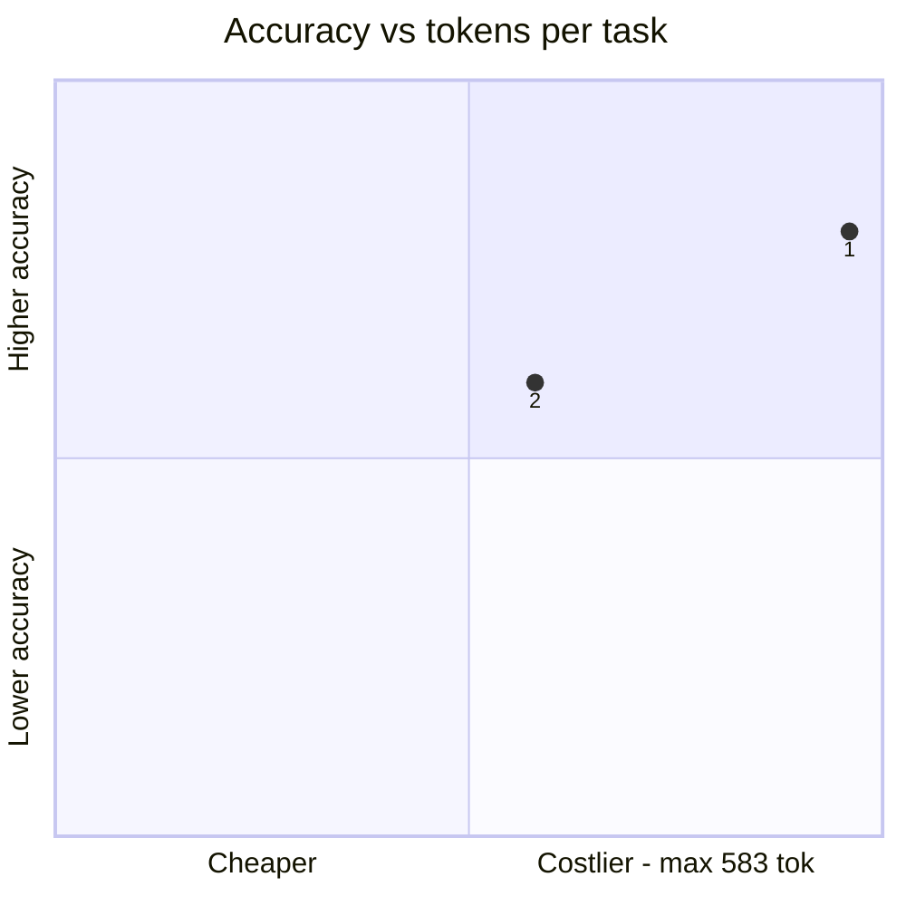
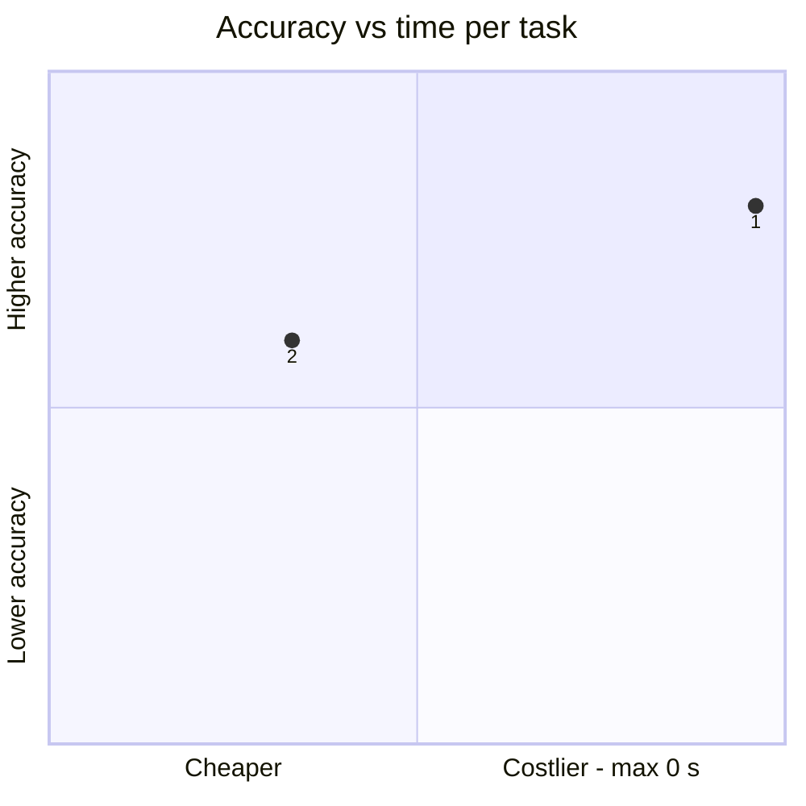
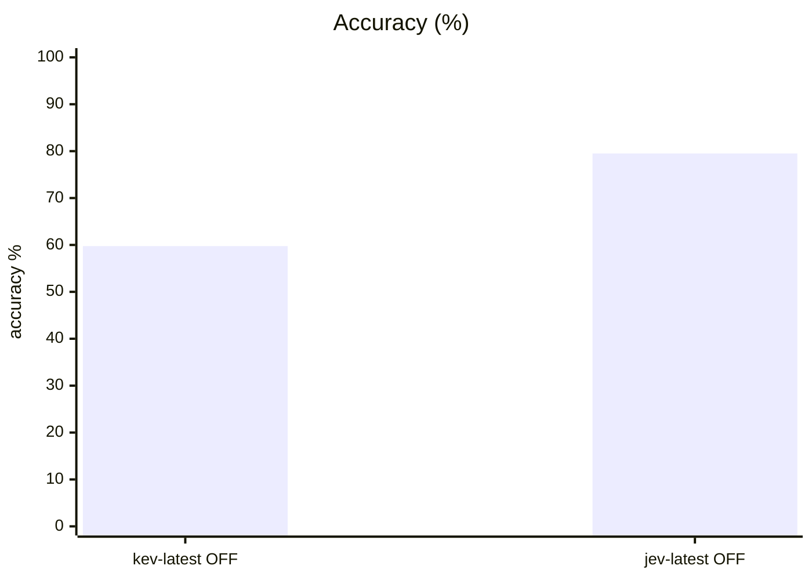
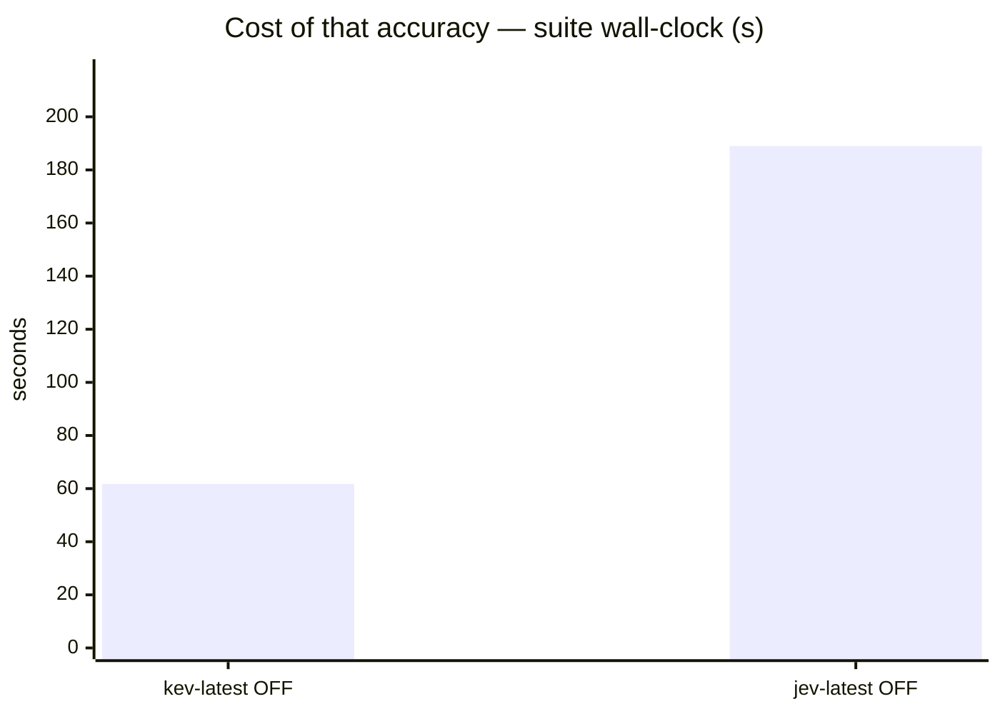
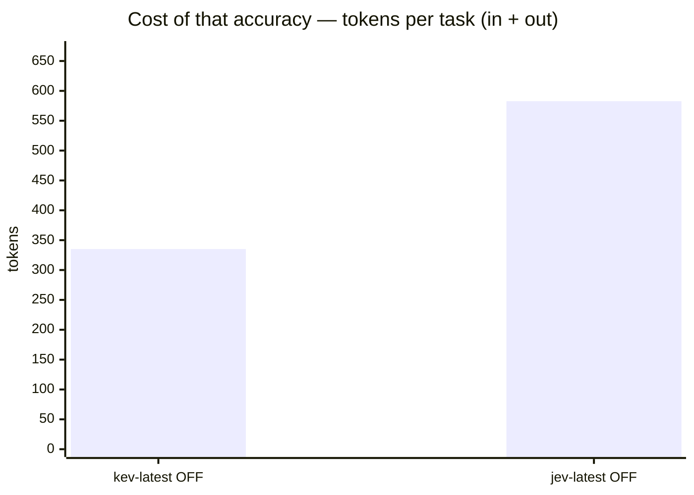
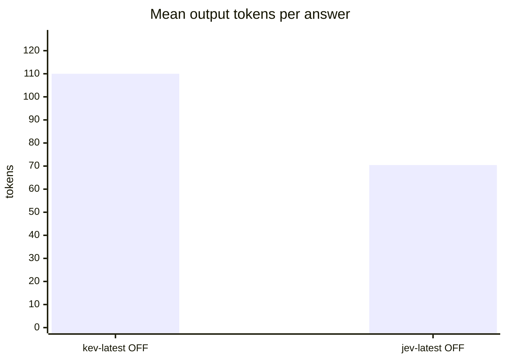

# Kev-4B (local, kev.serve bf16) vs TypeSafe Jev-1.13.0 on system1 v2

**Question.** Should local Kev-4B replace TypeSafe Jev behind the standard s1 endpoint?

**Verdict.** Keep Jev-1.13.0: 79.5% (CI 76.6-82.2) vs Kev-4B 59.8% (CI 56.3-63.1) on system1 v2 — a +19.8pp margin far outside noise, with Jev ahead in all ten families. Kev-4B is ~3x faster per question (0.077s vs 0.236s, local vs WAN) and needs no API key, so it stays the proven local fallback, but its v2 accuracy is not a drop-in replacement. The legacy 98% tie is confirmed as dataset saturation, not parity.

## Setup

| | |
|---|---|
| Endpoint | `http://localhost:8124` |
| Tasks | 400 |
| Samples per task | 2 (⇒ 800 generations per run) |
| Concurrency | 1 |
| Metric | accuracy over exact-match answers on typed decision questions, with a 95% Wilson interval |

## Headline

| Run | Accuracy (95% CI) | Tokens per task | Time per task |
|---|---|---|---|---|
| kev-4b jaredpalmer kev.serve bf16 system1-v2 | 59.8 % (56–63) | 225 in / 110 out | 0.1 s |
| typesafe jev-1.13.0 api.typesafe.ai system1-v2 | 79.5 % (77–82) | 512 in / 70 out | 0.2 s |

<sub>The bracket is the 95% Wilson interval of the solve rate, in points. *Tokens* and *time* are the mean per task attempt (input and output tokens as the endpoint or harness reported them; wall-clock seconds).</sub>

## At a glance

| # | Run | Harness · thinking | Accuracy | Tokens / task | Time / task |
|---|---|---|---|---|---|
| 1 | typesafe jev-1.13.0 api.typesafe.ai system1-v2 | built-in loop · OFF | `████████░░` 80 % <sub>(77–82)</sub> | `██████████` 583 | `██████████` 0 s |
| 2 | kev-4b jaredpalmer kev.serve bf16 system1-v2 | built-in loop · OFF | `██████░░░░` 60 % <sub>(56–63)</sub> | `█████▊░░░░` 335 | `███▎░░░░░░` 0 s |

<sub>Solve-rate bars run 0–100 %, bracket = 95% interval. Token and time bars are scaled to the costliest row — shorter is cheaper.</sub>





<sub>Points are the `#` column above. Up is better, left is cheaper: the top-left corner is the most solved for the least spent. Cost is scaled to the costliest run.</sub>

## Results

| Run | Accuracy | easy | medium | hard | Wall | Mean out tok | Truncated | tok/s |
|---|---|---|---|---|---|---|---|---|
| kev-4b jaredpalmer kev.serve bf16 system1-v2 | 59.8 % | — | 65.0 % | 58.4 % | 62 s | 110 | 0 | 1,521.9 |
| **typesafe jev-1.13.0 api.typesafe.ai system1-v2** | **79.5 %** | — | 85.0 % | 78.1 % | 189 s | 70 | 0 | 305.9 |









## By difficulty

| Run | easy | medium | hard |
|---|---|---|---|
| kev-4b jaredpalmer kev.serve bf16 system1-v2 | — | `█████▎░░` 65 % | `████▋░░░` 58 % |
| typesafe jev-1.13.0 api.typesafe.ai system1-v2 | — | `██████▊░` 85 % | `██████▎░` 78 % |

## Task by task

<sub>Per-task solve rate (%). Tasks the runs disagree on are listed first, widest gap on top.</sub>

| Task | kev-latest OFF | jev-latest OFF |
|---|---|---|
| `access_01/q2` | 🟥 0 | 🟩 100 |
| `access_04/q2` | 🟥 0 | 🟩 100 |
| `access_05/q1` | 🟥 0 | 🟩 100 |
| `access_09/q1` | 🟥 0 | 🟩 100 |
| `access_10/q2` | 🟥 0 | 🟩 100 |
| `access_13/q2` | 🟩 100 | 🟥 0 |
| `access_15/q1` | 🟥 0 | 🟩 100 |
| `access_15/q2` | 🟥 0 | 🟩 100 |
| `access_17/q2` | 🟥 0 | 🟩 100 |
| `access_20/q2` | 🟥 0 | 🟩 100 |
| `dependencies_02/q1` | 🟥 0 | 🟩 100 |
| `dependencies_02/q2` | 🟥 0 | 🟩 100 |
| `dependencies_03/q1` | 🟥 0 | 🟩 100 |
| `dependencies_03/q2` | 🟥 0 | 🟩 100 |
| `dependencies_04/q1` | 🟥 0 | 🟩 100 |
| `dependencies_06/q1` | 🟥 0 | 🟩 100 |
| `dependencies_06/q2` | 🟥 0 | 🟩 100 |
| `dependencies_08/q1` | 🟥 0 | 🟩 100 |
| `dependencies_09/q1` | 🟥 0 | 🟩 100 |
| `dependencies_09/q2` | 🟥 0 | 🟩 100 |
| `dependencies_11/q1` | 🟥 0 | 🟩 100 |
| `dependencies_13/q1` | 🟩 100 | 🟥 0 |
| `dependencies_16/q1` | 🟥 0 | 🟩 100 |
| `dependencies_19/q2` | 🟥 0 | 🟩 100 |
| `events_02/q2` | 🟥 0 | 🟩 100 |
| `events_03/q2` | 🟥 0 | 🟩 100 |
| `events_04/q1` | 🟩 100 | 🟥 0 |
| `events_05/q2` | 🟥 0 | 🟩 100 |
| `events_06/q2` | 🟥 0 | 🟩 100 |
| `events_08/q1` | 🟩 100 | 🟥 0 |
| `events_09/q2` | 🟥 0 | 🟩 100 |
| `events_10/q2` | 🟥 0 | 🟩 100 |
| `events_11/q2` | 🟥 0 | 🟩 100 |
| `events_12/q2` | 🟥 0 | 🟩 100 |
| `events_14/q2` | 🟥 0 | 🟩 100 |
| `events_15/q1` | 🟥 0 | 🟩 100 |
| `events_15/q2` | 🟥 0 | 🟩 100 |
| `events_19/q1` | 🟥 0 | 🟩 100 |
| `events_19/q2` | 🟥 0 | 🟩 100 |
| `events_20/q2` | 🟥 0 | 🟩 100 |
| `evidence_02/q2` | 🟥 0 | 🟩 100 |
| `evidence_06/q1` | 🟥 0 | 🟩 100 |
| `evidence_08/q2` | 🟥 0 | 🟩 100 |
| `evidence_10/q2` | 🟥 0 | 🟩 100 |
| `evidence_11/q1` | 🟥 0 | 🟩 100 |
| `evidence_15/q2` | 🟥 0 | 🟩 100 |
| `evidence_18/q2` | 🟥 0 | 🟩 100 |
| `evidence_20/q2` | 🟥 0 | 🟩 100 |
| `inventory_01/q2` | 🟥 0 | 🟩 100 |
| `inventory_06/q2` | 🟥 0 | 🟩 100 |
| `inventory_07/q1` | 🟥 0 | 🟩 100 |
| `inventory_13/q2` | 🟥 0 | 🟩 100 |
| `inventory_14/q1` | 🟥 0 | 🟩 100 |
| `inventory_16/q1` | 🟥 0 | 🟩 100 |
| `inventory_16/q2` | 🟥 0 | 🟩 100 |
| `inventory_18/q1` | 🟥 0 | 🟩 100 |
| `inventory_19/q2` | 🟥 0 | 🟩 100 |
| `inventory_20/q2` | 🟥 0 | 🟩 100 |
| `money_03/q1` | 🟩 100 | 🟥 0 |
| `money_04/q1` | 🟥 0 | 🟩 100 |
| `money_06/q2` | 🟥 0 | 🟩 100 |
| `money_08/q1` | 🟩 100 | 🟥 0 |
| `money_08/q2` | 🟩 100 | 🟥 0 |
| `money_14/q1` | 🟩 100 | 🟥 0 |
| `money_15/q1` | 🟥 0 | 🟩 100 |
| `money_19/q2` | 🟥 0 | 🟩 100 |
| `money_20/q2` | 🟩 100 | 🟥 0 |
| `policy_02/q1` | 🟥 0 | 🟩 100 |
| `policy_02/q2` | 🟥 0 | 🟩 100 |
| `policy_03/q1` | 🟥 0 | 🟩 100 |
| `policy_03/q2` | 🟥 0 | 🟩 100 |
| `policy_04/q1` | 🟩 100 | 🟥 0 |
| `policy_04/q2` | 🟩 100 | 🟥 0 |
| `policy_06/q1` | 🟥 0 | 🟩 100 |
| `policy_06/q2` | 🟥 0 | 🟩 100 |
| `policy_07/q1` | 🟥 0 | 🟩 100 |
| `policy_07/q2` | 🟥 0 | 🟩 100 |
| `policy_10/q2` | 🟥 0 | 🟩 100 |
| `policy_11/q1` | 🟩 100 | 🟥 0 |
| `policy_13/q2` | 🟥 0 | 🟩 100 |
| `policy_15/q2` | 🟥 0 | 🟩 100 |
| `records_01/q1` | 🟥 0 | 🟩 100 |
| `records_09/q1` | 🟥 0 | 🟩 100 |
| `records_09/q2` | 🟥 0 | 🟩 100 |
| `records_11/q2` | 🟥 0 | 🟩 100 |
| `records_13/q1` | 🟥 0 | 🟩 100 |
| `records_16/q2` | 🟥 0 | 🟩 100 |
| `records_18/q1` | 🟥 0 | 🟩 100 |
| `records_18/q2` | 🟥 0 | 🟩 100 |
| `records_19/q2` | 🟥 0 | 🟩 100 |
| `records_20/q1` | 🟥 0 | 🟩 100 |
| `records_20/q2` | 🟥 0 | 🟩 100 |
| `time_02/q1` | 🟥 0 | 🟩 100 |
| `time_02/q2` | 🟥 0 | 🟩 100 |
| `triage_03/q1` | 🟥 0 | 🟩 100 |
| `triage_08/q1` | 🟩 100 | 🟥 0 |
| `triage_11/q2` | 🟥 0 | 🟩 100 |
| `triage_13/q1` | 🟥 0 | 🟩 100 |
| `triage_13/q2` | 🟥 0 | 🟩 100 |
| `triage_20/q1` | 🟥 0 | 🟩 100 |
| `triage_20/q2` | 🟥 0 | 🟩 100 |
| `access_14/q1` | 🟥 0 | 🟨 50 |
| `access_14/q2` | 🟥 0 | 🟨 50 |
| `events_13/q1` | 🟩 100 | 🟨 50 |
| `events_13/q2` | 🟩 100 | 🟨 50 |
| `inventory_13/q1` | 🟥 0 | 🟨 50 |
| `money_07/q1` | 🟥 0 | 🟨 50 |
| `money_07/q2` | 🟥 0 | 🟨 50 |
| `money_13/q1` | 🟥 0 | 🟨 50 |
| `money_19/q1` | 🟥 0 | 🟨 50 |
| `policy_11/q2` | 🟩 100 | 🟨 50 |
| `policy_14/q1` | 🟥 0 | 🟨 50 |
| `policy_15/q1` | 🟥 0 | 🟨 50 |
| `records_06/q1` | 🟥 0 | 🟨 50 |
| `records_08/q1` | 🟥 0 | 🟨 50 |
| `records_11/q1` | 🟥 0 | 🟨 50 |
| `triage_08/q2` | 🟩 100 | 🟨 50 |

- 🟩 **every run solved** (222): `access_01/q1`, `access_02/q1`, `access_02/q2`, `access_03/q1`, `access_03/q2`, `access_04/q1`, `access_05/q2`, `access_06/q1`, `access_06/q2`, `access_07/q1`, `access_07/q2`, `access_08/q1`, `access_10/q1`, `access_11/q1`, `access_11/q2`, `access_12/q1`, `access_12/q2`, `access_13/q1`, `access_16/q1`, `access_16/q2`, `access_17/q1`, `access_18/q1`, `access_18/q2`, `access_19/q1`, `access_19/q2`, `access_20/q1`, `dependencies_01/q1`, `dependencies_01/q2`, `dependencies_04/q2`, `dependencies_05/q2`, `dependencies_08/q2`, `dependencies_10/q1`, `dependencies_10/q2`, `dependencies_11/q2`, `dependencies_12/q1`, `dependencies_12/q2`, `dependencies_13/q2`, `dependencies_14/q1`, `dependencies_14/q2`, `dependencies_15/q1`, `dependencies_15/q2`, `dependencies_17/q1`, `dependencies_17/q2`, `dependencies_18/q1`, `dependencies_18/q2`, `dependencies_19/q1`, `dependencies_20/q1`, `dependencies_20/q2`, `events_01/q1`, `events_01/q2`, `events_02/q1`, `events_03/q1`, `events_04/q2`, `events_05/q1`, `events_06/q1`, `events_07/q1`, `events_07/q2`, `events_08/q2`, `events_09/q1`, `events_11/q1`, `events_12/q1`, `events_14/q1`, `events_16/q1`, `events_16/q2`, `events_18/q1`, `events_18/q2`, `events_20/q1`, `evidence_01/q1`, `evidence_01/q2`, `evidence_02/q1`, `evidence_03/q1`, `evidence_03/q2`, `evidence_04/q1`, `evidence_04/q2`, `evidence_05/q1`, `evidence_05/q2`, `evidence_06/q2`, `evidence_07/q1`, `evidence_07/q2`, `evidence_08/q1`, `evidence_09/q1`, `evidence_09/q2`, `evidence_10/q1`, `evidence_11/q2`, `evidence_12/q1`, `evidence_12/q2`, `evidence_13/q1`, `evidence_13/q2`, `evidence_14/q1`, `evidence_14/q2`, `evidence_15/q1`, `evidence_16/q1`, `evidence_16/q2`, `evidence_17/q1`, `evidence_17/q2`, `evidence_18/q1`, `evidence_19/q1`, `evidence_19/q2`, `evidence_20/q1`, `inventory_02/q1`, `inventory_02/q2`, `inventory_03/q1`, `inventory_03/q2`, `inventory_04/q2`, `inventory_05/q2`, `inventory_08/q1`, `inventory_08/q2`, `inventory_09/q1`, `inventory_09/q2`, `inventory_10/q1`, `inventory_10/q2`, `inventory_11/q1`, `inventory_11/q2`, `inventory_12/q1`, `inventory_12/q2`, `inventory_14/q2`, `inventory_15/q1`, `inventory_15/q2`, `inventory_17/q2`, `inventory_18/q2`, `money_01/q2`, `money_02/q1`, `money_02/q2`, `money_03/q2`, `money_04/q2`, `money_05/q1`, `money_05/q2`, `money_09/q1`, `money_09/q2`, `money_10/q1`, `money_10/q2`, `money_11/q2`, `money_12/q2`, `money_13/q2`, `money_14/q2`, `money_15/q2`, `money_16/q2`, `money_17/q2`, `money_18/q1`, `money_18/q2`, `policy_01/q1`, `policy_01/q2`, `policy_05/q1`, `policy_05/q2`, `policy_08/q1`, `policy_08/q2`, `policy_09/q1`, `policy_09/q2`, `policy_10/q1`, `policy_12/q1`, `policy_12/q2`, `policy_16/q1`, `policy_16/q2`, `policy_18/q1`, `policy_18/q2`, `policy_19/q1`, `policy_19/q2`, `policy_20/q1`, `policy_20/q2`, `records_02/q1`, `records_03/q1`, `records_04/q1`, `records_04/q2`, `records_05/q1`, `records_05/q2`, `records_10/q1`, `records_14/q1`, `records_15/q1`, `records_16/q1`, `records_19/q1`, `time_01/q1`, `time_01/q2`, `time_03/q1`, `time_03/q2`, `time_04/q1`, `time_04/q2`, `time_06/q1`, `time_06/q2`, `time_07/q1`, `time_07/q2`, `time_10/q1`, `time_12/q1`, `time_12/q2`, `time_13/q1`, `time_13/q2`, `time_15/q1`, `time_15/q2`, `time_16/q1`, `time_16/q2`, `time_17/q1`, `time_17/q2`, `time_18/q1`, `triage_02/q1`, `triage_02/q2`, `triage_03/q2`, `triage_04/q1`, `triage_04/q2`, `triage_05/q1`, `triage_05/q2`, `triage_06/q1`, `triage_06/q2`, `triage_07/q1`, `triage_07/q2`, `triage_09/q1`, `triage_09/q2`, `triage_10/q1`, `triage_10/q2`, `triage_11/q1`, `triage_12/q1`, `triage_12/q2`, `triage_14/q1`, `triage_14/q2`, `triage_15/q1`, `triage_15/q2`, `triage_16/q1`, `triage_16/q2`, `triage_17/q1`, `triage_17/q2`, `triage_18/q1`, `triage_18/q2`, `triage_19/q1`, `triage_19/q2`
- 🟥 **every run failed** (61): `access_08/q2`, `access_09/q2`, `dependencies_05/q1`, `dependencies_07/q1`, `dependencies_07/q2`, `dependencies_16/q2`, `events_10/q1`, `events_17/q1`, `events_17/q2`, `inventory_01/q1`, `inventory_04/q1`, `inventory_05/q1`, `inventory_06/q1`, `inventory_07/q2`, `inventory_17/q1`, `inventory_19/q1`, `inventory_20/q1`, `money_01/q1`, `money_06/q1`, `money_11/q1`, `money_12/q1`, `money_16/q1`, `money_17/q1`, `money_20/q1`, `policy_13/q1`, `policy_14/q2`, `policy_17/q1`, `policy_17/q2`, `records_01/q2`, `records_02/q2`, `records_03/q2`, `records_06/q2`, `records_07/q1`, `records_07/q2`, `records_08/q2`, `records_10/q2`, `records_12/q1`, `records_12/q2`, `records_13/q2`, `records_14/q2`, `records_15/q2`, `records_17/q1`, `records_17/q2`, `time_05/q1`, `time_05/q2`, `time_08/q1`, `time_08/q2`, `time_09/q1`, `time_09/q2`, `time_10/q2`, `time_11/q1`, `time_11/q2`, `time_14/q1`, `time_14/q2`, `time_18/q2`, `time_19/q1`, `time_19/q2`, `time_20/q1`, `time_20/q2`, `triage_01/q1`, `triage_01/q2`

## Where they disagree — typesafe jev-1.13.0 api.typesafe.ai system1-v2 vs kev-4b jaredpalmer kev.serve bf16 system1-v2

| Task | typesafe jev-1.13.0 api.typesafe.ai system1-v2 | kev-4b jaredpalmer kev.serve bf16 system1-v2 | Winner |
|---|---|---|---|
| `access_01/q2` | 100 % | 0 % | typesafe jev-1.13.0 api.typesafe.ai system1-v2 |
| `access_04/q2` | 100 % | 0 % | typesafe jev-1.13.0 api.typesafe.ai system1-v2 |
| `access_05/q1` | 100 % | 0 % | typesafe jev-1.13.0 api.typesafe.ai system1-v2 |
| `access_09/q1` | 100 % | 0 % | typesafe jev-1.13.0 api.typesafe.ai system1-v2 |
| `access_10/q2` | 100 % | 0 % | typesafe jev-1.13.0 api.typesafe.ai system1-v2 |
| `access_13/q2` | 0 % | 100 % | kev-4b jaredpalmer kev.serve bf16 system1-v2 |
| `access_14/q1` | 50 % | 0 % | typesafe jev-1.13.0 api.typesafe.ai system1-v2 |
| `access_14/q2` | 50 % | 0 % | typesafe jev-1.13.0 api.typesafe.ai system1-v2 |
| `access_15/q1` | 100 % | 0 % | typesafe jev-1.13.0 api.typesafe.ai system1-v2 |
| `access_15/q2` | 100 % | 0 % | typesafe jev-1.13.0 api.typesafe.ai system1-v2 |
| `access_17/q2` | 100 % | 0 % | typesafe jev-1.13.0 api.typesafe.ai system1-v2 |
| `access_20/q2` | 100 % | 0 % | typesafe jev-1.13.0 api.typesafe.ai system1-v2 |
| `dependencies_02/q1` | 100 % | 0 % | typesafe jev-1.13.0 api.typesafe.ai system1-v2 |
| `dependencies_02/q2` | 100 % | 0 % | typesafe jev-1.13.0 api.typesafe.ai system1-v2 |
| `dependencies_03/q1` | 100 % | 0 % | typesafe jev-1.13.0 api.typesafe.ai system1-v2 |
| `dependencies_03/q2` | 100 % | 0 % | typesafe jev-1.13.0 api.typesafe.ai system1-v2 |
| `dependencies_04/q1` | 100 % | 0 % | typesafe jev-1.13.0 api.typesafe.ai system1-v2 |
| `dependencies_06/q1` | 100 % | 0 % | typesafe jev-1.13.0 api.typesafe.ai system1-v2 |
| `dependencies_06/q2` | 100 % | 0 % | typesafe jev-1.13.0 api.typesafe.ai system1-v2 |
| `dependencies_08/q1` | 100 % | 0 % | typesafe jev-1.13.0 api.typesafe.ai system1-v2 |
| `dependencies_09/q1` | 100 % | 0 % | typesafe jev-1.13.0 api.typesafe.ai system1-v2 |
| `dependencies_09/q2` | 100 % | 0 % | typesafe jev-1.13.0 api.typesafe.ai system1-v2 |
| `dependencies_11/q1` | 100 % | 0 % | typesafe jev-1.13.0 api.typesafe.ai system1-v2 |
| `dependencies_13/q1` | 0 % | 100 % | kev-4b jaredpalmer kev.serve bf16 system1-v2 |
| `dependencies_16/q1` | 100 % | 0 % | typesafe jev-1.13.0 api.typesafe.ai system1-v2 |
| `dependencies_19/q2` | 100 % | 0 % | typesafe jev-1.13.0 api.typesafe.ai system1-v2 |
| `events_02/q2` | 100 % | 0 % | typesafe jev-1.13.0 api.typesafe.ai system1-v2 |
| `events_03/q2` | 100 % | 0 % | typesafe jev-1.13.0 api.typesafe.ai system1-v2 |
| `events_04/q1` | 0 % | 100 % | kev-4b jaredpalmer kev.serve bf16 system1-v2 |
| `events_05/q2` | 100 % | 0 % | typesafe jev-1.13.0 api.typesafe.ai system1-v2 |
| `events_06/q2` | 100 % | 0 % | typesafe jev-1.13.0 api.typesafe.ai system1-v2 |
| `events_08/q1` | 0 % | 100 % | kev-4b jaredpalmer kev.serve bf16 system1-v2 |
| `events_09/q2` | 100 % | 0 % | typesafe jev-1.13.0 api.typesafe.ai system1-v2 |
| `events_10/q2` | 100 % | 0 % | typesafe jev-1.13.0 api.typesafe.ai system1-v2 |
| `events_11/q2` | 100 % | 0 % | typesafe jev-1.13.0 api.typesafe.ai system1-v2 |
| `events_12/q2` | 100 % | 0 % | typesafe jev-1.13.0 api.typesafe.ai system1-v2 |
| `events_13/q1` | 50 % | 100 % | kev-4b jaredpalmer kev.serve bf16 system1-v2 |
| `events_13/q2` | 50 % | 100 % | kev-4b jaredpalmer kev.serve bf16 system1-v2 |
| `events_14/q2` | 100 % | 0 % | typesafe jev-1.13.0 api.typesafe.ai system1-v2 |
| `events_15/q1` | 100 % | 0 % | typesafe jev-1.13.0 api.typesafe.ai system1-v2 |
| `events_15/q2` | 100 % | 0 % | typesafe jev-1.13.0 api.typesafe.ai system1-v2 |
| `events_19/q1` | 100 % | 0 % | typesafe jev-1.13.0 api.typesafe.ai system1-v2 |
| `events_19/q2` | 100 % | 0 % | typesafe jev-1.13.0 api.typesafe.ai system1-v2 |
| `events_20/q2` | 100 % | 0 % | typesafe jev-1.13.0 api.typesafe.ai system1-v2 |
| `evidence_02/q2` | 100 % | 0 % | typesafe jev-1.13.0 api.typesafe.ai system1-v2 |
| `evidence_06/q1` | 100 % | 0 % | typesafe jev-1.13.0 api.typesafe.ai system1-v2 |
| `evidence_08/q2` | 100 % | 0 % | typesafe jev-1.13.0 api.typesafe.ai system1-v2 |
| `evidence_10/q2` | 100 % | 0 % | typesafe jev-1.13.0 api.typesafe.ai system1-v2 |
| `evidence_11/q1` | 100 % | 0 % | typesafe jev-1.13.0 api.typesafe.ai system1-v2 |
| `evidence_15/q2` | 100 % | 0 % | typesafe jev-1.13.0 api.typesafe.ai system1-v2 |
| `evidence_18/q2` | 100 % | 0 % | typesafe jev-1.13.0 api.typesafe.ai system1-v2 |
| `evidence_20/q2` | 100 % | 0 % | typesafe jev-1.13.0 api.typesafe.ai system1-v2 |
| `inventory_01/q2` | 100 % | 0 % | typesafe jev-1.13.0 api.typesafe.ai system1-v2 |
| `inventory_06/q2` | 100 % | 0 % | typesafe jev-1.13.0 api.typesafe.ai system1-v2 |
| `inventory_07/q1` | 100 % | 0 % | typesafe jev-1.13.0 api.typesafe.ai system1-v2 |
| `inventory_13/q1` | 50 % | 0 % | typesafe jev-1.13.0 api.typesafe.ai system1-v2 |
| `inventory_13/q2` | 100 % | 0 % | typesafe jev-1.13.0 api.typesafe.ai system1-v2 |
| `inventory_14/q1` | 100 % | 0 % | typesafe jev-1.13.0 api.typesafe.ai system1-v2 |
| `inventory_16/q1` | 100 % | 0 % | typesafe jev-1.13.0 api.typesafe.ai system1-v2 |
| `inventory_16/q2` | 100 % | 0 % | typesafe jev-1.13.0 api.typesafe.ai system1-v2 |
| `inventory_18/q1` | 100 % | 0 % | typesafe jev-1.13.0 api.typesafe.ai system1-v2 |
| `inventory_19/q2` | 100 % | 0 % | typesafe jev-1.13.0 api.typesafe.ai system1-v2 |
| `inventory_20/q2` | 100 % | 0 % | typesafe jev-1.13.0 api.typesafe.ai system1-v2 |
| `money_03/q1` | 0 % | 100 % | kev-4b jaredpalmer kev.serve bf16 system1-v2 |
| `money_04/q1` | 100 % | 0 % | typesafe jev-1.13.0 api.typesafe.ai system1-v2 |
| `money_06/q2` | 100 % | 0 % | typesafe jev-1.13.0 api.typesafe.ai system1-v2 |
| `money_07/q1` | 50 % | 0 % | typesafe jev-1.13.0 api.typesafe.ai system1-v2 |
| `money_07/q2` | 50 % | 0 % | typesafe jev-1.13.0 api.typesafe.ai system1-v2 |
| `money_08/q1` | 0 % | 100 % | kev-4b jaredpalmer kev.serve bf16 system1-v2 |
| `money_08/q2` | 0 % | 100 % | kev-4b jaredpalmer kev.serve bf16 system1-v2 |
| `money_13/q1` | 50 % | 0 % | typesafe jev-1.13.0 api.typesafe.ai system1-v2 |
| `money_14/q1` | 0 % | 100 % | kev-4b jaredpalmer kev.serve bf16 system1-v2 |
| `money_15/q1` | 100 % | 0 % | typesafe jev-1.13.0 api.typesafe.ai system1-v2 |
| `money_19/q1` | 50 % | 0 % | typesafe jev-1.13.0 api.typesafe.ai system1-v2 |
| `money_19/q2` | 100 % | 0 % | typesafe jev-1.13.0 api.typesafe.ai system1-v2 |
| `money_20/q2` | 0 % | 100 % | kev-4b jaredpalmer kev.serve bf16 system1-v2 |
| `policy_02/q1` | 100 % | 0 % | typesafe jev-1.13.0 api.typesafe.ai system1-v2 |
| `policy_02/q2` | 100 % | 0 % | typesafe jev-1.13.0 api.typesafe.ai system1-v2 |
| `policy_03/q1` | 100 % | 0 % | typesafe jev-1.13.0 api.typesafe.ai system1-v2 |
| `policy_03/q2` | 100 % | 0 % | typesafe jev-1.13.0 api.typesafe.ai system1-v2 |
| `policy_04/q1` | 0 % | 100 % | kev-4b jaredpalmer kev.serve bf16 system1-v2 |
| `policy_04/q2` | 0 % | 100 % | kev-4b jaredpalmer kev.serve bf16 system1-v2 |
| `policy_06/q1` | 100 % | 0 % | typesafe jev-1.13.0 api.typesafe.ai system1-v2 |
| `policy_06/q2` | 100 % | 0 % | typesafe jev-1.13.0 api.typesafe.ai system1-v2 |
| `policy_07/q1` | 100 % | 0 % | typesafe jev-1.13.0 api.typesafe.ai system1-v2 |
| `policy_07/q2` | 100 % | 0 % | typesafe jev-1.13.0 api.typesafe.ai system1-v2 |
| `policy_10/q2` | 100 % | 0 % | typesafe jev-1.13.0 api.typesafe.ai system1-v2 |
| `policy_11/q1` | 0 % | 100 % | kev-4b jaredpalmer kev.serve bf16 system1-v2 |
| `policy_11/q2` | 50 % | 100 % | kev-4b jaredpalmer kev.serve bf16 system1-v2 |
| `policy_13/q2` | 100 % | 0 % | typesafe jev-1.13.0 api.typesafe.ai system1-v2 |
| `policy_14/q1` | 50 % | 0 % | typesafe jev-1.13.0 api.typesafe.ai system1-v2 |
| `policy_15/q1` | 50 % | 0 % | typesafe jev-1.13.0 api.typesafe.ai system1-v2 |
| `policy_15/q2` | 100 % | 0 % | typesafe jev-1.13.0 api.typesafe.ai system1-v2 |
| `records_01/q1` | 100 % | 0 % | typesafe jev-1.13.0 api.typesafe.ai system1-v2 |
| `records_06/q1` | 50 % | 0 % | typesafe jev-1.13.0 api.typesafe.ai system1-v2 |
| `records_08/q1` | 50 % | 0 % | typesafe jev-1.13.0 api.typesafe.ai system1-v2 |
| `records_09/q1` | 100 % | 0 % | typesafe jev-1.13.0 api.typesafe.ai system1-v2 |
| `records_09/q2` | 100 % | 0 % | typesafe jev-1.13.0 api.typesafe.ai system1-v2 |
| `records_11/q1` | 50 % | 0 % | typesafe jev-1.13.0 api.typesafe.ai system1-v2 |
| `records_11/q2` | 100 % | 0 % | typesafe jev-1.13.0 api.typesafe.ai system1-v2 |
| `records_13/q1` | 100 % | 0 % | typesafe jev-1.13.0 api.typesafe.ai system1-v2 |
| `records_16/q2` | 100 % | 0 % | typesafe jev-1.13.0 api.typesafe.ai system1-v2 |
| `records_18/q1` | 100 % | 0 % | typesafe jev-1.13.0 api.typesafe.ai system1-v2 |
| `records_18/q2` | 100 % | 0 % | typesafe jev-1.13.0 api.typesafe.ai system1-v2 |
| `records_19/q2` | 100 % | 0 % | typesafe jev-1.13.0 api.typesafe.ai system1-v2 |
| `records_20/q1` | 100 % | 0 % | typesafe jev-1.13.0 api.typesafe.ai system1-v2 |
| `records_20/q2` | 100 % | 0 % | typesafe jev-1.13.0 api.typesafe.ai system1-v2 |
| `time_02/q1` | 100 % | 0 % | typesafe jev-1.13.0 api.typesafe.ai system1-v2 |
| `time_02/q2` | 100 % | 0 % | typesafe jev-1.13.0 api.typesafe.ai system1-v2 |
| `triage_03/q1` | 100 % | 0 % | typesafe jev-1.13.0 api.typesafe.ai system1-v2 |
| `triage_08/q1` | 0 % | 100 % | kev-4b jaredpalmer kev.serve bf16 system1-v2 |
| `triage_08/q2` | 50 % | 100 % | kev-4b jaredpalmer kev.serve bf16 system1-v2 |
| `triage_11/q2` | 100 % | 0 % | typesafe jev-1.13.0 api.typesafe.ai system1-v2 |
| `triage_13/q1` | 100 % | 0 % | typesafe jev-1.13.0 api.typesafe.ai system1-v2 |
| `triage_13/q2` | 100 % | 0 % | typesafe jev-1.13.0 api.typesafe.ai system1-v2 |
| `triage_20/q1` | 100 % | 0 % | typesafe jev-1.13.0 api.typesafe.ai system1-v2 |
| `triage_20/q2` | 100 % | 0 % | typesafe jev-1.13.0 api.typesafe.ai system1-v2 |

## Cost per task

<sub>Mean per attempt: input / output tokens, then wall-clock seconds. *not reported* = no usage reported for that task; *–* = the run has no cost record for it.</sub>

| Task | kev-4b jaredpalmer kev.serve bf16 system1-v2 | typesafe jev-1.13.0 api.typesafe.ai system1-v2 |
|---|---|---|
| `access_01/q1` | 149 / 52 · 0.1 s | 415 / 31 · 0.2 s |
| `access_01/q2` | 163 / 97 · 0.0 s | 442 / 61 · 0.2 s |
| `access_02/q1` | 149 / 52 · 0.1 s | 415 / 31 · 0.2 s |
| `access_02/q2` | 163 / 97 · 0.1 s | 442 / 62 · 0.2 s |
| `access_03/q1` | 149 / 52 · 0.1 s | 415 / 31 · 0.2 s |
| `access_03/q2` | 163 / 97 · 0.0 s | 442 / 61 · 0.3 s |
| `access_04/q1` | 149 / 52 · 0.1 s | 415 / 31 · 0.3 s |
| `access_04/q2` | 163 / 98 · 0.0 s | 442 / 61 · 0.4 s |
| `access_05/q1` | 149 / 52 · 0.1 s | 415 / 31 · 0.2 s |
| `access_05/q2` | 163 / 98 · 0.0 s | 442 / 61 · 0.2 s |
| `access_06/q1` | 149 / 51 · 0.1 s | 415 / 31 · 0.2 s |
| `access_06/q2` | 163 / 99 · 0.0 s | 442 / 62 · 0.2 s |
| `access_07/q1` | 149 / 52 · 0.1 s | 415 / 31 · 0.2 s |
| `access_07/q2` | 163 / 98 · 0.0 s | 442 / 62 · 0.2 s |
| `access_08/q1` | 149 / 52 · 0.1 s | 415 / 31 · 0.2 s |
| `access_08/q2` | 163 / 97 · 0.0 s | 442 / 61 · 0.2 s |
| `access_09/q1` | 149 / 52 · 0.1 s | 415 / 31 · 0.2 s |
| `access_09/q2` | 163 / 99 · 0.0 s | 442 / 62 · 0.3 s |
| `access_10/q1` | 149 / 52 · 0.1 s | 415 / 31 · 0.3 s |
| `access_10/q2` | 163 / 99 · 0.0 s | 442 / 61 · 0.2 s |
| `access_11/q1` | 149 / 52 · 0.1 s | 415 / 31 · 0.2 s |
| `access_11/q2` | 163 / 98 · 0.0 s | 442 / 61 · 0.3 s |
| `access_12/q1` | 149 / 49 · 0.1 s | 415 / 31 · 0.2 s |
| `access_12/q2` | 163 / 97 · 0.0 s | 442 / 61 · 0.2 s |
| `access_13/q1` | 149 / 52 · 0.1 s | 415 / 31 · 0.2 s |
| `access_13/q2` | 163 / 96 · 0.0 s | 442 / 61 · 0.2 s |
| `access_14/q1` | 149 / 52 · 0.1 s | 415 / 31 · 0.2 s |
| `access_14/q2` | 163 / 99 · 0.0 s | 442 / 61 · 0.3 s |
| `access_15/q1` | 149 / 52 · 0.1 s | 415 / 31 · 0.2 s |
| `access_15/q2` | 163 / 99 · 0.0 s | 442 / 61 · 0.2 s |
| `access_16/q1` | 149 / 52 · 0.1 s | 415 / 31 · 0.2 s |
| `access_16/q2` | 163 / 96 · 0.0 s | 442 / 62 · 0.2 s |
| `access_17/q1` | 149 / 52 · 0.1 s | 415 / 31 · 0.3 s |
| `access_17/q2` | 163 / 98 · 0.0 s | 442 / 61 · 0.2 s |
| `access_18/q1` | 149 / 52 · 0.1 s | 415 / 31 · 0.2 s |
| `access_18/q2` | 163 / 99 · 0.0 s | 442 / 62 · 0.2 s |
| `access_19/q1` | 149 / 52 · 0.1 s | 415 / 31 · 0.2 s |
| `access_19/q2` | 163 / 98 · 0.1 s | 442 / 62 · 0.2 s |
| `access_20/q1` | 149 / 50 · 0.1 s | 415 / 31 · 0.2 s |
| `access_20/q2` | 163 / 99 · 0.1 s | 442 / 61 · 0.2 s |
| `dependencies_01/q1` | 253 / 74 · 0.1 s | 533 / 45 · 0.2 s |
| `dependencies_01/q2` | 267 / 88 · 0.1 s | 552 / 58 · 0.3 s |
| `dependencies_02/q1` | 253 / 74 · 0.1 s | 533 / 45 · 0.2 s |
| `dependencies_02/q2` | 267 / 89 · 0.1 s | 552 / 62 · 0.3 s |
| `dependencies_03/q1` | 253 / 74 · 0.1 s | 533 / 45 · 0.3 s |
| `dependencies_03/q2` | 267 / 88 · 0.1 s | 552 / 59 · 0.2 s |
| `dependencies_04/q1` | 253 / 74 · 0.1 s | 533 / 45 · 0.2 s |
| `dependencies_04/q2` | 267 / 89 · 0.1 s | 552 / 59 · 0.3 s |
| `dependencies_05/q1` | 254 / 74 · 0.1 s | 534 / 45 · 0.3 s |
| `dependencies_05/q2` | 268 / 89 · 0.1 s | 553 / 58 · 0.2 s |
| `dependencies_06/q1` | 253 / 74 · 0.1 s | 533 / 45 · 0.2 s |
| `dependencies_06/q2` | 267 / 89 · 0.1 s | 552 / 59 · 0.3 s |
| `dependencies_07/q1` | 254 / 74 · 0.1 s | 534 / 45 · 0.2 s |
| `dependencies_07/q2` | 268 / 89 · 0.1 s | 553 / 58 · 0.2 s |
| `dependencies_08/q1` | 253 / 74 · 0.1 s | 533 / 45 · 0.2 s |
| `dependencies_08/q2` | 267 / 89 · 0.1 s | 552 / 59 · 0.2 s |
| `dependencies_09/q1` | 253 / 74 · 0.1 s | 533 / 45 · 0.3 s |
| `dependencies_09/q2` | 267 / 89 · 0.1 s | 552 / 62 · 0.2 s |
| `dependencies_10/q1` | 253 / 74 · 0.1 s | 533 / 45 · 0.2 s |
| `dependencies_10/q2` | 267 / 89 · 0.1 s | 552 / 58 · 0.2 s |
| `dependencies_11/q1` | 253 / 74 · 0.1 s | 533 / 45 · 0.2 s |
| `dependencies_11/q2` | 267 / 88 · 0.1 s | 552 / 58 · 0.3 s |
| `dependencies_12/q1` | 253 / 73 · 0.1 s | 533 / 45 · 0.2 s |
| `dependencies_12/q2` | 267 / 89 · 0.1 s | 552 / 58 · 0.3 s |
| `dependencies_13/q1` | 253 / 74 · 0.1 s | 533 / 45 · 0.4 s |
| `dependencies_13/q2` | 267 / 90 · 0.1 s | 552 / 59 · 0.2 s |
| `dependencies_14/q1` | 253 / 74 · 0.1 s | 533 / 45 · 0.2 s |
| `dependencies_14/q2` | 267 / 88 · 0.1 s | 552 / 59 · 0.2 s |
| `dependencies_15/q1` | 253 / 72 · 0.1 s | 533 / 45 · 0.2 s |
| `dependencies_15/q2` | 267 / 88 · 0.1 s | 552 / 58 · 0.2 s |
| `dependencies_16/q1` | 254 / 73 · 0.1 s | 534 / 45 · 0.2 s |
| `dependencies_16/q2` | 268 / 89 · 0.1 s | 553 / 62 · 0.2 s |
| `dependencies_17/q1` | 253 / 72 · 0.1 s | 533 / 45 · 0.2 s |
| `dependencies_17/q2` | 267 / 88 · 0.1 s | 552 / 58 · 0.2 s |
| `dependencies_18/q1` | 253 / 74 · 0.1 s | 533 / 45 · 0.3 s |
| `dependencies_18/q2` | 267 / 88 · 0.1 s | 552 / 58 · 0.2 s |
| `dependencies_19/q1` | 253 / 72 · 0.1 s | 533 / 45 · 0.2 s |
| `dependencies_19/q2` | 267 / 90 · 0.1 s | 552 / 58 · 0.2 s |
| `dependencies_20/q1` | 253 / 74 · 0.1 s | 533 / 45 · 0.2 s |
| `dependencies_20/q2` | 267 / 90 · 0.1 s | 552 / 59 · 0.2 s |
| `events_01/q1` | 172 / 88 · 0.1 s | 454 / 57 · 0.2 s |
| `events_01/q2` | 168 / 74 · 0.1 s | 445 / 45 · 0.2 s |
| `events_02/q1` | 172 / 84 · 0.1 s | 454 / 56 · 0.2 s |
| `events_02/q2` | 168 / 74 · 0.0 s | 445 / 45 · 0.2 s |
| `events_03/q1` | 172 / 86 · 0.1 s | 454 / 58 · 0.2 s |
| `events_03/q2` | 168 / 73 · 0.0 s | 445 / 45 · 0.2 s |
| `events_04/q1` | 172 / 86 · 0.1 s | 454 / 56 · 0.2 s |
| `events_04/q2` | 168 / 74 · 0.0 s | 445 / 45 · 0.2 s |
| `events_05/q1` | 195 / 87 · 0.1 s | 477 / 57 · 0.2 s |
| `events_05/q2` | 191 / 74 · 0.1 s | 468 / 45 · 0.2 s |
| `events_06/q1` | 195 / 88 · 0.1 s | 477 / 57 · 0.2 s |
| `events_06/q2` | 191 / 74 · 0.1 s | 468 / 45 · 0.2 s |
| `events_07/q1` | 192 / 87 · 0.1 s | 474 / 57 · 0.2 s |
| `events_07/q2` | 188 / 74 · 0.0 s | 465 / 45 · 0.3 s |
| `events_08/q1` | 192 / 87 · 0.1 s | 474 / 56 · 0.2 s |
| `events_08/q2` | 188 / 74 · 0.0 s | 465 / 45 · 0.3 s |
| `events_09/q1` | 195 / 85 · 0.1 s | 477 / 57 · 0.2 s |
| `events_09/q2` | 191 / 74 · 0.0 s | 468 / 45 · 0.3 s |
| `events_10/q1` | 195 / 88 · 0.1 s | 477 / 56 · 0.2 s |
| `events_10/q2` | 191 / 74 · 0.0 s | 468 / 45 · 0.3 s |
| `events_11/q1` | 172 / 85 · 0.1 s | 454 / 58 · 0.2 s |
| `events_11/q2` | 168 / 74 · 0.0 s | 445 / 45 · 0.3 s |
| `events_12/q1` | 172 / 87 · 0.1 s | 454 / 56 · 0.3 s |
| `events_12/q2` | 168 / 74 · 0.1 s | 445 / 45 · 0.3 s |
| `events_13/q1` | 218 / 88 · 0.1 s | 500 / 56 · 0.3 s |
| `events_13/q2` | 214 / 74 · 0.0 s | 491 / 45 · 0.3 s |
| `events_14/q1` | 195 / 86 · 0.1 s | 477 / 58 · 0.3 s |
| `events_14/q2` | 191 / 74 · 0.1 s | 468 / 45 · 0.3 s |
| `events_15/q1` | 195 / 86 · 0.1 s | 477 / 57 · 0.3 s |
| `events_15/q2` | 191 / 74 · 0.1 s | 468 / 45 · 0.2 s |
| `events_16/q1` | 166 / 86 · 0.1 s | 448 / 56 · 0.2 s |
| `events_16/q2` | 163 / 74 · 0.1 s | 440 / 46 · 0.2 s |
| `events_17/q1` | 195 / 87 · 0.1 s | 477 / 56 · 0.2 s |
| `events_17/q2` | 191 / 74 · 0.1 s | 468 / 45 · 0.2 s |
| `events_18/q1` | 195 / 86 · 0.1 s | 477 / 58 · 0.3 s |
| `events_18/q2` | 191 / 74 · 0.1 s | 468 / 45 · 0.2 s |
| `events_19/q1` | 172 / 86 · 0.1 s | 454 / 56 · 0.2 s |
| `events_19/q2` | 169 / 75 · 0.1 s | 446 / 46 · 0.2 s |
| `events_20/q1` | 218 / 88 · 0.1 s | 500 / 57 · 0.2 s |
| `events_20/q2` | 214 / 74 · 0.1 s | 491 / 45 · 0.2 s |
| `evidence_01/q1` | 124 / 75 · 0.1 s | 404 / 48 · 0.2 s |
| `evidence_01/q2` | 126 / 76 · 0.1 s | 406 / 48 · 0.2 s |
| `evidence_02/q1` | 126 / 77 · 0.1 s | 406 / 49 · 0.2 s |
| `evidence_02/q2` | 126 / 75 · 0.1 s | 406 / 48 · 0.3 s |
| `evidence_03/q1` | 131 / 77 · 0.1 s | 411 / 50 · 0.2 s |
| `evidence_03/q2` | 131 / 75 · 0.1 s | 411 / 48 · 0.2 s |
| `evidence_04/q1` | 128 / 76 · 0.1 s | 408 / 48 · 0.2 s |
| `evidence_04/q2` | 128 / 76 · 0.1 s | 408 / 48 · 0.2 s |
| `evidence_05/q1` | 122 / 75 · 0.1 s | 402 / 48 · 0.2 s |
| `evidence_05/q2` | 123 / 75 · 0.1 s | 403 / 49 · 0.2 s |
| `evidence_06/q1` | 130 / 77 · 0.1 s | 410 / 49 · 0.2 s |
| `evidence_06/q2` | 128 / 76 · 0.1 s | 408 / 48 · 0.2 s |
| `evidence_07/q1` | 127 / 77 · 0.1 s | 407 / 50 · 0.2 s |
| `evidence_07/q2` | 127 / 76 · 0.1 s | 407 / 48 · 0.2 s |
| `evidence_08/q1` | 130 / 76 · 0.1 s | 410 / 48 · 0.2 s |
| `evidence_08/q2` | 129 / 77 · 0.1 s | 409 / 49 · 0.2 s |
| `evidence_09/q1` | 127 / 76 · 0.1 s | 407 / 48 · 0.2 s |
| `evidence_09/q2` | 127 / 77 · 0.1 s | 407 / 49 · 0.2 s |
| `evidence_10/q1` | 125 / 77 · 0.1 s | 405 / 49 · 0.2 s |
| `evidence_10/q2` | 125 / 76 · 0.1 s | 405 / 48 · 0.2 s |
| `evidence_11/q1` | 135 / 75 · 0.1 s | 415 / 50 · 0.2 s |
| `evidence_11/q2` | 135 / 77 · 0.1 s | 415 / 50 · 0.3 s |
| `evidence_12/q1` | 129 / 76 · 0.1 s | 409 / 48 · 0.2 s |
| `evidence_12/q2` | 129 / 75 · 0.1 s | 409 / 48 · 0.2 s |
| `evidence_13/q1` | 127 / 76 · 0.1 s | 407 / 48 · 0.2 s |
| `evidence_13/q2` | 132 / 76 · 0.1 s | 413 / 49 · 0.2 s |
| `evidence_14/q1` | 127 / 76 · 0.1 s | 407 / 49 · 0.2 s |
| `evidence_14/q2` | 128 / 74 · 0.1 s | 409 / 48 · 0.3 s |
| `evidence_15/q1` | 130 / 75 · 0.1 s | 410 / 50 · 0.2 s |
| `evidence_15/q2` | 130 / 76 · 0.1 s | 410 / 50 · 0.3 s |
| `evidence_16/q1` | 130 / 76 · 0.1 s | 410 / 48 · 0.2 s |
| `evidence_16/q2` | 131 / 76 · 0.0 s | 411 / 48 · 0.2 s |
| `evidence_17/q1` | 128 / 75 · 0.1 s | 408 / 48 · 0.2 s |
| `evidence_17/q2` | 128 / 76 · 0.1 s | 408 / 48 · 0.3 s |
| `evidence_18/q1` | 129 / 76 · 0.1 s | 409 / 49 · 0.2 s |
| `evidence_18/q2` | 128 / 75 · 0.1 s | 408 / 50 · 0.2 s |
| `evidence_19/q1` | 132 / 77 · 0.1 s | 412 / 50 · 0.2 s |
| `evidence_19/q2` | 132 / 77 · 0.1 s | 412 / 49 · 0.3 s |
| `evidence_20/q1` | 136 / 75 · 0.1 s | 417 / 48 · 0.2 s |
| `evidence_20/q2` | 135 / 75 · 0.1 s | 415 / 50 · 0.2 s |
| `inventory_01/q1` | 322 / 66 · 0.1 s | 600 / 41 · 0.2 s |
| `inventory_01/q2` | 327 / 74 · 0.1 s | 608 / 45 · 0.2 s |
| `inventory_02/q1` | 322 / 66 · 0.1 s | 600 / 41 · 0.2 s |
| `inventory_02/q2` | 327 / 74 · 0.1 s | 608 / 45 · 0.3 s |
| `inventory_03/q1` | 322 / 63 · 0.1 s | 600 / 40 · 0.2 s |
| `inventory_03/q2` | 328 / 74 · 0.1 s | 609 / 46 · 0.3 s |
| `inventory_04/q1` | 322 / 64 · 0.1 s | 600 / 40 · 0.2 s |
| `inventory_04/q2` | 327 / 73 · 0.1 s | 608 / 45 · 0.2 s |
| `inventory_05/q1` | 322 / 65 · 0.1 s | 600 / 41 · 0.2 s |
| `inventory_05/q2` | 327 / 74 · 0.1 s | 608 / 45 · 0.2 s |
| `inventory_06/q1` | 322 / 65 · 0.1 s | 600 / 40 · 0.2 s |
| `inventory_06/q2` | 327 / 74 · 0.1 s | 608 / 45 · 0.3 s |
| `inventory_07/q1` | 322 / 66 · 0.1 s | 600 / 41 · 0.2 s |
| `inventory_07/q2` | 327 / 74 · 0.1 s | 608 / 45 · 0.2 s |
| `inventory_08/q1` | 322 / 65 · 0.1 s | 600 / 40 · 0.2 s |
| `inventory_08/q2` | 328 / 75 · 0.1 s | 609 / 46 · 0.2 s |
| `inventory_09/q1` | 322 / 66 · 0.1 s | 600 / 41 · 0.2 s |
| `inventory_09/q2` | 327 / 74 · 0.1 s | 608 / 45 · 0.2 s |
| `inventory_10/q1` | 322 / 64 · 0.1 s | 600 / 40 · 0.2 s |
| `inventory_10/q2` | 328 / 74 · 0.1 s | 609 / 46 · 0.2 s |
| `inventory_11/q1` | 322 / 65 · 0.1 s | 600 / 41 · 0.2 s |
| `inventory_11/q2` | 327 / 74 · 0.1 s | 608 / 45 · 0.2 s |
| `inventory_12/q1` | 322 / 65 · 0.1 s | 600 / 40 · 0.2 s |
| `inventory_12/q2` | 328 / 75 · 0.1 s | 609 / 46 · 0.2 s |
| `inventory_13/q1` | 323 / 66 · 0.1 s | 601 / 41 · 0.2 s |
| `inventory_13/q2` | 331 / 78 · 0.1 s | 612 / 49 · 0.2 s |
| `inventory_14/q1` | 323 / 64 · 0.1 s | 601 / 41 · 0.2 s |
| `inventory_14/q2` | 328 / 74 · 0.1 s | 609 / 45 · 0.3 s |
| `inventory_15/q1` | 322 / 60 · 0.1 s | 600 / 40 · 0.2 s |
| `inventory_15/q2` | 328 / 75 · 0.1 s | 609 / 46 · 0.2 s |
| `inventory_16/q1` | 322 / 65 · 0.1 s | 600 / 41 · 0.2 s |
| `inventory_16/q2` | 327 / 72 · 0.1 s | 608 / 45 · 0.2 s |
| `inventory_17/q1` | 323 / 65 · 0.1 s | 601 / 41 · 0.3 s |
| `inventory_17/q2` | 328 / 74 · 0.1 s | 609 / 45 · 0.2 s |
| `inventory_18/q1` | 323 / 65 · 0.1 s | 601 / 41 · 0.2 s |
| `inventory_18/q2` | 328 / 74 · 0.1 s | 609 / 45 · 0.2 s |
| `inventory_19/q1` | 322 / 63 · 0.1 s | 600 / 40 · 0.2 s |
| `inventory_19/q2` | 327 / 73 · 0.1 s | 608 / 45 · 0.2 s |
| `inventory_20/q1` | 322 / 63 · 0.1 s | 600 / 40 · 0.2 s |
| `inventory_20/q2` | 327 / 74 · 0.1 s | 608 / 45 · 0.2 s |
| `money_01/q1` | 170 / 67 · 0.1 s | 446 / 44 · 0.2 s |
| `money_01/q2` | 187 / 88 · 0.1 s | 465 / 60 · 0.2 s |
| `money_02/q1` | 170 / 67 · 0.1 s | 446 / 44 · 0.3 s |
| `money_02/q2` | 187 / 89 · 0.1 s | 465 / 60 · 0.2 s |
| `money_03/q1` | 170 / 67 · 0.1 s | 446 / 44 · 0.2 s |
| `money_03/q2` | 187 / 89 · 0.1 s | 465 / 60 · 0.2 s |
| `money_04/q1` | 166 / 65 · 0.1 s | 442 / 43 · 0.2 s |
| `money_04/q2` | 182 / 86 · 0.1 s | 460 / 59 · 0.2 s |
| `money_05/q1` | 165 / 67 · 0.1 s | 441 / 44 · 0.2 s |
| `money_05/q2` | 174 / 79 · 0.1 s | 452 / 50 · 0.2 s |
| `money_06/q1` | 165 / 66 · 0.1 s | 441 / 43 · 0.2 s |
| `money_06/q2` | 174 / 79 · 0.1 s | 452 / 50 · 0.2 s |
| `money_07/q1` | 168 / 66 · 0.1 s | 444 / 44 · 0.2 s |
| `money_07/q2` | 183 / 86 · 0.1 s | 461 / 58 · 0.3 s |
| `money_08/q1` | 169 / 67 · 0.1 s | 445 / 44 · 0.3 s |
| `money_08/q2` | 184 / 86 · 0.1 s | 462 / 58 · 0.4 s |
| `money_09/q1` | 168 / 67 · 0.1 s | 444 / 44 · 0.2 s |
| `money_09/q2` | 181 / 81 · 0.1 s | 459 / 55 · 0.2 s |
| `money_10/q1` | 170 / 67 · 0.1 s | 446 / 43 · 0.2 s |
| `money_10/q2` | 183 / 83 · 0.1 s | 461 / 55 · 0.2 s |
| `money_11/q1` | 166 / 67 · 0.1 s | 442 / 44 · 0.2 s |
| `money_11/q2` | 172 / 75 · 0.1 s | 450 / 46 · 0.2 s |
| `money_12/q1` | 166 / 67 · 0.1 s | 442 / 44 · 0.2 s |
| `money_12/q2` | 172 / 75 · 0.1 s | 450 / 46 · 0.2 s |
| `money_13/q1` | 169 / 66 · 0.1 s | 445 / 44 · 0.2 s |
| `money_13/q2` | 182 / 84 · 0.1 s | 460 / 55 · 0.2 s |
| `money_14/q1` | 169 / 66 · 0.1 s | 445 / 43 · 0.3 s |
| `money_14/q2` | 182 / 84 · 0.1 s | 460 / 55 · 0.2 s |
| `money_15/q1` | 165 / 64 · 0.1 s | 441 / 43 · 0.2 s |
| `money_15/q2` | 174 / 79 · 0.1 s | 452 / 50 · 0.2 s |
| `money_16/q1` | 165 / 67 · 0.1 s | 441 / 43 · 0.3 s |
| `money_16/q2` | 174 / 79 · 0.1 s | 452 / 50 · 0.2 s |
| `money_17/q1` | 166 / 67 · 0.1 s | 442 / 44 · 0.2 s |
| `money_17/q2` | 179 / 83 · 0.1 s | 457 / 55 · 0.2 s |
| `money_18/q1` | 166 / 67 · 0.1 s | 442 / 44 · 0.2 s |
| `money_18/q2` | 179 / 83 · 0.1 s | 457 / 55 · 0.2 s |
| `money_19/q1` | 169 / 67 · 0.1 s | 445 / 44 · 0.2 s |
| `money_19/q2` | 182 / 84 · 0.1 s | 460 / 55 · 0.2 s |
| `money_20/q1` | 169 / 67 · 0.1 s | 445 / 44 · 0.2 s |
| `money_20/q2` | 182 / 84 · 0.1 s | 460 / 55 · 0.3 s |
| `policy_01/q1` | 169 / 75 · 0.1 s | 442 / 46 · 0.3 s |
| `policy_01/q2` | 180 / 90 · 0.0 s | 457 / 58 · 0.3 s |
| `policy_02/q1` | 169 / 75 · 0.1 s | 442 / 46 · 0.2 s |
| `policy_02/q2` | 180 / 91 · 0.0 s | 457 / 58 · 0.2 s |
| `policy_03/q1` | 169 / 75 · 0.1 s | 442 / 47 · 0.2 s |
| `policy_03/q2` | 180 / 91 · 0.0 s | 457 / 58 · 0.2 s |
| `policy_04/q1` | 169 / 74 · 0.1 s | 442 / 46 · 0.2 s |
| `policy_04/q2` | 180 / 89 · 0.0 s | 457 / 58 · 0.2 s |
| `policy_05/q1` | 170 / 75 · 0.1 s | 443 / 46 · 0.2 s |
| `policy_05/q2` | 181 / 90 · 0.1 s | 458 / 58 · 0.2 s |
| `policy_06/q1` | 170 / 74 · 0.1 s | 443 / 47 · 0.3 s |
| `policy_06/q2` | 181 / 90 · 0.0 s | 458 / 58 · 0.2 s |
| `policy_07/q1` | 170 / 75 · 0.1 s | 443 / 46 · 0.2 s |
| `policy_07/q2` | 181 / 87 · 0.0 s | 458 / 58 · 0.2 s |
| `policy_08/q1` | 170 / 74 · 0.1 s | 443 / 46 · 0.2 s |
| `policy_08/q2` | 181 / 90 · 0.0 s | 458 / 58 · 0.3 s |
| `policy_09/q1` | 168 / 72 · 0.1 s | 441 / 46 · 0.2 s |
| `policy_09/q2` | 179 / 91 · 0.0 s | 456 / 58 · 0.2 s |
| `policy_10/q1` | 168 / 75 · 0.1 s | 441 / 47 · 0.3 s |
| `policy_10/q2` | 179 / 91 · 0.0 s | 456 / 58 · 0.2 s |
| `policy_11/q1` | 169 / 75 · 0.1 s | 442 / 46 · 0.3 s |
| `policy_11/q2` | 180 / 91 · 0.0 s | 457 / 58 · 0.2 s |
| `policy_12/q1` | 169 / 75 · 0.1 s | 442 / 46 · 0.2 s |
| `policy_12/q2` | 180 / 90 · 0.0 s | 457 / 58 · 0.3 s |
| `policy_13/q1` | 169 / 73 · 0.1 s | 442 / 46 · 0.2 s |
| `policy_13/q2` | 180 / 90 · 0.0 s | 457 / 58 · 0.2 s |
| `policy_14/q1` | 169 / 75 · 0.1 s | 442 / 46 · 0.2 s |
| `policy_14/q2` | 180 / 91 · 0.0 s | 457 / 58 · 0.2 s |
| `policy_15/q1` | 169 / 73 · 0.1 s | 442 / 46 · 0.2 s |
| `policy_15/q2` | 180 / 90 · 0.1 s | 457 / 58 · 0.2 s |
| `policy_16/q1` | 169 / 75 · 0.1 s | 442 / 46 · 0.2 s |
| `policy_16/q2` | 180 / 91 · 0.0 s | 457 / 58 · 0.2 s |
| `policy_17/q1` | 170 / 75 · 0.1 s | 443 / 46 · 0.2 s |
| `policy_17/q2` | 181 / 91 · 0.0 s | 458 / 58 · 0.2 s |
| `policy_18/q1` | 170 / 75 · 0.1 s | 443 / 46 · 0.2 s |
| `policy_18/q2` | 181 / 89 · 0.0 s | 458 / 58 · 0.2 s |
| `policy_19/q1` | 170 / 73 · 0.1 s | 443 / 46 · 0.2 s |
| `policy_19/q2` | 181 / 91 · 0.1 s | 458 / 58 · 0.2 s |
| `policy_20/q1` | 170 / 75 · 0.1 s | 443 / 46 · 0.3 s |
| `policy_20/q2` | 181 / 91 · 0.1 s | 458 / 58 · 0.2 s |
| `records_01/q1` | 386 / 74 · 0.1 s | 665 / 46 · 0.2 s |
| `records_01/q2` | 599 / 756 · 0.1 s | 1,062 / 495 · 0.2 s |
| `records_02/q1` | 343 / 75 · 0.1 s | 622 / 46 · 0.2 s |
| `records_02/q2` | 559 / 760 · 0.2 s | 1,022 / 502 · 0.2 s |
| `records_03/q1` | 386 / 74 · 0.2 s | 665 / 46 · 0.2 s |
| `records_03/q2` | 598 / 755 · 0.1 s | 1,061 / 494 · 0.2 s |
| `records_04/q1` | 353 / 75 · 0.1 s | 632 / 46 · 0.2 s |
| `records_04/q2` | 568 / 757 · 0.1 s | 1,031 / 500 · 0.2 s |
| `records_05/q1` | 393 / 73 · 0.1 s | 672 / 46 · 0.2 s |
| `records_05/q2` | 607 / 758 · 0.1 s | 1,070 / 499 · 0.3 s |
| `records_06/q1` | 384 / 75 · 0.1 s | 663 / 46 · 0.2 s |
| `records_06/q2` | 595 / 755 · 0.1 s | 1,058 / 494 · 0.2 s |
| `records_07/q1` | 386 / 75 · 0.1 s | 665 / 46 · 0.3 s |
| `records_07/q2` | 599 / 755 · 0.1 s | 1,062 / 495 · 0.2 s |
| `records_08/q1` | 384 / 75 · 0.1 s | 663 / 46 · 0.2 s |
| `records_08/q2` | 600 / 760 · 0.1 s | 1,063 / 502 · 0.2 s |
| `records_09/q1` | 398 / 75 · 0.1 s | 677 / 47 · 0.2 s |
| `records_09/q2` | 614 / 761 · 0.1 s | 1,077 / 498 · 0.2 s |
| `records_10/q1` | 391 / 75 · 0.1 s | 670 / 47 · 0.2 s |
| `records_10/q2` | 604 / 758 · 0.1 s | 1,067 / 496 · 0.3 s |
| `records_11/q1` | 343 / 75 · 0.1 s | 622 / 46 · 0.2 s |
| `records_11/q2` | 556 / 761 · 0.1 s | 1,019 / 495 · 0.2 s |
| `records_12/q1` | 343 / 75 · 0.1 s | 622 / 46 · 0.2 s |
| `records_12/q2` | 559 / 759 · 0.1 s | 1,022 / 502 · 0.2 s |
| `records_13/q1` | 343 / 74 · 0.1 s | 622 / 46 · 0.2 s |
| `records_13/q2` | 555 / 752 · 0.1 s | 1,018 / 494 · 0.2 s |
| `records_14/q1` | 353 / 74 · 0.1 s | 632 / 46 · 0.2 s |
| `records_14/q2` | 568 / 753 · 0.1 s | 1,031 / 497 · 0.2 s |
| `records_15/q1` | 349 / 75 · 0.1 s | 628 / 46 · 0.2 s |
| `records_15/q2` | 563 / 753 · 0.1 s | 1,026 / 499 · 0.2 s |
| `records_16/q1` | 259 / 75 · 0.1 s | 538 / 46 · 0.2 s |
| `records_16/q2` | 472 / 755 · 0.1 s | 935 / 495 · 0.2 s |
| `records_17/q1` | 259 / 74 · 0.1 s | 538 / 46 · 0.2 s |
| `records_17/q2` | 475 / 754 · 0.2 s | 938 / 502 · 0.2 s |
| `records_18/q1` | 259 / 75 · 0.1 s | 538 / 46 · 0.2 s |
| `records_18/q2` | 472 / 755 · 0.1 s | 935 / 495 · 0.2 s |
| `records_19/q1` | 266 / 69 · 0.1 s | 545 / 46 · 0.2 s |
| `records_19/q2` | 483 / 751 · 0.1 s | 946 / 499 · 0.3 s |
| `records_20/q1` | 263 / 75 · 0.1 s | 542 / 46 · 0.2 s |
| `records_20/q2` | 481 / 759 · 0.1 s | 944 / 500 · 0.3 s |
| `time_01/q1` | 181 / 52 · 0.1 s | 454 / 31 · 0.2 s |
| `time_01/q2` | 194 / 88 · 0.1 s | 477 / 55 · 0.2 s |
| `time_02/q1` | 181 / 51 · 0.1 s | 454 / 31 · 0.2 s |
| `time_02/q2` | 194 / 88 · 0.1 s | 477 / 55 · 0.2 s |
| `time_03/q1` | 181 / 52 · 0.1 s | 454 / 31 · 0.3 s |
| `time_03/q2` | 194 / 86 · 0.0 s | 477 / 57 · 0.2 s |
| `time_04/q1` | 181 / 52 · 0.1 s | 454 / 31 · 0.2 s |
| `time_04/q2` | 194 / 88 · 0.0 s | 477 / 55 · 0.2 s |
| `time_05/q1` | 181 / 52 · 0.1 s | 454 / 31 · 0.2 s |
| `time_05/q2` | 194 / 86 · 0.1 s | 477 / 55 · 0.2 s |
| `time_06/q1` | 181 / 52 · 0.1 s | 454 / 31 · 0.2 s |
| `time_06/q2` | 194 / 88 · 0.1 s | 477 / 55 · 0.3 s |
| `time_07/q1` | 181 / 52 · 0.1 s | 454 / 31 · 0.2 s |
| `time_07/q2` | 194 / 89 · 0.1 s | 477 / 56 · 0.2 s |
| `time_08/q1` | 181 / 51 · 0.1 s | 454 / 31 · 0.2 s |
| `time_08/q2` | 194 / 90 · 0.1 s | 477 / 57 · 0.2 s |
| `time_09/q1` | 181 / 52 · 0.1 s | 454 / 31 · 0.2 s |
| `time_09/q2` | 194 / 86 · 0.1 s | 477 / 55 · 0.2 s |
| `time_10/q1` | 181 / 50 · 0.1 s | 454 / 31 · 0.2 s |
| `time_10/q2` | 194 / 90 · 0.1 s | 477 / 57 · 0.2 s |
| `time_11/q1` | 233 / 51 · 0.1 s | 507 / 31 · 0.2 s |
| `time_11/q2` | 246 / 87 · 0.1 s | 530 / 55 · 0.2 s |
| `time_12/q1` | 233 / 52 · 0.1 s | 507 / 31 · 0.2 s |
| `time_12/q2` | 246 / 86 · 0.1 s | 530 / 55 · 0.2 s |
| `time_13/q1` | 233 / 52 · 0.1 s | 507 / 31 · 0.3 s |
| `time_13/q2` | 246 / 87 · 0.1 s | 530 / 55 · 0.2 s |
| `time_14/q1` | 233 / 52 · 0.1 s | 507 / 31 · 0.2 s |
| `time_14/q2` | 246 / 88 · 0.1 s | 530 / 55 · 0.2 s |
| `time_15/q1` | 181 / 52 · 0.1 s | 454 / 31 · 0.2 s |
| `time_15/q2` | 194 / 88 · 0.1 s | 477 / 56 · 0.2 s |
| `time_16/q1` | 181 / 52 · 0.1 s | 454 / 31 · 0.2 s |
| `time_16/q2` | 194 / 89 · 0.1 s | 477 / 56 · 0.3 s |
| `time_17/q1` | 233 / 52 · 0.1 s | 507 / 31 · 0.2 s |
| `time_17/q2` | 246 / 88 · 0.1 s | 530 / 56 · 0.2 s |
| `time_18/q1` | 233 / 52 · 0.1 s | 507 / 31 · 0.2 s |
| `time_18/q2` | 246 / 88 · 0.1 s | 530 / 55 · 0.2 s |
| `time_19/q1` | 233 / 52 · 0.1 s | 507 / 31 · 0.2 s |
| `time_19/q2` | 246 / 88 · 0.1 s | 530 / 55 · 0.2 s |
| `time_20/q1` | 181 / 52 · 0.1 s | 454 / 31 · 0.2 s |
| `time_20/q2` | 194 / 87 · 0.1 s | 477 / 55 · 0.2 s |
| `triage_01/q1` | 193 / 78 · 0.1 s | 469 / 50 · 0.2 s |
| `triage_01/q2` | 191 / 74 · 0.0 s | 467 / 45 · 0.2 s |
| `triage_02/q1` | 194 / 79 · 0.1 s | 470 / 50 · 0.2 s |
| `triage_02/q2` | 192 / 74 · 0.0 s | 468 / 45 · 0.2 s |
| `triage_03/q1` | 192 / 79 · 0.1 s | 468 / 50 · 0.3 s |
| `triage_03/q2` | 190 / 73 · 0.0 s | 466 / 45 · 0.2 s |
| `triage_04/q1` | 193 / 79 · 0.1 s | 469 / 50 · 0.3 s |
| `triage_04/q2` | 191 / 74 · 0.0 s | 467 / 45 · 0.3 s |
| `triage_05/q1` | 192 / 79 · 0.1 s | 468 / 50 · 0.2 s |
| `triage_05/q2` | 190 / 74 · 0.0 s | 466 / 45 · 0.2 s |
| `triage_06/q1` | 192 / 79 · 0.1 s | 468 / 50 · 0.3 s |
| `triage_06/q2` | 190 / 74 · 0.0 s | 466 / 45 · 0.2 s |
| `triage_07/q1` | 196 / 77 · 0.1 s | 472 / 50 · 0.2 s |
| `triage_07/q2` | 194 / 73 · 0.0 s | 470 / 45 · 0.2 s |
| `triage_08/q1` | 196 / 79 · 0.1 s | 472 / 50 · 0.3 s |
| `triage_08/q2` | 194 / 74 · 0.0 s | 470 / 45 · 0.2 s |
| `triage_09/q1` | 194 / 79 · 0.1 s | 470 / 50 · 0.2 s |
| `triage_09/q2` | 192 / 74 · 0.0 s | 468 / 45 · 0.3 s |
| `triage_10/q1` | 194 / 79 · 0.1 s | 470 / 50 · 0.3 s |
| `triage_10/q2` | 192 / 74 · 0.0 s | 468 / 45 · 0.2 s |
| `triage_11/q1` | 195 / 79 · 0.1 s | 471 / 50 · 0.3 s |
| `triage_11/q2` | 193 / 73 · 0.0 s | 469 / 45 · 0.2 s |
| `triage_12/q1` | 195 / 78 · 0.1 s | 471 / 50 · 0.2 s |
| `triage_12/q2` | 193 / 74 · 0.0 s | 469 / 45 · 0.3 s |
| `triage_13/q1` | 194 / 77 · 0.1 s | 470 / 50 · 0.2 s |
| `triage_13/q2` | 192 / 73 · 0.0 s | 468 / 45 · 0.2 s |
| `triage_14/q1` | 193 / 79 · 0.1 s | 469 / 50 · 0.3 s |
| `triage_14/q2` | 191 / 74 · 0.0 s | 467 / 45 · 0.2 s |
| `triage_15/q1` | 194 / 79 · 0.1 s | 470 / 50 · 0.3 s |
| `triage_15/q2` | 192 / 73 · 0.0 s | 468 / 45 · 0.2 s |
| `triage_16/q1` | 194 / 78 · 0.1 s | 470 / 50 · 0.2 s |
| `triage_16/q2` | 192 / 73 · 0.1 s | 468 / 45 · 0.2 s |
| `triage_17/q1` | 193 / 79 · 0.1 s | 469 / 50 · 0.3 s |
| `triage_17/q2` | 191 / 73 · 0.0 s | 467 / 45 · 0.3 s |
| `triage_18/q1` | 192 / 78 · 0.1 s | 468 / 50 · 0.2 s |
| `triage_18/q2` | 190 / 74 · 0.0 s | 466 / 45 · 0.2 s |
| `triage_19/q1` | 194 / 79 · 0.1 s | 470 / 50 · 0.2 s |
| `triage_19/q2` | 192 / 73 · 0.0 s | 468 / 45 · 0.3 s |
| `triage_20/q1` | 194 / 78 · 0.1 s | 470 / 50 · 0.2 s |
| `triage_20/q2` | 192 / 74 · 0.0 s | 468 / 45 · 0.2 s |

## Reading the numbers

# Method notes — Kev-4B vs TypeSafe Jev on `system1` v2

Campaign: `results/2026-10-09-system1-v2-kev4b-vs-jev` (Devin worker `devin-s1`).
Suite: `system1` v2 — 200 scenarios / 400 scored questions, ten families of
20 scenarios x 2 questions each. 380 multiple-choice + 20 open questions
(`records_*/q2`). Data lint `200/200` and `23/23` (legacy) re-verified on this
working tree before the runs. Uncommitted v2 dataset files used as instructed;
no benchmark code, questions, keys, scoring or tests touched.

## Measured arms

| Arm | Model (as served) | Backend | Where it runs |
|---|---|---|---|
| Kev-4B | `kev-latest` → `jaredpalmer/kev-4b` (LoRA-16 pointer head on `Qwen/Qwen3.5-4B-Base`, **bf16, torch, cuda**, temp 2.41) | `kev` | `kev.serve` systemd unit `kev-4b.service` on :8009 — already serving, ~15 GiB class |
| Jev | `jev-latest` → **`jev-1.13.0`** (reported per response) | `typesafe` | hosted `https://api.typesafe.ai/v1/systemone` — WAN latency included |

## Transport: one URL, both arms, no shared-service changes

Both arms went through the **same `configs/s1_gateway.py` build at the same URL
`http://localhost:8124/v1`**, run sequentially. :8124 is a *temporary gateway
this worker started* (docs' suggested port for non-disruptive runs):

1. `S1_BACKEND=kev S1_PORT=8124 KEV_BASE_URL=http://localhost:8009/v1 KEV_MODEL=kev-latest` → Kev arm.
2. Same process stopped; `S1_BACKEND=typesafe S1_PORT=8124 TYPESAFE_API_KEY=<from anti-phishing-email-service/.env>` → Jev arm.

The shared `s1-gateway.service` on :8123 (kev backend), `kev-4b.service` on
:8009, `vllm-qwen.service` on :8801 and `ollama-nimble.service` were **queried
but never restarted, reconfigured or stopped**. PIDs of my gateway processes:
1372719 (kev arm), 1375257 (typesafe arm). `TYPESAFE_API_KEY` was sourced from
`/home/montimage/workspace/anti-phishing-email-service/.env` into the gateway
process only; never printed or committed.

## Exact reproduction

```bash
# arm 1 — temp gateway, kev backend
S1_BACKEND=kev S1_PORT=8124 KEV_BASE_URL=http://localhost:8009/v1 \
    KEV_MODEL=kev-latest python3 configs/s1_gateway.py &
BENCH_BASE_URL=http://localhost:8124/v1 BENCH_MODEL=kev-latest \
    ./bench run --suite system1 --samples 2 --concurrency 1 \
    --label "kev-4b jaredpalmer kev.serve bf16 system1-v2" \
    --out results/2026-10-09-system1-v2-kev4b-vs-jev/kev-4b-kevserve-bf16-system1-v2.json

# arm 2 — same port after stopping the process above
S1_BACKEND=typesafe S1_PORT=8124 TYPESAFE_API_KEY=... \
    python3 configs/s1_gateway.py &
BENCH_BASE_URL=http://localhost:8124/v1 BENCH_MODEL=jev-latest \
    ./bench run --suite system1 --samples 2 --concurrency 1 \
    --label "typesafe jev-1.13.0 api.typesafe.ai system1-v2" \
    --out results/2026-10-09-system1-v2-kev4b-vs-jev/typesafe-jev-1-13-system1-v2.json
```

Settings both arms share: benchkit `s1_runner` (exact-match on the decision,
option-letter tolerant), `--samples 2` (800 scored generations per arm, 1,600
total), `--concurrency 1` for comparable per-question latency, `max_tokens
6000`, thinking OFF. **Thinking toggles are N/A**: both endpoints are
prefill-only typed decision services — the gateway ignores
`chat_template_kwargs`, `max_tokens` and temperature, so one arm each, not a
thinking A/B. `BENCH_CONCURRENCY` env does **not** reach `bench run` (argparse
default wins); the `--concurrency 1` flag is required — an earlier kev start at
concurrency 4 was aborted and its log kept as
`kev-4b-run-aborted-concurrency4.log`.

Smoke tests before each arm proved `/v1/models` returned the intended id
(`kev-latest`, `jev-latest`) and one real `policy_01` decision came back
correct through the full chat→`/v1/systemone` path.

Suite hash both runs: `0a6ba6f96eb5585c0e89a14cf655756026ee1413a08afaaee936908d55ef1b7e`
(identical dataset — valid head-to-head). Result JSONs carry `kind: s1`.

## Adapter policy (disclosed fallbacks, identical for both arms)

- Listed options → one `choice` question, `criteria = {option: null}`; answer
  is `answers.q.choice` verbatim.
- Open questions (20, all `records_*/q2`) → the documented
  "select instead of generate" pattern: `choice` over deduped state tokens,
  **capped at 64**. Measured coverage: `records_01/02/03/q2` answers
  (`REF-1-Q/2-Q/3-Q`) are **not** inside the candidate window, so those 3
  questions (6 of 800 generations) are unwinnable through this shim for *any*
  backend — equal handicap, counted as fails in both runs. `NONE` answers are
  inside the candidate set; misses on them are genuine model errors.
- `usage` maps backend-reported tokens; both backends report real counts.

## Family breakdown (accuracy, 80 generations per family per arm)

| Family | Jev 1.13.0 | Kev-4B bf16 |
|---|---|---|
| access | 72/80 90.0 % | 54/80 67.5 % |
| dependencies | 70/80 87.5 % | 46/80 57.5 % |
| events | 68/80 85.0 % | 46/80 57.5 % |
| evidence | 80/80 100 % | 64/80 80.0 % |
| inventory | 63/80 78.8 % | 42/80 52.5 % |
| money | 52/80 65.0 % | 50/80 62.5 % |
| policy | 63/80 78.8 % | 46/80 57.5 % |
| records | 47/80 58.8 % | 22/80 27.5 % |
| time | 48/80 60.0 % | 44/80 55.0 % |
| triage | 73/80 91.2 % | 64/80 80.0 % |

Question-type split: on the 380 optioned questions Jev 620/760 = 81.6 %,
Kev-4B 474/760 = 62.4 %; on the 20 open `records` questions Jev 16/40 = 40 %
(8/17 of the winnable ones per sample), Kev-4B 4/40 = 10 % (2/17).

Both models' weakest families are `money` (cents/shipping/credit arithmetic),
`time` (UTC offsets, inclusive/exclusive boundaries) and `records` (exact
joins + open answers). Kev-4B trails Jev in **every** family; the smallest gap
is `money` (62.5 vs 65.0) and `time` (55.0 vs 60.0). Failure overlap: 134
generations fail under both, 188 fail only under Kev-4B, 30 fail only under
Jev — Jev's unique misses are scattered single questions, not a distinct
capability hole. Zero generation failures / zero truncations in both runs;
every miss is a wrong decision, not a transport or contract error.

## Cost per question

| Arm | latency/q (TTFT≈total, prefill-only) | tokens/q in / out | wall for 800 |
|---|---|---|---|
| Jev | 0.236 s | 512 in / 70 out | 189 s |
| Kev-4B | 0.077 s | 225 in / 110 out | 62 s |

Kev-4B is ~3x faster per question and needs no WAN round-trip, API key or
per-call cost; Jev's latency is dominated by the hosted round-trip (TTFT≈full
latency on this prefill-only contract). Kev's open-question calls carry the
64-candidate expansion (~750 out-tokens), Jev's ~500 — both bounded.

## Correlation caveats

Sibling questions share each scenario's state, and many neighbouring fixtures
differ by a single fact across a decision boundary — the 800 scored responses
are **not** 800 independent cases. Consistent-with-design, most failures repeat
on both samples of a question (the suite's deterministic wrong-answer pull);
samples measure response variability, not new coverage. Wilson/Newcombe
intervals describe scored attempts; they overstate independent evidence, so
the family table — not just the headline — is where the decision rests.

## Saturation verdict

v2 is **not saturated**: the same two decision services that tied at 98.0 %
on `system1-legacy` separate cleanly here — 79.5 % vs 59.8 %, a +19.8 pp Jev
margin whose 95 % intervals are ~13 pp apart. The dataset discriminates;
per AGENTS.md guidance the close-race follow-up is more *distinct scenarios*,
not more samples. If Jev-class models approach ~95 % on v2, add failure-driven
families (money/time arithmetic slips are Jev's live frontier) rather than
parameter variants.

## Decision

**Keep TypeSafe Jev `jev-1.13.0` behind the standard s1 endpoint.** It wins on
every family, and the +19.8 pp margin is far outside noise. Kev-4B remains the
attractive *local* fallback — free, keyless, ~3x faster, already serving on
:8009 — but at 59.8 % it is not a drop-in replacement for Jev on v2 decision
quality; on legacy the same weights measured 95.9 %, which is exactly the
saturation this dataset was built to expose.

## Caveats

- 2 samples per task. Every solve rate carries a 95% Wilson interval over the generations behind it, and a margin between two runs is only a result when the 95% Newcombe interval of the difference excludes zero. The intervals treat each generation as independent; samples of one task are correlated, so with few tasks the true uncertainty is if anything wider. Raise `--samples` before calling a close race.
- Single-turn decision questions over a state, scored by exact match against each question's answer key. Code generation and multi-turn tool use are not exercised here.
- Verbose, reasoned or empty replies count as failures — deliberating instead of deciding is the failure mode this suite measures.
- A truncated generation counts as a failure; a high `Truncated` column means runaway reasoning, which hangs real agents.

## Raw data

- `kev-4b-kevserve-bf16-system1-v2.json` — kev-4b jaredpalmer kev.serve bf16 system1-v2
- `typesafe-jev-1-13-system1-v2.json` — typesafe jev-1.13.0 api.typesafe.ai system1-v2
