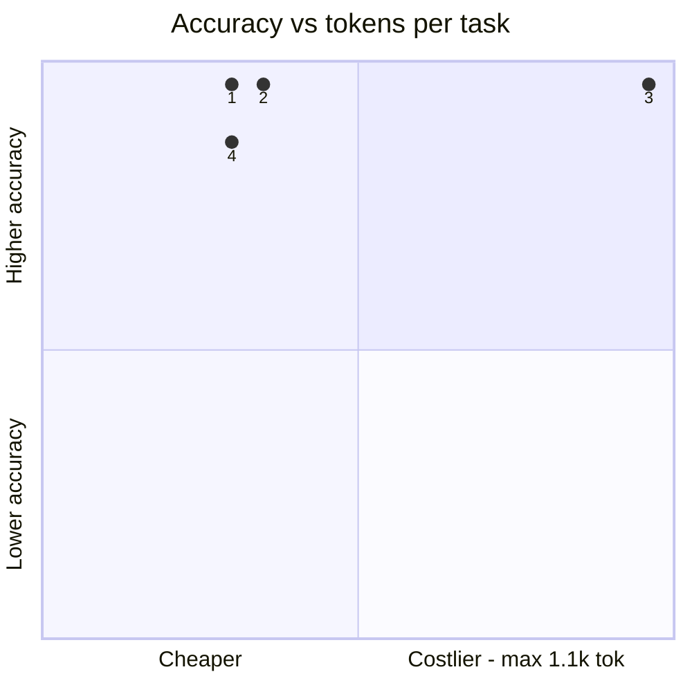
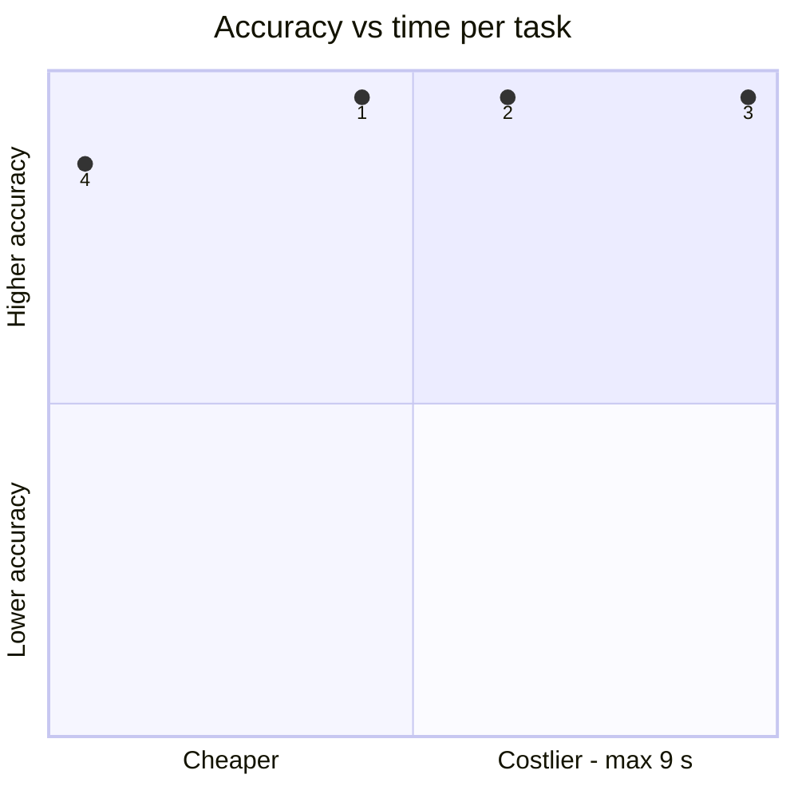
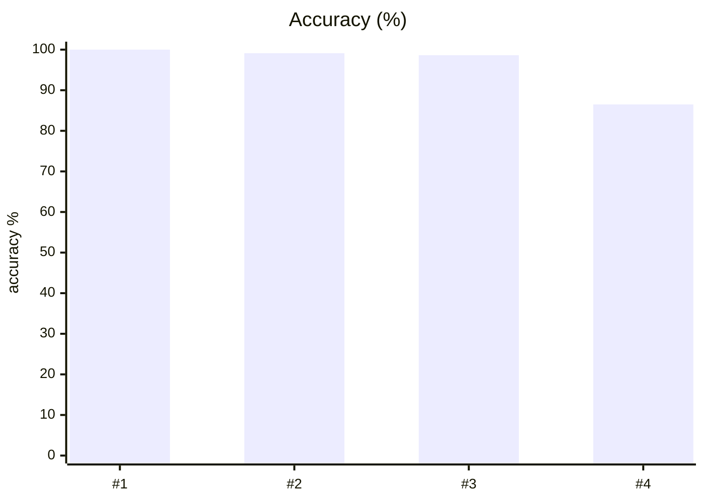
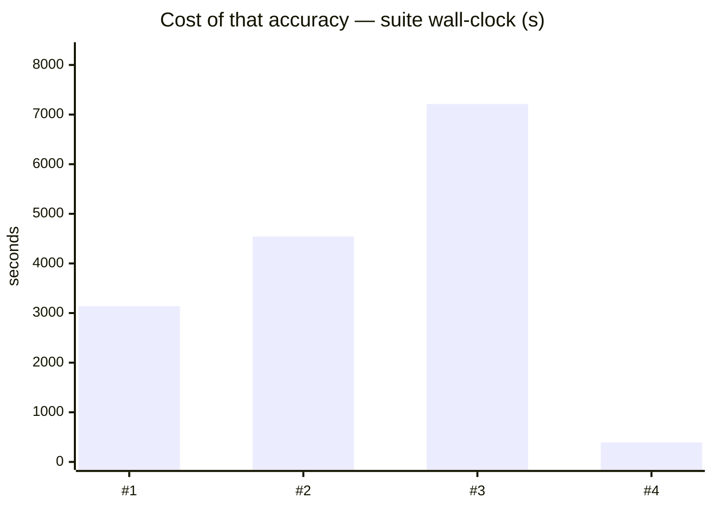
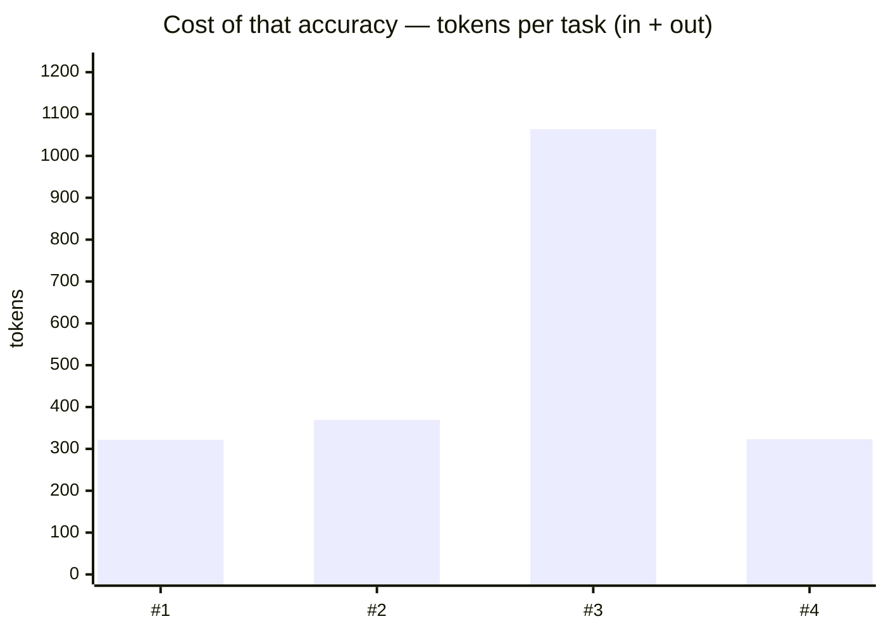
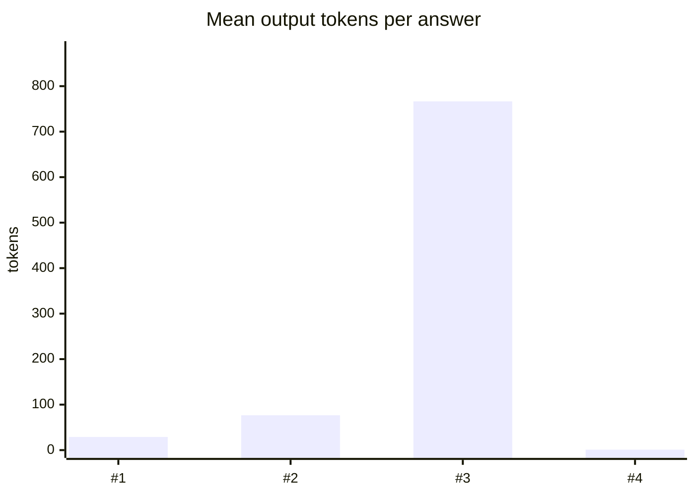

# System One v2 — frontier OpenAI via pi vs the measured roster

**Question.** How do gpt-6-luna (max thinking) and gpt-6.1-sol (high thinking) rank against the v1-roster arms?

**Verdict.** gpt-6.1-sol at high thinking saturates v2 completely (800/800, CI 99.5-100) — the suite no longer measures this tier. gpt-6-luna at max is second at 99.1% (7 misses, all records-family, mostly open questions). Both clear Qwen think-ON (98.6%) and every typed-decision backend; the separating axis on v2 is reasoning depth, not the typed transport.

## Setup

| | |
|---|---|
| Endpoint | mixed — `(pi cli)` (pi gpt-6.1-sol thinking_level=high transport=pi -p, isolated (--no-session --no-tools --no-mcp --no-extensions) ON), `(pi cli)` (pi gpt-6-luna thinking_level=max transport=pi -p, isolated (--no-session --no-tools --no-mcp --no-extensions) ON), `http://localhost:8001` (builtin montimage-dgx-sp ON), `http://localhost:8124` (builtin mercury-decide:f OFF) |
| Tasks | 400 |
| Samples per task | 2 (⇒ 800 generations per run) |
| Concurrency | 1 |
| Metric | accuracy over exact-match answers on typed decision questions, with a 95% Wilson interval |

## Headline

| Run | Accuracy (95% CI) | Tokens per task | Time per task |
|---|---|---|---|---|
| pi-gpt-6.1-sol-thinkhigh-system1-v2 | 100.0 % (100–100) | 293 in / 29 out | 3.9 s |
| pi-gpt-6-luna-thinkmax-system1-v2 | 99.1 % (98–100) | 293 in / 77 out | 5.7 s |
| qwen3-6-35b-a3b-nvfp4-thinkon-system1-v2 | 98.6 % (98–99) | 297 in / 767 out | 9.0 s |
| mercury-decide-free-system1-v2 | 86.5 % (84–89) | 322 in / 1 out | 0.5 s |

<sub>The bracket is the 95% Wilson interval of the solve rate, in points. *Tokens* and *time* are the mean per task attempt (input and output tokens as the endpoint or harness reported them; wall-clock seconds).</sub>

## At a glance

| # | Run | Harness · thinking | Accuracy | Tokens / task | Time / task |
|---|---|---|---|---|---|
| 1 | pi-gpt-6.1-sol-thinkhigh-system1-v2 | pi · ON | `██████████` 100 % <sub>(100–100)</sub> | `███░░░░░░░` 322 | `████▍░░░░░` 4 s |
| 2 | pi-gpt-6-luna-thinkmax-system1-v2 | pi · ON | `█████████▉` 99 % <sub>(98–100)</sub> | `███▌░░░░░░` 369 | `██████▎░░░` 6 s |
| 3 | qwen3-6-35b-a3b-nvfp4-thinkon-system1-v2 | built-in loop · ON | `█████████▉` 99 % <sub>(98–99)</sub> | `██████████` 1.1k | `██████████` 9 s |
| 4 | mercury-decide-free-system1-v2 | built-in loop · OFF | `████████▋░` 86 % <sub>(84–89)</sub> | `███░░░░░░░` 323 | `▌░░░░░░░░░` 0 s |

<sub>Solve-rate bars run 0–100 %, bracket = 95% interval. Token and time bars are scaled to the costliest row — shorter is cheaper. Rows are sorted only **within** one harness and thinking mode; bars from different groups are side by side, not ranked.</sub>





<sub>Points are the `#` column above. Up is better, left is cheaper: the top-left corner is the most solved for the least spent. Cost is scaled to the costliest run.</sub>

## Results

| Run | Accuracy | easy | medium | hard | Wall | Mean out tok | Truncated | tok/s |
|---|---|---|---|---|---|---|---|---|
| **pi-gpt-6.1-sol-thinkhigh-system1-v2** | **100.0 %** | — | 100.0 % | 100.0 % | 3,137 s | 29 | 0 | 7.1 |
| pi-gpt-6-luna-thinkmax-system1-v2 | 99.1 % | — | 99.4 % | 99.1 % | 4,543 s | 77 | 0 | 14.8 |
| qwen3-6-35b-a3b-nvfp4-thinkon-system1-v2 | 98.6 % | — | 100.0 % | 98.3 % | 7,213 s | 767 | 0 | 84.8 |
| mercury-decide-free-system1-v2 | 86.5 % | — | 91.2 % | 85.3 % | 392 s | 1 | 0 | 2.2 |

<sub>Bars below are numbered as in the `#` column of *At a glance*.</sub>









## By difficulty

| Run | easy | medium | hard |
|---|---|---|---|
| pi-gpt-6.1-sol-thinkhigh-system1-v2 | — | `████████` 100 % | `████████` 100 % |
| pi-gpt-6-luna-thinkmax-system1-v2 | — | `████████` 99 % | `███████▉` 99 % |
| qwen3-6-35b-a3b-nvfp4-thinkon-system1-v2 | — | `████████` 100 % | `███████▉` 98 % |
| mercury-decide-free-system1-v2 | — | `███████▎` 91 % | `██████▉░` 85 % |

## Task by task

<sub>Per-task solve rate (%). Tasks the runs disagree on are listed first, widest gap on top.</sub>

| Task | pi gpt-6.1-sol thinking_level=high transport=pi -p, isolated (--no-session --no-tools --no-mcp --no-extensions) ON | pi gpt-6-luna thinking_level=max transport=pi -p, isolated (--no-session --no-tools --no-mcp --no-extensions) ON | builtin montimage-dgx-sp ON | builtin mercury-decide:f OFF |
|---|---|---|---|---|
| `access_05/q1` | 🟩 100 | 🟩 100 | 🟩 100 | 🟥 0 |
| `dependencies_05/q1` | 🟩 100 | 🟩 100 | 🟩 100 | 🟥 0 |
| `dependencies_07/q1` | 🟩 100 | 🟩 100 | 🟨 50 | 🟥 0 |
| `dependencies_12/q1` | 🟩 100 | 🟩 100 | 🟩 100 | 🟥 0 |
| `events_08/q1` | 🟩 100 | 🟩 100 | 🟥 0 | 🟩 100 |
| `events_10/q1` | 🟩 100 | 🟩 100 | 🟩 100 | 🟥 0 |
| `events_15/q1` | 🟩 100 | 🟩 100 | 🟩 100 | 🟥 0 |
| `evidence_20/q1` | 🟩 100 | 🟩 100 | 🟥 0 | 🟥 0 |
| `inventory_01/q1` | 🟩 100 | 🟩 100 | 🟩 100 | 🟥 0 |
| `inventory_04/q1` | 🟩 100 | 🟩 100 | 🟩 100 | 🟥 0 |
| `inventory_05/q1` | 🟩 100 | 🟩 100 | 🟩 100 | 🟥 0 |
| `inventory_07/q1` | 🟩 100 | 🟩 100 | 🟩 100 | 🟥 0 |
| `inventory_07/q2` | 🟩 100 | 🟩 100 | 🟩 100 | 🟥 0 |
| `inventory_13/q1` | 🟩 100 | 🟩 100 | 🟩 100 | 🟥 0 |
| `inventory_14/q2` | 🟩 100 | 🟩 100 | 🟩 100 | 🟥 0 |
| `inventory_16/q1` | 🟩 100 | 🟩 100 | 🟩 100 | 🟥 0 |
| `inventory_17/q1` | 🟩 100 | 🟩 100 | 🟩 100 | 🟥 0 |
| `inventory_19/q1` | 🟩 100 | 🟩 100 | 🟩 100 | 🟥 0 |
| `inventory_19/q2` | 🟩 100 | 🟩 100 | 🟩 100 | 🟥 0 |
| `inventory_20/q1` | 🟩 100 | 🟩 100 | 🟩 100 | 🟥 0 |
| `money_01/q1` | 🟩 100 | 🟩 100 | 🟩 100 | 🟥 0 |
| `money_02/q1` | 🟩 100 | 🟩 100 | 🟩 100 | 🟥 0 |
| `money_05/q1` | 🟩 100 | 🟩 100 | 🟩 100 | 🟥 0 |
| `money_07/q1` | 🟩 100 | 🟩 100 | 🟩 100 | 🟥 0 |
| `money_08/q1` | 🟩 100 | 🟩 100 | 🟩 100 | 🟥 0 |
| `money_12/q1` | 🟩 100 | 🟩 100 | 🟩 100 | 🟥 0 |
| `money_14/q1` | 🟩 100 | 🟩 100 | 🟩 100 | 🟥 0 |
| `money_16/q1` | 🟩 100 | 🟩 100 | 🟩 100 | 🟥 0 |
| `money_18/q1` | 🟩 100 | 🟩 100 | 🟩 100 | 🟥 0 |
| `money_19/q1` | 🟩 100 | 🟩 100 | 🟩 100 | 🟥 0 |
| `money_20/q2` | 🟩 100 | 🟩 100 | 🟩 100 | 🟥 0 |
| `records_01/q2` | 🟩 100 | 🟩 100 | 🟩 100 | 🟥 0 |
| `records_02/q2` | 🟩 100 | 🟨 50 | 🟩 100 | 🟥 0 |
| `records_03/q2` | 🟩 100 | 🟩 100 | 🟩 100 | 🟥 0 |
| `records_07/q2` | 🟩 100 | 🟨 50 | 🟩 100 | 🟥 0 |
| `records_09/q2` | 🟩 100 | 🟩 100 | 🟩 100 | 🟥 0 |
| `records_17/q1` | 🟩 100 | 🟩 100 | 🟩 100 | 🟥 0 |
| `records_20/q1` | 🟩 100 | 🟩 100 | 🟩 100 | 🟥 0 |
| `time_05/q1` | 🟩 100 | 🟩 100 | 🟩 100 | 🟥 0 |
| `time_05/q2` | 🟩 100 | 🟩 100 | 🟩 100 | 🟥 0 |
| `time_08/q1` | 🟩 100 | 🟩 100 | 🟩 100 | 🟥 0 |
| `time_08/q2` | 🟩 100 | 🟩 100 | 🟩 100 | 🟥 0 |
| `time_09/q1` | 🟩 100 | 🟩 100 | 🟩 100 | 🟥 0 |
| `time_09/q2` | 🟩 100 | 🟩 100 | 🟩 100 | 🟥 0 |
| `time_10/q2` | 🟩 100 | 🟩 100 | 🟩 100 | 🟥 0 |
| `time_11/q1` | 🟩 100 | 🟩 100 | 🟩 100 | 🟥 0 |
| `time_11/q2` | 🟩 100 | 🟩 100 | 🟩 100 | 🟥 0 |
| `time_14/q1` | 🟩 100 | 🟩 100 | 🟩 100 | 🟥 0 |
| `time_14/q2` | 🟩 100 | 🟩 100 | 🟩 100 | 🟥 0 |
| `time_18/q2` | 🟩 100 | 🟩 100 | 🟩 100 | 🟥 0 |
| `time_19/q1` | 🟩 100 | 🟩 100 | 🟩 100 | 🟥 0 |
| `time_19/q2` | 🟩 100 | 🟩 100 | 🟩 100 | 🟥 0 |
| `time_20/q2` | 🟩 100 | 🟩 100 | 🟩 100 | 🟥 0 |
| `access_08/q2` | 🟩 100 | 🟩 100 | 🟨 50 | 🟩 100 |
| `dependencies_05/q2` | 🟩 100 | 🟩 100 | 🟩 100 | 🟨 50 |
| `events_08/q2` | 🟩 100 | 🟩 100 | 🟨 50 | 🟩 100 |
| `inventory_13/q2` | 🟩 100 | 🟩 100 | 🟩 100 | 🟨 50 |
| `money_19/q2` | 🟩 100 | 🟩 100 | 🟩 100 | 🟨 50 |
| `records_06/q2` | 🟩 100 | 🟩 100 | 🟨 50 | 🟩 100 |
| `records_07/q1` | 🟩 100 | 🟨 50 | 🟩 100 | 🟩 100 |
| `records_10/q2` | 🟩 100 | 🟩 100 | 🟨 50 | 🟩 100 |
| `records_12/q2` | 🟩 100 | 🟨 50 | 🟩 100 | 🟨 50 |
| `records_16/q2` | 🟩 100 | 🟩 100 | 🟨 50 | 🟩 100 |
| `records_18/q1` | 🟩 100 | 🟨 50 | 🟩 100 | 🟩 100 |
| `records_18/q2` | 🟩 100 | 🟨 50 | 🟩 100 | 🟩 100 |
| `records_19/q2` | 🟩 100 | 🟩 100 | 🟨 50 | 🟩 100 |
| `records_20/q2` | 🟩 100 | 🟨 50 | 🟩 100 | 🟩 100 |

- 🟩 **every run solved** (333): `access_01/q1`, `access_01/q2`, `access_02/q1`, `access_02/q2`, `access_03/q1`, `access_03/q2`, `access_04/q1`, `access_04/q2`, `access_05/q2`, `access_06/q1`, `access_06/q2`, `access_07/q1`, `access_07/q2`, `access_08/q1`, `access_09/q1`, `access_09/q2`, `access_10/q1`, `access_10/q2`, `access_11/q1`, `access_11/q2`, `access_12/q1`, `access_12/q2`, `access_13/q1`, `access_13/q2`, `access_14/q1`, `access_14/q2`, `access_15/q1`, `access_15/q2`, `access_16/q1`, `access_16/q2`, `access_17/q1`, `access_17/q2`, `access_18/q1`, `access_18/q2`, `access_19/q1`, `access_19/q2`, `access_20/q1`, `access_20/q2`, `dependencies_01/q1`, `dependencies_01/q2`, `dependencies_02/q1`, `dependencies_02/q2`, `dependencies_03/q1`, `dependencies_03/q2`, `dependencies_04/q1`, `dependencies_04/q2`, `dependencies_06/q1`, `dependencies_06/q2`, `dependencies_07/q2`, `dependencies_08/q1`, `dependencies_08/q2`, `dependencies_09/q1`, `dependencies_09/q2`, `dependencies_10/q1`, `dependencies_10/q2`, `dependencies_11/q1`, `dependencies_11/q2`, `dependencies_12/q2`, `dependencies_13/q1`, `dependencies_13/q2`, `dependencies_14/q1`, `dependencies_14/q2`, `dependencies_15/q1`, `dependencies_15/q2`, `dependencies_16/q1`, `dependencies_16/q2`, `dependencies_17/q1`, `dependencies_17/q2`, `dependencies_18/q1`, `dependencies_18/q2`, `dependencies_19/q1`, `dependencies_19/q2`, `dependencies_20/q1`, `dependencies_20/q2`, `events_01/q1`, `events_01/q2`, `events_02/q1`, `events_02/q2`, `events_03/q1`, `events_03/q2`, `events_04/q1`, `events_04/q2`, `events_05/q1`, `events_05/q2`, `events_06/q1`, `events_06/q2`, `events_07/q1`, `events_07/q2`, `events_09/q1`, `events_09/q2`, `events_10/q2`, `events_11/q1`, `events_11/q2`, `events_12/q1`, `events_12/q2`, `events_13/q1`, `events_13/q2`, `events_14/q1`, `events_14/q2`, `events_15/q2`, `events_16/q1`, `events_16/q2`, `events_17/q1`, `events_17/q2`, `events_18/q1`, `events_18/q2`, `events_19/q1`, `events_19/q2`, `events_20/q1`, `events_20/q2`, `evidence_01/q1`, `evidence_01/q2`, `evidence_02/q1`, `evidence_02/q2`, `evidence_03/q1`, `evidence_03/q2`, `evidence_04/q1`, `evidence_04/q2`, `evidence_05/q1`, `evidence_05/q2`, `evidence_06/q1`, `evidence_06/q2`, `evidence_07/q1`, `evidence_07/q2`, `evidence_08/q1`, `evidence_08/q2`, `evidence_09/q1`, `evidence_09/q2`, `evidence_10/q1`, `evidence_10/q2`, `evidence_11/q1`, `evidence_11/q2`, `evidence_12/q1`, `evidence_12/q2`, `evidence_13/q1`, `evidence_13/q2`, `evidence_14/q1`, `evidence_14/q2`, `evidence_15/q1`, `evidence_15/q2`, `evidence_16/q1`, `evidence_16/q2`, `evidence_17/q1`, `evidence_17/q2`, `evidence_18/q1`, `evidence_18/q2`, `evidence_19/q1`, `evidence_19/q2`, `evidence_20/q2`, `inventory_01/q2`, `inventory_02/q1`, `inventory_02/q2`, `inventory_03/q1`, `inventory_03/q2`, `inventory_04/q2`, `inventory_05/q2`, `inventory_06/q1`, `inventory_06/q2`, `inventory_08/q1`, `inventory_08/q2`, `inventory_09/q1`, `inventory_09/q2`, `inventory_10/q1`, `inventory_10/q2`, `inventory_11/q1`, `inventory_11/q2`, `inventory_12/q1`, `inventory_12/q2`, `inventory_14/q1`, `inventory_15/q1`, `inventory_15/q2`, `inventory_16/q2`, `inventory_17/q2`, `inventory_18/q1`, `inventory_18/q2`, `inventory_20/q2`, `money_01/q2`, `money_02/q2`, `money_03/q1`, `money_03/q2`, `money_04/q1`, `money_04/q2`, `money_05/q2`, `money_06/q1`, `money_06/q2`, `money_07/q2`, `money_08/q2`, `money_09/q1`, `money_09/q2`, `money_10/q1`, `money_10/q2`, `money_11/q1`, `money_11/q2`, `money_12/q2`, `money_13/q1`, `money_13/q2`, `money_14/q2`, `money_15/q1`, `money_15/q2`, `money_16/q2`, `money_17/q1`, `money_17/q2`, `money_18/q2`, `money_20/q1`, `policy_01/q1`, `policy_01/q2`, `policy_02/q1`, `policy_02/q2`, `policy_03/q1`, `policy_03/q2`, `policy_04/q1`, `policy_04/q2`, `policy_05/q1`, `policy_05/q2`, `policy_06/q1`, `policy_06/q2`, `policy_07/q1`, `policy_07/q2`, `policy_08/q1`, `policy_08/q2`, `policy_09/q1`, `policy_09/q2`, `policy_10/q1`, `policy_10/q2`, `policy_11/q1`, `policy_11/q2`, `policy_12/q1`, `policy_12/q2`, `policy_13/q1`, `policy_13/q2`, `policy_14/q1`, `policy_14/q2`, `policy_15/q1`, `policy_15/q2`, `policy_16/q1`, `policy_16/q2`, `policy_17/q1`, `policy_17/q2`, `policy_18/q1`, `policy_18/q2`, `policy_19/q1`, `policy_19/q2`, `policy_20/q1`, `policy_20/q2`, `records_01/q1`, `records_02/q1`, `records_03/q1`, `records_04/q1`, `records_04/q2`, `records_05/q1`, `records_05/q2`, `records_06/q1`, `records_08/q1`, `records_08/q2`, `records_09/q1`, `records_10/q1`, `records_11/q1`, `records_11/q2`, `records_12/q1`, `records_13/q1`, `records_13/q2`, `records_14/q1`, `records_14/q2`, `records_15/q1`, `records_15/q2`, `records_16/q1`, `records_17/q2`, `records_19/q1`, `time_01/q1`, `time_01/q2`, `time_02/q1`, `time_02/q2`, `time_03/q1`, `time_03/q2`, `time_04/q1`, `time_04/q2`, `time_06/q1`, `time_06/q2`, `time_07/q1`, `time_07/q2`, `time_10/q1`, `time_12/q1`, `time_12/q2`, `time_13/q1`, `time_13/q2`, `time_15/q1`, `time_15/q2`, `time_16/q1`, `time_16/q2`, `time_17/q1`, `time_17/q2`, `time_18/q1`, `time_20/q1`, `triage_01/q1`, `triage_01/q2`, `triage_02/q1`, `triage_02/q2`, `triage_03/q1`, `triage_03/q2`, `triage_04/q1`, `triage_04/q2`, `triage_05/q1`, `triage_05/q2`, `triage_06/q1`, `triage_06/q2`, `triage_07/q1`, `triage_07/q2`, `triage_08/q1`, `triage_08/q2`, `triage_09/q1`, `triage_09/q2`, `triage_10/q1`, `triage_10/q2`, `triage_11/q1`, `triage_11/q2`, `triage_12/q1`, `triage_12/q2`, `triage_13/q1`, `triage_13/q2`, `triage_14/q1`, `triage_14/q2`, `triage_15/q1`, `triage_15/q2`, `triage_16/q1`, `triage_16/q2`, `triage_17/q1`, `triage_17/q2`, `triage_18/q1`, `triage_18/q2`, `triage_19/q1`, `triage_19/q2`, `triage_20/q1`, `triage_20/q2`

## Where they disagree — pi-gpt-6.1-sol-thinkhigh-system1-v2 vs pi-gpt-6-luna-thinkmax-system1-v2

| Task | pi-gpt-6.1-sol-thinkhigh-system1-v2 | pi-gpt-6-luna-thinkmax-system1-v2 | Winner |
|---|---|---|---|
| `records_02/q2` | 100 % | 50 % | pi-gpt-6.1-sol-thinkhigh-system1-v2 |
| `records_07/q1` | 100 % | 50 % | pi-gpt-6.1-sol-thinkhigh-system1-v2 |
| `records_07/q2` | 100 % | 50 % | pi-gpt-6.1-sol-thinkhigh-system1-v2 |
| `records_12/q2` | 100 % | 50 % | pi-gpt-6.1-sol-thinkhigh-system1-v2 |
| `records_18/q1` | 100 % | 50 % | pi-gpt-6.1-sol-thinkhigh-system1-v2 |
| `records_18/q2` | 100 % | 50 % | pi-gpt-6.1-sol-thinkhigh-system1-v2 |
| `records_20/q2` | 100 % | 50 % | pi-gpt-6.1-sol-thinkhigh-system1-v2 |

## Cost per task

<sub>Mean per attempt: input / output tokens, then wall-clock seconds. *not reported* = no usage reported for that task; *–* = the run has no cost record for it.</sub>

| Task | pi-gpt-6.1-sol-thinkhigh-system1-v2 | pi-gpt-6-luna-thinkmax-system1-v2 | qwen3-6-35b-a3b-nvfp4-thinkon-system1-v2 | mercury-decide-free-system1-v2 |
|---|---|---|---|---|
| `access_01/q1` | 232 / 5 · 3.0 s | 234 / 43 · 4.2 s | 230 / 448 · 5.4 s | 186 / 1 · 0.4 s |
| `access_01/q2` | 248 / 5 · 3.0 s | 250 / 53 · 36.5 s | 249 / 544 · 6.5 s | 247 / 1 · 0.4 s |
| `access_02/q1` | 230 / 5 · 5.9 s | 234 / 38 · 5.0 s | 230 / 520 · 6.1 s | 192 / 1 · 0.5 s |
| `access_02/q2` | 250 / 5 · 3.4 s | 250 / 40 · 3.6 s | 249 / 400 · 4.7 s | 246 / 1 · 0.4 s |
| `access_03/q1` | 232 / 36 · 3.9 s | 232 / 60 · 5.3 s | 230 / 536 · 6.3 s | 190 / 1 · 0.4 s |
| `access_03/q2` | 250 / 28 · 4.3 s | 250 / 85 · 4.6 s | 249 / 424 · 5.0 s | 250 / 1 · 0.5 s |
| `access_04/q1` | 232 / 24 · 3.3 s | 232 / 79 · 4.9 s | 230 / 548 · 6.4 s | 186 / 1 · 0.4 s |
| `access_04/q2` | 251 / 52 · 4.3 s | 250 / 105 · 6.4 s | 249 / 769 · 8.9 s | 246 / 1 · 0.4 s |
| `access_05/q1` | 232 / 34 · 3.7 s | 232 / 92 · 5.3 s | 230 / 584 · 7.0 s | 190 / 1 · 0.6 s |
| `access_05/q2` | 250 / 23 · 3.9 s | 251 / 65 · 5.7 s | 249 / 512 · 6.1 s | 247 / 1 · 0.5 s |
| `access_06/q1` | 231 / 5 · 2.9 s | 232 / 37 · 4.7 s | 230 / 680 · 7.9 s | 194 / 1 · 0.6 s |
| `access_06/q2` | 252 / 5 · 3.2 s | 250 / 39 · 5.1 s | 249 / 220 · 2.6 s | 249 / 1 · 0.5 s |
| `access_07/q1` | 231 / 44 · 4.0 s | 232 / 72 · 5.1 s | 230 / 1,292 · 15.1 s | 192 / 1 · 0.5 s |
| `access_07/q2` | 252 / 5 · 3.7 s | 250 / 111 · 6.5 s | 249 / 808 · 9.9 s | 250 / 1 · 0.8 s |
| `access_08/q1` | 232 / 5 · 4.0 s | 233 / 78 · 4.7 s | 230 / 1,520 · 18.6 s | 190 / 1 · 0.4 s |
| `access_08/q2` | 250 / 20 · 3.1 s | 252 / 110 · 5.6 s | 249 / 2,411 · 29.9 s | 243 / 1 · 0.4 s |
| `access_09/q1` | 231 / 36 · 3.8 s | 232 / 67 · 5.4 s | 230 / 806 · 9.5 s | 188 / 1 · 0.4 s |
| `access_09/q2` | 250 / 41 · 4.4 s | 250 / 91 · 4.7 s | 249 / 1,740 · 20.9 s | 248 / 1 · 0.4 s |
| `access_10/q1` | 232 / 34 · 3.3 s | 232 / 58 · 5.1 s | 230 / 624 · 7.4 s | 192 / 1 · 0.6 s |
| `access_10/q2` | 252 / 54 · 4.3 s | 250 / 132 · 4.5 s | 249 / 836 · 9.6 s | 248 / 1 · 0.5 s |
| `access_11/q1` | 231 / 50 · 4.0 s | 232 / 90 · 5.7 s | 230 / 748 · 8.9 s | 190 / 1 · 0.5 s |
| `access_11/q2` | 250 / 54 · 3.7 s | 251 / 100 · 5.3 s | 249 / 868 · 10.2 s | 248 / 1 · 0.4 s |
| `access_12/q1` | 231 / 5 · 3.5 s | 232 / 57 · 5.6 s | 230 / 646 · 7.7 s | 190 / 1 · 0.5 s |
| `access_12/q2` | 250 / 5 · 3.9 s | 251 / 63 · 4.4 s | 249 / 448 · 5.1 s | 246 / 1 · 0.4 s |
| `access_13/q1` | 232 / 26 · 4.1 s | 232 / 71 · 18.5 s | 230 / 661 · 7.8 s | 190 / 1 · 0.6 s |
| `access_13/q2` | 252 / 29 · 4.7 s | 251 / 90 · 5.5 s | 249 / 486 · 5.6 s | 244 / 1 · 0.4 s |
| `access_14/q1` | 232 / 5 · 3.0 s | 232 / 77 · 4.9 s | 230 / 678 · 8.0 s | 188 / 1 · 0.4 s |
| `access_14/q2` | 250 / 38 · 3.7 s | 250 / 103 · 6.6 s | 249 / 861 · 10.0 s | 250 / 1 · 0.5 s |
| `access_15/q1` | 232 / 5 · 4.4 s | 231 / 43 · 6.0 s | 230 / 562 · 6.8 s | 193 / 1 · 0.6 s |
| `access_15/q2` | 250 / 5 · 3.5 s | 251 / 54 · 5.0 s | 249 / 505 · 6.0 s | 246 / 1 · 0.5 s |
| `access_16/q1` | 232 / 5 · 3.2 s | 232 / 35 · 3.6 s | 230 / 781 · 9.5 s | 195 / 1 · 0.4 s |
| `access_16/q2` | 250 / 5 · 3.8 s | 250 / 37 · 3.6 s | 249 / 384 · 4.4 s | 244 / 1 · 0.4 s |
| `access_17/q1` | 232 / 5 · 3.0 s | 231 / 49 · 5.0 s | 230 / 432 · 5.1 s | 191 / 1 · 0.4 s |
| `access_17/q2` | 251 / 5 · 3.5 s | 250 / 54 · 4.6 s | 249 / 352 · 4.3 s | 250 / 1 · 0.5 s |
| `access_18/q1` | 232 / 5 · 3.5 s | 232 / 34 · 5.4 s | 230 / 359 · 4.3 s | 194 / 1 · 0.4 s |
| `access_18/q2` | 250 / 5 · 4.8 s | 252 / 38 · 4.2 s | 249 / 446 · 5.1 s | 244 / 1 · 0.4 s |
| `access_19/q1` | 231 / 5 · 3.5 s | 232 / 37 · 5.0 s | 230 / 642 · 7.5 s | 190 / 1 · 0.4 s |
| `access_19/q2` | 250 / 5 · 3.5 s | 252 / 40 · 3.9 s | 249 / 420 · 4.8 s | 248 / 1 · 0.5 s |
| `access_20/q1` | 232 / 22 · 3.3 s | 232 / 65 · 5.8 s | 230 / 756 · 8.8 s | 186 / 1 · 0.6 s |
| `access_20/q2` | 250 / 27 · 3.3 s | 251 / 91 · 5.0 s | 249 / 851 · 10.1 s | 242 / 1 · 0.4 s |
| `dependencies_01/q1` | 344 / 23 · 3.4 s | 342 / 81 · 4.9 s | 336 / 816 · 9.4 s | 320 / 1 · 0.8 s |
| `dependencies_01/q2` | 359 / 5 · 3.0 s | 358 / 54 · 6.7 s | 350 / 752 · 9.0 s | 343 / 1 · 0.6 s |
| `dependencies_02/q1` | 344 / 42 · 3.7 s | 344 / 105 · 5.6 s | 336 / 1,154 · 13.5 s | 326 / 1 · 0.7 s |
| `dependencies_02/q2` | 357 / 5 · 3.6 s | 357 / 64 · 6.0 s | 350 / 668 · 7.8 s | 351 / 1 · 0.7 s |
| `dependencies_03/q1` | 344 / 42 · 4.4 s | 344 / 106 · 5.8 s | 336 / 1,188 · 14.5 s | 330 / 1 · 0.5 s |
| `dependencies_03/q2` | 358 / 5 · 3.2 s | 358 / 80 · 5.7 s | 350 / 974 · 11.6 s | 350 / 1 · 0.5 s |
| `dependencies_04/q1` | 344 / 43 · 5.4 s | 344 / 107 · 5.5 s | 336 / 744 · 8.8 s | 324 / 1 · 0.5 s |
| `dependencies_04/q2` | 358 / 5 · 3.5 s | 358 / 46 · 3.8 s | 350 / 618 · 7.7 s | 349 / 1 · 0.5 s |
| `dependencies_05/q1` | 345 / 52 · 3.8 s | 344 / 153 · 6.2 s | 337 / 2,014 · 24.2 s | 324 / 1 · 0.4 s |
| `dependencies_05/q2` | 358 / 22 · 3.4 s | 360 / 98 · 6.0 s | 351 / 848 · 10.2 s | 352 / 1 · 0.8 s |
| `dependencies_06/q1` | 344 / 37 · 3.3 s | 344 / 89 · 5.5 s | 336 / 966 · 11.4 s | 332 / 1 · 0.4 s |
| `dependencies_06/q2` | 358 / 5 · 5.6 s | 358 / 62 · 5.6 s | 350 / 679 · 8.2 s | 344 / 1 · 0.5 s |
| `dependencies_07/q1` | 344 / 48 · 5.2 s | 344 / 96 · 6.1 s | 337 / 1,616 · 19.6 s | 326 / 1 · 0.5 s |
| `dependencies_07/q2` | 358 / 31 · 3.5 s | 358 / 58 · 4.9 s | 351 / 672 · 8.2 s | 346 / 1 · 0.4 s |
| `dependencies_08/q1` | 344 / 36 · 4.4 s | 344 / 110 · 5.7 s | 336 / 631 · 7.4 s | 324 / 1 · 0.4 s |
| `dependencies_08/q2` | 357 / 5 · 3.7 s | 358 / 46 · 5.2 s | 350 / 593 · 7.3 s | 351 / 1 · 0.4 s |
| `dependencies_09/q1` | 344 / 5 · 3.7 s | 344 / 60 · 5.2 s | 336 / 604 · 7.1 s | 322 / 1 · 0.8 s |
| `dependencies_09/q2` | 358 / 5 · 3.4 s | 358 / 67 · 4.2 s | 350 / 778 · 9.4 s | 348 / 1 · 0.6 s |
| `dependencies_10/q1` | 344 / 39 · 4.3 s | 344 / 99 · 4.6 s | 336 / 752 · 9.2 s | 327 / 1 · 0.5 s |
| `dependencies_10/q2` | 359 / 5 · 3.5 s | 358 / 40 · 4.6 s | 350 / 376 · 4.5 s | 345 / 1 · 0.4 s |
| `dependencies_11/q1` | 344 / 33 · 3.8 s | 343 / 109 · 6.1 s | 336 / 734 · 8.7 s | 327 / 1 · 0.5 s |
| `dependencies_11/q2` | 358 / 5 · 3.0 s | 358 / 56 · 4.9 s | 350 / 695 · 8.3 s | 348 / 1 · 0.5 s |
| `dependencies_12/q1` | 342 / 39 · 4.0 s | 344 / 95 · 5.7 s | 336 / 1,098 · 13.0 s | 324 / 1 · 0.4 s |
| `dependencies_12/q2` | 358 / 5 · 2.8 s | 359 / 39 · 3.7 s | 350 / 341 · 4.1 s | 349 / 1 · 0.5 s |
| `dependencies_13/q1` | 343 / 33 · 3.4 s | 344 / 115 · 4.6 s | 336 / 1,476 · 18.2 s | 328 / 1 · 0.5 s |
| `dependencies_13/q2` | 358 / 5 · 3.7 s | 358 / 52 · 6.1 s | 350 / 756 · 9.2 s | 346 / 1 · 0.4 s |
| `dependencies_14/q1` | 344 / 44 · 4.6 s | 344 / 92 · 7.1 s | 336 / 1,029 · 12.2 s | 326 / 1 · 0.6 s |
| `dependencies_14/q2` | 358 / 5 · 2.8 s | 358 / 50 · 4.6 s | 350 / 611 · 7.4 s | 344 / 1 · 0.5 s |
| `dependencies_15/q1` | 344 / 5 · 3.6 s | 344 / 41 · 4.3 s | 336 / 568 · 6.8 s | 326 / 1 · 0.5 s |
| `dependencies_15/q2` | 358 / 5 · 2.9 s | 358 / 38 · 5.6 s | 350 / 418 · 5.1 s | 349 / 1 · 0.4 s |
| `dependencies_16/q1` | 344 / 44 · 3.6 s | 344 / 103 · 5.7 s | 337 / 1,470 · 18.0 s | 325 / 1 · 0.4 s |
| `dependencies_16/q2` | 358 / 41 · 6.0 s | 359 / 70 · 4.4 s | 351 / 734 · 8.8 s | 350 / 1 · 0.4 s |
| `dependencies_17/q1` | 342 / 21 · 4.2 s | 345 / 106 · 5.4 s | 336 / 692 · 8.2 s | 322 / 1 · 0.4 s |
| `dependencies_17/q2` | 358 / 5 · 3.2 s | 358 / 61 · 5.2 s | 350 / 570 · 6.8 s | 348 / 1 · 0.5 s |
| `dependencies_18/q1` | 344 / 43 · 4.8 s | 344 / 84 · 5.4 s | 336 / 774 · 9.1 s | 328 / 1 · 0.4 s |
| `dependencies_18/q2` | 358 / 5 · 3.0 s | 358 / 55 · 6.3 s | 350 / 590 · 7.1 s | 351 / 1 · 0.5 s |
| `dependencies_19/q1` | 343 / 24 · 4.0 s | 343 / 93 · 7.4 s | 336 / 944 · 11.1 s | 320 / 1 · 0.4 s |
| `dependencies_19/q2` | 358 / 5 · 3.1 s | 358 / 39 · 6.3 s | 350 / 571 · 6.9 s | 346 / 1 · 0.4 s |
| `dependencies_20/q1` | 344 / 27 · 3.9 s | 344 / 132 · 5.4 s | 336 / 1,188 · 14.6 s | 326 / 1 · 0.4 s |
| `dependencies_20/q2` | 357 / 5 · 3.7 s | 357 / 68 · 5.7 s | 350 / 984 · 12.2 s | 353 / 1 · 0.4 s |
| `events_01/q1` | 256 / 26 · 3.1 s | 256 / 50 · 5.8 s | 254 / 534 · 6.3 s | 248 / 1 · 0.5 s |
| `events_01/q2` | 258 / 29 · 4.3 s | 257 / 49 · 4.5 s | 255 / 414 · 5.0 s | 234 / 1 · 0.4 s |
| `events_02/q1` | 256 / 32 · 3.4 s | 256 / 55 · 7.1 s | 254 / 358 · 4.2 s | 248 / 1 · 0.7 s |
| `events_02/q2` | 256 / 41 · 3.8 s | 257 / 68 · 6.6 s | 255 / 474 · 5.8 s | 234 / 1 · 0.4 s |
| `events_03/q1` | 256 / 29 · 3.7 s | 256 / 53 · 5.6 s | 254 / 562 · 6.7 s | 248 / 1 · 0.4 s |
| `events_03/q2` | 257 / 45 · 4.0 s | 256 / 63 · 4.8 s | 255 / 398 · 4.6 s | 238 / 1 · 0.4 s |
| `events_04/q1` | 256 / 30 · 4.0 s | 256 / 55 · 5.3 s | 254 / 335 · 4.2 s | 250 / 1 · 0.4 s |
| `events_04/q2` | 257 / 41 · 4.0 s | 256 / 64 · 4.8 s | 255 / 824 · 10.0 s | 231 / 1 · 0.5 s |
| `events_05/q1` | 277 / 37 · 4.2 s | 278 / 59 · 5.1 s | 277 / 747 · 8.8 s | 272 / 1 · 0.4 s |
| `events_05/q2` | 279 / 49 · 3.8 s | 280 / 77 · 5.0 s | 278 / 569 · 6.7 s | 262 / 1 · 0.4 s |
| `events_06/q1` | 278 / 49 · 4.1 s | 278 / 71 · 5.4 s | 277 / 664 · 7.6 s | 274 / 1 · 0.4 s |
| `events_06/q2` | 280 / 51 · 3.9 s | 279 / 96 · 5.0 s | 278 / 482 · 5.8 s | 257 / 1 · 0.4 s |
| `events_07/q1` | 276 / 46 · 4.2 s | 276 / 82 · 4.9 s | 274 / 564 · 6.8 s | 270 / 1 · 0.5 s |
| `events_07/q2` | 278 / 53 · 4.4 s | 277 / 94 · 8.6 s | 275 / 559 · 6.6 s | 258 / 1 · 0.4 s |
| `events_08/q1` | 276 / 50 · 4.0 s | 276 / 110 · 5.9 s | 274 / 1,148 · 14.1 s | 269 / 1 · 0.4 s |
| `events_08/q2` | 276 / 48 · 4.3 s | 276 / 110 · 6.0 s | 275 / 1,323 · 16.0 s | 256 / 1 · 0.4 s |
| `events_09/q1` | 276 / 34 · 3.3 s | 279 / 60 · 5.8 s | 277 / 503 · 6.1 s | 274 / 1 · 0.4 s |
| `events_09/q2` | 279 / 36 · 3.6 s | 278 / 75 · 5.7 s | 278 / 632 · 7.4 s | 257 / 1 · 0.5 s |
| `events_10/q1` | 278 / 41 · 3.5 s | 278 / 63 · 5.0 s | 277 / 679 · 8.0 s | 270 / 1 · 0.5 s |
| `events_10/q2` | 279 / 44 · 4.1 s | 280 / 84 · 4.7 s | 278 / 790 · 9.4 s | 256 / 1 · 0.4 s |
| `events_11/q1` | 256 / 37 · 3.6 s | 256 / 61 · 4.9 s | 254 / 512 · 6.3 s | 249 / 1 · 0.5 s |
| `events_11/q2` | 257 / 41 · 5.3 s | 258 / 60 · 5.3 s | 255 / 452 · 5.5 s | 236 / 1 · 0.4 s |
| `events_12/q1` | 256 / 42 · 3.8 s | 256 / 69 · 5.0 s | 254 / 424 · 5.2 s | 250 / 1 · 0.4 s |
| `events_12/q2` | 256 / 39 · 4.4 s | 257 / 78 · 6.1 s | 255 / 247 · 3.1 s | 236 / 1 · 0.4 s |
| `events_13/q1` | 300 / 55 · 4.0 s | 300 / 81 · 5.4 s | 300 / 692 · 8.2 s | 298 / 1 · 0.5 s |
| `events_13/q2` | 302 / 45 · 4.1 s | 302 / 91 · 5.5 s | 301 / 738 · 8.5 s | 284 / 1 · 0.4 s |
| `events_14/q1` | 276 / 39 · 3.5 s | 277 / 65 · 5.0 s | 277 / 546 · 6.5 s | 276 / 1 · 0.4 s |
| `events_14/q2` | 279 / 47 · 3.4 s | 280 / 74 · 5.2 s | 278 / 602 · 7.1 s | 258 / 1 · 0.4 s |
| `events_15/q1` | 278 / 41 · 5.7 s | 278 / 72 · 4.9 s | 277 / 454 · 5.4 s | 274 / 1 · 0.6 s |
| `events_15/q2` | 280 / 49 · 4.1 s | 278 / 86 · 5.4 s | 278 / 791 · 9.5 s | 258 / 1 · 0.4 s |
| `events_16/q1` | 252 / 5 · 3.1 s | 252 / 44 · 3.7 s | 248 / 641 · 7.7 s | 244 / 1 · 0.6 s |
| `events_16/q2` | 253 / 5 · 2.9 s | 252 / 42 · 4.4 s | 250 / 482 · 6.0 s | 231 / 1 · 0.4 s |
| `events_17/q1` | 278 / 40 · 5.9 s | 278 / 82 · 5.5 s | 277 / 438 · 5.4 s | 270 / 1 · 0.5 s |
| `events_17/q2` | 278 / 48 · 4.2 s | 278 / 91 · 5.0 s | 278 / 858 · 10.3 s | 258 / 1 · 0.6 s |
| `events_18/q1` | 276 / 32 · 3.7 s | 278 / 78 · 5.1 s | 277 / 621 · 7.7 s | 273 / 1 · 0.5 s |
| `events_18/q2` | 279 / 41 · 4.0 s | 280 / 84 · 4.9 s | 278 / 790 · 9.4 s | 253 / 1 · 0.4 s |
| `events_19/q1` | 256 / 47 · 4.0 s | 256 / 61 · 5.8 s | 254 / 730 · 8.7 s | 248 / 1 · 0.4 s |
| `events_19/q2` | 256 / 47 · 6.0 s | 256 / 65 · 5.4 s | 256 / 512 · 6.3 s | 231 / 1 · 0.4 s |
| `events_20/q1` | 299 / 30 · 5.4 s | 300 / 73 · 5.5 s | 300 / 488 · 5.6 s | 299 / 1 · 0.4 s |
| `events_20/q2` | 301 / 41 · 4.0 s | 300 / 82 · 4.3 s | 301 / 646 · 7.7 s | 280 / 1 · 0.4 s |
| `evidence_01/q1` | 214 / 5 · 2.9 s | 214 / 48 · 5.1 s | 206 / 486 · 5.9 s | 186 / 1 · 0.5 s |
| `evidence_01/q2` | 216 / 5 · 3.5 s | 216 / 33 · 4.4 s | 208 / 393 · 4.9 s | 184 / 1 · 0.5 s |
| `evidence_02/q1` | 216 / 5 · 3.2 s | 216 / 67 · 5.2 s | 208 / 436 · 5.3 s | 190 / 1 · 0.4 s |
| `evidence_02/q2` | 216 / 5 · 3.7 s | 216 / 53 · 5.3 s | 208 / 309 · 3.7 s | 186 / 1 · 0.6 s |
| `evidence_03/q1` | 220 / 5 · 2.8 s | 221 / 41 · 4.5 s | 213 / 816 · 9.5 s | 191 / 1 · 0.5 s |
| `evidence_03/q2` | 220 / 5 · 3.6 s | 222 / 47 · 3.8 s | 213 / 384 · 4.5 s | 192 / 1 · 0.5 s |
| `evidence_04/q1` | 218 / 5 · 3.4 s | 218 / 58 · 6.6 s | 210 / 428 · 5.1 s | 189 / 1 · 0.4 s |
| `evidence_04/q2` | 218 / 5 · 3.1 s | 218 / 42 · 5.3 s | 210 / 499 · 5.9 s | 194 / 1 · 0.5 s |
| `evidence_05/q1` | 212 / 5 · 3.6 s | 211 / 62 · 4.9 s | 204 / 399 · 4.7 s | 189 / 1 · 0.4 s |
| `evidence_05/q2` | 212 / 5 · 3.2 s | 212 / 65 · 5.4 s | 205 / 258 · 3.0 s | 185 / 1 · 0.4 s |
| `evidence_06/q1` | 220 / 21 · 5.2 s | 220 / 68 · 5.1 s | 212 / 290 · 3.5 s | 194 / 1 · 0.4 s |
| `evidence_06/q2` | 217 / 5 · 3.4 s | 218 / 57 · 4.8 s | 210 / 230 · 2.7 s | 188 / 1 · 0.4 s |
| `evidence_07/q1` | 217 / 5 · 2.7 s | 218 / 42 · 5.0 s | 209 / 380 · 4.5 s | 194 / 1 · 0.4 s |
| `evidence_07/q2` | 218 / 5 · 2.8 s | 217 / 43 · 5.0 s | 209 / 524 · 6.3 s | 190 / 1 · 0.4 s |
| `evidence_08/q1` | 220 / 38 · 4.0 s | 220 / 56 · 4.8 s | 212 / 1,078 · 13.3 s | 193 / 1 · 0.4 s |
| `evidence_08/q2` | 219 / 5 · 3.1 s | 218 / 66 · 4.5 s | 211 / 421 · 5.1 s | 190 / 1 · 0.4 s |
| `evidence_09/q1` | 216 / 5 · 3.3 s | 217 / 52 · 5.1 s | 209 / 541 · 6.3 s | 190 / 1 · 0.4 s |
| `evidence_09/q2` | 217 / 5 · 3.3 s | 218 / 58 · 7.0 s | 209 / 214 · 2.6 s | 194 / 1 · 0.5 s |
| `evidence_10/q1` | 216 / 5 · 3.3 s | 214 / 53 · 4.6 s | 207 / 268 · 3.2 s | 186 / 1 · 0.4 s |
| `evidence_10/q2` | 214 / 5 · 3.4 s | 214 / 85 · 6.9 s | 207 / 336 · 4.2 s | 191 / 1 · 0.4 s |
| `evidence_11/q1` | 225 / 5 · 3.2 s | 224 / 49 · 3.9 s | 217 / 456 · 5.6 s | 198 / 1 · 0.5 s |
| `evidence_11/q2` | 224 / 5 · 3.9 s | 226 / 60 · 6.1 s | 217 / 320 · 3.8 s | 195 / 1 · 0.6 s |
| `evidence_12/q1` | 219 / 5 · 2.8 s | 218 / 52 · 6.1 s | 211 / 228 · 2.8 s | 190 / 1 · 0.4 s |
| `evidence_12/q2` | 220 / 5 · 4.1 s | 218 / 60 · 5.1 s | 211 / 298 · 3.6 s | 193 / 1 · 0.5 s |
| `evidence_13/q1` | 216 / 5 · 3.3 s | 217 / 51 · 5.5 s | 209 / 210 · 2.6 s | 191 / 1 · 0.4 s |
| `evidence_13/q2` | 222 / 5 · 2.8 s | 222 / 56 · 5.4 s | 214 / 616 · 7.3 s | 196 / 1 · 0.6 s |
| `evidence_14/q1` | 217 / 5 · 2.8 s | 218 / 60 · 4.9 s | 209 / 409 · 4.9 s | 190 / 1 · 0.6 s |
| `evidence_14/q2` | 218 / 19 · 3.5 s | 217 / 54 · 3.6 s | 210 / 437 · 5.3 s | 192 / 1 · 0.5 s |
| `evidence_15/q1` | 220 / 17 · 4.6 s | 220 / 46 · 4.1 s | 212 / 296 · 3.6 s | 190 / 1 · 0.4 s |
| `evidence_15/q2` | 220 / 5 · 3.2 s | 220 / 53 · 4.5 s | 212 / 400 · 4.8 s | 194 / 1 · 0.4 s |
| `evidence_16/q1` | 220 / 5 · 3.2 s | 220 / 47 · 4.2 s | 212 / 332 · 3.9 s | 190 / 1 · 0.4 s |
| `evidence_16/q2` | 220 / 5 · 3.5 s | 222 / 48 · 3.9 s | 213 / 282 · 3.4 s | 195 / 1 · 0.4 s |
| `evidence_17/q1` | 218 / 5 · 3.5 s | 218 / 33 · 5.0 s | 210 / 289 · 3.5 s | 190 / 1 · 0.4 s |
| `evidence_17/q2` | 218 / 5 · 3.6 s | 217 / 39 · 5.2 s | 210 / 286 · 3.5 s | 192 / 1 · 0.4 s |
| `evidence_18/q1` | 219 / 5 · 2.9 s | 218 / 95 · 5.8 s | 211 / 893 · 10.4 s | 190 / 1 · 0.4 s |
| `evidence_18/q2` | 216 / 5 · 3.4 s | 218 / 66 · 5.3 s | 210 / 488 · 5.8 s | 192 / 1 · 0.6 s |
| `evidence_19/q1` | 221 / 5 · 2.7 s | 223 / 52 · 4.7 s | 214 / 624 · 7.5 s | 191 / 1 · 0.4 s |
| `evidence_19/q2` | 222 / 5 · 3.5 s | 222 / 82 · 5.0 s | 214 / 664 · 7.8 s | 196 / 1 · 0.4 s |
| `evidence_20/q1` | 224 / 57 · 4.1 s | 226 / 83 · 6.4 s | 218 / 1,094 · 13.6 s | 200 / 1 · 0.4 s |
| `evidence_20/q2` | 226 / 5 · 3.4 s | 223 / 51 · 4.0 s | 217 / 632 · 7.3 s | 200 / 1 · 0.4 s |
| `inventory_01/q1` | 386 / 38 · 4.0 s | 386 / 71 · 7.8 s | 404 / 1,160 · 13.6 s | 381 / 1 · 0.6 s |
| `inventory_01/q2` | 396 / 37 · 4.2 s | 396 / 78 · 4.6 s | 414 / 1,082 · 12.8 s | 403 / 1 · 0.6 s |
| `inventory_02/q1` | 387 / 41 · 7.1 s | 386 / 83 · 5.0 s | 404 / 988 · 11.4 s | 379 / 1 · 0.6 s |
| `inventory_02/q2` | 396 / 37 · 5.8 s | 394 / 72 · 4.1 s | 414 / 928 · 10.9 s | 393 / 1 · 0.6 s |
| `inventory_03/q1` | 386 / 45 · 4.5 s | 386 / 87 · 4.1 s | 404 / 1,041 · 12.5 s | 376 / 1 · 0.4 s |
| `inventory_03/q2` | 396 / 38 · 4.1 s | 396 / 90 · 5.3 s | 415 / 980 · 11.4 s | 396 / 1 · 0.5 s |
| `inventory_04/q1` | 386 / 44 · 4.3 s | 387 / 86 · 5.2 s | 404 / 890 · 10.3 s | 386 / 1 · 0.6 s |
| `inventory_04/q2` | 395 / 34 · 4.3 s | 394 / 101 · 5.2 s | 414 / 1,060 · 12.3 s | 387 / 1 · 0.6 s |
| `inventory_05/q1` | 386 / 46 · 4.4 s | 386 / 102 · 5.8 s | 404 / 1,254 · 14.7 s | 378 / 1 · 0.4 s |
| `inventory_05/q2` | 396 / 40 · 3.6 s | 396 / 80 · 5.5 s | 414 / 896 · 10.4 s | 389 / 1 · 0.5 s |
| `inventory_06/q1` | 386 / 39 · 4.1 s | 386 / 74 · 4.6 s | 404 / 973 · 11.4 s | 380 / 1 · 0.4 s |
| `inventory_06/q2` | 396 / 46 · 4.1 s | 396 / 89 · 5.4 s | 414 / 951 · 11.1 s | 399 / 1 · 0.6 s |
| `inventory_07/q1` | 386 / 48 · 4.1 s | 386 / 83 · 4.6 s | 404 / 1,018 · 11.9 s | 382 / 1 · 0.4 s |
| `inventory_07/q2` | 396 / 44 · 4.3 s | 394 / 76 · 4.7 s | 414 / 902 · 10.6 s | 394 / 1 · 0.6 s |
| `inventory_08/q1` | 386 / 42 · 4.1 s | 386 / 83 · 4.7 s | 404 / 1,082 · 12.7 s | 383 / 1 · 0.4 s |
| `inventory_08/q2` | 394 / 42 · 5.4 s | 394 / 86 · 4.9 s | 415 / 844 · 9.9 s | 402 / 1 · 0.8 s |
| `inventory_09/q1` | 386 / 48 · 5.1 s | 386 / 102 · 4.4 s | 404 / 1,026 · 11.9 s | 387 / 1 · 0.4 s |
| `inventory_09/q2` | 394 / 25 · 5.1 s | 395 / 107 · 4.4 s | 414 / 1,061 · 12.4 s | 393 / 1 · 0.5 s |
| `inventory_10/q1` | 386 / 43 · 4.0 s | 386 / 89 · 5.7 s | 404 / 1,103 · 13.2 s | 384 / 1 · 0.5 s |
| `inventory_10/q2` | 396 / 44 · 4.0 s | 395 / 89 · 5.2 s | 415 / 887 · 10.3 s | 394 / 1 · 0.5 s |
| `inventory_11/q1` | 385 / 28 · 3.4 s | 386 / 87 · 5.4 s | 404 / 786 · 9.4 s | 381 / 1 · 0.4 s |
| `inventory_11/q2` | 395 / 5 · 3.0 s | 394 / 80 · 5.5 s | 414 / 760 · 8.9 s | 396 / 1 · 0.4 s |
| `inventory_12/q1` | 386 / 37 · 3.5 s | 386 / 81 · 5.0 s | 404 / 852 · 10.0 s | 380 / 1 · 0.4 s |
| `inventory_12/q2` | 395 / 5 · 2.7 s | 394 / 77 · 4.4 s | 415 / 1,058 · 12.1 s | 402 / 1 · 0.4 s |
| `inventory_13/q1` | 385 / 41 · 3.7 s | 386 / 74 · 5.5 s | 405 / 918 · 10.7 s | 382 / 1 · 0.5 s |
| `inventory_13/q2` | 395 / 41 · 4.1 s | 395 / 93 · 4.2 s | 418 / 861 · 10.1 s | 396 / 1 · 0.6 s |
| `inventory_14/q1` | 385 / 42 · 3.9 s | 386 / 86 · 6.8 s | 405 / 1,036 · 12.2 s | 376 / 1 · 1.1 s |
| `inventory_14/q2` | 394 / 38 · 3.5 s | 394 / 79 · 4.6 s | 415 / 946 · 11.2 s | 401 / 1 · 0.4 s |
| `inventory_15/q1` | 386 / 47 · 3.8 s | 386 / 89 · 35.1 s | 404 / 1,162 · 13.8 s | 378 / 1 · 1.0 s |
| `inventory_15/q2` | 395 / 44 · 4.0 s | 394 / 93 · 4.3 s | 415 / 1,014 · 11.9 s | 404 / 1 · 0.5 s |
| `inventory_16/q1` | 386 / 45 · 3.6 s | 385 / 139 · 5.5 s | 404 / 1,035 · 12.1 s | 385 / 1 · 1.0 s |
| `inventory_16/q2` | 396 / 40 · 3.9 s | 396 / 93 · 4.3 s | 414 / 1,002 · 11.6 s | 398 / 1 · 0.5 s |
| `inventory_17/q1` | 387 / 43 · 4.6 s | 386 / 97 · 5.9 s | 405 / 870 · 10.4 s | 391 / 1 · 0.5 s |
| `inventory_17/q2` | 396 / 38 · 4.9 s | 394 / 88 · 3.9 s | 415 / 916 · 10.6 s | 396 / 1 · 0.5 s |
| `inventory_18/q1` | 385 / 47 · 4.6 s | 386 / 88 · 5.7 s | 405 / 1,146 · 13.4 s | 386 / 1 · 0.6 s |
| `inventory_18/q2` | 396 / 40 · 5.3 s | 394 / 91 · 5.4 s | 415 / 938 · 11.1 s | 394 / 1 · 0.5 s |
| `inventory_19/q1` | 385 / 47 · 4.0 s | 386 / 86 · 4.8 s | 404 / 966 · 11.3 s | 384 / 1 · 0.6 s |
| `inventory_19/q2` | 394 / 40 · 4.3 s | 394 / 76 · 4.6 s | 414 / 1,138 · 13.4 s | 401 / 1 · 0.6 s |
| `inventory_20/q1` | 386 / 45 · 4.4 s | 386 / 100 · 5.6 s | 404 / 851 · 10.0 s | 379 / 1 · 0.8 s |
| `inventory_20/q2` | 396 / 40 · 3.8 s | 395 / 75 · 3.9 s | 414 / 877 · 10.3 s | 398 / 1 · 0.4 s |
| `money_01/q1` | 250 / 53 · 4.5 s | 252 / 82 · 4.6 s | 250 / 871 · 9.9 s | 220 / 1 · 0.4 s |
| `money_01/q2` | 267 / 51 · 4.9 s | 267 / 79 · 4.5 s | 274 / 786 · 9.1 s | 250 / 1 · 0.4 s |
| `money_02/q1` | 251 / 59 · 4.8 s | 250 / 76 · 5.2 s | 250 / 766 · 8.9 s | 217 / 1 · 0.4 s |
| `money_02/q2` | 267 / 50 · 4.9 s | 266 / 75 · 4.4 s | 274 / 601 · 6.8 s | 249 / 1 · 0.4 s |
| `money_03/q1` | 250 / 61 · 5.3 s | 250 / 89 · 5.2 s | 250 / 771 · 8.7 s | 224 / 1 · 0.4 s |
| `money_03/q2` | 266 / 51 · 4.7 s | 266 / 87 · 5.4 s | 274 / 622 · 7.1 s | 244 / 1 · 0.5 s |
| `money_04/q1` | 250 / 41 · 4.6 s | 250 / 58 · 5.0 s | 246 / 591 · 6.7 s | 217 / 1 · 0.4 s |
| `money_04/q2` | 264 / 20 · 3.7 s | 264 / 58 · 3.7 s | 269 / 450 · 5.2 s | 240 / 1 · 0.4 s |
| `money_05/q1` | 249 / 49 · 4.8 s | 248 / 78 · 4.5 s | 245 / 818 · 9.7 s | 214 / 1 · 0.7 s |
| `money_05/q2` | 260 / 45 · 4.8 s | 260 / 85 · 34.3 s | 261 / 589 · 6.7 s | 236 / 1 · 0.4 s |
| `money_06/q1` | 250 / 50 · 4.9 s | 249 / 71 · 6.1 s | 245 / 615 · 7.1 s | 215 / 1 · 0.5 s |
| `money_06/q2` | 262 / 42 · 4.8 s | 260 / 78 · 4.9 s | 261 / 610 · 6.9 s | 236 / 1 · 1.1 s |
| `money_07/q1` | 249 / 55 · 3.8 s | 248 / 98 · 4.6 s | 248 / 780 · 9.2 s | 222 / 1 · 0.4 s |
| `money_07/q2` | 263 / 50 · 4.4 s | 264 / 99 · 5.4 s | 270 / 1,199 · 14.0 s | 245 / 1 · 0.5 s |
| `money_08/q1` | 250 / 61 · 7.6 s | 249 / 111 · 4.7 s | 249 / 791 · 9.1 s | 220 / 1 · 0.4 s |
| `money_08/q2` | 264 / 48 · 4.3 s | 264 / 102 · 6.9 s | 271 / 1,165 · 13.4 s | 248 / 1 · 0.4 s |
| `money_09/q1` | 250 / 44 · 4.2 s | 249 / 82 · 4.3 s | 248 / 802 · 9.1 s | 217 / 1 · 0.5 s |
| `money_09/q2` | 262 / 22 · 4.0 s | 262 / 66 · 7.9 s | 268 / 588 · 6.9 s | 244 / 1 · 0.5 s |
| `money_10/q1` | 251 / 40 · 4.5 s | 250 / 69 · 4.3 s | 250 / 522 · 6.1 s | 220 / 1 · 0.5 s |
| `money_10/q2` | 260 / 37 · 4.1 s | 262 / 63 · 5.0 s | 270 / 606 · 7.2 s | 244 / 1 · 0.5 s |
| `money_11/q1` | 249 / 47 · 3.6 s | 251 / 79 · 4.6 s | 246 / 953 · 10.9 s | 218 / 1 · 0.7 s |
| `money_11/q2` | 262 / 40 · 5.1 s | 262 / 68 · 4.9 s | 259 / 750 · 8.8 s | 230 / 1 · 0.5 s |
| `money_12/q1` | 250 / 51 · 4.8 s | 250 / 86 · 5.2 s | 246 / 722 · 8.3 s | 214 / 1 · 0.4 s |
| `money_12/q2` | 262 / 41 · 4.0 s | 261 / 74 · 4.4 s | 259 / 945 · 11.3 s | 229 / 1 · 0.4 s |
| `money_13/q1` | 249 / 53 · 5.0 s | 248 / 79 · 5.1 s | 249 / 808 · 9.5 s | 221 / 1 · 0.6 s |
| `money_13/q2` | 260 / 48 · 3.9 s | 262 / 78 · 4.3 s | 269 / 678 · 7.8 s | 238 / 1 · 0.4 s |
| `money_14/q1` | 250 / 56 · 4.8 s | 249 / 89 · 4.7 s | 249 / 852 · 9.7 s | 217 / 1 · 0.5 s |
| `money_14/q2` | 261 / 51 · 4.5 s | 260 / 81 · 3.9 s | 269 / 958 · 10.9 s | 242 / 1 · 0.4 s |
| `money_15/q1` | 250 / 50 · 4.1 s | 250 / 68 · 6.2 s | 245 / 760 · 8.9 s | 214 / 1 · 0.6 s |
| `money_15/q2` | 261 / 46 · 4.5 s | 262 / 65 · 4.4 s | 261 / 646 · 7.4 s | 232 / 1 · 0.5 s |
| `money_16/q1` | 250 / 52 · 3.9 s | 249 / 85 · 5.2 s | 245 / 730 · 8.5 s | 216 / 1 · 0.5 s |
| `money_16/q2` | 260 / 45 · 6.6 s | 262 / 67 · 5.2 s | 261 / 792 · 9.2 s | 237 / 1 · 0.5 s |
| `money_17/q1` | 250 / 43 · 4.2 s | 248 / 81 · 4.4 s | 246 / 488 · 5.7 s | 218 / 1 · 0.4 s |
| `money_17/q2` | 261 / 35 · 3.6 s | 260 / 72 · 5.0 s | 266 / 407 · 4.7 s | 242 / 1 · 0.4 s |
| `money_18/q1` | 249 / 42 · 4.7 s | 250 / 71 · 4.8 s | 246 / 832 · 9.7 s | 216 / 1 · 0.6 s |
| `money_18/q2` | 261 / 36 · 4.5 s | 260 / 70 · 4.6 s | 266 / 676 · 7.9 s | 242 / 1 · 0.4 s |
| `money_19/q1` | 250 / 54 · 6.9 s | 249 / 88 · 4.2 s | 249 / 714 · 8.2 s | 222 / 1 · 0.4 s |
| `money_19/q2` | 260 / 47 · 3.7 s | 260 / 82 · 6.0 s | 269 / 825 · 9.4 s | 239 / 1 · 0.4 s |
| `money_20/q1` | 250 / 49 · 4.7 s | 249 / 89 · 6.9 s | 249 / 576 · 6.6 s | 218 / 1 · 0.6 s |
| `money_20/q2` | 262 / 46 · 6.7 s | 260 / 80 · 4.4 s | 269 / 643 · 7.3 s | 248 / 1 · 0.4 s |
| `policy_01/q1` | 247 / 43 · 4.4 s | 248 / 79 · 4.8 s | 252 / 438 · 5.3 s | 231 / 1 · 0.6 s |
| `policy_01/q2` | 260 / 35 · 3.9 s | 260 / 80 · 6.1 s | 264 / 791 · 9.3 s | 248 / 1 · 0.5 s |
| `policy_02/q1` | 247 / 49 · 4.5 s | 249 / 79 · 4.6 s | 252 / 555 · 6.5 s | 230 / 1 · 0.4 s |
| `policy_02/q2` | 260 / 40 · 5.7 s | 260 / 103 · 6.2 s | 264 / 738 · 8.8 s | 255 / 1 · 0.4 s |
| `policy_03/q1` | 248 / 5 · 3.1 s | 248 / 59 · 6.0 s | 252 / 638 · 7.6 s | 232 / 1 · 0.6 s |
| `policy_03/q2` | 260 / 5 · 3.5 s | 260 / 65 · 4.9 s | 264 / 958 · 11.5 s | 255 / 1 · 0.4 s |
| `policy_04/q1` | 248 / 45 · 3.8 s | 248 / 80 · 6.3 s | 252 / 402 · 4.8 s | 230 / 1 · 0.5 s |
| `policy_04/q2` | 258 / 50 · 3.8 s | 259 / 101 · 5.5 s | 264 / 528 · 6.2 s | 258 / 1 · 0.4 s |
| `policy_05/q1` | 247 / 5 · 3.2 s | 248 / 40 · 4.5 s | 253 / 492 · 6.0 s | 234 / 1 · 0.4 s |
| `policy_05/q2` | 260 / 5 · 3.0 s | 260 / 34 · 4.3 s | 265 / 483 · 5.8 s | 254 / 1 · 0.4 s |
| `policy_06/q1` | 248 / 22 · 3.7 s | 248 / 59 · 5.6 s | 253 / 629 · 7.4 s | 229 / 1 · 0.4 s |
| `policy_06/q2` | 258 / 20 · 3.8 s | 260 / 56 · 4.6 s | 265 / 453 · 5.5 s | 254 / 1 · 0.6 s |
| `policy_07/q1` | 248 / 24 · 3.9 s | 248 / 66 · 5.1 s | 253 / 599 · 7.0 s | 231 / 1 · 0.4 s |
| `policy_07/q2` | 259 / 23 · 4.0 s | 260 / 75 · 4.7 s | 265 / 657 · 7.7 s | 260 / 1 · 0.5 s |
| `policy_08/q1` | 248 / 51 · 5.6 s | 248 / 76 · 5.7 s | 253 / 612 · 7.2 s | 231 / 1 · 0.5 s |
| `policy_08/q2` | 259 / 41 · 4.1 s | 260 / 114 · 5.7 s | 265 / 874 · 10.1 s | 252 / 1 · 0.4 s |
| `policy_09/q1` | 248 / 31 · 4.9 s | 248 / 76 · 5.1 s | 251 / 452 · 5.3 s | 230 / 1 · 0.4 s |
| `policy_09/q2` | 260 / 27 · 4.2 s | 259 / 78 · 5.7 s | 263 / 840 · 9.9 s | 251 / 1 · 0.4 s |
| `policy_10/q1` | 248 / 5 · 3.7 s | 247 / 54 · 5.5 s | 251 / 514 · 6.2 s | 227 / 1 · 0.5 s |
| `policy_10/q2` | 259 / 15 · 3.7 s | 260 / 59 · 5.1 s | 263 / 704 · 8.6 s | 250 / 1 · 0.7 s |
| `policy_11/q1` | 248 / 48 · 4.2 s | 248 / 80 · 6.3 s | 252 / 545 · 6.5 s | 232 / 1 · 0.6 s |
| `policy_11/q2` | 258 / 47 · 3.9 s | 260 / 93 · 4.5 s | 264 / 824 · 9.9 s | 258 / 1 · 0.4 s |
| `policy_12/q1` | 248 / 5 · 4.2 s | 247 / 43 · 3.7 s | 252 / 450 · 5.5 s | 231 / 1 · 0.6 s |
| `policy_12/q2` | 260 / 5 · 2.9 s | 260 / 31 · 3.8 s | 264 / 438 · 5.3 s | 256 / 1 · 0.5 s |
| `policy_13/q1` | 250 / 48 · 3.8 s | 247 / 78 · 5.1 s | 252 / 762 · 9.3 s | 234 / 1 · 0.5 s |
| `policy_13/q2` | 260 / 44 · 4.2 s | 260 / 88 · 5.6 s | 264 / 613 · 7.3 s | 255 / 1 · 0.6 s |
| `policy_14/q1` | 248 / 49 · 3.9 s | 248 / 81 · 5.1 s | 252 / 408 · 4.9 s | 226 / 1 · 0.5 s |
| `policy_14/q2` | 258 / 48 · 4.7 s | 260 / 101 · 5.7 s | 264 / 568 · 6.6 s | 258 / 1 · 0.6 s |
| `policy_15/q1` | 248 / 45 · 4.0 s | 247 / 69 · 4.8 s | 252 / 536 · 6.3 s | 228 / 1 · 0.6 s |
| `policy_15/q2` | 260 / 44 · 4.4 s | 260 / 82 · 5.1 s | 264 / 694 · 8.4 s | 257 / 1 · 0.4 s |
| `policy_16/q1` | 248 / 39 · 3.7 s | 248 / 73 · 5.1 s | 252 / 602 · 7.3 s | 229 / 1 · 0.5 s |
| `policy_16/q2` | 260 / 17 · 3.7 s | 260 / 84 · 4.8 s | 264 / 800 · 9.5 s | 252 / 1 · 0.5 s |
| `policy_17/q1` | 247 / 23 · 4.0 s | 248 / 57 · 5.9 s | 253 / 680 · 8.2 s | 234 / 1 · 0.4 s |
| `policy_17/q2` | 260 / 40 · 3.7 s | 260 / 66 · 5.6 s | 265 / 951 · 11.3 s | 252 / 1 · 0.4 s |
| `policy_18/q1` | 247 / 25 · 3.8 s | 248 / 78 · 6.0 s | 253 / 682 · 8.2 s | 236 / 1 · 0.4 s |
| `policy_18/q2` | 260 / 43 · 4.1 s | 260 / 72 · 5.7 s | 265 / 663 · 7.8 s | 254 / 1 · 0.4 s |
| `policy_19/q1` | 248 / 5 · 3.2 s | 248 / 38 · 4.6 s | 253 / 609 · 7.2 s | 230 / 1 · 0.4 s |
| `policy_19/q2` | 260 / 5 · 3.0 s | 260 / 44 · 4.3 s | 265 / 380 · 4.5 s | 251 / 1 · 0.5 s |
| `policy_20/q1` | 248 / 48 · 4.5 s | 248 / 81 · 4.6 s | 253 / 585 · 6.7 s | 234 / 1 · 0.5 s |
| `policy_20/q2` | 260 / 49 · 3.9 s | 260 / 108 · 5.2 s | 265 / 582 · 6.9 s | 260 / 1 · 0.5 s |
| `records_01/q1` | 458 / 5 · 3.7 s | 458 / 91 · 5.2 s | 468 / 1,181 · 13.7 s | 458 / 1 · 0.4 s |
| `records_01/q2` | 451 / 27 · 3.9 s | 450 / 91 · 5.1 s | 459 / 798 · 9.3 s | 1,325 / 1 · 0.5 s |
| `records_02/q1` | 418 / 5 · 3.2 s | 419 / 104 · 6.4 s | 425 / 802 · 9.3 s | 414 / 1 · 0.4 s |
| `records_02/q2` | 412 / 8 · 3.5 s | 411 / 90 · 4.5 s | 416 / 902 · 10.6 s | 1,291 / 1 · 0.5 s |
| `records_03/q1` | 457 / 5 · 3.7 s | 458 / 102 · 6.0 s | 468 / 782 · 9.0 s | 458 / 1 · 0.4 s |
| `records_03/q2` | 451 / 32 · 3.2 s | 451 / 115 · 6.8 s | 459 / 850 · 9.9 s | 1,324 / 1 · 0.5 s |
| `records_04/q1` | 425 / 5 · 3.0 s | 424 / 80 · 5.0 s | 435 / 1,032 · 11.8 s | 424 / 1 · 0.5 s |
| `records_04/q2` | 416 / 8 · 3.6 s | 416 / 88 · 6.7 s | 426 / 759 · 8.7 s | 1,290 / 1 · 0.5 s |
| `records_05/q1` | 464 / 22 · 3.5 s | 464 / 86 · 5.0 s | 475 / 1,257 · 14.5 s | 460 / 1 · 0.5 s |
| `records_05/q2` | 457 / 8 · 3.2 s | 458 / 133 · 7.3 s | 466 / 926 · 10.8 s | 1,285 / 1 · 0.5 s |
| `records_06/q1` | 456 / 37 · 3.1 s | 457 / 107 · 6.4 s | 466 / 808 · 9.3 s | 452 / 1 · 0.4 s |
| `records_06/q2` | 448 / 32 · 3.6 s | 450 / 137 · 5.1 s | 457 / 1,728 · 20.5 s | 1,308 / 1 · 0.5 s |
| `records_07/q1` | 459 / 18 · 3.5 s | 459 / 133 · 5.4 s | 468 / 1,183 · 13.8 s | 452 / 1 · 0.4 s |
| `records_07/q2` | 450 / 39 · 3.4 s | 451 / 100 · 6.0 s | 459 / 1,491 · 17.3 s | 1,305 / 1 · 0.5 s |
| `records_08/q1` | 456 / 22 · 3.0 s | 457 / 107 · 5.5 s | 466 / 866 · 10.2 s | 444 / 1 · 0.5 s |
| `records_08/q2` | 450 / 32 · 3.9 s | 450 / 106 · 5.7 s | 457 / 1,404 · 16.4 s | 1,320 / 1 · 0.5 s |
| `records_09/q1` | 464 / 41 · 3.9 s | 464 / 128 · 6.5 s | 480 / 1,138 · 13.0 s | 465 / 1 · 0.4 s |
| `records_09/q2` | 457 / 38 · 3.3 s | 458 / 116 · 6.1 s | 471 / 1,126 · 13.0 s | 1,320 / 1 · 0.5 s |
| `records_10/q1` | 463 / 21 · 3.1 s | 463 / 83 · 5.0 s | 473 / 1,100 · 12.6 s | 454 / 1 · 0.5 s |
| `records_10/q2` | 455 / 33 · 3.7 s | 454 / 105 · 5.8 s | 464 / 1,178 · 13.7 s | 1,319 / 1 · 0.5 s |
| `records_11/q1` | 421 / 20 · 3.4 s | 419 / 85 · 4.9 s | 425 / 1,028 · 11.8 s | 407 / 1 · 0.5 s |
| `records_11/q2` | 410 / 31 · 3.5 s | 412 / 104 · 5.9 s | 416 / 1,023 · 12.1 s | 1,240 / 1 · 0.4 s |
| `records_12/q1` | 419 / 5 · 3.6 s | 418 / 92 · 6.3 s | 425 / 921 · 10.8 s | 412 / 1 · 0.4 s |
| `records_12/q2` | 410 / 36 · 4.2 s | 410 / 124 · 6.6 s | 416 / 1,077 · 12.7 s | 1,253 / 1 · 0.6 s |
| `records_13/q1` | 419 / 37 · 3.3 s | 419 / 108 · 4.8 s | 425 / 1,348 · 15.7 s | 408 / 1 · 0.5 s |
| `records_13/q2` | 410 / 34 · 4.2 s | 410 / 133 · 5.1 s | 416 / 1,116 · 13.1 s | 1,245 / 1 · 0.5 s |
| `records_14/q1` | 424 / 22 · 3.4 s | 424 / 88 · 5.2 s | 435 / 1,282 · 15.1 s | 416 / 1 · 0.4 s |
| `records_14/q2` | 416 / 19 · 3.5 s | 416 / 115 · 5.4 s | 426 / 952 · 11.0 s | 1,292 / 1 · 0.5 s |
| `records_15/q1` | 425 / 22 · 3.4 s | 422 / 83 · 5.3 s | 431 / 1,352 · 15.6 s | 410 / 1 · 0.5 s |
| `records_15/q2` | 416 / 32 · 3.6 s | 415 / 134 · 6.9 s | 422 / 1,046 · 12.4 s | 1,267 / 1 · 1.3 s |
| `records_16/q1` | 339 / 21 · 3.7 s | 338 / 101 · 5.8 s | 341 / 812 · 9.6 s | 322 / 1 · 0.6 s |
| `records_16/q2` | 332 / 19 · 3.5 s | 332 / 99 · 5.5 s | 332 / 1,139 · 13.6 s | 1,200 / 1 · 0.5 s |
| `records_17/q1` | 340 / 20 · 3.4 s | 339 / 83 · 6.4 s | 341 / 784 · 9.0 s | 328 / 1 · 0.6 s |
| `records_17/q2` | 332 / 33 · 4.6 s | 332 / 123 · 6.7 s | 332 / 906 · 11.0 s | 1,199 / 1 · 0.5 s |
| `records_18/q1` | 340 / 19 · 3.8 s | 339 / 116 · 5.8 s | 341 / 922 · 10.8 s | 322 / 1 · 0.4 s |
| `records_18/q2` | 332 / 18 · 3.4 s | 332 / 111 · 4.8 s | 332 / 1,138 · 13.5 s | 1,174 / 1 · 0.7 s |
| `records_19/q1` | 342 / 5 · 2.7 s | 342 / 80 · 6.2 s | 348 / 734 · 8.7 s | 330 / 1 · 0.4 s |
| `records_19/q2` | 335 / 18 · 3.5 s | 336 / 108 · 5.7 s | 339 / 1,254 · 15.1 s | 1,198 / 1 · 0.8 s |
| `records_20/q1` | 344 / 19 · 3.3 s | 342 / 95 · 6.5 s | 345 / 800 · 9.4 s | 335 / 1 · 0.5 s |
| `records_20/q2` | 336 / 5 · 3.1 s | 336 / 98 · 5.1 s | 336 / 1,044 · 12.6 s | 1,172 / 1 · 0.5 s |
| `time_01/q1` | 242 / 43 · 4.2 s | 242 / 61 · 4.5 s | 262 / 741 · 8.6 s | 220 / 1 · 0.4 s |
| `time_01/q2` | 258 / 5 · 2.9 s | 259 / 63 · 5.0 s | 277 / 804 · 9.5 s | 268 / 1 · 0.9 s |
| `time_02/q1` | 244 / 18 · 3.2 s | 242 / 44 · 4.3 s | 262 / 632 · 7.5 s | 224 / 1 · 0.4 s |
| `time_02/q2` | 258 / 5 · 4.3 s | 258 / 42 · 4.0 s | 277 / 702 · 8.3 s | 270 / 1 · 0.6 s |
| `time_03/q1` | 242 / 29 · 3.3 s | 242 / 43 · 5.8 s | 262 / 600 · 6.9 s | 223 / 1 · 0.5 s |
| `time_03/q2` | 257 / 20 · 4.0 s | 258 / 57 · 4.8 s | 277 / 408 · 4.6 s | 266 / 1 · 0.4 s |
| `time_04/q1` | 242 / 41 · 3.8 s | 242 / 55 · 5.0 s | 262 / 532 · 6.2 s | 225 / 1 · 0.6 s |
| `time_04/q2` | 258 / 35 · 3.3 s | 258 / 56 · 4.5 s | 277 / 630 · 7.3 s | 265 / 1 · 0.4 s |
| `time_05/q1` | 243 / 48 · 3.9 s | 242 / 81 · 4.8 s | 262 / 1,494 · 16.9 s | 224 / 1 · 0.4 s |
| `time_05/q2` | 258 / 41 · 3.7 s | 258 / 83 · 5.3 s | 277 / 1,276 · 14.5 s | 270 / 1 · 0.4 s |
| `time_06/q1` | 243 / 37 · 4.7 s | 243 / 64 · 5.3 s | 262 / 700 · 8.1 s | 224 / 1 · 0.4 s |
| `time_06/q2` | 257 / 43 · 3.9 s | 258 / 60 · 4.3 s | 277 / 654 · 7.4 s | 264 / 1 · 0.5 s |
| `time_07/q1` | 242 / 5 · 3.3 s | 242 / 39 · 5.0 s | 262 / 696 · 8.0 s | 220 / 1 · 0.4 s |
| `time_07/q2` | 258 / 5 · 2.8 s | 258 / 35 · 4.2 s | 277 / 590 · 6.9 s | 261 / 1 · 0.4 s |
| `time_08/q1` | 244 / 49 · 3.9 s | 243 / 56 · 5.1 s | 262 / 813 · 9.1 s | 223 / 1 · 0.5 s |
| `time_08/q2` | 258 / 57 · 3.5 s | 258 / 80 · 4.6 s | 277 / 958 · 10.9 s | 273 / 1 · 0.5 s |
| `time_09/q1` | 243 / 57 · 4.4 s | 243 / 100 · 4.7 s | 262 / 1,070 · 12.2 s | 221 / 1 · 0.7 s |
| `time_09/q2` | 258 / 66 · 4.9 s | 258 / 106 · 5.1 s | 277 / 1,344 · 15.1 s | 268 / 1 · 0.5 s |
| `time_10/q1` | 244 / 46 · 4.3 s | 242 / 105 · 4.9 s | 262 / 1,420 · 16.1 s | 222 / 1 · 0.4 s |
| `time_10/q2` | 258 / 46 · 3.6 s | 258 / 140 · 5.2 s | 277 / 1,610 · 18.6 s | 272 / 1 · 0.4 s |
| `time_11/q1` | 278 / 58 · 4.9 s | 278 / 115 · 5.1 s | 314 / 1,475 · 17.0 s | 275 / 1 · 0.5 s |
| `time_11/q2` | 292 / 59 · 5.3 s | 292 / 139 · 35.5 s | 329 / 1,570 · 17.6 s | 320 / 1 · 0.4 s |
| `time_12/q1` | 278 / 57 · 4.6 s | 278 / 165 · 5.7 s | 314 / 2,184 · 24.8 s | 273 / 1 · 0.5 s |
| `time_12/q2` | 293 / 62 · 4.8 s | 293 / 152 · 5.5 s | 329 / 2,074 · 23.4 s | 320 / 1 · 0.5 s |
| `time_13/q1` | 278 / 59 · 4.0 s | 278 / 112 · 5.4 s | 314 / 1,288 · 14.8 s | 274 / 1 · 0.4 s |
| `time_13/q2` | 293 / 52 · 4.5 s | 292 / 139 · 5.0 s | 329 / 1,386 · 16.0 s | 316 / 1 · 0.4 s |
| `time_14/q1` | 278 / 66 · 5.2 s | 277 / 104 · 5.1 s | 314 / 1,318 · 14.9 s | 270 / 1 · 0.4 s |
| `time_14/q2` | 294 / 60 · 4.4 s | 292 / 136 · 4.4 s | 329 / 1,315 · 14.8 s | 320 / 1 · 0.5 s |
| `time_15/q1` | 244 / 5 · 3.2 s | 242 / 40 · 4.0 s | 262 / 452 · 5.3 s | 224 / 1 · 0.5 s |
| `time_15/q2` | 258 / 5 · 3.3 s | 257 / 32 · 6.0 s | 277 / 408 · 4.8 s | 261 / 1 · 0.4 s |
| `time_16/q1` | 242 / 5 · 2.7 s | 242 / 40 · 4.2 s | 262 / 498 · 5.9 s | 223 / 1 · 0.5 s |
| `time_16/q2` | 258 / 5 · 2.9 s | 258 / 32 · 5.6 s | 277 / 424 · 5.0 s | 270 / 1 · 0.4 s |
| `time_17/q1` | 278 / 5 · 3.4 s | 277 / 39 · 3.5 s | 314 / 906 · 10.5 s | 272 / 1 · 0.4 s |
| `time_17/q2` | 294 / 5 · 3.3 s | 292 / 34 · 3.4 s | 329 / 480 · 5.7 s | 320 / 1 · 0.5 s |
| `time_18/q1` | 280 / 90 · 4.7 s | 279 / 204 · 6.1 s | 314 / 1,792 · 20.1 s | 277 / 1 · 0.4 s |
| `time_18/q2` | 294 / 85 · 4.6 s | 292 / 186 · 6.9 s | 329 / 1,786 · 20.1 s | 320 / 1 · 0.6 s |
| `time_19/q1` | 277 / 65 · 4.5 s | 278 / 170 · 5.4 s | 314 / 2,107 · 23.9 s | 271 / 1 · 0.4 s |
| `time_19/q2` | 294 / 83 · 4.2 s | 292 / 186 · 6.1 s | 329 / 2,294 · 26.2 s | 320 / 1 · 0.5 s |
| `time_20/q1` | 244 / 54 · 4.9 s | 242 / 88 · 4.9 s | 262 / 886 · 10.3 s | 222 / 1 · 0.4 s |
| `time_20/q2` | 258 / 49 · 6.1 s | 258 / 84 · 4.2 s | 277 / 972 · 11.1 s | 264 / 1 · 0.5 s |
| `triage_01/q1` | 270 / 25 · 4.7 s | 271 / 55 · 4.7 s | 276 / 653 · 7.6 s | 258 / 1 · 0.7 s |
| `triage_01/q2` | 268 / 23 · 3.2 s | 268 / 55 · 4.2 s | 274 / 460 · 5.4 s | 254 / 1 · 1.1 s |
| `triage_02/q1` | 272 / 5 · 3.3 s | 271 / 54 · 4.8 s | 277 / 373 · 4.5 s | 257 / 1 · 0.4 s |
| `triage_02/q2` | 269 / 5 · 3.6 s | 268 / 45 · 4.8 s | 275 / 712 · 8.4 s | 260 / 1 · 0.5 s |
| `triage_03/q1` | 272 / 48 · 5.0 s | 271 / 69 · 5.5 s | 275 / 436 · 5.2 s | 254 / 1 · 0.4 s |
| `triage_03/q2` | 269 / 28 · 4.4 s | 268 / 68 · 4.3 s | 273 / 422 · 4.9 s | 250 / 1 · 0.5 s |
| `triage_04/q1` | 271 / 5 · 3.2 s | 271 / 58 · 4.9 s | 276 / 503 · 5.8 s | 263 / 1 · 0.6 s |
| `triage_04/q2` | 269 / 22 · 4.3 s | 268 / 52 · 6.1 s | 274 / 596 · 7.2 s | 258 / 1 · 0.4 s |
| `triage_05/q1` | 271 / 5 · 4.6 s | 270 / 44 · 5.4 s | 275 / 456 · 5.4 s | 262 / 1 · 0.4 s |
| `triage_05/q2` | 269 / 5 · 4.5 s | 269 / 37 · 5.1 s | 273 / 474 · 5.7 s | 253 / 1 · 0.6 s |
| `triage_06/q1` | 271 / 5 · 3.4 s | 270 / 54 · 4.4 s | 275 / 581 · 6.9 s | 256 / 1 · 0.4 s |
| `triage_06/q2` | 269 / 5 · 3.1 s | 270 / 39 · 4.6 s | 273 / 648 · 7.5 s | 250 / 1 · 0.5 s |
| `triage_07/q1` | 272 / 50 · 4.3 s | 272 / 79 · 6.0 s | 279 / 517 · 5.9 s | 255 / 1 · 0.5 s |
| `triage_07/q2` | 270 / 42 · 4.3 s | 270 / 66 · 4.7 s | 277 / 597 · 7.0 s | 260 / 1 · 0.5 s |
| `triage_08/q1` | 272 / 25 · 3.8 s | 272 / 80 · 4.0 s | 279 / 794 · 9.4 s | 258 / 1 · 1.0 s |
| `triage_08/q2` | 270 / 53 · 3.7 s | 269 / 79 · 4.8 s | 277 / 782 · 9.1 s | 258 / 1 · 0.4 s |
| `triage_09/q1` | 270 / 23 · 4.5 s | 271 / 68 · 5.9 s | 277 / 590 · 6.9 s | 254 / 1 · 0.6 s |
| `triage_09/q2` | 269 / 5 · 3.4 s | 270 / 68 · 5.2 s | 275 / 534 · 6.2 s | 258 / 1 · 0.4 s |
| `triage_10/q1` | 270 / 5 · 2.9 s | 270 / 54 · 5.6 s | 277 / 603 · 7.0 s | 259 / 1 · 0.4 s |
| `triage_10/q2` | 267 / 5 · 3.0 s | 269 / 31 · 3.7 s | 275 / 428 · 5.1 s | 256 / 1 · 0.5 s |
| `triage_11/q1` | 272 / 5 · 3.3 s | 272 / 43 · 4.4 s | 278 / 561 · 6.6 s | 258 / 1 · 0.6 s |
| `triage_11/q2` | 269 / 5 · 3.3 s | 268 / 42 · 3.9 s | 276 / 416 · 5.1 s | 251 / 1 · 0.4 s |
| `triage_12/q1` | 271 / 5 · 4.5 s | 270 / 62 · 6.0 s | 278 / 638 · 7.5 s | 265 / 1 · 0.6 s |
| `triage_12/q2` | 270 / 5 · 3.0 s | 268 / 54 · 4.9 s | 276 / 680 · 8.0 s | 258 / 1 · 0.5 s |
| `triage_13/q1` | 272 / 42 · 3.7 s | 272 / 76 · 5.3 s | 277 / 674 · 7.7 s | 255 / 1 · 0.7 s |
| `triage_13/q2` | 269 / 17 · 3.9 s | 270 / 70 · 5.0 s | 275 / 979 · 11.4 s | 260 / 1 · 0.6 s |
| `triage_14/q1` | 271 / 49 · 4.2 s | 272 / 71 · 5.2 s | 276 / 536 · 6.3 s | 258 / 1 · 0.6 s |
| `triage_14/q2` | 268 / 52 · 3.7 s | 268 / 82 · 6.7 s | 274 / 742 · 8.8 s | 255 / 1 · 0.5 s |
| `triage_15/q1` | 270 / 24 · 4.1 s | 271 / 79 · 5.2 s | 277 / 524 · 6.1 s | 258 / 1 · 0.5 s |
| `triage_15/q2` | 268 / 42 · 4.0 s | 269 / 67 · 4.9 s | 275 / 509 · 5.9 s | 259 / 1 · 0.5 s |
| `triage_16/q1` | 270 / 42 · 3.8 s | 270 / 79 · 4.8 s | 277 / 409 · 4.8 s | 262 / 1 · 0.4 s |
| `triage_16/q2` | 269 / 38 · 3.9 s | 270 / 67 · 49.8 s | 275 / 810 · 9.5 s | 260 / 1 · 0.7 s |
| `triage_17/q1` | 272 / 33 · 4.3 s | 270 / 78 · 5.4 s | 276 / 670 · 7.6 s | 257 / 1 · 0.4 s |
| `triage_17/q2` | 268 / 5 · 4.5 s | 269 / 64 · 5.4 s | 274 / 648 · 7.6 s | 252 / 1 · 0.7 s |
| `triage_18/q1` | 271 / 5 · 3.5 s | 271 / 63 · 21.5 s | 275 / 638 · 7.4 s | 250 / 1 · 0.4 s |
| `triage_18/q2` | 268 / 5 · 2.9 s | 268 / 55 · 5.3 s | 273 / 512 · 6.0 s | 256 / 1 · 0.5 s |
| `triage_19/q1` | 270 / 39 · 4.0 s | 270 / 75 · 5.1 s | 277 / 680 · 8.0 s | 262 / 1 · 0.5 s |
| `triage_19/q2` | 269 / 47 · 3.6 s | 270 / 72 · 5.2 s | 275 / 961 · 11.5 s | 256 / 1 · 0.5 s |
| `triage_20/q1` | 270 / 5 · 3.3 s | 270 / 48 · 4.0 s | 277 / 610 · 7.2 s | 260 / 1 · 0.4 s |
| `triage_20/q2` | 269 / 5 · 2.9 s | 270 / 45 · 7.0 s | 275 / 768 · 9.1 s | 254 / 1 · 0.7 s |

## Reading the numbers

# NOTES — system1 v2 through pi: OpenAI gpt-6-luna / gpt-6.1-sol (2026-10-09)

Campaign: measure two frontier OpenAI models from the user's pi catalogue on
the full v2 suite — 200 scenarios / 400 questions, `--samples 2`, sequential
(concurrency 1), 800 scored generations per arm. The user's exact picks:
**gpt-6-luna at max thinking** and **gpt-6.1-sol at high thinking**.

## Transport — pi, not the s1 gateway

`bench harness run` only accepts agentic suites, so the arm is driven by
`pi_s1.py` (this directory): each rendered s1 question goes through

```
pi -p "<state + question + options>" \
   --provider openai --model <id> --thinking <level> --mode json \
   --system-prompt "<the s1 decision-engine system prompt>" \
   --no-session --no-context-files --no-extensions --no-mcp --no-tools --approve
```

Identical prompt, system preamble and exact-match scorer as every other v2
arm — the only deltas are pi's process boundary and the OpenAI `openai-responses`
API upstream (pi's catalogue credentials). Latency includes ~1 s of pi process
startup per generation; it is reported but not comparable to the gateway arms —
accuracy is the comparable axis. `--no-tools` keeps the arm a pure decision call:
no file or shell access, same output surface as a chat completion.

## Results

| Model · thinking | Accuracy (95% CI) | s/q | out+reasoning tok/q | Wall | Cost (pi-reported) | Errors |
|---|---|---|---|---|---|---|
| **gpt-6.1-sol · high** | **100.0 %** (99.5–100) | 3.921 | 28.9 | 3 137 s | $0.61 | 0 |
| **gpt-6-luna · max** | **99.1 %** (98.2–99.6) | 5.678 | 76.6 | 4 543 s | $0.04 | 0 |

- **v2 is now saturated at the frontier.** gpt-6.1-sol at `high` answers all
  800 generations correctly, including every open `records` question — the
  family that capped the typed-decision backends. Per the runbook's own rule:
  at ~100 % the suite has stopped measuring this tier; a v3 needs harder
  states (longer horizons, ambiguous or conflicting evidence).
- Luna's 7 misses are all in `records`, and 5 of them are the free-text open
  questions — reachable through pi but genuinely hard (expected `NONE`,
  `REF-2-Q`, `conflict`, `missing`). Not a transport artifact.
- **Frontier reasoning ≫ tuned small decision models on v2**: sol/luna ≥ 99 %
  vs Qwen think-ON 98.6 % vs Mercury 86.5 % vs Jev 79.5 %. The gap that matters
  for this workload is reasoning depth, not the decision-typed transport —
  the typed contract exists to make *weak* models answer reliably.

## Cost note

Pi-reported spend: sol $0.61, luna $0.04 for 800 generations each — luna's
`max` is billed cheaper per token than sol's `high` despite its name; the
reported per-call cost fields are in the result JSONs.

## Reproduction

```bash
python3 results/2026-10-09-system1-v2-pi-openai/pi_s1.py gpt-6-luna max \
    results/…/gpt-6-luna-thinkmax-system1-v2.json --samples 2
python3 results/2026-10-09-system1-v2-pi-openai/pi_s1.py gpt-6.1-sol high \
    results/…/gpt-6-1-sol-thinkhigh-system1-v2.json --samples 2
```

Same `suite_hash` as every v2 arm: 0a6ba6f96eb5585c0e89a14cf655756026ee1413a08afaaee936908d55ef1b7e.

## Caveats

- 2 samples per task. Every solve rate carries a 95% Wilson interval over the generations behind it, and a margin between two runs is only a result when the 95% Newcombe interval of the difference excludes zero. The intervals treat each generation as independent; samples of one task are correlated, so with few tasks the true uncertainty is if anything wider. Raise `--samples` before calling a close race.
- Single-turn decision questions over a state, scored by exact match against each question's answer key. Code generation and multi-turn tool use are not exercised here.
- Verbose, reasoned or empty replies count as failures — deliberating instead of deciding is the failure mode this suite measures.
- A truncated generation counts as a failure; a high `Truncated` column means runaway reasoning, which hangs real agents.

## Raw data

- `gpt-6-1-sol-thinkhigh-system1-v2.json` — pi-gpt-6.1-sol-thinkhigh-system1-v2
- `gpt-6-luna-thinkmax-system1-v2.json` — pi-gpt-6-luna-thinkmax-system1-v2
- `qwen3-6-35b-a3b-nvfp4-thinkon-system1-v2.json` — qwen3-6-35b-a3b-nvfp4-thinkon-system1-v2
- `mercury-decide-free-system1-v2.json` — mercury-decide-free-system1-v2
