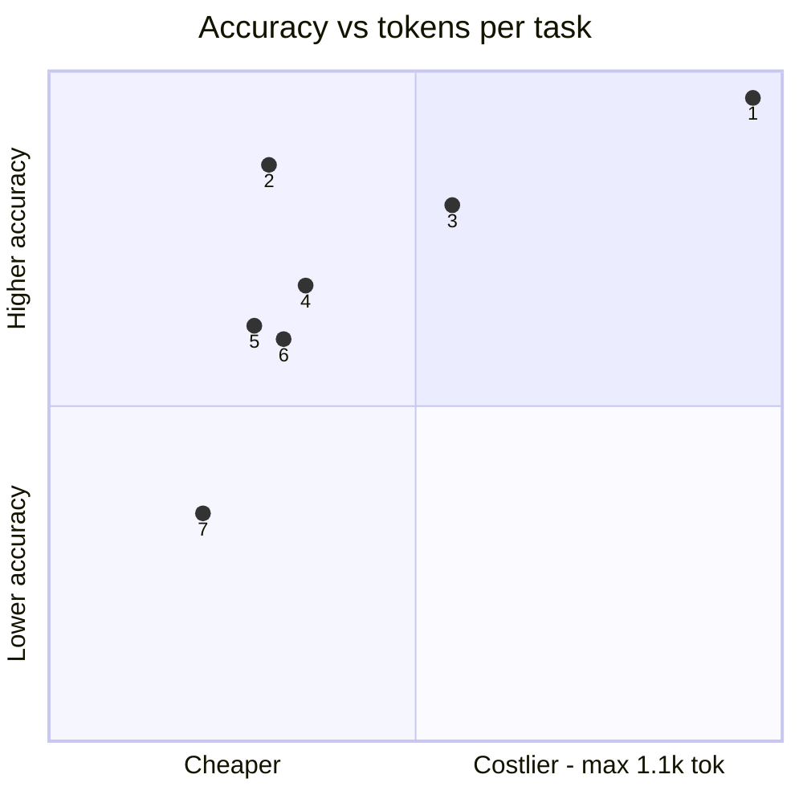
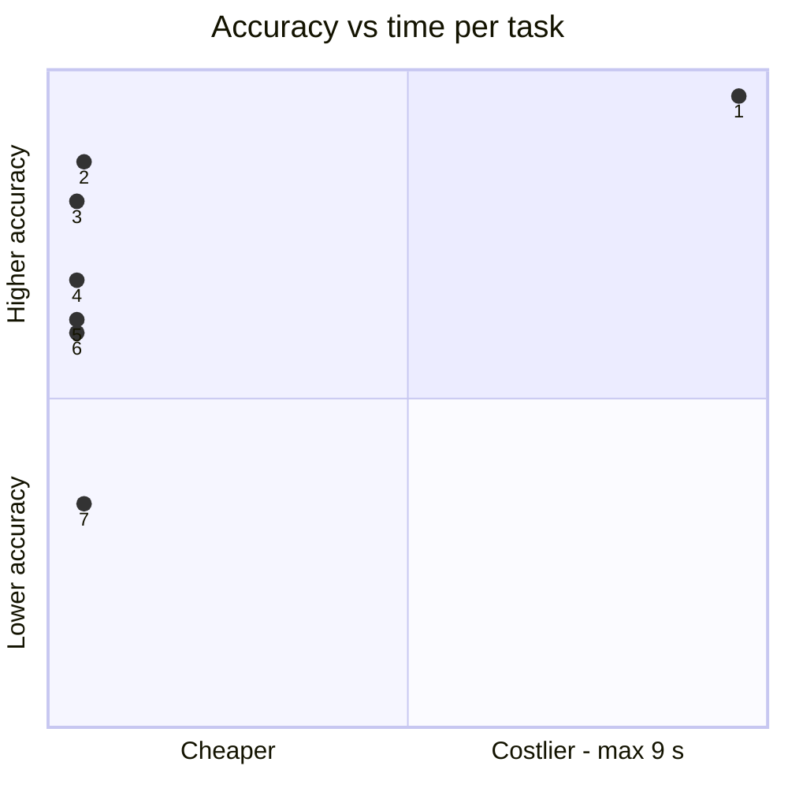
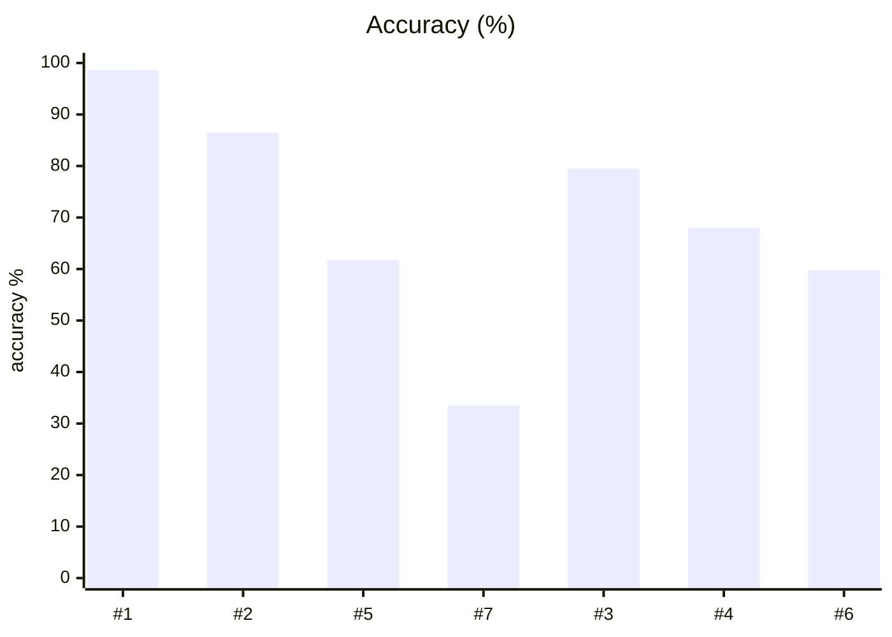
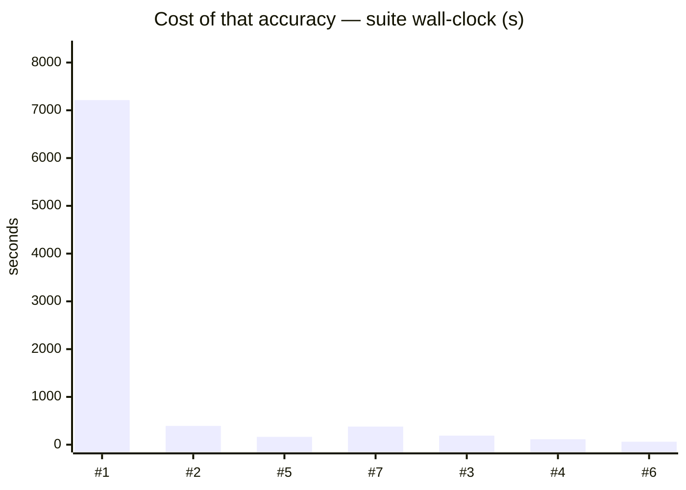
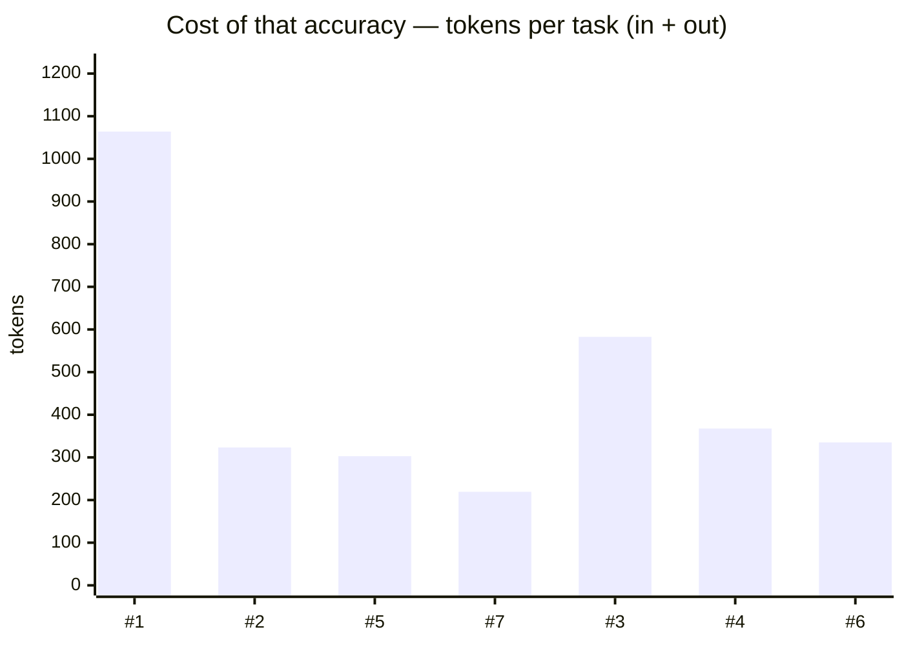
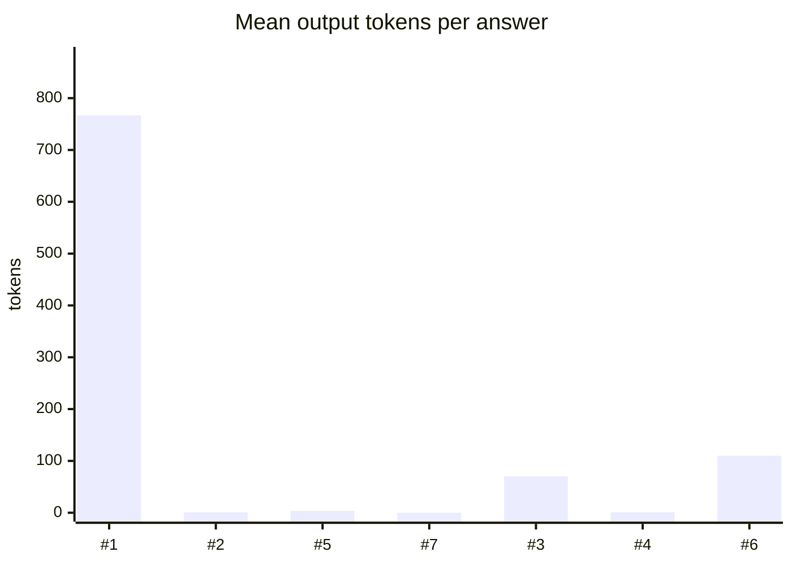

# System One v2 — full v1 roster re-measured

**Question.** How do all ten v1-board models rank on the 400-question v2 suite?

**Verdict.** Qwen3.6-35B with thinking enabled is the clear v2 leader (98.6%, intervals disjoint from every other arm) — reasoning is the dominant lever on this dataset. Hosted Mercury Decide (86.5%) beats hosted Jev (79.5%); Nimble-9B (68.0% as-scored, 71.6% optioned) remains the best local no-thinking backend; Kev-4B (59.8%) and Qwen think-OFF (61.8%) sit mid-pack; Laya (33.5%) is not viable on v2. Kev-27B, Clef-Flash-9B and Clef-27B could not be re-measured within the shared-memory ceiling.

## Setup

| | |
|---|---|
| Endpoint | mixed — `http://localhost:8001` (montimage-dgx-sp ON), `http://localhost:8124` (mercury-decide:f OFF), `http://localhost:8001` (montimage-dgx-sp OFF), `http://localhost:8124` (laya-typed-decis OFF), `http://localhost:8124` (jev-latest OFF), `http://localhost:8124` (nimble OFF), `http://localhost:8124` (kev-latest OFF) |
| Tasks | 400 |
| Samples per task | 2 (⇒ 800 generations per run) |
| Concurrency | 1 |
| Metric | accuracy over exact-match answers on typed decision questions, with a 95% Wilson interval |

## Headline

| Run | Accuracy (95% CI) | Tokens per task | Time per task |
|---|---|---|---|---|
| qwen3-6-35b-a3b-nvfp4-thinkon-system1-v2 | 98.6 % (98–99) | 297 in / 767 out | 9.0 s |
| mercury-decide-free-system1-v2 | 86.5 % (84–89) | 322 in / 1 out | 0.5 s |
| qwen3-6-35b-a3b-nvfp4-thinkoff-system1-v2 | 61.8 % (58–65) | 299 in / 4 out | 0.2 s |
| laya-typed-decisions-system1-v2 | 33.5 % (30–37) | 219 in / 0 out | 0.5 s |
| typesafe jev-1.13.0 api.typesafe.ai system1-v2 | 79.5 % (77–82) | 512 in / 70 out | 0.2 s |
| bespoke-nimble-9b ollama Q8_0 system1-v2 | 68.0 % (65–71) | 367 in / 1 out (760/800 reported) | 0.1 s |
| kev-4b jaredpalmer kev.serve bf16 system1-v2 | 59.8 % (56–63) | 225 in / 110 out | 0.1 s |

<sub>The bracket is the 95% Wilson interval of the solve rate, in points. *Tokens* and *time* are the mean per task attempt (input and output tokens as the endpoint or harness reported them; wall-clock seconds).</sub>

## At a glance

| # | Run | Harness · thinking | Accuracy | Tokens / task | Time / task |
|---|---|---|---|---|---|
| 1 | qwen3-6-35b-a3b-nvfp4-thinkon-system1-v2 | built-in loop · ON | `█████████▉` 99 % <sub>(98–99)</sub> | `██████████` 1.1k | `██████████` 9 s |
| 2 | mercury-decide-free-system1-v2 | built-in loop · OFF | `████████▋░` 86 % <sub>(84–89)</sub> | `███░░░░░░░` 323 | `▌░░░░░░░░░` 0 s |
| 3 | typesafe jev-1.13.0 api.typesafe.ai system1-v2 | built-in loop · OFF | `████████░░` 80 % <sub>(77–82)</sub> | `█████▌░░░░` 583 | `▎░░░░░░░░░` 0 s |
| 4 | bespoke-nimble-9b ollama Q8_0 system1-v2 | built-in loop · OFF | `██████▊░░░` 68 % <sub>(65–71)</sub> ⚠ 40/800 errored | `███▌░░░░░░` 368 | `▏░░░░░░░░░` 0 s |
| 5 | qwen3-6-35b-a3b-nvfp4-thinkoff-system1-v2 | built-in loop · OFF | `██████▏░░░` 62 % <sub>(58–65)</sub> | `██▉░░░░░░░` 303 | `▎░░░░░░░░░` 0 s |
| 6 | kev-4b jaredpalmer kev.serve bf16 system1-v2 | built-in loop · OFF | `██████░░░░` 60 % <sub>(56–63)</sub> | `███▏░░░░░░` 335 | `▏░░░░░░░░░` 0 s |
| 7 | laya-typed-decisions-system1-v2 | built-in loop · OFF | `███▍░░░░░░` 34 % <sub>(30–37)</sub> | `██▏░░░░░░░` 219 | `▌░░░░░░░░░` 0 s |

<sub>Solve-rate bars run 0–100 %, bracket = 95% interval. Token and time bars are scaled to the costliest row — shorter is cheaper. Rows are sorted only **within** one harness and thinking mode; bars from different groups are side by side, not ranked.</sub>





<sub>Points are the `#` column above. Up is better, left is cheaper: the top-left corner is the most solved for the least spent. Cost is scaled to the costliest run.</sub>

## Results

| Run | Accuracy | easy | medium | hard | Wall | Mean out tok | Truncated | tok/s |
|---|---|---|---|---|---|---|---|---|
| **qwen3-6-35b-a3b-nvfp4-thinkon-system1-v2** | **98.6 %** | — | 100.0 % | 98.3 % | 7,213 s | 767 | 0 | 84.8 |
| mercury-decide-free-system1-v2 | 86.5 % | — | 91.2 % | 85.3 % | 392 s | 1 | 0 | 2.2 |
| qwen3-6-35b-a3b-nvfp4-thinkoff-system1-v2 | 61.8 % | — | 66.2 % | 60.6 % | 164 s | 4 | 0 | 18.6 |
| laya-typed-decisions-system1-v2 | 33.5 % | — | 37.5 % | 32.5 % | 378 s | — | 0 | — |
| typesafe jev-1.13.0 api.typesafe.ai system1-v2 | 79.5 % | — | 85.0 % | 78.1 % | 189 s | 70 | 0 | 305.9 |
| bespoke-nimble-9b ollama Q8_0 system1-v2 | 68.0 % | — | 76.2 % | 65.9 % | 114 s | 1 | 0 | 8.9 |
| kev-4b jaredpalmer kev.serve bf16 system1-v2 | 59.8 % | — | 65.0 % | 58.4 % | 62 s | 110 | 0 | 1,521.9 |

<sub>Bars below are numbered as in the `#` column of *At a glance*.</sub>









## By difficulty

| Run | easy | medium | hard |
|---|---|---|---|
| qwen3-6-35b-a3b-nvfp4-thinkon-system1-v2 | — | `████████` 100 % | `███████▉` 98 % |
| mercury-decide-free-system1-v2 | — | `███████▎` 91 % | `██████▉░` 85 % |
| qwen3-6-35b-a3b-nvfp4-thinkoff-system1-v2 | — | `█████▎░░` 66 % | `████▉░░░` 61 % |
| laya-typed-decisions-system1-v2 | — | `███░░░░░` 38 % | `██▋░░░░░` 32 % |
| typesafe jev-1.13.0 api.typesafe.ai system1-v2 | — | `██████▊░` 85 % | `██████▎░` 78 % |
| bespoke-nimble-9b ollama Q8_0 system1-v2 | — | `██████▏░` 76 % | `█████▎░░` 66 % |
| kev-4b jaredpalmer kev.serve bf16 system1-v2 | — | `█████▎░░` 65 % | `████▋░░░` 58 % |

## Task by task

<sub>Per-task solve rate (%). Tasks the runs disagree on are listed first, widest gap on top.</sub>

| Task | montimage-dgx-sp ON | mercury-decide:f OFF | montimage-dgx-sp OFF | laya-typed-decis OFF | jev-latest OFF | nimble OFF | kev-latest OFF |
|---|---|---|---|---|---|---|---|
| `access_01/q2` | 🟩 100 | 🟩 100 | 🟩 100 | 🟩 100 | 🟩 100 | 🟩 100 | 🟥 0 |
| `access_02/q1` | 🟩 100 | 🟩 100 | 🟩 100 | 🟥 0 | 🟩 100 | 🟩 100 | 🟩 100 |
| `access_02/q2` | 🟩 100 | 🟩 100 | 🟩 100 | 🟥 0 | 🟩 100 | 🟩 100 | 🟩 100 |
| `access_04/q1` | 🟩 100 | 🟩 100 | 🟩 100 | 🟥 0 | 🟩 100 | 🟩 100 | 🟩 100 |
| `access_04/q2` | 🟩 100 | 🟩 100 | 🟥 0 | 🟥 0 | 🟩 100 | 🟩 100 | 🟥 0 |
| `access_05/q1` | 🟩 100 | 🟥 0 | 🟩 100 | 🟩 100 | 🟩 100 | 🟥 0 | 🟥 0 |
| `access_05/q2` | 🟩 100 | 🟩 100 | 🟩 100 | 🟩 100 | 🟩 100 | 🟥 0 | 🟩 100 |
| `access_06/q1` | 🟩 100 | 🟩 100 | 🟩 100 | 🟥 0 | 🟩 100 | 🟩 100 | 🟩 100 |
| `access_07/q2` | 🟩 100 | 🟩 100 | 🟩 100 | 🟥 0 | 🟩 100 | 🟩 100 | 🟩 100 |
| `access_08/q1` | 🟩 100 | 🟩 100 | 🟥 0 | 🟥 0 | 🟩 100 | 🟩 100 | 🟩 100 |
| `access_08/q2` | 🟨 50 | 🟩 100 | 🟥 0 | 🟥 0 | 🟥 0 | 🟩 100 | 🟥 0 |
| `access_09/q1` | 🟩 100 | 🟩 100 | 🟨 50 | 🟥 0 | 🟩 100 | 🟥 0 | 🟥 0 |
| `access_09/q2` | 🟩 100 | 🟩 100 | 🟥 0 | 🟥 0 | 🟥 0 | 🟥 0 | 🟥 0 |
| `access_10/q1` | 🟩 100 | 🟩 100 | 🟩 100 | 🟥 0 | 🟩 100 | 🟩 100 | 🟩 100 |
| `access_10/q2` | 🟩 100 | 🟩 100 | 🟩 100 | 🟥 0 | 🟩 100 | 🟩 100 | 🟥 0 |
| `access_11/q1` | 🟩 100 | 🟩 100 | 🟩 100 | 🟥 0 | 🟩 100 | 🟩 100 | 🟩 100 |
| `access_11/q2` | 🟩 100 | 🟩 100 | 🟥 0 | 🟥 0 | 🟩 100 | 🟩 100 | 🟩 100 |
| `access_12/q2` | 🟩 100 | 🟩 100 | 🟩 100 | 🟥 0 | 🟩 100 | 🟩 100 | 🟩 100 |
| `access_13/q1` | 🟩 100 | 🟩 100 | 🟩 100 | 🟥 0 | 🟩 100 | 🟥 0 | 🟩 100 |
| `access_13/q2` | 🟩 100 | 🟩 100 | 🟥 0 | 🟥 0 | 🟥 0 | 🟥 0 | 🟩 100 |
| `access_14/q1` | 🟩 100 | 🟩 100 | 🟥 0 | 🟥 0 | 🟨 50 | 🟥 0 | 🟥 0 |
| `access_14/q2` | 🟩 100 | 🟩 100 | 🟥 0 | 🟥 0 | 🟨 50 | 🟥 0 | 🟥 0 |
| `access_15/q1` | 🟩 100 | 🟩 100 | 🟨 50 | 🟩 100 | 🟩 100 | 🟥 0 | 🟥 0 |
| `access_15/q2` | 🟩 100 | 🟩 100 | 🟩 100 | 🟩 100 | 🟩 100 | 🟩 100 | 🟥 0 |
| `access_16/q2` | 🟩 100 | 🟩 100 | 🟩 100 | 🟥 0 | 🟩 100 | 🟩 100 | 🟩 100 |
| `access_17/q2` | 🟩 100 | 🟩 100 | 🟩 100 | 🟩 100 | 🟩 100 | 🟩 100 | 🟥 0 |
| `access_18/q2` | 🟩 100 | 🟩 100 | 🟩 100 | 🟥 0 | 🟩 100 | 🟩 100 | 🟩 100 |
| `access_19/q1` | 🟩 100 | 🟩 100 | 🟩 100 | 🟥 0 | 🟩 100 | 🟩 100 | 🟩 100 |
| `access_19/q2` | 🟩 100 | 🟩 100 | 🟩 100 | 🟥 0 | 🟩 100 | 🟩 100 | 🟩 100 |
| `access_20/q2` | 🟩 100 | 🟩 100 | 🟩 100 | 🟩 100 | 🟩 100 | 🟩 100 | 🟥 0 |
| `dependencies_01/q2` | 🟩 100 | 🟩 100 | 🟩 100 | 🟥 0 | 🟩 100 | 🟩 100 | 🟩 100 |
| `dependencies_02/q1` | 🟩 100 | 🟩 100 | 🟥 0 | 🟥 0 | 🟩 100 | 🟥 0 | 🟥 0 |
| `dependencies_02/q2` | 🟩 100 | 🟩 100 | 🟨 50 | 🟥 0 | 🟩 100 | 🟩 100 | 🟥 0 |
| `dependencies_03/q1` | 🟩 100 | 🟩 100 | 🟥 0 | 🟥 0 | 🟩 100 | 🟩 100 | 🟥 0 |
| `dependencies_03/q2` | 🟩 100 | 🟩 100 | 🟥 0 | 🟩 100 | 🟩 100 | 🟥 0 | 🟥 0 |
| `dependencies_04/q1` | 🟩 100 | 🟩 100 | 🟥 0 | 🟥 0 | 🟩 100 | 🟩 100 | 🟥 0 |
| `dependencies_05/q1` | 🟩 100 | 🟥 0 | 🟥 0 | 🟥 0 | 🟥 0 | 🟥 0 | 🟥 0 |
| `dependencies_05/q2` | 🟩 100 | 🟨 50 | 🟩 100 | 🟥 0 | 🟩 100 | 🟩 100 | 🟩 100 |
| `dependencies_06/q1` | 🟩 100 | 🟩 100 | 🟥 0 | 🟥 0 | 🟩 100 | 🟩 100 | 🟥 0 |
| `dependencies_06/q2` | 🟩 100 | 🟩 100 | 🟥 0 | 🟥 0 | 🟩 100 | 🟥 0 | 🟥 0 |
| `dependencies_07/q2` | 🟩 100 | 🟩 100 | 🟥 0 | 🟥 0 | 🟥 0 | 🟥 0 | 🟥 0 |
| `dependencies_08/q1` | 🟩 100 | 🟩 100 | 🟥 0 | 🟥 0 | 🟩 100 | 🟩 100 | 🟥 0 |
| `dependencies_09/q1` | 🟩 100 | 🟩 100 | 🟩 100 | 🟥 0 | 🟩 100 | 🟩 100 | 🟥 0 |
| `dependencies_09/q2` | 🟩 100 | 🟩 100 | 🟩 100 | 🟥 0 | 🟩 100 | 🟥 0 | 🟥 0 |
| `dependencies_10/q1` | 🟩 100 | 🟩 100 | 🟩 100 | 🟥 0 | 🟩 100 | 🟥 0 | 🟩 100 |
| `dependencies_10/q2` | 🟩 100 | 🟩 100 | 🟩 100 | 🟥 0 | 🟩 100 | 🟩 100 | 🟩 100 |
| `dependencies_11/q1` | 🟩 100 | 🟩 100 | 🟩 100 | 🟥 0 | 🟩 100 | 🟥 0 | 🟥 0 |
| `dependencies_11/q2` | 🟩 100 | 🟩 100 | 🟩 100 | 🟥 0 | 🟩 100 | 🟩 100 | 🟩 100 |
| `dependencies_12/q1` | 🟩 100 | 🟥 0 | 🟨 50 | 🟩 100 | 🟩 100 | 🟩 100 | 🟩 100 |
| `dependencies_12/q2` | 🟩 100 | 🟩 100 | 🟩 100 | 🟥 0 | 🟩 100 | 🟩 100 | 🟩 100 |
| `dependencies_13/q1` | 🟩 100 | 🟩 100 | 🟩 100 | 🟥 0 | 🟥 0 | 🟥 0 | 🟩 100 |
| `dependencies_14/q1` | 🟩 100 | 🟩 100 | 🟩 100 | 🟥 0 | 🟩 100 | 🟥 0 | 🟩 100 |
| `dependencies_15/q1` | 🟩 100 | 🟩 100 | 🟩 100 | 🟥 0 | 🟩 100 | 🟩 100 | 🟩 100 |
| `dependencies_15/q2` | 🟩 100 | 🟩 100 | 🟩 100 | 🟥 0 | 🟩 100 | 🟩 100 | 🟩 100 |
| `dependencies_16/q1` | 🟩 100 | 🟩 100 | 🟨 50 | 🟥 0 | 🟩 100 | 🟥 0 | 🟥 0 |
| `dependencies_16/q2` | 🟩 100 | 🟩 100 | 🟥 0 | 🟥 0 | 🟥 0 | 🟥 0 | 🟥 0 |
| `dependencies_17/q1` | 🟩 100 | 🟩 100 | 🟩 100 | 🟥 0 | 🟩 100 | 🟩 100 | 🟩 100 |
| `dependencies_17/q2` | 🟩 100 | 🟩 100 | 🟩 100 | 🟥 0 | 🟩 100 | 🟩 100 | 🟩 100 |
| `dependencies_18/q1` | 🟩 100 | 🟩 100 | 🟩 100 | 🟥 0 | 🟩 100 | 🟩 100 | 🟩 100 |
| `dependencies_18/q2` | 🟩 100 | 🟩 100 | 🟨 50 | 🟥 0 | 🟩 100 | 🟩 100 | 🟩 100 |
| `dependencies_19/q1` | 🟩 100 | 🟩 100 | 🟩 100 | 🟥 0 | 🟩 100 | 🟥 0 | 🟩 100 |
| `dependencies_19/q2` | 🟩 100 | 🟩 100 | 🟩 100 | 🟥 0 | 🟩 100 | 🟩 100 | 🟥 0 |
| `dependencies_20/q1` | 🟩 100 | 🟩 100 | 🟩 100 | 🟥 0 | 🟩 100 | 🟥 0 | 🟩 100 |
| `dependencies_20/q2` | 🟩 100 | 🟩 100 | 🟩 100 | 🟥 0 | 🟩 100 | 🟩 100 | 🟩 100 |
| `events_01/q1` | 🟩 100 | 🟩 100 | 🟥 0 | 🟥 0 | 🟩 100 | 🟩 100 | 🟩 100 |
| `events_01/q2` | 🟩 100 | 🟩 100 | 🟥 0 | 🟩 100 | 🟩 100 | 🟩 100 | 🟩 100 |
| `events_02/q1` | 🟩 100 | 🟩 100 | 🟨 50 | 🟥 0 | 🟩 100 | 🟩 100 | 🟩 100 |
| `events_02/q2` | 🟩 100 | 🟩 100 | 🟩 100 | 🟥 0 | 🟩 100 | 🟩 100 | 🟥 0 |
| `events_03/q1` | 🟩 100 | 🟩 100 | 🟥 0 | 🟥 0 | 🟩 100 | 🟩 100 | 🟩 100 |
| `events_03/q2` | 🟩 100 | 🟩 100 | 🟥 0 | 🟥 0 | 🟩 100 | 🟥 0 | 🟥 0 |
| `events_04/q1` | 🟩 100 | 🟩 100 | 🟥 0 | 🟩 100 | 🟥 0 | 🟩 100 | 🟩 100 |
| `events_04/q2` | 🟩 100 | 🟩 100 | 🟩 100 | 🟥 0 | 🟩 100 | 🟩 100 | 🟩 100 |
| `events_05/q1` | 🟩 100 | 🟩 100 | 🟥 0 | 🟥 0 | 🟩 100 | 🟩 100 | 🟩 100 |
| `events_05/q2` | 🟩 100 | 🟩 100 | 🟥 0 | 🟩 100 | 🟩 100 | 🟩 100 | 🟥 0 |
| `events_06/q1` | 🟩 100 | 🟩 100 | 🟥 0 | 🟥 0 | 🟩 100 | 🟥 0 | 🟩 100 |
| `events_06/q2` | 🟩 100 | 🟩 100 | 🟥 0 | 🟥 0 | 🟩 100 | 🟥 0 | 🟥 0 |
| `events_07/q1` | 🟩 100 | 🟩 100 | 🟥 0 | 🟥 0 | 🟩 100 | 🟩 100 | 🟩 100 |
| `events_07/q2` | 🟩 100 | 🟩 100 | 🟥 0 | 🟥 0 | 🟩 100 | 🟩 100 | 🟩 100 |
| `events_08/q1` | 🟥 0 | 🟩 100 | 🟥 0 | 🟥 0 | 🟥 0 | 🟥 0 | 🟩 100 |
| `events_08/q2` | 🟨 50 | 🟩 100 | 🟥 0 | 🟥 0 | 🟩 100 | 🟥 0 | 🟩 100 |
| `events_09/q1` | 🟩 100 | 🟩 100 | 🟥 0 | 🟥 0 | 🟩 100 | 🟩 100 | 🟩 100 |
| `events_09/q2` | 🟩 100 | 🟩 100 | 🟥 0 | 🟥 0 | 🟩 100 | 🟩 100 | 🟥 0 |
| `events_10/q1` | 🟩 100 | 🟥 0 | 🟥 0 | 🟥 0 | 🟥 0 | 🟩 100 | 🟥 0 |
| `events_10/q2` | 🟩 100 | 🟩 100 | 🟥 0 | 🟥 0 | 🟩 100 | 🟥 0 | 🟥 0 |
| `events_11/q1` | 🟩 100 | 🟩 100 | 🟥 0 | 🟩 100 | 🟩 100 | 🟩 100 | 🟩 100 |
| `events_11/q2` | 🟩 100 | 🟩 100 | 🟥 0 | 🟥 0 | 🟩 100 | 🟩 100 | 🟥 0 |
| `events_12/q1` | 🟩 100 | 🟩 100 | 🟩 100 | 🟥 0 | 🟩 100 | 🟩 100 | 🟩 100 |
| `events_12/q2` | 🟩 100 | 🟩 100 | 🟩 100 | 🟥 0 | 🟩 100 | 🟩 100 | 🟥 0 |
| `events_13/q1` | 🟩 100 | 🟩 100 | 🟥 0 | 🟥 0 | 🟨 50 | 🟩 100 | 🟩 100 |
| `events_13/q2` | 🟩 100 | 🟩 100 | 🟥 0 | 🟥 0 | 🟨 50 | 🟩 100 | 🟩 100 |
| `events_14/q1` | 🟩 100 | 🟩 100 | 🟥 0 | 🟥 0 | 🟩 100 | 🟩 100 | 🟩 100 |
| `events_14/q2` | 🟩 100 | 🟩 100 | 🟥 0 | 🟥 0 | 🟩 100 | 🟩 100 | 🟥 0 |
| `events_15/q1` | 🟩 100 | 🟥 0 | 🟥 0 | 🟥 0 | 🟩 100 | 🟩 100 | 🟥 0 |
| `events_15/q2` | 🟩 100 | 🟩 100 | 🟥 0 | 🟥 0 | 🟩 100 | 🟩 100 | 🟥 0 |
| `events_16/q2` | 🟩 100 | 🟩 100 | 🟩 100 | 🟥 0 | 🟩 100 | 🟩 100 | 🟩 100 |
| `events_17/q1` | 🟩 100 | 🟩 100 | 🟥 0 | 🟥 0 | 🟥 0 | 🟥 0 | 🟥 0 |
| `events_17/q2` | 🟩 100 | 🟩 100 | 🟥 0 | 🟥 0 | 🟥 0 | 🟥 0 | 🟥 0 |
| `events_18/q1` | 🟩 100 | 🟩 100 | 🟥 0 | 🟩 100 | 🟩 100 | 🟩 100 | 🟩 100 |
| `events_18/q2` | 🟩 100 | 🟩 100 | 🟩 100 | 🟥 0 | 🟩 100 | 🟩 100 | 🟩 100 |
| `events_19/q1` | 🟩 100 | 🟩 100 | 🟩 100 | 🟥 0 | 🟩 100 | 🟥 0 | 🟥 0 |
| `events_19/q2` | 🟩 100 | 🟩 100 | 🟨 50 | 🟥 0 | 🟩 100 | 🟩 100 | 🟥 0 |
| `events_20/q1` | 🟩 100 | 🟩 100 | 🟥 0 | 🟥 0 | 🟩 100 | 🟩 100 | 🟩 100 |
| `events_20/q2` | 🟩 100 | 🟩 100 | 🟥 0 | 🟥 0 | 🟩 100 | 🟩 100 | 🟥 0 |
| `evidence_02/q1` | 🟩 100 | 🟩 100 | 🟩 100 | 🟥 0 | 🟩 100 | 🟩 100 | 🟩 100 |
| `evidence_02/q2` | 🟩 100 | 🟩 100 | 🟩 100 | 🟩 100 | 🟩 100 | 🟩 100 | 🟥 0 |
| `evidence_03/q2` | 🟩 100 | 🟩 100 | 🟩 100 | 🟥 0 | 🟩 100 | 🟩 100 | 🟩 100 |
| `evidence_04/q1` | 🟩 100 | 🟩 100 | 🟩 100 | 🟥 0 | 🟩 100 | 🟩 100 | 🟩 100 |
| `evidence_05/q1` | 🟩 100 | 🟩 100 | 🟩 100 | 🟥 0 | 🟩 100 | 🟩 100 | 🟩 100 |
| `evidence_06/q1` | 🟩 100 | 🟩 100 | 🟩 100 | 🟩 100 | 🟩 100 | 🟩 100 | 🟥 0 |
| `evidence_07/q2` | 🟩 100 | 🟩 100 | 🟩 100 | 🟥 0 | 🟩 100 | 🟩 100 | 🟩 100 |
| `evidence_08/q1` | 🟩 100 | 🟩 100 | 🟩 100 | 🟩 100 | 🟩 100 | 🟥 0 | 🟩 100 |
| `evidence_08/q2` | 🟩 100 | 🟩 100 | 🟩 100 | 🟥 0 | 🟩 100 | 🟩 100 | 🟥 0 |
| `evidence_10/q2` | 🟩 100 | 🟩 100 | 🟩 100 | 🟥 0 | 🟩 100 | 🟩 100 | 🟥 0 |
| `evidence_11/q1` | 🟩 100 | 🟩 100 | 🟩 100 | 🟩 100 | 🟩 100 | 🟩 100 | 🟥 0 |
| `evidence_14/q1` | 🟩 100 | 🟩 100 | 🟩 100 | 🟥 0 | 🟩 100 | 🟩 100 | 🟩 100 |
| `evidence_15/q1` | 🟩 100 | 🟩 100 | 🟩 100 | 🟩 100 | 🟩 100 | 🟥 0 | 🟩 100 |
| `evidence_15/q2` | 🟩 100 | 🟩 100 | 🟩 100 | 🟩 100 | 🟩 100 | 🟥 0 | 🟥 0 |
| `evidence_16/q1` | 🟩 100 | 🟩 100 | 🟩 100 | 🟥 0 | 🟩 100 | 🟩 100 | 🟩 100 |
| `evidence_16/q2` | 🟩 100 | 🟩 100 | 🟩 100 | 🟥 0 | 🟩 100 | 🟩 100 | 🟩 100 |
| `evidence_17/q2` | 🟩 100 | 🟩 100 | 🟩 100 | 🟥 0 | 🟩 100 | 🟩 100 | 🟩 100 |
| `evidence_18/q2` | 🟩 100 | 🟩 100 | 🟩 100 | 🟩 100 | 🟩 100 | 🟩 100 | 🟥 0 |
| `evidence_19/q1` | 🟩 100 | 🟩 100 | 🟩 100 | 🟥 0 | 🟩 100 | 🟩 100 | 🟩 100 |
| `evidence_20/q1` | 🟥 0 | 🟥 0 | 🟥 0 | 🟥 0 | 🟩 100 | 🟩 100 | 🟩 100 |
| `evidence_20/q2` | 🟩 100 | 🟩 100 | 🟩 100 | 🟩 100 | 🟩 100 | 🟩 100 | 🟥 0 |
| `inventory_01/q1` | 🟩 100 | 🟥 0 | 🟨 50 | 🟥 0 | 🟥 0 | 🟩 100 | 🟥 0 |
| `inventory_01/q2` | 🟩 100 | 🟩 100 | 🟥 0 | 🟩 100 | 🟩 100 | 🟩 100 | 🟥 0 |
| `inventory_02/q1` | 🟩 100 | 🟩 100 | 🟨 50 | 🟥 0 | 🟩 100 | 🟥 0 | 🟩 100 |
| `inventory_02/q2` | 🟩 100 | 🟩 100 | 🟥 0 | 🟥 0 | 🟩 100 | 🟩 100 | 🟩 100 |
| `inventory_03/q2` | 🟩 100 | 🟩 100 | 🟩 100 | 🟥 0 | 🟩 100 | 🟩 100 | 🟩 100 |
| `inventory_04/q1` | 🟩 100 | 🟥 0 | 🟨 50 | 🟥 0 | 🟥 0 | 🟥 0 | 🟥 0 |
| `inventory_04/q2` | 🟩 100 | 🟩 100 | 🟨 50 | 🟥 0 | 🟩 100 | 🟩 100 | 🟩 100 |
| `inventory_05/q1` | 🟩 100 | 🟥 0 | 🟩 100 | 🟥 0 | 🟥 0 | 🟩 100 | 🟥 0 |
| `inventory_05/q2` | 🟩 100 | 🟩 100 | 🟥 0 | 🟩 100 | 🟩 100 | 🟩 100 | 🟩 100 |
| `inventory_06/q1` | 🟩 100 | 🟩 100 | 🟥 0 | 🟥 0 | 🟥 0 | 🟥 0 | 🟥 0 |
| `inventory_06/q2` | 🟩 100 | 🟩 100 | 🟥 0 | 🟥 0 | 🟩 100 | 🟩 100 | 🟥 0 |
| `inventory_07/q1` | 🟩 100 | 🟥 0 | 🟩 100 | 🟥 0 | 🟩 100 | 🟩 100 | 🟥 0 |
| `inventory_07/q2` | 🟩 100 | 🟥 0 | 🟥 0 | 🟩 100 | 🟥 0 | 🟥 0 | 🟥 0 |
| `inventory_08/q2` | 🟩 100 | 🟩 100 | 🟥 0 | 🟥 0 | 🟩 100 | 🟩 100 | 🟩 100 |
| `inventory_09/q1` | 🟩 100 | 🟩 100 | 🟨 50 | 🟥 0 | 🟩 100 | 🟩 100 | 🟩 100 |
| `inventory_11/q1` | 🟩 100 | 🟩 100 | 🟩 100 | 🟥 0 | 🟩 100 | 🟥 0 | 🟩 100 |
| `inventory_11/q2` | 🟩 100 | 🟩 100 | 🟩 100 | 🟥 0 | 🟩 100 | 🟩 100 | 🟩 100 |
| `inventory_13/q1` | 🟩 100 | 🟥 0 | 🟩 100 | 🟥 0 | 🟨 50 | 🟩 100 | 🟥 0 |
| `inventory_13/q2` | 🟩 100 | 🟨 50 | 🟥 0 | 🟥 0 | 🟩 100 | 🟥 0 | 🟥 0 |
| `inventory_14/q1` | 🟩 100 | 🟩 100 | 🟨 50 | 🟥 0 | 🟩 100 | 🟥 0 | 🟥 0 |
| `inventory_14/q2` | 🟩 100 | 🟥 0 | 🟥 0 | 🟩 100 | 🟩 100 | 🟥 0 | 🟩 100 |
| `inventory_15/q2` | 🟩 100 | 🟩 100 | 🟩 100 | 🟥 0 | 🟩 100 | 🟩 100 | 🟩 100 |
| `inventory_16/q1` | 🟩 100 | 🟥 0 | 🟩 100 | 🟥 0 | 🟩 100 | 🟥 0 | 🟥 0 |
| `inventory_16/q2` | 🟩 100 | 🟩 100 | 🟥 0 | 🟥 0 | 🟩 100 | 🟩 100 | 🟥 0 |
| `inventory_17/q1` | 🟩 100 | 🟥 0 | 🟨 50 | 🟥 0 | 🟥 0 | 🟩 100 | 🟥 0 |
| `inventory_17/q2` | 🟩 100 | 🟩 100 | 🟩 100 | 🟥 0 | 🟩 100 | 🟩 100 | 🟩 100 |
| `inventory_18/q1` | 🟩 100 | 🟩 100 | 🟥 0 | 🟥 0 | 🟩 100 | 🟥 0 | 🟥 0 |
| `inventory_18/q2` | 🟩 100 | 🟩 100 | 🟩 100 | 🟥 0 | 🟩 100 | 🟩 100 | 🟩 100 |
| `inventory_19/q1` | 🟩 100 | 🟥 0 | 🟥 0 | 🟥 0 | 🟥 0 | 🟥 0 | 🟥 0 |
| `inventory_19/q2` | 🟩 100 | 🟥 0 | 🟨 50 | 🟥 0 | 🟩 100 | 🟩 100 | 🟥 0 |
| `inventory_20/q1` | 🟩 100 | 🟥 0 | 🟩 100 | 🟥 0 | 🟥 0 | 🟩 100 | 🟥 0 |
| `inventory_20/q2` | 🟩 100 | 🟩 100 | 🟨 50 | 🟥 0 | 🟩 100 | 🟩 100 | 🟥 0 |
| `money_01/q1` | 🟩 100 | 🟥 0 | 🟥 0 | 🟥 0 | 🟥 0 | 🟩 100 | 🟥 0 |
| `money_01/q2` | 🟩 100 | 🟩 100 | 🟥 0 | 🟩 100 | 🟩 100 | 🟩 100 | 🟩 100 |
| `money_02/q1` | 🟩 100 | 🟥 0 | 🟨 50 | 🟥 0 | 🟩 100 | 🟩 100 | 🟩 100 |
| `money_02/q2` | 🟩 100 | 🟩 100 | 🟥 0 | 🟥 0 | 🟩 100 | 🟥 0 | 🟩 100 |
| `money_03/q1` | 🟩 100 | 🟩 100 | 🟨 50 | 🟩 100 | 🟥 0 | 🟥 0 | 🟩 100 |
| `money_03/q2` | 🟩 100 | 🟩 100 | 🟩 100 | 🟥 0 | 🟩 100 | 🟥 0 | 🟩 100 |
| `money_04/q1` | 🟩 100 | 🟩 100 | 🟩 100 | 🟥 0 | 🟩 100 | 🟩 100 | 🟥 0 |
| `money_04/q2` | 🟩 100 | 🟩 100 | 🟥 0 | 🟥 0 | 🟩 100 | 🟩 100 | 🟩 100 |
| `money_05/q1` | 🟩 100 | 🟥 0 | 🟨 50 | 🟥 0 | 🟩 100 | 🟩 100 | 🟩 100 |
| `money_05/q2` | 🟩 100 | 🟩 100 | 🟨 50 | 🟥 0 | 🟩 100 | 🟩 100 | 🟩 100 |
| `money_06/q1` | 🟩 100 | 🟩 100 | 🟩 100 | 🟩 100 | 🟥 0 | 🟥 0 | 🟥 0 |
| `money_06/q2` | 🟩 100 | 🟩 100 | 🟥 0 | 🟥 0 | 🟩 100 | 🟥 0 | 🟥 0 |
| `money_07/q1` | 🟩 100 | 🟥 0 | 🟩 100 | 🟥 0 | 🟨 50 | 🟩 100 | 🟥 0 |
| `money_07/q2` | 🟩 100 | 🟩 100 | 🟥 0 | 🟥 0 | 🟨 50 | 🟥 0 | 🟥 0 |
| `money_08/q1` | 🟩 100 | 🟥 0 | 🟨 50 | 🟩 100 | 🟥 0 | 🟥 0 | 🟩 100 |
| `money_08/q2` | 🟩 100 | 🟩 100 | 🟩 100 | 🟥 0 | 🟥 0 | 🟩 100 | 🟩 100 |
| `money_09/q1` | 🟩 100 | 🟩 100 | 🟨 50 | 🟥 0 | 🟩 100 | 🟩 100 | 🟩 100 |
| `money_09/q2` | 🟩 100 | 🟩 100 | 🟩 100 | 🟥 0 | 🟩 100 | 🟩 100 | 🟩 100 |
| `money_11/q1` | 🟩 100 | 🟩 100 | 🟥 0 | 🟩 100 | 🟥 0 | 🟩 100 | 🟥 0 |
| `money_11/q2` | 🟩 100 | 🟩 100 | 🟩 100 | 🟥 0 | 🟩 100 | 🟩 100 | 🟩 100 |
| `money_12/q1` | 🟩 100 | 🟥 0 | 🟩 100 | 🟥 0 | 🟥 0 | 🟥 0 | 🟥 0 |
| `money_12/q2` | 🟩 100 | 🟩 100 | 🟩 100 | 🟥 0 | 🟩 100 | 🟩 100 | 🟩 100 |
| `money_13/q1` | 🟩 100 | 🟩 100 | 🟨 50 | 🟩 100 | 🟨 50 | 🟩 100 | 🟥 0 |
| `money_13/q2` | 🟩 100 | 🟩 100 | 🟥 0 | 🟩 100 | 🟩 100 | 🟩 100 | 🟩 100 |
| `money_14/q1` | 🟩 100 | 🟥 0 | 🟨 50 | 🟥 0 | 🟥 0 | 🟥 0 | 🟩 100 |
| `money_14/q2` | 🟩 100 | 🟩 100 | 🟩 100 | 🟥 0 | 🟩 100 | 🟩 100 | 🟩 100 |
| `money_15/q1` | 🟩 100 | 🟩 100 | 🟨 50 | 🟩 100 | 🟩 100 | 🟥 0 | 🟥 0 |
| `money_15/q2` | 🟩 100 | 🟩 100 | 🟥 0 | 🟩 100 | 🟩 100 | 🟩 100 | 🟩 100 |
| `money_16/q1` | 🟩 100 | 🟥 0 | 🟥 0 | 🟥 0 | 🟥 0 | 🟥 0 | 🟥 0 |
| `money_16/q2` | 🟩 100 | 🟩 100 | 🟩 100 | 🟥 0 | 🟩 100 | 🟩 100 | 🟩 100 |
| `money_17/q1` | 🟩 100 | 🟩 100 | 🟥 0 | 🟩 100 | 🟥 0 | 🟥 0 | 🟥 0 |
| `money_17/q2` | 🟩 100 | 🟩 100 | 🟥 0 | 🟥 0 | 🟩 100 | 🟩 100 | 🟩 100 |
| `money_18/q1` | 🟩 100 | 🟥 0 | 🟨 50 | 🟥 0 | 🟩 100 | 🟩 100 | 🟩 100 |
| `money_18/q2` | 🟩 100 | 🟩 100 | 🟥 0 | 🟥 0 | 🟩 100 | 🟩 100 | 🟩 100 |
| `money_19/q1` | 🟩 100 | 🟥 0 | 🟨 50 | 🟩 100 | 🟨 50 | 🟥 0 | 🟥 0 |
| `money_19/q2` | 🟩 100 | 🟨 50 | 🟨 50 | 🟥 0 | 🟩 100 | 🟥 0 | 🟥 0 |
| `money_20/q1` | 🟩 100 | 🟩 100 | 🟥 0 | 🟥 0 | 🟥 0 | 🟥 0 | 🟥 0 |
| `money_20/q2` | 🟩 100 | 🟥 0 | 🟥 0 | 🟥 0 | 🟥 0 | 🟩 100 | 🟩 100 |
| `policy_01/q2` | 🟩 100 | 🟩 100 | 🟩 100 | 🟥 0 | 🟩 100 | 🟩 100 | 🟩 100 |
| `policy_02/q1` | 🟩 100 | 🟩 100 | 🟩 100 | 🟥 0 | 🟩 100 | 🟩 100 | 🟥 0 |
| `policy_02/q2` | 🟩 100 | 🟩 100 | 🟥 0 | 🟩 100 | 🟩 100 | 🟩 100 | 🟥 0 |
| `policy_03/q1` | 🟩 100 | 🟩 100 | 🟩 100 | 🟥 0 | 🟩 100 | 🟩 100 | 🟥 0 |
| `policy_03/q2` | 🟩 100 | 🟩 100 | 🟥 0 | 🟥 0 | 🟩 100 | 🟥 0 | 🟥 0 |
| `policy_04/q1` | 🟩 100 | 🟩 100 | 🟥 0 | 🟥 0 | 🟥 0 | 🟩 100 | 🟩 100 |
| `policy_04/q2` | 🟩 100 | 🟩 100 | 🟥 0 | 🟩 100 | 🟥 0 | 🟩 100 | 🟩 100 |
| `policy_05/q2` | 🟩 100 | 🟩 100 | 🟩 100 | 🟥 0 | 🟩 100 | 🟩 100 | 🟩 100 |
| `policy_06/q1` | 🟩 100 | 🟩 100 | 🟥 0 | 🟥 0 | 🟩 100 | 🟥 0 | 🟥 0 |
| `policy_06/q2` | 🟩 100 | 🟩 100 | 🟥 0 | 🟥 0 | 🟩 100 | 🟥 0 | 🟥 0 |
| `policy_07/q1` | 🟩 100 | 🟩 100 | 🟩 100 | 🟥 0 | 🟩 100 | 🟩 100 | 🟥 0 |
| `policy_07/q2` | 🟩 100 | 🟩 100 | 🟩 100 | 🟥 0 | 🟩 100 | 🟩 100 | 🟥 0 |
| `policy_08/q1` | 🟩 100 | 🟩 100 | 🟩 100 | 🟥 0 | 🟩 100 | 🟩 100 | 🟩 100 |
| `policy_09/q2` | 🟩 100 | 🟩 100 | 🟨 50 | 🟥 0 | 🟩 100 | 🟩 100 | 🟩 100 |
| `policy_10/q1` | 🟩 100 | 🟩 100 | 🟥 0 | 🟥 0 | 🟩 100 | 🟩 100 | 🟩 100 |
| `policy_10/q2` | 🟩 100 | 🟩 100 | 🟩 100 | 🟥 0 | 🟩 100 | 🟩 100 | 🟥 0 |
| `policy_11/q1` | 🟩 100 | 🟩 100 | 🟥 0 | 🟥 0 | 🟥 0 | 🟥 0 | 🟩 100 |
| `policy_12/q2` | 🟩 100 | 🟩 100 | 🟩 100 | 🟥 0 | 🟩 100 | 🟩 100 | 🟩 100 |
| `policy_13/q1` | 🟩 100 | 🟩 100 | 🟨 50 | 🟥 0 | 🟥 0 | 🟩 100 | 🟥 0 |
| `policy_13/q2` | 🟩 100 | 🟩 100 | 🟩 100 | 🟥 0 | 🟩 100 | 🟩 100 | 🟥 0 |
| `policy_14/q1` | 🟩 100 | 🟩 100 | 🟩 100 | 🟥 0 | 🟨 50 | 🟩 100 | 🟥 0 |
| `policy_14/q2` | 🟩 100 | 🟩 100 | 🟥 0 | 🟩 100 | 🟥 0 | 🟩 100 | 🟥 0 |
| `policy_15/q1` | 🟩 100 | 🟩 100 | 🟨 50 | 🟥 0 | 🟨 50 | 🟩 100 | 🟥 0 |
| `policy_15/q2` | 🟩 100 | 🟩 100 | 🟩 100 | 🟥 0 | 🟩 100 | 🟩 100 | 🟥 0 |
| `policy_16/q2` | 🟩 100 | 🟩 100 | 🟩 100 | 🟥 0 | 🟩 100 | 🟩 100 | 🟩 100 |
| `policy_17/q1` | 🟩 100 | 🟩 100 | 🟥 0 | 🟥 0 | 🟥 0 | 🟥 0 | 🟥 0 |
| `policy_17/q2` | 🟩 100 | 🟩 100 | 🟥 0 | 🟥 0 | 🟥 0 | 🟥 0 | 🟥 0 |
| `policy_18/q1` | 🟩 100 | 🟩 100 | 🟨 50 | 🟥 0 | 🟩 100 | 🟩 100 | 🟩 100 |
| `policy_18/q2` | 🟩 100 | 🟩 100 | 🟨 50 | 🟥 0 | 🟩 100 | 🟩 100 | 🟩 100 |
| `policy_19/q2` | 🟩 100 | 🟩 100 | 🟩 100 | 🟥 0 | 🟩 100 | 🟩 100 | 🟩 100 |
| `policy_20/q1` | 🟩 100 | 🟩 100 | 🟨 50 | 🟥 0 | 🟩 100 | 🟩 100 | 🟩 100 |
| `records_01/q1` | 🟩 100 | 🟩 100 | 🟩 100 | 🟩 100 | 🟩 100 | 🟥 0 | 🟥 0 |
| `records_01/q2` | 🟩 100 | 🟥 0 | 🟨 50 | 🟥 0 | 🟥 0 | 🟥 0 | 🟥 0 |
| `records_02/q1` | 🟩 100 | 🟩 100 | 🟩 100 | 🟩 100 | 🟩 100 | 🟥 0 | 🟩 100 |
| `records_02/q2` | 🟩 100 | 🟥 0 | 🟩 100 | 🟥 0 | 🟥 0 | 🟥 0 | 🟥 0 |
| `records_03/q1` | 🟩 100 | 🟩 100 | 🟩 100 | 🟩 100 | 🟩 100 | 🟥 0 | 🟩 100 |
| `records_03/q2` | 🟩 100 | 🟥 0 | 🟩 100 | 🟥 0 | 🟥 0 | 🟥 0 | 🟥 0 |
| `records_04/q1` | 🟩 100 | 🟩 100 | 🟩 100 | 🟩 100 | 🟩 100 | 🟥 0 | 🟩 100 |
| `records_04/q2` | 🟩 100 | 🟩 100 | 🟩 100 | 🟥 0 | 🟩 100 | 🟥 0 | 🟩 100 |
| `records_05/q1` | 🟩 100 | 🟩 100 | 🟩 100 | 🟩 100 | 🟩 100 | 🟥 0 | 🟩 100 |
| `records_05/q2` | 🟩 100 | 🟩 100 | 🟩 100 | 🟥 0 | 🟩 100 | 🟥 0 | 🟩 100 |
| `records_06/q1` | 🟩 100 | 🟩 100 | 🟥 0 | 🟥 0 | 🟨 50 | 🟩 100 | 🟥 0 |
| `records_06/q2` | 🟨 50 | 🟩 100 | 🟥 0 | 🟥 0 | 🟥 0 | 🟥 0 | 🟥 0 |
| `records_07/q1` | 🟩 100 | 🟩 100 | 🟥 0 | 🟥 0 | 🟥 0 | 🟥 0 | 🟥 0 |
| `records_07/q2` | 🟩 100 | 🟥 0 | 🟥 0 | 🟥 0 | 🟥 0 | 🟥 0 | 🟥 0 |
| `records_08/q1` | 🟩 100 | 🟩 100 | 🟨 50 | 🟥 0 | 🟨 50 | 🟩 100 | 🟥 0 |
| `records_08/q2` | 🟩 100 | 🟩 100 | 🟥 0 | 🟥 0 | 🟥 0 | 🟥 0 | 🟥 0 |
| `records_09/q1` | 🟩 100 | 🟩 100 | 🟥 0 | 🟥 0 | 🟩 100 | 🟩 100 | 🟥 0 |
| `records_09/q2` | 🟩 100 | 🟥 0 | 🟥 0 | 🟥 0 | 🟩 100 | 🟥 0 | 🟥 0 |
| `records_10/q1` | 🟩 100 | 🟩 100 | 🟩 100 | 🟥 0 | 🟩 100 | 🟩 100 | 🟩 100 |
| `records_10/q2` | 🟨 50 | 🟩 100 | 🟨 50 | 🟥 0 | 🟥 0 | 🟥 0 | 🟥 0 |
| `records_11/q1` | 🟩 100 | 🟩 100 | 🟥 0 | 🟩 100 | 🟨 50 | 🟥 0 | 🟥 0 |
| `records_11/q2` | 🟩 100 | 🟩 100 | 🟥 0 | 🟥 0 | 🟩 100 | 🟥 0 | 🟥 0 |
| `records_12/q1` | 🟩 100 | 🟩 100 | 🟥 0 | 🟩 100 | 🟥 0 | 🟥 0 | 🟥 0 |
| `records_12/q2` | 🟩 100 | 🟨 50 | 🟥 0 | 🟥 0 | 🟥 0 | 🟥 0 | 🟥 0 |
| `records_13/q1` | 🟩 100 | 🟩 100 | 🟨 50 | 🟥 0 | 🟩 100 | 🟥 0 | 🟥 0 |
| `records_13/q2` | 🟩 100 | 🟩 100 | 🟥 0 | 🟥 0 | 🟥 0 | 🟥 0 | 🟥 0 |
| `records_14/q1` | 🟩 100 | 🟩 100 | 🟨 50 | 🟥 0 | 🟩 100 | 🟥 0 | 🟩 100 |
| `records_14/q2` | 🟩 100 | 🟩 100 | 🟥 0 | 🟥 0 | 🟥 0 | 🟥 0 | 🟥 0 |
| `records_15/q1` | 🟩 100 | 🟩 100 | 🟥 0 | 🟥 0 | 🟩 100 | 🟥 0 | 🟩 100 |
| `records_15/q2` | 🟩 100 | 🟩 100 | 🟥 0 | 🟥 0 | 🟥 0 | 🟥 0 | 🟥 0 |
| `records_16/q1` | 🟩 100 | 🟩 100 | 🟩 100 | 🟥 0 | 🟩 100 | 🟥 0 | 🟩 100 |
| `records_16/q2` | 🟨 50 | 🟩 100 | 🟩 100 | 🟥 0 | 🟩 100 | 🟥 0 | 🟥 0 |
| `records_17/q1` | 🟩 100 | 🟥 0 | 🟥 0 | 🟥 0 | 🟥 0 | 🟥 0 | 🟥 0 |
| `records_17/q2` | 🟩 100 | 🟩 100 | 🟥 0 | 🟥 0 | 🟥 0 | 🟥 0 | 🟥 0 |
| `records_18/q1` | 🟩 100 | 🟩 100 | 🟩 100 | 🟥 0 | 🟩 100 | 🟥 0 | 🟥 0 |
| `records_18/q2` | 🟩 100 | 🟩 100 | 🟨 50 | 🟥 0 | 🟩 100 | 🟥 0 | 🟥 0 |
| `records_19/q1` | 🟩 100 | 🟩 100 | 🟩 100 | 🟥 0 | 🟩 100 | 🟥 0 | 🟩 100 |
| `records_19/q2` | 🟨 50 | 🟩 100 | 🟩 100 | 🟥 0 | 🟩 100 | 🟥 0 | 🟥 0 |
| `records_20/q1` | 🟩 100 | 🟥 0 | 🟨 50 | 🟥 0 | 🟩 100 | 🟥 0 | 🟥 0 |
| `records_20/q2` | 🟩 100 | 🟩 100 | 🟨 50 | 🟥 0 | 🟩 100 | 🟥 0 | 🟥 0 |
| `time_02/q1` | 🟩 100 | 🟩 100 | 🟨 50 | 🟥 0 | 🟩 100 | 🟩 100 | 🟥 0 |
| `time_02/q2` | 🟩 100 | 🟩 100 | 🟩 100 | 🟥 0 | 🟩 100 | 🟩 100 | 🟥 0 |
| `time_03/q1` | 🟩 100 | 🟩 100 | 🟩 100 | 🟥 0 | 🟩 100 | 🟩 100 | 🟩 100 |
| `time_03/q2` | 🟩 100 | 🟩 100 | 🟩 100 | 🟥 0 | 🟩 100 | 🟩 100 | 🟩 100 |
| `time_05/q1` | 🟩 100 | 🟥 0 | 🟥 0 | 🟥 0 | 🟥 0 | 🟥 0 | 🟥 0 |
| `time_05/q2` | 🟩 100 | 🟥 0 | 🟥 0 | 🟥 0 | 🟥 0 | 🟥 0 | 🟥 0 |
| `time_06/q2` | 🟩 100 | 🟩 100 | 🟩 100 | 🟥 0 | 🟩 100 | 🟩 100 | 🟩 100 |
| `time_07/q1` | 🟩 100 | 🟩 100 | 🟩 100 | 🟥 0 | 🟩 100 | 🟩 100 | 🟩 100 |
| `time_08/q1` | 🟩 100 | 🟥 0 | 🟥 0 | 🟩 100 | 🟥 0 | 🟥 0 | 🟥 0 |
| `time_08/q2` | 🟩 100 | 🟥 0 | 🟥 0 | 🟩 100 | 🟥 0 | 🟥 0 | 🟥 0 |
| `time_09/q1` | 🟩 100 | 🟥 0 | 🟥 0 | 🟥 0 | 🟥 0 | 🟥 0 | 🟥 0 |
| `time_09/q2` | 🟩 100 | 🟥 0 | 🟥 0 | 🟥 0 | 🟥 0 | 🟥 0 | 🟥 0 |
| `time_10/q2` | 🟩 100 | 🟥 0 | 🟥 0 | 🟥 0 | 🟥 0 | 🟥 0 | 🟥 0 |
| `time_11/q1` | 🟩 100 | 🟥 0 | 🟥 0 | 🟩 100 | 🟥 0 | 🟥 0 | 🟥 0 |
| `time_11/q2` | 🟩 100 | 🟥 0 | 🟨 50 | 🟩 100 | 🟥 0 | 🟥 0 | 🟥 0 |
| `time_12/q1` | 🟩 100 | 🟩 100 | 🟩 100 | 🟥 0 | 🟩 100 | 🟩 100 | 🟩 100 |
| `time_12/q2` | 🟩 100 | 🟩 100 | 🟩 100 | 🟥 0 | 🟩 100 | 🟩 100 | 🟩 100 |
| `time_13/q2` | 🟩 100 | 🟩 100 | 🟩 100 | 🟥 0 | 🟩 100 | 🟩 100 | 🟩 100 |
| `time_14/q1` | 🟩 100 | 🟥 0 | 🟥 0 | 🟩 100 | 🟥 0 | 🟥 0 | 🟥 0 |
| `time_14/q2` | 🟩 100 | 🟥 0 | 🟨 50 | 🟩 100 | 🟥 0 | 🟥 0 | 🟥 0 |
| `time_17/q2` | 🟩 100 | 🟩 100 | 🟩 100 | 🟥 0 | 🟩 100 | 🟩 100 | 🟩 100 |
| `time_18/q2` | 🟩 100 | 🟥 0 | 🟥 0 | 🟩 100 | 🟥 0 | 🟥 0 | 🟥 0 |
| `time_19/q1` | 🟩 100 | 🟥 0 | 🟥 0 | 🟥 0 | 🟥 0 | 🟥 0 | 🟥 0 |
| `time_19/q2` | 🟩 100 | 🟥 0 | 🟥 0 | 🟥 0 | 🟥 0 | 🟥 0 | 🟥 0 |
| `time_20/q1` | 🟩 100 | 🟩 100 | 🟥 0 | 🟩 100 | 🟥 0 | 🟥 0 | 🟥 0 |
| `time_20/q2` | 🟩 100 | 🟥 0 | 🟥 0 | 🟥 0 | 🟥 0 | 🟥 0 | 🟥 0 |
| `triage_01/q1` | 🟩 100 | 🟩 100 | 🟥 0 | 🟥 0 | 🟥 0 | 🟥 0 | 🟥 0 |
| `triage_01/q2` | 🟩 100 | 🟩 100 | 🟩 100 | 🟥 0 | 🟥 0 | 🟥 0 | 🟥 0 |
| `triage_02/q1` | 🟩 100 | 🟩 100 | 🟩 100 | 🟥 0 | 🟩 100 | 🟩 100 | 🟩 100 |
| `triage_02/q2` | 🟩 100 | 🟩 100 | 🟩 100 | 🟥 0 | 🟩 100 | 🟩 100 | 🟩 100 |
| `triage_03/q1` | 🟩 100 | 🟩 100 | 🟩 100 | 🟥 0 | 🟩 100 | 🟩 100 | 🟥 0 |
| `triage_03/q2` | 🟩 100 | 🟩 100 | 🟥 0 | 🟥 0 | 🟩 100 | 🟩 100 | 🟩 100 |
| `triage_04/q2` | 🟩 100 | 🟩 100 | 🟩 100 | 🟥 0 | 🟩 100 | 🟩 100 | 🟩 100 |
| `triage_06/q1` | 🟩 100 | 🟩 100 | 🟩 100 | 🟥 0 | 🟩 100 | 🟩 100 | 🟩 100 |
| `triage_06/q2` | 🟩 100 | 🟩 100 | 🟩 100 | 🟥 0 | 🟩 100 | 🟩 100 | 🟩 100 |
| `triage_07/q1` | 🟩 100 | 🟩 100 | 🟩 100 | 🟥 0 | 🟩 100 | 🟥 0 | 🟩 100 |
| `triage_07/q2` | 🟩 100 | 🟩 100 | 🟨 50 | 🟥 0 | 🟩 100 | 🟥 0 | 🟩 100 |
| `triage_08/q1` | 🟩 100 | 🟩 100 | 🟥 0 | 🟩 100 | 🟥 0 | 🟩 100 | 🟩 100 |
| `triage_08/q2` | 🟩 100 | 🟩 100 | 🟥 0 | 🟥 0 | 🟨 50 | 🟩 100 | 🟩 100 |
| `triage_09/q1` | 🟩 100 | 🟩 100 | 🟩 100 | 🟥 0 | 🟩 100 | 🟩 100 | 🟩 100 |
| `triage_09/q2` | 🟩 100 | 🟩 100 | 🟩 100 | 🟥 0 | 🟩 100 | 🟩 100 | 🟩 100 |
| `triage_10/q1` | 🟩 100 | 🟩 100 | 🟩 100 | 🟥 0 | 🟩 100 | 🟩 100 | 🟩 100 |
| `triage_11/q1` | 🟩 100 | 🟩 100 | 🟩 100 | 🟥 0 | 🟩 100 | 🟩 100 | 🟩 100 |
| `triage_11/q2` | 🟩 100 | 🟩 100 | 🟩 100 | 🟩 100 | 🟩 100 | 🟩 100 | 🟥 0 |
| `triage_12/q1` | 🟩 100 | 🟩 100 | 🟩 100 | 🟥 0 | 🟩 100 | 🟩 100 | 🟩 100 |
| `triage_12/q2` | 🟩 100 | 🟩 100 | 🟩 100 | 🟥 0 | 🟩 100 | 🟩 100 | 🟩 100 |
| `triage_13/q1` | 🟩 100 | 🟩 100 | 🟩 100 | 🟥 0 | 🟩 100 | 🟥 0 | 🟥 0 |
| `triage_13/q2` | 🟩 100 | 🟩 100 | 🟩 100 | 🟥 0 | 🟩 100 | 🟥 0 | 🟥 0 |
| `triage_14/q1` | 🟩 100 | 🟩 100 | 🟥 0 | 🟩 100 | 🟩 100 | 🟩 100 | 🟩 100 |
| `triage_14/q2` | 🟩 100 | 🟩 100 | 🟨 50 | 🟥 0 | 🟩 100 | 🟩 100 | 🟩 100 |
| `triage_15/q1` | 🟩 100 | 🟩 100 | 🟩 100 | 🟥 0 | 🟩 100 | 🟩 100 | 🟩 100 |
| `triage_15/q2` | 🟩 100 | 🟩 100 | 🟩 100 | 🟥 0 | 🟩 100 | 🟩 100 | 🟩 100 |
| `triage_16/q1` | 🟩 100 | 🟩 100 | 🟥 0 | 🟩 100 | 🟩 100 | 🟩 100 | 🟩 100 |
| `triage_16/q2` | 🟩 100 | 🟩 100 | 🟥 0 | 🟥 0 | 🟩 100 | 🟩 100 | 🟩 100 |
| `triage_17/q2` | 🟩 100 | 🟩 100 | 🟩 100 | 🟥 0 | 🟩 100 | 🟩 100 | 🟩 100 |
| `triage_18/q1` | 🟩 100 | 🟩 100 | 🟩 100 | 🟥 0 | 🟩 100 | 🟩 100 | 🟩 100 |
| `triage_18/q2` | 🟩 100 | 🟩 100 | 🟩 100 | 🟥 0 | 🟩 100 | 🟩 100 | 🟩 100 |
| `triage_19/q2` | 🟩 100 | 🟩 100 | 🟩 100 | 🟥 0 | 🟩 100 | 🟩 100 | 🟩 100 |
| `triage_20/q1` | 🟩 100 | 🟩 100 | 🟩 100 | 🟥 0 | 🟩 100 | 🟥 0 | 🟥 0 |
| `triage_20/q2` | 🟩 100 | 🟩 100 | 🟩 100 | 🟩 100 | 🟩 100 | 🟥 0 | 🟥 0 |
| `access_17/q1` | 🟩 100 | 🟩 100 | 🟨 50 | 🟩 100 | 🟩 100 | 🟩 100 | 🟩 100 |
| `dependencies_07/q1` | 🟨 50 | 🟥 0 | 🟨 50 | 🟥 0 | 🟥 0 | 🟥 0 | 🟥 0 |
| `inventory_10/q1` | 🟩 100 | 🟩 100 | 🟨 50 | 🟩 100 | 🟩 100 | 🟩 100 | 🟩 100 |
| `inventory_15/q1` | 🟩 100 | 🟩 100 | 🟨 50 | 🟩 100 | 🟩 100 | 🟩 100 | 🟩 100 |
| `money_10/q1` | 🟩 100 | 🟩 100 | 🟨 50 | 🟩 100 | 🟩 100 | 🟩 100 | 🟩 100 |
| `policy_08/q2` | 🟩 100 | 🟩 100 | 🟨 50 | 🟩 100 | 🟩 100 | 🟩 100 | 🟩 100 |
| `policy_11/q2` | 🟩 100 | 🟩 100 | 🟨 50 | 🟩 100 | 🟨 50 | 🟩 100 | 🟩 100 |
| `triage_19/q1` | 🟩 100 | 🟩 100 | 🟨 50 | 🟩 100 | 🟩 100 | 🟩 100 | 🟩 100 |

- 🟩 **every run solved** (67): `access_01/q1`, `access_03/q1`, `access_03/q2`, `access_06/q2`, `access_07/q1`, `access_12/q1`, `access_16/q1`, `access_18/q1`, `access_20/q1`, `dependencies_01/q1`, `dependencies_04/q2`, `dependencies_08/q2`, `dependencies_13/q2`, `dependencies_14/q2`, `events_16/q1`, `evidence_01/q1`, `evidence_01/q2`, `evidence_03/q1`, `evidence_04/q2`, `evidence_05/q2`, `evidence_06/q2`, `evidence_07/q1`, `evidence_09/q1`, `evidence_09/q2`, `evidence_10/q1`, `evidence_11/q2`, `evidence_12/q1`, `evidence_12/q2`, `evidence_13/q1`, `evidence_13/q2`, `evidence_14/q2`, `evidence_17/q1`, `evidence_18/q1`, `evidence_19/q2`, `inventory_03/q1`, `inventory_08/q1`, `inventory_09/q2`, `inventory_10/q2`, `inventory_12/q1`, `inventory_12/q2`, `money_10/q2`, `policy_01/q1`, `policy_05/q1`, `policy_09/q1`, `policy_12/q1`, `policy_16/q1`, `policy_19/q1`, `policy_20/q2`, `time_01/q1`, `time_01/q2`, `time_04/q1`, `time_04/q2`, `time_06/q1`, `time_07/q2`, `time_10/q1`, `time_13/q1`, `time_15/q1`, `time_15/q2`, `time_16/q1`, `time_16/q2`, `time_17/q1`, `time_18/q1`, `triage_04/q1`, `triage_05/q1`, `triage_05/q2`, `triage_10/q2`, `triage_17/q1`

## Where they disagree — qwen3-6-35b-a3b-nvfp4-thinkon-system1-v2 vs mercury-decide-free-system1-v2

| Task | qwen3-6-35b-a3b-nvfp4-thinkon-system1-v2 | mercury-decide-free-system1-v2 | Winner |
|---|---|---|---|
| `access_05/q1` | 100 % | 0 % | qwen3-6-35b-a3b-nvfp4-thinkon-system1-v2 |
| `access_08/q2` | 50 % | 100 % | mercury-decide-free-system1-v2 |
| `dependencies_05/q1` | 100 % | 0 % | qwen3-6-35b-a3b-nvfp4-thinkon-system1-v2 |
| `dependencies_05/q2` | 100 % | 50 % | qwen3-6-35b-a3b-nvfp4-thinkon-system1-v2 |
| `dependencies_07/q1` | 50 % | 0 % | qwen3-6-35b-a3b-nvfp4-thinkon-system1-v2 |
| `dependencies_12/q1` | 100 % | 0 % | qwen3-6-35b-a3b-nvfp4-thinkon-system1-v2 |
| `events_08/q1` | 0 % | 100 % | mercury-decide-free-system1-v2 |
| `events_08/q2` | 50 % | 100 % | mercury-decide-free-system1-v2 |
| `events_10/q1` | 100 % | 0 % | qwen3-6-35b-a3b-nvfp4-thinkon-system1-v2 |
| `events_15/q1` | 100 % | 0 % | qwen3-6-35b-a3b-nvfp4-thinkon-system1-v2 |
| `inventory_01/q1` | 100 % | 0 % | qwen3-6-35b-a3b-nvfp4-thinkon-system1-v2 |
| `inventory_04/q1` | 100 % | 0 % | qwen3-6-35b-a3b-nvfp4-thinkon-system1-v2 |
| `inventory_05/q1` | 100 % | 0 % | qwen3-6-35b-a3b-nvfp4-thinkon-system1-v2 |
| `inventory_07/q1` | 100 % | 0 % | qwen3-6-35b-a3b-nvfp4-thinkon-system1-v2 |
| `inventory_07/q2` | 100 % | 0 % | qwen3-6-35b-a3b-nvfp4-thinkon-system1-v2 |
| `inventory_13/q1` | 100 % | 0 % | qwen3-6-35b-a3b-nvfp4-thinkon-system1-v2 |
| `inventory_13/q2` | 100 % | 50 % | qwen3-6-35b-a3b-nvfp4-thinkon-system1-v2 |
| `inventory_14/q2` | 100 % | 0 % | qwen3-6-35b-a3b-nvfp4-thinkon-system1-v2 |
| `inventory_16/q1` | 100 % | 0 % | qwen3-6-35b-a3b-nvfp4-thinkon-system1-v2 |
| `inventory_17/q1` | 100 % | 0 % | qwen3-6-35b-a3b-nvfp4-thinkon-system1-v2 |
| `inventory_19/q1` | 100 % | 0 % | qwen3-6-35b-a3b-nvfp4-thinkon-system1-v2 |
| `inventory_19/q2` | 100 % | 0 % | qwen3-6-35b-a3b-nvfp4-thinkon-system1-v2 |
| `inventory_20/q1` | 100 % | 0 % | qwen3-6-35b-a3b-nvfp4-thinkon-system1-v2 |
| `money_01/q1` | 100 % | 0 % | qwen3-6-35b-a3b-nvfp4-thinkon-system1-v2 |
| `money_02/q1` | 100 % | 0 % | qwen3-6-35b-a3b-nvfp4-thinkon-system1-v2 |
| `money_05/q1` | 100 % | 0 % | qwen3-6-35b-a3b-nvfp4-thinkon-system1-v2 |
| `money_07/q1` | 100 % | 0 % | qwen3-6-35b-a3b-nvfp4-thinkon-system1-v2 |
| `money_08/q1` | 100 % | 0 % | qwen3-6-35b-a3b-nvfp4-thinkon-system1-v2 |
| `money_12/q1` | 100 % | 0 % | qwen3-6-35b-a3b-nvfp4-thinkon-system1-v2 |
| `money_14/q1` | 100 % | 0 % | qwen3-6-35b-a3b-nvfp4-thinkon-system1-v2 |
| `money_16/q1` | 100 % | 0 % | qwen3-6-35b-a3b-nvfp4-thinkon-system1-v2 |
| `money_18/q1` | 100 % | 0 % | qwen3-6-35b-a3b-nvfp4-thinkon-system1-v2 |
| `money_19/q1` | 100 % | 0 % | qwen3-6-35b-a3b-nvfp4-thinkon-system1-v2 |
| `money_19/q2` | 100 % | 50 % | qwen3-6-35b-a3b-nvfp4-thinkon-system1-v2 |
| `money_20/q2` | 100 % | 0 % | qwen3-6-35b-a3b-nvfp4-thinkon-system1-v2 |
| `records_01/q2` | 100 % | 0 % | qwen3-6-35b-a3b-nvfp4-thinkon-system1-v2 |
| `records_02/q2` | 100 % | 0 % | qwen3-6-35b-a3b-nvfp4-thinkon-system1-v2 |
| `records_03/q2` | 100 % | 0 % | qwen3-6-35b-a3b-nvfp4-thinkon-system1-v2 |
| `records_06/q2` | 50 % | 100 % | mercury-decide-free-system1-v2 |
| `records_07/q2` | 100 % | 0 % | qwen3-6-35b-a3b-nvfp4-thinkon-system1-v2 |
| `records_09/q2` | 100 % | 0 % | qwen3-6-35b-a3b-nvfp4-thinkon-system1-v2 |
| `records_10/q2` | 50 % | 100 % | mercury-decide-free-system1-v2 |
| `records_12/q2` | 100 % | 50 % | qwen3-6-35b-a3b-nvfp4-thinkon-system1-v2 |
| `records_16/q2` | 50 % | 100 % | mercury-decide-free-system1-v2 |
| `records_17/q1` | 100 % | 0 % | qwen3-6-35b-a3b-nvfp4-thinkon-system1-v2 |
| `records_19/q2` | 50 % | 100 % | mercury-decide-free-system1-v2 |
| `records_20/q1` | 100 % | 0 % | qwen3-6-35b-a3b-nvfp4-thinkon-system1-v2 |
| `time_05/q1` | 100 % | 0 % | qwen3-6-35b-a3b-nvfp4-thinkon-system1-v2 |
| `time_05/q2` | 100 % | 0 % | qwen3-6-35b-a3b-nvfp4-thinkon-system1-v2 |
| `time_08/q1` | 100 % | 0 % | qwen3-6-35b-a3b-nvfp4-thinkon-system1-v2 |
| `time_08/q2` | 100 % | 0 % | qwen3-6-35b-a3b-nvfp4-thinkon-system1-v2 |
| `time_09/q1` | 100 % | 0 % | qwen3-6-35b-a3b-nvfp4-thinkon-system1-v2 |
| `time_09/q2` | 100 % | 0 % | qwen3-6-35b-a3b-nvfp4-thinkon-system1-v2 |
| `time_10/q2` | 100 % | 0 % | qwen3-6-35b-a3b-nvfp4-thinkon-system1-v2 |
| `time_11/q1` | 100 % | 0 % | qwen3-6-35b-a3b-nvfp4-thinkon-system1-v2 |
| `time_11/q2` | 100 % | 0 % | qwen3-6-35b-a3b-nvfp4-thinkon-system1-v2 |
| `time_14/q1` | 100 % | 0 % | qwen3-6-35b-a3b-nvfp4-thinkon-system1-v2 |
| `time_14/q2` | 100 % | 0 % | qwen3-6-35b-a3b-nvfp4-thinkon-system1-v2 |
| `time_18/q2` | 100 % | 0 % | qwen3-6-35b-a3b-nvfp4-thinkon-system1-v2 |
| `time_19/q1` | 100 % | 0 % | qwen3-6-35b-a3b-nvfp4-thinkon-system1-v2 |
| `time_19/q2` | 100 % | 0 % | qwen3-6-35b-a3b-nvfp4-thinkon-system1-v2 |
| `time_20/q2` | 100 % | 0 % | qwen3-6-35b-a3b-nvfp4-thinkon-system1-v2 |

## Cost per task

<sub>Mean per attempt: input / output tokens, then wall-clock seconds. *not reported* = no usage reported for that task; *–* = the run has no cost record for it.</sub>

| Task | qwen3-6-35b-a3b-nvfp4-thinkon-system1-v2 | mercury-decide-free-system1-v2 | qwen3-6-35b-a3b-nvfp4-thinkoff-system1-v2 | laya-typed-decisions-system1-v2 | typesafe jev-1.13.0 api.typesafe.ai system1-v2 | bespoke-nimble-9b ollama Q8_0 system1-v2 | kev-4b jaredpalmer kev.serve bf16 system1-v2 |
|---|---|---|---|---|---|---|---|
| `access_01/q1` | 230 / 448 · 5.4 s | 186 / 1 · 0.4 s | 232 / 4 · 0.2 s | 163 / 0 · 0.4 s | 415 / 31 · 0.2 s | 278 / 1 · 0.1 s | 149 / 52 · 0.1 s |
| `access_01/q2` | 249 / 544 · 6.5 s | 247 / 1 · 0.4 s | 251 / 4 · 0.2 s | 173 / 0 · 0.4 s | 442 / 61 · 0.2 s | 330 / 1 · 0.1 s | 163 / 97 · 0.0 s |
| `access_02/q1` | 230 / 520 · 6.1 s | 192 / 1 · 0.5 s | 232 / 4 · 0.2 s | 163 / 0 · 0.4 s | 415 / 31 · 0.2 s | 278 / 1 · 0.1 s | 149 / 52 · 0.1 s |
| `access_02/q2` | 249 / 400 · 4.7 s | 246 / 1 · 0.4 s | 251 / 5 · 0.2 s | 173 / 0 · 0.4 s | 442 / 62 · 0.2 s | 330 / 1 · 0.1 s | 163 / 97 · 0.1 s |
| `access_03/q1` | 230 / 536 · 6.3 s | 190 / 1 · 0.4 s | 232 / 4 · 0.2 s | 162 / 0 · 0.4 s | 415 / 31 · 0.2 s | 278 / 1 · 0.1 s | 149 / 52 · 0.1 s |
| `access_03/q2` | 249 / 424 · 5.0 s | 250 / 1 · 0.5 s | 251 / 4 · 0.2 s | 172 / 0 · 0.4 s | 442 / 61 · 0.3 s | 330 / 1 · 0.1 s | 163 / 97 · 0.0 s |
| `access_04/q1` | 230 / 548 · 6.4 s | 186 / 1 · 0.4 s | 232 / 4 · 0.2 s | 162 / 0 · 0.4 s | 415 / 31 · 0.3 s | 278 / 1 · 0.2 s | 149 / 52 · 0.1 s |
| `access_04/q2` | 249 / 769 · 8.9 s | 246 / 1 · 0.4 s | 251 / 4 · 0.2 s | 172 / 0 · 0.4 s | 442 / 61 · 0.4 s | 330 / 1 · 0.2 s | 163 / 98 · 0.0 s |
| `access_05/q1` | 230 / 584 · 7.0 s | 190 / 1 · 0.6 s | 232 / 4 · 0.2 s | 162 / 0 · 0.4 s | 415 / 31 · 0.2 s | 278 / 1 · 0.2 s | 149 / 52 · 0.1 s |
| `access_05/q2` | 249 / 512 · 6.1 s | 247 / 1 · 0.5 s | 251 / 3 · 0.2 s | 172 / 0 · 0.4 s | 442 / 61 · 0.2 s | 330 / 1 · 0.1 s | 163 / 98 · 0.0 s |
| `access_06/q1` | 230 / 680 · 7.9 s | 194 / 1 · 0.6 s | 232 / 4 · 0.2 s | 162 / 0 · 0.4 s | 415 / 31 · 0.2 s | 278 / 1 · 0.1 s | 149 / 51 · 0.1 s |
| `access_06/q2` | 249 / 220 · 2.6 s | 249 / 1 · 0.5 s | 251 / 5 · 0.2 s | 172 / 0 · 0.4 s | 442 / 62 · 0.2 s | 330 / 1 · 0.1 s | 163 / 99 · 0.0 s |
| `access_07/q1` | 230 / 1,292 · 15.1 s | 192 / 1 · 0.5 s | 232 / 4 · 0.2 s | 162 / 0 · 0.4 s | 415 / 31 · 0.2 s | 278 / 1 · 0.1 s | 149 / 52 · 0.1 s |
| `access_07/q2` | 249 / 808 · 9.9 s | 250 / 1 · 0.8 s | 251 / 5 · 0.2 s | 172 / 0 · 0.5 s | 442 / 62 · 0.2 s | 330 / 1 · 0.1 s | 163 / 98 · 0.0 s |
| `access_08/q1` | 230 / 1,520 · 18.6 s | 190 / 1 · 0.4 s | 232 / 4 · 0.2 s | 162 / 0 · 0.4 s | 415 / 31 · 0.2 s | 278 / 1 · 0.1 s | 149 / 52 · 0.1 s |
| `access_08/q2` | 249 / 2,411 · 29.9 s | 243 / 1 · 0.4 s | 251 / 5 · 0.2 s | 172 / 0 · 0.4 s | 442 / 61 · 0.2 s | 330 / 1 · 0.1 s | 163 / 97 · 0.0 s |
| `access_09/q1` | 230 / 806 · 9.5 s | 188 / 1 · 0.4 s | 232 / 4 · 0.2 s | 163 / 0 · 0.4 s | 415 / 31 · 0.2 s | 278 / 1 · 0.1 s | 149 / 52 · 0.1 s |
| `access_09/q2` | 249 / 1,740 · 20.9 s | 248 / 1 · 0.4 s | 251 / 5 · 0.2 s | 173 / 0 · 0.4 s | 442 / 62 · 0.3 s | 330 / 1 · 0.1 s | 163 / 99 · 0.0 s |
| `access_10/q1` | 230 / 624 · 7.4 s | 192 / 1 · 0.6 s | 232 / 4 · 0.2 s | 162 / 0 · 0.4 s | 415 / 31 · 0.3 s | 278 / 1 · 0.1 s | 149 / 52 · 0.1 s |
| `access_10/q2` | 249 / 836 · 9.6 s | 248 / 1 · 0.5 s | 251 / 4 · 0.2 s | 172 / 0 · 0.4 s | 442 / 61 · 0.2 s | 330 / 1 · 0.1 s | 163 / 99 · 0.0 s |
| `access_11/q1` | 230 / 748 · 8.9 s | 190 / 1 · 0.5 s | 232 / 4 · 0.2 s | 162 / 0 · 0.4 s | 415 / 31 · 0.2 s | 278 / 1 · 0.1 s | 149 / 52 · 0.1 s |
| `access_11/q2` | 249 / 868 · 10.2 s | 248 / 1 · 0.4 s | 251 / 4 · 0.2 s | 172 / 0 · 0.4 s | 442 / 61 · 0.3 s | 330 / 1 · 0.1 s | 163 / 98 · 0.0 s |
| `access_12/q1` | 230 / 646 · 7.7 s | 190 / 1 · 0.5 s | 232 / 4 · 0.2 s | 162 / 0 · 0.4 s | 415 / 31 · 0.2 s | 278 / 1 · 0.1 s | 149 / 49 · 0.1 s |
| `access_12/q2` | 249 / 448 · 5.1 s | 246 / 1 · 0.4 s | 251 / 4 · 0.2 s | 172 / 0 · 0.4 s | 442 / 61 · 0.2 s | 330 / 1 · 0.1 s | 163 / 97 · 0.0 s |
| `access_13/q1` | 230 / 661 · 7.8 s | 190 / 1 · 0.6 s | 232 / 4 · 0.2 s | 163 / 0 · 0.4 s | 415 / 31 · 0.2 s | 278 / 1 · 0.1 s | 149 / 52 · 0.1 s |
| `access_13/q2` | 249 / 486 · 5.6 s | 244 / 1 · 0.4 s | 251 / 5 · 0.2 s | 173 / 0 · 0.4 s | 442 / 61 · 0.2 s | 330 / 1 · 0.1 s | 163 / 96 · 0.0 s |
| `access_14/q1` | 230 / 678 · 8.0 s | 188 / 1 · 0.4 s | 232 / 4 · 0.2 s | 163 / 0 · 0.4 s | 415 / 31 · 0.2 s | 278 / 1 · 0.1 s | 149 / 52 · 0.1 s |
| `access_14/q2` | 249 / 861 · 10.0 s | 250 / 1 · 0.5 s | 251 / 4 · 0.2 s | 173 / 0 · 0.4 s | 442 / 61 · 0.3 s | 330 / 1 · 0.1 s | 163 / 99 · 0.0 s |
| `access_15/q1` | 230 / 562 · 6.8 s | 193 / 1 · 0.6 s | 232 / 4 · 0.2 s | 162 / 0 · 0.5 s | 415 / 31 · 0.2 s | 278 / 1 · 0.1 s | 149 / 52 · 0.1 s |
| `access_15/q2` | 249 / 505 · 6.0 s | 246 / 1 · 0.5 s | 251 / 4 · 0.2 s | 172 / 0 · 0.4 s | 442 / 61 · 0.2 s | 330 / 1 · 0.1 s | 163 / 99 · 0.0 s |
| `access_16/q1` | 230 / 781 · 9.5 s | 195 / 1 · 0.4 s | 232 / 4 · 0.2 s | 162 / 0 · 0.4 s | 415 / 31 · 0.2 s | 278 / 1 · 0.1 s | 149 / 52 · 0.1 s |
| `access_16/q2` | 249 / 384 · 4.4 s | 244 / 1 · 0.4 s | 251 / 5 · 0.2 s | 172 / 0 · 0.4 s | 442 / 62 · 0.2 s | 330 / 1 · 0.1 s | 163 / 96 · 0.0 s |
| `access_17/q1` | 230 / 432 · 5.1 s | 191 / 1 · 0.4 s | 232 / 4 · 0.2 s | 162 / 0 · 0.4 s | 415 / 31 · 0.3 s | 278 / 1 · 0.1 s | 149 / 52 · 0.1 s |
| `access_17/q2` | 249 / 352 · 4.3 s | 250 / 1 · 0.5 s | 251 / 4 · 0.2 s | 172 / 0 · 0.4 s | 442 / 61 · 0.2 s | 330 / 1 · 0.1 s | 163 / 98 · 0.0 s |
| `access_18/q1` | 230 / 359 · 4.3 s | 194 / 1 · 0.4 s | 232 / 4 · 0.2 s | 162 / 0 · 0.4 s | 415 / 31 · 0.2 s | 278 / 1 · 0.1 s | 149 / 52 · 0.1 s |
| `access_18/q2` | 249 / 446 · 5.1 s | 244 / 1 · 0.4 s | 251 / 5 · 0.2 s | 172 / 0 · 0.4 s | 442 / 62 · 0.2 s | 330 / 1 · 0.1 s | 163 / 99 · 0.0 s |
| `access_19/q1` | 230 / 642 · 7.5 s | 190 / 1 · 0.4 s | 232 / 4 · 0.2 s | 162 / 0 · 0.3 s | 415 / 31 · 0.2 s | 278 / 1 · 0.1 s | 149 / 52 · 0.1 s |
| `access_19/q2` | 249 / 420 · 4.8 s | 248 / 1 · 0.5 s | 251 / 4 · 0.2 s | 172 / 0 · 0.4 s | 442 / 62 · 0.2 s | 330 / 1 · 0.1 s | 163 / 98 · 0.1 s |
| `access_20/q1` | 230 / 756 · 8.8 s | 186 / 1 · 0.6 s | 232 / 4 · 0.2 s | 162 / 0 · 0.3 s | 415 / 31 · 0.2 s | 278 / 1 · 0.1 s | 149 / 50 · 0.1 s |
| `access_20/q2` | 249 / 851 · 10.1 s | 242 / 1 · 0.4 s | 251 / 5 · 0.2 s | 172 / 0 · 0.4 s | 442 / 61 · 0.2 s | 330 / 1 · 0.1 s | 163 / 99 · 0.1 s |
| `dependencies_01/q1` | 336 / 816 · 9.4 s | 320 / 1 · 0.8 s | 338 / 2 · 0.2 s | 256 / 0 · 0.5 s | 533 / 45 · 0.2 s | 411 / 1 · 0.2 s | 253 / 74 · 0.1 s |
| `dependencies_01/q2` | 350 / 752 · 9.0 s | 343 / 1 · 0.6 s | 352 / 2 · 0.2 s | 268 / 0 · 0.5 s | 552 / 58 · 0.3 s | 438 / 1 · 0.2 s | 267 / 88 · 0.1 s |
| `dependencies_02/q1` | 336 / 1,154 · 13.5 s | 326 / 1 · 0.7 s | 338 / 4 · 0.2 s | 256 / 0 · 0.5 s | 533 / 45 · 0.2 s | 411 / 1 · 0.2 s | 253 / 74 · 0.1 s |
| `dependencies_02/q2` | 350 / 668 · 7.8 s | 351 / 1 · 0.7 s | 352 / 4 · 0.2 s | 268 / 0 · 0.5 s | 552 / 62 · 0.3 s | 438 / 1 · 0.2 s | 267 / 89 · 0.1 s |
| `dependencies_03/q1` | 336 / 1,188 · 14.5 s | 330 / 1 · 0.5 s | 338 / 4 · 0.2 s | 256 / 0 · 0.5 s | 533 / 45 · 0.3 s | 411 / 1 · 0.2 s | 253 / 74 · 0.1 s |
| `dependencies_03/q2` | 350 / 974 · 11.6 s | 350 / 1 · 0.5 s | 352 / 3 · 0.2 s | 268 / 0 · 0.5 s | 552 / 59 · 0.2 s | 438 / 1 · 0.2 s | 267 / 88 · 0.1 s |
| `dependencies_04/q1` | 336 / 744 · 8.8 s | 324 / 1 · 0.5 s | 338 / 3 · 0.2 s | 256 / 0 · 0.5 s | 533 / 45 · 0.2 s | 411 / 1 · 0.2 s | 253 / 74 · 0.1 s |
| `dependencies_04/q2` | 350 / 618 · 7.7 s | 349 / 1 · 0.5 s | 352 / 5 · 0.2 s | 268 / 0 · 0.6 s | 552 / 59 · 0.3 s | 438 / 1 · 0.2 s | 267 / 89 · 0.1 s |
| `dependencies_05/q1` | 337 / 2,014 · 24.2 s | 324 / 1 · 0.4 s | 339 / 4 · 0.2 s | 257 / 0 · 0.6 s | 534 / 45 · 0.3 s | 412 / 1 · 0.2 s | 254 / 74 · 0.1 s |
| `dependencies_05/q2` | 351 / 848 · 10.2 s | 352 / 1 · 0.8 s | 353 / 3 · 0.2 s | 269 / 0 · 0.5 s | 553 / 58 · 0.2 s | 439 / 1 · 0.2 s | 268 / 89 · 0.1 s |
| `dependencies_06/q1` | 336 / 966 · 11.4 s | 332 / 1 · 0.4 s | 338 / 4 · 0.2 s | 256 / 0 · 0.5 s | 533 / 45 · 0.2 s | 411 / 1 · 0.2 s | 253 / 74 · 0.1 s |
| `dependencies_06/q2` | 350 / 679 · 8.2 s | 344 / 1 · 0.5 s | 352 / 3 · 0.2 s | 268 / 0 · 0.5 s | 552 / 59 · 0.3 s | 438 / 1 · 0.2 s | 267 / 89 · 0.1 s |
| `dependencies_07/q1` | 337 / 1,616 · 19.6 s | 326 / 1 · 0.5 s | 339 / 2 · 0.2 s | 257 / 0 · 0.5 s | 534 / 45 · 0.2 s | 412 / 1 · 0.2 s | 254 / 74 · 0.1 s |
| `dependencies_07/q2` | 351 / 672 · 8.2 s | 346 / 1 · 0.4 s | 353 / 3 · 0.2 s | 269 / 0 · 0.5 s | 553 / 58 · 0.2 s | 439 / 1 · 0.2 s | 268 / 89 · 0.1 s |
| `dependencies_08/q1` | 336 / 631 · 7.4 s | 324 / 1 · 0.4 s | 338 / 4 · 0.3 s | 256 / 0 · 0.5 s | 533 / 45 · 0.2 s | 411 / 1 · 0.2 s | 253 / 74 · 0.1 s |
| `dependencies_08/q2` | 350 / 593 · 7.3 s | 351 / 1 · 0.4 s | 352 / 5 · 0.2 s | 268 / 0 · 0.5 s | 552 / 59 · 0.2 s | 438 / 1 · 0.2 s | 267 / 89 · 0.1 s |
| `dependencies_09/q1` | 336 / 604 · 7.1 s | 322 / 1 · 0.8 s | 338 / 3 · 0.2 s | 256 / 0 · 0.5 s | 533 / 45 · 0.3 s | 411 / 1 · 0.2 s | 253 / 74 · 0.1 s |
| `dependencies_09/q2` | 350 / 778 · 9.4 s | 348 / 1 · 0.6 s | 352 / 4 · 0.2 s | 268 / 0 · 0.5 s | 552 / 62 · 0.2 s | 438 / 1 · 0.2 s | 267 / 89 · 0.1 s |
| `dependencies_10/q1` | 336 / 752 · 9.2 s | 327 / 1 · 0.5 s | 338 / 2 · 0.2 s | 256 / 0 · 0.6 s | 533 / 45 · 0.2 s | 411 / 1 · 0.2 s | 253 / 74 · 0.1 s |
| `dependencies_10/q2` | 350 / 376 · 4.5 s | 345 / 1 · 0.4 s | 352 / 4 · 0.2 s | 268 / 0 · 0.6 s | 552 / 58 · 0.2 s | 438 / 1 · 0.2 s | 267 / 89 · 0.1 s |
| `dependencies_11/q1` | 336 / 734 · 8.7 s | 327 / 1 · 0.5 s | 338 / 3 · 0.2 s | 256 / 0 · 0.5 s | 533 / 45 · 0.2 s | 411 / 1 · 0.2 s | 253 / 74 · 0.1 s |
| `dependencies_11/q2` | 350 / 695 · 8.3 s | 348 / 1 · 0.5 s | 352 / 4 · 0.2 s | 268 / 0 · 0.5 s | 552 / 58 · 0.3 s | 438 / 1 · 0.2 s | 267 / 88 · 0.1 s |
| `dependencies_12/q1` | 336 / 1,098 · 13.0 s | 324 / 1 · 0.4 s | 338 / 3 · 0.2 s | 256 / 0 · 0.5 s | 533 / 45 · 0.2 s | 411 / 1 · 0.2 s | 253 / 73 · 0.1 s |
| `dependencies_12/q2` | 350 / 341 · 4.1 s | 349 / 1 · 0.5 s | 352 / 4 · 0.2 s | 268 / 0 · 0.6 s | 552 / 58 · 0.3 s | 438 / 1 · 0.2 s | 267 / 89 · 0.1 s |
| `dependencies_13/q1` | 336 / 1,476 · 18.2 s | 328 / 1 · 0.5 s | 338 / 4 · 0.2 s | 256 / 0 · 0.5 s | 533 / 45 · 0.4 s | 411 / 1 · 0.2 s | 253 / 74 · 0.1 s |
| `dependencies_13/q2` | 350 / 756 · 9.2 s | 346 / 1 · 0.4 s | 352 / 5 · 0.2 s | 268 / 0 · 0.5 s | 552 / 59 · 0.2 s | 438 / 1 · 0.2 s | 267 / 90 · 0.1 s |
| `dependencies_14/q1` | 336 / 1,029 · 12.2 s | 326 / 1 · 0.6 s | 338 / 4 · 0.2 s | 256 / 0 · 0.5 s | 533 / 45 · 0.2 s | 411 / 1 · 0.2 s | 253 / 74 · 0.1 s |
| `dependencies_14/q2` | 350 / 611 · 7.4 s | 344 / 1 · 0.5 s | 352 / 4 · 0.2 s | 268 / 0 · 0.6 s | 552 / 59 · 0.2 s | 438 / 1 · 0.2 s | 267 / 88 · 0.1 s |
| `dependencies_15/q1` | 336 / 568 · 6.8 s | 326 / 1 · 0.5 s | 338 / 4 · 0.2 s | 256 / 0 · 0.5 s | 533 / 45 · 0.2 s | 411 / 1 · 0.2 s | 253 / 72 · 0.1 s |
| `dependencies_15/q2` | 350 / 418 · 5.1 s | 349 / 1 · 0.4 s | 352 / 3 · 0.2 s | 268 / 0 · 0.6 s | 552 / 58 · 0.2 s | 438 / 1 · 0.2 s | 267 / 88 · 0.1 s |
| `dependencies_16/q1` | 337 / 1,470 · 18.0 s | 325 / 1 · 0.4 s | 339 / 3 · 0.2 s | 257 / 0 · 0.5 s | 534 / 45 · 0.2 s | 412 / 1 · 0.2 s | 254 / 73 · 0.1 s |
| `dependencies_16/q2` | 351 / 734 · 8.8 s | 350 / 1 · 0.4 s | 353 / 5 · 0.2 s | 269 / 0 · 0.5 s | 553 / 62 · 0.2 s | 439 / 1 · 0.2 s | 268 / 89 · 0.1 s |
| `dependencies_17/q1` | 336 / 692 · 8.2 s | 322 / 1 · 0.4 s | 338 / 2 · 0.2 s | 256 / 0 · 0.5 s | 533 / 45 · 0.2 s | 411 / 1 · 0.2 s | 253 / 72 · 0.1 s |
| `dependencies_17/q2` | 350 / 570 · 6.8 s | 348 / 1 · 0.5 s | 352 / 4 · 0.2 s | 268 / 0 · 0.5 s | 552 / 58 · 0.2 s | 438 / 1 · 0.2 s | 267 / 88 · 0.1 s |
| `dependencies_18/q1` | 336 / 774 · 9.1 s | 328 / 1 · 0.4 s | 338 / 4 · 0.2 s | 256 / 0 · 0.5 s | 533 / 45 · 0.3 s | 411 / 1 · 0.2 s | 253 / 74 · 0.1 s |
| `dependencies_18/q2` | 350 / 590 · 7.1 s | 351 / 1 · 0.5 s | 352 / 4 · 0.2 s | 268 / 0 · 0.6 s | 552 / 58 · 0.2 s | 438 / 1 · 0.2 s | 267 / 88 · 0.1 s |
| `dependencies_19/q1` | 336 / 944 · 11.1 s | 320 / 1 · 0.4 s | 338 / 4 · 0.2 s | 256 / 0 · 0.5 s | 533 / 45 · 0.2 s | 411 / 1 · 0.2 s | 253 / 72 · 0.1 s |
| `dependencies_19/q2` | 350 / 571 · 6.9 s | 346 / 1 · 0.4 s | 352 / 4 · 0.2 s | 268 / 0 · 0.6 s | 552 / 58 · 0.2 s | 438 / 1 · 0.2 s | 267 / 90 · 0.1 s |
| `dependencies_20/q1` | 336 / 1,188 · 14.6 s | 326 / 1 · 0.4 s | 338 / 4 · 0.2 s | 256 / 0 · 0.5 s | 533 / 45 · 0.2 s | 411 / 1 · 0.2 s | 253 / 74 · 0.1 s |
| `dependencies_20/q2` | 350 / 984 · 12.2 s | 353 / 1 · 0.4 s | 352 / 5 · 0.2 s | 268 / 0 · 0.5 s | 552 / 59 · 0.2 s | 438 / 1 · 0.2 s | 267 / 90 · 0.1 s |
| `events_01/q1` | 254 / 534 · 6.3 s | 248 / 1 · 0.5 s | 256 / 3 · 0.2 s | 170 / 0 · 0.4 s | 454 / 57 · 0.2 s | 356 / 1 · 0.2 s | 172 / 88 · 0.1 s |
| `events_01/q2` | 255 / 414 · 5.0 s | 234 / 1 · 0.4 s | 257 / 4 · 0.2 s | 168 / 0 · 0.4 s | 445 / 45 · 0.2 s | 341 / 1 · 0.1 s | 168 / 74 · 0.1 s |
| `events_02/q1` | 254 / 358 · 4.2 s | 248 / 1 · 0.7 s | 256 / 3 · 0.2 s | 170 / 0 · 0.4 s | 454 / 56 · 0.2 s | 356 / 1 · 0.1 s | 172 / 84 · 0.1 s |
| `events_02/q2` | 255 / 474 · 5.8 s | 234 / 1 · 0.4 s | 257 / 4 · 0.2 s | 168 / 0 · 0.4 s | 445 / 45 · 0.2 s | 341 / 1 · 0.1 s | 168 / 74 · 0.0 s |
| `events_03/q1` | 254 / 562 · 6.7 s | 248 / 1 · 0.4 s | 256 / 2 · 0.2 s | 170 / 0 · 0.4 s | 454 / 58 · 0.2 s | 356 / 1 · 0.1 s | 172 / 86 · 0.1 s |
| `events_03/q2` | 255 / 398 · 4.6 s | 238 / 1 · 0.4 s | 257 / 2 · 0.2 s | 168 / 0 · 0.4 s | 445 / 45 · 0.2 s | 341 / 1 · 0.1 s | 168 / 73 · 0.0 s |
| `events_04/q1` | 254 / 335 · 4.2 s | 250 / 1 · 0.4 s | 256 / 4 · 0.2 s | 170 / 0 · 0.4 s | 454 / 56 · 0.2 s | 356 / 1 · 0.2 s | 172 / 86 · 0.1 s |
| `events_04/q2` | 255 / 824 · 10.0 s | 231 / 1 · 0.5 s | 257 / 4 · 0.2 s | 168 / 0 · 0.4 s | 445 / 45 · 0.2 s | 341 / 1 · 0.2 s | 168 / 74 · 0.0 s |
| `events_05/q1` | 277 / 747 · 8.8 s | 272 / 1 · 0.4 s | 279 / 4 · 0.2 s | 193 / 0 · 0.5 s | 477 / 57 · 0.2 s | 381 / 1 · 0.2 s | 195 / 87 · 0.1 s |
| `events_05/q2` | 278 / 569 · 6.7 s | 262 / 1 · 0.4 s | 280 / 2 · 0.2 s | 191 / 0 · 0.4 s | 468 / 45 · 0.2 s | 366 / 1 · 0.1 s | 191 / 74 · 0.1 s |
| `events_06/q1` | 277 / 664 · 7.6 s | 274 / 1 · 0.4 s | 279 / 4 · 0.2 s | 193 / 0 · 0.4 s | 477 / 57 · 0.2 s | 381 / 1 · 0.1 s | 195 / 88 · 0.1 s |
| `events_06/q2` | 278 / 482 · 5.8 s | 257 / 1 · 0.4 s | 280 / 2 · 0.2 s | 191 / 0 · 0.4 s | 468 / 45 · 0.2 s | 366 / 1 · 0.1 s | 191 / 74 · 0.1 s |
| `events_07/q1` | 274 / 564 · 6.8 s | 270 / 1 · 0.5 s | 276 / 4 · 0.2 s | 191 / 0 · 0.4 s | 474 / 57 · 0.2 s | 378 / 1 · 0.1 s | 192 / 87 · 0.1 s |
| `events_07/q2` | 275 / 559 · 6.6 s | 258 / 1 · 0.4 s | 277 / 4 · 0.2 s | 189 / 0 · 0.4 s | 465 / 45 · 0.3 s | 363 / 1 · 0.1 s | 188 / 74 · 0.0 s |
| `events_08/q1` | 274 / 1,148 · 14.1 s | 269 / 1 · 0.4 s | 276 / 2 · 0.2 s | 191 / 0 · 0.4 s | 474 / 56 · 0.2 s | 378 / 1 · 0.1 s | 192 / 87 · 0.1 s |
| `events_08/q2` | 275 / 1,323 · 16.0 s | 256 / 1 · 0.4 s | 277 / 5 · 0.2 s | 189 / 0 · 0.4 s | 465 / 45 · 0.3 s | 363 / 1 · 0.1 s | 188 / 74 · 0.0 s |
| `events_09/q1` | 277 / 503 · 6.1 s | 274 / 1 · 0.4 s | 279 / 3 · 0.2 s | 194 / 0 · 0.4 s | 477 / 57 · 0.2 s | 381 / 1 · 0.1 s | 195 / 85 · 0.1 s |
| `events_09/q2` | 278 / 632 · 7.4 s | 257 / 1 · 0.5 s | 280 / 2 · 0.2 s | 192 / 0 · 0.5 s | 468 / 45 · 0.3 s | 366 / 1 · 0.1 s | 191 / 74 · 0.0 s |
| `events_10/q1` | 277 / 679 · 8.0 s | 270 / 1 · 0.5 s | 279 / 4 · 0.2 s | 194 / 0 · 0.4 s | 477 / 56 · 0.2 s | 381 / 1 · 0.1 s | 195 / 88 · 0.1 s |
| `events_10/q2` | 278 / 790 · 9.4 s | 256 / 1 · 0.4 s | 280 / 4 · 0.2 s | 192 / 0 · 0.4 s | 468 / 45 · 0.3 s | 366 / 1 · 0.1 s | 191 / 74 · 0.0 s |
| `events_11/q1` | 254 / 512 · 6.3 s | 249 / 1 · 0.5 s | 256 / 3 · 0.2 s | 171 / 0 · 0.4 s | 454 / 58 · 0.2 s | 356 / 1 · 0.1 s | 172 / 85 · 0.1 s |
| `events_11/q2` | 255 / 452 · 5.5 s | 236 / 1 · 0.4 s | 257 / 2 · 0.2 s | 169 / 0 · 0.4 s | 445 / 45 · 0.3 s | 341 / 1 · 0.1 s | 168 / 74 · 0.0 s |
| `events_12/q1` | 254 / 424 · 5.2 s | 250 / 1 · 0.4 s | 256 / 2 · 0.2 s | 171 / 0 · 0.4 s | 454 / 56 · 0.3 s | 356 / 1 · 0.1 s | 172 / 87 · 0.1 s |
| `events_12/q2` | 255 / 247 · 3.1 s | 236 / 1 · 0.4 s | 257 / 2 · 0.2 s | 169 / 0 · 0.4 s | 445 / 45 · 0.3 s | 341 / 1 · 0.1 s | 168 / 74 · 0.1 s |
| `events_13/q1` | 300 / 692 · 8.2 s | 298 / 1 · 0.5 s | 302 / 3 · 0.2 s | 216 / 0 · 0.5 s | 500 / 56 · 0.3 s | 406 / 1 · 0.2 s | 218 / 88 · 0.1 s |
| `events_13/q2` | 301 / 738 · 8.5 s | 284 / 1 · 0.4 s | 303 / 2 · 0.2 s | 214 / 0 · 0.4 s | 491 / 45 · 0.3 s | 391 / 1 · 0.2 s | 214 / 74 · 0.0 s |
| `events_14/q1` | 277 / 546 · 6.5 s | 276 / 1 · 0.4 s | 279 / 4 · 0.2 s | 194 / 0 · 0.4 s | 477 / 58 · 0.3 s | 381 / 1 · 0.1 s | 195 / 86 · 0.1 s |
| `events_14/q2` | 278 / 602 · 7.1 s | 258 / 1 · 0.4 s | 280 / 2 · 0.2 s | 192 / 0 · 0.4 s | 468 / 45 · 0.3 s | 366 / 1 · 0.1 s | 191 / 74 · 0.1 s |
| `events_15/q1` | 277 / 454 · 5.4 s | 274 / 1 · 0.6 s | 279 / 3 · 0.2 s | 193 / 0 · 0.4 s | 477 / 57 · 0.3 s | 381 / 1 · 0.1 s | 195 / 86 · 0.1 s |
| `events_15/q2` | 278 / 791 · 9.5 s | 258 / 1 · 0.4 s | 280 / 5 · 0.2 s | 191 / 0 · 0.4 s | 468 / 45 · 0.2 s | 366 / 1 · 0.1 s | 191 / 74 · 0.1 s |
| `events_16/q1` | 248 / 641 · 7.7 s | 244 / 1 · 0.6 s | 250 / 4 · 0.2 s | 166 / 0 · 0.4 s | 448 / 56 · 0.2 s | 350 / 1 · 0.1 s | 166 / 86 · 0.1 s |
| `events_16/q2` | 250 / 482 · 6.0 s | 231 / 1 · 0.4 s | 252 / 4 · 0.2 s | 164 / 0 · 0.5 s | 440 / 46 · 0.2 s | 337 / 1 · 0.1 s | 163 / 74 · 0.1 s |
| `events_17/q1` | 277 / 438 · 5.4 s | 270 / 1 · 0.5 s | 279 / 4 · 0.2 s | 194 / 0 · 0.4 s | 477 / 56 · 0.2 s | 381 / 1 · 0.1 s | 195 / 87 · 0.1 s |
| `events_17/q2` | 278 / 858 · 10.3 s | 258 / 1 · 0.6 s | 280 / 2 · 0.2 s | 192 / 0 · 0.4 s | 468 / 45 · 0.2 s | 366 / 1 · 0.1 s | 191 / 74 · 0.1 s |
| `events_18/q1` | 277 / 621 · 7.7 s | 273 / 1 · 0.5 s | 279 / 3 · 0.2 s | 193 / 0 · 0.4 s | 477 / 58 · 0.3 s | 381 / 1 · 0.1 s | 195 / 86 · 0.1 s |
| `events_18/q2` | 278 / 790 · 9.4 s | 253 / 1 · 0.4 s | 280 / 2 · 0.2 s | 191 / 0 · 0.4 s | 468 / 45 · 0.2 s | 366 / 1 · 0.1 s | 191 / 74 · 0.1 s |
| `events_19/q1` | 254 / 730 · 8.7 s | 248 / 1 · 0.4 s | 256 / 4 · 0.2 s | 171 / 0 · 0.4 s | 454 / 56 · 0.2 s | 356 / 1 · 0.1 s | 172 / 86 · 0.1 s |
| `events_19/q2` | 256 / 512 · 6.3 s | 231 / 1 · 0.4 s | 258 / 2 · 0.2 s | 169 / 0 · 0.4 s | 446 / 46 · 0.2 s | 343 / 1 · 0.1 s | 169 / 75 · 0.1 s |
| `events_20/q1` | 300 / 488 · 5.6 s | 299 / 1 · 0.4 s | 302 / 2 · 0.2 s | 218 / 0 · 0.5 s | 500 / 57 · 0.2 s | 406 / 1 · 0.2 s | 218 / 88 · 0.1 s |
| `events_20/q2` | 301 / 646 · 7.7 s | 280 / 1 · 0.4 s | 303 / 4 · 0.2 s | 216 / 0 · 0.5 s | 491 / 45 · 0.2 s | 391 / 1 · 0.2 s | 214 / 74 · 0.1 s |
| `evidence_01/q1` | 206 / 486 · 5.9 s | 186 / 1 · 0.5 s | 208 / 4 · 0.2 s | 128 / 0 · 0.4 s | 404 / 48 · 0.2 s | 270 / 1 · 0.1 s | 124 / 75 · 0.1 s |
| `evidence_01/q2` | 208 / 393 · 4.9 s | 184 / 1 · 0.5 s | 210 / 4 · 0.2 s | 130 / 0 · 0.4 s | 406 / 48 · 0.2 s | 272 / 1 · 0.2 s | 126 / 76 · 0.1 s |
| `evidence_02/q1` | 208 / 436 · 5.3 s | 190 / 1 · 0.4 s | 210 / 5 · 0.2 s | 129 / 0 · 0.3 s | 406 / 49 · 0.2 s | 272 / 1 · 0.1 s | 126 / 77 · 0.1 s |
| `evidence_02/q2` | 208 / 309 · 3.7 s | 186 / 1 · 0.6 s | 210 / 4 · 0.2 s | 129 / 0 · 0.3 s | 406 / 48 · 0.3 s | 272 / 1 · 0.1 s | 126 / 75 · 0.1 s |
| `evidence_03/q1` | 213 / 816 · 9.5 s | 191 / 1 · 0.5 s | 215 / 4 · 0.2 s | 133 / 0 · 0.3 s | 411 / 50 · 0.2 s | 277 / 1 · 0.1 s | 131 / 77 · 0.1 s |
| `evidence_03/q2` | 213 / 384 · 4.5 s | 192 / 1 · 0.5 s | 215 / 4 · 0.2 s | 133 / 0 · 0.3 s | 411 / 48 · 0.2 s | 277 / 1 · 0.1 s | 131 / 75 · 0.1 s |
| `evidence_04/q1` | 210 / 428 · 5.1 s | 189 / 1 · 0.4 s | 212 / 4 · 0.2 s | 130 / 0 · 0.3 s | 408 / 48 · 0.2 s | 274 / 1 · 0.1 s | 128 / 76 · 0.1 s |
| `evidence_04/q2` | 210 / 499 · 5.9 s | 194 / 1 · 0.5 s | 212 / 4 · 0.2 s | 130 / 0 · 0.3 s | 408 / 48 · 0.2 s | 274 / 1 · 0.1 s | 128 / 76 · 0.1 s |
| `evidence_05/q1` | 204 / 399 · 4.7 s | 189 / 1 · 0.4 s | 206 / 4 · 0.2 s | 125 / 0 · 0.3 s | 402 / 48 · 0.2 s | 268 / 1 · 0.1 s | 122 / 75 · 0.1 s |
| `evidence_05/q2` | 205 / 258 · 3.0 s | 185 / 1 · 0.4 s | 207 / 5 · 0.2 s | 126 / 0 · 0.3 s | 403 / 49 · 0.2 s | 269 / 1 · 0.1 s | 123 / 75 · 0.1 s |
| `evidence_06/q1` | 212 / 290 · 3.5 s | 194 / 1 · 0.4 s | 214 / 5 · 0.2 s | 132 / 0 · 0.3 s | 410 / 49 · 0.2 s | 276 / 1 · 0.1 s | 130 / 77 · 0.1 s |
| `evidence_06/q2` | 210 / 230 · 2.7 s | 188 / 1 · 0.4 s | 212 / 4 · 0.2 s | 130 / 0 · 0.4 s | 408 / 48 · 0.2 s | 274 / 1 · 0.1 s | 128 / 76 · 0.1 s |
| `evidence_07/q1` | 209 / 380 · 4.5 s | 194 / 1 · 0.4 s | 211 / 4 · 0.2 s | 129 / 0 · 0.3 s | 407 / 50 · 0.2 s | 273 / 1 · 0.1 s | 127 / 77 · 0.1 s |
| `evidence_07/q2` | 209 / 524 · 6.3 s | 190 / 1 · 0.4 s | 211 / 4 · 0.2 s | 129 / 0 · 0.3 s | 407 / 48 · 0.2 s | 273 / 1 · 0.2 s | 127 / 76 · 0.1 s |
| `evidence_08/q1` | 212 / 1,078 · 13.3 s | 193 / 1 · 0.4 s | 214 / 4 · 0.2 s | 132 / 0 · 0.3 s | 410 / 48 · 0.2 s | 276 / 1 · 0.1 s | 130 / 76 · 0.1 s |
| `evidence_08/q2` | 211 / 421 · 5.1 s | 190 / 1 · 0.4 s | 213 / 5 · 0.2 s | 131 / 0 · 0.3 s | 409 / 49 · 0.2 s | 275 / 1 · 0.1 s | 129 / 77 · 0.1 s |
| `evidence_09/q1` | 209 / 541 · 6.3 s | 190 / 1 · 0.4 s | 211 / 4 · 0.2 s | 129 / 0 · 0.3 s | 407 / 48 · 0.2 s | 273 / 1 · 0.1 s | 127 / 76 · 0.1 s |
| `evidence_09/q2` | 209 / 214 · 2.6 s | 194 / 1 · 0.5 s | 211 / 5 · 0.2 s | 129 / 0 · 0.4 s | 407 / 49 · 0.2 s | 273 / 1 · 0.2 s | 127 / 77 · 0.1 s |
| `evidence_10/q1` | 207 / 268 · 3.2 s | 186 / 1 · 0.4 s | 209 / 5 · 0.2 s | 127 / 0 · 0.3 s | 405 / 49 · 0.2 s | 271 / 1 · 0.1 s | 125 / 77 · 0.1 s |
| `evidence_10/q2` | 207 / 336 · 4.2 s | 191 / 1 · 0.4 s | 209 / 4 · 0.2 s | 127 / 0 · 0.3 s | 405 / 48 · 0.2 s | 271 / 1 · 0.1 s | 125 / 76 · 0.1 s |
| `evidence_11/q1` | 217 / 456 · 5.6 s | 198 / 1 · 0.5 s | 219 / 4 · 0.2 s | 137 / 0 · 0.3 s | 415 / 50 · 0.2 s | 281 / 1 · 0.1 s | 135 / 75 · 0.1 s |
| `evidence_11/q2` | 217 / 320 · 3.8 s | 195 / 1 · 0.6 s | 219 / 4 · 0.2 s | 137 / 0 · 0.3 s | 415 / 50 · 0.3 s | 281 / 1 · 0.1 s | 135 / 77 · 0.1 s |
| `evidence_12/q1` | 211 / 228 · 2.8 s | 190 / 1 · 0.4 s | 213 / 4 · 0.2 s | 131 / 0 · 0.3 s | 409 / 48 · 0.2 s | 275 / 1 · 0.1 s | 129 / 76 · 0.1 s |
| `evidence_12/q2` | 211 / 298 · 3.6 s | 193 / 1 · 0.5 s | 213 / 4 · 0.2 s | 131 / 0 · 0.3 s | 409 / 48 · 0.2 s | 275 / 1 · 0.1 s | 129 / 75 · 0.1 s |
| `evidence_13/q1` | 209 / 210 · 2.6 s | 191 / 1 · 0.4 s | 211 / 4 · 0.2 s | 129 / 0 · 0.3 s | 407 / 48 · 0.2 s | 273 / 1 · 0.1 s | 127 / 76 · 0.1 s |
| `evidence_13/q2` | 214 / 616 · 7.3 s | 196 / 1 · 0.6 s | 216 / 5 · 0.2 s | 134 / 0 · 0.3 s | 413 / 49 · 0.2 s | 278 / 1 · 0.1 s | 132 / 76 · 0.1 s |
| `evidence_14/q1` | 209 / 409 · 4.9 s | 190 / 1 · 0.6 s | 211 / 5 · 0.2 s | 130 / 0 · 0.3 s | 407 / 49 · 0.2 s | 273 / 1 · 0.1 s | 127 / 76 · 0.1 s |
| `evidence_14/q2` | 210 / 437 · 5.3 s | 192 / 1 · 0.5 s | 212 / 4 · 0.2 s | 130 / 0 · 0.3 s | 409 / 48 · 0.3 s | 274 / 1 · 0.1 s | 128 / 74 · 0.1 s |
| `evidence_15/q1` | 212 / 296 · 3.6 s | 190 / 1 · 0.4 s | 214 / 4 · 0.2 s | 132 / 0 · 0.3 s | 410 / 50 · 0.2 s | 276 / 1 · 0.1 s | 130 / 75 · 0.1 s |
| `evidence_15/q2` | 212 / 400 · 4.8 s | 194 / 1 · 0.4 s | 214 / 4 · 0.2 s | 132 / 0 · 0.3 s | 410 / 50 · 0.3 s | 276 / 1 · 0.1 s | 130 / 76 · 0.1 s |
| `evidence_16/q1` | 212 / 332 · 3.9 s | 190 / 1 · 0.4 s | 214 / 4 · 0.2 s | 132 / 0 · 0.3 s | 410 / 48 · 0.2 s | 276 / 1 · 0.1 s | 130 / 76 · 0.1 s |
| `evidence_16/q2` | 213 / 282 · 3.4 s | 195 / 1 · 0.4 s | 215 / 4 · 0.2 s | 133 / 0 · 0.3 s | 411 / 48 · 0.2 s | 277 / 1 · 0.1 s | 131 / 76 · 0.0 s |
| `evidence_17/q1` | 210 / 289 · 3.5 s | 190 / 1 · 0.4 s | 212 / 4 · 0.2 s | 132 / 0 · 0.3 s | 408 / 48 · 0.2 s | 274 / 1 · 0.1 s | 128 / 75 · 0.1 s |
| `evidence_17/q2` | 210 / 286 · 3.5 s | 192 / 1 · 0.4 s | 212 / 4 · 0.2 s | 132 / 0 · 0.3 s | 408 / 48 · 0.3 s | 274 / 1 · 0.1 s | 128 / 76 · 0.1 s |
| `evidence_18/q1` | 211 / 893 · 10.4 s | 190 / 1 · 0.4 s | 213 / 5 · 0.2 s | 133 / 0 · 0.4 s | 409 / 49 · 0.2 s | 275 / 1 · 0.1 s | 129 / 76 · 0.1 s |
| `evidence_18/q2` | 210 / 488 · 5.8 s | 192 / 1 · 0.6 s | 212 / 4 · 0.2 s | 131 / 0 · 0.3 s | 408 / 50 · 0.2 s | 274 / 1 · 0.1 s | 128 / 75 · 0.1 s |
| `evidence_19/q1` | 214 / 624 · 7.5 s | 191 / 1 · 0.4 s | 216 / 4 · 0.2 s | 132 / 0 · 0.4 s | 412 / 50 · 0.2 s | 278 / 1 · 0.1 s | 132 / 77 · 0.1 s |
| `evidence_19/q2` | 214 / 664 · 7.8 s | 196 / 1 · 0.4 s | 216 / 5 · 0.2 s | 133 / 0 · 0.3 s | 412 / 49 · 0.3 s | 278 / 1 · 0.1 s | 132 / 77 · 0.1 s |
| `evidence_20/q1` | 218 / 1,094 · 13.6 s | 200 / 1 · 0.4 s | 220 / 4 · 0.2 s | 139 / 0 · 0.3 s | 417 / 48 · 0.2 s | 282 / 1 · 0.1 s | 136 / 75 · 0.1 s |
| `evidence_20/q2` | 217 / 632 · 7.3 s | 200 / 1 · 0.4 s | 219 / 4 · 0.2 s | 137 / 0 · 0.3 s | 415 / 50 · 0.2 s | 281 / 1 · 0.1 s | 135 / 75 · 0.1 s |
| `inventory_01/q1` | 404 / 1,160 · 13.6 s | 381 / 1 · 0.6 s | 406 / 3 · 0.2 s | 319 / 0 · 0.6 s | 600 / 41 · 0.2 s | 489 / 1 · 0.2 s | 322 / 66 · 0.1 s |
| `inventory_01/q2` | 414 / 1,082 · 12.8 s | 403 / 1 · 0.6 s | 416 / 2 · 0.2 s | 322 / 0 · 0.6 s | 608 / 45 · 0.2 s | 501 / 1 · 0.2 s | 327 / 74 · 0.1 s |
| `inventory_02/q1` | 404 / 988 · 11.4 s | 379 / 1 · 0.6 s | 406 / 4 · 0.2 s | 319 / 0 · 0.6 s | 600 / 41 · 0.2 s | 489 / 1 · 0.2 s | 322 / 66 · 0.1 s |
| `inventory_02/q2` | 414 / 928 · 10.9 s | 393 / 1 · 0.6 s | 416 / 2 · 0.2 s | 322 / 0 · 0.6 s | 608 / 45 · 0.3 s | 501 / 1 · 0.2 s | 327 / 74 · 0.1 s |
| `inventory_03/q1` | 404 / 1,041 · 12.5 s | 376 / 1 · 0.4 s | 406 / 4 · 0.2 s | 319 / 0 · 0.6 s | 600 / 40 · 0.2 s | 489 / 1 · 0.2 s | 322 / 63 · 0.1 s |
| `inventory_03/q2` | 415 / 980 · 11.4 s | 396 / 1 · 0.5 s | 417 / 4 · 0.2 s | 322 / 0 · 0.6 s | 609 / 46 · 0.3 s | 503 / 1 · 0.2 s | 328 / 74 · 0.1 s |
| `inventory_04/q1` | 404 / 890 · 10.3 s | 386 / 1 · 0.6 s | 406 / 4 · 0.2 s | 319 / 0 · 0.6 s | 600 / 40 · 0.2 s | 489 / 1 · 0.2 s | 322 / 64 · 0.1 s |
| `inventory_04/q2` | 414 / 1,060 · 12.3 s | 387 / 1 · 0.6 s | 416 / 2 · 0.2 s | 322 / 0 · 0.6 s | 608 / 45 · 0.2 s | 501 / 1 · 0.2 s | 327 / 73 · 0.1 s |
| `inventory_05/q1` | 404 / 1,254 · 14.7 s | 378 / 1 · 0.4 s | 406 / 5 · 0.2 s | 319 / 0 · 0.6 s | 600 / 41 · 0.2 s | 489 / 1 · 0.2 s | 322 / 65 · 0.1 s |
| `inventory_05/q2` | 414 / 896 · 10.4 s | 389 / 1 · 0.5 s | 416 / 2 · 0.2 s | 322 / 0 · 0.7 s | 608 / 45 · 0.2 s | 501 / 1 · 0.2 s | 327 / 74 · 0.1 s |
| `inventory_06/q1` | 404 / 973 · 11.4 s | 380 / 1 · 0.4 s | 406 / 4 · 0.2 s | 319 / 0 · 0.6 s | 600 / 40 · 0.2 s | 489 / 1 · 0.2 s | 322 / 65 · 0.1 s |
| `inventory_06/q2` | 414 / 951 · 11.1 s | 399 / 1 · 0.6 s | 416 / 2 · 0.2 s | 322 / 0 · 0.6 s | 608 / 45 · 0.3 s | 501 / 1 · 0.2 s | 327 / 74 · 0.1 s |
| `inventory_07/q1` | 404 / 1,018 · 11.9 s | 382 / 1 · 0.4 s | 406 / 5 · 0.2 s | 319 / 0 · 0.6 s | 600 / 41 · 0.2 s | 489 / 1 · 0.2 s | 322 / 66 · 0.1 s |
| `inventory_07/q2` | 414 / 902 · 10.6 s | 394 / 1 · 0.6 s | 416 / 2 · 0.2 s | 322 / 0 · 0.7 s | 608 / 45 · 0.2 s | 501 / 1 · 0.2 s | 327 / 74 · 0.1 s |
| `inventory_08/q1` | 404 / 1,082 · 12.7 s | 383 / 1 · 0.4 s | 406 / 3 · 0.2 s | 319 / 0 · 0.6 s | 600 / 40 · 0.2 s | 489 / 1 · 0.2 s | 322 / 65 · 0.1 s |
| `inventory_08/q2` | 415 / 844 · 9.9 s | 402 / 1 · 0.8 s | 417 / 2 · 0.2 s | 322 / 0 · 0.6 s | 609 / 46 · 0.2 s | 503 / 1 · 0.2 s | 328 / 75 · 0.1 s |
| `inventory_09/q1` | 404 / 1,026 · 11.9 s | 387 / 1 · 0.4 s | 406 / 4 · 0.2 s | 319 / 0 · 0.6 s | 600 / 41 · 0.2 s | 489 / 1 · 0.2 s | 322 / 66 · 0.1 s |
| `inventory_09/q2` | 414 / 1,061 · 12.4 s | 393 / 1 · 0.5 s | 416 / 2 · 0.2 s | 322 / 0 · 0.6 s | 608 / 45 · 0.2 s | 501 / 1 · 0.2 s | 327 / 74 · 0.1 s |
| `inventory_10/q1` | 404 / 1,103 · 13.2 s | 384 / 1 · 0.5 s | 406 / 3 · 0.2 s | 319 / 0 · 0.7 s | 600 / 40 · 0.2 s | 489 / 1 · 0.2 s | 322 / 64 · 0.1 s |
| `inventory_10/q2` | 415 / 887 · 10.3 s | 394 / 1 · 0.5 s | 417 / 2 · 0.2 s | 322 / 0 · 0.6 s | 609 / 46 · 0.2 s | 503 / 1 · 0.2 s | 328 / 74 · 0.1 s |
| `inventory_11/q1` | 404 / 786 · 9.4 s | 381 / 1 · 0.4 s | 406 / 5 · 0.2 s | 319 / 0 · 0.6 s | 600 / 41 · 0.2 s | 489 / 1 · 0.2 s | 322 / 65 · 0.1 s |
| `inventory_11/q2` | 414 / 760 · 8.9 s | 396 / 1 · 0.4 s | 416 / 2 · 0.2 s | 322 / 0 · 0.6 s | 608 / 45 · 0.2 s | 501 / 1 · 0.2 s | 327 / 74 · 0.1 s |
| `inventory_12/q1` | 404 / 852 · 10.0 s | 380 / 1 · 0.4 s | 406 / 2 · 0.2 s | 319 / 0 · 0.6 s | 600 / 40 · 0.2 s | 489 / 1 · 0.2 s | 322 / 65 · 0.1 s |
| `inventory_12/q2` | 415 / 1,058 · 12.1 s | 402 / 1 · 0.4 s | 417 / 4 · 0.2 s | 322 / 0 · 0.6 s | 609 / 46 · 0.2 s | 503 / 1 · 0.2 s | 328 / 75 · 0.1 s |
| `inventory_13/q1` | 405 / 918 · 10.7 s | 382 / 1 · 0.5 s | 407 / 5 · 0.2 s | 319 / 0 · 0.6 s | 601 / 41 · 0.2 s | 490 / 1 · 0.2 s | 323 / 66 · 0.1 s |
| `inventory_13/q2` | 418 / 861 · 10.1 s | 396 / 1 · 0.6 s | 420 / 4 · 0.2 s | 322 / 0 · 0.6 s | 612 / 49 · 0.2 s | 508 / 1 · 0.2 s | 331 / 78 · 0.1 s |
| `inventory_14/q1` | 405 / 1,036 · 12.2 s | 376 / 1 · 1.1 s | 407 / 2 · 0.2 s | 319 / 0 · 0.6 s | 601 / 41 · 0.2 s | 490 / 1 · 0.2 s | 323 / 64 · 0.1 s |
| `inventory_14/q2` | 415 / 946 · 11.2 s | 401 / 1 · 0.4 s | 417 / 2 · 0.2 s | 322 / 0 · 0.7 s | 609 / 45 · 0.3 s | 502 / 1 · 0.2 s | 328 / 74 · 0.1 s |
| `inventory_15/q1` | 404 / 1,162 · 13.8 s | 378 / 1 · 1.0 s | 406 / 4 · 0.2 s | 319 / 0 · 0.6 s | 600 / 40 · 0.2 s | 489 / 1 · 0.2 s | 322 / 60 · 0.1 s |
| `inventory_15/q2` | 415 / 1,014 · 11.9 s | 404 / 1 · 0.5 s | 417 / 2 · 0.2 s | 322 / 0 · 0.6 s | 609 / 46 · 0.2 s | 503 / 1 · 0.2 s | 328 / 75 · 0.1 s |
| `inventory_16/q1` | 404 / 1,035 · 12.1 s | 385 / 1 · 1.0 s | 406 / 4 · 0.2 s | 319 / 0 · 0.6 s | 600 / 41 · 0.2 s | 489 / 1 · 0.2 s | 322 / 65 · 0.1 s |
| `inventory_16/q2` | 414 / 1,002 · 11.6 s | 398 / 1 · 0.5 s | 416 / 2 · 0.2 s | 322 / 0 · 0.6 s | 608 / 45 · 0.2 s | 501 / 1 · 0.2 s | 327 / 72 · 0.1 s |
| `inventory_17/q1` | 405 / 870 · 10.4 s | 391 / 1 · 0.5 s | 407 / 5 · 0.2 s | 319 / 0 · 0.6 s | 601 / 41 · 0.3 s | 490 / 1 · 0.2 s | 323 / 65 · 0.1 s |
| `inventory_17/q2` | 415 / 916 · 10.6 s | 396 / 1 · 0.5 s | 417 / 2 · 0.2 s | 322 / 0 · 0.6 s | 609 / 45 · 0.2 s | 502 / 1 · 0.2 s | 328 / 74 · 0.1 s |
| `inventory_18/q1` | 405 / 1,146 · 13.4 s | 386 / 1 · 0.6 s | 407 / 5 · 0.2 s | 319 / 0 · 0.6 s | 601 / 41 · 0.2 s | 490 / 1 · 0.3 s | 323 / 65 · 0.1 s |
| `inventory_18/q2` | 415 / 938 · 11.1 s | 394 / 1 · 0.5 s | 417 / 2 · 0.2 s | 322 / 0 · 0.6 s | 609 / 45 · 0.2 s | 502 / 1 · 0.2 s | 328 / 74 · 0.1 s |
| `inventory_19/q1` | 404 / 966 · 11.3 s | 384 / 1 · 0.6 s | 406 / 2 · 0.2 s | 319 / 0 · 0.6 s | 600 / 40 · 0.2 s | 489 / 1 · 0.3 s | 322 / 63 · 0.1 s |
| `inventory_19/q2` | 414 / 1,138 · 13.4 s | 401 / 1 · 0.6 s | 416 / 2 · 0.2 s | 322 / 0 · 0.7 s | 608 / 45 · 0.2 s | 501 / 1 · 0.2 s | 327 / 73 · 0.1 s |
| `inventory_20/q1` | 404 / 851 · 10.0 s | 379 / 1 · 0.8 s | 406 / 5 · 0.2 s | 319 / 0 · 0.6 s | 600 / 40 · 0.2 s | 489 / 1 · 0.2 s | 322 / 63 · 0.1 s |
| `inventory_20/q2` | 414 / 877 · 10.3 s | 398 / 1 · 0.4 s | 416 / 2 · 0.2 s | 322 / 0 · 0.6 s | 608 / 45 · 0.2 s | 501 / 1 · 0.2 s | 327 / 74 · 0.1 s |
| `money_01/q1` | 250 / 871 · 9.9 s | 220 / 1 · 0.4 s | 252 / 4 · 0.2 s | 162 / 0 · 0.4 s | 446 / 44 · 0.2 s | 316 / 1 · 0.1 s | 170 / 67 · 0.1 s |
| `money_01/q2` | 274 / 786 · 9.1 s | 250 / 1 · 0.4 s | 276 / 5 · 0.2 s | 168 / 0 · 0.4 s | 465 / 60 · 0.2 s | 351 / 1 · 0.1 s | 187 / 88 · 0.1 s |
| `money_02/q1` | 250 / 766 · 8.9 s | 217 / 1 · 0.4 s | 252 / 4 · 0.2 s | 162 / 0 · 0.4 s | 446 / 44 · 0.3 s | 316 / 1 · 0.1 s | 170 / 67 · 0.1 s |
| `money_02/q2` | 274 / 601 · 6.8 s | 249 / 1 · 0.4 s | 276 / 2 · 0.2 s | 168 / 0 · 0.4 s | 465 / 60 · 0.2 s | 351 / 1 · 0.1 s | 187 / 89 · 0.1 s |
| `money_03/q1` | 250 / 771 · 8.7 s | 224 / 1 · 0.4 s | 252 / 4 · 0.2 s | 162 / 0 · 0.4 s | 446 / 44 · 0.2 s | 316 / 1 · 0.1 s | 170 / 67 · 0.1 s |
| `money_03/q2` | 274 / 622 · 7.1 s | 244 / 1 · 0.5 s | 276 / 2 · 0.2 s | 168 / 0 · 0.4 s | 465 / 60 · 0.2 s | 351 / 1 · 0.1 s | 187 / 89 · 0.1 s |
| `money_04/q1` | 246 / 591 · 6.7 s | 217 / 1 · 0.4 s | 248 / 4 · 0.2 s | 162 / 0 · 0.4 s | 442 / 43 · 0.2 s | 312 / 1 · 0.1 s | 166 / 65 · 0.1 s |
| `money_04/q2` | 269 / 450 · 5.2 s | 240 / 1 · 0.4 s | 271 / 2 · 0.2 s | 170 / 0 · 0.4 s | 460 / 59 · 0.2 s | 345 / 1 · 0.1 s | 182 / 86 · 0.1 s |
| `money_05/q1` | 245 / 818 · 9.7 s | 214 / 1 · 0.7 s | 247 / 4 · 0.2 s | 162 / 0 · 0.4 s | 441 / 44 · 0.2 s | 311 / 1 · 0.1 s | 165 / 67 · 0.1 s |
| `money_05/q2` | 261 / 589 · 6.7 s | 236 / 1 · 0.4 s | 263 / 2 · 0.2 s | 168 / 0 · 0.5 s | 452 / 50 · 0.2 s | 330 / 1 · 0.1 s | 174 / 79 · 0.1 s |
| `money_06/q1` | 245 / 615 · 7.1 s | 215 / 1 · 0.5 s | 247 / 4 · 0.2 s | 162 / 0 · 0.4 s | 441 / 43 · 0.2 s | 311 / 1 · 0.1 s | 165 / 66 · 0.1 s |
| `money_06/q2` | 261 / 610 · 6.9 s | 236 / 1 · 1.1 s | 263 / 2 · 0.2 s | 168 / 0 · 0.4 s | 452 / 50 · 0.2 s | 330 / 1 · 0.1 s | 174 / 79 · 0.1 s |
| `money_07/q1` | 248 / 780 · 9.2 s | 222 / 1 · 0.4 s | 250 / 4 · 0.2 s | 162 / 0 · 0.4 s | 444 / 44 · 0.2 s | 314 / 1 · 0.1 s | 168 / 66 · 0.1 s |
| `money_07/q2` | 270 / 1,199 · 14.0 s | 245 / 1 · 0.5 s | 272 / 5 · 0.2 s | 170 / 0 · 0.4 s | 461 / 58 · 0.3 s | 345 / 1 · 0.1 s | 183 / 86 · 0.1 s |
| `money_08/q1` | 249 / 791 · 9.1 s | 220 / 1 · 0.4 s | 251 / 4 · 0.2 s | 162 / 0 · 0.4 s | 445 / 44 · 0.3 s | 315 / 1 · 0.1 s | 169 / 67 · 0.1 s |
| `money_08/q2` | 271 / 1,165 · 13.4 s | 248 / 1 · 0.4 s | 273 / 4 · 0.2 s | 170 / 0 · 0.4 s | 462 / 58 · 0.4 s | 346 / 1 · 0.1 s | 184 / 86 · 0.1 s |
| `money_09/q1` | 248 / 802 · 9.1 s | 217 / 1 · 0.5 s | 250 / 4 · 0.2 s | 162 / 0 · 0.4 s | 444 / 44 · 0.2 s | 314 / 1 · 0.1 s | 168 / 67 · 0.1 s |
| `money_09/q2` | 268 / 588 · 6.9 s | 244 / 1 · 0.5 s | 270 / 4 · 0.2 s | 168 / 0 · 0.4 s | 459 / 55 · 0.2 s | 341 / 1 · 0.1 s | 181 / 81 · 0.1 s |
| `money_10/q1` | 250 / 522 · 6.1 s | 220 / 1 · 0.5 s | 252 / 4 · 0.2 s | 162 / 0 · 0.3 s | 446 / 43 · 0.2 s | 316 / 1 · 0.1 s | 170 / 67 · 0.1 s |
| `money_10/q2` | 270 / 606 · 7.2 s | 244 / 1 · 0.5 s | 272 / 2 · 0.2 s | 168 / 0 · 0.4 s | 461 / 55 · 0.2 s | 343 / 1 · 0.1 s | 183 / 83 · 0.1 s |
| `money_11/q1` | 246 / 953 · 10.9 s | 218 / 1 · 0.7 s | 248 / 5 · 0.2 s | 162 / 0 · 0.4 s | 442 / 44 · 0.2 s | 312 / 1 · 0.1 s | 166 / 67 · 0.1 s |
| `money_11/q2` | 259 / 750 · 8.8 s | 230 / 1 · 0.5 s | 261 / 4 · 0.2 s | 168 / 0 · 0.4 s | 450 / 46 · 0.2 s | 325 / 1 · 0.1 s | 172 / 75 · 0.1 s |
| `money_12/q1` | 246 / 722 · 8.3 s | 214 / 1 · 0.4 s | 248 / 4 · 0.2 s | 162 / 0 · 0.4 s | 442 / 44 · 0.2 s | 312 / 1 · 0.2 s | 166 / 67 · 0.1 s |
| `money_12/q2` | 259 / 945 · 11.3 s | 229 / 1 · 0.4 s | 261 / 2 · 0.2 s | 168 / 0 · 0.4 s | 450 / 46 · 0.2 s | 325 / 1 · 0.1 s | 172 / 75 · 0.1 s |
| `money_13/q1` | 249 / 808 · 9.5 s | 221 / 1 · 0.6 s | 251 / 4 · 0.2 s | 162 / 0 · 0.4 s | 445 / 44 · 0.2 s | 315 / 1 · 0.1 s | 169 / 66 · 0.1 s |
| `money_13/q2` | 269 / 678 · 7.8 s | 238 / 1 · 0.4 s | 271 / 2 · 0.2 s | 169 / 0 · 0.4 s | 460 / 55 · 0.2 s | 342 / 1 · 0.1 s | 182 / 84 · 0.1 s |
| `money_14/q1` | 249 / 852 · 9.7 s | 217 / 1 · 0.5 s | 251 / 3 · 0.2 s | 162 / 0 · 0.4 s | 445 / 43 · 0.3 s | 315 / 1 · 0.1 s | 169 / 66 · 0.1 s |
| `money_14/q2` | 269 / 958 · 10.9 s | 242 / 1 · 0.4 s | 271 / 4 · 0.2 s | 169 / 0 · 0.4 s | 460 / 55 · 0.2 s | 342 / 1 · 0.1 s | 182 / 84 · 0.1 s |
| `money_15/q1` | 245 / 760 · 8.9 s | 214 / 1 · 0.6 s | 247 / 3 · 0.2 s | 162 / 0 · 0.4 s | 441 / 43 · 0.2 s | 311 / 1 · 0.1 s | 165 / 64 · 0.1 s |
| `money_15/q2` | 261 / 646 · 7.4 s | 232 / 1 · 0.5 s | 263 / 2 · 0.2 s | 168 / 0 · 0.4 s | 452 / 50 · 0.2 s | 330 / 1 · 0.1 s | 174 / 79 · 0.1 s |
| `money_16/q1` | 245 / 730 · 8.5 s | 216 / 1 · 0.5 s | 247 / 4 · 0.2 s | 162 / 0 · 0.3 s | 441 / 43 · 0.3 s | 311 / 1 · 0.1 s | 165 / 67 · 0.1 s |
| `money_16/q2` | 261 / 792 · 9.2 s | 237 / 1 · 0.5 s | 263 / 2 · 0.2 s | 168 / 0 · 0.4 s | 452 / 50 · 0.2 s | 330 / 1 · 0.1 s | 174 / 79 · 0.1 s |
| `money_17/q1` | 246 / 488 · 5.7 s | 218 / 1 · 0.4 s | 248 / 4 · 0.2 s | 162 / 0 · 0.4 s | 442 / 44 · 0.2 s | 312 / 1 · 0.1 s | 166 / 67 · 0.1 s |
| `money_17/q2` | 266 / 407 · 4.7 s | 242 / 1 · 0.4 s | 268 / 2 · 0.2 s | 168 / 0 · 0.4 s | 457 / 55 · 0.2 s | 339 / 1 · 0.1 s | 179 / 83 · 0.1 s |
| `money_18/q1` | 246 / 832 · 9.7 s | 216 / 1 · 0.6 s | 248 / 4 · 0.2 s | 162 / 0 · 0.4 s | 442 / 44 · 0.2 s | 312 / 1 · 0.1 s | 166 / 67 · 0.1 s |
| `money_18/q2` | 266 / 676 · 7.9 s | 242 / 1 · 0.4 s | 268 / 2 · 0.2 s | 168 / 0 · 0.4 s | 457 / 55 · 0.2 s | 339 / 1 · 0.1 s | 179 / 83 · 0.1 s |
| `money_19/q1` | 249 / 714 · 8.2 s | 222 / 1 · 0.4 s | 251 / 4 · 0.2 s | 162 / 0 · 0.4 s | 445 / 44 · 0.2 s | 315 / 1 · 0.1 s | 169 / 67 · 0.1 s |
| `money_19/q2` | 269 / 825 · 9.4 s | 239 / 1 · 0.4 s | 271 / 4 · 0.2 s | 172 / 0 · 0.4 s | 460 / 55 · 0.2 s | 342 / 1 · 0.2 s | 182 / 84 · 0.1 s |
| `money_20/q1` | 249 / 576 · 6.6 s | 218 / 1 · 0.6 s | 251 / 4 · 0.2 s | 163 / 0 · 0.4 s | 445 / 44 · 0.2 s | 315 / 1 · 0.2 s | 169 / 67 · 0.1 s |
| `money_20/q2` | 269 / 643 · 7.3 s | 248 / 1 · 0.4 s | 271 / 2 · 0.2 s | 173 / 0 · 0.5 s | 460 / 55 · 0.3 s | 342 / 1 · 0.2 s | 182 / 84 · 0.1 s |
| `policy_01/q1` | 252 / 438 · 5.3 s | 231 / 1 · 0.6 s | 254 / 4 · 0.7 s | 170 / 0 · 0.5 s | 442 / 46 · 0.3 s | 317 / 1 · 0.1 s | 169 / 75 · 0.1 s |
| `policy_01/q2` | 264 / 791 · 9.3 s | 248 / 1 · 0.5 s | 266 / 5 · 0.2 s | 180 / 0 · 0.4 s | 457 / 58 · 0.3 s | 341 / 1 · 0.1 s | 180 / 90 · 0.0 s |
| `policy_02/q1` | 252 / 555 · 6.5 s | 230 / 1 · 0.4 s | 254 / 4 · 0.2 s | 170 / 0 · 0.4 s | 442 / 46 · 0.2 s | 317 / 1 · 0.1 s | 169 / 75 · 0.1 s |
| `policy_02/q2` | 264 / 738 · 8.8 s | 255 / 1 · 0.4 s | 266 / 5 · 0.2 s | 180 / 0 · 0.4 s | 457 / 58 · 0.2 s | 341 / 1 · 0.2 s | 180 / 91 · 0.0 s |
| `policy_03/q1` | 252 / 638 · 7.6 s | 232 / 1 · 0.6 s | 254 / 5 · 0.2 s | 170 / 0 · 0.4 s | 442 / 47 · 0.2 s | 317 / 1 · 0.2 s | 169 / 75 · 0.1 s |
| `policy_03/q2` | 264 / 958 · 11.5 s | 255 / 1 · 0.4 s | 266 / 5 · 0.2 s | 180 / 0 · 0.4 s | 457 / 58 · 0.2 s | 341 / 1 · 0.1 s | 180 / 91 · 0.0 s |
| `policy_04/q1` | 252 / 402 · 4.8 s | 230 / 1 · 0.5 s | 254 / 4 · 0.2 s | 170 / 0 · 0.5 s | 442 / 46 · 0.2 s | 317 / 1 · 0.1 s | 169 / 74 · 0.1 s |
| `policy_04/q2` | 264 / 528 · 6.2 s | 258 / 1 · 0.4 s | 266 / 5 · 0.2 s | 180 / 0 · 0.4 s | 457 / 58 · 0.2 s | 341 / 1 · 0.1 s | 180 / 89 · 0.0 s |
| `policy_05/q1` | 253 / 492 · 6.0 s | 234 / 1 · 0.4 s | 255 / 4 · 0.5 s | 170 / 0 · 0.4 s | 443 / 46 · 0.2 s | 318 / 1 · 0.1 s | 170 / 75 · 0.1 s |
| `policy_05/q2` | 265 / 483 · 5.8 s | 254 / 1 · 0.4 s | 267 / 5 · 0.2 s | 180 / 0 · 0.4 s | 458 / 58 · 0.2 s | 342 / 1 · 0.2 s | 181 / 90 · 0.1 s |
| `policy_06/q1` | 253 / 629 · 7.4 s | 229 / 1 · 0.4 s | 255 / 4 · 0.2 s | 170 / 0 · 0.4 s | 443 / 47 · 0.3 s | 318 / 1 · 0.2 s | 170 / 74 · 0.1 s |
| `policy_06/q2` | 265 / 453 · 5.5 s | 254 / 1 · 0.6 s | 267 / 5 · 0.2 s | 180 / 0 · 0.4 s | 458 / 58 · 0.2 s | 342 / 1 · 0.2 s | 181 / 90 · 0.0 s |
| `policy_07/q1` | 253 / 599 · 7.0 s | 231 / 1 · 0.4 s | 255 / 4 · 0.2 s | 170 / 0 · 0.4 s | 443 / 46 · 0.2 s | 318 / 1 · 0.1 s | 170 / 75 · 0.1 s |
| `policy_07/q2` | 265 / 657 · 7.7 s | 260 / 1 · 0.5 s | 267 / 4 · 0.2 s | 180 / 0 · 0.4 s | 458 / 58 · 0.2 s | 342 / 1 · 0.1 s | 181 / 87 · 0.0 s |
| `policy_08/q1` | 253 / 612 · 7.2 s | 231 / 1 · 0.5 s | 255 / 4 · 0.2 s | 170 / 0 · 0.4 s | 443 / 46 · 0.2 s | 318 / 1 · 0.1 s | 170 / 74 · 0.1 s |
| `policy_08/q2` | 265 / 874 · 10.1 s | 252 / 1 · 0.4 s | 267 / 5 · 0.2 s | 180 / 0 · 0.4 s | 458 / 58 · 0.3 s | 342 / 1 · 0.1 s | 181 / 90 · 0.0 s |
| `policy_09/q1` | 251 / 452 · 5.3 s | 230 / 1 · 0.4 s | 253 / 4 · 0.2 s | 170 / 0 · 0.4 s | 441 / 46 · 0.2 s | 316 / 1 · 0.1 s | 168 / 72 · 0.1 s |
| `policy_09/q2` | 263 / 840 · 9.9 s | 251 / 1 · 0.4 s | 265 / 5 · 0.2 s | 180 / 0 · 0.4 s | 456 / 58 · 0.2 s | 340 / 1 · 0.1 s | 179 / 91 · 0.0 s |
| `policy_10/q1` | 251 / 514 · 6.2 s | 227 / 1 · 0.5 s | 253 / 4 · 0.2 s | 170 / 0 · 0.4 s | 441 / 47 · 0.3 s | 316 / 1 · 0.1 s | 168 / 75 · 0.1 s |
| `policy_10/q2` | 263 / 704 · 8.6 s | 250 / 1 · 0.7 s | 265 / 5 · 0.2 s | 180 / 0 · 0.4 s | 456 / 58 · 0.2 s | 340 / 1 · 0.1 s | 179 / 91 · 0.0 s |
| `policy_11/q1` | 252 / 545 · 6.5 s | 232 / 1 · 0.6 s | 254 / 4 · 0.2 s | 170 / 0 · 0.4 s | 442 / 46 · 0.3 s | 317 / 1 · 0.1 s | 169 / 75 · 0.1 s |
| `policy_11/q2` | 264 / 824 · 9.9 s | 258 / 1 · 0.4 s | 266 / 5 · 0.2 s | 180 / 0 · 0.5 s | 457 / 58 · 0.2 s | 341 / 1 · 0.1 s | 180 / 91 · 0.0 s |
| `policy_12/q1` | 252 / 450 · 5.5 s | 231 / 1 · 0.6 s | 254 / 4 · 0.2 s | 170 / 0 · 0.4 s | 442 / 46 · 0.2 s | 317 / 1 · 0.1 s | 169 / 75 · 0.1 s |
| `policy_12/q2` | 264 / 438 · 5.3 s | 256 / 1 · 0.5 s | 266 / 5 · 0.2 s | 180 / 0 · 0.4 s | 457 / 58 · 0.3 s | 341 / 1 · 0.1 s | 180 / 90 · 0.0 s |
| `policy_13/q1` | 252 / 762 · 9.3 s | 234 / 1 · 0.5 s | 254 / 4 · 0.2 s | 170 / 0 · 0.4 s | 442 / 46 · 0.2 s | 317 / 1 · 0.1 s | 169 / 73 · 0.1 s |
| `policy_13/q2` | 264 / 613 · 7.3 s | 255 / 1 · 0.6 s | 266 / 5 · 0.2 s | 180 / 0 · 0.4 s | 457 / 58 · 0.2 s | 341 / 1 · 0.1 s | 180 / 90 · 0.0 s |
| `policy_14/q1` | 252 / 408 · 4.9 s | 226 / 1 · 0.5 s | 254 / 4 · 0.2 s | 170 / 0 · 0.4 s | 442 / 46 · 0.2 s | 317 / 1 · 0.1 s | 169 / 75 · 0.1 s |
| `policy_14/q2` | 264 / 568 · 6.6 s | 258 / 1 · 0.6 s | 266 / 5 · 0.2 s | 180 / 0 · 0.4 s | 457 / 58 · 0.2 s | 341 / 1 · 0.1 s | 180 / 91 · 0.0 s |
| `policy_15/q1` | 252 / 536 · 6.3 s | 228 / 1 · 0.6 s | 254 / 4 · 0.2 s | 170 / 0 · 0.4 s | 442 / 46 · 0.2 s | 317 / 1 · 0.1 s | 169 / 73 · 0.1 s |
| `policy_15/q2` | 264 / 694 · 8.4 s | 257 / 1 · 0.4 s | 266 / 5 · 0.2 s | 180 / 0 · 0.4 s | 457 / 58 · 0.2 s | 341 / 1 · 0.1 s | 180 / 90 · 0.1 s |
| `policy_16/q1` | 252 / 602 · 7.3 s | 229 / 1 · 0.5 s | 254 / 4 · 0.2 s | 170 / 0 · 0.4 s | 442 / 46 · 0.2 s | 317 / 1 · 0.1 s | 169 / 75 · 0.1 s |
| `policy_16/q2` | 264 / 800 · 9.5 s | 252 / 1 · 0.5 s | 266 / 4 · 0.2 s | 180 / 0 · 0.4 s | 457 / 58 · 0.2 s | 341 / 1 · 0.1 s | 180 / 91 · 0.0 s |
| `policy_17/q1` | 253 / 680 · 8.2 s | 234 / 1 · 0.4 s | 255 / 4 · 0.2 s | 170 / 0 · 0.4 s | 443 / 46 · 0.2 s | 318 / 1 · 0.1 s | 170 / 75 · 0.1 s |
| `policy_17/q2` | 265 / 951 · 11.3 s | 252 / 1 · 0.4 s | 267 / 2 · 0.2 s | 180 / 0 · 0.4 s | 458 / 58 · 0.2 s | 342 / 1 · 0.1 s | 181 / 91 · 0.0 s |
| `policy_18/q1` | 253 / 682 · 8.2 s | 236 / 1 · 0.4 s | 255 / 4 · 0.2 s | 170 / 0 · 0.4 s | 443 / 46 · 0.2 s | 318 / 1 · 0.1 s | 170 / 75 · 0.1 s |
| `policy_18/q2` | 265 / 663 · 7.8 s | 254 / 1 · 0.4 s | 267 / 5 · 0.2 s | 180 / 0 · 0.4 s | 458 / 58 · 0.2 s | 342 / 1 · 0.1 s | 181 / 89 · 0.0 s |
| `policy_19/q1` | 253 / 609 · 7.2 s | 230 / 1 · 0.4 s | 255 / 3 · 0.2 s | 170 / 0 · 0.5 s | 443 / 46 · 0.2 s | 318 / 1 · 0.1 s | 170 / 73 · 0.1 s |
| `policy_19/q2` | 265 / 380 · 4.5 s | 251 / 1 · 0.5 s | 267 / 5 · 0.2 s | 180 / 0 · 0.4 s | 458 / 58 · 0.2 s | 342 / 1 · 0.1 s | 181 / 91 · 0.1 s |
| `policy_20/q1` | 253 / 585 · 6.7 s | 234 / 1 · 0.5 s | 255 / 4 · 0.2 s | 170 / 0 · 0.4 s | 443 / 46 · 0.3 s | 318 / 1 · 0.1 s | 170 / 75 · 0.1 s |
| `policy_20/q2` | 265 / 582 · 6.9 s | 260 / 1 · 0.5 s | 267 / 5 · 0.2 s | 180 / 0 · 0.4 s | 458 / 58 · 0.2 s | 342 / 1 · 0.1 s | 181 / 91 · 0.1 s |
| `records_01/q1` | 468 / 1,181 · 13.7 s | 458 / 1 · 0.4 s | 470 / 4 · 0.2 s | 390 / 0 · 0.8 s | 665 / 46 · 0.2 s | 542 / 1 · 0.2 s | 386 / 74 · 0.1 s |
| `records_01/q2` | 459 / 798 · 9.3 s | 1,325 / 1 · 0.5 s | 461 / 4 · 0.2 s | 538 / 0 · 1.1 s | 1,062 / 495 · 0.2 s | not reported · not recorded | 599 / 756 · 0.1 s |
| `records_02/q1` | 425 / 802 · 9.3 s | 414 / 1 · 0.4 s | 427 / 3 · 0.2 s | 347 / 0 · 0.7 s | 622 / 46 · 0.2 s | 498 / 1 · 0.2 s | 343 / 75 · 0.1 s |
| `records_02/q2` | 416 / 902 · 10.6 s | 1,291 / 1 · 0.5 s | 418 / 5 · 0.2 s | 496 / 0 · 1.0 s | 1,022 / 502 · 0.2 s | not reported · not recorded | 559 / 760 · 0.2 s |
| `records_03/q1` | 468 / 782 · 9.0 s | 458 / 1 · 0.4 s | 470 / 2 · 0.2 s | 390 / 0 · 0.8 s | 665 / 46 · 0.2 s | 542 / 1 · 0.2 s | 386 / 74 · 0.2 s |
| `records_03/q2` | 459 / 850 · 9.9 s | 1,324 / 1 · 0.5 s | 461 / 5 · 0.2 s | 537 / 0 · 1.1 s | 1,061 / 494 · 0.2 s | not reported · not recorded | 598 / 755 · 0.1 s |
| `records_04/q1` | 435 / 1,032 · 11.8 s | 424 / 1 · 0.5 s | 437 / 4 · 0.2 s | 347 / 0 · 0.7 s | 632 / 46 · 0.2 s | 508 / 1 · 0.2 s | 353 / 75 · 0.1 s |
| `records_04/q2` | 426 / 759 · 8.7 s | 1,290 / 1 · 0.5 s | 428 / 5 · 0.2 s | 498 / 0 · 1.0 s | 1,031 / 500 · 0.2 s | not reported · not recorded | 568 / 757 · 0.1 s |
| `records_05/q1` | 475 / 1,257 · 14.5 s | 460 / 1 · 0.5 s | 477 / 4 · 0.2 s | 390 / 0 · 0.8 s | 672 / 46 · 0.2 s | 549 / 1 · 0.2 s | 393 / 73 · 0.1 s |
| `records_05/q2` | 466 / 926 · 10.8 s | 1,285 / 1 · 0.5 s | 468 / 5 · 0.2 s | 540 / 0 · 1.1 s | 1,070 / 499 · 0.3 s | not reported · not recorded | 607 / 758 · 0.1 s |
| `records_06/q1` | 466 / 808 · 9.3 s | 452 / 1 · 0.4 s | 468 / 3 · 0.2 s | 388 / 0 · 0.8 s | 663 / 46 · 0.2 s | 540 / 1 · 0.2 s | 384 / 75 · 0.1 s |
| `records_06/q2` | 457 / 1,728 · 20.5 s | 1,308 / 1 · 0.5 s | 459 / 3 · 0.2 s | 535 / 0 · 1.2 s | 1,058 / 494 · 0.2 s | not reported · not recorded | 595 / 755 · 0.1 s |
| `records_07/q1` | 468 / 1,183 · 13.8 s | 452 / 1 · 0.4 s | 470 / 4 · 0.2 s | 390 / 0 · 0.8 s | 665 / 46 · 0.3 s | 542 / 1 · 0.2 s | 386 / 75 · 0.1 s |
| `records_07/q2` | 459 / 1,491 · 17.3 s | 1,305 / 1 · 0.5 s | 461 / 6 · 0.2 s | 538 / 0 · 1.1 s | 1,062 / 495 · 0.2 s | not reported · not recorded | 599 / 755 · 0.1 s |
| `records_08/q1` | 466 / 866 · 10.2 s | 444 / 1 · 0.5 s | 468 / 4 · 0.3 s | 388 / 0 · 0.8 s | 663 / 46 · 0.2 s | 540 / 1 · 0.2 s | 384 / 75 · 0.1 s |
| `records_08/q2` | 457 / 1,404 · 16.4 s | 1,320 / 1 · 0.5 s | 459 / 5 · 0.3 s | 537 / 0 · 1.1 s | 1,063 / 502 · 0.2 s | not reported · not recorded | 600 / 760 · 0.1 s |
| `records_09/q1` | 480 / 1,138 · 13.0 s | 465 / 1 · 0.4 s | 482 / 4 · 0.3 s | 390 / 0 · 0.8 s | 677 / 47 · 0.2 s | 554 / 1 · 0.2 s | 398 / 75 · 0.1 s |
| `records_09/q2` | 471 / 1,126 · 13.0 s | 1,320 / 1 · 0.5 s | 473 / 5 · 0.2 s | 537 / 0 · 1.1 s | 1,077 / 498 · 0.2 s | not reported · not recorded | 614 / 761 · 0.1 s |
| `records_10/q1` | 473 / 1,100 · 12.6 s | 454 / 1 · 0.5 s | 475 / 3 · 0.2 s | 388 / 0 · 0.8 s | 670 / 47 · 0.2 s | 547 / 1 · 0.2 s | 391 / 75 · 0.1 s |
| `records_10/q2` | 464 / 1,178 · 13.7 s | 1,319 / 1 · 0.5 s | 466 / 4 · 0.2 s | 539 / 0 · 1.1 s | 1,067 / 496 · 0.3 s | not reported · not recorded | 604 / 758 · 0.1 s |
| `records_11/q1` | 425 / 1,028 · 11.8 s | 407 / 1 · 0.5 s | 427 / 3 · 0.2 s | 347 / 0 · 0.6 s | 622 / 46 · 0.2 s | 498 / 1 · 0.2 s | 343 / 75 · 0.1 s |
| `records_11/q2` | 416 / 1,023 · 12.1 s | 1,240 / 1 · 0.4 s | 418 / 5 · 0.2 s | 495 / 0 · 1.0 s | 1,019 / 495 · 0.2 s | not reported · not recorded | 556 / 761 · 0.1 s |
| `records_12/q1` | 425 / 921 · 10.8 s | 412 / 1 · 0.4 s | 427 / 4 · 0.2 s | 347 / 0 · 0.6 s | 622 / 46 · 0.2 s | 498 / 1 · 0.2 s | 343 / 75 · 0.1 s |
| `records_12/q2` | 416 / 1,077 · 12.7 s | 1,253 / 1 · 0.6 s | 418 / 6 · 0.2 s | 496 / 0 · 1.1 s | 1,022 / 502 · 0.2 s | not reported · not recorded | 559 / 759 · 0.1 s |
| `records_13/q1` | 425 / 1,348 · 15.7 s | 408 / 1 · 0.5 s | 427 / 4 · 0.2 s | 347 / 0 · 0.7 s | 622 / 46 · 0.2 s | 498 / 1 · 0.2 s | 343 / 74 · 0.1 s |
| `records_13/q2` | 416 / 1,116 · 13.1 s | 1,245 / 1 · 0.5 s | 418 / 5 · 0.2 s | 494 / 0 · 1.0 s | 1,018 / 494 · 0.2 s | not reported · not recorded | 555 / 752 · 0.1 s |
| `records_14/q1` | 435 / 1,282 · 15.1 s | 416 / 1 · 0.4 s | 437 / 4 · 0.2 s | 347 / 0 · 0.7 s | 632 / 46 · 0.2 s | 508 / 1 · 0.2 s | 353 / 74 · 0.1 s |
| `records_14/q2` | 426 / 952 · 11.0 s | 1,292 / 1 · 0.5 s | 428 / 5 · 0.2 s | 498 / 0 · 1.1 s | 1,031 / 497 · 0.2 s | not reported · not recorded | 568 / 753 · 0.1 s |
| `records_15/q1` | 431 / 1,352 · 15.6 s | 410 / 1 · 0.5 s | 433 / 4 · 0.2 s | 347 / 0 · 0.7 s | 628 / 46 · 0.2 s | 504 / 1 · 0.2 s | 349 / 75 · 0.1 s |
| `records_15/q2` | 422 / 1,046 · 12.4 s | 1,267 / 1 · 1.3 s | 424 / 5 · 0.2 s | 497 / 0 · 1.0 s | 1,026 / 499 · 0.2 s | not reported · not recorded | 563 / 753 · 0.1 s |
| `records_16/q1` | 341 / 812 · 9.6 s | 322 / 1 · 0.6 s | 343 / 4 · 0.2 s | 263 / 0 · 0.6 s | 538 / 46 · 0.2 s | 412 / 1 · 0.2 s | 259 / 75 · 0.1 s |
| `records_16/q2` | 332 / 1,139 · 13.6 s | 1,200 / 1 · 0.5 s | 334 / 2 · 0.2 s | 411 / 0 · 0.9 s | 935 / 495 · 0.2 s | not reported · not recorded | 472 / 755 · 0.1 s |
| `records_17/q1` | 341 / 784 · 9.0 s | 328 / 1 · 0.6 s | 343 / 3 · 0.2 s | 263 / 0 · 0.5 s | 538 / 46 · 0.2 s | 412 / 1 · 0.2 s | 259 / 74 · 0.1 s |
| `records_17/q2` | 332 / 906 · 11.0 s | 1,199 / 1 · 0.5 s | 334 / 6 · 0.2 s | 412 / 0 · 0.8 s | 938 / 502 · 0.2 s | not reported · not recorded | 475 / 754 · 0.2 s |
| `records_18/q1` | 341 / 922 · 10.8 s | 322 / 1 · 0.4 s | 343 / 4 · 0.2 s | 263 / 0 · 0.5 s | 538 / 46 · 0.2 s | 412 / 1 · 0.2 s | 259 / 75 · 0.1 s |
| `records_18/q2` | 332 / 1,138 · 13.5 s | 1,174 / 1 · 0.7 s | 334 / 4 · 0.2 s | 411 / 0 · 0.8 s | 935 / 495 · 0.2 s | not reported · not recorded | 472 / 755 · 0.1 s |
| `records_19/q1` | 348 / 734 · 8.7 s | 330 / 1 · 0.4 s | 350 / 4 · 0.2 s | 263 / 0 · 0.6 s | 545 / 46 · 0.2 s | 419 / 1 · 0.2 s | 266 / 69 · 0.1 s |
| `records_19/q2` | 339 / 1,254 · 15.1 s | 1,198 / 1 · 0.8 s | 341 / 2 · 0.2 s | 411 / 0 · 0.9 s | 946 / 499 · 0.3 s | not reported · not recorded | 483 / 751 · 0.1 s |
| `records_20/q1` | 345 / 800 · 9.4 s | 335 / 1 · 0.5 s | 347 / 3 · 0.2 s | 263 / 0 · 0.6 s | 542 / 46 · 0.2 s | 416 / 1 · 0.2 s | 263 / 75 · 0.1 s |
| `records_20/q2` | 336 / 1,044 · 12.6 s | 1,172 / 1 · 0.5 s | 338 / 4 · 0.2 s | 412 / 0 · 0.9 s | 944 / 500 · 0.3 s | not reported · not recorded | 481 / 759 · 0.1 s |
| `time_01/q1` | 262 / 741 · 8.6 s | 220 / 1 · 0.4 s | 264 / 4 · 0.2 s | 163 / 0 · 0.4 s | 454 / 31 · 0.2 s | 332 / 1 · 0.1 s | 181 / 52 · 0.1 s |
| `time_01/q2` | 277 / 804 · 9.5 s | 268 / 1 · 0.9 s | 279 / 4 · 0.2 s | 171 / 0 · 0.4 s | 477 / 55 · 0.2 s | 375 / 1 · 0.1 s | 194 / 88 · 0.1 s |
| `time_02/q1` | 262 / 632 · 7.5 s | 224 / 1 · 0.4 s | 264 / 4 · 0.2 s | 163 / 0 · 0.3 s | 454 / 31 · 0.2 s | 332 / 1 · 0.1 s | 181 / 51 · 0.1 s |
| `time_02/q2` | 277 / 702 · 8.3 s | 270 / 1 · 0.6 s | 279 / 4 · 0.2 s | 171 / 0 · 0.4 s | 477 / 55 · 0.2 s | 375 / 1 · 0.1 s | 194 / 88 · 0.1 s |
| `time_03/q1` | 262 / 600 · 6.9 s | 223 / 1 · 0.5 s | 264 / 4 · 0.2 s | 163 / 0 · 0.4 s | 454 / 31 · 0.3 s | 332 / 1 · 0.1 s | 181 / 52 · 0.1 s |
| `time_03/q2` | 277 / 408 · 4.6 s | 266 / 1 · 0.4 s | 279 / 6 · 0.2 s | 171 / 0 · 0.5 s | 477 / 57 · 0.2 s | 375 / 1 · 0.1 s | 194 / 86 · 0.0 s |
| `time_04/q1` | 262 / 532 · 6.2 s | 225 / 1 · 0.6 s | 264 / 4 · 0.2 s | 163 / 0 · 0.4 s | 454 / 31 · 0.2 s | 332 / 1 · 0.1 s | 181 / 52 · 0.1 s |
| `time_04/q2` | 277 / 630 · 7.3 s | 265 / 1 · 0.4 s | 279 / 4 · 0.2 s | 171 / 0 · 0.4 s | 477 / 55 · 0.2 s | 375 / 1 · 0.2 s | 194 / 88 · 0.0 s |
| `time_05/q1` | 262 / 1,494 · 16.9 s | 224 / 1 · 0.4 s | 264 / 4 · 0.2 s | 163 / 0 · 0.4 s | 454 / 31 · 0.2 s | 332 / 1 · 0.1 s | 181 / 52 · 0.1 s |
| `time_05/q2` | 277 / 1,276 · 14.5 s | 270 / 1 · 0.4 s | 279 / 4 · 0.2 s | 171 / 0 · 0.4 s | 477 / 55 · 0.2 s | 375 / 1 · 0.1 s | 194 / 86 · 0.1 s |
| `time_06/q1` | 262 / 700 · 8.1 s | 224 / 1 · 0.4 s | 264 / 4 · 0.2 s | 163 / 0 · 0.4 s | 454 / 31 · 0.2 s | 332 / 1 · 0.1 s | 181 / 52 · 0.1 s |
| `time_06/q2` | 277 / 654 · 7.4 s | 264 / 1 · 0.5 s | 279 / 4 · 0.2 s | 171 / 0 · 0.4 s | 477 / 55 · 0.3 s | 375 / 1 · 0.1 s | 194 / 88 · 0.1 s |
| `time_07/q1` | 262 / 696 · 8.0 s | 220 / 1 · 0.4 s | 264 / 4 · 0.2 s | 163 / 0 · 0.4 s | 454 / 31 · 0.2 s | 332 / 1 · 0.1 s | 181 / 52 · 0.1 s |
| `time_07/q2` | 277 / 590 · 6.9 s | 261 / 1 · 0.4 s | 279 / 4 · 0.2 s | 171 / 0 · 0.4 s | 477 / 56 · 0.2 s | 375 / 1 · 0.1 s | 194 / 89 · 0.1 s |
| `time_08/q1` | 262 / 813 · 9.1 s | 223 / 1 · 0.5 s | 264 / 4 · 0.2 s | 163 / 0 · 0.4 s | 454 / 31 · 0.2 s | 332 / 1 · 0.1 s | 181 / 51 · 0.1 s |
| `time_08/q2` | 277 / 958 · 10.9 s | 273 / 1 · 0.5 s | 279 / 4 · 0.2 s | 171 / 0 · 0.4 s | 477 / 57 · 0.2 s | 375 / 1 · 0.1 s | 194 / 90 · 0.1 s |
| `time_09/q1` | 262 / 1,070 · 12.2 s | 221 / 1 · 0.7 s | 264 / 4 · 0.2 s | 163 / 0 · 0.4 s | 454 / 31 · 0.2 s | 332 / 1 · 0.1 s | 181 / 52 · 0.1 s |
| `time_09/q2` | 277 / 1,344 · 15.1 s | 268 / 1 · 0.5 s | 279 / 4 · 0.2 s | 171 / 0 · 0.4 s | 477 / 55 · 0.2 s | 375 / 1 · 0.1 s | 194 / 86 · 0.1 s |
| `time_10/q1` | 262 / 1,420 · 16.1 s | 222 / 1 · 0.4 s | 264 / 4 · 0.2 s | 163 / 0 · 0.4 s | 454 / 31 · 0.2 s | 332 / 1 · 0.1 s | 181 / 50 · 0.1 s |
| `time_10/q2` | 277 / 1,610 · 18.6 s | 272 / 1 · 0.4 s | 279 / 6 · 0.2 s | 171 / 0 · 0.4 s | 477 / 57 · 0.2 s | 375 / 1 · 0.1 s | 194 / 90 · 0.1 s |
| `time_11/q1` | 314 / 1,475 · 17.0 s | 275 / 1 · 0.5 s | 316 / 4 · 0.2 s | 198 / 0 · 0.5 s | 507 / 31 · 0.2 s | 386 / 1 · 0.1 s | 233 / 51 · 0.1 s |
| `time_11/q2` | 329 / 1,570 · 17.6 s | 320 / 1 · 0.4 s | 331 / 4 · 0.2 s | 206 / 0 · 0.5 s | 530 / 55 · 0.2 s | 429 / 1 · 0.2 s | 246 / 87 · 0.1 s |
| `time_12/q1` | 314 / 2,184 · 24.8 s | 273 / 1 · 0.5 s | 316 / 4 · 0.2 s | 198 / 0 · 0.5 s | 507 / 31 · 0.2 s | 386 / 1 · 0.2 s | 233 / 52 · 0.1 s |
| `time_12/q2` | 329 / 2,074 · 23.4 s | 320 / 1 · 0.5 s | 331 / 4 · 0.2 s | 206 / 0 · 0.4 s | 530 / 55 · 0.2 s | 429 / 1 · 0.2 s | 246 / 86 · 0.1 s |
| `time_13/q1` | 314 / 1,288 · 14.8 s | 274 / 1 · 0.4 s | 316 / 4 · 0.2 s | 198 / 0 · 0.4 s | 507 / 31 · 0.3 s | 386 / 1 · 0.2 s | 233 / 52 · 0.1 s |
| `time_13/q2` | 329 / 1,386 · 16.0 s | 316 / 1 · 0.4 s | 331 / 4 · 0.2 s | 206 / 0 · 0.4 s | 530 / 55 · 0.2 s | 429 / 1 · 0.2 s | 246 / 87 · 0.1 s |
| `time_14/q1` | 314 / 1,318 · 14.9 s | 270 / 1 · 0.4 s | 316 / 4 · 0.2 s | 198 / 0 · 0.4 s | 507 / 31 · 0.2 s | 386 / 1 · 0.1 s | 233 / 52 · 0.1 s |
| `time_14/q2` | 329 / 1,315 · 14.8 s | 320 / 1 · 0.5 s | 331 / 4 · 0.2 s | 206 / 0 · 0.4 s | 530 / 55 · 0.2 s | 429 / 1 · 0.2 s | 246 / 88 · 0.1 s |
| `time_15/q1` | 262 / 452 · 5.3 s | 224 / 1 · 0.5 s | 264 / 4 · 0.2 s | 163 / 0 · 0.4 s | 454 / 31 · 0.2 s | 332 / 1 · 0.2 s | 181 / 52 · 0.1 s |
| `time_15/q2` | 277 / 408 · 4.8 s | 261 / 1 · 0.4 s | 279 / 4 · 0.2 s | 171 / 0 · 0.4 s | 477 / 56 · 0.2 s | 375 / 1 · 0.1 s | 194 / 88 · 0.1 s |
| `time_16/q1` | 262 / 498 · 5.9 s | 223 / 1 · 0.5 s | 264 / 4 · 0.2 s | 163 / 0 · 0.4 s | 454 / 31 · 0.2 s | 332 / 1 · 0.1 s | 181 / 52 · 0.1 s |
| `time_16/q2` | 277 / 424 · 5.0 s | 270 / 1 · 0.4 s | 279 / 4 · 0.2 s | 171 / 0 · 0.4 s | 477 / 56 · 0.3 s | 375 / 1 · 0.1 s | 194 / 89 · 0.1 s |
| `time_17/q1` | 314 / 906 · 10.5 s | 272 / 1 · 0.4 s | 316 / 4 · 0.2 s | 198 / 0 · 0.4 s | 507 / 31 · 0.2 s | 386 / 1 · 0.2 s | 233 / 52 · 0.1 s |
| `time_17/q2` | 329 / 480 · 5.7 s | 320 / 1 · 0.5 s | 331 / 4 · 0.2 s | 206 / 0 · 0.5 s | 530 / 56 · 0.2 s | 429 / 1 · 0.2 s | 246 / 88 · 0.1 s |
| `time_18/q1` | 314 / 1,792 · 20.1 s | 277 / 1 · 0.4 s | 316 / 4 · 0.2 s | 198 / 0 · 0.5 s | 507 / 31 · 0.2 s | 386 / 1 · 0.1 s | 233 / 52 · 0.1 s |
| `time_18/q2` | 329 / 1,786 · 20.1 s | 320 / 1 · 0.6 s | 331 / 4 · 0.2 s | 206 / 0 · 0.5 s | 530 / 55 · 0.2 s | 429 / 1 · 0.2 s | 246 / 88 · 0.1 s |
| `time_19/q1` | 314 / 2,107 · 23.9 s | 271 / 1 · 0.4 s | 316 / 4 · 0.2 s | 198 / 0 · 0.4 s | 507 / 31 · 0.2 s | 386 / 1 · 0.2 s | 233 / 52 · 0.1 s |
| `time_19/q2` | 329 / 2,294 · 26.2 s | 320 / 1 · 0.5 s | 331 / 4 · 0.2 s | 206 / 0 · 0.4 s | 530 / 55 · 0.2 s | 429 / 1 · 0.2 s | 246 / 88 · 0.1 s |
| `time_20/q1` | 262 / 886 · 10.3 s | 222 / 1 · 0.4 s | 264 / 4 · 0.2 s | 163 / 0 · 0.4 s | 454 / 31 · 0.2 s | 332 / 1 · 0.1 s | 181 / 52 · 0.1 s |
| `time_20/q2` | 277 / 972 · 11.1 s | 264 / 1 · 0.5 s | 279 / 4 · 0.2 s | 171 / 0 · 0.4 s | 477 / 55 · 0.2 s | 375 / 1 · 0.1 s | 194 / 87 · 0.1 s |
| `triage_01/q1` | 276 / 653 · 7.6 s | 258 / 1 · 0.7 s | 278 / 2 · 0.2 s | 192 / 0 · 0.4 s | 469 / 50 · 0.2 s | 345 / 1 · 0.1 s | 193 / 78 · 0.1 s |
| `triage_01/q2` | 274 / 460 · 5.4 s | 254 / 1 · 1.1 s | 276 / 3 · 0.2 s | 190 / 0 · 0.4 s | 467 / 45 · 0.2 s | 339 / 1 · 0.1 s | 191 / 74 · 0.0 s |
| `triage_02/q1` | 277 / 373 · 4.5 s | 257 / 1 · 0.4 s | 279 / 4 · 0.2 s | 192 / 0 · 0.5 s | 470 / 50 · 0.2 s | 346 / 1 · 0.1 s | 194 / 79 · 0.1 s |
| `triage_02/q2` | 275 / 712 · 8.4 s | 260 / 1 · 0.5 s | 277 / 4 · 0.2 s | 190 / 0 · 0.4 s | 468 / 45 · 0.2 s | 340 / 1 · 0.1 s | 192 / 74 · 0.0 s |
| `triage_03/q1` | 275 / 436 · 5.2 s | 254 / 1 · 0.4 s | 277 / 4 · 0.2 s | 192 / 0 · 0.4 s | 468 / 50 · 0.3 s | 344 / 1 · 0.1 s | 192 / 79 · 0.1 s |
| `triage_03/q2` | 273 / 422 · 4.9 s | 250 / 1 · 0.5 s | 275 / 4 · 0.2 s | 190 / 0 · 0.4 s | 466 / 45 · 0.2 s | 338 / 1 · 0.1 s | 190 / 73 · 0.0 s |
| `triage_04/q1` | 276 / 503 · 5.8 s | 263 / 1 · 0.6 s | 278 / 4 · 0.2 s | 192 / 0 · 0.4 s | 469 / 50 · 0.3 s | 345 / 1 · 0.1 s | 193 / 79 · 0.1 s |
| `triage_04/q2` | 274 / 596 · 7.2 s | 258 / 1 · 0.4 s | 276 / 3 · 0.2 s | 190 / 0 · 0.4 s | 467 / 45 · 0.3 s | 339 / 1 · 0.2 s | 191 / 74 · 0.0 s |
| `triage_05/q1` | 275 / 456 · 5.4 s | 262 / 1 · 0.4 s | 277 / 5 · 0.2 s | 192 / 0 · 0.4 s | 468 / 50 · 0.2 s | 344 / 1 · 0.2 s | 192 / 79 · 0.1 s |
| `triage_05/q2` | 273 / 474 · 5.7 s | 253 / 1 · 0.6 s | 275 / 4 · 0.2 s | 190 / 0 · 0.4 s | 466 / 45 · 0.2 s | 338 / 1 · 0.2 s | 190 / 74 · 0.0 s |
| `triage_06/q1` | 275 / 581 · 6.9 s | 256 / 1 · 0.4 s | 277 / 4 · 0.2 s | 192 / 0 · 0.5 s | 468 / 50 · 0.3 s | 344 / 1 · 0.2 s | 192 / 79 · 0.1 s |
| `triage_06/q2` | 273 / 648 · 7.5 s | 250 / 1 · 0.5 s | 275 / 4 · 0.2 s | 190 / 0 · 0.4 s | 466 / 45 · 0.2 s | 338 / 1 · 0.1 s | 190 / 74 · 0.0 s |
| `triage_07/q1` | 279 / 517 · 5.9 s | 255 / 1 · 0.5 s | 281 / 5 · 0.2 s | 192 / 0 · 0.5 s | 472 / 50 · 0.2 s | 348 / 1 · 0.1 s | 196 / 77 · 0.1 s |
| `triage_07/q2` | 277 / 597 · 7.0 s | 260 / 1 · 0.5 s | 279 / 3 · 0.2 s | 190 / 0 · 0.4 s | 470 / 45 · 0.2 s | 342 / 1 · 0.1 s | 194 / 73 · 0.0 s |
| `triage_08/q1` | 279 / 794 · 9.4 s | 258 / 1 · 1.0 s | 281 / 5 · 0.2 s | 192 / 0 · 0.4 s | 472 / 50 · 0.3 s | 348 / 1 · 0.1 s | 196 / 79 · 0.1 s |
| `triage_08/q2` | 277 / 782 · 9.1 s | 258 / 1 · 0.4 s | 279 / 4 · 0.2 s | 190 / 0 · 0.4 s | 470 / 45 · 0.2 s | 342 / 1 · 0.1 s | 194 / 74 · 0.0 s |
| `triage_09/q1` | 277 / 590 · 6.9 s | 254 / 1 · 0.6 s | 279 / 5 · 0.2 s | 192 / 0 · 0.4 s | 470 / 50 · 0.2 s | 346 / 1 · 0.1 s | 194 / 79 · 0.1 s |
| `triage_09/q2` | 275 / 534 · 6.2 s | 258 / 1 · 0.4 s | 277 / 4 · 0.2 s | 190 / 0 · 0.4 s | 468 / 45 · 0.3 s | 340 / 1 · 0.1 s | 192 / 74 · 0.0 s |
| `triage_10/q1` | 277 / 603 · 7.0 s | 259 / 1 · 0.4 s | 279 / 4 · 0.2 s | 192 / 0 · 0.4 s | 470 / 50 · 0.3 s | 346 / 1 · 0.1 s | 194 / 79 · 0.1 s |
| `triage_10/q2` | 275 / 428 · 5.1 s | 256 / 1 · 0.5 s | 277 / 2 · 0.2 s | 190 / 0 · 0.4 s | 468 / 45 · 0.2 s | 340 / 1 · 0.1 s | 192 / 74 · 0.0 s |
| `triage_11/q1` | 278 / 561 · 6.6 s | 258 / 1 · 0.6 s | 280 / 4 · 0.2 s | 192 / 0 · 0.4 s | 471 / 50 · 0.3 s | 347 / 1 · 0.1 s | 195 / 79 · 0.1 s |
| `triage_11/q2` | 276 / 416 · 5.1 s | 251 / 1 · 0.4 s | 278 / 4 · 0.2 s | 190 / 0 · 0.4 s | 469 / 45 · 0.2 s | 341 / 1 · 0.1 s | 193 / 73 · 0.0 s |
| `triage_12/q1` | 278 / 638 · 7.5 s | 265 / 1 · 0.6 s | 280 / 4 · 0.2 s | 192 / 0 · 0.4 s | 471 / 50 · 0.2 s | 347 / 1 · 0.1 s | 195 / 78 · 0.1 s |
| `triage_12/q2` | 276 / 680 · 8.0 s | 258 / 1 · 0.5 s | 278 / 4 · 0.2 s | 190 / 0 · 0.4 s | 469 / 45 · 0.3 s | 341 / 1 · 0.1 s | 193 / 74 · 0.0 s |
| `triage_13/q1` | 277 / 674 · 7.7 s | 255 / 1 · 0.7 s | 279 / 4 · 0.2 s | 192 / 0 · 0.5 s | 470 / 50 · 0.2 s | 346 / 1 · 0.1 s | 194 / 77 · 0.1 s |
| `triage_13/q2` | 275 / 979 · 11.4 s | 260 / 1 · 0.6 s | 277 / 3 · 0.2 s | 190 / 0 · 0.4 s | 468 / 45 · 0.2 s | 340 / 1 · 0.1 s | 192 / 73 · 0.0 s |
| `triage_14/q1` | 276 / 536 · 6.3 s | 258 / 1 · 0.6 s | 278 / 4 · 0.2 s | 192 / 0 · 0.4 s | 469 / 50 · 0.3 s | 345 / 1 · 0.1 s | 193 / 79 · 0.1 s |
| `triage_14/q2` | 274 / 742 · 8.8 s | 255 / 1 · 0.5 s | 276 / 3 · 0.2 s | 190 / 0 · 0.4 s | 467 / 45 · 0.2 s | 339 / 1 · 0.1 s | 191 / 74 · 0.0 s |
| `triage_15/q1` | 277 / 524 · 6.1 s | 258 / 1 · 0.5 s | 279 / 5 · 0.2 s | 192 / 0 · 0.4 s | 470 / 50 · 0.3 s | 346 / 1 · 0.1 s | 194 / 79 · 0.1 s |
| `triage_15/q2` | 275 / 509 · 5.9 s | 259 / 1 · 0.5 s | 277 / 4 · 0.2 s | 190 / 0 · 0.4 s | 468 / 45 · 0.2 s | 340 / 1 · 0.1 s | 192 / 73 · 0.0 s |
| `triage_16/q1` | 277 / 409 · 4.8 s | 262 / 1 · 0.4 s | 279 / 5 · 0.2 s | 192 / 0 · 0.4 s | 470 / 50 · 0.2 s | 346 / 1 · 0.1 s | 194 / 78 · 0.1 s |
| `triage_16/q2` | 275 / 810 · 9.5 s | 260 / 1 · 0.7 s | 277 / 4 · 0.2 s | 190 / 0 · 0.4 s | 468 / 45 · 0.2 s | 340 / 1 · 0.1 s | 192 / 73 · 0.1 s |
| `triage_17/q1` | 276 / 670 · 7.6 s | 257 / 1 · 0.4 s | 278 / 5 · 0.2 s | 192 / 0 · 0.4 s | 469 / 50 · 0.3 s | 345 / 1 · 0.1 s | 193 / 79 · 0.1 s |
| `triage_17/q2` | 274 / 648 · 7.6 s | 252 / 1 · 0.7 s | 276 / 4 · 0.2 s | 190 / 0 · 0.4 s | 467 / 45 · 0.3 s | 339 / 1 · 0.1 s | 191 / 73 · 0.0 s |
| `triage_18/q1` | 275 / 638 · 7.4 s | 250 / 1 · 0.4 s | 277 / 5 · 0.2 s | 192 / 0 · 0.4 s | 468 / 50 · 0.2 s | 344 / 1 · 0.1 s | 192 / 78 · 0.1 s |
| `triage_18/q2` | 273 / 512 · 6.0 s | 256 / 1 · 0.5 s | 275 / 3 · 0.2 s | 190 / 0 · 0.4 s | 466 / 45 · 0.2 s | 338 / 1 · 0.1 s | 190 / 74 · 0.0 s |
| `triage_19/q1` | 277 / 680 · 8.0 s | 262 / 1 · 0.5 s | 279 / 5 · 0.2 s | 192 / 0 · 0.4 s | 470 / 50 · 0.2 s | 346 / 1 · 0.1 s | 194 / 79 · 0.1 s |
| `triage_19/q2` | 275 / 961 · 11.5 s | 256 / 1 · 0.5 s | 277 / 3 · 0.2 s | 190 / 0 · 0.4 s | 468 / 45 · 0.3 s | 340 / 1 · 0.1 s | 192 / 73 · 0.0 s |
| `triage_20/q1` | 277 / 610 · 7.2 s | 260 / 1 · 0.4 s | 279 / 5 · 0.2 s | 192 / 0 · 0.5 s | 470 / 50 · 0.2 s | 346 / 1 · 0.1 s | 194 / 78 · 0.1 s |
| `triage_20/q2` | 275 / 768 · 9.1 s | 254 / 1 · 0.7 s | 277 / 4 · 0.2 s | 190 / 0 · 0.4 s | 468 / 45 · 0.2 s | 340 / 1 · 0.1 s | 192 / 74 · 0.0 s |

## Reading the numbers

# NOTES — system1 v2 re-measurement of the v1 model roster (2026-10-09)

Campaign: re-run every model that appeared on the v1 (legacy) landing board on the
new v2 suite — 200 scenarios / 400 questions, `--samples 2`, `--concurrency 1`,
800 scored generations per arm. Jev, Nimble-9B and Kev-4B were already measured in
`../2026-10-09-system1-v2-kev4b-vs-jev/`; this directory covers the rest of the
roster. Shared services untouched: the incumbent router on :8001 and every model
server stayed up; a private gateway on :8124 was used (sequentially) for the
`systemone` and `laya` backends and has been stopped.

## Arms and transport

| Arm | Transport | How it was driven |
|---|---|---|
| Qwen3.6-35B-A3B-NVFP4 think-OFF | direct chat, `http://localhost:8001/v1` model `montimage-dgx-spark` | `bench run --suite system1` |
| Qwen3.6-35B-A3B-NVFP4 think-ON | same endpoint | `+ --thinking --max-tokens 16000` |
| Mercury Decide (`inception/mercury-decide:free`) | private gateway :8124, `S1_BACKEND=systemone`, `S1_DECISION_URL=https://openrouter.ai/api/alpha/decisions`, key from `.env` | typed `choice` per generation; model id reported upstream `inception/mercury-decide-20260930` |
| Laya typed-decisions | private gateway :8124, `S1_BACKEND=laya`, `~/models/laya-typed-decisions` | in-process scorer on CPU, thread executor |

## Results

| Arm | Accuracy (95% CI) | s/q | out-tok/q | Wall | Errors |
|---|---|---|---|---|---|
| Qwen3.6-35B think-ON | **98.6 %** (97.6–99.2) | 9.016 | 766.6 | 7 213 s | 0 |
| Mercury Decide :free | **86.5 %** (84.0–88.7) | 0.490 | 1.0 | 392 s | 0 |
| Qwen3.6-35B think-OFF | **61.8 %** (58.3–65.1) | 0.205 | 3.8 | 164 s | 0 |
| Laya typed-decisions | **33.5 %** (30.3–36.8) | 0.473 | 0 | 378 s | 0 |

Per-family accuracy (80 generations each):

| Family | Qwen-ON | Mercury | Qwen-OFF | Laya |
|---|---:|---:|---:|---:|
| access | 99 | 98 | 76 | 42 |
| dependencies | 99 | 91 | 69 | 18 |
| events | 96 | 95 | 22 | 15 |
| evidence | 98 | 98 | 98 | 68 |
| inventory | 100 | 69 | 56 | 30 |
| money | 100 | 71 | 46 | 32 |
| policy | 100 | 100 | 62 | 30 |
| records | 95 | 81 | 48 | 18 |
| time | 100 | 62 | 61 | 55 |
| triage | 100 | 100 | 79 | 28 |

## What v2 shows that v1 could not

- **Thinking is the biggest single lever on this box**: the same NVFP4 weights go
  61.8 % → 98.6 % when reasoning is enabled. On v1 the gap was 96.9 vs 93.9 —
  v2's longer multi-step states are where reasoning pays. Think-ON is nearly
  saturated (95–100 % in every family; weakest is records at 95 %), at
  9.0 s/question and ~767 reasoning tokens.
- **Mercury Decide :free beats hosted Jev on v2** (86.5 vs 79.5 %, intervals
  disjoint) and is second overall. Its weakest families are time (62 %) and
  inventory/money (~70 %). No 20-req/min throttling appeared this run —
  0.49 s/q end to end.
- **Laya collapses on v2** (73.5 % → 33.5 %): as a non-autoregressive scorer it
  picks among options without reasoning; the harder multi-step families
  (dependencies 18 %, events 15 %, records 18 %) are near chance.
- Mercury and the gateway-typed arms all parse as native `choice`; Qwen-OFF
  often echoes `a) <text>` — the scorer resolves letter-prefixed answers
  correctly (544 such givens, 365 passed).

## Not measurable this session (shared-memory ceiling)

| v1 model | Why it did not run |
|---|---|
| Kev-27B (kev.serve bf16 ~63 GiB) | only ~20 GiB free; would need another shared service stopped |
| Clef-27B (clef bf16 ~55–65 GiB) | v1 required pausing the incumbent vLLM — same constraint |
| Clef-Flash-9B (clef bf16 ~19 GiB) | weights cached, but ~19 GiB into ~20 GiB free risks OOM-killing a shared service |

## Reproduction

```bash
# incumbent, both thinking modes (no gateway)
BENCH_BASE_URL=http://localhost:8001/v1 BENCH_MODEL=montimage-dgx-spark \
  ./bench run --suite system1 --samples 2 --concurrency 1 \
  --label qwen3-6-35b-a3b-nvfp4-thinkoff-system1-v2 --out <this-dir>/…off….json
# think-ON adds: --thinking --max-tokens 16000

# Mercury via private gateway
S1_API_KEY=$OPENROUTER_API_KEY S1_BACKEND=systemone S1_PORT=8124 \
  S1_DECISION_URL=https://openrouter.ai/api/alpha/decisions \
  S1_MODEL=inception/mercury-decide:free python3 configs/s1_gateway.py &
BENCH_BASE_URL=http://localhost:8124/v1 BENCH_MODEL=inception/mercury-decide:free \
  ./bench run --suite system1 --samples 2 --concurrency 1 --label mercury-…

# Laya via private gateway (CPU scorer)
S1_BACKEND=laya S1_PORT=8124 python3 configs/s1_gateway.py &
BENCH_BASE_URL=http://localhost:8124/v1 BENCH_MODEL=laya-typed-decisions \
  ./bench run --suite system1 --samples 2 --concurrency 1 --label laya-…
```

All arms share `suite_hash` 0a6ba6f96eb5585c0e89a14cf655756026ee1413a08afaaee936908d55ef1b7e.
Sibling questions and repeated samples are correlated — intervals describe scored
attempts, not independent cases.

## Caveats

- 2 samples per task. Every solve rate carries a 95% Wilson interval over the generations behind it, and a margin between two runs is only a result when the 95% Newcombe interval of the difference excludes zero. The intervals treat each generation as independent; samples of one task are correlated, so with few tasks the true uncertainty is if anything wider. Raise `--samples` before calling a close race.
- Single-turn decision questions over a state, scored by exact match against each question's answer key. Code generation and multi-turn tool use are not exercised here.
- Verbose, reasoned or empty replies count as failures — deliberating instead of deciding is the failure mode this suite measures.
- A truncated generation counts as a failure; a high `Truncated` column means runaway reasoning, which hangs real agents.

## Raw data

- `qwen3-6-35b-a3b-nvfp4-thinkon-system1-v2.json` — qwen3-6-35b-a3b-nvfp4-thinkon-system1-v2
- `mercury-decide-free-system1-v2.json` — mercury-decide-free-system1-v2
- `qwen3-6-35b-a3b-nvfp4-thinkoff-system1-v2.json` — qwen3-6-35b-a3b-nvfp4-thinkoff-system1-v2
- `laya-typed-decisions-system1-v2.json` — laya-typed-decisions-system1-v2
- `typesafe-jev-1-13-system1-v2.json` — typesafe jev-1.13.0 api.typesafe.ai system1-v2
- `bespoke-nimble-9b-ollama-q8-0-system1-v2.json` — bespoke-nimble-9b ollama Q8_0 system1-v2
- `kev-4b-kevserve-bf16-system1-v2.json` — kev-4b jaredpalmer kev.serve bf16 system1-v2
