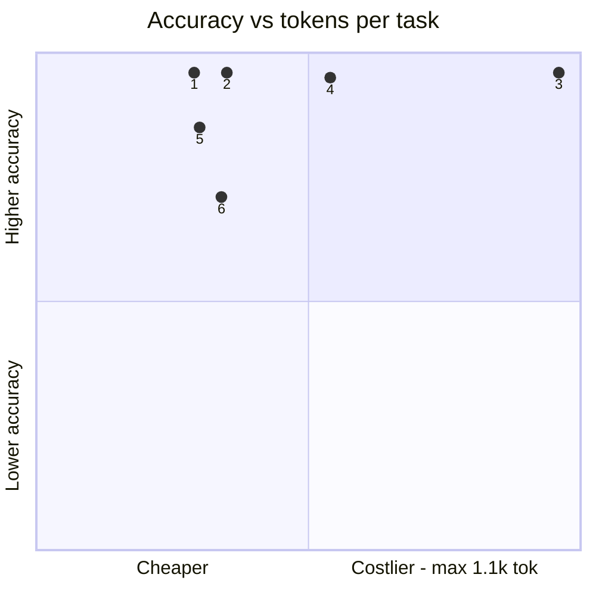
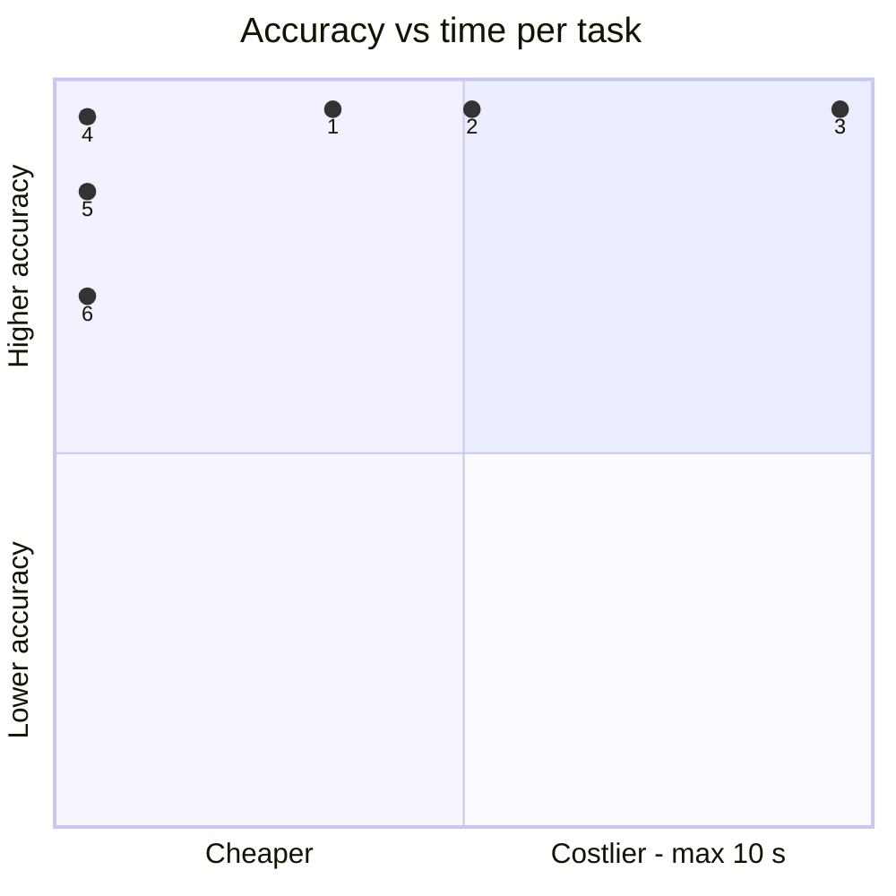
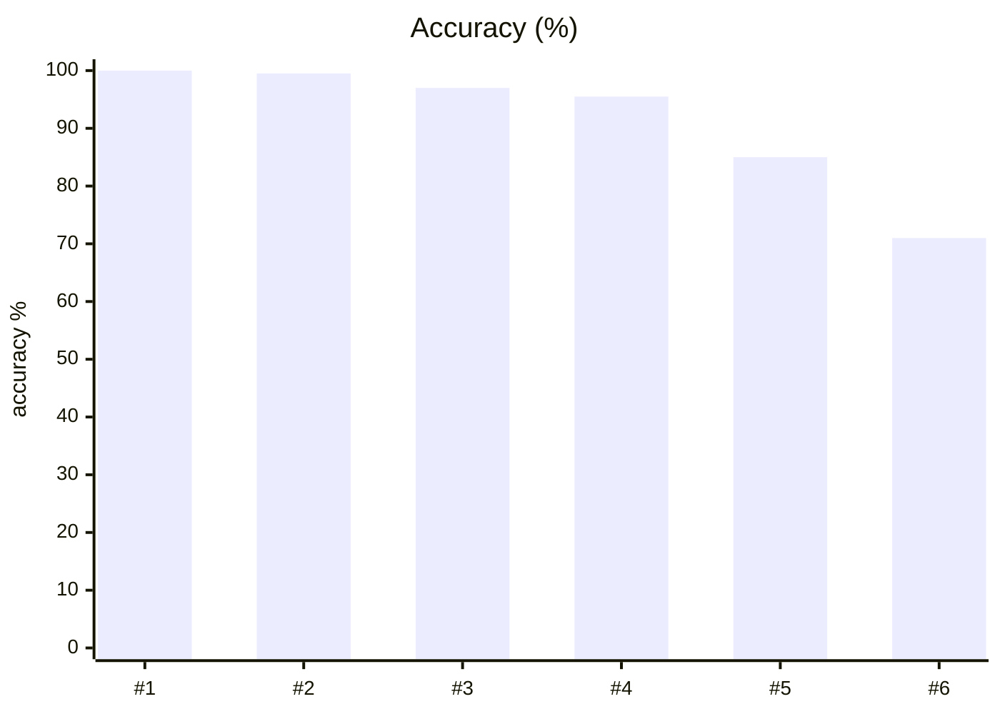
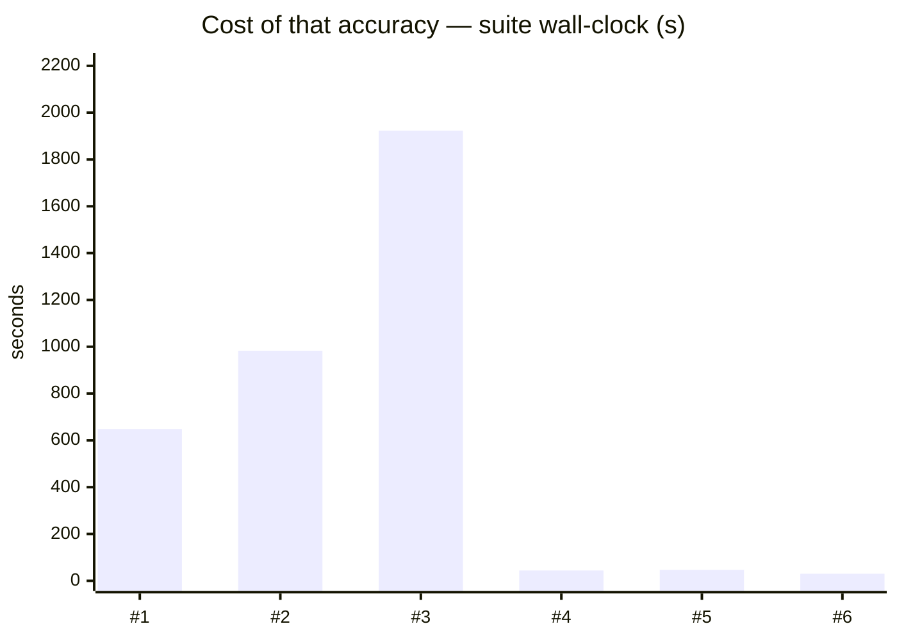
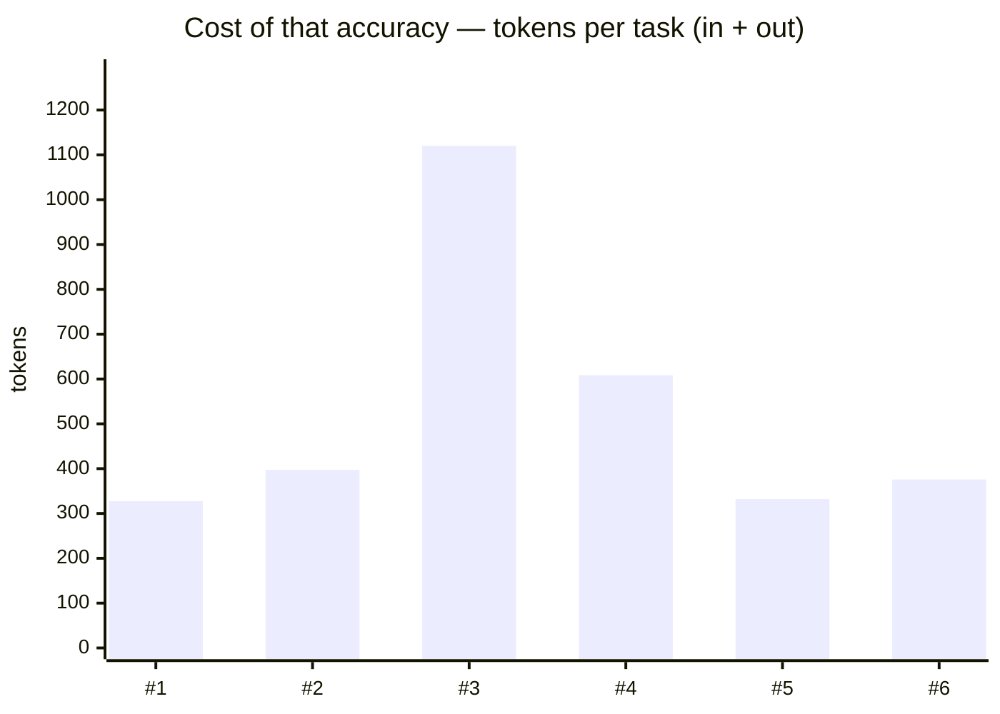
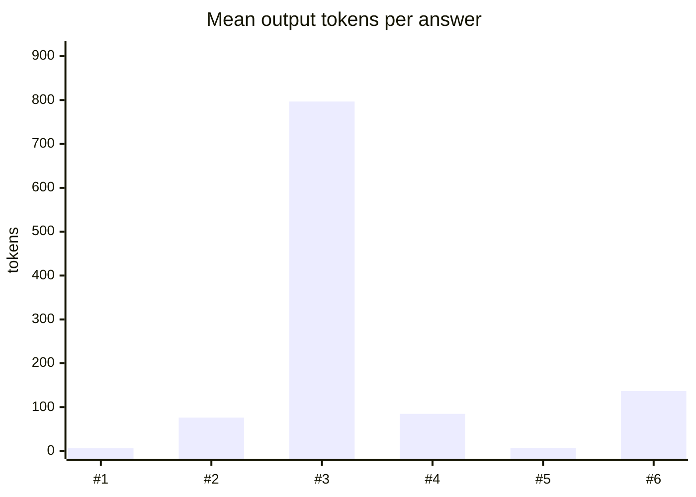

# System One v3 — 200 calls per model

**Question.** With the arithmetic removed, which model makes the best System One decisions, and at what speed?

**Verdict.** Frontier thinking models lead (gpt-6.1-sol medium 100.0%, gpt-6-luna max 99.5%), about 4 pp above Jev (95.5%), a margin just outside noise. Jev ties local Qwen3.6 think-ON (97.0%) at 44x lower latency and leads every non-thinking arm. v3 is saturated at the frontier.

## Setup

| | |
|---|---|
| Endpoint | mixed — `(pi cli)` (pi gpt-6.1-sol thinking_level=medium transport=pi -p, isolated (--no-session --no-tools --no-mcp --no-extensions) ON), `(pi cli)` (pi gpt-6-luna thinking_level=max transport=pi -p, isolated (--no-session --no-tools --no-mcp --no-extensions) ON), `http://localhost:8001` (builtin montimage-dgx-sp ON), `http://localhost:8124` (builtin jev-latest OFF), `http://localhost:8001` (builtin montimage-dgx-sp OFF), `http://localhost:8123` (builtin kev-latest OFF) |
| Tasks | 200 |
| Samples per task | 1 (⇒ 200 generations per run) |
| Concurrency | 1 |
| Metric | accuracy over exact-match answers on typed decision questions, with a 95% Wilson interval |

## Headline

| Run | Accuracy (95% CI) | Tokens per task | Time per task |
|---|---|---|---|---|
| pi-gpt-6.1-sol-thinkmedium-system1-v3 | 100.0 % (98–100) | 321 in / 6 out | 3.2 s |
| pi-gpt-6-luna-thinkmax-system1-v3 | 99.5 % (97–100) | 321 in / 76 out | 4.9 s |
| qwen3-6-35b-a3b-nvfp4 thinkon system1-v3 | 97.0 % (94–99) | 323 in / 797 out | 9.6 s |
| typesafe jev-1.13.0 api.typesafe.ai system1-v3 | 95.5 % (92–98) | 524 in / 85 out | 0.2 s |
| qwen3-6-35b-a3b-nvfp4 thinkoff system1-v3 | 85.0 % (79–89) | 325 in / 7 out | 0.2 s |
| kev-4b kev.serve bf16 via s1 gateway system1-v3 | 71.0 % (64–77) | 239 in / 137 out | 0.2 s |

<sub>The bracket is the 95% Wilson interval of the solve rate, in points. *Tokens* and *time* are the mean per task attempt (input and output tokens as the endpoint or harness reported them; wall-clock seconds).</sub>

## At a glance

| # | Run | Harness · thinking | Accuracy | Tokens / task | Time / task |
|---|---|---|---|---|---|
| 1 | pi-gpt-6.1-sol-thinkmedium-system1-v3 | pi · ON | `██████████` 100 % <sub>(98–100)</sub> | `██▉░░░░░░░` 328 | `███▍░░░░░░` 3 s |
| 2 | pi-gpt-6-luna-thinkmax-system1-v3 | pi · ON | `██████████` 100 % <sub>(97–100)</sub> | `███▌░░░░░░` 397 | `█████▏░░░░` 5 s |
| 3 | qwen3-6-35b-a3b-nvfp4 thinkon system1-v3 | built-in loop · ON | `█████████▊` 97 % <sub>(94–99)</sub> | `██████████` 1.1k | `██████████` 10 s |
| 4 | typesafe jev-1.13.0 api.typesafe.ai system1-v3 | built-in loop · OFF | `█████████▌` 96 % <sub>(92–98)</sub> | `█████▍░░░░` 608 | `▎░░░░░░░░░` 0 s |
| 5 | qwen3-6-35b-a3b-nvfp4 thinkoff system1-v3 | built-in loop · OFF | `████████▌░` 85 % <sub>(79–89)</sub> | `███░░░░░░░` 332 | `▎░░░░░░░░░` 0 s |
| 6 | kev-4b kev.serve bf16 via s1 gateway system1-v3 | built-in loop · OFF | `███████▏░░` 71 % <sub>(64–77)</sub> | `███▍░░░░░░` 376 | `▏░░░░░░░░░` 0 s |

<sub>Solve-rate bars run 0–100 %, bracket = 95% interval. Token and time bars are scaled to the costliest row — shorter is cheaper. Rows are sorted only **within** one harness and thinking mode; bars from different groups are side by side, not ranked.</sub>





<sub>Points are the `#` column above. Up is better, left is cheaper: the top-left corner is the most solved for the least spent. Cost is scaled to the costliest run.</sub>

## Results

| Run | Accuracy | easy | medium | hard | Wall | Mean out tok | Truncated | tok/s |
|---|---|---|---|---|---|---|---|---|
| **pi-gpt-6.1-sol-thinkmedium-system1-v3** | **100.0 %** | — | 100.0 % | — | 649 s | 6 | 0 | 1.9 |
| pi-gpt-6-luna-thinkmax-system1-v3 | 99.5 % | — | 99.5 % | — | 983 s | 76 | 0 | 15.4 |
| qwen3-6-35b-a3b-nvfp4 thinkon system1-v3 | 97.0 % | — | 97.0 % | — | 1,923 s | 797 | 0 | 83.2 |
| typesafe jev-1.13.0 api.typesafe.ai system1-v3 | 95.5 % | — | 95.5 % | — | 44 s | 85 | 0 | 391.9 |
| qwen3-6-35b-a3b-nvfp4 thinkoff system1-v3 | 85.0 % | — | 85.0 % | — | 47 s | 7 | 0 | 29.8 |
| kev-4b kev.serve bf16 via s1 gateway system1-v3 | 71.0 % | — | 71.0 % | — | 30 s | 137 | 0 | 909.1 |

<sub>Bars below are numbered as in the `#` column of *At a glance*.</sub>









## By difficulty

| Run | easy | medium | hard |
|---|---|---|---|
| pi-gpt-6.1-sol-thinkmedium-system1-v3 | — | `████████` 100 % | — |
| pi-gpt-6-luna-thinkmax-system1-v3 | — | `████████` 100 % | — |
| qwen3-6-35b-a3b-nvfp4 thinkon system1-v3 | — | `███████▊` 97 % | — |
| typesafe jev-1.13.0 api.typesafe.ai system1-v3 | — | `███████▋` 96 % | — |
| qwen3-6-35b-a3b-nvfp4 thinkoff system1-v3 | — | `██████▊░` 85 % | — |
| kev-4b kev.serve bf16 via s1 gateway system1-v3 | — | `█████▋░░` 71 % | — |

## Task by task

<sub>Per-task solve rate (%). Tasks the runs disagree on are listed first, widest gap on top.</sub>

| Task | pi gpt-6.1-sol thinking_level=medium transport=pi -p, isolated (--no-session --no-tools --no-mcp --no-extensions) ON | pi gpt-6-luna thinking_level=max transport=pi -p, isolated (--no-session --no-tools --no-mcp --no-extensions) ON | builtin montimage-dgx-sp ON | builtin jev-latest OFF | builtin montimage-dgx-sp OFF | builtin kev-latest OFF |
|---|---|---|---|---|---|---|
| `access_08/q1` | 🟩 100 | 🟩 100 | 🟩 100 | 🟩 100 | 🟥 0 | 🟩 100 |
| `access_10/q1` | 🟩 100 | 🟩 100 | 🟩 100 | 🟩 100 | 🟩 100 | 🟥 0 |
| `access_14/q1` | 🟩 100 | 🟩 100 | 🟥 0 | 🟩 100 | 🟩 100 | 🟩 100 |
| `access_15/q1` | 🟩 100 | 🟩 100 | 🟩 100 | 🟥 0 | 🟥 0 | 🟥 0 |
| `access_16/q1` | 🟩 100 | 🟩 100 | 🟥 0 | 🟥 0 | 🟥 0 | 🟥 0 |
| `access_18/q1` | 🟩 100 | 🟩 100 | 🟥 0 | 🟩 100 | 🟥 0 | 🟩 100 |
| `access_20/q1` | 🟩 100 | 🟩 100 | 🟩 100 | 🟩 100 | 🟥 0 | 🟩 100 |
| `billing_03/q1` | 🟩 100 | 🟩 100 | 🟩 100 | 🟩 100 | 🟩 100 | 🟥 0 |
| `billing_04/q1` | 🟩 100 | 🟩 100 | 🟩 100 | 🟩 100 | 🟩 100 | 🟥 0 |
| `billing_11/q1` | 🟩 100 | 🟩 100 | 🟥 0 | 🟥 0 | 🟥 0 | 🟥 0 |
| `billing_12/q1` | 🟩 100 | 🟩 100 | 🟩 100 | 🟥 0 | 🟥 0 | 🟥 0 |
| `credentials_03/q1` | 🟩 100 | 🟩 100 | 🟩 100 | 🟩 100 | 🟩 100 | 🟥 0 |
| `credentials_04/q1` | 🟩 100 | 🟩 100 | 🟩 100 | 🟩 100 | 🟥 0 | 🟩 100 |
| `credentials_16/q1` | 🟩 100 | 🟩 100 | 🟩 100 | 🟩 100 | 🟥 0 | 🟩 100 |
| `credentials_17/q1` | 🟩 100 | 🟩 100 | 🟩 100 | 🟩 100 | 🟩 100 | 🟥 0 |
| `credentials_18/q1` | 🟩 100 | 🟩 100 | 🟩 100 | 🟩 100 | 🟥 0 | 🟥 0 |
| `evidence_03/q1` | 🟩 100 | 🟩 100 | 🟩 100 | 🟩 100 | 🟩 100 | 🟥 0 |
| `evidence_05/q1` | 🟩 100 | 🟩 100 | 🟩 100 | 🟩 100 | 🟥 0 | 🟥 0 |
| `evidence_12/q1` | 🟩 100 | 🟩 100 | 🟩 100 | 🟩 100 | 🟩 100 | 🟥 0 |
| `evidence_13/q1` | 🟩 100 | 🟩 100 | 🟩 100 | 🟩 100 | 🟥 0 | 🟥 0 |
| `evidence_17/q1` | 🟩 100 | 🟩 100 | 🟩 100 | 🟩 100 | 🟩 100 | 🟥 0 |
| `evidence_18/q1` | 🟩 100 | 🟩 100 | 🟩 100 | 🟩 100 | 🟩 100 | 🟥 0 |
| `evidence_19/q1` | 🟩 100 | 🟩 100 | 🟩 100 | 🟥 0 | 🟩 100 | 🟥 0 |
| `injection_01/q1` | 🟩 100 | 🟩 100 | 🟩 100 | 🟩 100 | 🟩 100 | 🟥 0 |
| `injection_03/q1` | 🟩 100 | 🟩 100 | 🟩 100 | 🟩 100 | 🟩 100 | 🟥 0 |
| `injection_04/q1` | 🟩 100 | 🟩 100 | 🟩 100 | 🟩 100 | 🟩 100 | 🟥 0 |
| `injection_06/q1` | 🟩 100 | 🟩 100 | 🟩 100 | 🟩 100 | 🟩 100 | 🟥 0 |
| `injection_07/q1` | 🟩 100 | 🟩 100 | 🟩 100 | 🟩 100 | 🟩 100 | 🟥 0 |
| `injection_08/q1` | 🟩 100 | 🟩 100 | 🟩 100 | 🟩 100 | 🟩 100 | 🟥 0 |
| `injection_09/q1` | 🟩 100 | 🟩 100 | 🟩 100 | 🟩 100 | 🟩 100 | 🟥 0 |
| `injection_10/q1` | 🟩 100 | 🟩 100 | 🟩 100 | 🟩 100 | 🟥 0 | 🟥 0 |
| `injection_11/q1` | 🟩 100 | 🟩 100 | 🟩 100 | 🟩 100 | 🟩 100 | 🟥 0 |
| `injection_13/q1` | 🟩 100 | 🟩 100 | 🟩 100 | 🟩 100 | 🟩 100 | 🟥 0 |
| `injection_14/q1` | 🟩 100 | 🟩 100 | 🟩 100 | 🟩 100 | 🟩 100 | 🟥 0 |
| `injection_16/q1` | 🟩 100 | 🟩 100 | 🟩 100 | 🟩 100 | 🟩 100 | 🟥 0 |
| `injection_17/q1` | 🟩 100 | 🟩 100 | 🟩 100 | 🟩 100 | 🟥 0 | 🟥 0 |
| `injection_18/q1` | 🟩 100 | 🟩 100 | 🟩 100 | 🟩 100 | 🟩 100 | 🟥 0 |
| `moderation_06/q1` | 🟩 100 | 🟩 100 | 🟥 0 | 🟩 100 | 🟩 100 | 🟩 100 |
| `phishing_02/q1` | 🟩 100 | 🟩 100 | 🟩 100 | 🟩 100 | 🟩 100 | 🟥 0 |
| `phishing_03/q1` | 🟩 100 | 🟩 100 | 🟩 100 | 🟩 100 | 🟥 0 | 🟩 100 |
| `phishing_08/q1` | 🟩 100 | 🟩 100 | 🟥 0 | 🟩 100 | 🟥 0 | 🟥 0 |
| `phishing_12/q1` | 🟩 100 | 🟩 100 | 🟩 100 | 🟩 100 | 🟩 100 | 🟥 0 |
| `phishing_15/q1` | 🟩 100 | 🟩 100 | 🟩 100 | 🟩 100 | 🟥 0 | 🟩 100 |
| `phishing_16/q1` | 🟩 100 | 🟥 0 | 🟩 100 | 🟥 0 | 🟥 0 | 🟥 0 |
| `phishing_17/q1` | 🟩 100 | 🟩 100 | 🟩 100 | 🟩 100 | 🟩 100 | 🟥 0 |
| `phishing_20/q1` | 🟩 100 | 🟩 100 | 🟩 100 | 🟩 100 | 🟥 0 | 🟩 100 |
| `returns_03/q1` | 🟩 100 | 🟩 100 | 🟩 100 | 🟥 0 | 🟥 0 | 🟩 100 |
| `returns_04/q1` | 🟩 100 | 🟩 100 | 🟩 100 | 🟥 0 | 🟩 100 | 🟩 100 |
| `returns_05/q1` | 🟩 100 | 🟩 100 | 🟩 100 | 🟩 100 | 🟥 0 | 🟥 0 |
| `returns_06/q1` | 🟩 100 | 🟩 100 | 🟩 100 | 🟩 100 | 🟥 0 | 🟥 0 |
| `returns_07/q1` | 🟩 100 | 🟩 100 | 🟩 100 | 🟩 100 | 🟩 100 | 🟥 0 |
| `returns_08/q1` | 🟩 100 | 🟩 100 | 🟩 100 | 🟩 100 | 🟥 0 | 🟥 0 |
| `returns_09/q1` | 🟩 100 | 🟩 100 | 🟩 100 | 🟩 100 | 🟩 100 | 🟥 0 |
| `returns_10/q1` | 🟩 100 | 🟩 100 | 🟩 100 | 🟩 100 | 🟩 100 | 🟥 0 |
| `returns_15/q1` | 🟩 100 | 🟩 100 | 🟩 100 | 🟩 100 | 🟥 0 | 🟩 100 |
| `returns_16/q1` | 🟩 100 | 🟩 100 | 🟩 100 | 🟥 0 | 🟥 0 | 🟩 100 |
| `returns_17/q1` | 🟩 100 | 🟩 100 | 🟩 100 | 🟩 100 | 🟩 100 | 🟥 0 |
| `returns_18/q1` | 🟩 100 | 🟩 100 | 🟩 100 | 🟩 100 | 🟩 100 | 🟥 0 |
| `routing_01/q1` | 🟩 100 | 🟩 100 | 🟩 100 | 🟩 100 | 🟥 0 | 🟥 0 |
| `routing_02/q1` | 🟩 100 | 🟩 100 | 🟩 100 | 🟩 100 | 🟥 0 | 🟥 0 |
| `routing_03/q1` | 🟩 100 | 🟩 100 | 🟩 100 | 🟩 100 | 🟥 0 | 🟩 100 |
| `routing_04/q1` | 🟩 100 | 🟩 100 | 🟩 100 | 🟩 100 | 🟥 0 | 🟩 100 |
| `routing_06/q1` | 🟩 100 | 🟩 100 | 🟩 100 | 🟩 100 | 🟩 100 | 🟥 0 |
| `routing_13/q1` | 🟩 100 | 🟩 100 | 🟩 100 | 🟩 100 | 🟩 100 | 🟥 0 |
| `routing_15/q1` | 🟩 100 | 🟩 100 | 🟩 100 | 🟩 100 | 🟩 100 | 🟥 0 |
| `routing_16/q1` | 🟩 100 | 🟩 100 | 🟩 100 | 🟩 100 | 🟩 100 | 🟥 0 |
| `routing_17/q1` | 🟩 100 | 🟩 100 | 🟩 100 | 🟩 100 | 🟩 100 | 🟥 0 |
| `routing_18/q1` | 🟩 100 | 🟩 100 | 🟩 100 | 🟩 100 | 🟥 0 | 🟥 0 |
| `routing_20/q1` | 🟩 100 | 🟩 100 | 🟩 100 | 🟩 100 | 🟩 100 | 🟥 0 |
| `triage_01/q1` | 🟩 100 | 🟩 100 | 🟩 100 | 🟩 100 | 🟩 100 | 🟥 0 |
| `triage_09/q1` | 🟩 100 | 🟩 100 | 🟩 100 | 🟩 100 | 🟩 100 | 🟥 0 |
| `triage_10/q1` | 🟩 100 | 🟩 100 | 🟩 100 | 🟩 100 | 🟩 100 | 🟥 0 |
| `triage_19/q1` | 🟩 100 | 🟩 100 | 🟩 100 | 🟩 100 | 🟩 100 | 🟥 0 |
| `triage_20/q1` | 🟩 100 | 🟩 100 | 🟩 100 | 🟩 100 | 🟩 100 | 🟥 0 |

- 🟩 **every run solved** (126): `access_01/q1`, `access_02/q1`, `access_03/q1`, `access_04/q1`, `access_05/q1`, `access_06/q1`, `access_07/q1`, `access_09/q1`, `access_11/q1`, `access_12/q1`, `access_13/q1`, `access_17/q1`, `access_19/q1`, `billing_01/q1`, `billing_02/q1`, `billing_05/q1`, `billing_06/q1`, `billing_07/q1`, `billing_08/q1`, `billing_09/q1`, `billing_10/q1`, `billing_13/q1`, `billing_14/q1`, `billing_15/q1`, `billing_16/q1`, `billing_17/q1`, `billing_18/q1`, `billing_19/q1`, `billing_20/q1`, `credentials_01/q1`, `credentials_02/q1`, `credentials_05/q1`, `credentials_06/q1`, `credentials_07/q1`, `credentials_08/q1`, `credentials_09/q1`, `credentials_10/q1`, `credentials_11/q1`, `credentials_12/q1`, `credentials_13/q1`, `credentials_14/q1`, `credentials_15/q1`, `credentials_19/q1`, `credentials_20/q1`, `evidence_01/q1`, `evidence_02/q1`, `evidence_04/q1`, `evidence_06/q1`, `evidence_07/q1`, `evidence_08/q1`, `evidence_09/q1`, `evidence_10/q1`, `evidence_11/q1`, `evidence_14/q1`, `evidence_15/q1`, `evidence_16/q1`, `evidence_20/q1`, `injection_02/q1`, `injection_05/q1`, `injection_12/q1`, `injection_15/q1`, `injection_19/q1`, `injection_20/q1`, `moderation_01/q1`, `moderation_02/q1`, `moderation_03/q1`, `moderation_04/q1`, `moderation_05/q1`, `moderation_07/q1`, `moderation_08/q1`, `moderation_09/q1`, `moderation_10/q1`, `moderation_11/q1`, `moderation_12/q1`, `moderation_13/q1`, `moderation_14/q1`, `moderation_15/q1`, `moderation_16/q1`, `moderation_17/q1`, `moderation_18/q1`, `moderation_19/q1`, `moderation_20/q1`, `phishing_01/q1`, `phishing_04/q1`, `phishing_05/q1`, `phishing_06/q1`, `phishing_07/q1`, `phishing_09/q1`, `phishing_10/q1`, `phishing_11/q1`, `phishing_13/q1`, `phishing_14/q1`, `phishing_18/q1`, `phishing_19/q1`, `returns_01/q1`, `returns_02/q1`, `returns_11/q1`, `returns_12/q1`, `returns_13/q1`, `returns_14/q1`, `returns_19/q1`, `returns_20/q1`, `routing_05/q1`, `routing_07/q1`, `routing_08/q1`, `routing_09/q1`, `routing_10/q1`, `routing_11/q1`, `routing_12/q1`, `routing_14/q1`, `routing_19/q1`, `triage_02/q1`, `triage_03/q1`, `triage_04/q1`, `triage_05/q1`, `triage_06/q1`, `triage_07/q1`, `triage_08/q1`, `triage_11/q1`, `triage_12/q1`, `triage_13/q1`, `triage_14/q1`, `triage_15/q1`, `triage_16/q1`, `triage_17/q1`, `triage_18/q1`

## Where they disagree — pi-gpt-6.1-sol-thinkmedium-system1-v3 vs pi-gpt-6-luna-thinkmax-system1-v3

| Task | pi-gpt-6.1-sol-thinkmedium-system1-v3 | pi-gpt-6-luna-thinkmax-system1-v3 | Winner |
|---|---|---|---|
| `phishing_16/q1` | 100 % | 0 % | pi-gpt-6.1-sol-thinkmedium-system1-v3 |

## Cost per task

<sub>Mean per attempt: input / output tokens, then wall-clock seconds. *not reported* = no usage reported for that task; *–* = the run has no cost record for it.</sub>

| Task | pi-gpt-6.1-sol-thinkmedium-system1-v3 | pi-gpt-6-luna-thinkmax-system1-v3 | qwen3-6-35b-a3b-nvfp4 thinkon system1-v3 | typesafe jev-1.13.0 api.typesafe.ai system1-v3 | qwen3-6-35b-a3b-nvfp4 thinkoff system1-v3 | kev-4b kev.serve bf16 via s1 gateway system1-v3 |
|---|---|---|---|---|---|---|
| `access_01/q1` | 301 / 5 · 3.0 s | 302 / 47 · 4.3 s | 302 / 826 · 9.7 s | 498 / 77 · 0.2 s | 304 / 6 · 0.2 s | 217 / 147 · 0.1 s |
| `access_02/q1` | 304 / 5 · 3.1 s | 303 / 57 · 4.4 s | 304 / 581 · 6.9 s | 499 / 77 · 0.2 s | 306 / 6 · 0.2 s | 219 / 148 · 0.1 s |
| `access_03/q1` | 301 / 5 · 2.9 s | 304 / 46 · 3.8 s | 303 / 980 · 11.8 s | 498 / 78 · 0.2 s | 305 / 7 · 0.2 s | 218 / 148 · 0.2 s |
| `access_04/q1` | 305 / 5 · 3.0 s | 306 / 42 · 2.6 s | 304 / 421 · 5.0 s | 500 / 78 · 0.2 s | 306 / 7 · 0.2 s | 219 / 148 · 0.1 s |
| `access_05/q1` | 297 / 5 · 2.4 s | 294 / 76 · 4.5 s | 297 / 1,079 · 12.6 s | 493 / 79 · 0.2 s | 299 / 7 · 0.2 s | 212 / 148 · 0.2 s |
| `access_06/q1` | 301 / 5 · 2.6 s | 301 / 76 · 4.6 s | 301 / 470 · 5.9 s | 497 / 79 · 0.2 s | 303 / 7 · 0.2 s | 216 / 148 · 0.1 s |
| `access_07/q1` | 304 / 5 · 2.4 s | 305 / 99 · 6.2 s | 308 / 691 · 8.0 s | 503 / 77 · 0.2 s | 310 / 6 · 0.2 s | 223 / 148 · 0.1 s |
| `access_08/q1` | 307 / 5 · 3.8 s | 309 / 107 · 5.8 s | 310 / 1,289 · 15.3 s | 506 / 77 · 0.2 s | 312 / 7 · 0.2 s | 225 / 147 · 0.1 s |
| `access_09/q1` | 300 / 5 · 3.1 s | 299 / 77 · 3.9 s | 300 / 410 · 5.1 s | 495 / 77 · 0.2 s | 302 / 6 · 0.2 s | 215 / 148 · 0.1 s |
| `access_10/q1` | 302 / 5 · 2.7 s | 301 / 155 · 7.7 s | 302 / 614 · 7.5 s | 498 / 77 · 0.2 s | 304 / 6 · 0.2 s | 217 / 148 · 0.1 s |
| `access_11/q1` | 307 / 5 · 3.1 s | 309 / 94 · 5.9 s | 308 / 1,776 · 21.8 s | 504 / 78 · 0.2 s | 310 / 7 · 0.2 s | 223 / 149 · 0.1 s |
| `access_12/q1` | 315 / 5 · 2.8 s | 317 / 84 · 4.3 s | 316 / 446 · 5.3 s | 513 / 78 · 0.2 s | 318 / 7 · 0.2 s | 231 / 148 · 0.1 s |
| `access_13/q1` | 305 / 5 · 3.0 s | 307 / 75 · 4.9 s | 308 / 1,115 · 13.2 s | 502 / 77 · 0.2 s | 310 / 6 · 0.2 s | 223 / 147 · 0.1 s |
| `access_14/q1` | 316 / 5 · 3.0 s | 315 / 89 · 4.8 s | 314 / 2,003 · 25.5 s | 510 / 77 · 0.2 s | 316 / 6 · 0.2 s | 229 / 148 · 0.1 s |
| `access_15/q1` | 307 / 5 · 2.7 s | 307 / 109 · 4.8 s | 307 / 1,579 · 18.5 s | 502 / 78 · 0.2 s | 309 / 7 · 0.2 s | 222 / 149 · 0.1 s |
| `access_16/q1` | 316 / 5 · 2.8 s | 315 / 73 · 3.9 s | 314 / 1,466 · 18.0 s | 510 / 78 · 0.2 s | 316 / 7 · 0.2 s | 229 / 149 · 0.1 s |
| `access_17/q1` | 303 / 5 · 2.9 s | 304 / 69 · 5.9 s | 306 / 1,542 · 18.2 s | 501 / 77 · 0.2 s | 308 / 6 · 0.2 s | 221 / 146 · 0.1 s |
| `access_18/q1` | 305 / 5 · 2.5 s | 304 / 99 · 4.9 s | 305 / 1,599 · 19.6 s | 501 / 77 · 0.2 s | 307 / 6 · 0.2 s | 220 / 145 · 0.1 s |
| `access_19/q1` | 304 / 5 · 4.4 s | 304 / 71 · 4.2 s | 304 / 1,041 · 12.8 s | 499 / 77 · 0.2 s | 306 / 6 · 0.2 s | 219 / 148 · 0.1 s |
| `access_20/q1` | 312 / 5 · 2.6 s | 311 / 77 · 4.4 s | 311 / 920 · 11.0 s | 507 / 77 · 0.2 s | 313 / 7 · 0.2 s | 226 / 147 · 0.1 s |
| `billing_01/q1` | 333 / 5 · 3.0 s | 334 / 36 · 7.4 s | 345 / 611 · 7.2 s | 541 / 63 · 0.2 s | 347 / 5 · 0.2 s | 262 / 93 · 0.1 s |
| `billing_02/q1` | 333 / 5 · 3.0 s | 333 / 48 · 4.1 s | 341 / 581 · 7.2 s | 539 / 63 · 0.2 s | 343 / 5 · 0.2 s | 258 / 93 · 0.1 s |
| `billing_03/q1` | 338 / 5 · 3.0 s | 338 / 66 · 4.9 s | 347 / 678 · 7.9 s | 543 / 63 · 0.2 s | 349 / 5 · 0.2 s | 264 / 95 · 0.1 s |
| `billing_04/q1` | 336 / 5 · 2.8 s | 337 / 60 · 4.5 s | 342 / 1,075 · 12.8 s | 541 / 63 · 0.2 s | 344 / 5 · 0.2 s | 259 / 93 · 0.1 s |
| `billing_05/q1` | 335 / 5 · 3.5 s | 337 / 35 · 3.5 s | 346 / 845 · 10.1 s | 542 / 64 · 0.3 s | 348 / 6 · 0.2 s | 263 / 94 · 0.1 s |
| `billing_06/q1` | 340 / 5 · 2.9 s | 337 / 37 · 3.8 s | 345 / 430 · 5.2 s | 543 / 64 · 0.2 s | 347 / 6 · 0.2 s | 262 / 95 · 0.1 s |
| `billing_07/q1` | 336 / 5 · 5.1 s | 335 / 39 · 6.1 s | 347 / 834 · 9.8 s | 543 / 65 · 0.2 s | 349 / 6 · 0.2 s | 264 / 94 · 0.1 s |
| `billing_08/q1` | 333 / 5 · 3.3 s | 331 / 67 · 4.8 s | 340 / 413 · 5.0 s | 538 / 65 · 0.2 s | 342 / 6 · 0.2 s | 257 / 94 · 0.1 s |
| `billing_09/q1` | 342 / 5 · 2.9 s | 340 / 66 · 4.5 s | 350 / 842 · 10.1 s | 546 / 63 · 0.3 s | 352 / 5 · 0.2 s | 267 / 94 · 0.1 s |
| `billing_10/q1` | 336 / 5 · 2.7 s | 335 / 74 · 6.1 s | 343 / 398 · 5.1 s | 541 / 63 · 0.2 s | 345 / 5 · 0.2 s | 260 / 93 · 0.1 s |
| `billing_11/q1` | 347 / 5 · 2.9 s | 346 / 60 · 4.1 s | 357 / 1,360 · 16.3 s | 554 / 63 · 0.2 s | 359 / 5 · 0.2 s | 274 / 94 · 0.1 s |
| `billing_12/q1` | 339 / 5 · 3.3 s | 340 / 40 · 6.4 s | 347 / 1,565 · 18.4 s | 546 / 63 · 0.2 s | 349 / 5 · 0.2 s | 264 / 94 · 0.1 s |
| `billing_13/q1` | 336 / 5 · 3.4 s | 335 / 62 · 4.1 s | 348 / 421 · 5.0 s | 544 / 63 · 0.3 s | 350 / 5 · 0.2 s | 265 / 94 · 0.1 s |
| `billing_14/q1` | 333 / 5 · 2.9 s | 333 / 62 · 4.0 s | 339 / 833 · 10.1 s | 537 / 63 · 0.2 s | 341 / 5 · 0.2 s | 256 / 93 · 0.1 s |
| `billing_15/q1` | 338 / 5 · 6.5 s | 336 / 44 · 4.9 s | 346 / 417 · 4.9 s | 542 / 65 · 0.2 s | 348 / 5 · 0.2 s | 263 / 94 · 0.1 s |
| `billing_16/q1` | 331 / 5 · 3.7 s | 331 / 48 · 4.5 s | 336 / 350 · 4.3 s | 534 / 65 · 0.2 s | 338 / 5 · 0.2 s | 253 / 95 · 0.1 s |
| `billing_17/q1` | 334 / 5 · 3.6 s | 333 / 72 · 6.9 s | 345 / 641 · 7.8 s | 541 / 63 · 0.2 s | 347 / 5 · 0.2 s | 262 / 94 · 0.2 s |
| `billing_18/q1` | 331 / 55 · 6.4 s | 331 / 152 · 6.3 s | 339 / 492 · 6.0 s | 537 / 63 · 0.2 s | 341 / 5 · 0.2 s | 256 / 92 · 0.1 s |
| `billing_19/q1` | 338 / 5 · 2.6 s | 339 / 57 · 3.8 s | 350 / 1,090 · 12.8 s | 546 / 65 · 0.2 s | 352 / 6 · 0.2 s | 267 / 94 · 0.1 s |
| `billing_20/q1` | 335 / 5 · 3.1 s | 334 / 75 · 5.1 s | 342 / 1,086 · 13.0 s | 540 / 65 · 0.4 s | 344 / 6 · 0.3 s | 259 / 95 · 0.1 s |
| `credentials_01/q1` | 221 / 5 · 2.9 s | 223 / 35 · 4.0 s | 219 / 975 · 11.4 s | 417 / 66 · 0.2 s | 221 / 6 · 0.2 s | 135 / 129 · 0.1 s |
| `credentials_02/q1` | 223 / 5 · 3.1 s | 222 / 63 · 4.4 s | 218 / 1,018 · 12.0 s | 418 / 66 · 0.2 s | 220 / 6 · 0.2 s | 134 / 129 · 0.1 s |
| `credentials_03/q1` | 230 / 5 · 5.4 s | 226 / 57 · 4.5 s | 225 / 386 · 4.5 s | 423 / 66 · 0.2 s | 227 / 6 · 0.2 s | 141 / 126 · 0.1 s |
| `credentials_04/q1` | 224 / 5 · 3.1 s | 224 / 59 · 5.7 s | 219 / 857 · 10.2 s | 419 / 66 · 0.2 s | 221 / 6 · 0.2 s | 135 / 129 · 0.2 s |
| `credentials_05/q1` | 232 / 5 · 3.6 s | 233 / 71 · 4.6 s | 230 / 1,572 · 18.5 s | 428 / 66 · 0.3 s | 232 / 6 · 0.2 s | 146 / 129 · 0.1 s |
| `credentials_06/q1` | 234 / 5 · 2.7 s | 233 / 73 · 4.4 s | 229 / 1,229 · 14.7 s | 429 / 66 · 0.2 s | 231 / 6 · 0.2 s | 145 / 129 · 0.1 s |
| `credentials_07/q1` | 218 / 5 · 2.4 s | 216 / 37 · 2.9 s | 213 / 638 · 7.8 s | 411 / 68 · 0.2 s | 215 / 8 · 0.2 s | 129 / 131 · 0.1 s |
| `credentials_08/q1` | 221 / 5 · 2.7 s | 218 / 69 · 6.0 s | 215 / 1,404 · 16.0 s | 415 / 68 · 0.3 s | 217 / 8 · 0.2 s | 131 / 131 · 0.1 s |
| `credentials_09/q1` | 216 / 5 · 2.9 s | 215 / 47 · 3.8 s | 213 / 902 · 10.7 s | 411 / 66 · 0.2 s | 215 / 6 · 0.2 s | 129 / 128 · 0.1 s |
| `credentials_10/q1` | 221 / 5 · 3.6 s | 219 / 73 · 6.4 s | 213 / 701 · 8.2 s | 413 / 66 · 0.2 s | 215 / 6 · 0.2 s | 129 / 129 · 0.1 s |
| `credentials_11/q1` | 229 / 5 · 3.0 s | 229 / 75 · 5.3 s | 227 / 849 · 10.1 s | 425 / 66 · 0.2 s | 229 / 6 · 0.2 s | 143 / 129 · 0.1 s |
| `credentials_12/q1` | 227 / 5 · 2.9 s | 227 / 109 · 4.8 s | 222 / 1,289 · 15.0 s | 422 / 66 · 0.2 s | 224 / 6 · 0.2 s | 138 / 129 · 0.1 s |
| `credentials_13/q1` | 231 / 5 · 3.0 s | 229 / 53 · 4.1 s | 232 / 1,152 · 13.5 s | 430 / 66 · 0.3 s | 234 / 6 · 0.2 s | 148 / 127 · 0.1 s |
| `credentials_14/q1` | 225 / 5 · 2.8 s | 225 / 115 · 4.6 s | 220 / 591 · 7.1 s | 420 / 66 · 0.2 s | 222 / 6 · 0.2 s | 136 / 129 · 0.1 s |
| `credentials_15/q1` | 231 / 5 · 3.6 s | 231 / 105 · 5.0 s | 230 / 862 · 10.2 s | 428 / 66 · 0.2 s | 232 / 6 · 0.2 s | 146 / 128 · 0.1 s |
| `credentials_16/q1` | 230 / 5 · 2.7 s | 230 / 99 · 5.9 s | 222 / 1,336 · 16.0 s | 422 / 66 · 0.2 s | 224 / 6 · 0.2 s | 138 / 129 · 0.1 s |
| `credentials_17/q1` | 230 / 5 · 2.7 s | 231 / 53 · 4.6 s | 232 / 1,327 · 23.2 s | 430 / 66 · 0.2 s | 234 / 6 · 0.2 s | 148 / 131 · 0.1 s |
| `credentials_18/q1` | 222 / 5 · 2.8 s | 223 / 79 · 4.0 s | 218 / 2,350 · 36.7 s | 418 / 66 · 0.3 s | 220 / 8 · 0.2 s | 134 / 130 · 0.1 s |
| `credentials_19/q1` | 224 / 5 · 2.5 s | 222 / 61 · 4.7 s | 221 / 985 · 11.8 s | 419 / 66 · 0.2 s | 223 / 6 · 0.2 s | 137 / 128 · 0.1 s |
| `credentials_20/q1` | 228 / 5 · 3.1 s | 229 / 77 · 3.6 s | 221 / 1,289 · 15.4 s | 421 / 66 · 0.3 s | 223 / 6 · 0.2 s | 137 / 129 · 0.1 s |
| `evidence_01/q1` | 308 / 5 · 2.8 s | 309 / 52 · 5.6 s | 306 / 361 · 4.3 s | 509 / 49 · 0.2 s | 308 / 5 · 0.2 s | 224 / 77 · 0.1 s |
| `evidence_02/q1` | 292 / 5 · 3.3 s | 292 / 47 · 3.3 s | 284 / 394 · 4.8 s | 489 / 48 · 0.2 s | 286 / 4 · 0.2 s | 202 / 76 · 0.1 s |
| `evidence_03/q1` | 309 / 51 · 3.6 s | 311 / 238 · 8.1 s | 309 / 717 · 8.6 s | 512 / 49 · 0.3 s | 311 / 5 · 0.2 s | 227 / 76 · 0.1 s |
| `evidence_04/q1` | 290 / 5 · 3.4 s | 291 / 49 · 3.3 s | 284 / 619 · 7.5 s | 487 / 48 · 0.2 s | 286 / 4 · 0.2 s | 202 / 75 · 0.1 s |
| `evidence_05/q1` | 309 / 5 · 3.5 s | 310 / 70 · 3.9 s | 301 / 719 · 9.1 s | 504 / 49 · 0.2 s | 303 / 4 · 0.2 s | 219 / 76 · 0.1 s |
| `evidence_06/q1` | 281 / 5 · 2.8 s | 280 / 66 · 4.0 s | 274 / 337 · 4.1 s | 477 / 49 · 0.3 s | 276 / 5 · 0.2 s | 192 / 77 · 0.1 s |
| `evidence_07/q1` | 283 / 5 · 4.3 s | 285 / 85 · 6.1 s | 276 / 1,453 · 17.0 s | 479 / 48 · 0.2 s | 278 / 4 · 0.2 s | 194 / 75 · 0.1 s |
| `evidence_08/q1` | 311 / 5 · 4.7 s | 313 / 126 · 5.9 s | 308 / 457 · 5.4 s | 512 / 49 · 0.2 s | 310 / 5 · 0.2 s | 226 / 77 · 0.1 s |
| `evidence_09/q1` | 295 / 5 · 3.6 s | 297 / 90 · 4.6 s | 288 / 322 · 3.9 s | 491 / 49 · 0.2 s | 290 / 5 · 0.2 s | 206 / 76 · 0.1 s |
| `evidence_10/q1` | 290 / 5 · 3.1 s | 289 / 59 · 4.1 s | 282 / 268 · 3.2 s | 485 / 48 · 0.2 s | 284 / 4 · 0.2 s | 200 / 76 · 0.1 s |
| `evidence_11/q1` | 301 / 5 · 2.6 s | 303 / 125 · 6.4 s | 293 / 424 · 5.2 s | 496 / 50 · 0.2 s | 295 / 4 · 0.2 s | 211 / 77 · 0.1 s |
| `evidence_12/q1` | 305 / 5 · 3.4 s | 307 / 67 · 6.3 s | 307 / 607 · 7.2 s | 510 / 49 · 0.2 s | 309 / 5 · 0.2 s | 225 / 75 · 0.1 s |
| `evidence_13/q1` | 297 / 5 · 2.6 s | 297 / 61 · 4.2 s | 297 / 674 · 8.2 s | 502 / 48 · 0.2 s | 299 / 4 · 0.2 s | 215 / 76 · 0.1 s |
| `evidence_14/q1` | 300 / 5 · 2.6 s | 300 / 47 · 4.7 s | 296 / 322 · 3.9 s | 499 / 48 · 0.2 s | 298 / 4 · 0.2 s | 214 / 76 · 0.1 s |
| `evidence_15/q1` | 290 / 5 · 2.9 s | 291 / 53 · 5.3 s | 283 / 746 · 9.6 s | 486 / 48 · 0.2 s | 285 / 4 · 0.2 s | 201 / 74 · 0.1 s |
| `evidence_16/q1` | 292 / 5 · 2.9 s | 294 / 47 · 5.8 s | 284 / 283 · 3.5 s | 487 / 50 · 0.2 s | 286 / 4 · 0.2 s | 202 / 77 · 0.1 s |
| `evidence_17/q1` | 293 / 5 · 2.7 s | 295 / 78 · 4.9 s | 286 / 374 · 4.5 s | 489 / 49 · 0.2 s | 288 / 5 · 0.2 s | 204 / 76 · 0.1 s |
| `evidence_18/q1` | 296 / 5 · 3.0 s | 297 / 76 · 5.3 s | 289 / 296 · 3.5 s | 493 / 49 · 0.2 s | 291 / 5 · 0.2 s | 207 / 76 · 0.1 s |
| `evidence_19/q1` | 302 / 5 · 2.5 s | 303 / 105 · 5.6 s | 299 / 825 · 9.6 s | 502 / 48 · 0.2 s | 301 / 4 · 0.2 s | 217 / 76 · 0.1 s |
| `evidence_20/q1` | 306 / 5 · 3.4 s | 305 / 73 · 7.9 s | 298 / 617 · 7.4 s | 501 / 50 · 0.2 s | 300 / 4 · 0.2 s | 216 / 77 · 0.1 s |
| `injection_01/q1` | 235 / 5 · 2.9 s | 234 / 63 · 3.9 s | 233 / 454 · 5.5 s | 429 / 60 · 0.2 s | 235 / 7 · 0.2 s | 150 / 89 · 0.1 s |
| `injection_02/q1` | 228 / 5 · 3.0 s | 226 / 71 · 5.2 s | 227 / 840 · 9.7 s | 423 / 60 · 0.2 s | 229 / 7 · 0.2 s | 144 / 89 · 0.1 s |
| `injection_03/q1` | 227 / 5 · 3.6 s | 226 / 80 · 6.4 s | 222 / 549 · 6.7 s | 418 / 60 · 0.2 s | 224 / 7 · 0.2 s | 139 / 89 · 0.1 s |
| `injection_04/q1` | 238 / 5 · 3.2 s | 238 / 98 · 5.4 s | 234 / 577 · 7.0 s | 431 / 60 · 0.2 s | 236 / 7 · 0.2 s | 151 / 88 · 0.2 s |
| `injection_05/q1` | 235 / 5 · 2.8 s | 235 / 51 · 5.3 s | 231 / 663 · 8.0 s | 428 / 60 · 0.2 s | 233 / 7 · 0.2 s | 148 / 88 · 0.1 s |
| `injection_06/q1` | 226 / 5 · 2.8 s | 228 / 68 · 4.2 s | 226 / 400 · 4.9 s | 426 / 80 · 0.2 s | 228 / 7 · 0.2 s | 141 / 116 · 0.1 s |
| `injection_07/q1` | 231 / 5 · 2.7 s | 231 / 80 · 4.8 s | 227 / 305 · 3.7 s | 428 / 80 · 0.2 s | 229 / 7 · 0.2 s | 142 / 116 · 0.1 s |
| `injection_08/q1` | 231 / 5 · 3.3 s | 229 / 77 · 4.8 s | 225 / 584 · 7.1 s | 424 / 65 · 0.2 s | 227 / 8 · 0.2 s | 142 / 93 · 0.1 s |
| `injection_09/q1` | 226 / 5 · 2.9 s | 228 / 73 · 6.7 s | 226 / 1,175 · 14.1 s | 422 / 65 · 0.2 s | 228 / 8 · 0.3 s | 143 / 94 · 0.1 s |
| `injection_10/q1` | 218 / 5 · 5.8 s | 217 / 76 · 4.5 s | 213 / 600 · 7.4 s | 409 / 60 · 0.2 s | 215 / 7 · 0.2 s | 130 / 89 · 0.1 s |
| `injection_11/q1` | 251 / 5 · 2.9 s | 251 / 74 · 5.1 s | 253 / 444 · 5.3 s | 453 / 86 · 0.2 s | 255 / 9 · 0.2 s | 168 / 122 · 0.1 s |
| `injection_12/q1` | 248 / 5 · 3.1 s | 248 / 62 · 4.1 s | 251 / 533 · 6.4 s | 450 / 84 · 0.2 s | 253 / 7 · 0.2 s | 166 / 120 · 0.2 s |
| `injection_13/q1` | 260 / 5 · 2.9 s | 259 / 58 · 3.7 s | 260 / 785 · 9.2 s | 460 / 84 · 0.2 s | 262 / 7 · 0.2 s | 175 / 121 · 0.1 s |
| `injection_14/q1` | 233 / 5 · 3.0 s | 235 / 98 · 5.4 s | 231 / 227 · 2.8 s | 431 / 80 · 0.2 s | 233 / 7 · 0.2 s | 146 / 117 · 0.1 s |
| `injection_15/q1` | 227 / 5 · 3.3 s | 225 / 48 · 4.2 s | 222 / 301 · 3.7 s | 422 / 80 · 0.2 s | 224 / 7 · 0.2 s | 137 / 117 · 0.1 s |
| `injection_16/q1` | 247 / 5 · 3.3 s | 247 / 66 · 3.6 s | 245 / 547 · 6.7 s | 454 / 86 · 0.2 s | 247 / 7 · 0.2 s | 162 / 119 · 0.1 s |
| `injection_17/q1` | 253 / 53 · 4.0 s | 255 / 240 · 6.7 s | 250 / 873 · 10.9 s | 456 / 84 · 0.2 s | 252 / 7 · 0.2 s | 167 / 118 · 0.1 s |
| `injection_18/q1` | 228 / 5 · 3.0 s | 226 / 80 · 3.6 s | 225 / 385 · 4.6 s | 421 / 60 · 0.2 s | 227 / 7 · 0.2 s | 142 / 89 · 0.1 s |
| `injection_19/q1` | 217 / 5 · 4.4 s | 218 / 76 · 4.8 s | 213 / 336 · 4.1 s | 409 / 60 · 0.2 s | 215 / 7 · 0.2 s | 130 / 89 · 0.1 s |
| `injection_20/q1` | 221 / 5 · 7.2 s | 219 / 69 · 4.1 s | 218 / 237 · 3.0 s | 415 / 60 · 0.2 s | 220 / 7 · 0.2 s | 135 / 88 · 0.1 s |
| `moderation_01/q1` | 294 / 5 · 2.8 s | 297 / 50 · 4.1 s | 292 / 535 · 6.5 s | 493 / 89 · 0.2 s | 294 / 7 · 0.2 s | 209 / 150 · 0.1 s |
| `moderation_02/q1` | 294 / 5 · 2.7 s | 290 / 45 · 4.2 s | 289 / 543 · 6.5 s | 490 / 94 · 0.2 s | 291 / 11 · 0.3 s | 206 / 154 · 0.1 s |
| `moderation_03/q1` | 301 / 5 · 3.3 s | 300 / 56 · 3.6 s | 297 / 583 · 6.9 s | 497 / 93 · 0.2 s | 299 / 11 · 0.3 s | 214 / 153 · 0.1 s |
| `moderation_04/q1` | 302 / 5 · 2.6 s | 300 / 98 · 4.2 s | 298 / 630 · 7.5 s | 499 / 89 · 0.2 s | 300 / 7 · 0.2 s | 215 / 149 · 0.1 s |
| `moderation_05/q1` | 298 / 5 · 3.1 s | 299 / 42 · 4.4 s | 294 / 402 · 4.9 s | 494 / 89 · 0.2 s | 296 / 7 · 0.2 s | 211 / 150 · 0.1 s |
| `moderation_06/q1` | 295 / 35 · 3.9 s | 296 / 58 · 4.8 s | 291 / 754 · 9.1 s | 491 / 89 · 0.2 s | 293 / 7 · 0.2 s | 208 / 148 · 0.1 s |
| `moderation_07/q1` | 302 / 41 · 3.8 s | 302 / 43 · 3.4 s | 297 / 493 · 5.8 s | 498 / 96 · 0.2 s | 299 / 12 · 0.3 s | 214 / 156 · 0.1 s |
| `moderation_08/q1` | 294 / 5 · 3.6 s | 294 / 43 · 5.9 s | 291 / 451 · 5.3 s | 491 / 96 · 0.2 s | 293 / 12 · 0.3 s | 208 / 155 · 0.1 s |
| `moderation_09/q1` | 306 / 5 · 3.4 s | 305 / 47 · 3.3 s | 306 / 542 · 6.6 s | 506 / 92 · 0.2 s | 308 / 10 · 0.2 s | 223 / 153 · 0.1 s |
| `moderation_10/q1` | 293 / 5 · 3.2 s | 292 / 48 · 5.6 s | 288 / 1,031 · 11.9 s | 488 / 89 · 0.2 s | 290 / 7 · 0.2 s | 205 / 146 · 0.1 s |
| `moderation_11/q1` | 298 / 5 · 4.0 s | 298 / 58 · 3.6 s | 294 / 1,175 · 13.7 s | 494 / 93 · 0.2 s | 296 / 11 · 0.3 s | 211 / 153 · 0.1 s |
| `moderation_12/q1` | 290 / 5 · 4.0 s | 290 / 58 · 4.4 s | 286 / 1,824 · 21.7 s | 486 / 89 · 0.2 s | 288 / 7 · 0.2 s | 203 / 150 · 0.1 s |
| `moderation_13/q1` | 299 / 5 · 3.1 s | 299 / 43 · 2.9 s | 295 / 526 · 6.3 s | 496 / 94 · 0.2 s | 297 / 11 · 0.3 s | 212 / 154 · 0.1 s |
| `moderation_14/q1` | 301 / 5 · 3.6 s | 304 / 70 · 3.9 s | 296 / 626 · 7.7 s | 497 / 93 · 0.3 s | 298 / 11 · 0.3 s | 213 / 153 · 0.1 s |
| `moderation_15/q1` | 304 / 5 · 2.5 s | 305 / 43 · 4.9 s | 300 / 1,252 · 14.7 s | 500 / 96 · 0.4 s | 302 / 12 · 0.3 s | 217 / 156 · 0.1 s |
| `moderation_16/q1` | 296 / 5 · 2.9 s | 295 / 74 · 5.2 s | 291 / 635 · 7.5 s | 491 / 89 · 0.2 s | 293 / 7 · 0.2 s | 208 / 150 · 0.1 s |
| `moderation_17/q1` | 305 / 5 · 2.8 s | 305 / 41 · 3.5 s | 299 / 411 · 4.9 s | 499 / 94 · 0.3 s | 301 / 11 · 0.3 s | 216 / 154 · 0.1 s |
| `moderation_18/q1` | 296 / 5 · 3.8 s | 296 / 40 · 2.8 s | 291 / 375 · 4.5 s | 491 / 93 · 0.2 s | 293 / 11 · 0.3 s | 208 / 154 · 0.1 s |
| `moderation_19/q1` | 303 / 5 · 3.2 s | 303 / 41 · 3.4 s | 305 / 364 · 4.2 s | 505 / 92 · 0.2 s | 307 / 10 · 0.3 s | 222 / 151 · 0.1 s |
| `moderation_20/q1` | 293 / 5 · 2.6 s | 294 / 48 · 3.4 s | 290 / 932 · 11.1 s | 490 / 89 · 0.2 s | 292 / 7 · 0.2 s | 207 / 150 · 0.1 s |
| `phishing_01/q1` | 398 / 5 · 2.6 s | 400 / 60 · 5.2 s | 398 / 703 · 8.6 s | 607 / 90 · 0.2 s | 400 / 7 · 0.2 s | 319 / 162 · 0.2 s |
| `phishing_02/q1` | 406 / 5 · 3.3 s | 405 / 141 · 4.9 s | 405 / 1,084 · 13.2 s | 617 / 93 · 0.2 s | 407 / 8 · 0.3 s | 326 / 160 · 0.2 s |
| `phishing_03/q1` | 396 / 5 · 2.8 s | 395 / 46 · 4.0 s | 395 / 1,158 · 14.0 s | 605 / 92 · 0.2 s | 397 / 8 · 0.3 s | 316 / 164 · 0.2 s |
| `phishing_04/q1` | 401 / 5 · 2.5 s | 401 / 97 · 5.6 s | 401 / 767 · 9.2 s | 612 / 93 · 0.2 s | 403 / 10 · 0.3 s | 322 / 161 · 0.2 s |
| `phishing_05/q1` | 416 / 5 · 2.8 s | 416 / 73 · 5.5 s | 417 / 1,222 · 14.4 s | 626 / 93 · 0.2 s | 419 / 8 · 0.3 s | 338 / 164 · 0.2 s |
| `phishing_06/q1` | 394 / 5 · 6.7 s | 395 / 35 · 3.3 s | 394 / 1,001 · 11.9 s | 603 / 89 · 0.2 s | 396 / 6 · 0.2 s | 315 / 159 · 0.2 s |
| `phishing_07/q1` | 404 / 5 · 4.6 s | 405 / 87 · 4.5 s | 401 / 823 · 9.9 s | 613 / 93 · 0.2 s | 403 / 10 · 0.3 s | 322 / 164 · 0.2 s |
| `phishing_08/q1` | 408 / 5 · 2.5 s | 407 / 151 · 5.1 s | 403 / 4,144 · 51.1 s | 613 / 93 · 0.2 s | 405 / 10 · 0.3 s | 324 / 164 · 0.2 s |
| `phishing_09/q1` | 409 / 5 · 2.8 s | 409 / 35 · 3.8 s | 411 / 787 · 9.4 s | 623 / 89 · 0.3 s | 413 / 6 · 0.2 s | 332 / 160 · 0.2 s |
| `phishing_10/q1` | 393 / 5 · 3.0 s | 395 / 66 · 5.0 s | 394 / 652 · 7.9 s | 604 / 92 · 0.2 s | 396 / 7 · 0.2 s | 315 / 164 · 0.2 s |
| `phishing_11/q1` | 418 / 5 · 3.3 s | 418 / 93 · 5.2 s | 418 / 1,043 · 12.2 s | 630 / 93 · 0.3 s | 420 / 8 · 0.3 s | 339 / 165 · 0.2 s |
| `phishing_12/q1` | 409 / 5 · 2.7 s | 411 / 147 · 5.0 s | 410 / 798 · 9.6 s | 622 / 89 · 0.2 s | 412 / 6 · 0.2 s | 331 / 165 · 0.2 s |
| `phishing_13/q1` | 415 / 5 · 2.5 s | 416 / 113 · 5.0 s | 416 / 691 · 8.1 s | 627 / 93 · 0.2 s | 418 / 8 · 0.3 s | 337 / 165 · 0.2 s |
| `phishing_14/q1` | 401 / 5 · 3.1 s | 403 / 53 · 4.4 s | 400 / 914 · 10.8 s | 610 / 89 · 0.2 s | 402 / 6 · 0.2 s | 321 / 160 · 0.2 s |
| `phishing_15/q1` | 393 / 5 · 2.9 s | 391 / 38 · 4.5 s | 392 / 768 · 9.2 s | 602 / 92 · 0.3 s | 394 / 8 · 0.3 s | 313 / 164 · 0.2 s |
| `phishing_16/q1` | 410 / 5 · 3.3 s | 412 / 533 · 8.2 s | 409 / 1,419 · 17.2 s | 621 / 93 · 0.2 s | 411 / 10 · 0.3 s | 330 / 164 · 0.2 s |
| `phishing_17/q1` | 400 / 5 · 3.4 s | 399 / 119 · 4.8 s | 399 / 1,653 · 20.0 s | 610 / 93 · 0.2 s | 401 / 8 · 0.3 s | 320 / 165 · 0.2 s |
| `phishing_18/q1` | 406 / 5 · 3.3 s | 408 / 56 · 4.5 s | 407 / 1,023 · 12.5 s | 616 / 90 · 0.2 s | 409 / 7 · 0.2 s | 328 / 162 · 0.2 s |
| `phishing_19/q1` | 414 / 5 · 2.9 s | 415 / 85 · 4.7 s | 413 / 857 · 9.9 s | 625 / 89 · 0.2 s | 415 / 6 · 0.2 s | 334 / 160 · 0.2 s |
| `phishing_20/q1` | 401 / 5 · 2.8 s | 402 / 61 · 5.9 s | 403 / 1,135 · 13.4 s | 613 / 93 · 0.2 s | 405 / 6 · 0.2 s | 324 / 164 · 0.2 s |
| `returns_01/q1` | 376 / 5 · 6.1 s | 376 / 88 · 6.9 s | 391 / 785 · 9.4 s | 584 / 82 · 0.4 s | 393 / 7 · 0.4 s | 306 / 153 · 0.3 s |
| `returns_02/q1` | 370 / 5 · 2.3 s | 370 / 128 · 7.0 s | 386 / 956 · 11.2 s | 578 / 82 · 0.2 s | 388 / 7 · 0.2 s | 301 / 152 · 0.2 s |
| `returns_03/q1` | 378 / 5 · 3.4 s | 379 / 108 · 5.6 s | 399 / 821 · 9.6 s | 592 / 82 · 0.2 s | 401 / 7 · 0.2 s | 314 / 154 · 0.2 s |
| `returns_04/q1` | 368 / 5 · 3.4 s | 367 / 98 · 5.1 s | 381 / 669 · 8.0 s | 574 / 82 · 0.2 s | 383 / 7 · 0.2 s | 296 / 154 · 0.2 s |
| `returns_05/q1` | 382 / 5 · 3.5 s | 383 / 114 · 5.8 s | 400 / 816 · 9.7 s | 593 / 82 · 0.2 s | 402 / 7 · 0.2 s | 315 / 154 · 0.3 s |
| `returns_06/q1` | 369 / 45 · 4.0 s | 369 / 118 · 6.1 s | 385 / 1,406 · 16.9 s | 578 / 82 · 0.2 s | 387 / 7 · 0.2 s | 300 / 154 · 0.2 s |
| `returns_07/q1` | 385 / 5 · 3.5 s | 381 / 74 · 4.7 s | 399 / 669 · 8.0 s | 593 / 82 · 0.2 s | 401 / 7 · 0.2 s | 314 / 152 · 0.2 s |
| `returns_08/q1` | 367 / 5 · 3.7 s | 368 / 128 · 5.3 s | 381 / 1,220 · 14.4 s | 575 / 82 · 0.2 s | 383 / 7 · 0.2 s | 296 / 154 · 0.2 s |
| `returns_09/q1` | 384 / 5 · 3.6 s | 386 / 83 · 5.1 s | 402 / 1,421 · 16.5 s | 595 / 83 · 0.2 s | 404 / 8 · 0.3 s | 317 / 153 · 0.2 s |
| `returns_10/q1` | 372 / 5 · 2.6 s | 371 / 89 · 6.0 s | 384 / 895 · 10.9 s | 577 / 83 · 0.2 s | 386 / 8 · 0.3 s | 299 / 154 · 0.2 s |
| `returns_11/q1` | 388 / 5 · 3.0 s | 387 / 77 · 5.5 s | 403 / 966 · 11.4 s | 596 / 83 · 0.2 s | 405 / 8 · 0.3 s | 318 / 155 · 0.2 s |
| `returns_12/q1` | 369 / 5 · 3.0 s | 367 / 81 · 7.1 s | 382 / 936 · 11.1 s | 575 / 83 · 0.2 s | 384 / 8 · 0.3 s | 297 / 154 · 0.2 s |
| `returns_13/q1` | 387 / 5 · 3.1 s | 387 / 52 · 5.2 s | 406 / 821 · 9.8 s | 599 / 82 · 0.2 s | 408 / 7 · 0.2 s | 321 / 153 · 0.2 s |
| `returns_14/q1` | 380 / 5 · 4.4 s | 379 / 33 · 3.8 s | 398 / 667 · 7.9 s | 591 / 82 · 0.2 s | 400 / 7 · 0.2 s | 313 / 154 · 0.2 s |
| `returns_15/q1` | 381 / 5 · 4.3 s | 382 / 112 · 7.3 s | 398 / 1,187 · 13.9 s | 591 / 82 · 0.2 s | 400 / 8 · 0.3 s | 313 / 154 · 0.2 s |
| `returns_16/q1` | 370 / 5 · 2.8 s | 373 / 122 · 5.3 s | 386 / 1,166 · 14.0 s | 579 / 83 · 0.2 s | 388 / 8 · 0.3 s | 301 / 153 · 0.2 s |
| `returns_17/q1` | 388 / 5 · 3.6 s | 387 / 94 · 5.9 s | 405 / 961 · 11.4 s | 598 / 82 · 0.2 s | 407 / 7 · 0.2 s | 320 / 154 · 0.2 s |
| `returns_18/q1` | 367 / 5 · 2.7 s | 368 / 122 · 5.3 s | 382 / 787 · 9.5 s | 575 / 82 · 0.2 s | 384 / 7 · 0.2 s | 297 / 153 · 0.2 s |
| `returns_19/q1` | 384 / 5 · 2.7 s | 383 / 65 · 4.7 s | 399 / 765 · 9.3 s | 592 / 83 · 0.2 s | 401 / 8 · 0.3 s | 314 / 154 · 0.2 s |
| `returns_20/q1` | 376 / 5 · 2.8 s | 375 / 89 · 5.8 s | 387 / 1,388 · 16.6 s | 580 / 83 · 0.3 s | 389 / 8 · 0.3 s | 302 / 155 · 0.2 s |
| `routing_01/q1` | 420 / 5 · 2.7 s | 422 / 92 · 5.9 s | 421 / 768 · 9.2 s | 637 / 168 · 0.2 s | 423 / 9 · 0.3 s | 332 / 226 · 0.2 s |
| `routing_02/q1` | 422 / 5 · 3.3 s | 422 / 122 · 13.9 s | 423 / 506 · 6.1 s | 639 / 168 · 0.3 s | 425 / 2 · 0.2 s | 334 / 227 · 0.2 s |
| `routing_03/q1` | 416 / 5 · 3.5 s | 416 / 101 · 4.2 s | 416 / 757 · 9.1 s | 632 / 169 · 0.2 s | 418 / 10 · 0.3 s | 327 / 224 · 0.2 s |
| `routing_04/q1` | 415 / 5 · 4.5 s | 415 / 109 · 3.7 s | 415 / 643 · 7.7 s | 631 / 169 · 0.2 s | 417 / 10 · 0.3 s | 326 / 226 · 0.3 s |
| `routing_05/q1` | 415 / 5 · 2.7 s | 417 / 101 · 5.0 s | 417 / 763 · 9.1 s | 633 / 170 · 0.2 s | 419 / 9 · 0.3 s | 328 / 228 · 0.2 s |
| `routing_06/q1` | 412 / 5 · 3.2 s | 413 / 115 · 4.2 s | 412 / 813 · 10.1 s | 628 / 170 · 0.2 s | 414 / 9 · 0.3 s | 323 / 227 · 0.2 s |
| `routing_07/q1` | 411 / 5 · 2.8 s | 411 / 51 · 4.6 s | 410 / 944 · 11.4 s | 626 / 167 · 0.2 s | 412 / 8 · 0.3 s | 321 / 224 · 0.2 s |
| `routing_08/q1` | 409 / 5 · 3.6 s | 409 / 55 · 4.3 s | 408 / 409 · 5.0 s | 624 / 167 · 0.2 s | 410 / 2 · 0.2 s | 319 / 225 · 0.2 s |
| `routing_09/q1` | 418 / 5 · 2.8 s | 418 / 58 · 4.2 s | 419 / 706 · 8.5 s | 635 / 168 · 0.2 s | 421 / 9 · 0.3 s | 330 / 227 · 0.2 s |
| `routing_10/q1` | 415 / 5 · 3.0 s | 417 / 56 · 5.7 s | 417 / 610 · 7.5 s | 633 / 168 · 0.2 s | 419 / 2 · 0.2 s | 328 / 227 · 0.2 s |
| `routing_11/q1` | 424 / 5 · 2.8 s | 423 / 39 · 3.8 s | 424 / 630 · 7.7 s | 640 / 167 · 0.2 s | 426 / 8 · 0.3 s | 335 / 225 · 0.2 s |
| `routing_12/q1` | 416 / 5 · 6.6 s | 416 / 79 · 8.2 s | 416 / 666 · 8.0 s | 632 / 167 · 0.2 s | 418 / 8 · 0.3 s | 327 / 224 · 0.2 s |
| `routing_13/q1` | 420 / 5 · 3.7 s | 419 / 59 · 3.3 s | 420 / 1,023 · 12.0 s | 636 / 169 · 0.2 s | 422 / 10 · 0.3 s | 331 / 224 · 0.2 s |
| `routing_14/q1` | 414 / 5 · 2.7 s | 413 / 51 · 4.0 s | 414 / 732 · 8.8 s | 630 / 169 · 0.2 s | 416 / 10 · 0.3 s | 325 / 227 · 0.2 s |
| `routing_15/q1` | 418 / 5 · 2.6 s | 418 / 90 · 4.6 s | 417 / 512 · 6.1 s | 633 / 168 · 0.2 s | 419 / 9 · 0.3 s | 328 / 223 · 0.2 s |
| `routing_16/q1` | 419 / 5 · 3.0 s | 416 / 78 · 3.4 s | 417 / 292 · 3.7 s | 633 / 168 · 0.2 s | 419 / 9 · 0.3 s | 328 / 224 · 0.2 s |
| `routing_17/q1` | 420 / 5 · 3.2 s | 421 / 88 · 5.2 s | 420 / 419 · 5.0 s | 636 / 168 · 0.2 s | 422 / 9 · 0.3 s | 331 / 226 · 0.2 s |
| `routing_18/q1` | 417 / 5 · 2.9 s | 419 / 90 · 4.5 s | 418 / 703 · 8.1 s | 634 / 168 · 0.2 s | 420 / 9 · 0.3 s | 329 / 227 · 0.2 s |
| `routing_19/q1` | 415 / 5 · 2.7 s | 417 / 41 · 2.8 s | 415 / 294 · 3.9 s | 631 / 167 · 0.2 s | 417 / 8 · 0.3 s | 326 / 226 · 0.2 s |
| `routing_20/q1` | 412 / 5 · 2.8 s | 411 / 65 · 4.6 s | 412 / 550 · 6.8 s | 628 / 167 · 0.2 s | 414 / 8 · 0.3 s | 323 / 225 · 0.2 s |
| `triage_01/q1` | 309 / 5 · 3.3 s | 310 / 47 · 5.5 s | 317 / 661 · 7.6 s | 509 / 87 · 0.2 s | 319 / 8 · 0.3 s | 232 / 124 · 0.1 s |
| `triage_02/q1` | 316 / 5 · 3.6 s | 316 / 57 · 4.3 s | 321 / 554 · 6.6 s | 514 / 87 · 0.2 s | 323 / 8 · 0.3 s | 236 / 124 · 0.1 s |
| `triage_03/q1` | 318 / 5 · 3.6 s | 318 / 59 · 3.6 s | 325 / 584 · 6.9 s | 516 / 87 · 0.2 s | 327 / 8 · 0.3 s | 240 / 123 · 0.1 s |
| `triage_04/q1` | 323 / 5 · 3.1 s | 322 / 51 · 3.6 s | 329 / 555 · 6.4 s | 523 / 87 · 0.2 s | 331 / 8 · 0.2 s | 244 / 123 · 0.2 s |
| `triage_05/q1` | 313 / 5 · 2.3 s | 313 / 67 · 5.5 s | 322 / 565 · 6.5 s | 513 / 87 · 0.2 s | 324 / 8 · 0.2 s | 237 / 123 · 0.1 s |
| `triage_06/q1` | 321 / 5 · 3.5 s | 320 / 51 · 4.0 s | 327 / 587 · 6.7 s | 520 / 87 · 0.2 s | 329 / 8 · 0.2 s | 242 / 124 · 0.1 s |
| `triage_07/q1` | 313 / 5 · 2.6 s | 313 / 43 · 4.8 s | 325 / 648 · 7.7 s | 517 / 87 · 0.2 s | 327 / 8 · 0.3 s | 240 / 123 · 0.1 s |
| `triage_08/q1` | 319 / 5 · 2.9 s | 317 / 51 · 3.8 s | 325 / 344 · 4.3 s | 519 / 87 · 0.2 s | 327 / 8 · 0.3 s | 240 / 124 · 0.1 s |
| `triage_09/q1` | 322 / 5 · 2.5 s | 322 / 53 · 3.6 s | 331 / 587 · 7.0 s | 522 / 87 · 0.2 s | 333 / 8 · 0.3 s | 246 / 124 · 0.2 s |
| `triage_10/q1` | 322 / 5 · 2.8 s | 321 / 81 · 4.8 s | 330 / 497 · 5.9 s | 524 / 87 · 0.2 s | 332 / 8 · 0.3 s | 245 / 124 · 0.2 s |
| `triage_11/q1` | 316 / 5 · 3.0 s | 317 / 49 · 5.3 s | 326 / 428 · 5.1 s | 517 / 87 · 0.2 s | 328 / 8 · 0.2 s | 241 / 123 · 0.1 s |
| `triage_12/q1` | 324 / 5 · 3.1 s | 322 / 47 · 4.4 s | 328 / 508 · 6.1 s | 522 / 87 · 0.2 s | 330 / 8 · 0.2 s | 243 / 124 · 0.1 s |
| `triage_13/q1` | 313 / 5 · 2.7 s | 314 / 77 · 4.9 s | 321 / 907 · 10.8 s | 512 / 87 · 0.2 s | 323 / 8 · 0.2 s | 236 / 124 · 0.1 s |
| `triage_14/q1` | 314 / 5 · 3.3 s | 314 / 59 · 5.8 s | 321 / 443 · 5.4 s | 514 / 87 · 0.2 s | 323 / 8 · 0.3 s | 236 / 124 · 0.1 s |
| `triage_15/q1` | 305 / 5 · 2.7 s | 305 / 87 · 7.3 s | 313 / 577 · 6.8 s | 504 / 87 · 0.2 s | 315 / 8 · 0.2 s | 228 / 122 · 0.1 s |
| `triage_16/q1` | 312 / 5 · 3.1 s | 309 / 89 · 5.7 s | 317 / 670 · 8.0 s | 510 / 87 · 0.2 s | 319 / 8 · 0.2 s | 232 / 123 · 0.1 s |
| `triage_17/q1` | 321 / 5 · 2.9 s | 319 / 69 · 5.4 s | 330 / 507 · 5.8 s | 521 / 87 · 0.2 s | 332 / 8 · 0.3 s | 245 / 123 · 0.1 s |
| `triage_18/q1` | 327 / 5 · 3.2 s | 327 / 79 · 5.8 s | 337 / 483 · 5.6 s | 530 / 87 · 0.2 s | 339 / 8 · 0.3 s | 252 / 123 · 0.2 s |
| `triage_19/q1` | 313 / 5 · 4.2 s | 314 / 53 · 4.4 s | 323 / 724 · 8.3 s | 514 / 87 · 0.2 s | 325 / 8 · 0.3 s | 238 / 124 · 0.1 s |
| `triage_20/q1` | 323 / 5 · 3.5 s | 323 / 57 · 5.0 s | 331 / 580 · 6.9 s | 524 / 87 · 0.2 s | 333 / 8 · 0.2 s | 246 / 124 · 0.1 s |

## Reading the numbers

# NOTES — system1-v3 at 200 calls per arm (2026-10-10)

`system1-v3` is the 200-call design: 200 scenarios, one combined
decision-and-reason question each, `--samples 1`. Four arms ran sequentially
at `--concurrency 1`. TypeSafe Jev ran through a private s1 gateway on :8124
(`S1_BACKEND=typesafe`, key sourced from the anti-phishing service's `.env`
into the gateway process only, never printed). The gateway was stopped after
the run. The three free local arms are Qwen3.6-35B-A3B-NVFP4 on :8001 with thinking
off and on (`--max-tokens 16000`), and Kev-4B behind the shared s1 gateway on
:8123. Nothing was restarted or reconfigured. Reproduce with `run.sh`. Suite hash
`65631df69caf…` (full value in each JSON). It supersedes the 400-question draft
in `../2026-10-10-system1-v3-first-look/`.

Two frontier OpenAI models then ran through the pi CLI with `pi_s1.py` (this
directory, adapted from the v2 driver to take `--suite`, default 1 sample,
and record `scenario_metrics`): gpt-6-luna at `max` thinking and gpt-6.1-sol at
`medium` thinking. Each call is an isolated `pi -p` with no session, tools, MCP
or extensions. The prompt, system preamble and scorer are the same as for every
other arm. Latency includes about 1 s of pi process start-up per call. The two
ran in parallel with each other, each sequential.

Mercury Decide is not on the v3 roster, by user decision.

Jev reproduction:

```bash
S1_BACKEND=typesafe S1_PORT=8124 TYPESAFE_API_KEY=... python3 configs/s1_gateway.py &
BENCH_BASE_URL=http://localhost:8124/v1 BENCH_MODEL=jev-latest \
  ./bench run --suite system1-v3 --samples 1 --concurrency 1 \
  --label "typesafe jev-1.13.0 api.typesafe.ai system1-v3" \
  --out results/2026-10-10-system1-v3-200/typesafe-jev-1-13-system1-v3.json
```

A smoke test of `returns_01` through the full chat → `/v1/systemone` path
returned the correct answer from `jev-1.13.0` before the run.

## Results (200 scored calls per arm)

| Arm | Accuracy (95% CI) | Paraphrase-group acc. | s/q | out tok/q |
|---|---|---:|---:|---:|
| gpt-6.1-sol · think-medium (pi) | **100.0 %** (98.1–100) | 100 | 3.24 | 6.2 |
| gpt-6-luna · think-max (pi) | **99.5 %** (97.2–99.9) | 100 | 4.91 | 76.2 |
| Qwen3.6 think-ON | **97.0 %** (93.6–98.6) | 93.3 | 9.61 | 796.6 |
| TypeSafe Jev 1.13.0 | **95.5 %** (91.7–97.6) | 93.3 | 0.22 | 84.8 |
| Qwen3.6 think-OFF | **85.0 %** (79.4–89.3) | 75.0 | 0.23 | 7.0 |
| Kev-4B (s1 gateway) | **71.0 %** (64.4–76.8) | 68.3 | 0.15 | 136.7 |

On v2 (800 calls) the same arms scored 98.6 / 79.5 (Jev) / 61.8 / 59.8.

Jev margins (Newcombe 95 % CI): vs gpt-6.1-sol −4.5 pp (−8.3 to −1.7) and vs
gpt-6-luna −4.0 pp (−7.9 to −0.9), both real but small. vs Qwen think-ON −1.5 pp
(−5.7 to +2.5), which is **noise**. vs Qwen think-OFF +10.5 pp (+4.8 to +16.5). vs Kev-4B +24.5 pp
(+17.5 to +31.5).

| Family | Kev-4B | Qwen-OFF | Jev | Qwen-ON | luna max | sol medium |
|---|---:|---:|---:|---:|---:|---:|
| access | 85 | 75 | 90 | 85 | 100 | 100 |
| billing | 80 | 90 | 90 | 95 | 100 | 100 |
| credentials | 85 | 85 | 100 | 100 | 100 | 100 |
| evidence | 65 | 90 | 95 | 100 | 100 | 100 |
| injection | 30 | 90 | 100 | 100 | 100 | 100 |
| moderation | 100 | 100 | 100 | 95 | 100 | 100 |
| phishing | 75 | 75 | 95 | 95 | 95 | 100 |
| returns | 60 | 70 | 85 | 100 | 100 | 100 |
| routing | 55 | 75 | 100 | 100 | 100 | 100 |
| triage | 75 | 100 | 100 | 100 | 100 | 100 |

Each family has 20 items, so a family cell moves 5 pp per item. Read family
gaps under 15 pp as indicative only.

## Reading

- **v3 is saturated at the frontier.** gpt-6.1-sol at medium thinking answers
  all 200 correctly. gpt-6-luna at max misses one, `phishing_16`, the same
  change-notice item Jev misses. Both keep every paraphrase pair. On v2 the gap
  between Jev and this tier was about 20 pp; on v3 it is about 4 pp, small but
  outside noise. Reasoning still helps, mostly on the threshold and
  grant-precedence cases listed below. v3 cannot rank frontier models against
  each other; it ranks System One candidates.
- **Within the System One class, Jev leads:** +10.5 pp over Qwen think-OFF and
  +24.5 pp over Kev-4B, at 0.22 s/q.

- **Jev and thinking-on Qwen are statistically tied on v3** (95.5 vs 97.0, the
  margin interval spans zero), while Jev answers about 44× faster (0.22 vs
  9.6 s/q) with about a tenth of the output tokens. On v2 the same pair was
  79.5 vs 98.6. That 19-point gap came from the computation v3 removes.
- **Jev's 9 misses:**
  - `returns_03/04/16`: refund at 45 days and inspection at 400 days, missing
    the 30-day and 365-day limits.
  - `access_15/16`: lets a grant upgrade a viewer, the same error thinking-on
    made.
  - `billing_11/12`: an open chargeback marked settled, in both renderings
    (thinking-on missed `billing_11` too).
  - `evidence_19`: "didn't see by whom" read as denying who signed.
  - `phishing_16`: a change notice treated as a change request.
  - Six of the nine are three cases missed in both renderings. The threshold
    misses are the residual System Two tilt.
- **The think-ON / think-OFF gap is 12 pp, down from 36.8 pp on v2**, with
  disjoint intervals. Reasoning still helps on decision work. It no longer wins
  by calculating.
- **The combined answers are stricter than the 400-question draft.** Kev-4B
  falls from 80.5 to 71.0, mostly in `injection` (30 %). It almost never flags
  planted instructions, and the combined answer now requires that flag.
- **Paraphrase stability** separates the arms beyond accuracy: Kev-4B 68, Qwen-OFF 75,
  Jev 93, Qwen-ON 93, luna 100 and sol 100 %.
- **Saturated families:** `moderation` (every arm 95–100) and `triage` (every
  arm but Kev-4B at 100).
  They need harder cases before v3 replaces v2.
- **Thinking-on's 6 misses:** three in `access`, where it allowed a pending
  grant, a viewer with a grant, or an admin of another project; one chargeback
  marked settled; and one lookalike domain read as authentic. None point to a
  key problem. `moderation_06` is a formatting miss: the reply `b) keep` has
  the right letter but cuts the option text, and the shared scorer only
  accepts a bare letter or the letter with the full option text. The scorer
  was left unchanged. This is the only such reply across all six arms (1,200 calls).
- **Cost of the frontier arms (pi-reported):** luna $0.011 and sol $0.14 for
  200 calls each.

## Caveats

- 1 samples per task. Every solve rate carries a 95% Wilson interval over the generations behind it, and a margin between two runs is only a result when the 95% Newcombe interval of the difference excludes zero. The intervals treat each generation as independent; samples of one task are correlated, so with few tasks the true uncertainty is if anything wider. Raise `--samples` before calling a close race.
- Single-turn decision questions over a state, scored by exact match against each question's answer key. Code generation and multi-turn tool use are not exercised here.
- Verbose, reasoned or empty replies count as failures — deliberating instead of deciding is the failure mode this suite measures.
- A truncated generation counts as a failure; a high `Truncated` column means runaway reasoning, which hangs real agents.

## Raw data

- `gpt-6-1-sol-thinkmedium-system1-v3.json` — pi-gpt-6.1-sol-thinkmedium-system1-v3
- `gpt-6-luna-thinkmax-system1-v3.json` — pi-gpt-6-luna-thinkmax-system1-v3
- `qwen3-6-35b-a3b-nvfp4-thinkon-system1-v3.json` — qwen3-6-35b-a3b-nvfp4 thinkon system1-v3
- `typesafe-jev-1-13-system1-v3.json` — typesafe jev-1.13.0 api.typesafe.ai system1-v3
- `qwen3-6-35b-a3b-nvfp4-thinkoff-system1-v3.json` — qwen3-6-35b-a3b-nvfp4 thinkoff system1-v3
- `kev-4b-kevserve-bf16-system1-v3.json` — kev-4b kev.serve bf16 via s1 gateway system1-v3
